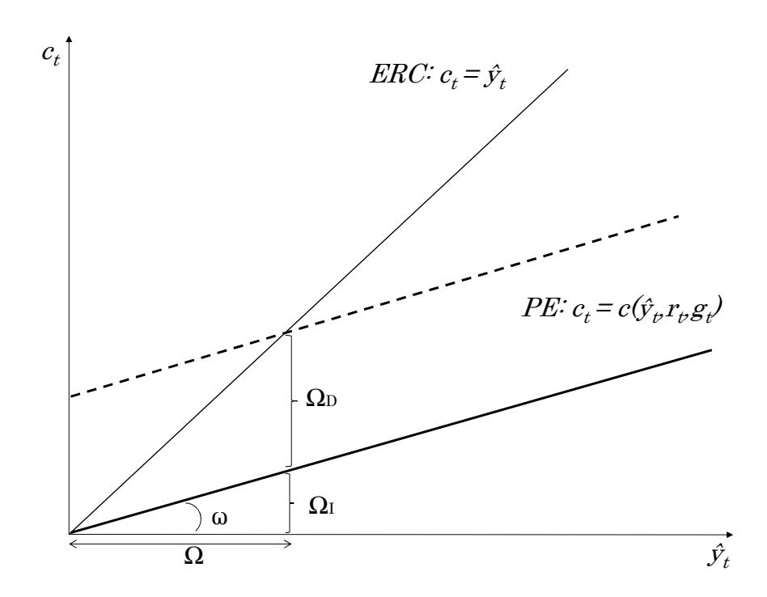

# 第2章：代表的エージェント・ニューケインジアン・モデル——ケインジアン・クロスによる再解釈

本章では、Woodford（**2003年**）およびGalí（**2008年**）の基本文献で概説された代表的エージェント・ニューケインジアン（**RANK**）モデルの簡略版を取り上げるが、その主要な限界を浮き彫りにするやや異なる視点からこのモデルを考察する。その基礎となるのは、所与の実質利子率の下での（**新**）ケインジアン・クロス、すなわち消費関数のレンズを通じたRANKモデルの再解釈である。特に断りのない限り、考察する全てのモデルにおいて、価格は粘着的であり産出は需要決定的であると仮定する。総需要側の役割を分離するため、実質利子率の決定メカニズムを捨象し、中央銀行がこれを制御すると仮定する。Bilbiie（**2008年、2011年、2020年**）と同様に、これは固定価格のケース、あるいは名目利子率 $i_t$ を期待インフレ $\pi_t$ を相殺するように設定するテイラー・ルール（**対数偏差で $i_t = E_t \pi_{t+1} + r_t$、したがって事実上実質利子率 $r_t$ を制御**）のケースに対応する。

このモデルはニューケインジアン動学的確率的一般均衡（**DSGE**）モデル[^dsge]として記述されるが、本章のケインジアン・クロス表現は、このモデルが実際にはあまり「ケインズ的」でないことを示す。モデルは現在の所得にほとんど反応しない消費関数を生成し、反事実的に低い限界消費性向（**MPC**）をもたらす。さらに、モデルにおける金融政策の効果はほぼ全て利子率変化の部分均衡的な直接効果から生じる。これは、モデルが事実上「一般均衡」効果をほとんど持たないことを意味する。

[^dsge]: **訳注**: 動学的確率的一般均衡（Dynamic Stochastic General Equilibrium: DSGE）モデル。ミクロ経済学的な基礎（家計の効用最大化や企業の利潤最大化）に基づき、マクロ経済の動学的な変動やショックへの反応を分析する枠組み。

加えて、RANKモデルはいくつかの逆説的で反直感的な結果を生む。本章では特に、フォワード・ガイダンス・パズル、およびアウトプット・ギャップと供給ショックの負の共変動を取り上げる。

## RANK：なぜ超える必要があるのか[^2]

完全市場のRANKモデルでは、代表的消費者は以下の最大化問題を解く：
$$
\max E_0 \sum_{t=0}^{\infty} \beta^t U(C_t^j, N_t^j)
$$
制約条件：$Z_{t+1}^j + \Theta_{t+1}^j V_t \leq B_t^j + \Theta_t^j (V_t + P_t D_t) + W_t N_t^j - P_t C_t^j$

ここで $Z_{t+1}^j$ は家計 $j$ の $t$ 期末の完備な状態依存資産の名目ポートフォリオ（**株式を除く**）を、$B_t^j$ は期初資産を表す。$\Theta_t^j$ は家計が $t$ 期に保有する株式数であり、株式は平均市場価値 $V_t$ を持ち、実質配当 $D_t$ を支払う。

資産の無裁定条件は、確率的割引因子 $Q_{t,t+1}^{j}$ の存在を含意する：
$$
\frac{Z_{t+1}^j}{P_t} = E_t \left[ Q_{t,t+1}^j \frac{B_{t+1}^j}{P_{t+1}} \right] \quad \text{かつ} \quad \frac{V_t}{P_t} = E_t \left[ Q_{t,t+1}^j \left(\frac{V_{t+1}}{P_{t+1}} + D_{t+1}\right) \right].
$$

1期物無リスク実質債券のリターンとして、粗実質利子率を定義できる：
$$
\frac{1}{R_t} = E_t Q_{t,t+1}^j.
$$

均衡では全エージェントが一定割合の株式 $\Theta^j$ を保有するため、株式取引は生じない（**集計では1に等しい**）。無裁定条件をフロー予算制約に代入し、状態ごとの「自然な」借入制約[^natural-borrowing-limit]（$Z_t^j = 0$）を課すと、異時点間予算制約（**IBC**）が得られる：

[^natural-borrowing-limit]: **訳注**: 自然な借入制約（Natural borrowing limit）とは、将来のどのような所得の実現パスにおいても、消費者が破産しない（予算制約を満たせる）ように借入額の上限を定める制約のことである。
$$
E_t \sum_{i=0}^{\infty} Q_{t,t+i}^j C_{t+i}^j \le E_t \sum_{i=0}^{\infty} Q_{t,t+i}^j Y_{t+i}^j,
$$
ここで所得は金融（**配当**）所得と労働所得の合計として定義される：
$$
Y_{t+i}^{j} \equiv \Theta^{j} D_{t+i} + \frac{W_{t+i}}{P_{t+i}} N_{t+i}.
$$

[^2]: RANKモデルとケインジアン・クロス表現の完全な導出についてはBilbiie（**2020年**）を参照。

異時点間予算制約は、期待割引消費が労働と株式からの期待総所得を超えてはならないことを述べている。消費者はIBCの下で効用を最大化するように消費を選択する。これにより、各日付・各状態について以下が得られる：
$$
\beta \frac{U_c(C_{t+1}^j)}{U_c(C_t^j)} = Q_{t,t+1}^j.
$$
1期物債券の無裁定条件を代入すると、オイラー方程式が得られる：
$$
\frac{1}{R_t} = \beta E_t \left[ \frac{U_c(C_{t+1}^j)}{U_c(C_t^j)} \right].
$$

ケインジアン・クロス表現を得るために、確率的割引因子を対数線形化する。これにより以下が得られる：[^3]
$$
q_{t,t+i}^j = \ln\left(\frac{U_c(C_{t+i}^j)}{U_c(C_t^j)}\right) = -\sigma^{-1}(c_{t+i}^j - c_t^j),
$$
ここで小文字の変数は定常状態からの対数偏差を表す。オイラー方程式の対数線形化により以下が得られる：
$$\begin{aligned}
c_t &= E_t c_{t+1} - \sigma r_t\\
 &= E_t c_{t+1} + \sigma E_t q_{t,t+1}^j.
\end{aligned}$$

[^3]: 完全な導出は付録およびNKクロス論文Bilbiie（**2020年**）とその付録に記載。

対数線形化されたオイラー方程式を対数線形化されたIBCに代入すると、エージェント $j$ の消費関数が得られ、消費は現在・将来の実質利子率および産出の線形関数として表される：
$$
c_t^j = -\sigma\beta \sum_{i=0}^{\infty} \beta^i E_t r_{t+i} + (1-\beta) \sum_{i=0}^{\infty} \beta^i E_t y_{t+i}.
$$
再帰的形式では以下のように与えられる：
$$
c_t^j = (1 - \beta)y_t^j - \sigma\beta r_t + \beta E_t c_{t+1}^j.
$$
この消費関数から、純粋に一時的な所得変化に対する限界消費性向（**MPC**）は $1 - \beta$ に等しいことが明らかである。

ケインジアン・クロス表現は、持続的ショックの消費への効果を示すためにも使用できる。RANKモデルは合理的期待を仮定し、内生的状態変数を持たないため、モデルは純粋に前方展望的である。したがって、消費期待関数を以下のように表現できる：
$$
E_t c_{t+1}^j = p c_t^j,
$$
ここで $p$ は定常状態からの逸脱の持続度を表す外生的パラメータである。これを消費関数に代入すると、持続的ショックに対する均衡PE曲線が得られる：
$$
c_t = \frac{1 - \beta}{1 - \beta p} y_t - \frac{\sigma \beta}{1 - \beta p} r_t.
$$

中央銀行が持続性 $p$ の実質利子率引き下げを実施するケースを考える。このショックの効果を分析するために、旧来のケインジアン・クロスの精神に基づく四つの項を定義することが有用である。

第一に、$\omega$ はPE曲線の傾きである。異質的エージェント・モデルでは*集計*MPCに対応する。RANKモデルでは代表的消費者のMPCである。ここでは以下に等しい：
$$
\omega = \frac{1 - \beta}{1 - \beta p}.
$$

$\Omega_D$ はPE曲線のシフト量を与える。これは政策実施時に所得を一定に保った場合の利子率変化の消費への直接効果である。この単純なRANKモデルでは、$\Omega_D$ は利子率が低下した際に家計が「貯蓄を取り崩して」今期の消費を増やそうとする異時点間代替の効果に相当する。
$$
\Omega_D \equiv \frac{dc_t}{d(-r_t)}\Big|_{y_t = \bar{y}}
$$

政策変更の消費への総効果は乗数 $\Omega$ で与えられる。これは総需要への均衡効果である。利子率の引き下げはPE曲線[^pe]を $\Omega_D$ だけ上方にシフトさせる。家計は貯蓄の取り崩しができないため（**ここでは債券はネット・ゼロ供給であり、代表的家計はネット貯蓄者にもネット借入者にもなれない**）、増加した消費需要を満たすために均衡において所得が上昇しなければならない。[^4] この所得の増加により、家計は消費需要を $\omega\Omega_D$（**MPCと所得変化の積**）だけ増加させる。これはさらなる所得増加と $\omega^2\Omega_D$ に等しいさらなる消費需要の増加をもたらす。得られる無限級数を合計すると、消費への均衡効果が得られる：

[^pe]: **訳注**: PE曲線とは、部分均衡（Partial Equilibrium）における消費関数のこと。ここでは、利子率を所与としたもとでの所得の変化に対する消費の反応を表している。
$$
\Omega = \frac{\Omega_D}{1 - \omega},
$$
これは旧来のケインジアン・クロスの乗数と密接に対応する。

[^4]: 所得の増加は、硬直的な価格を持つ企業が異時点間代替からの追加的消費需要を満たすためにより多くの労働を雇用するために賃金を引き上げることで生じる。

$\Omega_I$ を政策変更の間接効果として定義することも有用である。これは実質利子率を一定に保った場合の効果、すなわち総乗数効果と直接効果の差である：
$$
\Omega_I \equiv \frac{dc_t}{d(-r_t)}\Big|_{r_t = \bar{r}} = \Omega - \Omega_D.
$$
ここから、$\omega$ が政策の総均衡効果に占める間接効果の割合を表すことも明らかである：
$$
\omega \equiv \frac{\Omega_I}{\Omega}.
$$
MPCが上昇するにつれて、ショックへの均衡消費反応の生成において間接効果が直接効果に対してより大きな役割を果たす。間接効果は実質的に、金融政策変更への反応のうち「ケインズ的」と特徴づけられる部分の比率である。

このショック効果の分解は図で示される。$\omega$ はPE曲線の傾きに、$\Omega_D$ はシフトに対応する。

### 総需要増幅の欠如

上記のケインジアン・クロス表現は、RANKモデルにおける金融政策ショックの総需要増幅の欠如を明確に示している。内生的増幅に焦点を当てるため、$p = 0$ のi.i.d.のケースを取り上げる。

$\beta$ が1に近いため、モデルはほぼゼロの集計MPC（$\omega = 1 - \beta$）を与える。これはPE曲線がフラットであり、モデルが金融政策からの一般均衡（**間接**）効果をほとんど生成しないことを意味する。モデル内の家計は現在の所得変化にほとんど反応せず、金融政策の効果のほぼ全ては異時点間代替（**PE曲線の直接シフト：$\Omega_D = \sigma\beta \approx \sigma = \Omega$**）によって駆動される。ケインジアン・クロスの用語では、モデルは「シフトのみで、傾きがない」状態である。これはMPCと異時点間代替弾力性に関するミクロ・データと矛盾する。ミクロ・データによれば $\sigma$ は一般にゼロに近く、直接効果だけでは観測される金融政策への消費反応を生み出すのに十分な大きさではない。

家計の所得変化への無反応性と間接効果の欠如は、ニューケインジアン・モデルが「ケインズ的」なモデルでも「一般均衡的」なモデルでもないことを意味する。これらは、二エージェント・ニューケインジアン（**TANK**）モデルおよび異質的エージェント・ニューケインジアン（**HANK**）モデルがRANKのケースと大きく異なる二つの次元である。

### 財政乗数

RANKモデルのケインジアン・クロス表現を用いて、政府支出の産出と消費への効果を分析することもできる。政府が税で賄われる一時的な政府支出増加を導入するとする：$g_t = t_t$。

産出 $y_t$ を可処分所得 $\hat{y}_t - t_t$ に置き換えると、PE曲線は以下に等しい：
$$
c_t = (1 - \beta)\hat{y}_t - \sigma\beta r_t + \beta E_t c_{t+1}.
$$

財市場均衡は以下を要求する：
$$
y_t = c_t + g_t.
$$
PE曲線の政府支出変化に対する微分はゼロである。これは、固定価格下の財政乗数が以下で与えられることを意味する（Bilbiie（**2011年**）; Woodford（**2011年**））：
$$
\mathcal{M} \equiv \frac{dy_t}{dg_t} = 1.
$$

政府支出が増加しても消費が変化しないというこの結果も、あまりケインズ的ではない。さらに、ニューケインジアン・フィリップス曲線による粘着価格を導入すると、乗数は1未満になる。これは、政府支出がこのフレームワークではインフレ効果を持ち、中央銀行が利上げによって総需要を引き締めることで対応するためである。消費への負の乗数は実証研究とも矛盾する（例えばBlanchard and Perotti（**2002年**）; Perotti（**2008年**）; Ramey（**2011a年, 2011b年, 2016年**）; Ramey and Zubairy（**2018年**）; Hall（**2009年**）を参照）。

### フォワード・ガイダンス・パズル

総需要増幅がほとんど生じないことに加え、RANKモデルのもう一つの弱点は、いくつかのパズルや逆説の存在である。その最初の例がフォワード・ガイダンス・パズル（**FGパズル**）である（Del Negro et al.（**2012年**）を参照）。中央銀行が将来のある期に名目利子率を引き下げると約束するとする。RANKモデルでは、この約束された利下げがより遠い将来になるほど、現在の消費への効果が大きくなる。これは、中央銀行が非常に遠い将来に利下げすると約束することで今日のより大きな消費変化を誘発できるという、明らかに反事実的な結果を生む。

FGパズルは、以下の静学フィリップス曲線を持つ単純なRANKモデルで示すことができる[^5]：
$$
\pi_t = \kappa c_t,
$$
ここで $\kappa$ はインフレの消費変化に対する弾力性である。これをオイラー-IS方程式に代入すると以下が得られる：
$$
c_t = E_t c_{t+1} - \sigma(i_t - E_t \pi_{t+1}) = v_0 E_t c_{t+1} - \sigma i_t,
$$
ここで
$$
v_0 \equiv 1 + \kappa \sigma \ge 1.
$$

$v_0$ は期待将来消費の変化に対する消費の弾力性である。これは中央銀行が名目利子率ペッグを使用する場合（**すなわち中央銀行が期待インフレに対して単位係数のテイラー・ルールに従う場合**）の、新しいショックの総需要への効果である。決定的に重要なのは、異時点間代替弾力性 $\sigma$ とインフレの消費弾力性 $\kappa$ が非負であるため、$v_0$ は1以上となることである。

オイラー方程式を $T$ 期先まで反復すると、以下が示される：
$$
c_t = v_0^T E_t c_{t+T} - \sigma \sum_{j=0}^{T-1} v_0^j E_t i_{t+j}.
$$

$v_0 > 1$ のとき、$v_0^j$ は $j$ について狭義単調増加となる。これは、利子率の予想変化が将来の遠い時点で生じるほど消費への効果が大きくなることを意味する。中央銀行が非常に遠い将来に利下げすると約束する場合にフォワード・ガイダンスはより強力なツールとなる。これがRANKモデルの重要な反事実的帰結である。

[^5]: FGパズルは前方展望的NKPCを用いても依然として存在するが、結果を導くためにそれは必要ではない。

価格が固定されている場合、$\kappa = 0$ であり $v_0 = 1$ となる。このシナリオでもFGパズルは依然として存在する。ここでは、中央銀行がどれほど遠い将来に名目利子率を引き下げると約束しても、フォワード・ガイダンスは常に同じ効果を持つ。

### 供給ショック

RANKモデルが反事実的な結果を生む第二の領域は、供給ショックに対するアウトプット・ギャップ[^output-gap]の反応である。RANKモデルでは、全要素生産性（**TFP**）への正のショックが負のアウトプット・ギャップをもたらす。これは反直感的であり、中央銀行が正の供給ショックに対して拡張的金融政策で対応することを要求する。

[^output-gap]: **訳注**: アウトプット・ギャップとは、実際の産出量と、価格が完全に伸縮的であると仮定した場合の潜在的な産出量（自然産出水準）との差を指す。

この結果の直感は、非常に単純なRANKスタイルのフレームワーク内で示すことができる。産出が規模に関して収穫一定の生産技術で生産されるとする：
$$
Y_t = A_t L_t,
$$
ここで $A_t$ はTFPを表す。対数効用の下での柔軟価格の「自然」産出水準は以下に等しい[^6]：
$$
Y_t^* = A_t \bar{L}.
$$

簡単のため、価格は固定されており中央銀行はマネー・ルールに従うとする：
$$
Y_t = \frac{M}{P}.
$$

[^6]: 対数効用の下では所得効果と代替効果が相殺され、価格が柔軟な場合に家計は一定量の労働を供給する。

価格が固定されているため、均衡産出は需要決定的であり、中央銀行のマネーサプライの選択が $Y_t$ を決定する。したがって、経済が負のTFPショック（$A_t$ の低下）に見舞われても、均衡産出は低下しない。これは、家計が生産性の低下を補うためにより多く働くことを要求する。この追加的労働供給は利潤の低下により誘発され、家計がより貧しくなったと感じることで労働供給への正の所得効果が生じる。したがって、この単純なRANKモデルは反循環的な労働時間を生み、負の供給ショックが家計により多くの労働を供給させる。

さらに、モデルはアウトプット・ギャップ（$Y_t - Y_t^*$ として定義）と供給ショックの間に負の共変動を生む。負の供給ショックが発生すると、上記の所得効果により均衡産出は不変である。しかし、生産性の低下と柔軟価格下の労働供給が固定されている事実により、柔軟価格の産出水準は低下する。これはアウトプット・ギャップが拡大することを意味する。したがって、この単純なRANKモデルは、中央銀行が負の供給ショックに対して金融引き締めで最適に対応すべきであることを示唆する（**これは反直感的な結果である**）。[^7]

[^7]: Bilbiie and Melitz（**2020年**）は、製品バラエティの内生的参入と退出を導入することで、供給ショックとアウトプット・ギャップの負の共変動を逆転させる。

### 文献ノート

標準的なニューケインジアン・モデルを「消費関数」すなわちケインジアン・クロスのレンズを通じて——外生的実質利子率の下で——再解釈するという出発点は、Bilbiie（**2020年**）から直接借用したものであり、それはRANKにおける消費関数の、私の知る限り最初の導出であるPreston（**2005年**）に基づいている。固定価格または所与の実質利子率の下での単位財政乗数の基準的結果は、Bilbiie（**2011年**）とWoodford（**2011年**）による。前者の論文は正の乗数を生み出す消費-労働の補完性の役割を強調し、後者はゼロ下限の役割を強調した（流動性の罠に関する章でのその文献の詳細な議論を参照）。

### 要約

代表的エージェント・ニューケインジアン・モデルは現代マクロ経済学における偉大な進化であり、過去20年間にわたり金融経済学の文献の多くが依拠してきた主要なフレームワークとして機能してきた。しかし、本章はモデルがいくつかの重要な欠点を持つことを示した。RANKモデルのケインジアン・クロス表現は、モデルが実際にはケインズ的ではなく、需要ショックの一般均衡増幅も欠如していることを明らかにした。モデルはまた、いくつかのパズルや逆説を生み、フォワード・ガイダンス・パズル、および供給ショックとアウトプット・ギャップの負の共変動は、特に反直感的な結果の例である。

ニューケインジアン・モデルは以降の章の分析の基礎として機能するが、異質性の導入により、これらの欠点から脱却することが可能になる。

## 参考文献

- Florin O. Bilbiie. Limited Asset Markets Participation, Monetary Policy and (Inverted) Aggregate Demand Logic. Journal of Economic Theory, 140(1):162–196, 2008. doi: 10.1016/j.jet.2007.06.010.
- Florin O Bilbiie. Nonseparable preferences, frisch labor supply, and the consumption multiplier of government spending: One solution to a fiscal policy puzzle. Journal of Money, Credit and Banking, 43(1):221–251, 2011.
- Florin O. Bilbiie. The new keynesian cross. Journal of Monetary Economics, 114:90–108, 2020. doi: 10.1016/j.jmoneco.2020.04.009.
- Florin O Bilbiie and Marc J Melitz. Aggregate-demand amplification of supply disruptions: The entry-exit multiplier. 2020.
- Olivier Blanchard and Roberto Perotti. An empirical characterization of the dynamic effects of changes in government spending and taxes on output. the Quarterly Journal of economics, 117(4):1329–1368, 2002. doi: 10.1162/003355302320935043.
- Marco Del Negro, Marc Giannoni, and Christina Patterson. The forward guidance puzzle. Staff Report 574, Federal Reserve Bank of New York, 2012.
- Jordi Galí. Monetary Policy, Inflation, and the Business Cycle: An Introduction to the New Keynesian Framework and Its Applications. Princeton University Press, Princeton, NJ, 1 edition, 2008.
- Robert E. Hall. By how much does gdp rise if the government buys more output? Brookings Papers on Economic Activity, (2):183–231, 2009.
- Roberto Perotti. In search of the transmission mechanism of fiscal policy. In Daron Acemoglu, Kenneth Rogoff, and Michael Woodford, editors, NBER Macroeconomics Annual 2007, volume 22, pages 169–226. University of Chicago Press, 2008. doi: 10.1086/587899.
- Bruce Preston. Adaptive learning in infinite horizon decision problems. Mimeo, Columbia University, 2005.
- Valerie A. Ramey. Can government purchases stimulate the economy? Journal of Economic Literature, 49(3):673–685, 2011a. doi: 10.1257/jel.49.3.673.
- Valerie A. Ramey. Identifying government spending shocks: It's all in the timing. The Quarterly Journal of Economics, 126(1):1–50, 2011b. doi: 10.1093/qje/qjq008.
- Valerie A. Ramey. Macroeconomic shocks and their propagation. In John B. Taylor and Harald Uhlig, editors, Handbook of Macroeconomics, volume 2A, pages 71–162. Elsevier, 2016. doi: 10.1016/bs.hesmac.2016.03.003.
- Valerie A. Ramey and Sarah Zubairy. Government spending multipliers in good times and in bad: Evidence from u.s. historical data. Journal of Political Economy, 126(3):850–901, 2018. doi: 10.1086/697257.
- M Woodford. Interest and prices: Foundations of a theory of monetary policy, 2003.
- Michael Woodford. Simple analytics of the government expenditure multiplier. American Economic Journal: Macroeconomics, 3(1):1–35, 2011. doi: 10.1257/mac.3.1.1.
