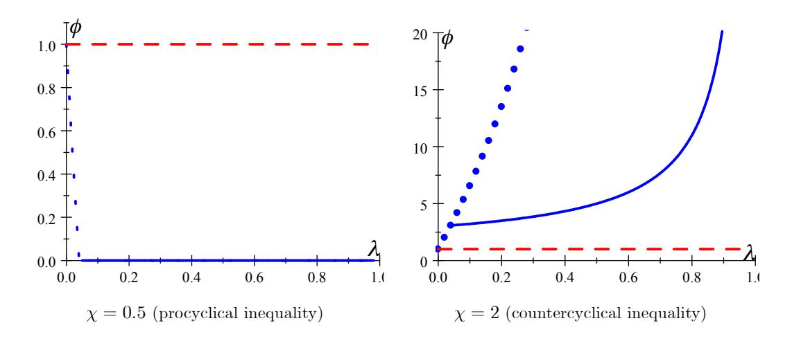
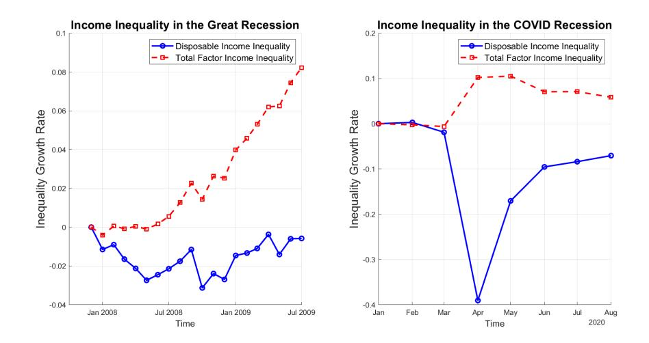

# 第4章：リスクと予備的貯蓄——THANK：扱いやすい異質的エージェント・ニューケインジアン・モデル[^1]

[^1]: 本章は、国際通貨基金、欧州中央銀行調査局、ノルウェー銀行、パリ経済学院（サマースクールおよびAPEプログラム）、ブラウン大学、HECローザンヌ、ボン大学院経済学研究科、ゲーテ大学、ケンブリッジ大学における上級ミニコースの講義ノートに基づく。講義の文字起こしと草稿作成に優れたRA業務を提供してくれたSean Lavenderに感謝する。

前章で導入したTANKモデルは、より豊かなHANKモデルの主要な特徴の多くを再現することを可能にする。しかし、その構造上、TANKモデルは固有リスクや自己保険を備えていない。本章では、扱いやすい異質的エージェント・ニューケインジアン（**THANK**）モデル[^thank]——二状態・二資産の単純なモデル——を導入する。このモデルはTANKを拡張し、これらのチャネルを捉えてその重要性を定量化できる。次いで、このモデルを用いて決定性、フォワード・ガイダンス・パズル、およびショックの増幅・減衰を含む完全なニューケインジアン分析を行う。

[^thank]: **訳注**: THANK（Tractable Heterogeneous-Agent New Keynesian）モデル。TANKモデルに固有リスク（家計が手元消費状態と貯蓄者状態の間を確率的に遷移する）と予備的貯蓄動機を加えることで、HANKモデルの主要メカニズムを解析的に扱えるようにした枠組み。

# 二状態・二資産THANKモデルの構成要素

TANKと同様に、THANKモデルには二つの状態がある。家計は手元消費（**H**）家計か貯蓄者（**S**）家計のいずれかである。モデルは、以下の外生的マルコフ遷移行列に従って家計が状態間を遷移することを許容し、固有の不確実性を扱いやすい形で導入する：
$$
\begin{pmatrix} h & 1-h \\ 1-s & s \end{pmatrix}.
$$

手元消費家計は次期も確率 $h$ で手元消費のままであり、確率 $1-h$ で貯蓄者になる。貯蓄者は確率 $1-s$ で次期に手元消費家計となり、確率 $s$ で貯蓄者にとどまる。経済は定常分布に到達しており、手元消費家計である非条件付き確率は以下に等しいと仮定する：
$$
\lambda = \frac{1-s}{2-s-h}.
$$

モデルの扱いやすさを保つため、Bilbiieが採用した仮定の組み合わせをそのまま踏襲する。これはLucas (1990) およびShi (1997) の先駆的な貨幣理論の伝統に従うものである[^2]。 家計はタイプ内では完全保険を持つが、タイプ間では限定的な保険しか利用できない。異なるタイプの家計は異なる「島」に住んでいると考えることができる。各期の初めに、リスク共有に限界がある全家計の功利主義的・等ウェイトの異時点間厚生を最大化する家長が、島の資源をプールし、家計のために最適な消費・貯蓄の選択を行う。ポートフォリオの選択後に固有の不確実性が実現し、家計は島の間を移動する。

[^2]: 最も近い先行研究はBilbiie and Ragot (2021) であり、そこでは債券が非流動的で貨幣が自己保険に用いられ、最適政策が研究された。異質性を縮小し資産分布を状態変数から除去する他の方法は、Challe et al. (2017)、Heathcote and Perri (2018) も拡張している。遷移する二タイプを持つNKモデルはCúrdia and Woodford (2016) やNistico (2015) でも研究されたが、保険の構造が異なる。

経済には二つの資産が存在する。第一に、家計は一期間債券で貯蓄できる。これらの債券は流動的であり、家計が島の間を移動する際に持ち運ぶことができる。したがって、債券は固有リスクに対する自己保険に利用できる。逆に、独占的競争企業の株式はS家計のみが保有する。株式は非流動的であり、自己保険に利用できない[^3]。 まず、債券が価格付けされるが取引されない流動性ゼロのモデルを考える。それにもかかわらず、債券の存在は家計の予備的貯蓄動機[^precautionary]を捉える上で依然として不可欠である。

[^3]: 株式は事実上、Kaplan et al. (2018) が導入した非流動的資産の極端なケースと見なすことができる。

[^precautionary]: **訳注**: 予備的貯蓄動機（precautionary saving motive）。将来の所得に関する不確実性に対処するため、不確実性がない場合に比べて追加的に貯蓄を行おうとする動機。

島の間の債券の流れは以下の方程式で要約される。ここで $B^j_{t+1}$ は不確実性の実現後に期首 $t+1$ で島 $j$ に保有される債券を、$Z^j_{t+1}$ は不確実性の実現前に期末 $t$ で島 $j$ の家計が選択した債券を表す：
$$\begin{aligned}\underbrace{(1-\lambda)B^S_{t+1}}_{\text{島Sの債券}} &= \underbrace{s(1-\lambda)Z^S_{t+1}}_{\text{Sにとどまる者が選んだ債券}} + \underbrace{(1-h)\lambda Z^H_{t+1}}_{\text{Sになる元H家計が選んだ債券}}\\
\underbrace{\lambda B^H_{t+1}}_{\text{島Hの債券}} &= \underbrace{h\lambda Z^H_{t+1}}_{\text{Hにとどまる者が選んだ債券}} + \underbrace{(1-s)(1-\lambda)Z^S_{t+1}}_{\text{Hになる元S家計が選んだ債券}}
\end{aligned}$$
スケーリングし $\lambda$ の定義を用いると：
$$\begin{aligned}
B_{t+1}^{S} &= sZ_{t+1}^{S} + (1-s)\lambda Z_{t+1}^{H}\\
B_{t+1}^{H} &= hZ_{t+1}^{H} + (1-h)Z_{t+1}^{S}.
\end{aligned}$$

### 家長の最適化

タイプ内で資源がプールされるとき、家長の問題は、予算制約、上で導出した債券の運動法則、および借入不可条件を制約として、効用を最大化するような消費と貯蓄を選択することである。
$$
W(B_t^S, B_t^H, \Theta_t) = \max_{C_t^S, Z_{t+1}^S, \Theta_{t+1}, C_t^H, Z_{t+1}^H} (1 - \lambda) U(C_t^S) + \lambda U(C_t^H) + \beta E_t W(B_{t+1}^S, B_{t+1}^H, \Theta_{t+1})
$$
制約条件:
$$\begin{aligned}
C_t^S + Z_{t+1}^S + v_t \Theta_{t+1} &= Y_t^S + R_t B_t^S + \Theta_t (v_t + D_t) \\
C_t^H + Z_{t+1}^H &= Y_t^H + R_t B_t^H \\
B_{t+1}^S &= s Z_{t+1}^S + (1 - s) \lambda Z_{t+1}^H \\
B_{t+1}^H &= h Z_{t+1}^H + (1 - h) Z_{t+1}^S \\
Z_{t+1}^S, Z_{t+1}^H &\geq 0.
\end{aligned}$$

最大化の一階条件は、標準的なBewley-Aiyagari-Huggettクラスの異質的エージェント・モデルのものに類似する。非流動的株式の選択に関するクーン・タッカー条件は：
$$U'(C_t^S) \ge \beta E_t \left\{ \frac{v_{t+1} + D_{t+1}}{v_t} U'(C_{t+1}^S) \right\}$$
かつ $\Theta_{t+1} = \Theta_t = (1 - \lambda)^{-1}$ である。

SおよびHの貯蓄決定に関するクーン・タッカー条件は：
$$\begin{aligned}
U'(C_{t}^{S}) &\geq \beta E_{t} \left\{ R_{t+1}[sU'(C_{t+1}^{S}) + (1-s)U'(C_{t+1}^{H})] \right\}\\
\mathrm{and}\quad 0 &= Z_{t+1}^{S}\left[U'(C_{t}^{S}) - \beta E_{t} \left\{ R_{t+1}[sU'(C_{t+1}^{S}) + (1-s)U'(C_{t+1}^{H})] \right\}\right]\\
U'(C_{t}^{H}) &\geq \beta E_{t} \left\{ R_{t+1}[(1-h)U'(C_{t+1}^{S}) + hU'(C_{t+1}^{H})] \right\}\\
\mathrm{and}\quad 0 &= Z_{t+1}^{H}\left[U'(C_{t}^{S}) - \beta E_{t} \left\{ R_{t+1}[(1-h)U'(C_{t+1}^{S}) + hU'(C_{t+1}^{H})] \right\}\right].
\end{aligned}$$

ここではH家計が債券での貯蓄を行わない（$Z^H_{t+1} = 0$）均衡に注目する。この場合、Hの一階条件は厳密な不等式で成立する。これは例えば、H家計の $\beta$ に負のショックが生じ、将来を十分に低く評価するためゼロ貯蓄が正当化されるケースによる。その結果、H家計は所得に対する限界消費性向（**MPC**）が1となり、債券は自己保険オイラー方程式に従ってS家計により価格付けされる：
$$(C_t^S)^{-\frac{1}{\sigma}} = \beta E_t \left\{ (1+r_t) \left[ s(C_{t+1}^S)^{-\frac{1}{\sigma}} + (1-s)(C_{t+1}^H)^{-\frac{1}{\sigma}} \right] \right\}.$$
確率 $(1-s)$ は貯蓄者が直面する固有の所得リスクを表す。したがって、家計は異時点間代替だけでなく、異なる状態間での消費の平滑化のためにも貯蓄しようとする。この追加的な動機が予備的貯蓄動機である。これは家計が固有リスクに直面しない（$s=1$）TANKモデルには存在しない。

# 所得不平等とリスク：循環性[^4]

THANKモデルの重要な側面は、所得不平等と所得リスクの区別である。所得不平等は二つのタイプの家計の所得の比として定義できる：
$$\Gamma_t(Y_t) \equiv \frac{Y_t^S}{Y_t^H},$$
これはジニ係数や一般化エントロピーなどの不平等指標と密接に関連する概念である。

モデルにおける所得リスクは、手元消費家計になるリスク、すなわち確率 $1-s$ に由来する。循環的な所得リスクを導入するため、この確率が将来の集計所得とともに変化することを許容できる：
$$1 - s(Y_{t+1}).$$
$s(Y_{t+1})$ の微分を $s^Y$ と定義すると、$1-s(Y_{t+1})$ の産出に関する微分は $-s^Y$ で与えられる。したがって、$s^Y > 0$ のとき、集計所得が上昇すると手元消費家計になる確率が低下するためリスクは反循環的である。$s^Y < 0$ のとき、リスクは順循環的である。

[^4]: 分散の完全な導出はBilbiie (2018) の補論にある。

THANKモデルは所得の条件付き分散について単純な解析的表現を与える。これは文献においてしばしば所得リスクの尺度として用いられる。今期貯蓄者であることを条件としたとき、対数所得の分散は以下で与えられる：
$$\text{var}(\ln Y_{t+1}^S | \ln Y_t^S) = s(Y_{t+1})(1 - s(Y_{t+1}))(\ln \Gamma_{t+1})^2.$$

この量の循環性は産出に関する微分を取ることで求められる：
$$\frac{d(\text{var})}{dY} = \frac{1-s}{Y} \left\{ \underbrace{\frac{-s_Y}{1-s} (2s-1)(\ln \Gamma)^2}_{\text{純粋リスク、歪度}} + \underbrace{\frac{\Gamma_Y Y}{\Gamma} s \ln(\Gamma)^2}_{\text{不平等}} \right\}.$$

上に示したように、所得リスクの循環性は二つの構成要素に分離できる。第一項は純粋リスク、すなわち分布の歪度に由来する成分である。$s > \frac{1}{2}$ のとき、手元消費家計になるリスクは左の裾にある（**負の歪度**）。$s^Y > 0$ ならば、手元消費家計になる確率は景気拡大期に低下し不況期に上昇する。これは第一成分が負となることにつながり、純粋リスクが反循環的であることを示す。第二項は所得不平等の循環性（**$\chi - 1$ で捉えられる**）に関連する。$\Gamma^Y < 0$ のとき、所得不平等は反循環的である。これは所得リスクをより反循環的にし、手元消費家計の所得が不況期と拡大期の両方で集計所得と1対1以上に動くことを意味する。

所得リスクの循環性に関するいくつかの重要な性質に注意すべきである。第一に、$s = 1$ のとき所得リスクは存在しない。これは家計が状態間を移動できないTANKモデルのケースである。$s = 0$ のときも所得リスクは存在しない。この場合、家計は単純に状態間を往復し、定常的な質量は $\lambda = \frac{1}{2}$ となる。$\Gamma = 1$ のとき、所得水準の不平等は存在せず、所得リスクは一次近似において非循環的である。不平等が非循環的（$\Gamma^Y = 1$）のとき、第二のチャネルは作用せず、所得リスクの循環性は純粋リスク成分のみによって駆動される。逆に、$s^Y = 0$ のとき、純粋リスク成分は作用せず、所得リスクの循環性は不平等チャネルによって決定される。

### THANKにおける集計需要

THANKモデルの残りの部分は前章で研究したTANKモデルと同じである。流動性ゼロかつ一定の遷移確率（$s^Y = 0$）のモデルを利潤ゼロの定常状態の周りで対数線形化すると、各家計タイプの消費について同じ方程式が得られる：
$$\begin{aligned} c_t^H &= \chi y_t\\
c_t^S &= \frac{1 - \lambda \chi}{1 - \lambda} y_t. \end{aligned}$$
自己保険オイラー方程式を対数線形化すると：
$$c_t^S = sE_t c_{t+1}^S + (1-s)E_t c_{t+1}^H - \sigma r_t.$$
$c^S_t$ と $c^H_t$ を自己保険オイラー方程式に代入すると、THANKモデルの**集計オイラー方程式**が得られる：
$$c_{t} = \underbrace{\left[1 + (\chi - 1)\frac{1 - s}{1 - \lambda \chi}\right]}_{\equiv \delta} E_{t} c_{t+1} - \sigma \underbrace{\frac{1 - \lambda}{1 - \lambda \chi}}_{\text{TANK}} r_{t}.$$

第一に、実質利子率の係数はTANKモデルの集計オイラー方程式のものと同一であることに注目しよう。TANKと同様に、THANKモデルは所得不平等が反循環的（$\chi > 1$）であるときに限り、RANKに対して同時的な消費反応を増幅する。THANKモデル固有の貢献は期待将来消費の係数 $\delta$ である。TANKとRANKはともに期待将来消費に対して単位係数を持ち、集計消費が期待される将来の消費増加と1対1で上昇することを示す。THANKモデルでは $\delta$ が1より大きくも小さくもなりうる。したがって、THANKはTANKに対して**複利化**（compounding）または**割引化**（discounting）のいずれかを生成できる。

$\chi > 1$ のとき、$\delta > 1$ でもある。家計が将来の集計消費の上昇を予想すると、将来制約される（手元消費状態になる）リスクに直面することを認識する。しかし、所得不平等が反循環的であるため、手元消費家計の所得は集計所得以上に上昇する。これは家計の予備的貯蓄動機を弱め、期待される将来の増加以上に消費を増やすことで対応させる。したがって、THANKモデルは $\chi > 1$ のときに限り、TANKに対して複利化を生成する。

$\chi < 1$ のとき、$\delta < 1$ である。この場合、家計は手元消費家計の所得が将来の集計所得の増加よりも少なく上昇することを知っている。これは予備的貯蓄を促し、手元消費家計になる可能性に対して自己保険を行うために、家計は期待される将来の増加よりも少なく現在の消費を増やす。したがって、THANKモデルは $\chi < 1$ のときに限り割引化を生成する。

ニュース・ショックの効果の複利化・割引化は、必ずしも循環的リスクの産物ではない。上で議論したモデルでは、流動性ゼロと利潤ゼロの定常状態により、定常状態の所得不平等は $\Gamma = 1$ となる。これは一次近似において所得リスクが非循環的であることを意味する。

著者が**振動的THANK**と呼ぶ特に有用なベンチマークは、リスクを捨象し不平等のみに焦点を当てる。毎期決定論的に遷移するためリスクは存在しないが、エージェントは所得不平等が依然として循環的である二状態間を往復する。これは $s = h = 0$ でエージェントが状態を交互に切り替え、$\lambda = \frac{1}{2}$ のときに本モデルに内包される[^5]。 このリスクのないモデルでも $s = 0$ かつ家計状態が振動する場合、$\delta$ は依然として1と異なりうる。$s = 0$ かつ $\lambda = \frac{1}{2}$ のとき、集計オイラー方程式は以下で与えられる：
$$c_t = \frac{\chi}{2 - \chi} E_t c_{t+1} - \sigma \frac{1}{2 - \chi} r_t.$$
すなわち：
$$\delta|_{s=0} = \frac{\chi}{2-\chi}.$$
所得リスクがないこのケースでも、THANKモデルは $\chi > 1$ のときニュース・ショックの複利化を、$\chi < 1$ のとき割引化を依然として生成する。オイラー方程式の割引化・複利化にリスクは必要ない。自己保険の流動性動機と組み合わされた循環的不平等で十分である。

[^5]: 詳細な概要は完全を期してBilbiie (2024) にある。この極限ケースはWoodford (1990) に類似するが、ここでは本質的な内生的所得分布を捨象している。またLjungqvist and Sargent (2018) 第22章のモデル・クラスとも関連し、限定コミットメントの部分を無視している。後者のつながりを示唆してくれたKurt Mitmanに感謝する。

THANKモデルのニューケインジアン・クロス表現も導出できる。計画支出（**PE**）曲線は以下のように表される：
$$c_t = [1 - \beta(1 - \lambda \chi)]y_t - (1 - \lambda)\beta\sigma r_t + \beta\delta(1 - \lambda \chi)E_t c_{t+1}.$$
PE曲線は $\delta$ の包含を除いてTANKのケースと同一である。PE曲線の静学的部分は同じであり、THANKモデルが同時的ショックに対してTANKと同様に機能することを示す。THANKモデルは予備的貯蓄動機によりニュース・ショックの増幅・減衰を生成する。したがって、変化するのは将来消費の係数である。

持続性 $p$ の利子率ショックに対して、二つのモデル間で総効果と間接効果シェアを比較できる。

| モデル | 総効果 $\Omega$ | 間接効果シェア $\omega$ |
|-------|--------------------------|-------------------------------|
| TANK | $\sigma \frac{1-\lambda}{1-\lambda\chi} \frac{1}{1-p}$ | $\frac{1-\beta(1-\lambda\chi)}{1-\beta p(1-\lambda\chi)}$ |
| THANK | $\sigma \frac{1-\lambda}{1-\lambda\chi} \frac{1}{1-\delta p}$ | $\frac{1-\beta(1-\lambda\chi)}{1-\beta\delta p(1-\lambda\chi)}$ |

: TANKとTHANKにおける乗数。 {#tbl-1}

@tbl-1 に示されるように、ショックが持続的でない場合、乗数と間接効果シェアはTANKとTHANKで同一となる。これは、THANKが固有の不確実性と自己保険動機の導入により異時点間次元で複利化・割引化を生成するためである。パラメータ $\delta$ は持続性パラメータ $p$ と同じ方法で作用する。$\delta > 1$ のとき、家計はショックがより持続的であるかのように行動する。弱い予備的貯蓄動機に直面し、手元消費家計の所得が将来集計所得以上に上昇することを認識して消費をさらに増加させる。

RANKと比較して、$\chi, \delta > 1$ のTHANKは二つの方法で増幅を提供する。第一に、TANKと同様に、反循環的所得不平等が同時的ショックの増幅をもたらす。第二に、固有リスクと予備的貯蓄の導入が持続的または将来のショックの効果の複利化をもたらす。

### HANKの近似

| | HANK: 均衡オブジェクト | | | | 含意されるパラメータ | | |
|---------------------------|---------------------------|----------|-------------------------------|----------------------------------|--------------------|------|----------|
| モデル | $\frac{\Omega}{\Omega^*}$ | $\omega$ | $\frac{\Omega_1^F}{\Omega^*}$ | $\frac{\Omega_{20}^F}{\Omega^*}$ | $\chi$ | $\lambda$ | $1-s$ |
| Kaplan et al. (2018) | 1.5 | 0.8 | | - | 1.48 | 0.41 | 0 (TANK) |
| | | | | | 1.48 | 0.37 | 0.04 |
| McKay et al. (2016) | - | - | 0.8 | 0.4 | - | - | 0 (TANK) |
| | | | | | 0.3 | 0.21 | 0.04 |

: HANKモデルの近似。 {#tbl-2}

@tbl-2 に示されるように、ここで議論した単純なTANKおよびTHANKモデルは、Kaplan et al. (2018) やMcKay et al. (2016) が開発した定量的HANKモデルの主要な均衡オブジェクトの一部に一致するようパラメータ化できる。上表で $\Omega_1^F$ は1期先に公表された利下げの乗数を、$\Omega_{20}^F$ は20期先に公表された利下げの乗数を表す。$\Omega^*$ はRANKモデルにおける乗数である。

#### 異なる循環的リスク・チャネル

循環的リスクを捉えるため、ベースラインのTHANKモデルを二つの方法で修正できる。第一に、手元消費家計になる確率が集計産出とともに変化することを許容する（$1 - s(Y_{t+1})$）。第二に、所得不平等のある定常状態（$\Gamma > 1$）の周りでモデルを対数線形化する。これにより修正された集計オイラー方程式が得られる：
$$c_t = (\tilde{\delta} + \eta) E_t c_{t+1} - \sigma \frac{1 - \lambda}{1 - \lambda \chi} r_t$$
ここで $\eta \equiv \frac{s_Y Y}{1 - s} (1 - \Gamma^{-\frac{1}{\sigma}}) (1 - \tilde{s}) \sigma \frac{1 - \lambda}{1 - \lambda \chi}$、
$$\tilde{\delta} \equiv 1 + \frac{(\chi - 1)(1 - \tilde{s})}{1 - \lambda \chi} = \delta + (\Gamma^{\frac{1}{\sigma}} - 1)(\delta - 1)\tilde{s}$$
かつ $1 - \tilde{s} = \frac{(1 - s)\Gamma^{\frac{1}{\sigma}}}{s + (1 - s)\Gamma^{\frac{1}{\sigma}}}$ である。
この方程式は標準的なTHANKの集計オイラー方程式と同じであるが、期待将来集計消費の係数が異なる。上式は、循環的所得リスクを加えることで二つの追加的効果が生じることを示している。

第一に、$\delta > 1$ のとき、水準における定常状態不平等が複利化の追加的な源泉を生み出す（$\tilde{\delta} > \delta$）。第二に、$\eta$ は純粋な循環的所得リスクの効果を捉える。この項の決定的な構成要素は弾力性
$$\frac{s_Y Y}{1-s}$$
であり、歪度の循環性を捉える。$s_Y > 0$ のとき、リスクは反循環的であり $\eta > 0$ となる。これはより大きなオイラー方程式の複利化をもたらす。リスクが反循環的であるため、期待される産出の上昇は将来手元消費家計になる確率を低下させる。これは予備的貯蓄動機を弱め、現在の消費のより大きな増加をもたらす。逆に、$s^Y < 0$ のとき、リスクは順循環的であり $\eta < 0$ となる。将来の景気拡大が手元消費家計になる確率の上昇をもたらすため、予備的貯蓄動機は強まる。これはより大きなオイラー方程式の割引化をもたらす。

重要なのは、純粋リスク・チャネルは水準における定常状態不平等がある場合にのみ作用することである。循環的リスクが複利化・割引化に影響するためには、より低い長期的所得水準を持つ状態への移行リスクを表していなければならない。加えて、循環的不平等チャネルは $\chi$ が1と異なることを要求するのに対し、循環的リスク・チャネルはCampbell–Mankiwベンチマークにおいても作用する。

$\delta$ と $\eta$ の両方が予備的貯蓄動機の効果を表すが、その方法は異なる。$\eta$ は効用関数の三階微分 $\sigma$ に比例する。したがって、不確実性に直面した消費者の慎重さ（**prudence**）により予備的貯蓄を生成し、凹型の消費関数をもたらす。$\delta$ の項は、手元消費家計が直面する制約によって生じる消費関数の屈折点（**kink**）により予備的貯蓄を生成する。慎重さがなくとも、この屈折点が消費関数を凹型にし、予備的貯蓄動機を生み出す[^6]。

THANKモデルの $\eta$ は、Acharya and Dogra (2020) が開発したPseudo-RANKと類似した含意を持つ。重要な違いは、Acharya and Dogra (2020) が歪度を捨象し、対称な正規分布から引かれたショックを考慮していることである。したがって、彼らのモデルは循環的分散を特徴とする。しかし、ここでのTHANKモデルの $\eta$ は循環的歪度の産物である。

[^6]: 凹型消費関数の重要性についてはCarroll and Kimball (1996) を参照。

# THANKの集計オイラー方程式：不平等とリスク

THANKモデルの集計オイラー方程式は、RANKに対するTANKおよびTHANKモデルの貢献を明確に示すために分解できる。

このような分解の書き方は二通りあり、それぞれ異なる形で有用である。第一に、各追加的「ウェッジ」を集計内生変数の関数として表現し、一般モデルの対応する特殊ケースに対応付ける方法である。
$$
c_{t} = \underbrace{E_{t}c_{t+1} - \sigma r_{t}}_{\text{RANK}} - \underbrace{\sigma \frac{\lambda(\chi - 1)}{1 - \lambda \chi} r_{t}}_{\text{循環的不平等 TANK}} + \underbrace{(\delta - 1)E_{t}c_{t+1}}_{\text{循環的不平等+リスク THANK}} + \underbrace{\eta E_{t}c_{t+1}}_{\text{循環的リスク THANK}}.
$$ {#eq-1}

循環的不平等を持つTANKモデルは、先に詳しく強調した静学的NKクロスを通じて同時的ショックの増幅を生成する。構造上、家計が固有リスクに直面しないため、予備的貯蓄を捉えることはできない。

THANKモデルでは、循環的不平等と純粋な循環的リスクによる予備的貯蓄を通じて、将来消費へのショックが増幅または減衰される。これは手元消費家計となる現在の貯蓄者と、貯蓄者にとどまる貯蓄者の間の異時点間異質性である。

注意すべき重要な点（**そしてモデルに関するよくある誤解**）は、集計オイラー方程式のウェッジは一定ではないことである。現在の消費の内生変数に対する弾力性は一定であるが、ウェッジ自体は一定ではない。これはウェッジが内生変数の線形関数であるためである。

集計オイラー方程式を書き直すもう一つの方法は、同じ分解を示すが、不平等とリスクの違いを最も明確に示し、THANKモデルの「マスター方程式」の概念的等価物として機能する。再び貯蓄者と手元消費家計の間の消費不平等を $\gamma_t = c^S_t - c^H_t$ で、H群の消費シェアを $\tilde{\lambda} = \lambda C^H / C$ で表記すると、同じ集計オイラー方程式を以下のように書き直せる：
$$
c_{t} = E_{t}c_{t+1} - \sigma r_{t} - \underbrace{\tilde{\lambda}\left(\gamma_{t} - E_{t}\gamma_{t+1}\right)}_{\text{循環的不平等 TANK}} - \underbrace{\left(1 - s\right)E_{t}\gamma_{t+1}}_{\text{リスク+循環的不平等}} + \underbrace{\left(\Gamma - 1\right)s'(Y)E_{t}y_{t+1}}_{\text{不平等+循環的リスク}}
$$ {#eq-2}

第一のウェッジ $\tilde{\lambda} (\gamma_t - E_t\gamma_{t+1})$ は再び循環的不平等チャネルであり、TANKにおいて唯一作用するものである。

第二のウェッジは自己保険、すなわち（期待される）循環的不平等の循環性とリスクの水準 $1-s$ の組み合わせによる予備的貯蓄を捉える。これは対称的な定常状態 $\Gamma = 1$ の周りでモデルを近似する場合、または遷移確率が一定（$s'(Y) = 0$）の場合に唯一作用する異時点間ウェッジである（これはBilbiie (2020) で考察されたベンチマーク・ケースである）。

第三のウェッジは本質的にその逆である。純粋リスクの循環性（遷移確率を通じた循環的歪度の生成）と不平等の水準の組み合わせによる予備的貯蓄を分離する。悪い状態に移行する際に直面する平均的な消費低下が大きいほど、また悪い状態に到達する確率の感応度が大きいほど、このチャネルは強くなる。Bilbiie (2024) で形式化が導入されたこのチャネルは、循環的リスク（例えば失業に限らず）が集計的帰結を形成しうる文献中の多様なチャネルを捉える。前のチャネルとは対照的に、これは不平等が非循環的な極限、すなわちエージェントが景気循環を通じて暗黙的または明示的に消費保険されている（$d\gamma_t/dc_t = 0$）が平均的には保険されていない（$\Gamma \neq 1$）場合にも作用する唯一のチャネルである。これは例えば、Bilbiie (2008) で議論されたように、「TANK異質性」が無関連となる $\chi = 1$ の極限で生じる。それは労働供給が完全弾力的（$\varphi = 0$）か、利潤が均一に再分配される（$\tau^D = \lambda$）か、他の手段で完全な循環的財政再分配がある場合である。いずれの場合も、最初の二つのウェッジはゼロに帰着し、第三のウェッジのみがRANKからの乖離を生成する。この単純な特殊ケースは一部の研究者にとって独立した関心を持つかもしれない。

これらのウェッジがデータにおいて作用しているかを測定しようとする実証的証拠はなお進行中である。米国データを用いた二つの異なる測定は、少なくとも最初の二つのウェッジが集計変数の形成において限定的な重要性しか持たないことを示唆している。Berger et al. (2023) はリスク共有を測定するウェッジ会計に基づきこの結論に達し、Bilbiie et al. (2022) はTHANKモデルの定量的DSGEバージョンの推定に基づき最初の二つのウェッジについてのみ同様の結論を導いた。ただし、第三のウェッジが景気循環の有意な増幅をもたらすと結論づけ（このウェッジが保険されていた場合GDPの標準偏差は30%低くなる）、これをGuvenen et al. (2014) が記録した歪度の順循環性と関連付けた。ノルウェーの全家計を対象とした消費、粗・純所得、資産に関する詳細データを用いた証拠も、「循環的不平等」チャネル（静学的NKクロス（第一ウェッジ）であれ第二ウェッジに付随する予備的貯蓄チャネルであれ）を通じた増幅はせいぜい控えめであることを示唆している。これがBilbiie et al. (2025) の中核的発見である。同じデータからの第三のウェッジおよび次の二章で述べる別の増幅チャネルについての評決はまだ出ていない。

#### 余論：THANKにおける「マスター方程式」のアナロジー

THANKモデルは完全な平均場ゲーム（**MFG**）型HANK定式化よりはるかに単純であるが、本章で導出した集計オイラー方程式はMFGにおけるマスター方程式と密接に類似した役割を果たす。この比較は技術的というより概念的であるが、THANKの構造を理解する上で有用である。

平均場ゲーム（Lasry–Lions; Huang–Malhamé–Caines）におけるマスター方程式とは何かを想起しよう。それは個別の価値関数を状態の横断面分布の進化と結びつける高次元偏微分方程式である。分布が個別の最適行動にどう影響し、個別の行動が分布にどうフィードバックするかを符号化する。それを解くと、今日の分布から明日の均衡分布への整合的な写像が得られる。

概念的アナロジーとしてのTHANK集計オイラー方程式は：

- 異質性、不平等、リスクの効果を単一の有限次元均衡条件に凝縮し、
- 不平等とリスクの期待に依存するウェッジを通じて分布の動学を埋め込み、
- 今日の集計状態と明日の期待の間の閉じた関係を与え、
- 異質性が存在する下でのショックへの完全なマクロ経済的反応を支配する。

その意味で、MFGのマスター方程式と同じ概念的機能を果たす。すなわち、ミクロの異質性をマクロの動学に持ち込む集約装置（**アグリゲーター**）である。

ただし、このアナロジーは概念的であり、文字通りのものではない。PDEベースのマスター方程式とは異なり：

- THANK集計オイラー方程式は有限次元であり、
- 解析的に解くことが可能であり、
- 分布に関する汎関数微分を含まない。

したがって、THANKは文字通りのマスター方程式を含まないが、このアナロジーはその本質的な役割を捉えている。すなわち、異質性のマクロ経済に対する帰結を集約する単純で透明な均衡オブジェクトである。

# THANKが完全HANKの無限次元不動点問題を回避する理由と方法

異質的エージェント・マクロ経済学における主要な課題の一つは、完全HANKモデルが典型的に無限次元不動点の求解を要求することである。エージェントの横断面分布の運動法則はエージェントの最適決定と整合的でなければならず、その最適決定自体が分布に依存する。計算上、これは高次元の動的プログラミング問題の求解、分布の収束までの反復、定常分布の数値的近似（例えばヒストグラムや多項式カオス）を要する。

この「次元の呪い」こそが、完全HANKモデルが遅く、重く、そしてほとんどの場合不透明である主要な理由である。THANKはこれを完全に回避し、以下の方法で解析的な扱いやすさを実現する：

- 分布を少数の十分統計量に凝縮する——主にエルゴード分布における消費不平等 $\Gamma$ とその一次近似 $\gamma_t$、手元消費家計のシェア（エルゴード分布における確率）$\lambda$、およびリスクを支配する遷移構造（条件付き確率の水準 $s$ とその一次の循環性 $s'(Y)$）。
- 完全な資産状態の連続体を追跡するのではなく、明確に定義された二タイプ構造の周りで分布を線形化する。
- 循環的不平等と循環的リスクに関連するウェッジを通じて、全ての分布動学を集計オイラー方程式に直接埋め込む。
- 十分統計量の閉じた形の運動法則を保証する——数値的な分布の反復は不要である。

その結果、THANKはHANKの主要メカニズム（MPC異質性、予備的行動、循環的不平等およびリスク感応的増幅）を、本格的HANKモデルの計算負荷や不透明さなしに継承する。

その帰結がTHANKの「マスター方程式」である。マクロに関連する全ての異質性が既に集計オイラー方程式に符号化されているため、THANKは均衡を線形期待方程式の小さなシステムに縮約する。これがTHANK集計オイラー方程式をモデルの解析的背骨とし、モデルの概念的（厳密な意味ではないにせよ）マスター方程式として解釈できる理由である。

# 3方程式THANKモデル

集計オイラー方程式を単純な静学的フィリップス曲線とテイラー・ルールと組み合わせることで、THANKモデルの3方程式表現に到達できる。標準的なRANKモデルと同様に、この表現により決定性とフォワード・ガイダンス・パズルを考察できる。3方程式THANKモデルは以下から構成される：[^7] [^8]
$$\begin{aligned}
c_t &= \delta E_t c_{t+1} - \sigma \frac{1 - \lambda}{1 - \lambda \chi} (i_t - E_t \pi_{t+1})\\
\pi_t &= \kappa c_t\\
i_t &= \phi \pi_t.
\end{aligned}$$

[^7]: 動学的NKPCを持つTHANKモデルの主要な性質についてはBilbiie (2018) の補論を参照。

[^8]: 循環的リスクを組み込むには、パラメータ $\delta$ を単純に $\tilde{\delta} \equiv \delta + \eta$ で置き換えればよい。

NKPCとテイラー・ルールを集計オイラー方程式に代入すると、「1方程式THANKモデル」が得られる。これは消費に関する一階差分方程式である：
$$c_t = \frac{\delta + \kappa \theta \frac{1 - \lambda}{1 - \lambda \chi}}{1 + \phi \kappa \theta \frac{1 - \lambda}{1 - \lambda \chi}} E_t c_{t+1}.$$

THANKモデルにおける決定性は、期待将来消費の係数が1未満であることを要求する。すなわち、集計消費が良いニュース・ショックに対して1対1未満で上昇することである。均衡の決定性を確保するため、中央銀行は以下の「HANKテイラー原理」を遵守しなければならない：
$$\phi > 1 + \frac{\delta - 1}{\kappa \theta \frac{1 - \lambda}{1 - \lambda \chi}}.$$

この原理はオイラー方程式の複利化・割引化が決定性に果たす役割を浮き彫りにする。$\delta = 1$ であるTANKモデルでは、決定性はテイラー原理（$\phi > 1$）が満たされることのみを要求する。これはRANKモデルと同じ要件である。しかし、テイラー原理はTHANKモデルでは $\delta \leq 1$ のときにのみ十分である。これは循環的不平等によって生成される複利化・割引化効果の帰結である。TANKモデルとは対照的に、THANKモデルは静学的および異時点間の両方の増幅・減衰を生成する。決定性条件が一般にRANKと異なるのはこのためである。

所得不平等が反循環的（$\chi > 1$）のとき、THANKモデルは集計オイラー方程式の複利化（$\delta > 1$）を生成する。将来の集計所得が上昇すると、反循環的不平等は手元消費家計の所得がさらに上昇することを意味する。これは予備的貯蓄動機を弱め、良いニュース・ショックに対して家計が消費を1対1以上に増加させる。これは決定性の要件をテイラー原理よりも厳格にする。消費を抑制し自己実現的なサン・スポットを排除するために、中央銀行は実質利子率をより大きく引き上げなければならないためである。

逆に、順循環的不平等とオイラー方程式の割引化（$\chi, \delta < 1$）の下では、決定性の要件はテイラー原理よりも緩和される。良いニュース・ショックに対して、家計は手元消費家計の所得が将来より低くなることを認識する。これは予備的動機を強め、家計の消費増加をより小さくする。その結果、中央銀行はより小さな利上げでサン・スポットを排除できる。実際、十分な割引化があれば、THANKモデルは利子率ペッグ（$\phi = 0$）の下でも決定性を達成する。ペッグ下での決定性はSargent and Wallace (1975) の結果に矛盾し、以下のとき達成される：
$$\delta + \kappa \theta \frac{1 - \lambda}{1 - \lambda \chi} < 1.$$

この場合、内生的な予備的貯蓄動機だけでサン・スポットが排除され、中央銀行が利子率を引き上げる必要はない。

@fig-1 では、標準的なキャリブレーションについて、それぞれ順循環的および反循環的不平等（またはリスク）の場合の決定性の閾値をプロットしている。これは上述の性質の例示として機能する。不平等（リスク）が十分に順循環的であれば、利子率ペッグでも済む。しかし、十分に反循環的であれば、決定性に必要な閾値反応は非常に急激に上昇しうる。定量的HANKモデラーにとっての実践的教訓は、コンピュータが一意の均衡を見つけられない場合やコードが破綻する場合、モデルにおける不平等とリスクの循環性を形成するパラメータを確認せよということである。

{#fig-1}

# キャッチ22：パズルなければ増幅なし？

3方程式表現は、HANKモデルに対するキャッチ22[^catch22]をも示すために用いることができる。RANKモデルに対する財政・金融政策の増幅には反循環的不平等が必要である。しかし、フォワード・ガイダンス・パズルの解決には順循環的不平等が必要である。

[^catch22]: **訳注**: キャッチ22（Catch-22）。Joseph Hellerの小説に由来する表現で、二つの条件が互いに矛盾し、一方を満たすと他方が満たせなくなるジレンマを指す。

中央銀行が利子率を外生的に設定する3方程式THANKモデルを考えよう：
$$\begin{aligned}
c_t &= \delta E_t c_{t+1} - \sigma \frac{1 - \lambda}{1 - \lambda \chi} (i_t - E_t \pi_{t+1})\\
\pi_t &= \kappa c_t\\
i_t &= i_t^*.
\end{aligned}$$

これらの方程式を結合すると、消費と利子率ショックに関する以下の差分方程式が得られる：
$$c_t = v_0 E_t c_{t+1} - \sigma \frac{1 - \lambda}{1 - \lambda \chi} i_t^*$$
$$\text{ここで } v_0 \equiv \delta + \kappa \sigma \frac{1 - \lambda}{1 - \lambda \chi}.$$
方程式を $T$ 期先まで前方に反復すると：
$$c_t = v_0^T E_t c_{t+T} - \sigma \frac{1 - \lambda}{1 - \lambda \chi} \sum_{j=0}^{T-1} v_0^j i_{t+j}^*.$$

$t+T$ 期における一回限りの名目利子率引き下げの公表に対する消費反応は以下で与えられる：
$$\frac{\partial c_t}{\partial (-i_{t+T}^*)} = \sigma \frac{1-\lambda}{1-\lambda \chi} v_0^T.$$
THANKモデルがフォワード・ガイダンス・パズルを解決するためには、将来の利下げに対する現在の消費反応が将来への距離とともに減少しなければならない。これは $v_0 < 1$ のとき成立する。すなわち：
$$\delta + \kappa \theta \frac{1 - \lambda}{1 - \lambda \chi} < 1.$$
これは前節の利子率ペッグ下での決定性の要件と同一である。十分なオイラー方程式の割引化があるとき、THANKモデル内の内生的な予備的貯蓄動機が、家計が将来の利下げに対して消費をより少なく増加させることを保証する。しかし、$\delta > 1$ のとき、フォワード・ガイダンス・パズルは悪化する。

$\delta$ の定義を上の条件に代入すると、THANKモデルがフォワード・ガイダンス・パズルを解決する十分条件が得られる：
$$1-s > 0\quad\mathrm{and}\quad\chi < 1 - \sigma \kappa \frac{1-\lambda}{1-s} < 1.$$
これがキャッチ22を例示する。ショックの増幅には反循環的不平等（$\chi > 1$）が必要であるのに対し、フォワード・ガイダンス・パズルの解決には順循環的不平等（$\chi < 1$）が必要である。しかし、順循環的不平等だけではパズルを解決するのに十分ではない。固有リスクと、RANKモデルにおけるフォワード・ガイダンス・パズルの源泉を克服するのに十分な順循環的不平等の両方が必要である[^9]。

上記の結果は、McKay et al. (2016) が開発したHANKモデルがフォワード・ガイダンス・パズルを示さないという事実も説明する。このHANKモデルは市場の不完全性のためではなく、順循環的不平等を生成する仮定のためにパズルを解決する。McKay et al. (2016) の解析的枠組みでは、家計は失業リスクに直面し、失業時に失業給付を受ける[^10]。 これは事実上、低所得状態の家計の所得を固定し、順循環的不平等（$\chi = 0$）を生成する。同様に、定量的モデルは高生産性家計から低生産性家計への利潤の再分配を特徴とする。THANKモデルの文脈では、これは $\tau^D > \lambda$ に等しく $\chi < 1$ をもたらす。したがって、McKay et al. (2016) モデルは、固有リスクと十分な順循環的不平等がフォワード・ガイダンス・パズルを解決できることを示す。これは市場の不完全性それ自体によるのではなく、不平等が順循環的であるときに将来のショックへの消費反応を減衰させる予備的貯蓄動機による。

[^9]: 価格が固定されていない（$\kappa \neq 0$）とき、将来消費の上昇は期待インフレの上昇をもたらす。これは長期実質利子率の低下を通じて将来の名目利下げの効果を増幅する。

[^10]: 失業ショックはモデルにおいてi.i.d.である。THANKの用語では、$s = 1 - \lambda$ を意味する。

循環的リスク・チャネルはキャッチ22に対する解決策を提供できる。循環的リスクを持つモデルの集計オイラー方程式を再び考えよう：
$$c_{t} = (\tilde{\delta} + \eta)E_{t}c_{t+1} - \sigma \frac{1 - \lambda}{1 - \lambda \chi}r_{t}$$
$$\text{ここで } \eta \equiv \frac{s_{Y}Y}{1 - s}(1 - \Gamma^{-\frac{1}{\sigma}})(1 - \tilde{s})\sigma \frac{1 - \lambda}{1 - \lambda \chi}.$$
フォワード・ガイダンス・パズルを解決するには、期待消費の係数が1未満であることが必要である。これは所得リスクが十分に順循環的であれば任意の $\chi$ の値に対して成立する：
$$\eta < 1 - \tilde{\delta} < 0.$$
順循環的な所得リスクにより、THANKモデルはキャッチ22を解決できる。モデルは反循環的不平等によるショックの期内増幅と、順循環的所得リスクによる異時点間減衰を同時に達成できる。しかし、所得リスクが反循環的な場合にはフォワード・ガイダンス・パズルは悪化する。実際、$\eta > 0$ は所得リスクに関する実証的証拠とより整合的である。

代わりに、制約される確率が（翌期ではなく）今期の集計産出や消費の関数である設定をベンチマークとして用いると、集計オイラー方程式はわずかに異なる形をとる（「マスター方程式」表現 ([-@eq-2]) は依然として成立するが、$c_{t+1}$ や $y_{t+1}$ が $c_t$ に置き換わる）：
$$c_{t} = \tilde{\delta}E_{t}c_{t+1} + \eta c_{t} - \sigma \frac{1-\lambda}{1-\lambda \chi}r_{t}$$
$$= \frac{\tilde{\delta}}{1-\eta}E_{t}c_{t+1} - \frac{\sigma}{1-\eta}\frac{1-\lambda}{1-\lambda \chi}r_{t}$$ {#eq-3}

この表現では、不平等とリスクのいずれか一方が「十分に」順循環的であり他方が反循環的であるとき、かつそのときに限りキャッチ22は解消される。すなわち
$$\tilde{\delta} < 1 - \eta$$
かつ $\frac{1 - \lambda}{1 - \lambda \chi} > 1 - \eta$
$$\implies \eta \in \left(\frac{(1-\chi)\lambda}{1-\lambda\chi}, \frac{(1-\chi)(1-\tilde{s})}{1-\lambda\chi}\right).$$

対偶として、両ウェッジがともに反循環的であれば「問題」はより大きくなる。既に見たように、各種データや手法を用いたこれらのウェッジの測定は現在活発な研究領域である。ここでは楽観的な注記として、Bilbiie (2020) （図1）から直接引用した、Blanchet、Saez、Zucmanによるrealtimeinequality.orgの公開データを用いたグラフで締めくくる。

{#fig-2}

このグラフは直近二回の米国の不況のデータに焦点を当て、可処分所得（税・移転後）の不平等は順循環的であった一方、要素所得（労働所得プラス資本所得）の不平等は強く反循環的であり、事前の所得リスクも同様であったことを示す。両者とも上位50%対下位50%として定義されている。一見したところ、ウェッジは逆方向に動いているように見える。これは所得リスクを測定し一義的に反循環的であると見出した大きな文献と整合的である。古典的な例にはStoresletten et al. (2004) やGuvenen et al. (2014) がある。労働所得の不平等についても同様である。初期の証拠としてHeathcote et al. (2010) を、MPCを制御した証拠（モデルの $\chi$ に対応するが労働所得のみに関する）としてPatterson (2023) を参照されたい。

事情が異なるのは、税・移転を含む可処分所得の事後的不平等——モデルの鍵となるオブジェクトの真のデータ対応物——に関してである。これは反循環性がはるかに弱く、@fig-2 が直近二回の不況について示唆するように順循環的にすらなりうる。この証拠をモデルのレンズを通じて解釈する際には一つの注意が必要である。利用可能な証拠のいずれも、二つのチャネルをモデルと等価な方法で分離・識別していない。すなわち、$\Gamma$、$\chi$、$s$、$\eta$ の識別された推定値を提供していない。THANKの枠組みはそうした測定を整理し情報を与える単純な理論を提供する——米国データでTHANKのDSGEバージョンを推定するか（Bilbiie et al. (2022)）、オイラー・ウェッジを直接会計処理するか（Berger et al. (2023)）、ノルウェーの消費・所得・資産に関する極めてリッチな「ビッグ」データを用いて測定するか（Bilbiie et al. (2025)）の各チャネルを測定する論文の議論を参照されたい。共通の知見は、適切な横断面次元における可処分所得の「不平等」はほぼ非循環的かわずかに順循環的であり、リスクはおそらく反循環的であるということであり、@fig-2 を反映している。

# HANKにおける善い政策：ヴィクセル的物価水準ターゲティング・ルール

反循環的不平等と反循環的所得リスクを持つTHANKモデルでは、テイラー・ルールの下での決定性は、中央銀行がインフレに対して名目利子率を大幅に引き上げることを要求する。その結果、標準的なパラメータ化の下では非決定性（およびキャッチ22）が蔓延する。

基礎的なNKの専門書において、Woodford (2003) はヴィクセル的物価水準ターゲティングがRANKモデルで決定性を達成しうることを示した。ここで研究するTHANKモデルでは、以下の形の物価水準ターゲティング・ルール：
$$i_t = \phi_p p_t \text{ ただし } \phi_p > 0$$
は $\delta > 1$ のケースでも決定性を達成できる。したがって、この政策ルールはTHANKモデルが決定性、増幅、およびフォワード・ガイダンス・パズルの解決を同時に達成することを可能にする。物価水準ターゲティングの下で、3方程式THANKモデルは以下で与えられる：
$$\begin{aligned}
c_t &= \delta E_t c_{t+1} - \sigma \frac{1-\lambda}{1-\lambda \chi} [i_t - (p_{t+1} - p_t)]\\
p_t - p_{t-1} &= \kappa c_t\\
i_t &= \phi_p p_t.
\end{aligned}$$

方程式を結合すると、物価に関する二階差分方程式が得られる：
$$E_t p_{t+1} - \left[ 1 + v_0^{-1} \left( 1 + \sigma \frac{1 - \lambda}{1 - \lambda \chi} \phi_p \kappa \right) \right] p_t + v_0^{-1} p_{t-1} = 0.$$
$v_0 \geq 1$（利子率ペッグが非決定性をもたらすケース）において、$\phi_p > 0$ は決定性の達成とフォワード・ガイダンス・パズルの解決に十分である[^11]。

物価水準ターゲティングの下では、過去は過去ではない。すなわち、家計は今日のインフレ上昇が将来のデフレで相殺されなければならないことを理解する。これは長期インフレ期待をアンカーし、反循環的不平等と所得リスクのケースにおいてもサン・スポットが自己実現的になることを防ぐ。

[^11]: これはRANKモデルにおける物価水準ターゲティングでも同様に成立する。

### 文献ノート

本章で導入したTHANKモデルに加え、HANKモデル内で作用する異なる伝達メカニズムに焦点を当てた解析的モデルを多くの他の論文が開発している。本モデルはBilbiie and Ragot (2021) と密接に関連し、そこではLucasとShiに拠りながら債券が非流動的で貨幣が流動的な類似の構造を用い、最適政策に焦点を当てた。異なる一般的HANKモデルにおいてWerning (2015) は固有リスクの役割に焦点を当てた集計オイラー方程式を導出し、「リスク」の循環性（ただしその一般的設定では循環的不平等の役割と絡み合う）や流動性によって金融政策がRANKモデルに対して増幅・減衰されうることを議論した。Ravn and Sterk (2020) はサーチ・アンド・マッチングの労働市場摩擦を扱いやすいHANKモデルに組み込んだ。反循環的失業リスクが不況時の予備的貯蓄動機を強め、ショックの増幅およびテイラー・ルール下の非決定性をもたらすことが示された。Acharya and Dogra (2020) はCARA選好と正規性を持つ扱いやすいHANKモデルを研究し、循環的リスクそれ自体の金融政策伝達における役割に焦点を当てた。本章と同様に、著者らは十分に順循環的なリスクがフォワード・ガイダンス・パズルを解消しうる一方、反循環的リスクがパズルを悪化させることを示した。Debortoli and Galí (2024) は、循環的リスクが分布の底に集中している場合に集計変動を増幅しない経済環境を概説した。Holm (2021)、Bernstein (2021)、Caramp and Silva (2021) はリスクの役割に焦点を当てた代替的な解析的枠組みを提供した。

順循環的所得不平等・リスクに加え、完全情報合理的期待（**FIRE**）仮定の緩和がフォワード・ガイダンス・パズルを軽減しうることを示す文献も近年増加している。Elias-Gallegos (2023) はここで開発したTHANKモデルに情報の摩擦を組み込んだ。家計が集計変数の値について不完全なシグナルのみを受け取るとき、ショックの一般均衡増幅が緩和されることが示された。Gabaix (2020) は限定合理性をRANKモデルに組み込んだ。家計が定常状態からの期待される逸脱を認知的に割り引くとき、フォワード・ガイダンス・パズルは軽減される。Pfauti and Seyrich (2023) は認知的割引を扱いやすいHANKモデルに導入し、限定合理性が異質的エージェントを持つモデルでも金融政策ショックの効果を減衰させる（そしてフォワード・ガイダンス・パズルを解決する）ことを示した。Meichtry (2023) はMankiw-Reis流の粘着情報とTANKモデルを組み合わせ、金融政策伝達を研究した。

### 要約

本章では、HANKモデル内で作用する主要なメカニズムの多くを捉えることができる、扱いやすい二状態モデルを開発した。重要なことに、TANKモデルに固有リスクと予備的貯蓄動機を導入することで、モデルはショックの期内および異時点間の増幅・減衰の両方を生成できるようになった。本分析からHANKモデルに対する鍵となるキャッチ22が浮かび上がる。財政・金融政策ショックの増幅には反循環的不平等が必要である。フォワード・ガイダンス・パズルを排除するために予備的貯蓄動機を強化するには順循環的不平等が必要であり、利子率ペッグの下でも決定性を達成しうる。順循環的所得リスクの導入はこの問題に解決策を提供し、反循環的不平等とショックの期内増幅があってもTHANKモデルがフォワード・ガイダンス・パズルを解決することを可能にする。しかし、実証的証拠とより整合的な反循環的リスクの場合、問題は悪化する。テイラー・ルールから離れて、物価水準ターゲティングはフォワード・ガイダンス・パズルを回避しつつ増幅と決定性を達成する方法を提供する。

# 参考文献

- Sushant Acharya and Keshav Dogra. Understanding hank: Insights from a prank. Econometrica, 88(3):1113–1158, 2020. doi: 10.3982/ECTA16409.
- David Berger, Luigi Bocola, and Alessandro Dovis. Imperfect risk sharing and the business cycle. The Quarterly Journal of Economics, 138(3):1765–1815, 2023.
- Joshua Bernstein. A model of state-dependent monetary policy. Journal of Monetary Economics, 117:904–917, 2021.
- Florin Bilbiie, Giorgio E. Primiceri, and Andrea Tambalotti. Inequality and business cycles. Working paper, University of Cambridge, 2022.
- Florin O. Bilbiie. Limited Asset Markets Participation, Monetary Policy and (Inverted) Aggregate Demand Logic. Journal of Economic Theory, 140(1):162–196, 2008. doi: 10.1016/j.jet.2007.06.010.
- Florin O. Bilbiie. The new keynesian cross. Journal of Monetary Economics, 114:90–108, 2020. doi: 10.1016/j.jmoneco.2020.04.009.
- Florin O. Bilbiie. Monetary policy and heterogeneity: An analytical framework. Review of Economic Studies, 2024.
- Florin O Bilbiie and Xavier Ragot. Optimal monetary policy and liquidity with heterogeneous households. Review of Economic Dynamics, 41:71–95, 2021.
- Florin O. Bilbiie, Sigurd M. Galaasen, Refet S. Gürkaynak, Mathis Mæhlum, and Krisztina Molnár. Hanksson. Discussion Paper DP20090, Centre for Economic Policy Research (CEPR), March 2025.
- Florin Ovidiu Bilbiie. Monetary policy and heterogeneity: An analytical framework. Available at SSRN 3106805, 2018.
- Martin Caramp and Diogo Silva. Monetary policy and wealth effects: The role of risk and heterogeneity. 2021. Mimeo.
- Christopher D Carroll and Miles S Kimball. On the concavity of the consumption function. Econometrica, 64(4):981–992, 1996. doi: 10.2307/2171853.
- Edouard Challe, Julien Matheron, Xavier Ragot, and Juan F. Rubio-Ramírez. Precautionary Saving and Aggregate Demand. Quantitative Economics, 8(2):435–478, 2017. doi: 10.3982/QE529.
- Vasco Cúrdia and Michael Woodford. Credit Frictions and Optimal Monetary Policy. Journal of Monetary Economics, 84:30–65, 2016. doi: 10.1016/j.jmoneco.2015.12.002.
- Davide Debortoli and Jordi Galí. Idiosyncratic income risk and aggregate fluctuations. American Economic Journal: Macroeconomics, 16(4):279–310, October 2024.
- Jose Elias-Gallegos. Hank beyond fire: Amplification, forward guidance, and belief shocks. 2023. Mimeo.
- Xavier Gabaix. A Behavioral New Keynesian Model. American Economic Review, 110(8):2271–2327, 2020. doi: 10.1257/aer.20191282.
- Fatih Guvenen, Serdar Ozkan, and Jae Song. The Nature of Countercyclical Income Risk. Journal of Political Economy, 122(3):621–660, 2014. doi: 10.1086/675535.
- Jonathan Heathcote, Fabrizio Perri, and Giovanni L. Violante. Unequal We Stand: An Empirical Analysis of Economic Inequality in the United States, 1967–2006. Review of Economic Dynamics, 13(1):15–51, January 2010. doi: 10.1016/j.red.2009.10.010.
- Martin B. Holm. Monetary policy transmission with income risk. 2021. Mimeo.
- Greg Kaplan, Benjamin Moll, and Giovanni L Violante. Monetary policy according to hank. American Economic Review, 108(3):697–743, 2018. doi: 10.1257/aer.20160042.
- Alisdair McKay, Emi Nakamura, and Jón Steinsson. The power of forward guidance revisited. American Economic Review, 106(10):3133–58, 2016.
- Pascal Meichtry. Sticky information, heterogeneity, and aggregate demand. 2023. Mimeo.
- Salvatore Nistico. Optimal monetary policy and financial stability in a non-ricardian economy. Journal of the European Economic Association, 13(6):1332–1366, 2015.
- Christina Patterson. The Matching Multiplier and the Amplification of Recessions. American Economic Review, 113(4):982–1012, April 2023. doi: 10.1257/aer.20210254.
- Oliver Pfauti and Fabian Seyrich. A behavioral heterogeneous agent new keynesian model. 2023. Mimeo.
- Morten O. Ravn and Vincent Sterk. Macroeconomic fluctuations with hank & sam: an analytical approach. Journal of the European Economic Association, 06 2020. ISSN 1542-4766.
- Thomas J Sargent and Neil Wallace. "Rational" expectations, the optimal monetary instrument, and the optimal money supply rule. Journal of political economy, 83(2):241–254, 1975.
- Kjetil Storesletten, Chris I. Telmer, and Amir Yaron. Cyclical Dynamics in Idiosyncratic Labor Market Risk. Journal of Political Economy, 112(3):695–717, 2004. doi: 10.1086/383105.
- Iván Werning. Incomplete Markets and Aggregate Demand. 2015. NBER Working Paper No. 21448.
- Michael Woodford. Public debt as private liquidity. American Economic Review, 80:382–388, 1990.
- Michael Woodford. Interest and prices: Foundations of a theory of monetary policy, 2003.

