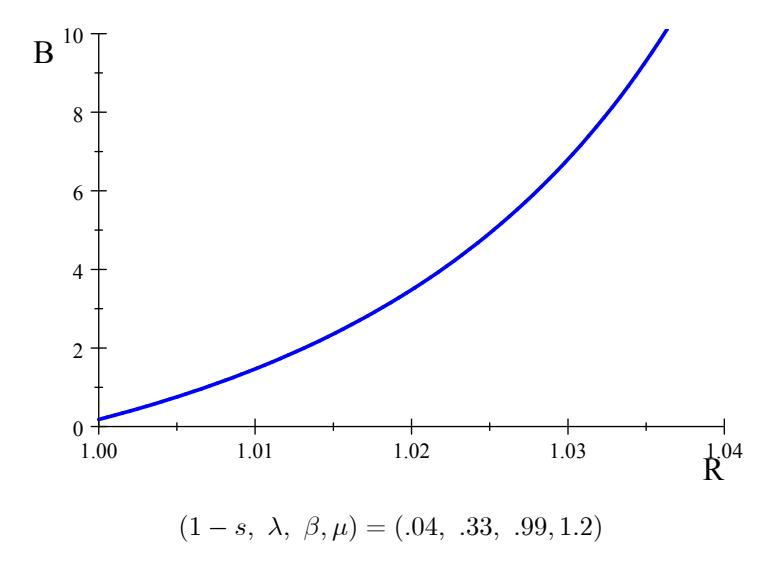
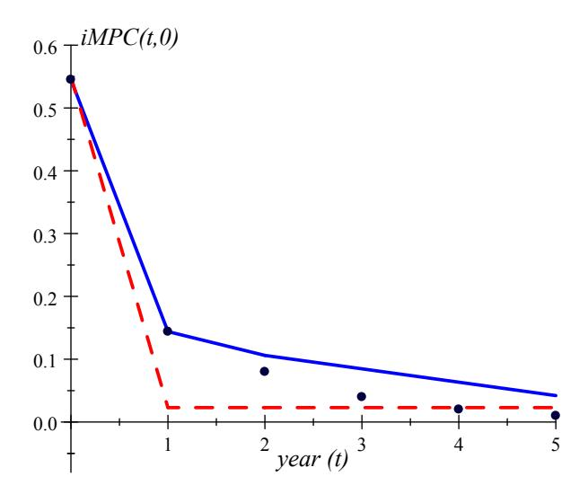

## Heterogeneous Agent Macroeconomics

## A Tractable New Keynesian Framework

Florin O. Bilbiie

University of Cambridge & CEPR

Forthcoming, MIT Press

First version 2019, this version November 2025

#### Chapter 5[^1]

Preliminary and Incomplete. Comments Requested

© Florin O. Bilbiie 2019

[^1]: Based on notes used to teach advanced mini-courses over the last years at the International Monetary Fund, European Central Bank Research Department, Norges Bank, Paris School of Economics (Summer School and APE program), Brown University, HEC Lausanne, Bonn Graduate School of Economics, Goethe University, and Cambridge. I thank Sean Lavender, who provided excellent RA work and help with transcribing the lectures and drafting. TBC

# Chapter 5: Introducing Liquidity – Analytics of Precautionary Savings and iMPCs

In the previous chapter, we introduced the THANK model without liquidity. In this chapter, we will consider a version of the THANK model in which households can conduct precautionary saving in the form of liquid government bonds. This will allow us to match some key sufficient statistics from the HANK literature, and to consider an alternative policy rule to achieve determinacy.

### THANK with Bonds-Liquidity

In the THANK model without liquidity, households had a precautionary saving *motive*. Now, we can consider the case in which government bonds are used by the households to self-insure against idiosyncratic income risk. Let $B_{t+1}$ denote the amount of government bonds in real terms outstanding at the end of period $t$. The government budget constraint gives:
$$B_{t+1} = R_t B_t - T_t$$
where $R_t$ is the gross real interest rate and $T_t$ denotes tax revenue. The household budget constraints are given by:
$$\begin{aligned}
C_t^H + Z_{t+1}^H &= \hat{Y}_t^H + R_t B_t^H\\
C_t^S + Z_{t+1}^S &= \hat{Y}_t^S + R_t B_t^S.
\end{aligned}$$

Bond market clearing requires that the bonds chosen by both types of household sum to equal the total supply of bonds:
$$B_{t+1} = \lambda Z_{t+1}^H + (1 - \lambda) Z_{t+1}^S.$$

As in chapter 4, we focus on equilibria in which hand-to-mouth households choose not to save. This means that $Z_{t+1}^H = 0$, and the bond market clearing condition becomes:
$$B_{t+1} = (1 - \lambda) Z_{t+1}^S.$$
Recall the equations derived in chapter 4 which govern the flow of bonds across islands:
$$\begin{aligned}
B_{t+1}^{S} &= sZ_{t+1}^{S} + (1-s)\lambda Z_{t+1}^{H}\\
B_{t+1}^{H} &= hZ_{t+1}^{H} + (1-h)Z_{t+1}^{S}.
\end{aligned}$$
Imposing $Z_{t+1}^H = 0$ and the bond market clearing condition yields:
$$\begin{aligned}
B_{t+1}^S &= sZ_{t+1}^S = \frac{s}{1-\lambda}B_{t+1}\\
B_{t+1}^H &= (1-h)Z_{t+1}^S = \frac{1-h}{1-\lambda}B_{t+1} = \frac{1-s}{\lambda}B_{t+1}.
\end{aligned}$$
Substituting these equations into the household budget constraints gives:
$$\begin{aligned}
C_{t}^H &= \hat{Y}_{t}^{H} + \frac{1-s}{\lambda} R_{t} B_{t}\\
C_{t}^{S} + \frac{1}{1-\lambda} B_{t+1} &= \hat{Y}_{t}^{S} + \frac{s}{1-\lambda} R_{t} B_{t}
\end{aligned}$$

As only saver households choose to save in government bonds, liquidity demand is again given by the self-insurance Euler equation:
$$(C_t^S)^{-\frac{1}{\sigma}} = \beta E_t \left\{ (1+r_t) \left[ s(C_{t+1}^S)^{-\frac{1}{\sigma}} + (1-s)(C_{t+1}^H)^{-\frac{1}{\sigma}} \right] \right\}.$$

### Demand for Bonds-Liquidity in THANK

We can also derive steady-state liquidity demand in the THANK model with government bonds. Taking the case with a balanced budget $T = (R − 1)B$, the steady-state household budgets give:
$$\begin{aligned}
C^H &= Y^H + \left[ \left( \frac{1-s}{\lambda} - 1 \right) R + 1 \right] B \\
C^S &= Y^S - \frac{\lambda}{1-\lambda} \left[ \left( \frac{1-s}{\lambda} - 1 \right) R + 1 \right] B.
\end{aligned}$$

With logarithmic utility ($\sigma = 1$), substituting these budget constraints into the steady-state self-insurance Euler equation gives:
$$1 = \beta R \left[ s + (1-s) \frac{Y^S - \frac{\lambda}{1-\lambda} \left[ \left( \frac{1-s}{\lambda} - 1 \right) R + 1 \right] B}{Y^H + \left[ \left( \frac{1-s}{\lambda} - 1 \right) R + 1 \right] B} \right].$$
Goods market clearing requires that:
$$Y = (1 - \lambda)Y^S + \lambda Y^H.$$
This allows us to re-write the Euler equation as:
$$1 = \beta R \left[ s + \frac{1-s}{1-\lambda} \frac{Y^S - \lambda \left[ \left( \frac{1-s}{\lambda} - 1 \right) R + 1 \right] B - \lambda Y^H}{Y^H + \left[ \left( \frac{1-s}{\lambda} - 1 \right) R + 1 \right] B} \right].$$
Rearranging yields:
$$1 = \beta R \left[ 1 + \frac{1-s}{1-\lambda} \left( \frac{Y}{Y^H + \left[ \left( \frac{1-s}{\lambda} - 1 \right) R + 1 \right] B} - 1 \right) \right].$$

{#fig-1}

Recall that steady-state inequality is given by the ratio of S income to H income, $\Gamma = \frac{Y^S}{Y^H}$. Combining this with goods market clearing gives:
$$\frac{Y^{H}}{Y} = \frac{Y^{H}}{\lambda Y^{H} + (1 - \lambda)Y^{S}} = \frac{1}{\lambda + (1 - \lambda)\Gamma} = \frac{1}{1 + (1 - \lambda)(\Gamma - 1)}.$$
We can substitute this condition into the self-insurance Euler equation and rearrange to obtain steady-state bond demand:[^2]
$$B = \frac{1}{1 - \left(1 - \frac{1-s}{\lambda}\right)R} \left[ \frac{1}{1 + \frac{1-\lambda}{1-s}\left(\frac{1}{\beta R} - 1\right)} - \frac{1}{1 + (1-\lambda)(\Gamma - 1)} \right].$$

[^2]: Steady-state output has been normalised to one.

This is an increasing convex function in the real interest rate. We can plot this analytical expression, the analogous of what one gets in a fully-fledged Aiyagari model (or, strictly speaking because these are bonds, a Huggett model)—see e.g. Figures IIa and IIb in the original Aiyagari (1994) paper. It is also akin to what one has in a full HANK model with liquid assets, like the seminal papers by Kaplan et al. (2018); Bayer et al. (2019). This is plotted in @fig-1 for a standard parameterization.

As the real interest rate approaches the complete markets rate, steady-state bond demand approaches a constant $\bar{B}$:
$$B \xrightarrow{R \to \beta^{-1}} \bar{B} \equiv \frac{1}{1 - \beta^{-1} \left(1 - \frac{1 - s}{\lambda}\right)} \frac{(1 - \lambda)(\Gamma - 1)}{1 + (1 - \lambda)(\Gamma - 1)}.$$
We can see that $\bar{B}$ will only be positive if there is steady state inequality, $\Gamma > 1$. Households will only demand positive steady state liquidity when $R = \beta^{-1}$ if income differs across the two states. Without this steady-state inequality, there is no precautionary saving motive.

Steady-state liquidity demand will be greater than zero if and only if:
$$\frac{1-s}{\lambda} > 1 - \beta.$$ {#eq-1}
This requirement stipulates that idiosyncratic risk, the risk of becoming hand-to-mouth, must be sufficiently high to generate positive liquidity demand in steady state. Re-writing the condition as:
$$\sum_{j=0}^{\infty} \beta^j (1-s) = \frac{1-s}{1-\beta} > \lambda$$
yields an intuitive expression. In order for steady-state liquidity demand to be positive, the present discounted sum of idiosyncratic risk must be greater than the unconditional probability of being hand-to-mouth.

There needs to be enough risk and inequality for there to be a well-defined demand for liquidity. Magically, we shall see that this exact same condition (@eq-1) is also needed to have (i) "iMPCs", that is endogenous persistence in individual consumption responses to income shocks; and (ii) equilibrium determinacy.

#### iMPCs and Intertemporal Propagation

The THANK model with liquidity also allows us to obtain an analytical expression for the intertemporal Marginal Propensity to Consume, or the iMPC. The iMPCs are defined as the partial derivative of aggregate consumption at time $t$ with respect to aggregate disposable income at time $t + k$:
$$M_{t,t+k} = \frac{\partial c_t}{\partial \hat{y}_{t+k}}.$$
In the HANK model developed by Auclert et al. (2018), the iMPCs are the key summary statistics which determine the effect of fiscal policy and the magnitude of the model's general equilibrium effects.

The empirical evidence presented by Auclert et al. (2018) show that the impact iMPC, the response of consumption a shock to present disposable income, is above 0.4 on average. Importantly, the authors also show that iMPCs remain high in subsequent periods and decay exponentially. This latter finding is a compelling critique of the TANK model studied in chapter 3, but *not* of the THANK model. In the TANK model, a higher share of hand-to-mouth agents can generate a higher impact iMPC. However, model cannot achieve the gradual decay observed in the micro data. This is not true of the THANK model, which we will show can match the empirical pattern of iMPCs.

To derive analytical expressions for the iMPC in the THANK model with liquidity, loglinearise the household budgets around a steady state with zero inflation, equal consumption across types, zero steady-state liquidity, and $R = \beta^{-1}$. This yields:
$$\begin{aligned}
c_t^H &= \hat{y}_t^H + \beta^{-1} \frac{1 - s}{\lambda} b_t\\
c_t^S + \frac{1}{1 - \lambda} b_{t+1} &= \hat{y}_t^S + \beta^{-1} \frac{s}{1 - \lambda} b_t
\end{aligned}$$
where $b_t \equiv \frac{B_t - B}{Y}$ is the deviation of government debt from steady state as a proportion of steady-state output.

Substitute into the self-insurance Euler equation to obtain:
$$\hat{y}_{t}^{S} + \beta^{-1} \frac{s}{1 - \lambda} b_{t} - \frac{1}{1 - \lambda} b_{t+1} = s E_{t} \left[ \hat{y}_{t+1}^{S} + \beta^{-1} \frac{s}{1 - \lambda} b_{t+1} - \frac{1}{1 - \lambda} b_{t+2} \right] + (1 - s) E_{t} \left[ \hat{y}_{t+1}^{H} + \beta^{-1} \frac{1 - s}{\lambda} b_{t+1} \right] - \sigma (i_{t} - E_{t} \pi_{t+1}).$$

#### iMPCs in the Oscillating THANK

For simplicity, focus first on the "oscillating THANK" special case in which $s=0$. Here, households oscillate between being savers and hand-to-mouth. This also implies that $\lambda=\frac{1}{2}$, and gives:
$$\hat{y}_t^S - 2b_{t+1} = E_t \hat{y}_{t+1}^H + 2\beta^{-1}b_{t+1} - \sigma(i_t - E_t \pi_{t+1}).$$
We can therefore express liquidity demand as:
$$b_{t+1} = \frac{\hat{y}_t^S - E_t \hat{y}_{t+1}^H}{2(1+\beta^{-1})} + \frac{\sigma(i_t - E_t \pi_{t+1})}{2(1+\beta^{-1})}.$$
This shows that households choose to save more when they expect lower income in the hand-to-mouth state in the next period, or a higher real interest rate. Conversely, agents dis-save when they expect higher income next period. We also have that:
$$\hat{y}_t^H = \chi \hat{y}_t$$
$$\hat{y}_t^S = \frac{1 - \lambda \chi}{1 - \lambda} \hat{y}_t = (2 - \chi) \hat{y}_t$$
and aggregate consumption is given by:
$$c_t = \lambda c_t^H + (1 - \lambda)c_t^S = \hat{y}_t + \beta^{-1}b_t - b_{t+1}.$$ {#eq-2}

Combining these equations gives a consumption function in terms of past, present and future disposable income:
$$c_t = \frac{2 - \chi + \beta \chi}{2(1 + \beta)} \hat{y}_t + \frac{2 - \chi}{2(1 + \beta)} \hat{y}_{t-1} + \frac{\beta \chi}{2(1 + \beta)} \hat{y}_{t+1}.$$

To obtain the iMPCs, we can simply take the partial derivative with respect to disposable income, keeping all other variables fixed. This gives:
$$\begin{aligned}
\frac{\partial c_T}{\partial \hat{y}_T} &= \frac{2 - \chi + \beta \chi}{2(1 + \beta)} \\
\frac{\partial c_{T+1}}{\partial \hat{y}_T} &= \frac{2 - \chi}{2(1 + \beta)} \\
\frac{\partial c_{T-1}}{\partial \hat{y}_T} &= \frac{\beta \chi}{2(1 + \beta)} \\
\frac{\partial c_{T+j}}{\partial \hat{y}_T} &= 0 \quad \text{for } |j| > 1.
\end{aligned}$$

The iMPCs allow us to study the role of $\chi$ in the intertemporal amplification of shocks. When $\chi$ increases, households become more responsive to news shocks, or increases in future aggregate disposable income, and become less responsive to changes in past or present income. This mechanism allows us to replicate the pattern of iMPCs observed in the data. Even in the simple oscillating case studied here, setting $\beta = 0.95$ and $\chi = 1.47$ allows us to match the Auclert et al. (2018) impact iMPC of 0.55, as well as $\frac{\partial c_{T+1}}{\partial \hat{y}_T} = 0.15$.

### iMPCs in the General THANK: Analytics meets Quantitative meets the Data

Consider now the general case; the THANK model also yields analytical expressions for the iMPCs outside of the oscillating case. Replacing the loglinearized budget constraints in the self-insurance Euler equation yields the dynamic liquidity demand:
$$E_t b_{t+2} - \Theta b_{t+1} + \beta^{-1} b_t = \frac{1-\lambda}{s} \left[ s E_t \hat{y}_{t+1}^S + (1-s) E_t \hat{y}_{t+1}^H - \hat{y}_t^S \right],$$ {#eq-3}
where $\Theta \equiv \frac{1}{s} + \beta^{-1} \left[ 1 + \frac{1-s}{s} \left( \frac{1-s}{\lambda} - 1 \right) \right]$. This is a simple second-order difference equation that can be solved backward-forward.

Finding the derivatives of $b_{t+k}$ with respect to $\hat{y}_t$ requires a model of how individual disposable incomes are related to aggregate, such as the one we used throughout the book. And since the calculation of iMPCs keeps fixed by definition all the other variables (taxes, their distribution, and public debt), the partial derivatives of individual disposable incomes with respect to aggregate disposable income are respectively $d\hat{y}_t^H = \chi d\hat{y}_t$ and $d\hat{y}_t^S = \frac{1-\lambda\chi}{1-\lambda}d\hat{y}_t$.[^3] Solving the asset dynamics equation taking this into account delivers:
$$db_{t+1} = x_b db_t + \frac{1 - \lambda \chi}{s} \sum_{k=0}^{\infty} (\beta x_b)^{k+1} (d\hat{y}_{t+k} - \delta d\hat{y}_{t+k+1}),$$ {#eq-4}
where the roots of the characteristic polynomial of (@eq-3) are $x_b = \frac{1}{2} \left( \Theta - \sqrt{\Theta^2 - 4\beta^{-1}} \right)$ and $(\beta x_b)^{-1}$, with $0 < x_b < 1$ as required by stability whenever $\beta > 1 - \frac{1-s}{\lambda}$.

[^3]: In particular, any model would deliver a reduced-form $\hat{y}_t^H = \chi \hat{y}_t + \chi_{tax} t_t$, $\chi_{tax}$ being an equilibrium elasticity depending on the tax distribution, labor elasticity, etc. But for calculating iMPCs, we look at a partial equilibrium wherein $dt_t/\hat{y}_t = 0$.

Substituting (@eq-4) in (@eq-2) delivers the aggregate consumption function, the key equation for calculating the analytical iMPCs:
$$dc_t = d\hat{y}_t + \beta^{-1} (1 - \beta x_b) db_t + \frac{1 - \lambda \chi}{s} \sum_{k=0}^{\infty} (\beta x_b)^{k+1} (\delta d\hat{y}_{t+k+1} - d\hat{y}_{t+k}).$$ {#eq-5}

The intertemporal MPCs (iMPCs) for the THANK model, in response to a one-time shock to disposable income at any time $T$ and for any $t \ge 0$: (i) are given by:
$$\frac{dc_{t}}{d\hat{y}_{T}} = \begin{cases}
\frac{1-\lambda\chi}{s} \frac{\delta-\beta x_{b}}{1-\beta x_{b}^{2}} (\beta x_{b})^{T-t} \left(1-x_{b}+x_{b} (1-\beta x_{b}) (\beta x_{b}^{2})^{t}\right), & \text{if } t \leq T-1; \\
1-\frac{1-\lambda\chi}{s} \beta x_{b} - (\delta-\beta x_{b}) x_{b} \frac{1-\lambda\chi}{s} (1-\beta x_{b}) \frac{1-(\beta x_{b}^{2})^{T}}{1-\beta x_{b}^{2}}, & \text{if } t = T; \\
\frac{1-\lambda\chi}{s} \frac{1-\beta x_{b}}{1-\beta x_{b}^{2}} x_{b}^{t-T} \left(1-x_{b}\delta+x_{b} (\delta-\beta x_{b}) (\beta x_{b}^{2})^{T}\right), & \text{if } t \geq T+1.
\end{cases}$$ {#eq-6}
and (ii) are increasing with the cyclicality of inequality $\chi$ when $t < T$ and decreasing with $\chi$ when $t \ge T > 0$ (keeping fixed the time-0 contemporaneous MPC $dc_0/d\hat{y}_0$).

In this more general model, the iMPCs to a $t=0$ shock with $\chi=1$ are given by:
$$\frac{\partial c_t}{\partial \hat{y}_0} = \begin{cases} 1 - \frac{1-\lambda}{s} + \frac{1-\lambda}{s} (1 - \beta x_b) \frac{1-x_b}{1-\beta x_b^2}, & \text{if } t = 0\\ \frac{1-\lambda}{s} (1 - \beta x_b) x_b^t & \text{if } t \ge 1. \end{cases}$$

We can thus see that the iMPCs generated by the THANK model with liquidity can achieve the key characteristics of iMPCs observed in the data: a high impact multiplier, with a large drop in the second period and exponential decay (with the root of the asset accumulation equation as an autoregressive root) thereafter. Indeed, plotting them in @fig-2 against the data from Fagereng et al. (2021) shows that we can essentially reproduce it—just like the full-HANK model of Auclert et al. (2018). To match these three features the model has three degrees of freedom, its deep parameters $\lambda$ and $s$, and the cyclicality of inequality $\chi$ (at a given $\beta$).[^4] @fig-2 plots the iMPCs for THANK, along with TANK and the data from Fagereng et al. In THANK, I match the two target MPCs with $\lambda=0.33$, $s=0.82$ (0.96 quarterly) and $\chi=1.4$. The intertemporal path is remarkably in line with both the data and Auclert et al's quantitative HANK: the effect dies off after a few years, whereas TANK misses this intertemporal amplification altogether, the iMPCs being:
$$\frac{dc_T}{d\hat{y}_T} = \lambda \chi + (1 - \lambda \chi) (1 - \beta) \beta^T; \quad \frac{dc_t}{d\hat{y}_T} = (1 - \lambda \chi) (1 - \beta) \beta^T \quad \forall t \neq T.$$

[^4]: This is coincidentally close to the calibration in Bilbiie (2020) matching *general-equilibrium* statistics with the zero-liquidity model. Figure D1 in the Appendix of Bilbiie (2024) provides a comparison of different calibrations, and iMPCs in response to future shocks. See Cantore and Freund (2021) for a subsequent, simpler analytical iMPC calculation with portfolio adjustment costs.

{#fig-2}

The analytical iMPCs derived in this section can also be used to show that the HANK Taylor principle is closely related to the determinacy results obtained by Auclert et al. (2018). Auclert et al. (2018) show that the Taylor principle is sufficient to achieve determinacy if the sum of the iMPCs is greater than one. When this is satisfied, an income shock is met with a total MPC of greater than one ensuring determinacy as the model is effectively 'explosive'. Summing the iMPCs for the oscillating case of the THANK model yields:
$$\sum_{j=-1}^{1} \frac{\partial c_{T+j}}{\partial \hat{y}_{T}} = 1 + (1 - \chi) \frac{1 - \beta}{1 + \beta}.$$
The sum of iMPCs is greater than one if and only if $\chi < 1$. Recall that the HANK Taylor principle also states that the Taylor principle is sufficient for determinacy if inequality is countercyclical. The requirements for determinacy in the THANK and HANK models are therefore intimately related.

### Virtuous Policies in HANK: Debt Quantity Rule

In the THANK model with liquidity, we can also show that an alternative policy can achieve amplification and determinacy, providing a solution to the Catch-22. Hagedorn (2021) shows that the government can achieve determinacy without an interest rate rule by fixing the nominal quantity of public debt. This result also holds in the THANK model. Suppose that the government fixes the supply of nominal debt such that:
$$b_{T+1}^N \equiv b_{T+1} = 0.$$

When the price level rises, the real quantity of government debt falls. Unlike in the Fiscal Theory of the Price Level, the government sets taxes to ensure that the government budget constraint holds in every period. Fiscal policy is therefore 'Ricardian', and taxes are determined residually from the government budget constraint.

Loglinearising the model around a steady state with zero debt and $R = \beta^{-1}$ gives the aggregate Euler equation:
$$c_{t} = \delta E_{t} c_{t+1} - \sigma \frac{1-\lambda}{1-\lambda \chi} r_{t} + \frac{1-\lambda-s}{1-\lambda \chi} b_{t} + \left[ \frac{\lambda}{1-\lambda \chi} \beta + \frac{1-\lambda-s}{1-\lambda \chi} \left( \frac{1-s}{\lambda} - 1 \right) \right] b_{t+1} + \frac{1-\lambda-s}{1-\lambda \chi} \beta E_{t} b_{t+2}.$$
With a static Phillips curve:
$$c_t = \kappa^{-1}(p_t - p_{t-1})$$
we can obtain a second-order difference equation for the price level, just as we did for the case with price level targeting. The condition for determinacy can be shown to be the same as the condition for well-defined liquidity demand:
$$\frac{1-s}{\lambda} > 1-\beta.$$
With well-defined bond demand, the debt-quantity rule always achieves determinacy, even in the case with countercyclical inequality. Hence, this rule offers another route out of the Catch-22.

### Notes on the Literature

Auclert et al. (2018) develop a HANK model with an 'intertemporal Keynesian cross' representation in which the iMPCs are sufficient statistics for determining the effects of deficit-financed fiscal policy on output; Hagedorn et al. (2019) emphasized a similar mechanism in their quantitative model. The ability of models to accurately capture policy transmission is therefore argued to be rooted in their ability to match the pattern of iMPCs observed in the microeconomic data (Fagereng et al. (2021)).

The THANK model presented in this chapter from Bilbiie (2024) contains the first (in its 2019 WP version) closed-form, analytical derivation of the iMPCs in a heterogeneous-agent model that is complementary to the above-mentioned quantitative studies. In addition to it, the TANK model developed by Cantore and Freund (2021) is also able to replicate analytically the empirical pattern of iMPCs. Rather than savers and hand-to-mouth households, the Cantore and Freund (2021) model features capitalists, who save but do not supply labour, and workers, who face 'intermediate' financial constraints in the form of bond portfolio adjustment costs. More recently, Wolf (2021) provided an alternative calculation of iMPCs in a different model, with an OLG analytical counterpart.

The model developed in this chapter also relates to the literature on determinacy in models with liquidity. Hagedorn (2021) shows that the steady-state price level and inflation rate are determined in incomplete markets models in which the monetary authority fixes the nominal interest rate and the fiscal authority sets nominal bonds and taxes to ensure that the government budget constraint is always satisfied. This contrasts with the classic Sargent and Wallace (1975) for complete markets models, where an interest rate peg is insufficient for determinacy if the central bank does not also fix the money supply. The THANK model with liquidity shares the property of the Hagedorn (2021) incomplete markets model, and achieves determinacy when the fiscal authority follows a rule for nominal debt.

### Summary

In this section, we considered the THANK model in which households can save in government bonds. Within this framework, we were able to calculate the intertemporal Marginal Propensity to Consume, and to show that the THANK model can replicate the path of iMPCs observed in quantitative HANK models and in the data. In addition, the THANK model with liquidity also shows that a Hagedorn (2021)-style debt quantity rule offers a way out of the Catch-22.

# References

- S Rao Aiyagari. Uninsured idiosyncratic risk and aggregate saving. The Quarterly Journal of Economics, 109(3):659–684, 1994. doi: 10.2307/2118417.
- Adrien Auclert, Matthew Rognlie, and Ludwig Straub. The intertemporal keynesian cross. Technical report, National Bureau of Economic Research, 2018.
- Christian Bayer, Ralph Lütticke, Lien Pham-Dao, and Volker Tjaden. Precautionary Savings, Illiquid Assets, and the Aggregate Consequences of Shocks to Household Income Risk. Econometrica, 87(1):255–290, 2019. doi: 10.3982/ECTA14321.
- Florin O. Bilbiie. The new keynesian cross. Journal of Monetary Economics, 114:90–108, 2020. doi: 10.1016/j.jmoneco.2020.04.009.
- Florin O. Bilbiie. Monetary policy and heterogeneity: An analytical framework. Review of Economic Studies, 2024.
- Cristiano Cantore and Lukas B. Freund. Workers, Capitalists, and the Government: Fiscal Policy and Income (Re)distribution. Journal of Monetary Economics, 119:58–74, 2021. doi: 10.1016/j.jmoneco.2021.02.001.
- Andreas Fagereng, Martin B. Holm, and Gisle J. Natvik. MPC Heterogeneity and Household Balance Sheets. American Economic Journal: Macroeconomics, 13(4):1–54, 2021. doi: 10.1257/mac.20190114.
- Marcus Hagedorn. A demand theory of the price level. 2021.
- Marcus Hagedorn, Iourii Manovskii, and Kurt Mitman. The Fiscal Multiplier. Working Paper 25571, NBER, 2019.
- Greg Kaplan, Benjamin Moll, and Giovanni L Violante. Monetary policy according to hank. American Economic Review, 108(3):697–743, 2018. doi: 10.1257/aer.20160042.
- Thomas J Sargent and Neil Wallace. "Rational" expectations, the optimal monetary instrument, and the optimal money supply rule. Journal of political economy, 83(2):241–254, 1975.
- Christian K Wolf. Interest rate cuts vs. stimulus payments: An equivalence result. Technical report, National Bureau of Economic Research, 2021.
