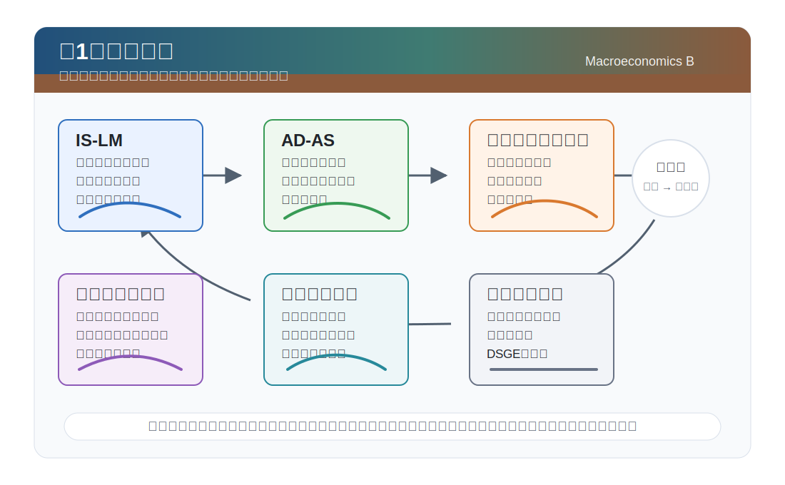
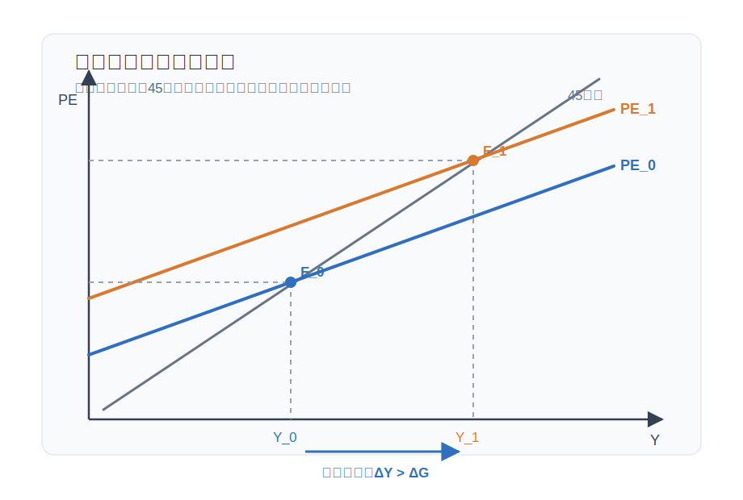
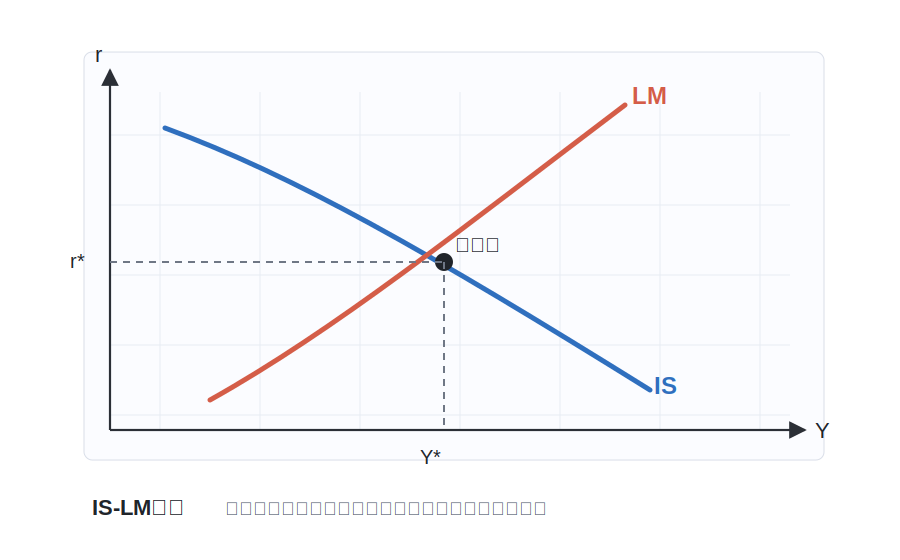
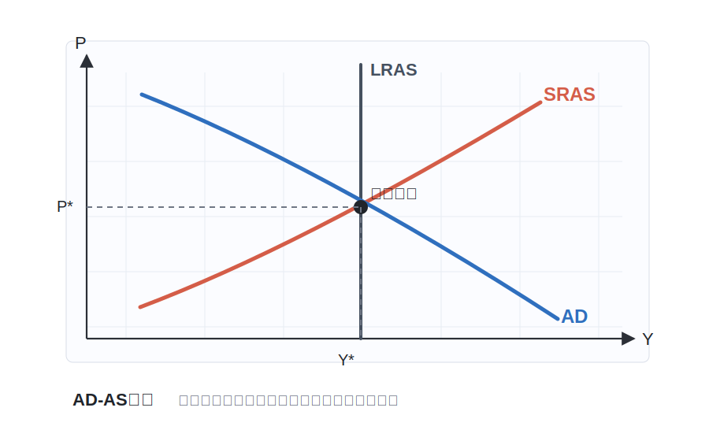
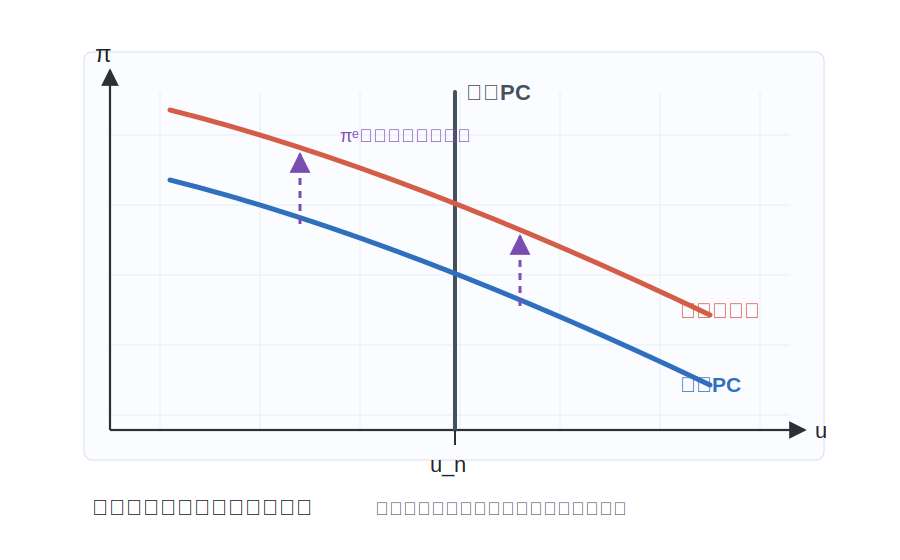
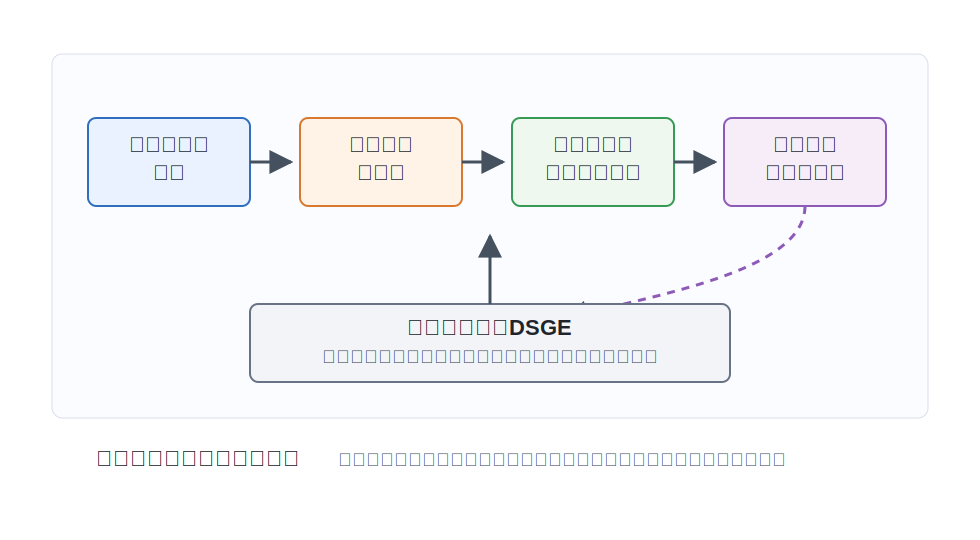

# 講義の目的

本講義では、学部レベルのマクロ経済学で学んだ主要な概念とモデルを復習し、大学院レベルのマクロ経済学への橋渡しを行います。特に以下の点に焦点を当てます：

1. ケインジアン・クロスと財市場の乗数メカニズム
2. IS-LMモデルとAD-AS分析の基本構造
3. フィリップス曲線と自然産出量・需給ギャップへの読み替え
4. 総需要管理政策の効果と限界
5. ルーカス批判とミクロ的基礎づけの必要性
6. 現代マクロ経済学への展開

{#fig-lecture01-overview width=95%}

---

# ケインジアン・クロス

## 財市場と計画支出

ケインジアン・クロスは、短期において物価水準と利子率をいったん所与とし、財市場の需要と産出がどのように一致するかを見る最も単純な総需要モデルです。基本となる考え方は、企業が予期せざる在庫増減に反応して生産を調整するため、短期の産出量が計画支出に合わせて動く、というものです。

**計画支出：**
$$
PE = C_0 + c(Y-T) + \bar{I} + G
$$

ここで、

- $PE$：計画支出
- $C_0$：所得に依存しない基礎消費
- $c$：限界消費性向（$0<c<1$）
- $\bar{I}$：所与の投資
- $G$：政府支出
- $T$：租税

財市場の均衡は、産出量が計画支出に等しくなる点です。
$$
Y=PE
$$

したがって、均衡産出量は
$$
Y
=
\frac{1}{1-c}
\left(C_0-cT+\bar{I}+G\right)
$$
と書けます。

## 45度線と乗数

ケインジアン・クロス図では、横軸に産出量 $Y$、縦軸に計画支出 $PE$ を置きます。45度線は $Y=PE$ を表し、計画支出曲線との交点で均衡産出量が決まります。

{#fig-keynesian-cross width=85%}

政府支出が $\Delta G$ だけ増えると、計画支出曲線は上方にシフトします。均衡産出量の変化は
$$
\Delta Y
=
\frac{1}{1-c}\Delta G
$$
です。ここで
$$
\frac{1}{1-c}
$$
が政府支出乗数です。限界消費性向 $c$ が大きいほど、所得増加が消費増加を呼び、その消費増加がさらに所得を増やすため、乗数は大きくなります。

租税が外生的に $\Delta T$ だけ増える場合には、
$$
\Delta Y
=
-
\frac{c}{1-c}\Delta T
$$
となります。減税は可処分所得を増やして消費を増やしますが、最初の効果は $c\Delta T$ なので、政府支出乗数より絶対値は小さくなります。

## IS-LMモデルへの接続

ケインジアン・クロスでは、投資を所与の $\bar{I}$ としました。IS-LMモデルでは、投資を利子率の減少関数 $I(r)$ として扱います。このとき計画支出は
$$
PE(Y;r,G,T)=C(Y-T)+I(r)+G
$$
です。

各利子率 $r$ について $Y=PE(Y;r,G,T)$ を満たす産出量を求めると、IS曲線が得られます。利子率が下がると投資が増え、計画支出曲線が上方にシフトし、均衡産出量が増えます。したがって、IS曲線は右下がりになります。

この45度線の直観は、第12回で扱う **New Keynesian Cross** にもつながります。第12回では、計画支出曲線の傾きが家計の異質性と所得フィードバックによってどう変わるかを、TANKモデルの中で読み直します。

---

# IS-LMモデル

## IS曲線（財市場の均衡）

IS曲線は、財市場が均衡する産出量と利子率の組み合わせを示します。

**財市場の均衡条件：**
$$
Y = C(Y - T) + I(r) + G
$$

ここで、

- $Y$：産出量（GDP）
- $C(Y - T)$：消費関数（可処分所得の増加関数）
- $I(r)$：投資関数（利子率の減少関数）
- $G$：政府支出
- $T$：租税
- $r$：実質利子率

**IS曲線の性質：**

- 右下がり：利子率が上昇すると投資が減少し、均衡産出量が低下
- シフト要因：政府支出の増加、減税、消費者信頼感の向上など

## LM曲線（貨幣市場の均衡）

LM曲線は、貨幣市場が均衡する産出量と利子率の組み合わせを示します。

**貨幣市場の均衡条件：**
$$
\frac{M}{P} = L(Y, i)
$$

ここで、

- $M$：名目貨幣供給量
- $P$：物価水準
- $L(Y, i)$：貨幣需要関数（産出量の増加関数、名目利子率の減少関数）
- $i$：名目利子率

**フィッシャー方程式：**
$$
i = r + \pi^e
$$

ここで、$\pi^e$ は期待インフレ率です。

**LM曲線の性質：**

- 右上がり：産出量が増加すると貨幣需要が増加し、利子率が上昇
- シフト要因：貨幣供給量の増加、物価水準の変化など

IS曲線では投資需要を実質利子率 $r$ の関数として書き、LM曲線では貨幣需要を名目利子率 $i$ の関数として書いています。短期のIS-LM図では、期待インフレ率 $\pi^e$ が一定で、フィッシャー方程式 $i=r+\pi^e$ によって両者を読み替えていると考えます。

## IS-LM均衡

IS曲線とLM曲線の交点で、財市場と貨幣市場が同時に均衡します。

{#fig-is-lm width=85%}

---

# AD-AS分析

## 総需要曲線（AD曲線）

AD曲線は、IS-LMモデルから導出され、各物価水準における均衡産出量を示します。

**AD曲線の導出：**

1. 物価水準 $P$ が上昇
2. 実質貨幣供給量 $M/P$ が減少
3. LM曲線が左シフト
4. 均衡利子率が上昇、均衡産出量が減少

**AD曲線の式：**
$$
Y^{AD}=D\left(\frac{M}{P}, G, T\right)
$$

**AD曲線の性質：**

- 右下がり：物価水準が上昇すると、均衡産出量が減少
- シフト要因：拡張的財政政策、拡張的金融政策など

## 総供給曲線（AS曲線）

### 短期総供給曲線（SRAS）

短期では、名目賃金が硬直的であるため、物価水準の変化が実質賃金を変化させ、産出量に影響します。

**短期AS曲線（期待修正型）：**
$$
Y = \bar{Y} + \alpha_{AS}(P - P^e)
$$

ここで、

- $\bar{Y}$：自然産出量
- $P^e$：期待物価水準
- $\alpha_{AS} > 0$：物価水準に対する産出量の反応度

ここでいう自然産出量は、労働市場で雇用が自然な水準にあるときの産出です。学部マクロでは、この自然な雇用水準を自然失業率と合わせて説明することがあります。失業率が自然失業率より高ければ、雇用は自然な水準より低く、産出も自然産出量を下回ります。逆に失業率が自然失業率より低ければ、雇用と産出は自然水準を上回ります。

ただし、本講義の第7回以降では失業率を明示的にはモデル化しません。代わりに、柔軟価格のもとで実現する産出を自然産出量 $y_t^f$ と定義し、実際の産出との差
$$
x_t = y_t-y_t^f
$$
を需給ギャップとして扱います。したがって、第1回で重要なのは自然失業率そのものではなく、「自然水準からの乖離がインフレ圧力を生む」という考え方です。

### 長期総供給曲線（LRAS）

長期では、名目賃金が完全に調整されるため、産出量は自然産出量で決定されます。

**長期AS曲線：**
$$
Y = \bar{Y}
$$

LRAS曲線は垂直線となります。

## AD-AS均衡

AD-AS分析では、総需要曲線 AD、短期総供給曲線 SRAS、長期総供給曲線 LRAS の位置関係から、短期均衡と長期均衡を読み取ります。

{#fig-ad-as width=85%}

---

# フィリップス曲線

## オリジナルのフィリップス曲線

A.W.フィリップス（1958）は、イギリスのデータを用いて、失業率とインフレ率の間に負の相関関係があることを発見しました。

**フィリップス曲線：**
$$
\pi = f(u) \quad \text{ただし } f'(u) < 0
$$

ここで、

- $\pi$：インフレ率
- $u$：失業率

この関係は、政策当局がインフレと失業のトレードオフを利用できることを示唆していました。

## 期待修正型フィリップス曲線

フリードマン（1968）とフェルプス（1967）は、期待の役割を強調し、以下の期待修正型フィリップス曲線を提唱しました。

**期待修正型フィリップス曲線：**
$$
\pi = \pi^e - \beta_{PC}(u - u_n)
$$

ここで、

- $\pi^e$：期待インフレ率
- $u_n$：自然失業率
- $\beta_{PC} > 0$：フィリップス曲線の傾き

**重要な含意：**

- 短期的にはインフレと失業のトレードオフが存在
- 長期的には（$\pi = \pi^e$ のとき）失業率は自然失業率 $u_n$ に収束
- 長期フィリップス曲線は垂直線

期待インフレ率 $\pi^e$ が上昇すると、短期フィリップス曲線は上方にシフトします。同じ失業率でも、期待が高ければ実際のインフレ率も高くなります。

{#fig-phillips width=85%}

## 後続講義での読み替え：失業率から需給ギャップへ

自然失業率（$u_n$）は、この回ではフィリップス曲線の長期アンカーとしてだけ使います。第2回以降のモデルでは、失業率そのものではなく、自然産出量と需給ギャップを中心に分析します。

失業率と産出の関係は、簡単には次のように読めます。

- $u>u_n$：雇用が自然な水準より低く、産出は自然産出量を下回る
- $u<u_n$：雇用が自然な水準より高く、産出は自然産出量を上回る

この関係をオークン法則のように
$$
u-u_n \simeq -\eta(Y-\bar{Y}),\qquad \eta>0
$$
と近似すれば、期待修正型フィリップス曲線は
$$
\pi
\simeq
\pi^e+\kappa_Y(Y-\bar{Y})
$$
と書き換えられます。ここで $\kappa_Y=\beta\eta>0$ です。

この式のポイントは、失業率ではなく産出の自然水準からの乖離でインフレ圧力を読めることです。第7回以降で使うニューケインジアン・フィリップス曲線
$$
\pi_t=\beta\mathbb{E}_t\pi_{t+1}+\kappa x_t
$$
は、この静学的な直観を、期待と価格設定を持つ動学モデルの中で導き直したものです。

---

# 総需要管理政策

## 財政政策

**拡張的財政政策：**

- 政府支出の増加：$G \uparrow$
- 減税：$T \downarrow$

**IS-LMモデルでの効果：**

1. IS曲線が右シフト
2. 産出量が増加、利子率が上昇
3. 利子率上昇により、民間投資が減少（**クラウディング・アウト**）

**財政乗数：**
$$
\text{財政乗数} = \frac{\Delta Y}{\Delta G}
$$

単純なケインジアン・クロスでは、財政乗数は $1/(1-c)$ です。IS-LMモデルでは、政府支出増加が利子率を上昇させ、民間投資を押し下げるため、乗数の大きさは限界消費性向だけでなく、投資の利子弾力性、貨幣需要の利子弾力性、金融政策の反応にも依存します。

## 金融政策

**拡張的金融政策：**

- 貨幣供給量の増加：$M \uparrow$
- 利子率の引き下げ

**IS-LMモデルでの効果：**

1. LM曲線が右シフト
2. 利子率が低下、産出量が増加
3. 利子率低下により、民間投資が増加

## 政策の有効性

**古典派の二分法（長期）：**

- 長期的には、名目変数（貨幣供給量など）は実質変数（産出量、雇用など）に影響しない
- 金融政策は長期的には物価水準のみに影響

**ケインジアンの見解（短期）：**

- 短期的には、価格や賃金の硬直性により、総需要管理政策が実質変数に影響
- 特に不況期には、財政・金融政策が有効

---

# ルーカス批判とミクロ的基礎づけ

## ルーカス批判（1976）

ロバート・ルーカスは、従来のマクロ経済モデル（IS-LMモデルなど）に基づく政策評価に根本的な問題があることを指摘しました。

**ルーカス批判の要点：**

伝統的なマクロ経済モデルのパラメータ（例：消費関数の限界消費性向）は、過去の政策レジームの下で推定されたものです。しかし、政策が変更されると、経済主体の行動も変化するため、これらのパラメータも変化します。

したがって、**過去のデータから推定されたパラメータを用いて、新しい政策の効果を予測することはできません。**

**具体例：フィリップス曲線**

1960年代、政策当局はフィリップス曲線の安定的な負の相関を利用して、高インフレを容認することで低失業率を達成しようとしました。

しかし、1970年代には**スタグフレーション**（高インフレと高失業率の同時発生）が発生し、フィリップス曲線の関係が崩壊しました。

**原因：**

- 政策当局が高インフレ政策を採用すると、人々の期待インフレ率が上昇
- 期待修正型フィリップス曲線に従えば、期待インフレ率の上昇により、フィリップス曲線が上方シフト
- 結果として、高インフレと高失業率が同時に発生

## ミクロ的基礎づけの必要性

ルーカス批判により、マクロ経済モデルは以下の要件を満たす必要があることが明らかになりました：

1. **ミクロ的基礎づけ**：家計や企業の最適化行動から導出されたモデル
2. **合理的期待**：経済主体は利用可能な情報を合理的に利用して期待を形成
3. **ディープ・パラメータ**：選好や技術など、政策変更に対して不変なパラメータに基づくモデル

**ディープ・パラメータの例：**

- 家計の割引因子（時間選好率）
- 危険回避度（相対的リスク回避係数）
- 企業の生産技術パラメータ

これらのパラメータは、政策変更があっても変化しないと考えられます。

## 政策評価の新しいアプローチ

ルーカス批判を受けて、政策評価は以下のように変化しました：

**構造的アプローチ：**

1. ミクロ的基礎に基づく動学的一般均衡（DSGE）モデルを構築
2. ディープ・パラメータをキャリブレーションまたは推定
3. 異なる政策ルールの下でのモデルのシミュレーションを実施
4. 政策の厚生効果を評価

このアプローチでは、政策変更に対して経済主体の行動がどのように変化するかを明示的にモデル化できます。

{#fig-lucas width=90%}

---

# 現代マクロ経済学への展開

## 新しいマクロ経済学の潮流

ルーカス批判以降、マクロ経済学は大きく変化しました。

### リアル・ビジネス・サイクル（RBC）理論

**特徴：**

- 完全競争、価格の完全伸縮性を仮定
- 景気変動の主因を技術ショックとする
- ミクロ的基礎に基づく動学的一般均衡モデル

**限界：**

- 金融政策の役割を説明できない
- 実際の景気変動を十分に説明できない

### ニューケインジアン・マクロ経済学

**特徴：**

- ミクロ的基礎に基づくが、価格・賃金の硬直性を導入
- 独占的競争市場を仮定
- 金融政策の短期的な実物効果を説明可能

**主要なモデル：**

- 3方程式ニューケインジアンモデル
  - ニューケインジアン・フィリップス曲線
  - 動学的IS曲線
  - テイラー・ルール
- New Keynesian Cross
  - 計画支出曲線と45度線の現代的な読み替え
  - 流動性制約家計を通じる所得フィードバック

## 動学的確率的一般均衡（DSGE）モデル

現代のマクロ経済政策分析の主流は、DSGEモデルです。

**DSGEモデルの特徴：**

1. **ミクロ的基礎づけ**：家計と企業の最適化問題から導出
2. **動学的**：異時点間の最適化を考慮
3. **確率的**：ショック（外生的変動）を明示的に導入
4. **一般均衡**：すべての市場の相互作用を考慮

**DSGEモデルの構成要素：**

- **家計**：効用最大化（消費・余暇の選択、貯蓄決定）
- **企業**：利潤最大化（生産要素の投入決定、価格設定）
- **中央銀行**：金融政策ルール（テイラー・ルールなど）
- **政府**：財政政策（政府支出、課税）
- **ショック**：技術ショック、選好ショック、金融政策ショックなど

## 本講義の展開

本講義では、以下の順序で現代マクロ経済学を学んでいきます：

1. **時系列分析と対数線形近似**（第2回）：DSGEモデルの動学を読むための準備
2. **動学的最適化と資産価格付け**（第3回）：ラグランジュ法、ダイナミック・プログラミング、確率的割引因子
3. **資本なしRBCモデル**（第4回）：完全競争・柔軟価格のもとで、技術ショックと自然産出量・自然利子率の基準を確認する
4. **政府部門**（第5回）：政府支出、政府債務、税制が資本なしモデルの配分へ与える効果を整理する
5. **独占的競争**（第6回）：Dixit--Stiglitz 型の中間財市場とマークアップを導入する
6. **価格硬直性**（第7回）：Rotemberg 型価格調整費用からNKフィリップス曲線と3本のNK方程式を導く
7. **RANKモデル**（第8回）：第3回から第7回までの部品を統合し、金融政策・技術・政府支出ショックを比較する
8. **最適金融政策とルールの評価**（第9回）：裁量、コミットメント、テイラー・ルールの評価を学ぶ
9. **価格・賃金硬直性をもつRANKモデル**（第10回）：名目賃金の硬直性を加え、価格硬直性だけのモデルとの違いを確認する
10. **価格硬直性をもつTANKモデル**（第11回）：流動性制約家計と貯蓄家計を分け、異質性がIS曲線をどう変えるかを導く
11. **New Keynesian Cross と TANK**（第12回）：ケインジアン・クロスの45度線分析を、TANKの所得フィードバックとして読み直す

---

# まとめ

## 本日のポイント

1. **ケインジアン・クロス**は、計画支出と45度線の交点で短期の均衡産出量を決め、限界消費性向が乗数の大きさを左右することを示す

2. **IS-LMモデル**は財市場と貨幣市場の均衡を分析する有用なツールだが、ミクロ的基礎づけに欠ける

3. **フィリップス曲線**は短期的なインフレ圧力を示す。後続回では失業率ではなく、自然産出量からの乖離である需給ギャップを使って同じ直観を表す

4. **総需要管理政策**は短期的には有効だが、長期的な効果は限定的

5. **ルーカス批判**により、マクロ経済モデルはミクロ的基礎づけが不可欠であることが明らかに

6. **現代マクロ経済学**はDSGEモデルを中心に発展し、政策分析の主要なツールとなっている

## 次回予告

次回（第2回）は、動学的マクロ経済分析に必要な数学的ツールを学びます：

- 時系列分析の基礎
- 対数線形近似

---

# 参考文献

**必読**

- Blanchard, Olivier, and David R. Johnson (2017) *Macroeconomics* (7th ed.). Pearson. 学部マクロの全体像を復習するための標準的教科書。
- Mankiw, N. Gregory (2019) *Macroeconomics* (10th ed.). Worth. ケインジアン・クロス、IS-LM、AD-ASを確認するための入口。
- 齊藤誠・岩本康志・太田聰一・柴田章久 (2016) 『マクロ経済学（新版）』有斐閣。日本語で標準的な学部マクロを確認するため。

**発展**

- Phillips, A. W. (1958) "The Relation Between Unemployment and the Rate of Change of Money Wage Rates in the United Kingdom, 1861-1957." *Economica*, 25(100), 283-299. https://doi.org/10.1111/j.1468-0335.1958.tb00003.x
- Friedman, Milton (1968) "The Role of Monetary Policy." *American Economic Review*, 58(1), 1-17.
- Lucas, Robert E., Jr. (1976) "Econometric Policy Evaluation: A Critique." *Carnegie-Rochester Conference Series on Public Policy*, 1, 19-46. https://doi.org/10.1016/S0167-2231(76)80003-6

---

# 演習問題

## 問題1：ケインジアン・クロス

消費関数が $C=C_0+c(Y-T)$、投資が $\bar{I}$、政府支出が $G$ で与えられる経済を考えます。財市場均衡 $Y=C+\bar{I}+G$ から均衡産出量を求め、政府支出乗数と租税乗数を導出してください。限界消費性向 $c$ が大きいほど乗数が大きくなる理由も説明してください。

## 問題2：IS-LMモデル

拡張的財政政策（政府支出の増加）がIS-LMモデルにおける均衡産出量と利子率に与える影響を図示し、説明してください。また、クラウディング・アウトとは何かを説明してください。

## 問題3：フィリップス曲線と需給ギャップ

期待修正型フィリップス曲線 $\pi=\pi^e-\beta(u-u_n)$ と、失業率と産出の近似関係 $u-u_n\simeq-\eta(Y-\bar{Y})$ を用いて、インフレ率を自然産出量からの乖離 $Y-\bar{Y}$ の関数として書き換えてください。そのうえで、後続回で需給ギャップ $x_t=y_t-y_t^f$ を使う理由を説明してください。

## 問題4：ルーカス批判

ルーカス批判とは何かを説明し、それがマクロ経済モデルの構築にどのような影響を与えたかを論じてください。

---

# 補足資料：主要な記号一覧

| 記号 | 意味 |
|------|------|
| $Y$ | 産出量（GDP） |
| $PE$ | 計画支出 |
| $C$ | 消費 |
| $I$ | 投資 |
| $G$ | 政府支出 |
| $T$ | 租税 |
| $c$ | 限界消費性向 |
| $r$ | 実質利子率 |
| $i$ | 名目利子率 |
| $M$ | 名目貨幣供給量 |
| $P$ | 物価水準 |
| $\pi$ | インフレ率 |
| $\pi^e$ | 期待インフレ率 |
| $u$ | 失業率 |
| $u_n$ | 自然失業率（第1回のフィリップス曲線でのみ使用） |
| $\bar{Y}$ | 自然産出量 |
| $x_t$ | 需給ギャップ |
