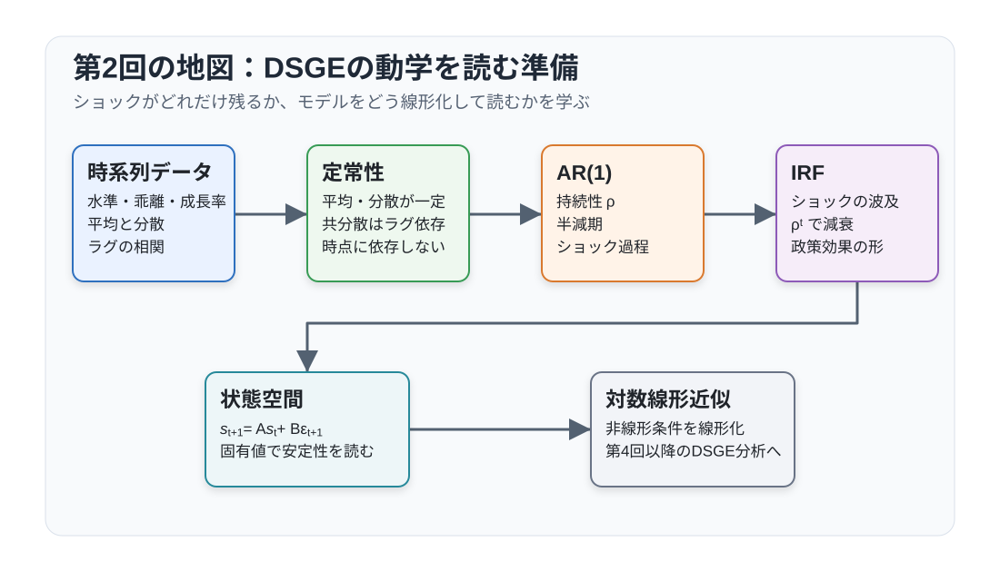
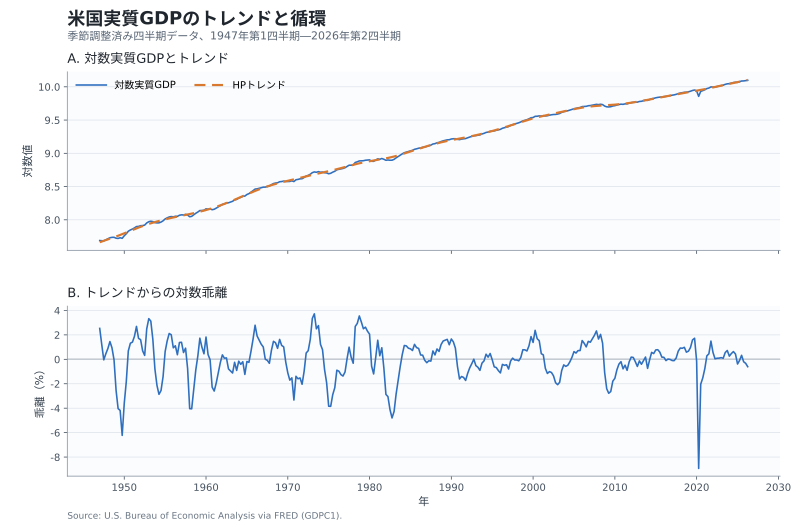
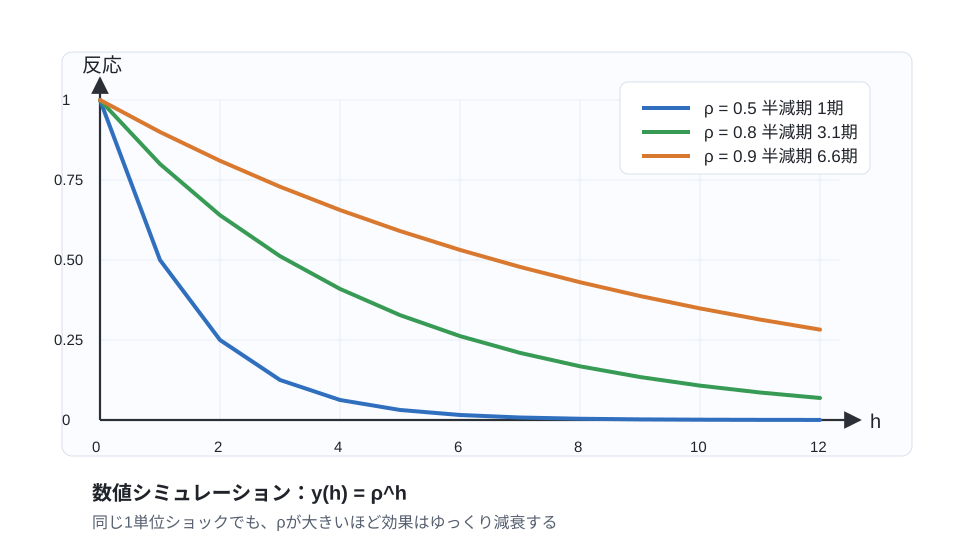
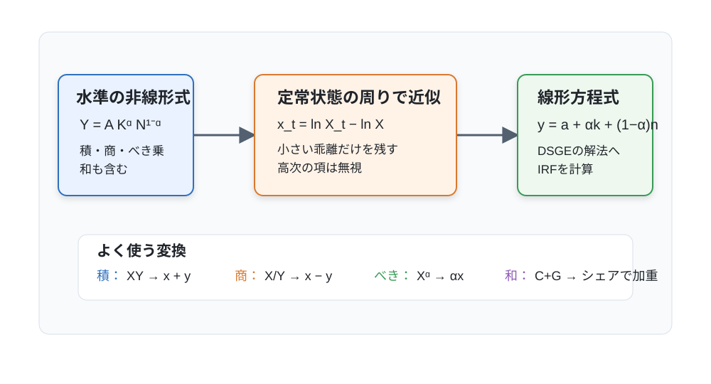

# 講義の目的

本講義では、動学的マクロ経済モデルを読むために必要な時系列分析と対数近似を整理します。第3回以降では、家計や企業の最適化問題から得られる非線形の均衡条件を、定常状態の周りで近似して分析します。その準備として、本講義では次の4点を扱います。

1. **データと時系列分析の基礎**：米国GDPのトレンドと循環、定常性、持続性、自己相関、予測
2. **ショックの波及**：AR(1)、インパルス応答関数、線形状態空間表現
3. **対数線形近似**：非線形方程式を定常状態の周りで線形化する方法
4. **対数二次近似（第9回で再訪）**：水準偏差、効用、価格調整費用に二階項が残る理由

本講義の中心は、モデルの動学を読むための時系列分析と対数線形近似です。対数二次近似は、第9回の厚生分析で用いるロス関数を理解するための参照節として収録しています。初読ではこの節を飛ばしても構いませんが、第9回の前に戻り、一次項が相殺されて $y_t^2$ と $\pi_t^2$ が残る理由を確認してください。本講義では、自然産出量を動かす実物ショックがない基本ケースだけを扱い、技術ショック $a_t$ や政府支出ショック $g_t$ が自然産出量を動かす場合は第8回で説明します。

{#fig-lecture02-overview width=95% fig-pos="H"}

@fig-lecture02-overview は、米国GDPのトレンドと循環を確認してから、定常性、ショックの持続性、状態空間表現、対数線形近似へ進む、初読時の主経路を示しています。対数二次近似は、この主経路から分岐する第9回向けの参照節です。

# 米国GDPのトレンドと景気循環

現実のGDPには長期的な成長傾向があるため、水準のままでは短期的な変動を読み取りにくいです。対数を使うと、GDP水準が異なる時期の変動を比率として比較しやすくなります。@fig-us-real-gdp-trend-cycle は、米国の季節調整済み実質四半期GDPを対数表示し、HPフィルターによって滑らかなトレンドとその周りの循環成分に分けたものです。実質GDPには長期的な上昇傾向がある一方、循環成分はゼロを中心に変動しています。

{#fig-us-real-gdp-trend-cycle width=90% fig-pos="H"}

**Notes:** BEA/FRED の `GDPC1`（2017年連鎖価格、10億ドル、季節調整済み年率、1947年第1四半期--2026年第2四半期）を対数表示しています。下段はトレンドからの対数乖離を100倍した値で、概ねトレンドからの百分率乖離を表します。HPフィルターの平滑化パラメータは $\lambda=1600$、データ取得日は2026年8月15日です。

長期分析では、技術進歩、人口成長、資本蓄積など、経済の成長経路を決める要因を考えます。短期分析では、その成長経路からの一時的な乖離と、ショックが経済へ波及する過程を考えます。本講義では短期分析に集中します。

データでは、トレンドからの対数乖離を景気循環の統計的な尺度として用います。モデルでは、成長する変数を技術や人口などの成長要因で割って定常化し、定常化後の均衡条件を定常状態の周りで対数線形化します。

\Needspace{10\baselineskip}

カリブレーションやモデル評価では、データの循環成分から得られる変動の大きさ、持続性、他の変数との相関を、モデルが生成する系列の対応する統計量と比較します。比較にあたっては、集計値か一人当たりかという変数定義、観測頻度、標本長をそろえます。HP循環成分を比較対象とする場合は、モデル系列にもデータと同じ対数化とHPフィルターを適用し、必要な場合には季節調整もそろえます。HP循環成分は理論上の産出ギャップそのものではありませんが、データとモデルを定量的に結びつける観測上の尺度として用いられます。

この対応を明示するため、本講義では、データのGDP循環成分とモデルの産出の対数偏差を、ともに $y_t$ と表すことがあります。同じ記号を使うのは両者を定義上同一視するためではなく、カリブレーションにおける対応関係を示すためです。自然産出量を基準とするモデル上の産出ギャップは、後に $x_t=y_t-y_t^f$ と区別します。

図の下段では、正または負の乖離が複数四半期続く局面が見られます。この持続性を時点によらない自己相関で要約するには、系列の平均、分散、自己共分散が時間を通じて安定しているかをまず整理する必要があります。そこで次節では、弱定常性と自己相関を導入します。

# 時系列データと定常性

**時系列データとモデルの見方**

前節のGDP循環成分も、各四半期の観測値が時間順に並ぶ時系列です。GDP、消費、インフレ率、名目金利、労働投入、技術水準はいずれも、ある時点だけでなく過去から現在への推移が重要です。短期マクロ分析では、現在の値が過去の状態、現在のショック、将来への期待にどう依存し、その影響が将来にどのように残るかを考えます。

時系列モデルを読むときは、次の3つを区別します。

1. **水準**：$Y_t, C_t, R_t$ のような元の変数
2. **基準からの乖離**：データではトレンドからの乖離、モデルでは定常化後の変数の定常状態からの乖離
3. **成長率・変化率**：$\Delta \ln Y_t=\ln Y_t-\ln Y_{t-1}$

成長するモデルでは、技術や人口などの成長要因で割った変数をまず定常化します。以下でいう「定常状態からの乖離」は、この定常化後の変数についての乖離を指します。元の水準では、これは均衡成長経路からの乖離に対応します。

以下ではこの対応を抽象化し、データ系列とモデル系列のどちらにも適用できる一般的な時系列を $y_t$ と表します。

**弱定常性**

確率過程 $\{y_t\}$ が弱定常であるとは、平均、分散、自己共分散が時間の位置に依存しないことを意味します。具体的には、次を満たすとき、$\{y_t\}$ は弱定常です。

1. 平均が一定：$\mathbb{E}[y_t]=\mu$
2. 分散が一定：$\operatorname{Var}(y_t)=\sigma_y^2$
3. 自己共分散がラグだけに依存：$\operatorname{Cov}(y_t,y_{t-k})=\gamma_k$

たとえばラグ1なら、2026年第2四半期と第1四半期の $y_t$ の共分散が、2010年第2四半期と第1四半期の共分散と同じ関数として記述できるという意味です。ただし、弱定常性が直接意味するのはモーメントの時間不変性であり、個々のショックが減衰することではありません。ショックの減衰には、後で見る安定なAR過程のような追加の動学条件が必要です。

**定常性が重要な理由**

弱定常性が重要なのは、平均、分散、自己共分散を時点をまたいで同じ対象として比較できるからです。たとえば、ラグ1の自己相関を一つの値で要約できるのは、自己共分散が暦上の時点ではなくラグだけに依存するためです。

現実のGDPや消費の水準には、長期的な成長トレンドがあります。そのため、実データの水準をそのまま弱定常な過程として扱うわけではありません。データではトレンド除去後の系列、成長モデルでは定常化後の変数について定常性を考えます。前節のHP循環成分は短期変動を考えるための統計的な入口ですが、HPフィルターの適用だけで循環成分の弱定常性が保証されるわけではありません。ここでは、フィルターの選択や単位根検定の詳細には踏み込みません。

GDPの循環成分は、複数のショックとその波及を反映した内生変数です。以下では、持続性を記述する最も単純な確率過程としてAR(1)を学びます。

\Needspace{12\baselineskip}

# AR(1)過程

**基本形**

マクロ経済学で最もよく使われる確率過程の一つが、1次の自己回帰過程 AR(1) です。
$$
y_t=(1-\rho)\mu+\rho y_{t-1}+\varepsilon_t,
\qquad
\varepsilon_t\sim i.i.d.(0,\sigma_\varepsilon^2)
$$
ここで、$\mu$ は長期平均、$\rho$ は持続性、$\varepsilon_t$ は予期されないイノベーションです。GDP循環成分をAR(1)で記述する場合、$\varepsilon_t$ は一歩先予測誤差としての統計的イノベーションであり、特定の構造ショックとは限りません。DSGEモデルの外生ショック過程として用いる場合には、$\varepsilon_t$ に技術ショックや金融政策ショックなどの構造的な意味をモデル内で与えます。$|\rho|<1$ なら一意な因果的弱定常解が存在します。以下では、初期値もこの定常分布から生成されていると仮定します。任意の固定された初期値から始めた場合、過程の分布は直ちには定常ではありませんが、時間とともに定常分布へ近づきます。

平均は次のように確認できます。両辺の期待値を取ると、
$$
\mathbb{E}[y_t]
=
(1-\rho)\mu+\rho\mathbb{E}[y_{t-1}]
$$
です。弱定常解では $\mathbb{E}[y_t]=\mathbb{E}[y_{t-1}]$ なので、平均は $\mu$ になります。

**分散と自己相関**

平均からの乖離を $\tilde{y}_t\equiv y_t-\mu$ と書くと、AR(1)は
$$
\tilde{y}_t=\rho\tilde{y}_{t-1}+\varepsilon_t
$$
です。定常分散を $\sigma_y^2$ とすると、
$$
\sigma_y^2
=
\rho^2\sigma_y^2+\sigma_\varepsilon^2
$$
より、
$$
\operatorname{Var}(y_t)
=
\frac{\sigma_\varepsilon^2}{1-\rho^2}
$$
を得ます。ここでは、$\varepsilon_t$ が過去の $y_{t-1},y_{t-2},\ldots$ と無相関であることを使っています。また、$k\geq0$ に対する $k$ 期ラグの自己相関は
$$
\operatorname{Corr}(y_t,y_{t-k})=\rho^k
$$
です。$\rho$ が大きいほど、現在の値は過去の値を強く引きずります。

\Needspace{8\baselineskip}

**予測**

AR(1)では、$t$ 期に観察された $y_t$ から、$h$ 期先の条件付き期待値を簡単に計算できます。
$$
\mathbb{E}_t[y_{t+h}]
=
\mu+\rho^h(y_t-\mu)
$$
したがって、$|\rho|<1$ なら、予測値は $h$ が大きくなるにつれて長期平均 $\mu$ に近づきます。

この式は、現在の長期平均からの乖離が将来どれだけ残るかを読むうえで重要です。たとえば $0<\rho<1$ のとき、その乖離が半分になるまでの期間は
$$
h_{1/2}
=
\frac{\ln(0.5)}{\ln(\rho)}
$$
です。$\rho=0.9$ なら半減期は約6.6期、$\rho=0.5$ なら1期です。

# インパルス応答関数

**AR(1)のインパルス応答**

ここでは、平均ゼロの場合、または平均からの乖離 $\tilde y_t$ を $y_t$ と書き直した場合を考えます。インパルス応答関数をAR(1)のイノベーションが1単位発生したとき、その後の変数がどのように反応するかとして導入します。AR(1)
$$
y_t=\rho y_{t-1}+\varepsilon_t
$$
で、$y_{-1}=0$、$\varepsilon_0=1$、$t\geq 1$ では $\varepsilon_t=0$ とすると、
$$
y_0=1,\qquad
y_1=\rho,\qquad
y_2=\rho^2,\qquad
y_h=\rho^h
$$
です。したがって、AR(1)のインパルス応答は $\rho^h$ です。

次の図は、同じ1単位のイノベーションを与えたときの反応を、$\rho=0.5,0.8,0.9$ で比較したものです。$\rho$ が大きいほど影響は長く残り、半減期も長くなります。

{#fig-ar1-irf-simulation width=90%}

@fig-ar1-irf-simulation は、同じ1単位のイノベーションでも、持続性 $\rho$ が大きいほど反応がゆっくり減衰することを示しています。

実データに対するインパルス応答では、統計的イノベーションを特定の構造ショックとして解釈するための識別が別途必要です。

\Needspace{10\baselineskip}

**DSGEモデルでのインパルス応答**

DSGEモデルでは、技術ショック、金融政策ショック、政府支出ショックなどをAR(1)で表すことが多いです。たとえば技術ショックは
$$
a_t=\rho_a a_{t-1}+\varepsilon_t^a
$$
と書かれます。$\rho_a$ が大きいほど、技術ショックは長く残り、産出や労働の反応も長く続きます。

線形化されたDSGEモデルの解は、しばしば次の状態空間表現で書けます。
$$
s_{t+1}=A s_t+B\varepsilon_{t+1}
$$
ここで、$s_t$ は状態変数のベクトル、$\varepsilon_{t+1}$ はショックのベクトルです。産出やインフレ率などの制御変数・観測変数を $z_t$ とすれば、解には
$$
z_t=C s_t
$$
という式も含まれます。このとき、$t+1$ 期のショックが $h$ 期後の状態に与える影響は
$$
A^hB
$$
であり、観測変数への影響は $CA^hB$ です。つまり、インパルス応答関数は、線形システムの行列 $A$ を繰り返し掛けることで得られます。

# 安定性と差分方程式

**1変数の安定性**

1変数の線形差分方程式
$$
x_{t+1}=a x_t
$$
を考えます。初期値が $x_0$ なら、
$$
x_t=a^t x_0
$$
です。したがって、$|a|<1$ なら $x_t$ は0に収束し、$|a|>1$ なら発散します。$a<0$ かつ $|a|<1$ の場合は、符号を交互に変えながら収束します。

この単純な性質は、対数線形化したDSGEモデルでも中心的です。所与の状態遷移
$$
s_{t+1}=A s_t
$$
では、行列 $A$ のすべての固有値が単位円の内側にあれば、新たなショックがないとき $s_t$ は定常状態へ収束します。

ただし、消費やインフレ率のような前向き変数を含む合理的期待モデルでは、「すべての固有値が単位円内」という条件をモデル全体へそのまま適用しません。均衡の一意性には、単位円外の根の数と前向き変数の数が一致するという Blanchard--Kahn 条件が必要です。この講義では状態遷移の安定性だけを扱い、合理的期待均衡の決定性は後続回で扱います。

**前向き変数と期待**

DSGEモデルには、消費、インフレ率、資産価格のように将来への期待で決まる変数が出てきます。たとえば、単純化した前向き方程式
$$
x_t=\alpha\mathbb{E}_t x_{t+1}+u_t,
\qquad 0<\alpha<1
$$
を考えます。有限の $J$ 期先まで前向きに繰り返すと、
$$
x_t
=
\mathbb{E}_t
\sum_{j=0}^{J}\alpha^j u_{t+j}
+\alpha^{J+1}\mathbb{E}_t x_{t+J+1}
$$
です。ここで、終端項を消す無バブル条件
$$
\lim_{J\to\infty}
\alpha^{J+1}\mathbb{E}_t x_{t+J+1}=0
$$
を課すと、
$$
x_t
=
\mathbb{E}_t
\sum_{j=0}^{\infty}\alpha^j u_{t+j}
$$
を得ます。この境界条件は、第3回で扱う横断性条件や資産価格式と同じ種類の役割を果たします。

# 対数線形近似

ここまでは、線形化後の動学を所与として、持続性や安定性を読む方法を学びました。次に、その線形システムを非線形の均衡条件から得る方法を考えます。

対数線形近似は、非線形の均衡条件を、定常状態の周りの小さな乖離について線形の方程式に置き換える方法です。次の図のように、水準の式を対数偏差に変換することで、ショックの波及や安定性を線形システムとして扱えるようになります。

{#fig-log-linearization-map width=92%}

@fig-log-linearization-map は、水準の非線形式を定常状態の周りで展開し、対数偏差の線形方程式へ置き換える手順を示しています。

\Needspace{12\baselineskip}

**対数偏差**

成長する変数については、あらかじめ技術や人口などの成長要因で割って定常化します。以下の $X_t$ は、定常化後の変数、またはもともと定常状態を持つ変数を表し、その定常状態を $X$ とします。元の水準でみれば、定常状態からの乖離は均衡成長経路からの乖離に対応します。対数偏差を
$$
x_t
\equiv
\ln X_t-\ln X
$$
と定義します。定常状態からの乖離が小さいとき、
$$
x_t
\approx
\frac{X_t-X}{X}
$$
なので、$x_t=0.01$ は、およそ定常状態から1パーセント高いことを意味します。

本講義以降では、大文字を水準、小文字を対数偏差として使うことが多くなります。たとえば $Y_t$ は、成長するモデルでは定常化後の産出水準、成長のないモデルでは元の産出水準を表し、$y_t$ はその定常状態からの対数乖離です。

**基本公式**

対数線形化では、積、商、べき乗が簡単に扱えます。$Z_t=X_tY_t$ なら、
$$
z_t=x_t+y_t
$$
です。$Z_t=X_t/Y_t$ なら、
$$
z_t=x_t-y_t
$$
です。$Z_t=X_t^\alpha$ なら、
$$
z_t=\alpha x_t
$$
です。

コブ＝ダグラス型生産関数
$$
Y_t=\exp(a_t)K_t^\alpha N_t^{1-\alpha}
$$
を考えます。ここで $a_t$ は、定常値を0とする対数技術水準です。この生産関数を対数線形化すると、
$$
y_t=a_t+\alpha k_t+(1-\alpha)n_t
$$
です。非線形の生産関数が、対数偏差の線形結合になります。

\Needspace{10\baselineskip}

**和の近似**

和の対数線形化では、定常状態のシェアが係数になります。$Y_t=C_t+G_t$ とし、定常状態でも $Y=C+G$ が成り立つとします。このとき、
$$
y_t
\simeq
\frac{C}{Y}c_t+\frac{G}{Y}g_t
$$
です。ここで $\simeq$ は、二次以上の項を省略した一次近似を表します。資源制約の対数線形化では、このシェアの重みが重要です。

この公式は積の公式より間違えやすい点です。$Y_t=C_t+G_t$ だからといって、$y_t=c_t+g_t$ にはなりません。和を線形化するときは、必ず定常状態の比率で重みづけします。

**総収益率とインフレ率**

金融変数では、粗収益率と純利子率を区別します。時点 $t$ に決まる粗名目利子率を $R_t^N$、$t$ 期から $t+1$ 期にかけての粗インフレ率を $\Pi_{t+1}=P_{t+1}/P_t$ とすると、名目債券の $t+1$ 期に実現する実質総収益率は $R_t^N/\Pi_{t+1}$ です。$r_t^N$ と $\pi_{t+1}$ を、それぞれ粗名目利子率と粗インフレ率の定常状態からの対数乖離とします。実現した事後実質利子率の対数乖離を $r_{t+1}^{\mathrm{post}}$ と書けば、対数の恒等式から
$$
r_{t+1}^{\mathrm{post}}
=
r_t^N-\pi_{t+1}
$$
となります。

第7回以降のNKモデルでは、時点 $t$ の意思決定に入る事前実質利子率を
$$
r_t
=
r_t^N-\mathbb{E}_t\pi_{t+1}
$$
と定義します。事後実質利子率 $r_{t+1}^{\mathrm{post}}$ と事前実質利子率 $r_t$ を区別することで、時点添字と情報集合が明確になります。

第7回・第8回では、この関係が家計のオイラー方程式、フィッシャー方程式、テイラー・ルールを結び、3本のNK方程式の利子率ブロックになります。

**初読はここまでです。** 対数二次近似を飛ばし、「まとめと第3回への接続」へ進んで構いません。

\newpage

# 対数二次近似：第9回の厚生分析への準備

**この節の読み方**

この節は第9回の厚生分析で再び使います。初読ではこの節全体を飛ばしても構いません。目を通す場合は、二次近似によってロス関数に $x_t^2$ と $\pi_t^2$ が現れるという結論だけを確認し、導出の詳細は第9回の前に読み直しても構いません。

対数線形近似は、定常状態からの乖離の一次項だけを残します。多くの均衡条件を解くにはこれで十分です。しかし、厚生ロスや価格調整費用のように、定常状態で一次の効果が消え、二階の効果が重要になる対象があります。この場合は **対数二次近似** を使います。

## 対数偏差と水準偏差の二次近似

変数 $X_t$ の定常状態を $X$、対数偏差を
$$
x_t=\ln X_t-\ln X
$$
とします。このとき
$$
X_t=X\exp(x_t)
$$
なので、水準の相対偏差は
$$
\frac{X_t-X}{X}
=
\exp(x_t)-1
=
x_t+\frac{1}{2}x_t^2+O(3)
$$
です。一次近似では $\frac{X_t-X}{X}\approx x_t$ でした。二次近似では、$x_t^2/2$ が追加されます。

逆に、水準の相対偏差を
$$
\hat X_t\equiv\frac{X_t-X}{X}
$$
と書くと、
$$
x_t
=
\ln(1+\hat X_t)
=
\hat X_t-\frac{1}{2}\hat X_t^2+O(3)
$$
です。対数偏差と水準偏差は一次では同じですが、二次では符号の異なる補正項を持ちます。

ここで $O(3)$ は、三次以上の小さい項をまとめた記号です。たとえば $x_t^3$、$x_t^2y_t$、$x_ty_t^2$ のような項は、二次近似では捨てます。

## 積と和の二次近似：基本形

積や商は、対数を取ると正確に足し算・引き算になります。したがって、
$$
Z_t=X_tY_t
$$
なら、対数偏差では
$$
z_t=x_t+y_t
$$
が一次でも二次でも正確に成り立ちます。二次項が出てくるのは、これを水準偏差に戻すときです。
$$
\frac{Z_t-Z}{Z}
=
\exp(z_t)-1
=
x_t+y_t+\frac{1}{2}(x_t+y_t)^2+O(3).
$$

和の近似では、二次項にも定常状態シェアが入ります。$Y_t=C_t+G_t$、$Y=C+G$ とし、
$$
s_C\equiv\frac{C}{Y},
\qquad
s_G\equiv\frac{G}{Y},
\qquad
s_C+s_G=1
$$
とします。対数偏差を用いると、
$$
\exp(y_t)
=
s_C\exp(c_t)+s_G\exp(g_t)
$$
です。右辺を二次まで展開し、さらに対数を二次まで展開すると、
$$
y_t
=
s_Cc_t+s_Gg_t
+\frac{1}{2}
\left[
s_Cc_t^2+s_Gg_t^2
-(s_Cc_t+s_Gg_t)^2
\right]
+O(3).
$$
2変数の和では、これは
$$
y_t
=
s_Cc_t+s_Gg_t
+\frac{1}{2}s_Cs_G(c_t-g_t)^2
+O(3)
$$
とも書けます。

一次近似では $y_t=s_Cc_t+s_Gg_t$ だけが残ります。二次近似では、構成要素の相対的な散らばり $(c_t-g_t)^2$ が追加されます。本講義で必要なのは、二次近似では「平均の動き」だけでなく「散らばり」も残る、という点です。

## 効用関数の二次近似

第9回で扱うロス関数は、家計効用の二次近似から導けます。ここでは基本計算だけを確認します。この節では、自然産出量を動かす実物ショックがない基本ケースを考えます。したがって、柔軟価格の自然産出量は定常状態にあり、その対数偏差は $y_t^f=0$ です。このとき、産出の対数偏差 $y_t$ は需給ギャップ $x_t=y_t-y_t^f$ と一致します。

代表的家計の期間効用を一般には
$$
U(C_t,N_t)
=
\frac{C_t^{1-\gamma}}{1-\gamma}
-
\frac{N_t^{1+\varphi}}{1+\varphi}
$$
とします。ここで $\gamma>0$、$\gamma\neq1$、$\varphi\geq0$ とします。$\gamma=1$ の場合は、極限として $\ln C_t$ を用います。定常状態の限界効用で測った消費価値 $U_C C$ で正規化し、$c_t=\ln(C_t/C)$、$n_t=\ln(N_t/N)$ と書くと、一般形は
$$
\frac{U(C_t,N_t)-U(C,N)}{U_C C}
=
c_t
+\frac{1-\gamma}{2}c_t^2
-\omega_N
\left[
n_t+\frac{1+\varphi}{2}n_t^2
\right]
+O(3)
$$
です。ここで
$$
\omega_N
\equiv
\frac{N^{1+\varphi}}{U_C C}
$$
は、定常状態での労働不効用の大きさを消費価値で測った係数です。

以下では、厚生ロスの基本形を見やすくするため、効率的な定常状態を仮定します。線形生産 $Y=N$ と政府支出のない資源制約 $C=Y$ のもとでは、効率性条件から
$$
U_C C=N^{1+\varphi}
$$
となるため、$\omega_N=1$ です。独占的競争がある場合には、売上補助金が定常状態のマークアップを相殺していると仮定します。$C=N=1$ は、水準の単位を簡単にするための追加的な正規化であり、$\omega_N=1$ を導く条件ではありません。この単位のもとでは、
$$
\frac{U(C_t,N_t)-U(C,N)}{U_C C}
=
c_t-n_t
+\frac{1-\gamma}{2}c_t^2
-\frac{1+\varphi}{2}n_t^2
+O(3)
$$
です。効率性条件を課さない場合や定常状態に歪みが残る場合には、一般形の $\omega_N$ を残す必要があります。

この基本ケースでも、価格が硬直的な経済では、金融政策ショックなどによって $y_t$ と $\pi_t$ は変動し得ます。生産は線形で、
$$
n_t=y_t
$$
です。政府支出もなく、定常状態では価格調整費用とその一次項がゼロになると仮定します。このとき、価格調整費用を考慮した資源制約は二次まで
$$
c_t
=
y_t-\frac{\eta}{2}\pi_t^2+O(3)
$$
と書けます。ここで $\eta\pi_t^2/2$ は Rotemberg 型価格調整費用です。$\eta$ は第7回以降でも使う価格調整費用の原始パラメータです。価格調整費用はすでに二次の項なので、$c_t^2$ の中では $c_t=y_t$ と置いてよいです。

これを効用近似に代入すると、
$$
\frac{U(C_t,N_t)-U(C,N)}{U_C C}
=
-\frac{\gamma+\varphi}{2}y_t^2
-\frac{\eta}{2}\pi_t^2
+O(3)
$$
を得ます。この基本ケースでは $y_t^f=0$ なので、$x_t=y_t$ と読めます。したがって、政策に依存する厚生ロスは
$$
\ell_t
=
\frac{1}{2}
\left[
(\gamma+\varphi)x_t^2+\eta\pi_t^2
\right]
$$
と書けます。

この式は、第9回の最適金融政策で使う目的関数の基礎になります。ただし、ここで導いたのは、効率的な定常状態の周りにおける特殊ケースの期間効用近似です。確率的な政策間で期待厚生を二次の精度で比較する一般的な問題では、目的関数だけでなく政策関数も二次まで近似する必要があります（Schmitt-Grohé and Uribe, 2004）。

第8回のRANKモデルでは、技術ショック $a_t$ と政府支出ショック $g_t$ が自然産出量を動かします。ここで $g_t$ は政府支出ショックであり、需給ギャップではありません。本講義では、定常状態のマークアップが相殺され、柔軟価格の自然配分が政策上の効率的配分に一致する基本ケースを使います。この条件のもとでは、厚生ロスに入る産出項は $y_t^2$ ではなく、自然産出量からの乖離
$$
x_t=y_t-y_t^f
$$
です。第8回では、この $y_t^f$ が $a_t$ と $g_t$ の関数になることをモデルの中で確認します。

定常状態の歪みが残る場合や、自然産出量と効率的産出量が一致しない場合には、厚生上の産出ギャップは $y_t-y_t^f$ ではなく、効率的産出量からの乖離 $y_t-y_t^{\mathrm{eff}}$ で定義する必要があります。ただし、その場合には一次項が残ったり、係数や目標値が変わったりするため、以下の基本ケースの二次ロスをそのまま用いることはできません。

正の定数 $\gamma+\varphi$ で割っても最適政策は変わらないので、基本ケースのロス関数は
$$
\ell_t
\propto
\frac{1}{2}
\left(
x_t^2+\omega_p\pi_t^2
\right),
\qquad
\omega_p=\frac{\eta}{\gamma+\varphi}
$$
と正規化できます。

\Needspace{12\baselineskip}

# まとめと第3回への接続

**初読時に押さえるポイント**

1. **トレンドと循環**：実質GDPには長期的な成長トレンドがある。HP循環成分は、同じ変換とフィルターのもとでモデル系列と統計量を比較し、データとモデルを定量的に結びつける観測上の尺度である。自然産出量を基準とする産出ギャップ $x_t=y_t-y_t^f$ とは区別する。
2. **定常性**：平均、分散、自己共分散が時間に依存しないとき、時系列は弱定常である。ショックの減衰には、これに加えて安定な動学が必要である。
3. **AR(1)**：$|\rho|<1$ なら因果的弱定常解が存在し、イノベーションの影響は $\rho^h$ の速さで減衰する。
4. **インパルス応答**：線形システムでは、ショックの動学的効果は状態方程式を繰り返すことで得られる。
5. **安定性**：所与の状態遷移では固有値が収束性を決める。前向き変数を含む合理的期待モデルでは、Blanchard--Kahn 条件を別に確認する。
6. **対数線形近似**：積と商は簡単だが、和の近似では定常状態のシェアが必要である。

**第9回の前に再訪するポイント**

- **対数二次近似**：自然産出量を動かす実物ショックがない効率定常状態の基本ケースでは、$y_t^f=0$ なので $x_t=y_t$ となり、効用近似から $y_t^2$ と $\pi_t^2$ のロス関数が得られる。実物ショックが自然産出量を動かす場合は、第8回で $x_t=y_t-y_t^f$ として扱う。

次回は、制約つき最適化を正面から扱います。有限期間のラグランジュ問題から出発し、無限期間、ダイナミック・プログラミング、不確実性、資産価格条件へ進みます。

# 参考文献

**データ**

- U.S. Bureau of Economic Analysis (2026) "Real Gross Domestic Product" (`GDPC1`), retrieved from [FRED, Federal Reserve Bank of St. Louis](https://fred.stlouisfed.org/series/GDPC1), August 15, 2026.

**必読**

- Hamilton, James D. (1994) *Time Series Analysis*. Princeton University Press. AR過程、定常性、インパルス応答の標準的な参照先。
- Ljungqvist, Lars, and Thomas J. Sargent (2018) *Recursive Macroeconomic Theory* (4th ed.). MIT Press. 動学モデルの状態変数、再帰表現、線形化の背景を確認するため。
- Galí, Jordi (2015) *Monetary Policy, Inflation, and the Business Cycle* (2nd ed.). Princeton University Press. 対数線形化をニューケインジアン・モデルで使う入口。

**発展**

- Blanchard, Olivier J., and Charles M. Kahn (1980) "The Solution of Linear Difference Models under Rational Expectations." *Econometrica*, 48(5), 1305-1311. [doi](https://doi.org/10.2307/1912186)
- Schmitt-Grohé, Stephanie, and Martín Uribe (2004) "Solving Dynamic General Equilibrium Models Using a Second-Order Approximation to the Policy Function." *Journal of Economic Dynamics and Control*, 28(4), 755-775. [doi](https://doi.org/10.1016/S0165-1889(03)00043-5)
- Judd, Kenneth L. (1998) *Numerical Methods in Economics*. MIT Press. 近似解法と数値計算を深く学ぶため。

# 演習問題

## 基本問題

**問1 [Core] [Computation]：AR(1)のインパルス応答**

次のAR(1)過程を考えます。
$$
y_t=0.8y_{t-1}+\varepsilon_t
$$
$y_{-1}=0$、$\varepsilon_0=1$、$t\geq 1$ では $\varepsilon_t=0$ とします。$t=0,1,2,3,4$ における $y_t$ を求めなさい。また、イノベーションの影響の半減期を計算しなさい。

**問2 [Core] [Computation]：平均回帰**

次の過程を考えます。
$$
y_t=(1-\rho)\mu+\rho y_{t-1}+\varepsilon_t,
\qquad
\rho=0.6,\quad \mu=2
$$
$y_t=5$ が観察されたとき、$\mathbb{E}_t[y_{t+1}]$ と $\mathbb{E}_t[y_{t+2}]$ を求めなさい。

**問3 [Core] [Computation] [Derivation]：和の対数線形化**

資源制約 $Y_t=C_t+G_t$ を考えます。定常状態で $C/Y=0.8$、$G/Y=0.2$ とします。$C_t$ が定常状態から1パーセント高く、$G_t$ が定常状態から2パーセント高いとき、$Y_t$ は定常状態からおよそ何パーセント高いですか。

**問4 [Core] [Derivation]：フィッシャー方程式**

名目債券の来期実質総収益率が $R_t^N/\Pi_{t+1}$ で与えられるとします。対数を取り、事後実質利子率についての恒等式と、期待インフレ率を用いた事前実質利子率の関係を導いてください。また、名目利子率が上昇しても期待インフレ率が同じだけ上昇する場合、事前実質利子率がどうなるか説明しなさい。

\Needspace{11\baselineskip}

**問5 [Core]：GDPのトレンド、循環、定常性**

@fig-us-real-gdp-trend-cycle の上段にある対数実質GDPと、下段にあるHP循環成分を比べます。弱定常な系列として扱うのにより適しているのはどちらですか。平均が時間に依存するかに触れて説明しなさい。また、HP循環成分の統計量をモデル系列と比較するとき、モデル系列にそろえるべき変数定義と変換を挙げなさい。

\Needspace{12\baselineskip}

**問6 [Core] [Computation]：状態空間表現と安定性**

新たなショックがない状態遷移
$$
s_{t+1}=As_t,
\qquad
A=
\begin{pmatrix}
0.8 & 0.2\\
0 & 1.05
\end{pmatrix}
$$
を考えます。$A$ の固有値を求め、この系が定常状態へ収束するかを説明しなさい。

## 発展問題

**問7 [第9回前に再訪] [Derivation]：対数二次近似**

対数偏差 $x_t=\ln X_t-\ln X$ が小さいとします。次を求めなさい。

1. $(X_t-X)/X$ の二次近似。
2. 自然産出量を動かす実物ショックがなく、一次まで $c_t=n_t=y_t$ と読める基本ケースでは、効用近似の二次項が $-\{(\gamma+\varphi)/2\}y_t^2$ になることを確認しなさい。
3. Rotemberg 型価格調整費用が $c_t=y_t-\eta\pi_t^2/2+O(3)$ と表せるとき、ロス関数が $[(\gamma+\varphi)y_t^2+\eta\pi_t^2]/2$ になることを説明しなさい。
