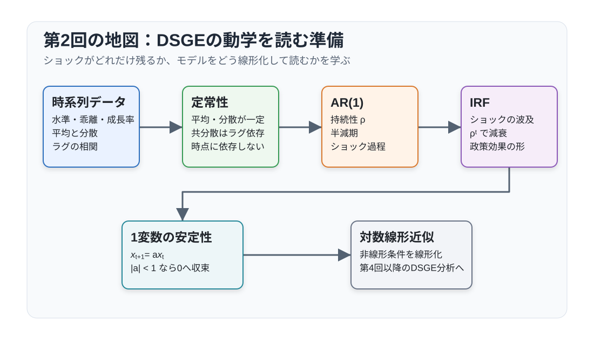
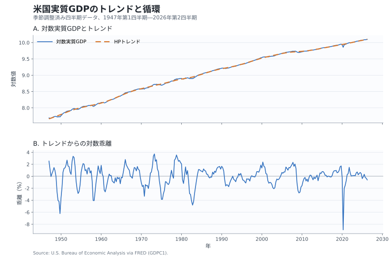
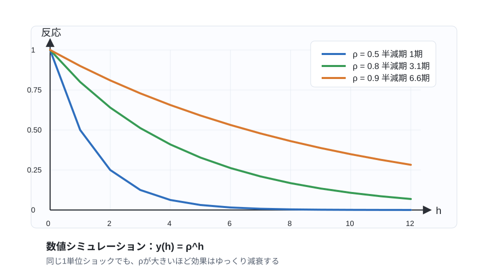
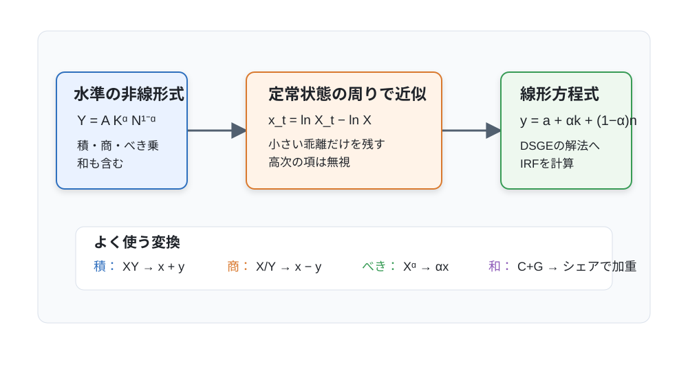

# 講義の目的

本講義では、動学的な現代マクロ経済モデルの理解に欠かせない、時系列分析の基礎と対数近似の手法を体系的に整理します。第3回以降では、家計や企業の動学的な最適化問題から導く非線形の均衡条件を、定常状態のまわりで線形近似して分析します。その準備として、次の4つのトピックを扱います。

1. **データと時系列分析の基礎**：米国GDPのトレンドと景気循環、弱定常性、ショックの持続性、自己相関、および条件付き予測
2. **ショックの波及メカニズム**：1次の自己回帰過程 AR(1)、インパルス応答関数、および1変数の差分方程式の収束・発散
3. **対数線形近似の手法**：非線形な均衡方程式を定常状態のまわりで1次に線形化する計算技術
4. **対数二次近似の基礎（第9回の厚生分析で再訪）**：水準偏差と対数偏差の二次の差異、効用関数や価格調整費用に2階の項が残る理由

本講義の中心的な学習目標は、モデルの動学的な動きを理解するために、時系列分析の基礎と対数線形近似を身につけることです。第4のトピックである対数二次近似は、第9回の最適金融政策で用いる社会的ロス関数の導出を理解するための参照節です。初読時には飛ばしても差し支えありません。第9回を学ぶ前に戻り、1次の効果が相殺され、需給ギャップの2乗（$x_t^2$）とインフレ率の2乗（$\pi_t^2$）が残る仕組みをぜひ確認してください。

本講義では、まず自然産出量を動かす実物ショックがない、最も基本的なケースを扱います。技術ショック $a_t$ や政府支出ショック $g_t$ によって自然産出量自体が変動する一般的なケースは、第8回で詳しく解説します。

{#fig-lecture02-overview width=95% fig-pos="H"}

@fig-lecture02-overview は、米国GDPの実データでトレンドと循環を確認し、定常性、ショックの持続性、1変数の差分方程式、対数線形近似へと進む、初読時の学習の順序を示しています。対数二次近似は、この内容を発展させた第9回向けの参照節です。

# 米国GDPのトレンドと景気循環

現実のGDPデータには、長期的な経済成長の傾向であるトレンドが含まれます。そのため、実額の水準値のままでは、短期的な景気循環の変動を正確に読み取るのが困難です。自然対数に変換すると、GDPの水準が大きく異なる時代でも、変動の大きさを比率、つまりパーセントで一貫して比較できます。

@fig-us-real-gdp-trend-cycle は、米国の季節調整済み実質四半期GDPを自然対数で表したものです。Hodrick and Prescott (1997) のHPフィルターを用いて、緩やかに推移する長期トレンドと、そのまわりを上下する循環成分に分解しています。実質GDPは長期的に上昇する一方、循環成分はゼロを中心に周期的に変動していることが、一目で分かります。

{#fig-us-real-gdp-trend-cycle width=90% fig-pos="H"}

**注記：** 米国商務省経済分析局（BEA）/ セントルイス連銀FREDの `GDPC1`（2017年連鎖価格、10億ドル、季節調整済み年率、1947年第1四半期〜2026年第2四半期）を対数表示した系列です。下段のグラフはトレンドからの対数乖離を100倍した値であり、トレンドからのパーセント乖離（％偏差）を表しています。HPフィルターの平滑化パラメータには四半期データの標準値である $\lambda=1600$ を適用しています（データ取得日：2026年8月15日）。

長期のマクロ経済分析では、技術進歩、人口増加、資本蓄積など、持続的な成長経路を決める要因に着目します。一方、短期のマクロ経済分析では、その成長経路からの一時的な乖離と、予期せぬショックが経済全体に波及する動学的な過程を分析します。本講義では、主にこの短期分析を扱います。

実証分析では、長期トレンドからの対数乖離を、景気循環の統計的な代理変数として用います。一方、理論モデルでは、成長を続ける変数を技術水準や人口などの外生的な成長要因で割り、まず定常化（Detrending）します。その上で、均衡方程式を定常状態のまわりで対数線形近似します。

\Needspace{10\baselineskip}

マクロモデルのカリブレーションや妥当性の評価では、実データの循環成分と、モデルのシミュレーションで得た対応系列の統計量を比較します。比較するのは、変動幅を表す標準偏差、ショックの持続性を表す自己相関、他の変数との相関です。厳密に比較するには、集計値か一人当たり変数かという定義、観測頻度、サンプル期間をそろえる必要があります。

HP循環成分を比較の基準にする場合は、モデルの系列にも実データと同じ対数変換とHPフィルターを適用します。必要に応じて季節調整の有無も統一します。HP循環成分は、理論モデルの自然産出量からの需給ギャップそのものとは厳密には異なります。それでも、データと理論モデルを定量的に結びつける実証的な共通尺度として、広く用いられています。

この対応関係を示すため、本講義では、実データのGDP循環成分と理論モデルの産出量の対数乖離を、便宜的に同じ記号 $y_t$ で表すことがあります。同じ記号でも、両者が理論上同一という意味ではありません。カリブレーションでの定量的な対応を示すための慣例です。後続回では、自然産出量を基準とする理論上の産出ギャップ、つまり需給ギャップを $x_t = y_t - y_t^f$ と表し、記号を明示的に区別します。

ただし、HPフィルターには端点問題があります。新しい観測データが加わると、サンプル末端付近のトレンド推定値が遡って変わってしまう性質です。また、フィルター処理が系列の自己相関構造を変え、元のデータ生成過程にはない人工的な動学パターンを生み出す懸念も指摘されています（Hamilton, 2018）。図の下段で観察される景気変動の持続性には、こうしたフィルターの性質が反映されている面もあることに留意が必要です。

図の下段には、正または負の乖離が複数四半期にわたって続く局面があります。過去のショックの影響が時間を超えて残る性質を、持続性と呼びます。これを時点によらない共通の自己相関で要約するには、平均、分散、自己共分散が時間を通じて安定しているかを数学的に整理する必要があります。そこで次節では、弱定常性と自己相関を導入します。

\Needspace{12\baselineskip}

# 時系列データと定常性

**時系列データとモデルの見方**

前節の実質GDPの循環成分も、各四半期の観測値を時間順に記録した時系列（Time Series）データです。GDP、個人消費、インフレ率、名目金利、労働投入量、技術水準などのマクロ経済変数では、ある時点の値だけでなく、過去から現在までの推移が決定的に重要です。短期マクロ分析では、現在の値が過去の状態、当期のショック、将来への期待にどう左右されるかを分析します。さらに、その影響が将来の経済にどう残るかを論理的に解明します。

動学的な時系列モデルを理解するには、変数の捉え方として次の3つを明確に区別することが基本です。

1. **水準（Level）**：$Y_t$、$C_t$、$R_t$ などの元の単位で測った変数
2. **基準からの乖離（Deviation）**：実データにおける長期トレンドからの乖離、または理論モデルにおける定常状態からのパーセント乖離
3. **成長率・変化率（Growth Rate）**：$\Delta \ln Y_t = \ln Y_t - \ln Y_{t-1}$ のような前期比の変化率

長期的な成長を伴うモデルでは、変数を技術水準や人口などの成長要因で割り、あらかじめ定常な形に変換します。以下の「定常状態からの乖離」は、この定常化した変数の乖離を指します。元の水準値で見れば、均衡成長経路からの乖離に対応します。

以下では、実データと理論モデルの双方に適用できる一般的な時系列変数として、$y_t$ を用いて説明します。

**弱定常性（Weak Stationarity）**

確率過程 $\{y_t\}$ が弱定常、または共分散定常であるとは、平均、分散、自己共分散が時点 $t$ に依存しないことです。数学的には、次の3条件をすべて満たすとき、$\{y_t\}$ を弱定常と定義します。

1. **平均が時間を通じて一定である**：$\mathbb{E}[y_t] = \mu$
2. **分散が有限で、時間を通じて一定である**：$\operatorname{Var}(y_t) = \sigma_y^2 < \infty$
3. **自己共分散が時点 $t$ ではなくラグの長さ $k$ だけに依存する**：$\operatorname{Cov}(y_t, y_{t-k}) = \gamma_k$

例えばラグが1（$k=1$）なら、2026年第2四半期とその直前四半期の共分散も、2010年第2四半期とその直前四半期の共分散も、時代によらず同じ値（$\gamma_1$）になります。ただし、弱定常性が保証するのは、平均や共分散などの統計的モーメントが時間によらず一定ということだけです。個別のショックが時間とともに減衰し、ゼロに戻ることまで意味しません。ショックが減衰して定常状態に戻るには、後述する安定なAR過程のような、動学的な安定性条件も満たす必要があります。

**強定常性（厳密定常性）との違い**

強定常性とは、任意の有限個の時点について、それらの値の同時分布が、すべての時点を同じだけずらしても変わらないことです。弱定常性が平均・分散・自己共分散に着目するのに対し、強定常性は分布全体に関する条件です。強定常で、かつ分散が有限なら弱定常ですが、逆は一般には成り立ちません。本講義では、弱定常性を中心に扱います。

**定常性が重要となる理由**

弱定常性は、マクロ経済分析で極めて重要です。弱定常性が満たされて初めて、異なる時代の平均、分散、自己相関を、同一の母集団から得た共通の統計量として比較・推定できます。例えば、ラグ1の自己相関を1つの数値で要約できるのは、2時点間の関連性が暦上の時点ではなく、時間の間隔であるラグだけに依存するためです。

現実の実質GDPや消費の水準値には、長期的な成長トレンドがあります。そのため、水準データをそのまま弱定常な過程として扱うことはできません。実証分析ではトレンドを除いた循環系列を用います。成長理論モデルでは、変数を成長要因で割って定常化し、その定常性を議論します。

前節のHP循環成分は、短期変動を分析するための実用的な統計ツールです。ただし、HPフィルターをかけても、循環成分の弱定常性が数学的に完全に保証されるわけではありません。フィルターの選択や単位根検定の詳細は本講義の範囲を超えるため、ここでは深入りしません。

現実のGDP循環成分は、様々なショックと、それに対する経済主体の複雑な反応が合わさった内生変数です。次節では、ショックの持続的な影響を記述する、最も基本的で重要な確率過程として、1次の自己回帰過程AR(1)を学びます。

\Needspace{12\baselineskip}

# AR(1)過程

**基本形**

マクロ経済学において、経済ショックの動学的な持続性を表現するために最も標準的に用いられる確率過程が、1次の自己回帰過程（Autoregressive process of order 1, AR(1)）です。
$$
y_t=(1-\rho)\mu+\rho y_{t-1}+\varepsilon_t,
\qquad
\varepsilon_t\sim i.i.d.(0,\sigma_\varepsilon^2)
$$
各パラメータと変数の意味は次のとおりです。

- $\mu$：過程の長期平均（定常値）
- $\rho$：持続性パラメータ（自己回帰係数）
- $\varepsilon_t$：時点 $t$ において新たに発生する予期せぬショック（平均0、分散 $\sigma_\varepsilon^2$ のホワイトノイズ・イノベーション）

実データのGDP循環成分をAR(1)で推計する場合、$\varepsilon_t$ は一歩先予測の誤差を表す統計的イノベーションです。必ずしも特定の経済ショックを直接意味しません。一方、DSGEモデルの外生ショック過程として用いる場合は、$\varepsilon_t$ に技術ショックや金融政策ショックなどの明確な構造的意味を与えます。

持続性パラメータの絶対値が1未満（$|\rho|<1$）なら、因果的かつ一意な弱定常解が存在します。この解は、過去の無限個のショックの加重和で表されます。以下では、初期値もこの定常分布から生成されていると仮定します。任意の固定した初期値から始めても、時間とともに過程の分布は定常分布へと速やかに収束します。

過程の平均は、方程式の両辺の期待値を取ると簡単に確認できます。
$$
\mathbb{E}[y_t]
=
(1-\rho)\mu+\rho\mathbb{E}[y_{t-1}]
$$
弱定常解のもとではすべての時点で平均が等しい（$\mathbb{E}[y_t]=\mathbb{E}[y_{t-1}]$）ため、長期平均は $\mathbb{E}[y_t]=\mu$ と求まります。

\Needspace{9\baselineskip}

**分散と自己相関**

平均からの乖離を $\tilde{y}_t\equiv y_t-\mu$ と定義すると、AR(1)過程は定数項のない簡単な形に書き換えられます。
$$
\tilde{y}_t=\rho\tilde{y}_{t-1}+\varepsilon_t
$$
定常状態における分散を $\sigma_y^2$ とすると、両辺の分散をとることで
$$
\sigma_y^2
=
\rho^2\sigma_y^2+\sigma_\varepsilon^2
$$
が成り立ちます。これを $\sigma_y^2$ について解くことで、定常分散の公式
$$
\operatorname{Var}(y_t)
=
\frac{\sigma_\varepsilon^2}{1-\rho^2}
$$
が得られます。ここで、当期のショック $\varepsilon_t$ は過去の実現値 $y_{t-1}, y_{t-2}, \ldots$ と全く無相関であるという性質を用いています。

また、$k$ 期離れた時点間の相関を表す $k$ 次の自己相関係数は、
$$
\operatorname{Corr}(y_t,y_{t-k})=\rho^k \qquad (k\geq0)
$$
となります。持続性パラメータ $\rho$ が1に近いほど、過去の変動の影響は将来にも強く残ります。

\Needspace{8\baselineskip}

**条件付き予測と半減期**

AR(1)過程の大きな利点の一つは、現時点 $t$ の観測値 $y_t$ から、$h$ 期先の期待値を極めて容易に計算できることです。この条件付き予測値は、次の式で求まります。
$$
\mathbb{E}_t[y_{t+h}]
=
\mu+\rho^h(y_t-\mu)
$$
$|\rho|<1$ である限り、予測ホライズン $h$ が大きくなるにつれて $\rho^h \to 0$ となるため、将来の予測値は緩やかに長期平均 $\mu$ へと回帰していきます（平均回帰性）。

この関係式は、現在の平均からの乖離が、将来どのくらいの速さで解消されるかを評価する上で決定的に重要です。持続性が正（$0<\rho<1$）の場合、乖離が半分になるまでの期間を半減期（Half-life）と呼びます。$\rho^h = 0.5$ を解くと、次の式が得られます。
$$
h_{1/2}
=
\frac{\ln(0.5)}{\ln(\rho)}
$$
例えば、四半期データにおいて $\rho=0.9$ であれば半減期は約6.6四半期（約1年半以上）になるのに対し、$\rho=0.5$ であればわずか1四半期でショックの影響が半減します。

# インパルス応答関数

**AR(1)のインパルス応答**

ここでは簡単化のため、平均がゼロの場合、または平均からの乖離 $\tilde{y}_t$ を $y_t$ と表記する場合を考えます。インパルス応答関数（Impulse Response Function, IRF）は、予期せぬショックであるイノベーションが、ある時点で1単位だけ発生した後の反応を追うものです。変数が将来にわたってどう反応し、定常状態へと減衰するかを、時間の関数で表します。

定常状態（$y_{-1}=0$）にあるAR(1)過程
$$
y_t=\rho y_{t-1}+\varepsilon_t
$$
に対して、$t=0$ に大きさ1のショックが発生し（$\varepsilon_0=1$）、その後の期には新たなショックが一切発生しない（$t\geq 1$ で $\varepsilon_t=0$）と仮定します。このとき、各期における変数の値は次のように逐次的に定まります。
$$
y_0=1,\qquad
y_1=\rho,\qquad
y_2=\rho^2,\qquad \ldots \qquad
y_h=\rho^h
$$
したがって、AR(1)過程のインパルス応答関数は、幾何級数列 $\rho^h$ です。

次の図は、同じ大きさの1単位の初期ショックに対する反応経路を、持続性パラメータの違い（$\rho=0.5, 0.8, 0.9$）で比較したシミュレーション結果です。$\rho$ が大きいほど、ショックの影響は長く残り、半減期も大幅に長くなることが、図からも確認できます。

{#fig-ar1-irf-simulation width=90%}

@fig-ar1-irf-simulation は、同じ1単位のショックでも、持続性パラメータ $\rho$ によって経済への影響の持続期間が大きく異なることを示しています。

なお、実データのVARモデルなどからインパルス応答関数を計測する場合は、識別（Identification）の手続きが別途必要です。これは、観察された統計的イノベーションから、真の金融政策引き締めショックなど、特定の意味を持つ構造ショックを統計的に分離・特定する手続きです。

\Needspace{10\baselineskip}

**DSGEモデルでのインパルス応答**

現代のDSGEモデルでは、技術ショック、金融政策ショック、政府支出ショックなどの外生ショックを、多くの場合AR(1)過程で定式化します。例えば、全要素生産性の対数乖離である技術ショック $a_t$ は、
$$
a_t=\rho_a a_{t-1}+\varepsilon_t^a
$$
と表現されます。$0\leq\rho_a<1$ の範囲では、持続性パラメータ $\rho_a$ が大きいほど、技術ショックそのものが長く残ります。このショックに対する各変数の反応も持続しやすくなりますが、反応の符号はモデルや選好に依存します。例えば第4回の固定資本モデルでは、正の技術ショックに対して産出量は増加する一方、雇用は消費の相対的リスク回避度 $\gamma$ に応じて増加・不変・減少のいずれにもなります。

第8回で扱う基本モデルでは、各変数の定常状態からの乖離は外生ショックに比例します。例えば、ある変数の反応が $y_t=k a_t$ と表される場合、$k$ はモデルを解いて求める反応の係数です。技術ショックが時点0に1単位だけ発生し、その後に新たなショックがなければ、$a_h=\rho_a^h$ なので、
$$
y_h=k\rho_a^h
$$
となります。最初の反応の大きさと符号を $k$ が、影響の残り方を $\rho_a^h$ が表すと考えれば、AR(1)の知識を使って反応経路を読めます。資本蓄積などを含むモデルでは経路がより複雑になることもありますが、この段階では「ショックの後、各変数がどのように動くか」を追うという考え方を押さえてください。

# 安定性と差分方程式

**1変数の線形差分方程式と安定性**

最も単純な1変数の同次線形差分方程式
$$
x_{t+1}=a x_t
$$
を考えます。初期値を $x_0$ とすると、任意の時点 $t$ における解は
$$
x_t=a^t x_0
$$
と表されます。係数 $a$ を1期ごとに掛けるため、$|a|$ が1より小さいか大きいかで、初期の乖離が縮小するか拡大するかが分かります。

- $|a|<1$ の場合：$x_t$ は初期値によらず0へ収束する。例えば $a=0.8$、$x_0=1$ なら、$1,\ 0.8,\ 0.64,\ 0.512,\ldots$ と小さくなる。
- $-1<a<0$ の場合も $|a|<1$ なので0へ収束するが、符号は毎期反転する。例えば $a=-0.8$、$x_0=1$ なら、$1,\ -0.8,\ 0.64,\ -0.512,\ldots$ と振動しながら0に近づく。
- $|a|>1$ の場合：$x_0\neq0$ なら、$|x_t|$ は際限なく大きくなる。例えば $a=1.05$ なら、乖離の大きさは毎期5％ずつ拡大する。

境界の $a=1$ では初期値がそのまま続き、$a=-1$ では同じ大きさで符号が反転し続けます。いずれも、$x_0\neq0$ なら0には収束しません。

このように、**初期の乖離が時間とともに0へ戻る性質**を、ここでは安定性と呼びます。AR(1)で新たなショックが発生しないときの動きも同じ仕組みです。$|\rho|<1$ なら、過去のショックの影響は時間とともに小さくなります。

\Needspace{9\baselineskip}

**前向き変数と期待形成**

ここまでは、現在の値から次の期の値を求めました。一方、家計の消費や企業の価格設定では、**将来をどう予想するかが現在の選択に影響します**。この関係を簡単な式で表すと、
$$
x_t=\alpha\mathbb{E}_t x_{t+1}+u_t,
\qquad 0<\alpha<1
$$
となります。$\mathbb{E}_t$ は時点 $t$ の情報に基づく予想、$u_t$ は当期の外生要因、$\alpha$ は将来の予想に掛ける重みです。現在の $x_t$ は、当期の $u_t$ と来期の $x_{t+1}$ の予想から決まります。

来期にも同じ関係が成り立つので、$x_{t+1}=u_{t+1}+\alpha\mathbb{E}_{t+1}x_{t+2}$ を代入すると、
$$
x_t=u_t+\alpha\mathbb{E}_t u_{t+1}
+\alpha^2\mathbb{E}_t x_{t+2}
$$
となります。ここでは「来期の予想を今日の情報で予想し直すと、今日の予想になる」という条件付き期待値の性質を使っています。同じ代入を繰り返すと、
$$
x_t
=
\mathbb{E}_t
\sum_{j=0}^{J}\alpha^j u_{t+j}
+\alpha^{J+1}\mathbb{E}_t x_{t+J+1}
$$
と書けます。右端は、まだ代入していない遠い将来の値の影響です。ここで、この影響が十分遠い将来には消えるという「**無バブル条件**」
$$
\lim_{J\to\infty}
\alpha^{J+1}\mathbb{E}_t x_{t+J+1}=0
$$
を置くと、外生要因の割引和が収束するもとで、
$$
x_t
=
\mathbb{E}_t
\sum_{j=0}^{\infty}\alpha^j u_{t+j}
$$
が得られます。例えば $u_t$ がどの期も一定の $\bar u$ なら、等比級数の公式から $x_t=\bar u/(1-\alpha)$ です。

\Needspace{12\baselineskip}

無バブル条件の役割を、この定数の例で確かめましょう。不確実性のない経路を考えると、無バブル条件を課さなければ、
$$
\bar x=\frac{\bar u}{1-\alpha},
\qquad
x_t=\bar x+\left(\frac{1}{\alpha}\right)^t b_0
$$
も、任意の定数 $b_0$ について元の方程式を満たします。ここで $b_0=x_0-\bar x$ は、実際の初期値 $x_0$ の定常値からの乖離です。$0<\alpha<1$ なので、$b_0\neq0$ ならこの乖離は拡大し続けます。この追加項は、無バブル条件にある割引を行っても残ります。**無バブル条件はこの追加項を除き**、$b_0=0$、すなわち $x_t=\bar u/(1-\alpha)$ という解を選びます。

ここで押さえる点は、**現在の値には、当期の要因だけでなく将来の要因についての予想も重み付きで反映される**ことです。この考え方は、第3回以降の消費のオイラー方程式や資産価格の分析につながります。

# 対数線形近似

ここまでは、線形の差分方程式を使い、ショックの持続性、収束・発散、将来への期待の役割を確認しました。ここからは、家計や企業の最適化行動から得られる非線形な均衡条件を、扱いやすい線形方程式に近似する対数線形近似（Log-linear approximation）を学びます。

対数線形近似は、非線形な均衡条件を、定常状態のまわりの微小な乖離について1次のテイラー展開を行い、線形方程式に置き換える手法です。次の概念図のように、水準値の非線形方程式を対数偏差の線形関係に変換します。これにより、ある変数の変化が他の変数にどの程度影響するかを計算しやすくなります。

{#fig-log-linearization-map width=92%}

@fig-log-linearization-map は、水準値の非線形方程式を定常状態のまわりで1次展開し、対数偏差の線形方程式に置き換える手順を示しています。

\Needspace{12\baselineskip}

**対数偏差の定義と経済学的意味**

長期的に成長を続ける変数は、あらかじめ技術水準や人口などの成長要因で割って定常化します。以下では、大文字 $X_t$ は、この定常化した変数、または最初から定常状態を持つ変数を表します。その長期定常状態の値を $X$ とします。元の水準値で見れば、定常状態からの乖離は均衡成長経路からの乖離に対応します。

このとき、定常状態からの**対数偏差（Log-deviation）** $x_t$ を次のように定義します。
$$
x_t
\equiv
\ln X_t-\ln X
=
\ln\left(\frac{X_t}{X}\right)
$$
定常状態からの乖離が十分に小さいとき（$|x_t|\ll 1$）、1次テイラー近似 $\ln(1+\Delta) \approx \Delta$ より、
$$
x_t
=
\ln\left(1+\frac{X_t-X}{X}\right)
\approx
\frac{X_t-X}{X}
$$
という極めて有用な近似関係が成り立ちます。つまり、対数偏差 $x_t=0.01$ は、「変数 $X_t$ がその定常状態から約1パーセント（$+1\%$）だけ高い水準にあること」を直観的に意味します。

本講義以降では、変数の水準値を大文字（$Y_t, C_t, N_t$ など）、定常状態からの対数偏差を小文字（$y_t, c_t, n_t$ など）で書き分ける標準的な表記法を一貫して用います。例えば $Y_t$ は（定常化後の）産出水準そのものを表し、$y_t$ はその定常状態からのパーセント乖離を表します。

**基本公式：積・商・べき乗**

対数線形近似の最大の強みは、積・商・べき乗の関係を、対数を取るだけで足し算・引き算の線形関係に変換できる点です。この変換は厳密で、近似誤差はありません。

- **積の変換**：$Z_t=X_tY_t \implies z_t=x_t+y_t$
- **商の変換**：$Z_t=X_t/Y_t \implies z_t=x_t-y_t$
- **べき乗の変換**：$Z_t=X_t^\alpha \implies z_t=\alpha x_t$

例えば、マクロ経済学で標準的なコブ＝ダグラス型生産関数
$$
Y_t=\exp(a_t)K_t^\alpha N_t^{1-\alpha}
$$
を考えます。ここで $a_t$ は定常値を0とする対数全要素生産性（技術ショック）です。この生産関数の両辺の自然対数を取って定常状態からの偏差を求めると、一切の近似誤差なく次の線形関係が得られます。
$$
y_t=a_t+\alpha k_t+(1-\alpha)n_t
$$
このように、非線形な生産関数を、各要素の対数偏差の単純な線形結合で表せます。

\Needspace{10\baselineskip}

**和の対数線形近似：定常状態シェアによる加重平均**

一方、足し算（和）で表された関係式を対数線形化する際には、1次のテイラー展開が必要となり、**定常状態における各要素の構成比（シェア）**が線形結合の係数として現れます。

一例として、経済の資源制約式 $Y_t=C_t+G_t$ を考えます。定常状態において正の値 $C>0, G>0$ で $Y=C+G$ が満たされているとします。各変数自身の定常状態からの対数偏差を
$$
y_t\equiv\ln\frac{Y_t}{Y},
\qquad
c_t\equiv\ln\frac{C_t}{C},
\qquad
g_t\equiv\ln\frac{G_t}{G}
$$
と定義すると、資源制約式の1次対数線形近似は次のようになります。
$$
y_t
\simeq
\frac{C}{Y}c_t+\frac{G}{Y}g_t
$$
ここで記号 $\simeq$ は、2次以上の微小項を切り捨てた1次近似であることを表しています。

この公式は、初学者が最も誤りやすいポイントの一つです。$Y_t=C_t+G_t$ でも、対数偏差を単純に $y_t=c_t+g_t$ と足し合わせることはできません。和の対数線形化では、定常状態の各支出項のGDPシェア（$C/Y$ や $G/Y$）で必ず加重平均する点に注意してください。

なお、第5回の講義ノートでは、政府支出ショックの大きさを産出量と同じスケールで比較しやすくするため、同じ記号 $g_t$ を対数偏差ではなく「定常産出に対する水準差の比率」として $g_t\equiv(G_t-G)/Y$ と再定義します。この第5回の定義を採用した場合、資源制約式の1次近似は
$$
y_t
\simeq
\frac{C}{Y}c_t+g_t
$$
というさらに簡単な形になります。ただし、この2つの定義の互換性が保たれるのは1次近似までであり、後述する2次近似では単純に置き換えることができません。本節の以下の二次近似の解説では、一貫して $g_t=\ln(G_t/G)$ という政府支出自身の対数偏差を用います。

**総収益率、インフレ率、およびフィッシャー方程式**

金融変数や名目変数では、1を加えた粗収益率（Gross return）と、百分率で表す純利子率（Net rate）を明確に区別することが重要です。

時点 $t$ に決まる粗名目利子率を $R_t^N$ とします。純利子率を $i_t$ とすると、$R_t^N=1+i_t$ です。$t$ 期から $t+1$ 期の粗インフレ率は $\Pi_{t+1}=P_{t+1}/P_t$ とします。純インフレ率を $\pi_{t+1}$ とすると、$\Pi_{t+1}=1+\pi_{t+1}$ です。名目安全債券に投資した家計が $t+1$ 期に受け取る、事後的な実質総収益率は $R_t^N/\Pi_{t+1}$ です。

それぞれの定常状態からの対数乖離を $r_t^N\equiv \ln(R_t^N/R^N)$、$\pi_{t+1}\equiv \ln(\Pi_{t+1}/\Pi)$ と定義すると、実現した**事後実質利子率（Ex-post real interest rate）**の対数乖離 $r_{t+1}^{\mathrm{post}}$ は、対数の商の公式から正確に次の引き算となります。
$$
r_{t+1}^{\mathrm{post}}
=
r_t^N-\pi_{t+1}
$$

第7回以降のニューケインジアン（NK）モデルでは、家計が時点 $t$ に消費や貯蓄を決める際に直面する事前実質利子率（Ex-ante real interest rate） $r_t$ を用います。将来のインフレ率の条件付き期待値を使い、次のように定義します。
$$
r_t
=
r_t^N-\mathbb{E}_t\pi_{t+1}
$$
これは、学部マクロで学んだフィッシャー方程式（$i \approx r + \pi^e$）の対数線形版です。事後実質利子率 $r_{t+1}^{\mathrm{post}}$ と事前実質利子率 $r_t$ を厳密に書き分けることで、時点の添字と経済主体が持つ情報集合の違いが明確になります。

第7回・第8回では、この事前実質利子率の関係を通じて、家計の消費オイラー方程式、フィッシャー方程式、中央銀行のテイラー・ルールを結びつけます。これらが3方程式NKモデルの利子率ブロックを構成します。

**【初読時のガイド】** 初読時の学習はここまでで十分です。次の「対数二次近似」セクションをスキップして、末尾の「まとめと第3回への接続」へ直接進んで構いません。

\newpage

# 対数二次近似：第9回の厚生分析への準備

**この節の読み方と位置づけ**

この節の計算手法は、第9回の「最適金融政策と厚生分析」で本格的に用います。初読時には、この節全体を飛ばしても問題ありません。目を通す場合は、なぜ社会的ロス関数に需給ギャップの2乗（$x_t^2$）とインフレ率の2乗（$\pi_t^2$）が現れるのか、という結論の直観だけを把握してください。数式導出の細部は、第9回を受講する前に改めて読み直してください。

1次の対数線形近似は、定常状態からの乖離の1次項、つまり傾きだけを取り出す手法です。大半の動学的均衡条件を解くには、十分な精度があります。

しかし、中央銀行が最小化すべき社会的損失や、企業の価格改定に伴う調整費用の分析では、2次の効果が重要です。効率的な定常状態のまわりでは、1次の効果である限界的な余剰変化がゼロになり、2階の変動、つまりボラティリティが本質的な厚生悪化をもたらします。このような政策評価には1次近似では不十分で、2次項までを厳密に考慮する対数二次近似（Second-order approximation）が不可欠です。

## 対数偏差と水準偏差の二次近似

変数 $X_t$ の定常状態を $X$ とし、その対数偏差を
$$
x_t=\ln X_t-\ln X
$$
と定義します。このとき水準値は指数関数を用いて
$$
X_t=X\exp(x_t)
$$
と表せるため、定常状態からの水準の相対偏差（パーセント変化率）を2次のマクローリン展開すると、
$$
\frac{X_t-X}{X}
=
\exp(x_t)-1
=
x_t+\frac{1}{2}x_t^2+O(3)
$$
となります。1次近似では $(X_t-X)/X \approx x_t$ でしたが、2次近似に拡張すると、右辺に2次の補正項 $+x_t^2/2$ が加わることが分かります。

逆に、水準の相対偏差を
$$
\hat X_t\equiv\frac{X_t-X}{X}
$$
と定義した上で、これを対数偏差 $x_t$ で表すために展開すると、
$$
x_t
=
\ln(1+\hat X_t)
=
\hat X_t-\frac{1}{2}\hat X_t^2+O(3)
$$
となります。このように、対数偏差と水準偏差は1次近似の範囲では完全に一致しますが、2次近似に拡張した場合には、互いに符号の異なる2次の補正項を持つ点に注意が必要です。

なお、ここで用いている記号 $O(3)$ は、「3次以上の極めて小さな項（例えば $x_t^3$、$x_t^2y_t$ など）」をまとめて省略したことを意味します。

## 積と和の二次近似：基本公式

非線形な積や商は、自然対数を取ることで厳密に足し算・引き算へと変換されます。したがって、
$$
Z_t=X_tY_t
$$
という関係がある場合、対数偏差については
$$
z_t=x_t+y_t
$$
という関係が、1次・2次近似だけでなく、厳密解としても誤差なく成立します。2次項が現れるのは、対数偏差を元の水準偏差に書き戻す段階です。
$$
\frac{Z_t-Z}{Z}
=
\exp(z_t)-1
=
x_t+y_t+\frac{1}{2}(x_t+y_t)^2+O(3).
$$

一方、足し算（和）で表された関係式を2次近似する場合、2次の項にも定常状態のシェアが関わります。ここでも、各構成要素自身の定常状態からの対数偏差を $c_t=\ln(C_t/C)$、$g_t=\ln(G_t/G)$ と定義します。経済の資源制約式 $Y_t=C_t+G_t$（定常状態 $Y=C+G$）において、各支出の定常シェアを
$$
s_C\equiv\frac{C}{Y},
\qquad
s_G\equiv\frac{G}{Y},
\qquad
s_C+s_G=1
$$
とおきます。対数偏差を用いて資源制約を書き直すと、
$$
\exp(y_t)
=
s_C\exp(c_t)+s_G\exp(g_t)
$$
となります。この両辺を2次までテイラー展開し、整理すると、
$$
y_t
=
s_Cc_t+s_Gg_t
+\frac{1}{2}
\left[
s_Cc_t^2+s_Gg_t^2
-(s_Cc_t+s_Gg_t)^2
\right]
+O(3)
$$
という展開式が得られます。2変数の和の場合、角括弧の中身は分散の公式と同様に変形できるため、次のようにまとめられます。
$$
y_t
=
s_Cc_t+s_Gg_t
+\frac{1}{2}s_Cs_G(c_t-g_t)^2
+O(3)
$$

1次近似の段階では、加重平均である $y_t=s_Cc_t+s_Gg_t$ だけが残っていました。これに対し2次近似では、構成要素間の相対的な乖離（散らばり）の2乗を表す項 $\frac{1}{2}s_Cs_G(c_t-g_t)^2$ が追加されることが分かります。ここで理解しておくべき核心は、2次近似では平均的な動きに加え、構成要素間の不均衡やばらつき自体も追加的な影響を及ぼすという直観です。

## 効用関数の二次近似と社会的ロス関数の導出

第9回で扱う中央銀行の目的関数である社会的ロス関数は、代表的家計の生涯効用関数の2次近似から厳密に導出します。ここでは、その基礎となる計算手順を確認します。

本節では、論点を明確にするため、自然産出量を変動させる実物ショックがない、最も基本的なケースを想定します。価格が伸縮的な場合の自然産出量は常に定常状態にとどまり、その対数偏差は $y_t^f=0$ です。このとき、産出量の対数偏差 $y_t$ は、需給ギャップ $x_t \equiv y_t - y_t^f$ と完全に一致します。

代表的家計の1期間の効用関数を、標準的なCRRA型効用関数
$$
U(C_t,N_t)
=
\frac{C_t^{1-\gamma}}{1-\gamma}
-
\frac{N_t^{1+\varphi}}{1+\varphi}
$$
とします。ここで $\gamma>0$（$\gamma\neq1$）は相対的リスク回避度（消費の異時点間代替弾力性の逆数）、$\varphi\geq0$ は労働供給のフリッシュ弾力性の逆数です（$\gamma=1$ の場合は極限として $\ln C_t$ となります）。

定常状態の消費の限界効用で測った消費の価値 $U_C C$ で全体を割り、正規化します。対数偏差 $c_t=\ln(C_t/C)$、$n_t=\ln(N_t/N)$ を用いて2次近似すると、次の一般形が得られます。
$$
\frac{U(C_t,N_t)-U(C,N)}{U_C C}
=
c_t
+\frac{1-\gamma}{2}c_t^2
-\omega_N
\left[
n_t+\frac{1+\varphi}{2}n_t^2
\right]
+O(3)
$$
ここで、係数
$$
\omega_N
\equiv
\frac{N^{1+\varphi}}{U_C C}
$$
は、定常状態における労働の限界不効用の大きさを、消費の限界効用で換算した相対ウェイトを表しています。

以下では、厚生損失の基本形を直観的に導くため、歪みのない効率的な定常状態を仮定します。線形な生産技術 $Y=N$ と、政府支出のない資源制約 $C=Y$ のもとでは、社会的最適な効率性条件から $U_C C=N^{1+\varphi}$ が成り立ちます。そのため、相対ウェイトは $\omega_N=1$ です。独占的競争があっても、適切な売上補助金で定常状態のマークアップを相殺していると想定します。さらに、水準値の単位を正規化して $C=N=1$ と置くと、展開式は次の形になります。
$$
\frac{U(C_t,N_t)-U(C,N)}{U_C C}
=
c_t-n_t
+\frac{1-\gamma}{2}c_t^2
-\frac{1+\varphi}{2}n_t^2
+O(3)
$$
なお、定常状態に市場の歪みが残っている一般的なケースでは、1次の効果が相殺されずに残るため、$\omega_N$ を含めたより一般的な評価が必要となります。

この基本ケースでも、価格硬直性がある場合は、予期せぬ金融政策ショックなどによって産出量 $y_t$ やインフレ率 $\pi_t$ が定常状態から変動し得ます。生産技術が線形なので、労働投入量と産出量の対数偏差は一致します（$n_t=y_t$）。また、政府支出はなく、定常状態では価格調整費用とその1次の効果がゼロと仮定します。企業の価格改定に伴う実物資源の損失を表すRotemberg型価格調整費用 $\frac{\eta}{2}\pi_t^2$ を考慮すると、資源制約式の2次近似は次のとおりです。
$$
c_t
=
y_t-\frac{\eta}{2}\pi_t^2+O(3)
$$
ここで $\eta>0$ は、第7回以降で登場するRotemberg型の価格調整費用パラメータです。価格調整費用自体がすでに2次の微小項であるため、2乗項 $c_t^2$ の中では単純に $c_t=y_t$ と近似して差し支えありません。

これらを先ほどの効用の2次展開式に代入すると、$c_t-n_t$ の1次成分は相殺されます。ただし、その2次成分である価格調整費用は残り、
$$
c_t-n_t=-\frac{\eta}{2}\pi_t^2+O(3)
$$
となります。この項と消費・労働の2乗項を合わせることで、
$$
\frac{U(C_t,N_t)-U(C,N)}{U_C C}
=
-\frac{\gamma+\varphi}{2}y_t^2
-\frac{\eta}{2}\pi_t^2
+O(3)
$$
が得られます。
この基本ケースでは自然産出量ショックがなく、$y_t^f=0$ なので、$y_t$ は需給ギャップ $x_t$ に一致します。効用変化の符号を反転すると、政策当局が最小化すべき1期間の社会的厚生損失、つまりロス関数 $\ell_t$ が得られます。
$$
\ell_t
=
\frac{1}{2}
\left[
(\gamma+\varphi)x_t^2+\eta\pi_t^2
\right]
$$

この結果は、第9回で学ぶ最適金融政策の目的関数を理論的に支えます。産出量が自然水準から乖離すると効用が低下し、その損失は需給ギャップの2乗 $x_t^2$ で表されます。また、価格調整の摩擦によって実物資源が浪費されると効用が低下し、その損失はインフレ率の2乗 $\pi_t^2$ で表されます。この2つが、2次の精度で家計の厚生を引き下げる主因です。

ただし、ここで導いたのは、効率的な定常状態のまわりで、自然産出量ショックがない特殊ケースの期間効用近似です。一般に、効用近似に政策依存の1次項が残る場合は、政策ルールを2次の精度で比較するため、政策決定関数（ポリシー・ファンクション）も2次まで解く必要があります。

一方、効率的な定常状態のまわりで制約条件を使い、政策依存の1次項を除いて純粋な2次損失に整理できる場合は、1次の政策決定関数で厚生を2次の精度まで評価できます。必要な近似次数を分ける条件は、確率的ショックの有無そのものではありません（Schmitt-Grohé and Uribe, 2004）。第8・9回では、この純粋な2次損失と線形の均衡条件を組み合わせて政策を評価します。

さらに、第8回で学ぶRANKモデルでは、外生的な技術ショック $a_t$ や政府支出ショック $g_t$ が発生し、これらが自然産出量 $y_t^f$ そのものを動学的に変動させます。その一般的なケースにおいても、定常状態の歪みが相殺されていれば、社会的ロス関数に入る産出項は $y_t^2$ そのものではなく、自然産出量からの乖離である
$$
x_t=y_t-y_t^f
$$
となります。第8回では、この $y_t^f$ が技術ショックや財政ショックの関数としてどのように理論的に決定されるかを明確に導出します。

最後に、ロス関数の全体を正の定数 $\gamma+\varphi$ で割っても最適政策の決定ルールは一切変わりません。したがって、標準的なマクロ経済学では、基本ケースのロス関数を次のように正規化して用いるのが一般的です。
$$
\ell_t
\propto
\frac{1}{2}
\left(
x_t^2+\omega_p\pi_t^2
\right),
\qquad
\omega_p\equiv\frac{\eta}{\gamma+\varphi}
$$
ここで $\omega_p$ は、産出の安定化に対して中央銀行がインフレの安定化をどれだけ重視するかを表す相対的な選好ウェイトとなります。

\Needspace{12\baselineskip}

# まとめと第3回への接続

**初読時に押さえるべき重要ポイント**

1. **トレンドと景気循環**：現実の実質GDPには長期的な成長トレンドが存在する。HPフィルターから得られる循環成分は、実データと理論モデルを定量的に比較するための実証的な共通尺度である。ただし、自然産出量を基準とする理論上の産出ギャップ（$x_t=y_t-y_t^f$）とは概念上明確に区別する必要がある。
2. **弱定常性**：平均、分散、自己共分散がカレンダー上の時点に依存しないとき、時系列過程は弱定常である。ショックが時間とともに自然に減衰して消滅するためには、弱定常性に加えて動学的な安定性条件が満たされなければならない。
3. **AR(1)過程**：持続性パラメータが $|\rho|<1$ を満たすとき、因果的かつ一意な弱定常解が存在し、ショックの影響は $\rho^h$ の幾何級数的なスピードで定常状態へと減衰する。
4. **インパルス応答関数**：1単位のショックが発生した後、各変数がどのように動くかを追ったもの。AR(1)では $\rho^h$ となり、反応がショックに比例する基本モデルでは、その係数を掛けて計算できる。
5. **差分方程式と安定性**：$x_{t+1}=ax_t$ の解は $x_t=a^t x_0$。$|a|<1$ なら初期の乖離は0へ収束する。また、前向きの方程式では、将来の要因についての予想が現在の値に影響する。
6. **対数線形近似**：積・商・べき乗は対数を取ることで厳密に線形化できる。一方、和の対数線形化では、定常状態における各要素の構成比（シェア）による加重平均となる。

**第9回を学ぶ前に再訪すべきポイント**

- **対数二次近似**：自然産出量を動かす実物ショックが存在しない効率的な定常状態のもとでは、$y_t^f=0$ かつ $x_t=y_t$ となり、家計の効用関数の2次展開から需給ギャップの2乗（$x_t^2$）とインフレ率の2乗（$\pi_t^2$）からなる社会的ロス関数が厳密に導出される。実物ショックが存在する一般的なケースでは、第8回において需給ギャップを $x_t=y_t-y_t^f$ として再定義する。

次回の第3回では、現代動学マクロ経済学の根幹となる動学的最適化手法を学びます。有限期間のラグランジュ未定乗数法から始め、無限期間への拡張、ベルマン方程式によるダイナミック・プログラミング、不確実性のもとでの意思決定へと進みます。さらに、確率的割引因子（SDF）による資産価格付け条件を学びます。

# 参考文献

**実証データ**

- U.S. Bureau of Economic Analysis (2026) "Real Gross Domestic Product" (`GDPC1`), retrieved from [FRED, Federal Reserve Bank of St. Louis](https://fred.stlouisfed.org/series/GDPC1), August 15, 2026.

**基本参考文献**

予習では、本講義ノートの本編と基本問題に目を通してください。以下は、各トピックの理論や手法を復習し、さらに理解を深めるための代表的な文献です。

- Hamilton, James D. (1994) [*Time Series Analysis*](https://www.jstor.org/stable/j.ctv14jx6sm). Princeton University Press. AR過程、定常性、インパルス応答関数に関する時系列分析の世界的に評価されている標準的な専門書。
- Ljungqvist, Lars, and Thomas J. Sargent (2018) [*Recursive Macroeconomic Theory* (4th ed.)](https://mitpress.mit.edu/9780262038669/recursive-macroeconomic-theory/). MIT Press. 動学モデルの再帰的定式化や線形化手法の理論的背景を確認するための教科書。
- Galí, Jordi (2015) *Monetary Policy, Inflation, and the Business Cycle* (2nd ed.). Princeton University Press. 第2章において、家計や企業の非線形な最適化条件を対数線形近似する具体的な手順が極めて分かりやすく解説されている。[著者の第2章講義スライド](https://crei.cat/wp-content/uploads/users/pages/ch2_slides_october_2015.pdf)。
- Hodrick, Robert J., and Edward C. Prescott (1997) "Postwar U.S. Business Cycles: An Empirical Investigation." *Journal of Money, Credit and Banking*, 29(1), 1-16. [doi](https://doi.org/10.2307/2953682) 実質GDPのトレンド・循環分解と、データとモデル系列に同一のフィルター処理を施す現代的評価手法の原典。

```{=latex}
\Needspace{10\baselineskip}
```

**発展的文献**

- Schmitt-Grohé, Stephanie, and Martín Uribe (2004) "Solving Dynamic General Equilibrium Models Using a Second-Order Approximation to the Policy Function." *Journal of Economic Dynamics and Control*, 28(4), 755-775. [doi](https://doi.org/10.1016/S0165-1889(03)00043-5) DSGEモデルにおいて2次近似を用いた厳密な厚生評価を行うための標準的手法を提示した重要論文。
- Judd, Kenneth L. (1998) [*Numerical Methods in Economics*](https://mitpress.mit.edu/9780262547741/numerical-methods-in-economics/). MIT Press. 高次の摂動法や数値計算アルゴリズムを数学的に深く学ぶための専門書。
- Hamilton, James D. (2018) "Why You Should Never Use the Hodrick-Prescott Filter." *Review of Economics and Statistics*, 100(5), 831-843. [doi](https://doi.org/10.1162/rest_a_00706) HPフィルターが抱える端点問題やスプリアスな動学関係の生成リスクを批判的に検証した論文。[著者公開草稿](https://econweb.ucsd.edu/~jhamilto/hp.pdf)。

# 演習問題

## 基本問題

### 問1 [Core] [Computation]：AR(1)のインパルス応答

次のAR(1)過程を考えます。
$$
y_t=0.8y_{t-1}+\varepsilon_t
$$
初期状態を $y_{-1}=0$ とし、$t=0$ において1単位のショック $\varepsilon_0=1$ が発生し、その後の期間（$t\geq 1$）では新たなショックが発生しない（$\varepsilon_t=0$）と仮定します。

1. $t=0, 1, 2, 3, 4$ における変数の値 $y_t$ をそれぞれ計算しなさい。
2. このショックの影響が初期値の半分にまで減衰するのに要する期間（半減期 $h_{1/2}$）を求めなさい。

### 問2 [Core] [Computation]：平均回帰と条件付き予測

次のAR(1)過程を考えます。
$$
y_t=(1-\rho)\mu+\rho y_{t-1}+\varepsilon_t,
\qquad
\rho=0.6,\quad \mu=2
$$
現時点 $t$ において $y_t=5$ が観察されたとします。この情報のもとでの1期先および2期先の条件付き予測値 $\mathbb{E}_t[y_{t+1}]$ と $\mathbb{E}_t[y_{t+2}]$ をそれぞれ求めなさい。

### 問3 [Core] [Computation] [Derivation]：資源制約の対数線形化

経済の資源制約式 $Y_t=C_t+G_t$ を考えます。本講義の定義に従い、$c_t=\ln(C_t/C)$、$g_t=\ln(G_t/G)$ とします。定常状態において民間消費シェアが $C/Y=0.8$、政府支出シェアが $G/Y=0.2$ であるとします。ある四半期において、消費 $C_t$ が定常状態から1パーセント高く、政府支出 $G_t$ が定常状態から2パーセント高いとき、総産出量 $Y_t$ は定常状態からおよそ何パーセント高い水準にあると推定されますか。1次の対数線形近似式を用いて計算しなさい。

### 問4 [Core] [Derivation]：フィッシャー方程式と事前・事後実質利子率

名目安全債券の来期における事後的な実質総収益率が $R_t^N/\Pi_{t+1}$ で与えられるとします。

1. この式の自然対数をとることで、定常状態からの対数乖離について事後実質利子率 $r_{t+1}^{\mathrm{post}}$、名目利子率 $r_t^N$、およびインフレ率 $\pi_{t+1}$ の間に成り立つ恒等式を導出しなさい。
2. 将来のインフレ期待値 $\mathbb{E}_t\pi_{t+1}$ を導入し、事前実質利子率 $r_t$ の定義式（対数線形版フィッシャー方程式）を導きなさい。
3. 中央銀行が名目金利を引き上げたとしても、市場の期待インフレ率がそれと全く同じ幅だけ上昇した場合、事前実質利子率はどのように変化するかを説明しなさい。

\Needspace{11\baselineskip}

### 問5 [Core]：GDPのトレンド、景気循環、および弱定常性

@fig-us-real-gdp-trend-cycle において、上段に示された「対数実質GDPの水準系列」と、下段に示された「HPフィルターによる循環成分系列」を比較します。

1. 統計的な「弱定常過程」として扱うのにより適しているのはどちらの系列ですか。系列の平均が時間に依存しているかどうかに言及して説明しなさい。
2. HP循環成分の統計量（標準偏差や自己相関など）を理論モデルのシミュレーション結果と比較する際、モデル側の系列に対してそろえておくべき「変数定義」および「データ変換処理」を具体的に挙げなさい。

\Needspace{12\baselineskip}

### 問6 [Core] [Derivation]：AR(1)ショックと前向き方程式

次のモデルを考えます。
$$
x_t=\alpha\mathbb{E}_t x_{t+1}+u_t,
\qquad
u_t=\rho u_{t-1}+\varepsilon_t.
$$
$0<\alpha<1$、$|\rho|<1$ とし、$\varepsilon_t$ は過去の情報から独立で、平均0・分散有限の同一分布に従うショックとします。当期の $u_t$ は観察され、本文の無バブル条件が成立すると仮定します。

1. $\mathbb{E}_t u_{t+1}$ と $\mathbb{E}_t u_{t+2}$ を求め、一般に $\mathbb{E}_t u_{t+j}=\rho^j u_t$（$j\geq0$）となることを確認しなさい。
2. 本文の前向き解 $x_t=\sum_{j=0}^{\infty}\alpha^j\mathbb{E}_t u_{t+j}$ と等比級数の公式を使い、$x_t$ を $u_t$ の関数として求めなさい。
3. $u_{-1}=0$ とし、$t=0$ に1単位のショック $\varepsilon_0=1$ が発生し、その後は新たなショックが発生しない（$h\geq1$ で $\varepsilon_h=0$）とします。$h\geq0$ における $u_h$ と $x_h$ の経路、すなわち単位ショックに対するインパルス応答を求めなさい。

\Needspace{18\baselineskip}

## 発展問題

### 問7 [第9回前に再訪] [Derivation]：対数二次近似と社会的ロス関数

定常状態からの対数偏差 $x_t=\ln X_t-\ln X$ が十分に微小であると仮定します。

1. 水準の相対偏差 $(X_t-X)/X$ を $x_t$ について2次までマクローリン展開し、1次項と2次項を導出しなさい。
2. 自然産出量を変動させる実物ショックが存在せず、1次の精度で $c_t=n_t=y_t$ が成り立つ効率的定常状態の基本ケースにおいて、代表的家計の正規化された効用の2次近似式が $-\frac{\gamma+\varphi}{2}y_t^2$ に帰着することを確認しなさい。
3. Rotemberg型の価格調整費用が資源制約式に $c_t=y_t-\frac{\eta}{2}\pi_t^2+O(3)$ として反映されるとき、政策当局が最小化すべき社会的厚生損失関数が $\ell_t=\frac{1}{2}\left[(\gamma+\varphi)y_t^2+\eta\pi_t^2\right]$ として導かれる論理を平易に説明しなさい。
