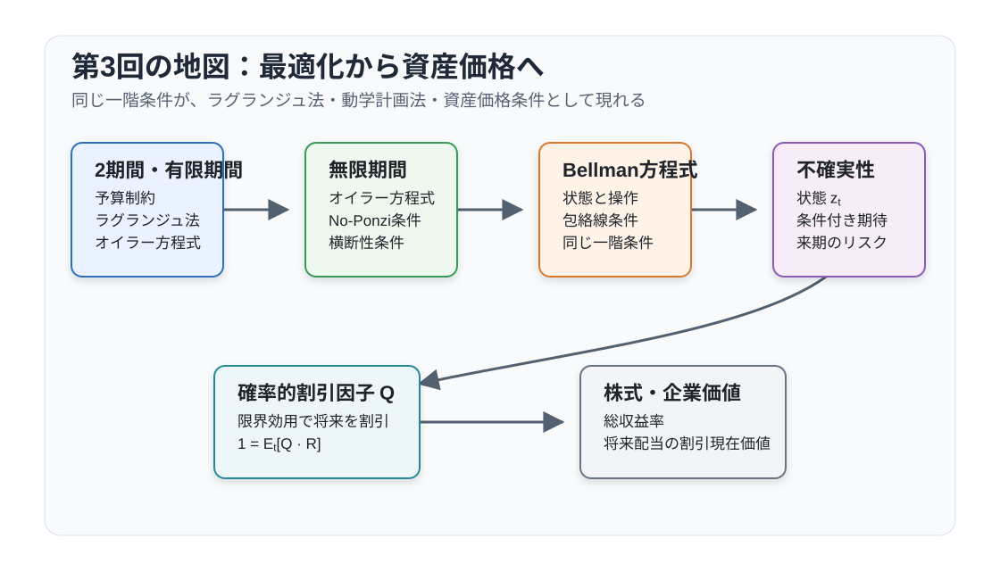
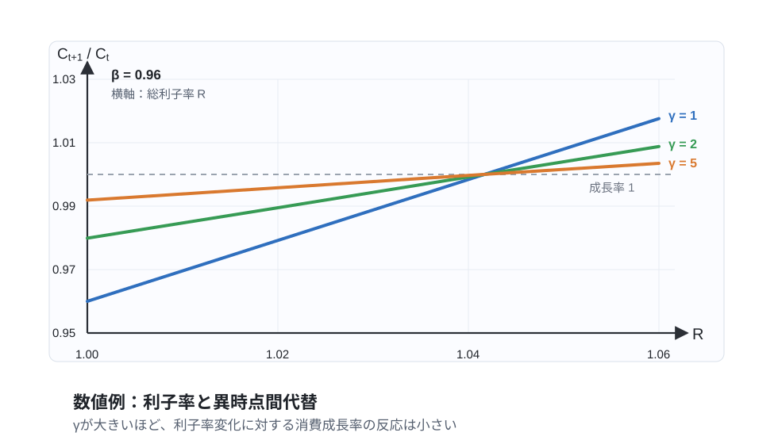
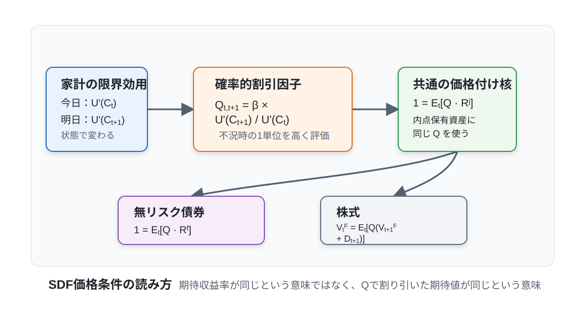

# 講義の目的

## 本講義で探究する中心的な問い

現代の動学マクロ経済学（DSGEモデル等）を学ぶ上で、避けて通ることのできない最も中核的な基礎方程式が以下の3つです。本講義の主たる到達目標は、これら3つの条件を自身の力で論理的に導出し、その背後にある経済学的直観を明快に説明できるようになることです。
$$
\begin{aligned}
U_C(C_t) &= \beta R U_C(C_{t+1}),\\
1 &= \mathbb{E}_t \left[ \beta \frac{U_C(C_{t+1})}{U_C(C_t)} R^j_{t+1} \right],\\
V_t^F &= \mathbb{E}_t \left[ \beta \frac{U_C(C_{t+1})}{U_C(C_t)} \left( V_{t+1}^F + D_{t+1} \right) \right].
\end{aligned}
$$

- 第1式は、不確実性のない世界における**決定論的オイラー方程式（Euler Equation）**です。
- 第2式は、不確実性（ショック）が存在する経済における**資産価格付けの基本方程式（確率的オイラー方程式）**です。
- 第3式は、企業の生み出す配当流列から株式の市場価額を評価する**株式価値（配当割引）の決定式**です。

一見すると複雑に見えるかもしれませんが、これら3本の式はいずれも根底では全く同一の経済学的原理に基づいています。すなわち、「**当期の消費を限界的に1単位犠牲にして別の用途（貯蓄や投資）へ振り向ける限界費用**」と、「**それによって将来追加的に獲得できる消費の限界便益の割引現在価値**」とを完全に均衡させるという、異時点間の最適配分条件です。

本講義では、以下のステップに沿って論理を段階的に積み上げていきます。

1. **有限期間モデルの解法**：2期間および有限期間の消費・貯蓄問題を、馴染み深いラグランジュ未定乗数法を用いて解く。
2. **無限期間への拡張**：計画期間を無限大に送る際に不可欠となる「No-Ponzi条件」と「横断性条件（TVC）」の役割を理解する。
3. **動学計画法（ダイナミック・プログラミング）の導入**：同じ動学的最適化問題を、Bellman方程式と包絡線定理を用いて再帰的に解くアプローチを身につける。
4. **不確実性の導入とSDF**：経済に確率的ショックを導入し、期待値付きのオイラー方程式から「確率的割引因子（Stochastic Discount Factor: SDF）」を導出する。
5. **企業価値・株式価格への応用**：導出したSDFを用いて、株式や配当の価格付け理論へと統一的に拡張する。

受講者としての最低限の到達目標は、オイラー方程式とSDFの定義式を正しく導出し、基本方程式 $1 = \mathbb{E}_t[Q_{t,t+1} R^j_{t+1}]$ が家計のポートフォリオ最適化を表していることを経済学的に説明できることです。また、株式価格条件の読み解き方や一定配当のもとでの現在価値計算も講義本編の必須知識です。なお、株式を含むBellman方程式の厳密な定式化、リスクプレミアムの共分散分解、一般の確率的配当割引モデルの詳細な展開は発展補論として配置しています。

初めて学習する際は、まず有限期間から「確率的な横断性条件」までを読み進め、次に [株式価格条件と一定配当](#sec-equity-core) を確認してください。その後の発展補論は一旦読み飛ばし、[まとめと第4回への接続](#sec-lecture03-bridge) へと進むことで、全体の大きな流れをスムーズに掴むことができます。巻末の演習問題（問1〜問4）も、この本編の範囲で十分に解答可能です。

@fig-lecture03-overview は、本講義における理論的展開のロードマップを視覚的に整理したものです。

{#fig-lecture03-overview width=95%}

# 表記と基本設定

決定論的な基礎ケースにおいて、家計は期首時点で前期から引き継いだ資産残高 $B_{t-1}$ を保有しており、当期の消費 $C_t$ と次期へ繰り越す資産 $B_t$ を決定します。実質総利子率を $R = 1+r$（$r$ は純利子率）とすると、フローの予算制約式は次のように書かれます。
$$
C_t + B_t = R B_{t-1} + Y_t.
$$
ここで右辺は「当期に利用可能な総資源（過去の元利合計＋当期所得）」を表し、左辺は「当期の資源の配分先（当期の消費＋次期への貯蓄）」を表しています。

後に不確実性を導入する際には、債券の「額面」と「市場価格」を明確に区別します。$t$ 期に購入する債券の額面を $A_t$ とし、これが翌期 $t+1$ に確実に1単位の財を支払うものとします。この債券の購入単価を $q_t^f$ と表すと、無リスク総収益率は $R_t^f \equiv 1/q_t^f$ と定義されます。この表記法を採用することで、翌期への状態変数 $A_t$ が「翌期に受け取る確実なペイオフそのもの」を表すことになり、動学計画法の定式化が極めて見通し良くなります。

家計の効用関数 $U(C)$ については、標準的な新古典派の仮定として
$$
U_C(C) > 0, \qquad U_{CC}(C) < 0
$$
を満たす滑らかな狭義凹関数を想定します。すなわち、消費の増加は効用を高めますが、その限界効用は逓減します。また、主観的割引因子は $0 < \beta < 1$ を満たす定数とします。

本講義ノートで使用する主な記号を整理すると、以下の通りです。

| 記号 | 経済学的意味 |
|---|---|
| $C_t$ | 当期の消費水準 |
| $Y_t$ | 当期の外生所得（実質所得） |
| $B_t$ | 決定論的モデルにおいて $t$ 期末に保有する次期資産残高 |
| $A_t$ | 確率的モデルにおいて $t$ 期に購入する1期間無リスク債券の保有額面 |
| $q_t^f$ | 額面1単位の無リスク債券価格（$q_t^f = 1/R_t^f$） |
| $R$ | 決定論的モデルにおける一定の実質総利子率 |
| $R_t^f$ | $t$ 期時点で確定している1期間無リスク総収益率（グロス利子率） |
| $R^j_{t+1}$ | 危険資産 $j$ の翌期における確率的な総収益率 |
| $\theta_t$ | 家計の株式保有株数 |
| $D_t$ | 企業が支払う1株あたり配当 |
| $V^H$ | 家計の価値関数（動学計画法における継続効用） |
| $V_t^F$ | 配当落ち後における1株あたり株価（発行株式数を1に正規化するため企業価値と一致） |
| $\mathbb{E}_t$ | $t$ 期時点で利用可能な情報集合に基づく条件付き期待値 |
| $\Lambda, \Lambda_t$ | 予算制約式に対するラグランジュ未定乗数 |
| $\mathcal{L}$ | ラグランジュ関数 |

また、本文中で導出・活用する主な派生変数およびパラメータは以下の通りです。

| 記号 | 定義式 | 経済学的意味 |
|---|---|---|
| $Q_{t,t+1}$ | $\beta \dfrac{U_C(C_{t+1})}{U_C(C_t)}$ | 1期間の確率的割引因子（SDF / プライシング・カーネル） |
| $Q_{t,t+i}$ | $\displaystyle\prod_{s=1}^{i} Q_{t+s-1, t+s}$ | 時点 $t$ から $t+i$ 期先までの累積的確率的割引因子 |

::: {.callout-note}
## 内点解と端点解に関する前提

本講義の標準的な展開では、消費者が飢餓を避けるため常に正の消費水準を選び、また借入れ制約等の不等式制約が厳密にはバインドしていない「**内点解（Interior Solution）**」を前提として一階条件を導出します。なお、流動性制約や借入上限（$B_t \geq \underline{B}$）が実際にバインドするような状況下では、一階条件は単純な等式ではなく、不等式と相補スラックネス条件を伴うKKT（Karush-Kuhn-Tucker）条件として定式化されます（第11回のTANKモデル等で関連する議論を扱います）。
:::

# 静学的ラグランジュ法の復習

動学的な最適化問題へ本格的に足を踏み入れる前に、まずは学部レベルのミクロ経済学で学ぶ「等式制約付きの静学的最適化問題」とラグランジュ未定乗数法の基礎を再確認しておきましょう。
$$
\max_{x,y} U(x,y) \quad \text{制約条件：} \quad g(x,y) = c
$$
制約条件の右辺を左辺に移項し、未定乗数 $\Lambda$ を掛け合わせた**ラグランジュ関数** $\mathcal{L}$ を構築します。
$$
\mathcal{L} = U(x,y) + \Lambda [c - g(x,y)].
$$
最適化の一階の条件（First-Order Conditions: FOC）は、各選択変数および乗数に関する偏微分をゼロと置くことで得られます。
$$
\begin{aligned}
U_x(x,y) &= \Lambda g_x(x,y),\\
U_y(x,y) &= \Lambda g_y(x,y),\\
g(x,y) &= c.
\end{aligned}
$$
最初の2式の辺々を割り算して乗数 $\Lambda$ を消去すると、
$$
\frac{U_x(x,y)}{U_y(x,y)} = \frac{g_x(x,y)}{g_y(x,y)}
$$
という、馴染み深い最適性条件が導かれます。これは「無差別曲線の傾き（主観的限界代替率: MRS）」と「制約曲線の傾き（客観的交換比率）」が接点で完全に一致するという、ミクロ経済学の基本原理を表しています。

ここで導入されたラグランジュ乗数 $\Lambda$ には、極めて重要な経済学的解釈があります。それは、**「制約条件の右辺定数 $c$（利用可能な資源）が1単位だけ緩和されたとき、目的関数（効用）の最大値がどれだけ追加的に増加するか」を表す限界価値（シャドープライス／潜在価格）**であるという点です。動学的な消費・貯蓄問題では、各期の予算制約に付随する乗数 $\Lambda_t$ が、「その時点において家計が利用可能な実物資源を1単位増やすことの限界効用」を表すことになります。この直観を掴んでおくことで、後のオイラー方程式や確率的割引因子の理解が格段に容易になります。

## 必要条件と十分条件

制約付き最適化問題を解く際には、まず偏微分を行って一階条件を導出します。しかし、一階条件は一般には最適解であるための「**必要条件**」にすぎません。すなわち、「真の最適解であれば必ず一階条件を満たす」ことは確かですが、「一階条件を満たすすべての候補点が真の最適解である」とは限りません（極小点や鞍点も一階条件を満たしてしまうためです）。

有限期間の消費・貯蓄問題では、家計の効用関数が狭義凹関数（上に凸）であり、予算制約が線形（したがって実行可能集合が凸集合）です。この標準的な凸最適化の設定のもとでは、一階条件と予算制約を満たす内点解は、全体における**一意な大域的最適解（十分条件も満たす解）**であることが数学的に保証されます。

一方、時間軸が無限に続く無限期間問題では、これらに加えて「生涯効用の総和が発散せずに有限の値に収束すること」や、後述する「No-Ponzi条件」および「横断性条件（TVC）」が追加の必要十分条件として要求されます。

整理すると、動学的最適化問題を完全に解き明かすために不可欠な条件は以下の通りです。

1. **各期の予算制約式**（物理的な実行可能性）
2. **各期における選択変数の一階条件**（異時点間の効率的配分）
3. **無限期間問題におけるNo-Ponzi条件および横断性条件**（無限遠における境界条件）
4. **不等式制約がバインドする場合のKKT相補スラックネス条件**

特に無限期間問題では、オイラー方程式を導出するだけでは不十分です。オイラー方程式は「隣り合う2期間の間で消費をどのように配分すべきか」という消費の傾き（成長率）を規定するにすぎず、「そもそも現在の消費水準 $C_t$ をいくらに設定すべきか」という水準そのものを一意に決定するためには、無限遠における資産の振る舞いを縛る**横断性条件**が決定的な役割を果たすことになります。

# 2期間の決定論的問題

## 問題設定

動学的最適化の最も基本的な出発点として、期間が2期（$t$ 期と $t+1$ 期）からなる決定論的なモデルを考えます。家計は現在の消費 $C_t$ と将来の消費 $C_{t+1}$ を選択します。期首の初期資産 $B_{t-1}$ は過去から与えられた外生定数です。また、2期目（最終期）が終了した後は人生が終わるため、最後に無駄な遺産（正の資産）を残すことはなく、また借金を残して逃げ切ることも許されないため、最終資産残高はゼロ（$B_{t+1} = 0$）となります。

家計の動学的効用最大化問題は次のように定式化されます。
$$
\max_{C_t, C_{t+1}, B_t} \left\{ U(C_t) + \beta U(C_{t+1}) \right\}
$$
制約条件は、各期のフローの予算制約式です。
$$
\begin{aligned}
C_t + B_t &= R B_{t-1} + Y_t,\\
C_{t+1} &= R B_t + Y_{t+1}.
\end{aligned}
$$
第2期の制約式を $B_t$ について解き（$B_t = (C_{t+1} - Y_{t+1})/R$）、これを第1期の制約式に代入して資産 $B_t$ を消去すると、2期間の資源制約を1本に統合した**生涯予算制約式（Intertemporal Budget Constraint）**が得られます。
$$
C_t + \frac{C_{t+1}}{R} = R B_{t-1} + Y_t + \frac{Y_{t+1}}{R}.
$$
左辺は「生涯にわたる消費支出の現在価値の総和」であり、右辺は「初期資産の元利合計と生涯所得の現在価値の総和（家計の生涯総富）」を表しています。

## ラグランジュ法による導出

統合された生涯予算制約式に対してラグランジュ未定乗数 $\Lambda$ を付与し、ラグランジュ関数を構築します。
$$
\mathcal{L} = U(C_t) + \beta U(C_{t+1}) + \Lambda \left[ R B_{t-1} + Y_t + \frac{Y_{t+1}}{R} - C_t - \frac{C_{t+1}}{R} \right].
$$
消費 $C_t$ および $C_{t+1}$ に関する一階条件は以下の通りです。
$$
\begin{aligned}
\frac{\partial \mathcal{L}}{\partial C_t} &= U_C(C_t) - \Lambda = 0,\\
\frac{\partial \mathcal{L}}{\partial C_{t+1}} &= \beta U_C(C_{t+1}) - \frac{\Lambda}{R} = 0.
\end{aligned}
$$
第1式より直ちに $\Lambda = U_C(C_t)$ が得られます。これを第2式に代入して整理すると、動学マクロ経済学において最も基礎的かつ重要な関係式である**消費のオイラー方程式（Euler Equation）**が導出されます。
$$
U_C(C_t) = \beta R U_C(C_{t+1}).
$$ {#eq-det-euler}

## 経済学的な直観と解釈

このオイラー方程式（@eq-det-euler）が持つ経済学的な意味を、限界的な費用と便益の比較（トレードオフ）として読み解いてみましょう。

家計がいま、今日の消費 $C_t$ を限界的に1単位だけ我慢して減らしたとします。このとき、当期の効用は直ちに
$$
U_C(C_t)
$$
だけ減少します。これが「貯蓄を行うことの限界費用」です。

一方、節約したその1単位の財を利子率 $R$ の安全資産として貯蓄に回すと、来期には利息がついて手元に $R$ 単位の財として返ってきます。来期において財が1単位増えることによる限界的な効用は $U_C(C_{t+1})$ ですから、来期効用の総増加量は $R U_C(C_{t+1})$ となります。この将来の効用増加を、主観的割引因子 $\beta$ を用いて今日の価値へと割り引くと、
$$
\beta R U_C(C_{t+1})
$$
となります。これが「貯蓄を行って明日の消費を増やすことの限界便益」です。

家計が効用を最大化している最適な状態のもとでは、これ以上消費の配分を動かしても効用を改善できないため、「限界費用」と「限界便益」が完全に釣り合っていなければなりません。
$$
\underbrace{U_C(C_t)}_{\text{今日の消費を1単位減らす限界費用}} = \underbrace{\beta R U_C(C_{t+1})}_{\text{貯蓄して明日の消費を増やす限界便益}}.
$$
もし仮に左辺の限界費用の方が小さければ、今日の消費を減らして貯蓄を増やした方が生涯効用を高めることができますし、逆であれば貯蓄を取り崩して今日の消費を増やした方が得になります。両辺が一致する点においてのみ、最適な消費経路が達成されるのです。

::: {.callout-tip}
## CRRA（等弾力的）効用関数における具体例

マクロ経済学の実証や理論で最も標準的に用いられるCRRA（Constant Relative Risk Aversion）型効用関数
$$
U(C) =
\begin{cases}
\dfrac{C^{1-\gamma}-1}{1-\gamma}, & \gamma \neq 1,\\
\ln C, & \gamma = 1
\end{cases}
\qquad (\gamma > 0)
$$
を考えます。ここで $\gamma$ は相対的リスク回避度であり、その逆数 $1/\gamma$ は「**異時点間の消費代替弾力性（EIS）**」を表します。

このとき限界効用は $U_C(C) = C^{-\gamma}$ という簡明な形で求まります。これをオイラー方程式（@eq-det-euler）に代入すると、
$$
C_t^{-\gamma} = \beta R C_{t+1}^{-\gamma}
$$
が得られます。両辺を整理することで、消費の成長率を決定する以下の基本的関係式が導かれます。
$$
\frac{C_{t+1}}{C_t} = (\beta R)^{1/\gamma}.
$$
この関係式は、消費が時間とともに成長するか減少するかが、市場の利子率 $R$ と主観的割引率 $1/\beta$（あるいは純割引率 $\rho \approx 1/\beta - 1$）との力関係によって一意に決まることを鮮やかに示しています。

- $\beta R > 1$（市場利子率が主観的割引率を上回る場合）：貯蓄の収益率が高いため、家計は当期の消費を抑制して将来の消費に振り向けます。その結果、消費経路は時間とともに右肩上がりに成長します（$C_{t+1} > C_t$）。
- $\beta R < 1$（市場利子率が主観的割引率を下回る場合）：将来を待つことへの報酬が十分でないため、家計は消費を前倒しにします。その結果、消費経路は右肩下がりに減少します（$C_{t+1} < C_t$）。
- $\beta R = 1$（市場利子率と主観的割引率が完全に均衡する場合）：各期の消費水準は完全に一定に保たれます（完全な消費平準化／スムージング）。
:::

@fig-consumption-growth-simulation は、主観的割引因子を $\beta=0.96$（年率換算で約4%の割引率）に固定したもとで、総利子率 $R$ の変動とパラメータ $\gamma$ の大きさが消費成長率 $C_{t+1}/C_t$ に与える影響を数値シミュレーションした結果です。$\gamma$ が大きい（すなわち異時点間代替弾力性 $1/\gamma$ が小さい）ほど、家計は各期の消費水準を平準化しようとする選好を強めるため、利子率が変動しても消費の成長率はほとんど反応しなくなります。

{#fig-consumption-growth-simulation width=90%}

# 有限期間への拡張

## 生涯予算制約

次に、時間軸を $t, t+1, \dots, t+N$ の計 $N+1$ 期間へと拡張してみましょう。この動学問題を整合的に定義するためには、終端条件として $B_{t+N} = 0$ を課す必要があります。これは、経済の最終期以降に返済義務のない借入れを残すことを排除し、また不要な遺産を残さないことを意味します。

各期 $t+i$（$i=0, 1, \dots, N$）におけるフローの予算制約式は次のように記述されます。
$$
C_{t+i} + B_{t+i} = R B_{t+i-1} + Y_{t+i}, \qquad i=0, 1, \dots, N.
$$
各期の予算制約式を、利子率 $R$ を用いて現在価値（$t$ 期時点の価値）へと割り引いて足し合わせると、
$$
\sum_{i=0}^{N} \frac{C_{t+i}}{R^i} + \frac{B_{t+N}}{R^N} = R B_{t-1} + \sum_{i=0}^{N} \frac{Y_{t+i}}{R^i}
$$
が得られます。ここで終端条件 $B_{t+N} = 0$ を代入すれば、単一の**生涯予算制約（現在価値制約）**が次のように導かれます。
$$
\sum_{i=0}^{N} \frac{C_{t+i}}{R^i} = R B_{t-1} + \sum_{i=0}^{N} \frac{Y_{t+i}}{R^i}.
$$
この式は、全期間にわたる消費支出の現在価値の総和が、初期資産の元利合計と全期間にわたる所得の現在価値の総和（すなわち生涯の総富）に等しくならなければならないことを示しています。

## 現在価値制約を用いたラグランジュ法

生涯予算制約を用いると、有限期間における消費者の最適化問題は次のように定式化できます。
$$
\max_{\{C_{t+i}\}_{i=0}^{N}} \sum_{i=0}^{N} \beta^i U(C_{t+i})
$$
制約条件：
$$
\sum_{i=0}^{N} \frac{C_{t+i}}{R^i} = R B_{t-1} + \sum_{i=0}^{N} \frac{Y_{t+i}}{R^i}.
$$
この問題に対するラグランジュ関数は、乗数を $\Lambda$ として以下のように書けます。
$$
\mathcal{L} = \sum_{i=0}^{N} \beta^i U(C_{t+i}) + \Lambda \left[ R B_{t-1} + \sum_{i=0}^{N} \frac{Y_{t+i}}{R^i} - \sum_{i=0}^{N} \frac{C_{t+i}}{R^i} \right].
$$
各期の消費 $C_{t+i}$ に関する一階条件（FOC）を求めると、
$$
\beta^i U_C(C_{t+i}) - \frac{\Lambda}{R^i} = 0
$$
となります。したがって、隣接する2つの期 $i$ と $i+1$ の一階条件を比較することにより、
$$
U_C(C_{t+i}) = \beta R U_C(C_{t+i+1}), \qquad i=0, 1, \dots, N-1
$$
が導かれます。すなわち、2期間モデルで得られたオイラー方程式が、任意の隣り合う2期間の間で常に成立することが分かります。

## 逐次制約を用いたラグランジュ法

全く同じ有限期間問題は、終端条件 $B_{t+N}=0$ のもとで、各期のフロー予算制約式にそれぞれ個別のラグランジュ乗数 $\Lambda_{t+i}$ を付与する「逐次制約法」によっても解くことができます。
$$
\mathcal{L} = \sum_{i=0}^{N} \beta^i \left\{ U(C_{t+i}) + \Lambda_{t+i} \left( R B_{t+i-1} + Y_{t+i} - C_{t+i} - B_{t+i} \right) \right\}.
$$
各期の消費 $C_{t+i}$ に関する一階条件は、
$$
U_C(C_{t+i}) = \Lambda_{t+i}
$$
となり、各期の乗数 $\Lambda_{t+i}$ がその期の消費の限界効用（シャドープライス）に等しいことを示します。

一方、中間期の資産残高 $B_{t+i}$（$i=0, 1, \dots, N-1$）に関する一階条件は、資産 $B_{t+i}$ が $i$ 期の制約では支出（負の符号）として、翌 $i+1$ 期の制約では元利金 $R$ の収入（正の符号、かつ割引因子 $\beta$ が掛かる）として現れることに注意すると、
$$
-\beta^i \Lambda_{t+i} + \beta^{i+1} R \Lambda_{t+i+1} = 0
$$
となります。両辺を $\beta^i$ で割れば、
$$
\Lambda_{t+i} = \beta R \Lambda_{t+i+1}
$$
が得られます。ここで消費の一階条件 $\Lambda_{t+i} = U_C(C_{t+i})$ を代入すれば、再び
$$
U_C(C_{t+i}) = \beta R U_C(C_{t+i+1})
$$
というオイラー方程式が導かれます。全期間を一括してまとめた現在価値制約を用いても、各期のフロー制約を追う逐次制約を用いても、全く同一の最適性条件が得られることが確認できます。

# 無限期間の決定論的問題

## 問題設定

次に、計画期間の終点 $N$ を無限大（$N \to \infty$）へと拡張した無限期間モデルを考えます。家計が解くべき動学的最適化問題は以下のように定式化されます。
$$
\max_{\{C_{t+i}, B_{t+i}\}_{i=0}^{\infty}} \sum_{i=0}^{\infty} \beta^i U(C_{t+i})
$$
制約条件：
$$
C_{t+i} + B_{t+i} = R B_{t+i-1} + Y_{t+i}, \qquad i=0, 1, 2, \dots
$$
無限期間モデルにおいては、有限期間のように「最後の期に資産をゼロにして終える」という明示的な終端時点が存在しません。そのため、局所的な最適性を示すオイラー方程式に加えて、無限遠における資産の振る舞いを規律・制御するための条件が不可欠となります。

## No-Ponzi条件と横断性条件

もし家計が借金を無限に先送り（ロールオーバー）して生涯返済しないことが許されるなら、家計は有限の所得しか持たなくても無限に消費を拡大できてしまいます（ポンジ・スキーム）。こうした不都合な経路を排除するために課されるのが**No-Ponzi条件（ポンジ・スキーム禁止条件）**です。利子率が一定である環境のもとでは、通常、次のような条件として定式化されます。
$$
\liminf_{N\to\infty} \frac{B_{t+N}}{R^N} \geq 0.
$$
この条件は、将来の資産残高を現在価値に割り引いた極限が負であってはならない（借金を無限遠に雪だるま式に放置してはならない）ことを要請します。

一方、効用最大化を達成する最適解においては、さらに**横断性条件（Transversality Condition: TVC）**が満たされなければなりません。
$$
\lim_{N\to\infty} \beta^N U_C(C_{t+N}) B_{t+N} = 0.
$$
この条件は、限界効用で評価した将来資産の割引現在価値が、無限遠においてゼロに収束することを意味しています。

これら2つの条件は、それぞれ経済学的に異なる役割を果たしています。No-Ponzi条件は「借金を無制限に膨らませる不当な経路」を実行可能集合から排除する制約側の条件です。これに対して横断性条件は、「死ぬことのない家計が、生涯で使い切ることのない資産を無限遠まで過剰に溜め込むのは効用最大化の観点から非最適である」という最適化側の条件を表しています。

## 無限期間のオイラー方程式

解が内点にある限り、有限期間と同様の議論により、すべての時点 $i=0, 1, 2, \dots$ において隣接期間のオイラー方程式が成立します。
$$
U_C(C_{t+i}) = \beta R U_C(C_{t+i+1}).
$$
したがって、無限期間における決定論的な消費・貯蓄問題の最適解は、No-Ponzi条件を満たす実行可能な経路の中から、以下の3つの連立条件を満たす経路として一意に特定されます。
$$
\begin{aligned}
C_{t+i} + B_{t+i} &= R B_{t+i-1} + Y_{t+i},\\
U_C(C_{t+i}) &= \beta R U_C(C_{t+i+1}),\\
\lim_{N\to\infty} \beta^N U_C(C_{t+N}) B_{t+N} &= 0.
\end{aligned}
$$
各期の予算制約式とNo-Ponzi条件が「実行可能性」を画定し、オイラー方程式と横断性条件が「内点最適経路」を一意に特徴づけるのです。

::: {.callout-warning}
## オイラー方程式だけでは解は定まらない

無限期間モデルにおいて、オイラー方程式が保証するのはあくまで「各期における局所的な最適性（消費の傾き）」にすぎません。消費の絶対的な水準や資産経路全体の整合性を確定させるためには、借入れの実行可能性を保証するNo-Ponzi条件と、無限遠での過剰貯蓄を排除する横断性条件の双方が不可欠です。
:::

## 例：横断性条件が消費水準を確定させるメカニズム

横断性条件が具体的にどのように消費水準を決定づけるのか、簡単な具体例で見てみましょう。

初期時点を $t=0$ とし、毎期の所得が一定値 $Y>0$、総利子率が一定値 $R>1$、かつ $\beta R=1$ であるとします。効用関数はCRRA型とし、初期資産は $Y + (R-1)B_{-1} > 0$ を満たしていると仮定します。

まず、オイラー方程式からは直ちに $C_{t+1} = C_t = C$（消費は毎期一定）が導かれます。しかし、これだけでは一定である消費の具体的な水準 $C$ までは決まりません。

そこで、各期のフロー予算制約式を $0$ 期から $N$ 期まで足し合わせ、現在価値に割り引いて整理すると、
$$
\frac{B_N}{R^N} = R B_{-1} + (Y-C)\sum_{i=0}^{N} R^{-i} \longrightarrow \frac{R}{R-1} \left[ Y + (R-1)B_{-1} - C \right] \quad (N \to \infty)
$$
が得られます。したがって、No-Ponzi条件（$\liminf B_N/R^N \geq 0$）は、消費が恒久所得を超えてはならないという上限条件 $C \leq Y + (R-1)B_{-1}$ を課します。

一方、$\beta R=1$ より $\beta^N = R^{-N}$ であるため、限界効用で評価した割引資産価値は $\beta^N U_C(C) B_N = C^{-\gamma} (B_N / R^N)$ となります。これが無限遠でゼロに収束するという横断性条件を満たすためには、ブラケットの中身がゼロでなければならず、
$$
C = Y + (R-1)B_{-1}
$$
でなければなりません。もしこれより多く消費すればNo-Ponzi条件に違反して破産経路となり、逆にこれより少なく消費すれば無限遠に正の資産価値を残して死ぬことになり効用を損ないます。最適経路における資産残高は毎期 $B_t = B_{-1}$ で一定に推移します。ここで留意すべきは、横断性条件がゼロに収束することを要求しているのは「現在価値に割り引いた資産価値」であり、資産の水準そのもの（$B_t$）がゼロになることではないという点です。

# 動学計画法（ダイナミック・プログラミング）

## Bellman方程式

続いて、同じ動学的最適化問題を「動学計画法（ダイナミック・プログラミング）」の手法を用いて定式化し直します。ここでは、所得 $Y$ と利子率 $R$ が毎期一定である定常的な環境を考えます。前節のNo-Ponzi条件もそのまま引き継ぎ、価値関数はこの条件を満たす実行可能な消費・資産経路の範囲内で定義されます。以下では、資産選択が許容領域の内点にある場合を扱います。

動学計画法における状態変数は、期首に保有している資産残高 $B_{t-1}$ です。価値関数を $V^H(B_{t-1})$ と表すと、Bellman方程式は次のように記述されます。
$$
V^H(B_{t-1}) = \max_{C_t, B_t} \left\{ U(C_t) + \beta V^H(B_t) \right\}
$$
制約条件：
$$
C_t + B_t = R B_{t-1} + Y.
$$
この定式化の本質は、無限期間にわたる複雑な最大化問題を、「当期の消費から得られる直接的な効用 $U(C_t)$」と「来期以降の最適な行動から得られる将来価値の現在割引値 $\beta V^H(B_t)$」という、2期間の選択問題へと帰着させる点にあります。

## Bellman方程式の一階条件と包絡線条件

制約条件をラグランジュ乗数 $\Lambda_t$ で組み込んだラグランジュ関数は、
$$
\mathcal{L} = U(C_t) + \beta V^H(B_t) + \Lambda_t \left( R B_{t-1} + Y - C_t - B_t \right)
$$
となります。操作変数である $C_t$ および $B_t$ に関する一階条件（FOC）は以下の通りです。
$$
\begin{aligned}
U_C(C_t) &= \Lambda_t,\\
\beta V^H_B(B_t) &= \Lambda_t.
\end{aligned}
$$
第1式は消費の限界効用が富のシャドープライス $\Lambda_t$ に等しいことを示し、第2式は翌期へ繰り越す資産の限界価値の割引値が同じく $\Lambda_t$ に等しくなるべきことを示しています。

さらに、状態変数 $B_{t-1}$ に関する包絡線定理（Envelope Theorem）を適用すると、
$$
V^H_B(B_{t-1}) = R \Lambda_t
$$
が得られます。これは、期首資産が1単位増えたとき、それが予算制約を通じて生み出す効用の増加分を表します。この関係を1期先に進めると、
$$
V^H_B(B_t) = R \Lambda_{t+1}
$$
となります。これを資産の一階条件 $\beta V^H_B(B_t) = \Lambda_t$ に代入すれば、
$$
\Lambda_t = \beta R \Lambda_{t+1}
$$
が得られます。最後に消費の一階条件 $\Lambda_t = U_C(C_t)$ を用いれば、
$$
U_C(C_t) = \beta R U_C(C_{t+1})
$$
となり、ラグランジュ法で導出したオイラー方程式と完全に一致する条件が再現されます。

## ラグランジュ法と動学計画法の同値性

ラグランジュ法は、家計が将来の消費と資産の無限列を一括して同時に決定する「逐次的・通時的な問題」として定式化します。これに対して動学計画法は、問題を「今日の選択」と「明日以降の最適化の結果を表す価値関数」とに分割し、時間を通じて再帰的（recursive）に解く手法です。

アプローチの形式は異なりますが、両者が表現している経済的実体は全く同一です。Bellman方程式が適切に定義され、価値関数が微分可能であり、かつ最適政策が横断性条件を満たすならば、Bellman方程式の一階条件から導かれる政策関数は、逐次的なラグランジュ問題の最適性条件をすべて満たします。

逆に、逐次的なラグランジュ問題の最適経路が存在して横断性条件を満たす場合、その経路の任意の時点以降の部分経路もまた、その時点の状態から出発した最適経路となります。これこそが、動学計画法の基礎を成す**Bellmanの最適性原理（Principle of Optimality）**にほかなりません。

# 不確実性を導入した動学計画法

## 確率的な環境の設定

現実のマクロ経済を分析するため、モデルに外生的な不確実性（ショック）を導入しましょう。経済の外生的な状態を確率変数 $z_t$ で表し、家計の受取所得がこの状態に依存して
$$
Y_t = Y(z_t)
$$
として決定されるとします。外生状態 $z_t$ はマルコフ過程に従い、次期の状態分布は当期の状態にのみ依存して
$$
z_{t+1} \sim \Pr(\,\cdot \mid z_t)
$$
と推移するものとします。

各期 $t$ の意思決定のタイミングは以下の通りです。まず期首に状態 $z_t$ が実現・観察され、それに応じて当期の所得 $Y(z_t)$ および1期間債券の価格 $q_t^f$ が確定します。その後、家計は当期の消費 $C_t$ と、翌期 $t+1$ に額面通り1単位の財を確実に支払う無リスク債券の保有額面 $A_t$ を選択します。家計の予算制約式は
$$
C_t + q_t^f A_t = A_{t-1} + Y(z_t), \qquad R_t^f \equiv \frac{1}{q_t^f}
$$
と書かれます。ここで期首の $A_{t-1}$ は今期確実に受け取る元利ペイオフであり、新たに購入する $A_t$ が来期への状態変数となります。また $R_t^f$ は無リスクの総利子率です。

このとき、状態変数は前期からの持越資産 $A_{t-1}$ と当期のショック $z_t$ の組となります。家計のBellman方程式は次のように定式化されます。
$$
V^H(A_{t-1}, z_t) = \max_{C_t, A_t} \left\{ U(C_t) + \beta \mathbb{E}_t \left[ V^H(A_t, z_{t+1}) \right] \right\}
$$
制約条件：
$$
C_t + q_t^f A_t = A_{t-1} + Y(z_t).
$$
当期に選択する債券額面 $A_t$ は $t$ 期時点で確定しますが、翌期の所得や消費は確率変数 $z_{t+1}$ に依存して変動するため、来期の継続価値は当期時点で利用可能な情報集合に基づく条件付き期待値 $\mathbb{E}_t[\,\cdot\,]$ によって評価されます。

## 一階条件と確率的オイラー方程式

制約条件に乗数 $\Lambda_t$ を付与したラグランジュ関数は、
$$
\mathcal{L} = U(C_t) + \beta \mathbb{E}_t \left[ V^H(A_t, z_{t+1}) \right] + \Lambda_t \left( A_{t-1} + Y(z_t) - C_t - q_t^f A_t \right)
$$
となります。操作変数 $C_t$ および $A_t$ に関する一階条件は以下の通りです。
$$
\begin{aligned}
U_C(C_t) &= \Lambda_t,\\
q_t^f \Lambda_t &= \beta \mathbb{E}_t \left[ V^H_A(A_t, z_{t+1}) \right].
\end{aligned}
$$
また、翌期の状態変数に関する包絡線条件は、
$$
V^H_A(A_t, z_{t+1}) = \Lambda_{t+1} = U_C(C_{t+1})
$$
として得られます（翌期の消費は政策関数 $C_{t+1} = C(A_t, z_{t+1})$ に従って実現します）。これを資産の一階条件に代入すると、
$$
q_t^f U_C(C_t) = \beta \mathbb{E}_t \left[ U_C(C_{t+1}) \right]
$$
が導かれます。無リスク総収益率 $R_t^f = 1/q_t^f$ は $t$ 期時点で既知の確定値であるため期待値の外に出すことができ、以下の**不確実性下のオイラー方程式（確率的オイラー方程式）**が得られます。
$$
U_C(C_t) = \beta \mathbb{E}_t \left[ R_t^f U_C(C_{t+1}) \right].
$$

## 確率的割引因子（SDF）

上記オイラー方程式の両辺を当期の限界効用 $U_C(C_t)$ で割ると、次のように変形できます。
$$
1 = \mathbb{E}_t \left[ \beta \frac{U_C(C_{t+1})}{U_C(C_t)} R_t^f \right].
$$
ここで、家計の異時点間限界代替率（消費の限界効用の比に割引因子を乗じたもの）を
$$
Q_{t,t+1} \equiv \beta \frac{U_C(C_{t+1})}{U_C(C_t)}
$$ {#eq-sdf}
と定義し、これを**確率的割引因子（Stochastic Discount Factor: SDF）**、あるいは**プライシング・カーネル（Pricing Kernel）**と呼びます。SDFを用いると、無リスク債券のオイラー方程式は極めてシンプルに
$$
1 = \mathbb{E}_t \left[ Q_{t,t+1} R_t^f \right]
$$
と表現されます。

確率的割引因子 $Q_{t,t+1}$ は、安全資産（債券）のみならず、株式をはじめとするあらゆるリスク資産の価格を統一的に評価するための根幹を成す概念です。@fig-sdf-asset-pricing-map は、家計の効用最大化問題から導かれる限界効用比がSDFを形成し、それが債券や株式の価格付けへと展開していく構造を示しています。

{#fig-sdf-asset-pricing-map width=92%}

一般に、任意の危険資産（リスク資産）$j$ の翌期の総収益率を $R^j_{t+1}$ とします。金融市場に摩擦がなく、家計がこの資産を内点で保有する均衡においては、資産選択の一階条件として以下の**資産価格付けの基本方程式**が成立します。
$$
1 = \mathbb{E}_t \left[ Q_{t,t+1} R^j_{t+1} \right].
$$ {#eq-asset-pricing}
無リスク債券は、翌期の収益率が $t$ 期時点で確定している（$R^j_{t+1} = R_t^f$）という特殊なケースにすぎません。現代マクロ経済学および資産価格理論の豊かな分析は、すべてこの1本の基本方程式から出発します。

::: {.callout-note}
## 限界効用SDFと無裁定条件の関係

金融工学や資産価格理論において、「市場に裁定機会が存在しない（無裁定）」ことと「取引されるすべてのキャッシュフローを正しく価格づける正のSDFが少なくとも1つ存在する」こととは同値です（資産価格付けの基本定理）。本講義では、家計の異時点間効用最大化問題を明示的に解くことによって、内点で取引される資産に対するSDFの具体的な姿が、家計の消費の限界効用比（@eq-sdf）として一意に特定されることを示しています。この「無裁定による存在定理」と「代表的家計の最適化による構造的特定」の相違をしっかりと整理しておきましょう。
:::

## 確率的な横断性条件

多期間にわたる確率的割引因子は、各期のSDFの積として
$$
Q_{t,t+N} \equiv \prod_{s=1}^{N} Q_{t+s-1, t+s} = \beta^N \frac{U_C(C_{t+N})}{U_C(C_t)}
$$
と定義されます。適切な借入れ制約（確率的No-Ponzi条件）のもとで、無限遠における過剰貯蓄を排除する**確率的横断性条件**は次のように定式化されます。
$$
\lim_{N\to\infty} \mathbb{E}_t \left[ Q_{t,t+N} q_{t+N}^f A_{t+N} \right] = 0.
$$
ここで $q_{t+N}^f A_{t+N}$ は、$t+N$ 期末に保有している債券の市場評価額を表します。この条件は、将来の資産保有の市場価値を家計のSDFで割り引いた期待現在価値が、無限遠においてゼロに収束することを要求しています。

# 企業価値と配当割引

## 株式価格条件と一定配当（本編） {#sec-equity-core}

次に、企業が発行する株式の価格がどのように決定されるかを考えます。

配当落ち後における株式1株あたりの価格を $V_t^F$、1株あたり配当を $D_t$ とします。ある家計が $t$ 期に株式を1株購入して1期間保有すると、翌期 $t+1$ には売却価値 $V_{t+1}^F$ と配当金 $D_{t+1}$ の合計額を受け取ることができます。したがって、家計が株式を内点で保有する均衡における価格条件は、一般の資産価格方程式（@eq-asset-pricing）を直接適用することで、以下のように導かれます。
$$
V_t^F = \mathbb{E}_t \left[ Q_{t,t+1} (V_{t+1}^F + D_{t+1}) \right].
$$ {#eq-equity-value}
この式は、今日の株価が「翌期に得られる総ペイオフ（株価＋配当）を家計のSDFで割り引いた期待現在価値」に等しくなることを示しています。

ここで最も単純なケースとして、毎期の配当が一定値 $D$ であり、多期間の割引因子が確定的かつ幾何学的に減少する環境（$Q_{t,t+i} = \delta^i$、$0<\delta<1$）を考えてみましょう。無限遠における株価の割引現在価値がゼロになる無バブル条件を課すと、株価は次のように計算できます。
$$
V_t^F = \sum_{i=1}^{\infty} \delta^i D = \frac{\delta D}{1-\delta}.
$$
特に割引因子が無リスク利子率で決まる場合（$\delta = 1/R^f$）には、分母と分子に $R^f$ を掛けることで、学部レベルでもおなじみの公式 $V_t^F = D / (R^f - 1)$ が得られます。本講義の本編では、まずこの基本的な株式価格条件と一定配当のもとでの評価式をしっかりと身につけてください。

**初読の際は、ここから直ちに [まとめと第4回への接続](#sec-lecture03-bridge) へ進んでいただいて構いません。** 以下の補論では、家計の動学的効用最大化問題から株式価格条件を厳密に導出し、リスクが存在する場合のリスクプレミアムの構造をより深く探究します。

## 補論：株式を含む家計問題の厳密な導出

### 家計の予算制約

家計が無リスク債券に加えて企業の株式も保有できる一般的な経済を考えます。外生所得は引き続き $Y_t = Y(z_t)$ とします。経済全体の発行株式総数を $1$ に正規化し、配当落ち後の1株あたり株価を $V_t^F$、1株あたり配当を $D_t$、家計が保有する株式数を $\theta_t$ と表記します。株式総数を $1$ と正規化しているため、$V_t^F$ は企業全体の株式時価総額（企業価値）とも完全に一致します。

このとき、$t$ 期における家計のフロー予算制約式は次のように書かれます。
$$
C_t + q_t^f A_t + V_t^F \theta_t = A_{t-1} + Y(z_t) + \theta_{t-1} (V_t^F + D_t).
$$
左辺は家計の総支出（消費、債券購入、株式購入）を表し、右辺は利用可能な総資源（期首に満期を迎えた債券の元利金、当期の労働所得、前期から持ち越した株式の売却評価額および受取配当金）を表しています。

状態変数は、前期からの持越債券 $A_{t-1}$、株式保有量 $\theta_{t-1}$、および外生ショック $z_t$ の組となります。家計のBellman方程式は次のように定式化されます。
$$
V^H(A_{t-1}, \theta_{t-1}, z_t) = \max_{C_t, A_t, \theta_t} \left\{ U(C_t) + \beta \mathbb{E}_t \left[ V^H(A_t, \theta_t, z_{t+1}) \right] \right\}
$$
制約条件：
$$
C_t + q_t^f A_t + V_t^F \theta_t = A_{t-1} + Y(z_t) + \theta_{t-1} (V_t^F + D_t).
$$

### 一階条件の導出

制約条件に乗数 $\Lambda_t$ を付与したラグランジュ関数は、
$$
\begin{aligned}
\mathcal{L} =\;& U(C_t) + \beta \mathbb{E}_t \left[ V^H(A_t, \theta_t, z_{t+1}) \right] \\
&+ \Lambda_t \left[ A_{t-1} + Y(z_t) + \theta_{t-1} (V_t^F + D_t) - C_t - q_t^f A_t - V_t^F \theta_t \right]
\end{aligned}
$$
となります。操作変数 $C_t, A_t, \theta_t$ に関する一階条件は以下の通りです。
$$
\begin{aligned}
U_C(C_t) &= \Lambda_t,\\
q_t^f \Lambda_t &= \beta \mathbb{E}_t \left[ V^H_A(A_t, \theta_t, z_{t+1}) \right],\\
V_t^F \Lambda_t &= \beta \mathbb{E}_t \left[ V^H_{\theta}(A_t, \theta_t, z_{t+1}) \right].
\end{aligned}
$$
さらに、翌期の状態変数に関する包絡線条件を求めると、
$$
\begin{aligned}
V^H_A(A_t, \theta_t, z_{t+1}) &= \Lambda_{t+1},\\
V^H_{\theta}(A_t, \theta_t, z_{t+1}) &= \Lambda_{t+1} (V_{t+1}^F + D_{t+1})
\end{aligned}
$$
が得られます。これらを上記の一階条件に代入し、$\Lambda_t = U_C(C_t)$ および SDF の定義式（$Q_{t,t+1} \equiv \beta U_C(C_{t+1})/U_C(C_t)$）を適用することで、無リスク債券および株式に関する価格付け条件がそれぞれ導かれます。
$$
\begin{aligned}
1 &= \mathbb{E}_t \left[ Q_{t,t+1} R_t^f \right],\\
V_t^F &= \mathbb{E}_t \left[ Q_{t,t+1} (V_{t+1}^F + D_{t+1}) \right].
\end{aligned}
$$

## 補論：株式収益率とリスクプレミアムの構造

株式の1期間総収益率を
$$
R_{t+1}^e \equiv \frac{V_{t+1}^F + D_{t+1}}{V_t^F}
$$
と定義します。この総収益率は、キャピタルゲイン率とインカムゲイン率（配当利回り）の和として自然に分解できます。
$$
R_{t+1}^e = 1 + \frac{V_{t+1}^F - V_t^F}{V_t^F} + \frac{D_{t+1}}{V_t^F}.
$$
ここで右辺第2項は株価の変動率（キャピタルゲイン率）、第3項は配当利回り（インカムゲイン率）です。注意すべき点として、配当利回り $D_{t+1}/V_t^F$ は債券利回りと同列視できるものではなく、不確実性を伴う株式総収益率 $R_{t+1}^e$ の一構成要素にすぎません。株式のリスクプレミアムは、配当利回り単体に対してではなく、キャピタルゲインをも含めた総収益率に対して定義されます。

$t$ 期時点で確定している無リスク総利子率を $R_t^f$ とすると、株式の期待超過収益率は $\mathbb{E}_t R_{t+1}^e - R_t^f$ と表されます。無リスク債券の条件 $\mathbb{E}_t Q_{t,t+1} = 1/R_t^f$ を利用して、株式の価格条件 $1 = \mathbb{E}_t[Q_{t,t+1} R_{t+1}^e]$ を期待値と共分散に分解すると、以下の極めて重要な関係式が得られます。
$$
\mathbb{E}_t R_{t+1}^e - R_t^f = - R_t^f \operatorname{Cov}_t \left( Q_{t,t+1}, R_{t+1}^e \right).
$$
この式は、リスクプレミアムの大きさと符号が「SDFと株式収益率との条件付き共分散」によって決定されることを明確に物語っています。景気後退期のように消費の限界効用が高まる（すなわち $Q_{t,t+1}$ が大きくなる）局面において、収益率が低下するような資産は、共分散が負（$\operatorname{Cov}_t < 0$）となります。家計にとって最も消費を支えてほしい苦境期に十分なリターンをもたらさない資産をあえて保有するためには、リスクを補償する正のリスクプレミアム（$\mathbb{E}_t R_{t+1}^e - R_t^f > 0$）が要求されるのです。

また、企業価値の条件を総収益率で書き直すと、
$$
1 = \mathbb{E}_t \left[ Q_{t,t+1} R_{t+1}^e \right]
$$
となります。無リスク債券についても同様に
$$
1 = \mathbb{E}_t \left[ Q_{t,t+1} R_t^f \right]
$$
が成立するため、無リスク債券と株式は、全く同一の確率的割引因子 $Q_{t,t+1}$ によって統一的に価格づけられていることが分かります。これは通常の意味での期待収益率が一致する（$\mathbb{E}_t R_{t+1}^e = R_t^f$）ことを意味するのではなく、「リスク調整後の期待収益が等しくなる」ことを意味しています。
$$
\mathbb{E}_t \left[ Q_{t,t+1} R_{t+1}^e \right] = \mathbb{E}_t \left[ Q_{t,t+1} R_t^f \right] = 1.
$$
この関係を超過収益率を用いて書き直せば、
$$
\mathbb{E}_t \left[ Q_{t,t+1} (R_{t+1}^e - R_t^f) \right] = 0
$$
となります。これは「リスク調整後の期待超過収益率がゼロになる」という家計のポートフォリオ最適性条件を表しています。もしこの左辺が正であれば、家計は債券を売却して株式を限界的に買い増すことで効用を高めることができ、逆に負であれば株式を売却して債券を買い増すインセンティブが働くため、市場は均衡しません。なお、株式の購入と債券の売却を組み合わせたポジションには依然として将来の状態依存のリスクが残るため、この超過収益の解消プロセスは無リスクな裁定取引（アービトラージ）ではなく、リスク選好に基づくポートフォリオのリバランスである点に留意してください。

## 補論：一般の配当割引モデル

株式の価格条件
$$
V_t^F = \mathbb{E}_t \left[ Q_{t,t+1} (V_{t+1}^F + D_{t+1}) \right]
$$
を将来に向かって前向き（forward-looking）に繰り返し代入していくと、
$$
V_t^F = \mathbb{E}_t \left[ \sum_{i=1}^{N} Q_{t,t+i} D_{t+i} + Q_{t,t+N} V_{t+N}^F \right]
$$
が得られます。ここで多期間の確率的割引因子は
$$
Q_{t,t+i} = \beta^i \frac{U_C(C_{t+i})}{U_C(C_t)}
$$
です。ここで、無限遠において株価の割引現在価値がゼロに収束するという横断性条件（バブル排除条件）
$$
\lim_{N\to\infty} \mathbb{E}_t \left[ Q_{t,t+N} V_{t+N}^F \right] = 0
$$
を課せば、一般の**配当割引モデル（Dividend Discount Model: DDM）**が得られます。
$$
V_t^F = \mathbb{E}_t \left[ \sum_{i=1}^{\infty} Q_{t,t+i} D_{t+i} \right].
$$
すなわち、企業の株式価値（株価）の本質は、「将来にわたって生み出される配当ストリームの確率的割引現在価値の総和」として美しく定式化されます。

### 配当と利子率が確定的である場合：学部レベルの割引現在価値への帰着

将来の配当および実質利子率の推移が $t$ 期時点ですべて確定的である特殊なケースを考えてみましょう。$t+s$ 期から $t+s+1$ 期への無リスク総利子率を $R_{t+s}^f$ と表記すると、家計のオイラー方程式と反復期待値の法則（Law of Iterated Expectations）から、多期間SDFの条件付き期待値は次のように計算されます。
$$
\mathbb{E}_t Q_{t,t+i} = \frac{1}{\displaystyle\prod_{s=0}^{i-1} R_{t+s}^f}.
$$
配当経路 $D_{t+i}$ が確定的であれば期待値演算の外側に取り出せるため、企業価値は以下のように表されます。
$$
V_t^F = \sum_{i=1}^{\infty} \frac{D_{t+i}}{\displaystyle\prod_{s=0}^{i-1} R_{t+s}^f}.
$$
これは、学部レベルのコーポレート・ファイナンスやマクロ経済学で学ぶ「将来のキャッシュフローを各期の無リスク利子率で割り引いて合計する」という馴染み深い割引現在価値の公式そのものです。

さらに実質総利子率が毎期一定（$R_{t+s}^f = R^f > 1$）であれば、
$$
V_t^F = \sum_{i=1}^{\infty} \frac{D_{t+i}}{(R^f)^i}
$$
となり、配当も毎期一定（$D_{t+i} = D$）であれば、幾何級数の和として永久配当（コンソル債）の公式
$$
V_t^F = \frac{D}{R^f - 1}
$$
へと完全に帰着します。

::: {.callout-note title="リスクが存在する場合の割り引き"}
将来の配当や利子率が不確実である場合、客観的確率のもとでの期待配当を、単に無リスク利子率で割り引くことは理論的に正しくありません。本講義では、家計の限界効用に基づく確率的割引因子を用いた定式化
$$
V_t^F = \mathbb{E}_t \left[ \sum_{i=1}^{\infty} Q_{t,t+i} D_{t+i} \right]
$$
を一貫して用います。なお、金融経済学や数理ファイナンスでは、同じ資産価格を「リスク中立確率測度」や「フォワード測度」への測度変換を通じて表現する手法が広く用いられますが、これは高度な発展トピックとなるため本講義の範囲を超えます。
:::

# まとめと第4回への接続 {#sec-lecture03-bridge}

## 動学的最適化を解くための標準的手順

動学的最適化問題において一階条件を導出し、均衡条件を導く際には、以下のステップに沿って体系的に整理すると見通しが極めて良くなります。

1. **変数の峻別**：状態変数（過去から引き継がれる資産など）と操作変数（当期の消費や次期への貯蓄など）を明確に区別する。
2. **予算制約の整理**：各期のフロー予算制約式を、「当期の利用可能資源（インフロー）」と「当期の支出・配分（アウトフロー）」に整理して記述する。
3. **ラグランジュ関数の設定**：各期の制約条件に対してラグランジュ乗数を付与する。
4. **消費の一階条件**：当期の消費に関する一階条件から、ラグランジュ乗数を消費の限界効用（シャドープライス）として表現する。
5. **資産の一階条件**：翌期への資産保有に関する一階条件から、当期のシャドープライスと翌期の継続価値を結びつける。
6. **包絡線定理の適用**：状態変数に関する包絡線定理を用いて、価値関数の微分を翌期のラグランジュ乗数（限界効用）へと置き換える。
7. **オイラー方程式の導出**：ラグランジュ乗数を消去し、消費のオイラー方程式または資産価格決定式を導出する。
8. **終端条件の確認**：無限期間モデルの場合には、No-Ponzi条件（実行可能性）と横断性条件（最適性）の双方を確認する。

この論理的手順は、無リスク債券、株式、物的一般資本、あるいは名目債券など、どのような資産を経済に導入する場合でも全く共通です。資産の種類によって変わるのは、「その資産が翌期にもたらすペイオフの構造」だけです。

## 第4回への接続

次回の第4回講義で扱う「資本なしRBCモデル」では、本講義で導出した家計の一階条件と株式価格決定式を、マクロ経済の一般均衡条件としてそのまま活用します。なお、第4回以降では表記を簡素化するため、以下の記号調整を行います。

- 企業の株式価値（時価総額）：第3回の $V_t^F$ を、単に $V_t$ と表記します。
- 家計の株式保有量：第3回の $\theta_t$ を、大文字の $\Theta_t$ と表記します。
- 家計の価値関数：第3回では動学計画法の基礎を理解するために価値関数 $V^H$ を明示しましたが、第4回以降では一階条件のみを用いて均衡経路を分析するため、価値関数そのものは明示しません。

また第4回では、実質総利子率を $R_t$ と表記した実質無リスク債券を考えます。このときオイラー方程式は
$$
1 = \mathbb{E}_t \left[ Q_{t,t+1} R_t \right]
$$
となります。CRRA効用関数の場合、
$$
1 = \mathbb{E}_t \left[ \beta \left(\frac{C_{t+1}}{C_t}\right)^{-\gamma} R_t \right]
$$
と具体化されます。定常状態（$\beta \bar{R} = 1$）の周りで対数線形近似を行い、$c_t \equiv \ln(C_t/\bar{C})$ および $r_t \equiv \ln(R_t/\bar{R})$ をそれぞれの対数偏差と定義すると、以下の**動学的IS方程式（動学的オイラー方程式）**が導かれます。
$$
c_t = \mathbb{E}_t c_{t+1} - \frac{1}{\gamma} r_t.
$$
これは、第2回で学んだ対数近似の手法が、第4回以降の現代マクロ経済動学モデルの中核方程式へと見事に結実する瞬間です。

さらに第7回以降で名目価格硬直性を導入する際には、名目利子率を $R_t^N$、インフレ率を $\Pi_{t+1} \equiv P_{t+1}/P_t$ として、実質収益率を $R_t^N/\Pi_{t+1}$ と記述します。このときオイラー方程式は
$$
1 = \mathbb{E}_t \left[ Q_{t,t+1} \frac{R_t^N}{\Pi_{t+1}} \right]
$$
となります。名目上は無リスクな債券であっても、将来のインフレ率が不確実である限り、実質リターンにはインフレリスクが不可避的に内在するという点も重要な洞察です。

## 本講義のまとめ

本講義では、2期間の直感的なラグランジュ問題から出発し、有限期間、無限期間、動学計画法（Bellman方程式）、不確実性、そして企業価値・資産価格理論へと、動学マクロ経済学の基盤となる理論的道具立てを段階的に積み上げてきました。

- 決定論的環境における消費・貯蓄の基本原理は、オイラー方程式（@eq-det-euler）に集約されます。
- 不確実性を導入すると、家計の限界効用比から定義される確率的割引因子（SDF）を用いた資産価格方程式（@eq-asset-pricing）が得られ、すべての資産が単一のSDFによって整合的に価格づけられます。
- 企業の株式価値は、将来の配当流列をSDFで割り引いた期待現在価値（@eq-equity-value）として一貫して決定されます。

これらは決して個別の独立した公式の寄せ集めではありません。根底にあるのは常に同一の経済的直観、すなわち「**今日1単位の消費を犠牲にする限界費用**」と「**それを将来の投資・貯蓄に回すことで得られる限界便益の期待割引現在価値**」とを完全に均衡させるという、異時点間の最適配分原理なのです。

# 参考文献

予習・受講にあたっては講義ノートの本編を中心に学習を進めてください。以下の文献は、各項目における理論的背景や数学的厳密性をさらに深く復習・探究するための推薦文献です。

**基本参考文献**

- Stokey, Nancy L., Robert E. Lucas, Jr., and Edward C. Prescott (1989) [*Recursive Methods in Economic Dynamics*](https://www.jstor.org/stable/j.ctvjnrt76). Harvard University Press. 第4章（pp. 66–102）は決定論的動学計画法、第9章（pp. 239–287）は確率的動学計画法の金字塔的テキスト。
- Ljungqvist, Lars, and Thomas J. Sargent (2018) [*Recursive Macroeconomic Theory* (4th ed.)](https://mitpress.mit.edu/9780262038669/recursive-macroeconomic-theory/). MIT Press. 逐次問題と再帰問題の同値性、不確実性下のマクロ動学の包括的解説。
- Cochrane, John H. (2005) [*Asset Pricing* (rev. ed.)](https://www.johnhcochrane.com/asset-pricing). Princeton University Press. 第1章はSDFアプローチによる資産価格理論の最も明快な入門。

**発展文献**

- Lucas, Robert E., Jr. (1978) "Asset Prices in an Exchange Economy." *Econometrica*, 46(6), 1429–1445. [doi](https://doi.org/10.2307/1913837) 純粋交換経済における資産価格決定を解明した歴史的名論文。
- Hansen, Lars Peter, and Kenneth J. Singleton (1982) "Generalized Instrumental Variables Estimation of Nonlinear Rational Expectations Models." *Econometrica*, 50(5), 1269–1286. [doi](https://doi.org/10.2307/1911873) オイラー方程式をGMM（一般化モーメント法）で実証推定する枠組みを確立した先駆的研究。
- Kamihigashi, Takashi (2001) "Necessity of Transversality Conditions for Infinite Horizon Problems." *Econometrica*, 69(4), 995–1012. [doi](https://doi.org/10.1111/1468-0262.00227) 無限期間最適化において横断性条件が必要条件となるための数学的条件を厳密に解明。
- Duffie, Darrell (2001) [*Dynamic Asset Pricing Theory* (3rd ed.)](https://www.gsb.stanford.edu/faculty-research/books/dynamic-asset-pricing-theory). Princeton University Press. ニュメレールとリスク中立測度変換に関する数理ファイナンスの標準的テキスト。
- Judd, Kenneth L. (1998) [*Numerical Methods in Economics*](https://mitpress.mit.edu/9780262547741/numerical-methods-in-economics/). MIT Press. 動的計画法を計算機上で数値的に解くための代表的アルゴリズム集。

# 演習問題

## 基本問題

### 問1 [Core] [Derivation]：消費配分と横断性条件の決定

対数効用関数 $U(C) = \ln C$ を持つ家計を考えます。まず2期間問題において、最適な消費成長率 $C_{t+1}/C_t$ を割引因子 $\beta$ および総利子率 $R$ の関数として導出しなさい。

続いて、無限期間モデルにおいて $R=1.04$、$\beta=1/R$、毎期の所得が $Y=1$、初期資産が $B_{-1}=5$ である状況を考えます。一定消費の候補として $C=1.1, 1.2, 1.3$ の3つを想定すると、これらはいずれもオイラー方程式を満たします。それぞれの消費候補について割引資産価値の極限 $\lim_{N\to\infty} B_N/R^N$ を計算し、No-Ponzi条件と横断性条件の双方を満たす最適な消費水準を特定しなさい。

### 問2 [Core] [Derivation]：借入制約とオイラー不等式

2期間消費問題において、家計の借入れに上限を設ける借入制約 $B_t \geq \underline{B}$ が課されているとします。この制約が厳密にバインド（束縛）している場合、オイラー方程式は通常の等式ではなくどのような不等式へと修正されるかを導出し、その経済学的直観を説明しなさい。

### 問3 [Core] [Derivation]：確率的オイラー方程式と無リスク金利

不確実性が存在する環境において、$R_t^f$ が $t$ 期時点で既知の無リスク総利子率であるとします。基本方程式
$$
1 = \mathbb{E}_t \left[ Q_{t,t+1} R_t^f \right]
$$
から出発して、無リスク総利子率 $R_t^f$ を確率的割引因子 $Q_{t,t+1}$ の条件付き期待値を用いて表しなさい。また、この式が意味する経済学的解釈を述べなさい。

### 問4 [Core] [Derivation]：一定配当のもとでの企業価値の導出

株式の配当が毎期一定値 $D_{t+i} = D$ であり、多期間の確率的割引因子が $Q_{t,t+i} = \delta^i$（ただし $0 < \delta < 1$）で与えられているとします。無限遠における資産バブルを排除する横断性条件のもとで、企業価値（株価）$V_t^F$ を $\delta$ と $D$ の関数として導出しなさい。

## 発展問題

### 問5 [Research extension] [Computation]：2状態モデルにおける資産価格とリスクプレミアム

来期において「好況」と「不況」の2つの状態がそれぞれ確率 $1/2$ ずつで発生する経済を考えます。確率的割引因子 $Q_{t,t+1}$ の値は、好況期には $0.8$、不況期には $1.2$ と実現するものとします。ある株式の来期ペイオフ $X_{t+1}$ は、好況期に $1.5$、不況期に $0.5$ であり、株式の総収益率を $R_{t+1}^e = X_{t+1}/V_t^F$ と定義します。

1. 基本方程式 $V_t^F = \mathbb{E}_t[Q_{t,t+1} X_{t+1}]$ を用いて、当期の株価 $V_t^F$ を算出しなさい。
2. 無リスク総利子率 $R_t^f$ および株式の期待総収益率 $\mathbb{E}_t R_{t+1}^e$ をそれぞれ計算しなさい。
3. 共分散 $\operatorname{Cov}_t(Q_{t,t+1}, R_{t+1}^e)$ の符号を計算によって確かめ、それが正の期待超過収益率（株式リスクプレミアム）をもたらすメカニズムを説明しなさい。
4. 株式を購入すると同時に同額の無リスク債券を空売りするポジションを組んだ場合、なぜこの取引が「無リスクな裁定取引（アービトラージ）」とは言えないのかを論じなさい。

### 問6 [Research extension] [Derivation]：動学計画法における状態変数の特定と債券表記

家計が $t$ 期に債券の購入金額 $B_t$ を選択し、その債券が翌期 $t+1$ に元利金 $R_t^f B_t$ を支払う設定を考えます。無リスク利子率 $R_t^f$ が当期の外生ショック $z_t$ に依存して変動する場合、次期の継続価値を単に $V^H(B_t, z_{t+1})$ と表記すると、なぜ状態変数としての情報が不足してしまうのかを説明しなさい。その上で、債券の保有額面 $A_t$ と価格 $q_t^f = 1/R_t^f$ を用いることで、この問題がどのように解消されBellman方程式が定式化できるかを示しなさい。
