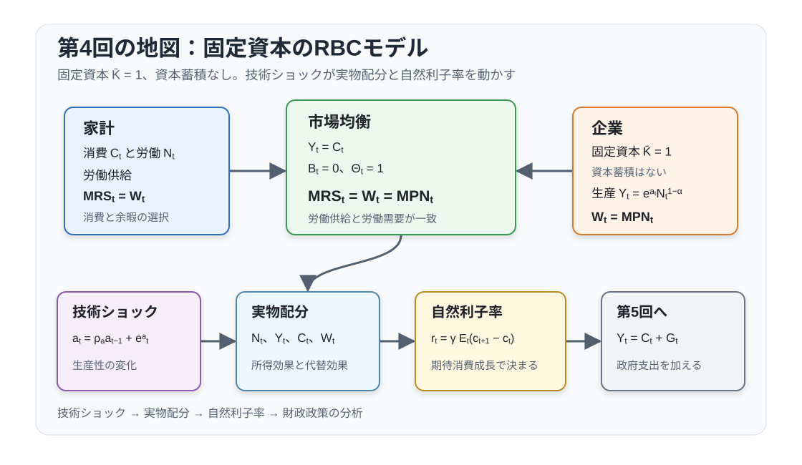

# 講義の目的

この回では、固定資本 $\bar K$ を1に正規化し、投資と資本蓄積を止めた柔軟価格モデルを扱います。したがって、標準的なRBCモデルにある投資の調整はありません。技術ショックを観察した後、家計の労働供給と企業の労働需要が同じ期の実物配分を決めます。

中心となる均衡条件は次の2式です。
$$
MRS_t=W_t=MPN_t,
\qquad
Y_t=C_t
$$
特定する効用関数と生産関数のもとでは、技術ショックへの反応を
$$
\begin{aligned}
y_t&=\zeta_a a_t,\\
n_t&=\frac{1-\gamma}{\varphi+\alpha+\gamma(1-\alpha)}a_t,\\
r_t&=\gamma\zeta_a(\rho_a-1)a_t
\end{aligned}
$$
と表せます。労働の反応は代替効果と所得効果の大小で決まり、自然実質利子率は、決まった消費経路とゼロ純供給の債券市場を整合させます。

この回の到達目標は次の4点です。

1. $MRS_t=W_t=MPN_t$ から実物配分を導く。
2. 技術ショックに対する産出、消費、労働、実質賃金の反応を求める。
3. 消費経路から自然実質利子率を復元する。
4. 第5回で政府支出を加えたとき、どの均衡条件が変わるか説明する。

@fig-lecture04-overview は、家計と企業の静学的条件から実物配分と自然実質利子率へ進む流れを示しています。

{#fig-lecture04-overview width=95% fig-pos="H"}

# 表記と基本設定

大文字は水準、小文字は定常状態からの対数乖離を表します。たとえば $y_t\equiv\ln Y_t-\ln Y$、$c_t\equiv\ln C_t-\ln C$ です。$w_t$ と $r_t$ も、それぞれ実質賃金と実質総利子率の対数乖離です。

| 記号 | 意味 | 記号 | 意味 |
|---|---|---|---|
| $C_t$ | 消費 | $N_t$ | 労働投入 |
| $Y_t$ | 産出 | $W_t$ | 実質賃金 |
| $\bar K=1$ | 固定資本 | $a_t$ | 対数技術水準 |
| $B_t$ | 実質債券保有 | $R_t$ | 実質総利子率 |
| $\Theta_t$ | 企業持分保有 | $V_t$ | 配当落ち株価 |
| $D_t$ | 配当・企業利潤 | $R_t^N$ | 粗名目利子率 |
| $\Pi_t$ | 粗インフレ率 | $\mathbb E_t$ | $t$ 期の情報による条件付き期待値 |

基礎パラメータと、この回で繰り返し使う派生量は次の通りです。

| 記号 | 定義・意味 |
|---|---|
| $0<\beta<1$ | 主観的割引因子 |
| $\gamma$ | 異時点間代替弾力性の逆数 |
| $\varphi$ | Frisch労働供給弾力性の逆数 |
| $0\leq\alpha<1$ | 固定資本への分配率 |
| $\rho_a$ | 技術ショックの持続性 |
| $MRS_t=-U_{N,t}/U_{C,t}$ | 消費で測った労働の限界不効用 |
| $MPN_t=\exp(a_t)F_N(N_t)$ | 労働の限界生産物 |
| $Q_{t,t+1}=\beta U_{C,t+1}/U_{C,t}$ | 限界効用にもとづく確率的割引因子（SDF） |
| $\zeta_a=(1+\varphi)/\{\varphi+\alpha+\gamma(1-\alpha)\}$ | 産出の技術ショック反応係数 |

家計と企業の測度、および発行株式数は1に正規化します。$V_t$ は配当落ちの1株当たり価格であり、この正規化のもとで企業価値にも一致します。固定資本は企業が保有し、家計は株式を通じてその収益を受け取ります。

# 均衡条件

## 家計

時点 $t$ の初めに技術ショックが実現し、家計はそれを観察してから消費、労働、債券、企業持分を選びます。$\mathcal F_t$ をショック観察後の情報集合とし、各選択は $\mathcal F_t$ 可測とします。期首に持ち越す $B_{t-1}(h)$ と $\Theta_{t-1}(h)$ は所与です。

家計 $h$ の問題は次のとおりです。
$$
\max_{\{C_t(h),N_t(h),B_t(h),\Theta_t(h)\}_{t=0}^{\infty}}
\mathbb{E}_0\sum_{t=0}^{\infty}\beta^t U(C_t(h),N_t(h))
$$
各期の実質予算制約は次式です。
$$
C_t(h)+B_t(h)+\Theta_t(h)V_t
=R_{t-1}B_{t-1}(h)+\Theta_{t-1}(h)(V_t+D_t)+W_tN_t(h)
$$
ここで $R_{t-1}$ は前期に購入した実質債券の今期総収益率です。$V_t$ は配当落ち株価なので、前期から株式を保有する家計は $V_t+D_t$ を受け取ります。

限界効用SDFと多期間SDFを次のように定義します。
$$
Q_{t,t+1}(h)
\equiv
\beta\frac{U_{C,t+1}(h)}{U_{C,t}(h)},
\qquad
Q_{t,t+N}(h)
\equiv
\beta^N\frac{U_{C,t+N}(h)}{U_{C,t}(h)}
$$
期末金融資産価値は
$$
A_t^F(h)\equiv B_t(h)+\Theta_t(h)V_t
$$
と置きます。借金の無限先送りを排除するNo-Ponzi条件と、内点最適解の横断性条件は、それぞれ次式で表せます。
$$
\begin{aligned}
\liminf_{N\to\infty}
\mathbb E_t\!\left[Q_{t,t+N}(h)A_{t+N}^F(h)\right]&\geq0,\\
\lim_{N\to\infty}
\mathbb E_t\!\left[Q_{t,t+N}(h)A_{t+N}^F(h)\right]&=0
\end{aligned}
$$
第1式は実行可能集合を制限し、第2式は効用を生まない金融資産を無限遠に残す過剰貯蓄を排除します。

内点解の一階条件を対称均衡で書くと、次の3式になります。
$$
\begin{aligned}
W_t&=-\frac{U_{N,t}}{U_{C,t}},\\
1&=\mathbb{E}_t\left[Q_{t,t+1}R_t\right],\\
V_t&=\mathbb{E}_t\left[Q_{t,t+1}(V_{t+1}+D_{t+1})\right].
\end{aligned}
$$ {#eq-household-focs}
第1式は労働供給条件、第2式は実質債券のオイラー方程式、第3式は株式を内点保有する家計の一階条件です。第3式は正の限界効用SDFによる価格付けなので無裁定と整合しますが、無裁定だけから家計の限界効用SDFが特定されるわけではありません。

::: {.callout-note title="第3回との接続：SDF、状態価格、株式価値"}
消費選択の文脈では $Q_{t,t+1}$ を異時点間の限界代替率と呼びます。状態履歴を $s^t$ とすると、後継状態 $s^{t+1}$ の状態価格は次式です。
$$
\Pr(s_{t+1}\mid s^t)Q_{t,t+1}(s^{t+1})
$$
$Q_{t,t+1}$ 自体には遷移確率を含めず、その確率は条件付き期待値 $\mathbb E_t$ が担います。

株式の一階条件を $N$ 回繰り返すと、次式を得ます。
$$
V_t
=
\mathbb E_t\!\left[
\sum_{i=1}^{N}Q_{t,t+i}D_{t+i}
+Q_{t,t+N}V_{t+N}
\right]
$$
無バブル条件は
$$
\lim_{N\to\infty}
\mathbb E_t[Q_{t,t+N}V_{t+N}]=0
$$
です。この条件のもとで、株式価値は将来配当のSDF割引現在価値になります。この資産価格ブロックは均衡価格を決めますが、当期の実物配分を直接決めません。
:::

## 企業

代表的な完全競争企業は、固定資本 $\bar K=1$ のもとで労働投入 $N_t$ を選びます。固定資本は蓄積できず、投資も資本レンタル市場もありません。生産関数と実質利潤は次のとおりです。
$$
Y_t=\exp(a_t)\bar K^\alpha N_t^{1-\alpha}
=\exp(a_t)N_t^{1-\alpha},
\qquad
D_t=Y_t-W_tN_t
$$
企業の選択を将来へ結ぶ状態変数がないため、企業価値最大化は各期の利潤最大化に分解できます。労働需要条件と配当は次の2式です。
$$
\begin{aligned}
W_t&=(1-\alpha)\exp(a_t)N_t^{-\alpha}=MPN_t,\\
D_t&=Y_t-W_tN_t=\alpha Y_t
\end{aligned}
$$ {#eq-firm-conditions}
配当 $\alpha Y_t$ は固定資本への収益であり、家計は株式保有を通じて受け取ります。

## 集計均衡

債券は純供給ゼロ、企業持分の総供給は1です。市場清算条件は次のとおりです。
$$
\int B_t(h)\,dh=0,
\qquad
\int\Theta_t(h)\,dh=1
$$
家計予算制約を集計し、企業利潤 $D_t=Y_t-W_tN_t$ を使うと、財市場の均衡 $Y_t=C_t$ が得られます。

資本蓄積なし・政府なしの実物配分は、次の4式で決まります。
$$
\begin{aligned}
W_t&=-\frac{U_{N,t}}{U_{C,t}},\\
W_t&=(1-\alpha)\exp(a_t)N_t^{-\alpha},\\
Y_t&=\exp(a_t)N_t^{1-\alpha},\\
Y_t&=C_t.
\end{aligned}
$$ {#eq-static-equilibrium}

家計の労働供給と企業の労働需要を合わせた中心条件は次式です。
$$
MRS_t=W_t=MPN_t
$$ {#eq-labor-market}
実質賃金は、家計が追加的に1単位働くために必要な消費補償と、その労働が生む限界生産物の両方に等しくなります。$a_t$ が与えられると、@eq-labor-market から $N_t$ が決まり、生産関数と資源制約から $Y_t$ と $C_t$ が決まります。債券と株式は均衡価格を決めますが、固定資本は蓄積できないため、当期の生産能力を変える選択変数にはなりません。

# 関数形と閉形式解

## 効用と生産

消費効用は次式です。
$$
u(C)=
\begin{cases}
\dfrac{C^{1-\gamma}-1}{1-\gamma},&\gamma\neq1,\\[6pt]
\log C,&\gamma=1
\end{cases}
$$
期間効用と生産関数は次のとおりです。
$$
U(C_t,N_t)=u(C_t)-\frac{N_t^{1+\varphi}}{1+\varphi},
\qquad
Y_t=\exp(a_t)\bar K^\alpha N_t^{1-\alpha},
\quad \bar K=1
$$
ただし $\gamma>0$、$\varphi>0$、$0\leq\alpha<1$ です。限界効用、労働供給側のMRS、労働需要側のMPNは次のとおりです。
$$
\begin{aligned}
U_{C,t}&=C_t^{-\gamma},
&U_{N,t}&=-N_t^\varphi,\\
MRS_t&=N_t^\varphi C_t^\gamma,
&MPN_t&=(1-\alpha)\exp(a_t)N_t^{-\alpha}
\end{aligned}
$$
限界効用SDFは次式です。
$$
Q_{t,t+1}
=
\beta\left(\frac{C_{t+1}}{C_t}\right)^{-\gamma}
$$

## 水準の閉形式解

@eq-labor-market と $C_t=Y_t$ を合わせると、均衡労働は次式を満たします。
$$
N_t^\varphi C_t^\gamma
=
(1-\alpha)\exp(a_t)N_t^{-\alpha}
$$
$C_t=\exp(a_t)N_t^{1-\alpha}$ を代入した閉形式解は次式です。
$$
N_t=
\left[
(1-\alpha)\exp\{(1-\gamma)a_t\}
\right]^{\frac{1}{\varphi+\alpha+\gamma(1-\alpha)}}
$$ {#eq-labor-level}
技術上昇は実質賃金を高めますが、労働の反応は代替効果と所得効果の差で決まります。

## パラメータの解釈

$\gamma$ は異時点間代替弾力性（EIS）の逆数です。確実性下では $Q_{t,t+1}=1/R_t$ なので、EISは
$$
-\frac{d\ln(C_{t+1}/C_t)}{d\ln Q_{t,t+1}}
=
\frac{d\ln(C_{t+1}/C_t)}{d\ln R_t}
=
\frac{1}{\gamma}
$$
となります。$\gamma$ が大きいほど、家計は消費時点を動かしにくくなります。

$\varphi$ はFrisch労働供給弾力性の逆数です。$U_{C,t}=C_t^{-\gamma}$ を一定に保つと、労働供給条件 $W_t=N_t^\varphi C_t^\gamma$ から
$$
\frac{d\ln N_t}{d\ln W_t}\bigg|_{U_C}
=
\frac{1}{\varphi}
$$
を得ます。$\varphi$ が大きいほど、労働供給は賃金に対して動きにくくなります。

# 定常状態

対数線形化の前に、水準の定常状態を確認します。技術の定常状態を $a=0$、したがって $\exp(a)=1$ と正規化します。定常状態では $C_t=C$、$N_t=N$、$Y_t=Y$、$W_t=W$ です。資源制約、生産関数、労働需要、労働供給は次のとおりです。
$$
\begin{aligned}
C&=Y=N^{1-\alpha},\\
W&=(1-\alpha)N^{-\alpha},\\
W&=N^\varphi C^\gamma
\end{aligned}
$$
$C=N^{1-\alpha}$ を代入すると次式を得ます。
$$
N^{\varphi+\alpha+\gamma(1-\alpha)}=1-\alpha
$$
水準の定常状態は
$$
N=
(1-\alpha)^{1/\{\varphi+\alpha+\gamma(1-\alpha)\}},
\qquad
Y=C=N^{1-\alpha},
\qquad
W=(1-\alpha)N^{-\alpha}
$$
です。配当は $D=\alpha Y$ であり、固定資本への定常収益を表します。

固定資本を1に正規化しても、一般には $N=Y=C=W=1$ にはなりません。$\alpha>0$ なら $1-\alpha<1$ なので、通常 $N$ は1より小さくなります。

例外は $\alpha=0$ の線形生産です。この場合、$Y_t=\exp(a_t)N_t$ かつ $D_t=0$ であり、$a=0$ のもとで
$$
N=1,
\qquad
Y=C=1,
\qquad
W=1
$$
が成り立ちます。水準が1にそろうという直観は、この特殊ケースに限られます。

定常状態では $C_{t+1}=C_t$ なので $Q=\beta$ です。実質債券のオイラー方程式は
$$
R=\frac{1}{\beta}
$$
を意味します。インフレ率の定常状態を $\Pi=1$ と置けば、粗名目利子率の定常状態も $R^N=1/\beta$ です。

この後に使う小文字の $a_t,y_t,c_t,n_t,w_t$ は定常状態からの対数乖離なので、定常状態ではすべて0です。$a=0$ は技術水準が $\exp(a)=1$ であることを意味しますが、これは水準の $Y,C,N,W$ がすべて1であるという意味ではありません。

# 対数線形解と技術ショック

## 均衡条件

定常状態の周りで対数線形化すると、@eq-static-equilibrium は次の体系になります。
$$
\begin{aligned}
y_t&=a_t+(1-\alpha)n_t,\\
c_t&=y_t,\\
w_t&=a_t-\alpha n_t,\\
w_t&=\gamma c_t+\varphi n_t
\end{aligned}
$$ {#eq-loglinear-system}
労働需要式 $w_t=a_t-\alpha n_t$ では、技術が1％上がると、同じ労働投入のもとでMPNが1％上がります。一方、労働投入が1％増えると、MPNは $\alpha$％下がります。

労働供給式 $w_t=\gamma c_t+\varphi n_t$ では、$\varphi$ が労働供給曲線の傾きを決めます。また、消費が増えると限界効用が下がり、家計は同じ労働に対してより高い賃金を求めます。係数 $\gamma$ は、この所得効果の強さを表します。

## 解と経済的解釈

反応係数を
$$
\zeta_a\equiv\frac{1+\varphi}{\varphi+\alpha+\gamma(1-\alpha)}
$$
と置きます。@eq-loglinear-system の解は次のとおりです。
$$
\begin{aligned}
y_t&=\zeta_a a_t,\\
n_t&=\frac{\zeta_a-1}{1-\alpha}a_t,\\
c_t&=y_t,\\
w_t&=\frac{1-\alpha\zeta_a}{1-\alpha}a_t.
\end{aligned}
$$ {#eq-loglinear-solution}
分母 $\varphi+\alpha+\gamma(1-\alpha)>0$ は、労働供給の傾き、労働需要の傾き、所得効果の強さをまとめています。この柔軟価格産出は、第8回で使う自然産出量の政府支出なしの特殊ケースです。

## 技術ショックのタイミングとIRF

技術水準は
$$
a_t=\rho_a a_{t-1}+e_t^a,
\qquad
0\leq\rho_a<1,
\qquad
\mathbb E_{t-1}e_t^a=0
$$ {#eq-technology-process}
に従うとします。時点 $t$ の初めには $a_{t-1}$ が所与であり、その後に $e_t^a$ が実現して $a_t$ が観察されます。家計と企業は $a_t$ を含む $\mathcal F_t$ に基づいて選択します。したがって、意思決定時点の状態は $a_t$ であり、$a_{t-1}$ はショック実現前に持ち越した所与の変数です。

ショック前に $a_{t-1}=0$、当期に $e_t^a>0$、その後のショックはゼロとします。$h$ 期先のインパルス応答は次式です。
$$
a_{t+h}=\rho_a^h e_t^a,
\qquad
x_{t+h}=\kappa_x\rho_a^h e_t^a,
\quad
x\in\{y,c,n,w\}
$$ {#eq-technology-irf}
係数 $\kappa_x$ は @eq-loglinear-solution から得られ、$\rho_a$ はすべての反応の減衰速度を決めます。

正の技術ショックは産出、消費、実質賃金を増やします。対応する係数は正です。
$$
\zeta_a>0,
\qquad
\frac{1-\alpha\zeta_a}{1-\alpha}
=
\frac{\varphi+\gamma}{\varphi+\alpha+\gamma(1-\alpha)}>0
$$
労働の反応は
$$
n_t
=
\frac{1-\gamma}{\varphi+\alpha+\gamma(1-\alpha)}a_t
$$
であり、代替効果と所得効果のどちらが強いかで符号が変わります。

- $\gamma<1$ なら、代替効果が上回り、労働は増えます。
- $\gamma=1$ なら、2つの効果が相殺し、労働は動きません。
- $\gamma>1$ なら、所得効果が上回り、労働は減ります。

$\alpha=0.4$、$\varphi=1$ のときのインパクト係数を比較すると、次のようになります。

| $\gamma$ | 産出 $\kappa_y=\zeta_a$ | 労働 $\kappa_n$ | 賃金 $\kappa_w$ |
|---:|---:|---:|---:|
| 0.5 | 1.176 | 0.294 | 0.882 |
| 1.0 | 1.000 | 0.000 | 1.000 |
| 2.0 | 0.769 | -0.385 | 1.154 |

::: {.callout-important title="このモデルに固有の結果"}
労働反応の符号が $1-\gamma$ だけで決まり、後に示す正の一時的技術ショックが自然実質利子率を下げることは、資本蓄積なし、分離可能選好、$C_t=Y_t$ という仮定に依存します。投資と資本蓄積を含む標準的なRBCモデルでは、消費と労働の反応は一般に異なります。
:::

# 自然実質利子率と古典派の二分法

実物配分 $n_t,y_t,c_t,w_t$ は、労働供給、労働需要、生産関数、資源制約から先に決まります。債券は純供給ゼロなので、実質総利子率 $R_t$ は、決まった消費経路と債券市場の清算を整合させる価格です。

実質債券のオイラー方程式は次式です。
$$
1
=
\mathbb E_t\!\left[
\beta
\left(\frac{C_{t+1}}{C_t}\right)^{-\gamma}
R_t
\right]
$$ {#eq-real-bond-euler}
$R_t$ が時点 $t$ で確定するリスクなし実質総利子率なら、
$$
R_t
=
\left\{
\mathbb E_t\!\left[
\beta
\left(\frac{C_{t+1}}{C_t}\right)^{-\gamma}
\right]
\right\}^{-1}
$$
となります。定常状態からの対数乖離を $r_t$ と書くと、一次近似は次式です。
$$
r_t
=
\gamma\mathbb E_t(c_{t+1}-c_t)
$$ {#eq-natural-rate-euler}
期待消費成長率が高い経路と整合するには高い実質利子率が必要です。$\gamma$ が大きいほどEISが小さいため、同じ期待消費成長率を支える利子率変化は大きくなります。

@eq-technology-process と $\mathbb E_t e_{t+1}^a=0$ から $\mathbb E_ta_{t+1}=\rho_a a_t$ です。$c_t=\zeta_a a_t$ を @eq-natural-rate-euler に代入すると、自然実質利子率は次式になります。
$$
r_t
=
\gamma\zeta_a(\rho_a-1)a_t
$$ {#eq-natural-rate-technology}
$0\leq\rho_a<1$ の正の一時的技術ショックは現在の消費を将来の消費より相対的に高めるため、この単純化されたモデルでは自然実質利子率が低下します。

実物側は $n_t,y_t,c_t,w_t,r_t$ を決めますが、名目利子率 $R_t^N$、インフレ率 $\Pi_{t+1}$、物価水準は、このブロックだけでは別々に決まりません。名目債券のオイラー方程式は次式です。
$$
1
=
\mathbb E_t\!\left[
Q_{t,t+1}
\frac{R_t^N}{\Pi_{t+1}}
\right]
$$ {#eq-nominal-bond-euler}
$R_t^N/\Pi_{t+1}$ は、将来の実現インフレ率で割った状態依存の実質総収益率です。インフレが不確実なら、SDFとの共分散を含むインフレリスクが残ります。

実際の名目利子率は、金融政策ルールとインフレ率の決まり方を導入してから扱います。価格が柔軟なら、名目変数が調整して実際の実質利子率は自然実質利子率に一致します。価格硬直性があると、金融政策が決める実質利子率が自然実質利子率からずれ、その差が需給ギャップを生みます。

# まとめと第5回への接続

この回では、固定資本を1に正規化し、資本蓄積を止めた柔軟価格モデルを解きました。実物配分の中心は @eq-labor-market です。技術ショックは産出、消費、実質賃金を増やし、労働反応の符号は代替効果と所得効果の大小で決まります。自然実質利子率は、決まった消費経路とゼロ純供給の債券市場を整合させます。

第5回では政府支出 $G_t$ を導入し、資源制約を
$$
Y_t=C_t+G_t
$$
へ変更します。固定資本は引き続き蓄積できないため、政府支出は投資ではなく、同じ期の消費と労働を通じて実物配分に影響します。第4回の $B_t$ は純供給ゼロの民間債券ですが、第5回では政府債務が正の純供給を持つ点に注意してください。また、第5回の $G_Y=0$、$g_t=0$ とすれば、本講義の係数 $\zeta_a$（第5回の比較節では $\zeta_a'$）に戻ります。

# 参考文献

**必読**

- Galí, Jordi (2015) *Monetary Policy, Inflation, and the Business Cycle* (2nd ed.). Princeton University Press. 固定資本・柔軟価格モデルからニューケインジアン・モデルへ進むための参照先。
- Romer, David (2019) *Advanced Macroeconomics* (5th ed.). McGraw-Hill. 実物ショックと標準的な資本蓄積モデルを比較するための参照先。

**発展：資本蓄積を含む標準的なRBCモデル**

- Kydland, Finn E., and Edward C. Prescott (1982) "Time to Build and Aggregate Fluctuations." *Econometrica*, 50(6), 1345-1370. [doi](https://doi.org/10.2307/1913386)
- Hansen, Gary D. (1985) "Indivisible Labor and the Business Cycle." *Journal of Monetary Economics*, 16(3), 309-327. [doi](https://doi.org/10.1016/0304-3932(85)90039-X)
- King, Robert G., Charles I. Plosser, and Sergio T. Rebelo (1988) "Production, Growth and Business Cycles: I. The Basic Neoclassical Model." *Journal of Monetary Economics*, 21(2-3), 195-232. [doi](https://doi.org/10.1016/0304-3932(88)90030-X)
- King, Robert G., and Sergio T. Rebelo (1999) "Resuscitating Real Business Cycles." In *Handbook of Macroeconomics*, Vol. 1B. Elsevier.
- Plosser, Charles I. (1989) "Understanding Real Business Cycles." *Journal of Economic Perspectives*, 3(3), 51-77. [doi](https://doi.org/10.1257/jep.3.3.51)

# 演習問題

## 基本問題

**問1 [Core]：概念確認**　資本蓄積のないRBCモデルで、$MRS_t=W_t=MPN_t$ が何を意味するかを、家計側と企業側の両方から説明しなさい。

**問2 [Core] [Derivation]：導出確認**　効用関数 $U(C_t,N_t)=u(C_t)-N_t^{1+\varphi}/(1+\varphi)$、$u'(C)=C^{-\gamma}$、生産関数 $Y_t=\exp(a_t)\bar K^\alpha N_t^{1-\alpha}$、$\bar K=1$、資源制約 $Y_t=C_t$ から、@eq-labor-level を導出しなさい。

**問3 [Core]：直観確認**　正の技術ショックが起きたとき、産出、消費、実質賃金はどう動くか説明しなさい。労働の反応が $\gamma$ に依存する理由も述べなさい。

**問4 [Core] [Derivation]：固定資本と配当**　企業の生産関数と労働需要条件から $W_tN_t=(1-\alpha)Y_t$ と $D_t=\alpha Y_t$ を導出しなさい。無バブル条件のもとで、$\alpha=0$ の場合に配当と株式価値がどうなるかも説明しなさい。

## 発展問題

**問5 [Research extension] [Computation]：インパルス応答**　$\alpha=0.4$、$\varphi=1$、$\gamma=2$、$\rho_a=0.9$ とします。定常状態で1％の技術ショックが発生し、その後のショックはゼロです。$a_{t+h}$、$y_{t+h}$、$n_{t+h}$、$w_{t+h}$ の $h=0,1,2$ における反応を計算しなさい。

**問6 [Research extension] [Derivation]：自然実質利子率**　@eq-natural-rate-euler と $c_t=\zeta_a a_t$ から @eq-natural-rate-technology を導出しなさい。$\rho_a$ が1に近いほど自然実質利子率の低下幅が小さい理由を説明しなさい。

**問7 [Research extension]：第5回への接続**　政府支出を導入した資源制約 $Y_t=C_t+G_t$ が、定常状態比率 $G_Y=0$、政府支出ショック $g_t=0$ のもとで第4回の $Y_t=C_t$ に戻ることを示しなさい。民間債券が純供給ゼロの場合と、政府債務が正の純供給を持つ場合の違いも説明しなさい。
