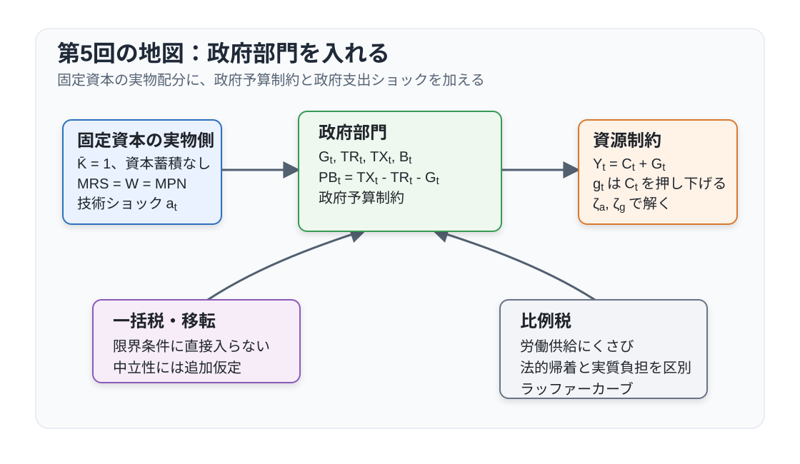

```{r}
#| label: setup-japanese-graphics
#| include: false
source("scripts/japanese-graphics.R")
jp_graphics <- configure_course_graphics()
```

# 講義の目的

この回では、第4回の固定資本 $\bar K=1$、投資・資本蓄積なしの柔軟価格モデルに政府部門を導入します。政府購入 $G_t$、一括税、移転、政府債務を加え、財源調達と実物資源の吸収を分けて考えます。以下では、慣例に従って政府購入 $G_t$ を政府支出とも呼びます。

目的は次の4点です。

1. 政府予算制約とプライマリーバランスを理解する。
2. 一括税と政府支出が資源配分へ与える効果を区別する。
3. 政府支出ショックを含む、資本蓄積のない固定資本モデルを対数線形化する。
4. 労働税の帰着を確認し、労働所得税だけを用いてラッファーカーブを導出する。

この回では二つの政策実験を区別します。前半では政府購入を動かし、その財源を一括税または国債で賄います。後半のラッファーカーブでは政府購入と政府債務をゼロに置き、労働税率と課税ベースの関係だけを調べます。

| 政策実験 | 政策設定 | 確認する対象 |
|---|---|---|
| 政府購入ショック | $G_t$ が変動し、一括税または国債で調達 | 消費・労働・産出の反応 |
| 労働税の静学実験 | $G=0$、$B=0$、$TR=TX$ | 税率と課税ベース・税収の関係 |

@fig-lecture05-overview は、政府部門を加えた後の分析の流れを示しています。

{#fig-lecture05-overview width=100% fig-pos="H"}

# 表記と基本設定

大文字は水準、小文字は定常状態からの対数乖離を表します。ただし政府支出ショックは
$$
g_t\equiv \frac{G_t-G}{Y}
$$
と定義します。

主な水準変数は次の通りです。

| 記号 | 意味 |
|---|---|
| $C_t$ | 民間消費 |
| $N_t$ | 労働投入 |
| $Y_t$ | 産出 |
| $G_t$ | 政府購入（政府支出） |
| $W_t$ | 実質賃金 |
| $\bar K=1$ | 企業が保有する固定資本 |
| $B_t(h)$ | 家計 $h$ の期末債券保有（当期財で評価） |
| $B_t$ | $t$ 期末の実質政府債務（当期の国債発行額） |
| $\Theta_t(h)$ | 家計 $h$ の企業持分保有 |
| $V_t$ | 株式価値または企業価値 |
| $D_t$ | 企業利潤または配当 |
| $TX_t$ | 税収 |
| $TR_t$ | 一括移転 |
| $PB_t$ | プライマリーバランス |
| $R_t^N$ | 粗名目利子率 |
| $\Pi_t$ | 粗インフレ率 |
| $P_t$ | 物価水準（$\Pi_t=P_t/P_{t-1}$） |
| $\mathbb E_t$ | $t$ 期の情報に基づく条件付き期待値 |
| $a_t$ | 対数技術水準（技術水準は $\exp(a_t)$） |
| $e_t^a,e_t^g$ | 技術・政府支出過程のイノベーション |
| $C,N,Y,G,W$ | 対応する定常状態の水準 |

主な基礎パラメータは次の通りです。

| 記号 | 意味 |
|---|---|
| $0<\beta<1$ | 主観的割引因子 |
| $\gamma>0$ | 異時点間代替弾力性の逆数 |
| $\varphi>0$ | フリッシュ弾力性の逆数 |
| $0\leq\alpha<1$ | 固定資本への分配率（同時に労働の限界生産物の曲率を決める） |
| $\nu=1$ | 労働不効用の水準の正規化 |
| $0\leq G_Y=G/Y<1$ | 定常状態の政府支出比率 |
| $|\rho_a|,|\rho_g|<1$ | 技術ショック、政府支出ショックの持続性 |
| $\tau_N,\tau_C$ | 労働所得税率、消費税率 |

政府予算と近似で使う二つの派生変数は次の通りです。反応係数 $\zeta_a,\zeta_g$ とラッファーカーブの係数は、それぞれの導出箇所で定義します。

| 記号 | 定義 | 意味 |
|---|---|---|
| $g_t$ | $(G_t-G)/Y$ | 定常状態の産出で測った政府支出ショック |
| $Q_{t,t+i}$ | $\beta^iU_{C,t+i}/U_{C,t}$ | $t$ 期から $t+i$ 期までの確率的割引因子（SDF） |

# 政府予算制約

政府は政府購入 $G_t$ と移転 $TR_t$ を、税収 $TX_t$ と国債発行で賄います。$B_t$ は $t$ 期に発行する国債の実質調達額であり、$t+1$ 期には実質で $R_t^N B_t/\Pi_{t+1}$ を返済します。このタイミングで政府予算制約を書くと
$$
G_t+TR_t+\frac{R_{t-1}^N}{\Pi_t}B_{t-1}
=TX_t+B_t
$$ {#eq-government-flow-budget}
です。左辺は政府購入、一括移転、既存国債の実質償還額、右辺は税収と新規国債発行です。

プライマリーバランスを
$$
PB_t\equiv TX_t-TR_t-G_t
$$
と定義すると、政府予算制約は
$$
B_t=\frac{R_{t-1}^N}{\Pi_t}B_{t-1}-PB_t
$$ {#eq-government-debt-law}
と書けます。国債が増えるのは、利払い込みの既存債務が大きいか、プライマリーバランスが赤字のときです。

家計のオイラー方程式から
$$
1=\mathbb{E}_t\left[Q_{t,t+1}\frac{R_t^N}{\Pi_{t+1}}\right]
$$
が成り立ちます。まず、1期先の債務式を
$$
B_{t+1}+PB_{t+1}=\frac{R_t^N}{\Pi_{t+1}}B_t
$$
と書き、両辺に $Q_{t,t+1}$ を掛けて条件付き期待値を取ります。$B_t$ は $t$ 期に既知なので、債券のオイラー方程式から
$$
\mathbb E_t\left[Q_{t,t+1}(B_{t+1}+PB_{t+1})\right]
=B_t\mathbb E_t\left[Q_{t,t+1}\frac{R_t^N}{\Pi_{t+1}}\right]
=B_t
$$
を得ます。この関係を先へ反復し、反復期待値の法則を使うと、有限の $N$ について
$$
B_t=\mathbb E_t\left[
\sum_{i=1}^{N}Q_{t,t+i}PB_{t+i}+Q_{t,t+N}B_{t+N}
\right]
$$
です。最後の項がゼロに収束すれば、政府の通時予算制約は
$$
B_t=
\mathbb{E}_t\sum_{i=1}^{\infty}Q_{t,t+i}PB_{t+i}
$$ {#eq-government-intertemporal-budget}
となります。ただし $Q_{t,t+i}$ は $t$ 期から $t+i$ 期までの確率的割引因子（SDF）であり、横断性条件
$$
\lim_{i\to\infty}\mathbb{E}_t\left[Q_{t,t+i}B_{t+i}\right]=0
$$ {#eq-government-transversality}
を仮定しています。この式は、現在の政府債務が将来のプライマリーバランスの確率的割引現在価値に等しいことを表します。

@eq-government-intertemporal-budget だけでは、国債発行の中立性は導けません。家計側の予算制約と資産市場を合わせたうえで、将来の一括税が政府債務を裏づけるという財政政策の閉じ方が必要です。この条件は均衡節で明示します。

# 家計・企業・均衡

## 家計

家計の個別最適化は第4回と同じです。家計の測度と発行株式数を1に正規化し、この回では一括税 $TX_t$ と一括移転 $TR_t$ を加えます。家計 $h$ の予算制約は
$$
C_t(h)+B_t(h)+\Theta_t(h)V_t+TX_t
=R_{t-1}^N\frac{P_{t-1}}{P_t}B_{t-1}(h)
+\Theta_{t-1}(h)(V_t+D_t)+W_tN_t(h)+TR_t
$$
です。$P_t$ は物価水準であり、$P_{t-1}/P_t=1/\Pi_t$ です。$TX_t$ と $TR_t$ は各家計に一律に課される一括税・一括移転であり、家計の測度が1なので集計額にも一致します。

対称均衡で評価した一階条件は第4回と同じです。
$$
\begin{aligned}
W_t&=-\frac{U_{N,t}}{U_{C,t}},\\
1&=\mathbb{E}_t\left[Q_{t,t+1}\frac{R_t^N}{\Pi_{t+1}}\right],\\
V_t&=\mathbb{E}_t\left[Q_{t,t+1}(V_{t+1}+D_{t+1})\right].
\end{aligned}
$$
一括税と一括移転は限界条件に直接現れません。ただし、これは一括税に所得効果がないという意味ではありません。政府と家計の通時予算制約を統合し、将来の一括税が債務を裏づけるときに、税を徴収する時点だけが実物配分から消えます。

## 企業

企業の最適化も第4回と同じです。企業は固定資本 $\bar K=1$ を保有し、各期に労働投入だけを選びます。完全競争企業は実質利潤
$$
D_t=Y_t-W_tN_t
$$
を最大化します。生産関数
$$
Y_t=\exp(a_t)F(\bar K,N_t),
\qquad \bar K=1
$$
のもとで、労働の一階条件は
$$
W_t=\exp(a_t)F_N(\bar K,N_t)
$$
です。したがって、家計の労働供給条件と合わせると
$$
-\frac{U_{N,t}}{U_{C,t}}=\exp(a_t)F_N(\bar K,N_t)
$$
を得ます。

## 政府支出を含む均衡

この回の政府購入は、家計の効用にも企業の生産性にも直接入りません。したがって、政府購入は純粋に実物資源を吸収します。

債券市場と株式市場の清算条件は
$$
\int B_t(h)\,dh=B_t,
\qquad
\int\Theta_t(h)\,dh=1
$$
です。家計予算を集計すると、株式価値 $V_t$ は両辺から消え、$D_t+W_tN_t=Y_t$ なので
$$
C_t+B_t+TX_t
=\frac{R_{t-1}^N}{\Pi_t}B_{t-1}+Y_t+TR_t
$$
を得ます。これを @eq-government-flow-budget と統合すると、国債、税、移転が相殺され、財市場の均衡は
$$
Y_t=C_t+G_t
$$ {#eq-resource-constraint-government}
です。定常状態の政府支出比率を
$$
G_Y\equiv \frac{G}{Y}
$$
とし、政府支出ショックを
$$
g_t\equiv \frac{G_t-G}{Y}
$$ {#eq-government-spending-shock}
と定義します。ここで分母の $Y$ は定常状態の産出です。政府支出ショックは次の AR(1) 過程に従うとします。
$$
g_t=\rho_g g_{t-1}+e_t^g
$$
ただし $\mathbb E_{t-1}e_t^g=0$ です。

実物配分を決める条件は次の5本にまとめられます。
$$
\begin{aligned}
W_t&=-\frac{U_{N,t}}{U_{C,t}},\\
W_t&=\exp(a_t)F_N(\bar K,N_t),\\
Y_t&=\exp(a_t)F(\bar K,N_t),\\
Y_t&=C_t+G_t,\\
g_t&=\frac{G_t-G}{Y}.
\end{aligned}
$$
完全な均衡には、これらに加えて家計の資産価格式、政府予算制約、資産市場の清算条件、財政政策の閉じ方が必要です。

::: {.callout-note title="バロー・リカードの中立性を支える仮定"}
以下では、(i) 無限期間を生きる代表的家計が借入制約に直面しない、(ii) 政府購入 $G_t$ の経路が同じで、税と移転は一括型である、(iii) 家計と政府の横断性条件が成り立つ、(iv) 将来のプライマリーバランスが政府債務を裏づける、(v) 税・移転による家計間の再分配がない、と仮定します。

このとき、国債で政府購入の財源調達を先送りしても、将来の一括税の現在価値が同額だけ増えます。国債発行は家計の純資産を増やさず、一括税と国債の組み合わせは実物配分を変えません。これが Barro (1974) の中立命題です。将来のプライマリーバランスが債務に反応しない非リカード型の財政政策や、借入制約・世代交代がある場合には、この結論は一般に成り立ちません。Leeper (1991) は、債務を安定化する財政政策と、債務を所与として行動する財政政策を区別します。
:::

# 関数形と定常状態

第5回では、以後の回との接続を見やすくするため、労働不効用の水準を $\nu=1$ に正規化します。消費効用を
$$
u(C)=
\begin{cases}
\dfrac{C^{1-\gamma}-1}{1-\gamma},&\gamma\neq1,\\[6pt]
\log C,&\gamma=1
\end{cases}
$$
と定義します。期間効用と生産関数は
$$
U(C_t,N_t)=u(C_t)-\frac{N_t^{1+\varphi}}{1+\varphi},
\qquad
Y_t=\exp(a_t)\bar K^\alpha N_t^{1-\alpha},
\quad \bar K=1
$$
です。$\gamma=1$ の対数効用は、$\gamma\neq1$ の式の連続な極限です。固定資本を1に正規化しても、その収益は消えません。企業の労働需要条件から $W_tN_t=(1-\alpha)Y_t$ なので、配当は $D_t=\alpha Y_t$ です。

限界効用と労働の限界条件を合わせると、均衡労働は
$$
N_t^\varphi C_t^\gamma=(1-\alpha)\exp(a_t)N_t^{-\alpha}
$$
を満たします。政府購入が財を吸収すると、所与の産出では民間消費が低下します。この負の所得効果が労働供給を増やすため、資本蓄積のない本モデルでは、クラウドアウトは投資ではなく民間消費に現れます。

## 定常状態と第4回との比較

定常状態では $a=0$、つまり技術水準を $\exp(a)=1$ と正規化します。政府支出を水準 $G$ として外生的に置くと、定常状態の労働は
$$
N^\varphi\left(N^{1-\alpha}-G\right)^\gamma
=(1-\alpha)N^{-\alpha}
$$
を満たします。この式は一般の $\gamma$ と $\alpha$ では閉形式で解きにくく、数値的に解くのが自然です。

一方、講義ノートのように定常状態の政府支出比率
$$
G_Y\equiv \frac{G}{Y}
$$
を所与にすれば、$C=(1-G_Y)Y$ なので解析的に解けます。これは定常値を決めるための比率であり、各期に $G_t/Y_t$ を固定するという意味ではありません。

第4回と同じ分母 $\varphi+\alpha+\gamma(1-\alpha)$ を用いると、政府支出を含む定常状態は
$$
\begin{aligned}
N^G
&=
\left[
(1-\alpha)(1-G_Y)^{-\gamma}
\right]^{1/\{\varphi+\alpha+\gamma(1-\alpha)\}},\\
Y^G
&=(N^G)^{1-\alpha},\\
C^G
&=(1-G_Y)Y^G,\\
W^G
&=(1-\alpha)(N^G)^{-\alpha}.
\end{aligned}
$$

第4回の政府なし定常状態を上付き $0$ で表すと、
$$
N^0=
(1-\alpha)^{1/\{\varphi+\alpha+\gamma(1-\alpha)\}},
\qquad
Y^0=C^0=(N^0)^{1-\alpha}
$$
です。以下では、政府購入が正のケース $0<G_Y<1$ を第4回と比較します。政府支出を導入した定常状態は
$$
\begin{aligned}
\frac{N^G}{N^0}
&=(1-G_Y)^{-\gamma/\{\varphi+\alpha+\gamma(1-\alpha)\}}>1,\\
\frac{Y^G}{Y^0}
&=(1-G_Y)^{-\gamma(1-\alpha)/\{\varphi+\alpha+\gamma(1-\alpha)\}}>1,\\
\frac{C^G}{C^0}
&=(1-G_Y)^{(\varphi+\alpha)/\{\varphi+\alpha+\gamma(1-\alpha)\}}<1,\\
\frac{W^G}{W^0}
&=(1-G_Y)^{\alpha\gamma/\{\varphi+\alpha+\gamma(1-\alpha)\}}\leq1.
\end{aligned}
$$
$0<G_Y<1$ なら、政府購入を含む定常状態では民間消費が低く、労働と産出が高くなります。労働投入の増加は実質賃金を弱く押し下げ、$\alpha>0$ なら賃金は厳密に低下します。$\alpha=0$ では労働の限界生産物が労働量に依存しないため、実質賃金は変わりません。

# 対数線形近似

政府支出ショック $g_t=(G_t-G)/Y$ を用いると、財市場の対数線形近似は
$$
y_t=(1-G_Y)c_t+g_t
$$ {#eq-loglinear-resource-government}
です。その他の条件は
$$
\begin{aligned}
y_t&=a_t+(1-\alpha)n_t,\\
w_t&=a_t-\alpha n_t,\\
w_t&=\gamma c_t+\varphi n_t,\\
a_t&=\rho_a a_{t-1}+e_t^a,\\
g_t&=\rho_g g_{t-1}+e_t^g.
\end{aligned}
$$
ただし $\mathbb E_{t-1}e_t^a=\mathbb E_{t-1}e_t^g=0$ です。この5本が、政府支出を含む固定資本・資本蓄積なしモデルの対数線形体系です。

政府支出ショックの効果を明示するため、上の式を解きます。まず財市場から
$$
c_t=\frac{y_t-g_t}{1-G_Y}
$$
です。これを労働供給条件に代入し、企業側の条件と合わせると
$$
a_t-\alpha n_t
=\gamma\frac{a_t+(1-\alpha)n_t-g_t}{1-G_Y}
+\varphi n_t
$$
です。したがって
$$
n_t=
\frac{(1-G_Y-\gamma)a_t+\gamma g_t}
{(1-G_Y)(\alpha+\varphi)+\gamma(1-\alpha)}
$$
を得ます。

後のRANKモデルで使う表記に合わせて
$$
\zeta_a\equiv
\frac{(1-G_Y)(1+\varphi)}
{(1-G_Y)(\alpha+\varphi)+\gamma(1-\alpha)},
\qquad
\zeta_g\equiv
\frac{\gamma(1-\alpha)}
{(1-G_Y)(\alpha+\varphi)+\gamma(1-\alpha)}
$$
と定義すると、産出は
$$
y_t=\zeta_a a_t+\zeta_g g_t
$$
と書けます。この式は後で自然産出量として使う
$y_t^f=\zeta_a a_t+\zeta_g g_t$ と同じ形です。政府支出を含む柔軟価格RBCモデルでは、ここで求めた産出がそのまま自然産出量になります。

第8回では、この自然産出量に対応する消費経路 $c_t^f$ を家計のオイラー方程式に代入し、政府支出ショックを含む自然実質利子率を求めます。

他の変数は、産出の式を生産関数と資源制約に戻せば得られます。生産関数から
$$
n_t=\frac{y_t-a_t}{1-\alpha},
\qquad
w_t=a_t-\alpha n_t
$$
であり、資源制約から
$$
c_t=\frac{y_t-g_t}{1-G_Y}
$$
です。したがって
$$
\begin{aligned}
y_t&=\zeta_a a_t+\zeta_g g_t,\\
n_t&=\frac{\zeta_a-1}{1-\alpha}a_t
+\frac{\zeta_g}{1-\alpha}g_t,\\
c_t&=\frac{\zeta_a}{1-G_Y}a_t
+\frac{\zeta_g-1}{1-G_Y}g_t,\\
w_t&=\frac{1-\alpha\zeta_a}{1-\alpha}a_t
-\frac{\alpha\zeta_g}{1-\alpha}g_t.
\end{aligned}
$$

第4回の政府なしモデルでは
$$
\zeta_a'
\equiv
\frac{1+\varphi}{\varphi+\alpha+\gamma(1-\alpha)}
$$
とおけば
$$
\begin{aligned}
y_t&=\zeta_a' a_t,\\
n_t&=\frac{\zeta_a'-1}{1-\alpha}a_t,\\
c_t&=y_t,\\
w_t&=\frac{1-\alpha\zeta_a'}{1-\alpha}a_t.
\end{aligned}
$$
ここでの $\zeta_a'$ は第4回の政府なし係数であり、この第5回で定義した政府支出込みの $\zeta_a$ とは区別します。上の政府支出モデルで $G_Y=0$ かつ $g_t=0$ とおけば、第5回の $\zeta_a$ は $\zeta_a'$ に一致し、第4回の式に戻ります。

第4回との違いは @eq-loglinear-resource-government にあります。政府支出ショック $e_t^g>0$ は労働と産出を増やし、民間消費を下げます。実質賃金は弱く低下し、$\alpha>0$ なら厳密に低下します。この符号は定常状態の比較と同じ所得効果から生じます。

$g_t$ と $y_t$ はともに定常産出 $Y$ で尺度をそろえているため、$\zeta_g$ は局所的な政府購入乗数 $\partial Y_t/\partial G_t$ でもあります。たとえば $G_Y=0.2$、$\alpha=0.4$、$\gamma=\varphi=1$ なら
$$
\zeta_g=\frac{0.6}{0.8(1.4)+0.6}\simeq0.349,
\qquad
\frac{\zeta_g-1}{1-G_Y}\simeq-0.814.
$$
政府購入が定常産出の1%だけ増えると、産出は約0.349%増え、民間消費はその定常値から約0.814%減ります。水準では、政府購入1単位の増加に対して民間消費が約0.651単位押し出されます。この単純な結果は、政府購入が効用・生産性を直接高めず、投資も動かないという仮定に依存します。資本蓄積を含む動学的な財政政策の基準については Baxter and King (1993) と Aiyagari, Christiano, and Eichenbaum (1992) を参照してください。

技術ショックに対する反応も、第4回と完全には同じではありません。$g_t=0$ の技術ショックでは政府支出の水準は同時点で動かないため、追加的な産出は民間消費に強く反映されます。たとえば $\gamma=1$ なら第4回では $n_t=0$ ですが、政府支出モデルでは
$$
n_t=-\frac{G_Y}{(1-G_Y)(\alpha+\varphi)+(1-\alpha)}a_t
$$
となり、正の技術ショックに対して労働は低下します。これは、政府支出の定常比率を用いて定常状態を置いていても、短期の $G_t$ は独立した外生過程として扱っているためです。

# 税制とラッファーカーブ

ここからは政府購入の経路を固定し、税や補助金が限界条件に作るくさびを見ます。第6回では、独占的競争によるマークアップのくさびを売上比例補助金で相殺します。その準備として、この節では一括税、比例税、税の帰着を整理します。

## 一括税と比例税

固定資本を蓄積しない本モデルで比例税を入れるなら、労働所得税や消費税を考えるのが自然です。この回では固定資本への収益を課税対象にしません。

家計側に労働所得税率 $\tau_N$ を導入すると、家計が受け取る税引き後実質賃金は $(1-\tau_N)W_t$ です。ここでは税率を時間で変動する変数ではなく、所与の政策パラメータとして扱います。労働供給条件は
$$
(1-\tau_N)W_t=-\frac{U_{N,t}}{U_{C,t}}
$$
に変わります。企業の労働需要条件 $W_t=\exp(a_t)F_N(\bar K,N_t)$ は変わらないため、労働所得税は労働供給と労働需要の間にくさびを作ります。

消費税率 $\tau_C$ を導入すると、予算制約上の消費価格が $1+\tau_C$ 倍になります。これも所与の政策パラメータとして扱います。労働供給条件は
$$
\frac{1-\tau_N}{1+\tau_C}W_t=-\frac{U_{N,t}}{U_{C,t}}
$$
となります。固定資本を蓄積しない本モデルでは、消費税と労働所得税は静学的な労働供給のくさびとして似た役割を持ちます。

## 税の帰着

労働税では、法的に誰が税を納めるかと、均衡配分を決めるくさびは別です。配分を決めるのは、家計が受け取る限界的な実質賃金と、企業が支払う限界的な労働費用の比率です。以下では $0\leq\tau_N^H<1$、$\tau_N^F\geq0$ とします。

まず、家計側に労働所得税率 $\tau_N^H$ が課される場合を考えます。企業が支払う実質賃金を $W_t$ とすると、家計が受け取る限界的な賃金は $(1-\tau_N^H)W_t$ です。家計と企業の一階条件は
$$
(1-\tau_N^H)W_t
=-\frac{U_{N,t}}{U_{C,t}},
\qquad
W_t=\exp(a_t)F_N(\bar K,N_t)
$$
です。したがって、配分を決める労働市場の条件は
$$
-\frac{U_{N,t}}{U_{C,t}}
=
(1-\tau_N^H)\exp(a_t)F_N(\bar K,N_t)
$$
となります。

次に、企業側に労働投入税率 $\tau_N^F$ が課される場合を考えます。家計が受け取る実質賃金を $\widetilde W_t$ とすると、企業は労働1単位あたり $(1+\tau_N^F)\widetilde W_t$ を支払います。企業の実質利潤は
$$
D_t
=
\exp(a_t)F(\bar K,N_t)
-(1+\tau_N^F)\widetilde W_tN_t
$$
です。家計の一階条件と企業の一階条件は
$$
\widetilde W_t
=-\frac{U_{N,t}}{U_{C,t}},
\qquad
(1+\tau_N^F)\widetilde W_t
=\exp(a_t)F_N(\bar K,N_t)
$$
です。$\widetilde W_t$ を消去すると
$$
-\frac{U_{N,t}}{U_{C,t}}
=
\frac{1}{1+\tau_N^F}\exp(a_t)F_N(\bar K,N_t)
$$
を得ます。

したがって、家計側税と企業側税は
$$
1-\tau_N^H
=
\frac{1}{1+\tau_N^F}
\qquad
\Longleftrightarrow
\qquad
\tau_N^H
=
\frac{\tau_N^F}{1+\tau_N^F}
$$ {#eq-tax-incidence-equivalence}
を満たすとき、同じ労働市場のくさびを作ります。同じ $G_t$ の経路を所与とし、税収は一括移転または同じ政府予算調整で処理されるとします。この対応のもとでは、生産関数 $Y_t=\exp(a_t)F(\bar K,N_t)$ と資源制約 $Y_t=C_t+G_t$ も同じなので、$N_t,Y_t,C_t$ は同じです。変わるのは、家計が受け取る賃金と企業が支払う労働費用の分け方です。

税収も同じく書けます。企業側税では
$$
TX_t
=
\tau_N^F\widetilde W_tN_t
=
\frac{\tau_N^F}{1+\tau_N^F}
\exp(a_t)F_N(\bar K,N_t)N_t
$$
です。上の対応を使うと
$$
TX_t
=
\tau_N^H\exp(a_t)F_N(\bar K,N_t)N_t
$$
となり、家計側の労働所得税と同じ税収になります。つまり、完全競争と柔軟な賃金のもとでは、労働税の法的帰着は実物配分を変えません。実物配分を変えるのは、誰が納税するかではなく、労働供給と労働需要の間に入るくさびです。

## 労働所得税だけのラッファーカーブ

以下は、政府購入の財源問題ではなく、労働税率と課税ベースの関係だけを見る独立した静学実験です。表記を簡単にするため、家計側の労働所得税率を $\tau_N$ と書き、消費税は置きません。税率は $0\leq\tau_N<1$ を満たし、政府が選ぶ政策パラメータです。

前半の政府予算制約から、債務残高が一定の定常状態では
$$
G+TR+\left(\frac{R^N}{\Pi}-1\right)B=TX
$$
です。ラッファーカーブでは政府債務と政府購入をともにゼロ、
$$
B=0,
\qquad
G=0
$$
とします。したがって税収は一括移転として家計に戻され、
$$
TR=TX=\tau_N WN
$$
です。

家計は連続体をなし、各家計の測度はゼロとします。各家計は一括移転 $TR$ を所与とみなし、自分の労働供給が集計税収と移転を変える効果を内部化しません。この仮定により、税収を還付しても労働所得税は限界的な税引き後賃金を引き下げます。

この仮定のもとでは、税は労働供給条件にくさびを作りますが、政府購入として実物資源を吸収しないため、資源制約は
$$
C=Y
$$
です。定常状態では $a=0$ と正規化して時間添字を省略し、固定資本 $\bar K=1$ の生産関数を
$$
Y=\bar K^\alpha N^{1-\alpha}=N^{1-\alpha}
$$
とします。企業の労働需要条件は
$$
W=(1-\alpha)N^{-\alpha}
$$
です。労働所得税があると、家計の労働供給条件は
$$
(1-\tau_N)W=N^\varphi C^\gamma
$$
となります。資源制約 $C=Y=N^{1-\alpha}$ と企業の労働需要条件を代入すると
$$
(1-\tau_N)(1-\alpha)N^{-\alpha}
=N^\varphi\left(N^{1-\alpha}\right)^\gamma
$$
です。したがって
$$
N(\tau_N)
=
\left[
(1-\tau_N)(1-\alpha)
\right]^{\frac{1}{\varphi+\alpha+\gamma(1-\alpha)}}
$$
を得ます。ここで分母 $\varphi+\alpha+\gamma(1-\alpha)$ は正です。労働所得税率が上がると、税引き後実質賃金が下がるため、均衡労働は低下します。

労働所得税収は
$$
TX(\tau_N)=\tau_N W(\tau_N)N(\tau_N)
$$
です。企業の一階条件から $WN=(1-\alpha)Y$ なので、
$$
TX(\tau_N)
=
\tau_N(1-\alpha)N(\tau_N)^{1-\alpha}
$$
となります。上で求めた $N(\tau_N)$ を代入すると
$$
TX(\tau_N)
=
\mathcal{A}\,
\tau_N(1-\tau_N)^\vartheta,
\qquad
\vartheta\equiv
\frac{1-\alpha}{\varphi+\alpha+\gamma(1-\alpha)}>0
$$ {#eq-laffer-revenue}
です。ただし
$$
\mathcal{A}
\equiv
(1-\alpha)^{1+\vartheta}
$$
は税率に依存しない正の定数です。

この式が労働所得税だけのラッファーカーブです。税率がゼロなら税収はゼロです。一方、$\tau_N\to 1$ では税引き後賃金がゼロに近づき、労働供給が消えるため、税収もゼロに近づきます。内点の最大税収率は一階条件
$$
\frac{d\ln TX(\tau_N)}{d\tau_N}
=
\frac{1}{\tau_N}-\frac{\vartheta}{1-\tau_N}=0
$$
から
$$
\tau_N^*
=
\frac{1}{1+\vartheta}
=
\frac{\varphi+\alpha+\gamma(1-\alpha)}
{\varphi+\alpha+\gamma(1-\alpha)+1-\alpha}
$$ {#eq-laffer-peak}
です。したがって
$$
\frac{d TX}{d\tau_N}>0
\quad
(\tau_N<\tau_N^*),
\qquad
\frac{d TX}{d\tau_N}<0
\quad
(\tau_N>\tau_N^*)
$$
です。
労働所得税率が低い範囲では、税率引き上げの直接効果が税収を増やします。税率が高い範囲では、労働供給と課税ベースの縮小効果が直接効果を上回り、税収は減少します。

例として、$\alpha=0.4$、$\gamma=1$、$\varphi=1$ とすると
$$
\varphi+\alpha+\gamma(1-\alpha)=1+0.4+1(1-0.4)=2,
\qquad
\vartheta=\frac{0.6}{2}=0.3
$$
なので
$$
\tau_N^*=\frac{1}{1.3}\simeq0.769
$$
です。この値は、固定資本を蓄積せず、政府購入と政府債務をゼロに置いた本モデルにおける理論上の最大税収率です。実際の経済では、人的資本、就業参加、税回避、異質な家計、政府支出の便益などがあるため、経験的な最大税収率はこの単純な式だけでは決まりません。

@fig-laffer-curve は、$\alpha=0.4$、$\gamma=\varphi=1$ のもとで、縦軸に正規化した税収 $TX(\tau_N)/\mathcal A=\tau_N(1-\tau_N)^\vartheta$ を描いています。HTML版では作図コードを展開できます。再生成の準備と日本語フォントの確認手順は [描画環境の説明](scripts/README-graphics.md) を参照してください。

```{r}
#| label: fig-laffer-curve
#| fig-cap: "労働所得税のラッファーカーブ。$\\alpha=0.4$、$\\gamma=\\varphi=1$。縦軸は正規化した税収 $TX/\\mathcal A$。赤い破線は最大税収率 $\\tau_N^*=0.769$ を示す。"
#| fig-width: 6.5
#| fig-height: 4
#| fig-pos: H
#| echo: !expr knitr::is_html_output()
#| code-fold: true
#| code-summary: "Rコードを表示"

alpha <- 0.4
gamma <- 1
varphi <- 1

font_family <- jp_graphics$family

denom <- varphi + alpha + gamma * (1 - alpha)
vartheta <- (1 - alpha) / denom
tau_star <- 1 / (1 + vartheta)

tau <- seq(0, 1, length.out = 501)
tax_revenue <- tau * (1 - tau)^vartheta
tax_revenue_star <- tau_star * (1 - tau_star)^vartheta

op <- par(mar = c(4.5, 4.5, 2.5, 1), las = 1, family = font_family)
plot(
  tau, tax_revenue,
  type = "n",
  xlim = c(0, 1),
  ylim = c(0, max(tax_revenue) * 1.08),
  xlab = expression("労働所得税率 " * tau[N]),
  ylab = "正規化した税収",
  main = "労働所得税のラッファーカーブ"
)
grid()
lines(tau, tax_revenue, lwd = 2, col = "#1F77B4")
abline(v = tau_star, lty = 2, lwd = 1.5, col = "#D62728")
points(tau_star, tax_revenue_star, pch = 19, col = "#D62728")
text(
  tau_star - 0.03,
  tax_revenue_star,
  labels = sprintf("最大税率 = %.3f", tau_star),
  pos = 2,
  col = "#D62728"
)
par(op)

```

# まとめと第6回への接続

政府と家計の予算制約を統合すると、税、移転、国債は資源制約から消え、政府購入だけが実物資源を吸収します。リカード中立性の仮定のもとでは、一括税と国債の組み合わせは実物配分を変えません。一方、政府購入ショックは民間消費を押し下げ、労働と産出を増やします。比例税は限界条件にくさびを作り、労働税収は税率に対して逆U字になります。

第5回までの企業は完全競争企業でした。第6回では、最終財と中間財を分け、中間財企業が独占的競争に直面する環境を導入します。第6回でも投資と資本蓄積は導入せず、生産側の価格設定とマークアップを新たに扱います。

第6回で使う政府政策は、この回の整理と直接つながります。独占的競争の歪みを取り除くため、中間財企業に売上比例補助金を与え、その財源を一括税で調達します。一括税は限界条件に入らないため、財源調達そのものは配分を歪めません。一方、売上比例補助金は企業の価格設定条件に入るので、マークアップによるくさびを相殺できます。これは、政府購入 $G_t$ が実物資源を吸収するケースとは異なり、政府による再配分だけを使って生産側の歪みを補正する例です。

```{=latex}
\clearpage
```

# 参考文献

予習は講義ノートを中心に進めてください。以下の文献は、各項目に記した論点を復習・補足するための参照先です。

**基本参考文献**

- Romer, David (2019) *Advanced Macroeconomics* (5th ed.). McGraw-Hill. 政府支出、税、リカード等価の基礎を復習するため。
- Barro, Robert J. (1974) "Are Government Bonds Net Wealth?" *Journal of Political Economy*, 82(6), 1095-1117. [doi](https://doi.org/10.1086/260266)
- Galí, Jordi (2015) *Monetary Policy, Inflation, and the Business Cycle* (2nd ed.). Princeton University Press. 第3章の基本NKモデルを参照。政府支出を加える第8回への準備。

**発展**

- Baxter, Marianne, and Robert G. King (1993) "Fiscal Policy in General Equilibrium." *American Economic Review*, 83(3), 315-334. [著者公開版](https://people.bu.edu/mbaxter/papers/fpol.pdf). 資本蓄積を含む財政政策の動学的な効果を学ぶため。
- Aiyagari, S. Rao, Lawrence J. Christiano, and Martin Eichenbaum (1992) "The Output, Employment, and Interest Rate Effects of Government Consumption." *Journal of Monetary Economics*, 30(1), 73-86. [doi](https://doi.org/10.1016/0304-3932(92)90045-4)
- Leeper, Eric M. (1991) "Equilibria under 'Active' and 'Passive' Monetary and Fiscal Policies." *Journal of Monetary Economics*, 27(1), 129-147. [doi](https://doi.org/10.1016/0304-3932(91)90007-B)
- Trabandt, Mathias, and Harald Uhlig (2011) "The Laffer Curve Revisited." *Journal of Monetary Economics*, 58(4), 305-327. [doi](https://doi.org/10.1016/j.jmoneco.2011.07.003). 資本蓄積を含む成長モデルによるラッファーカーブの定量分析。本講義の固定資本・税収一括還付の静学実験から先へ進むための参照先。

```{=latex}
\clearpage
```

# 演習問題

## 基本問題

**問1 [Core] [Derivation]：政府の通時予算制約（確実性下）**

確実性下で実質総利子率を一定の $R^f>1$ とし、政府債務が
$$
B_{t+1}=R^fB_t-PB_{t+1}
$$
に従うとします。横断性条件
$$
\lim_{i\to\infty}\frac{B_{t+i}}{(R^f)^i}=0
$$
のもとで前向きに反復し、
$$
B_t=\sum_{i=1}^{\infty}\frac{PB_{t+i}}{(R^f)^i}
$$
を導出しなさい。和が $t+1$ 期から始まる理由も説明しなさい。不確実性下では、本文の1期先の関係 $B_t=\mathbb E_t[Q_{t,t+1}(B_{t+1}+PB_{t+1})]$ を確認し、反復後の式が @eq-government-intertemporal-budget になることを説明しなさい。SDFを用いた多期間の反復の詳細は発展事項とします。

**問2 [Core]：一括税と政府購入**

一括税・一括移転と政府購入 $G_t$ は、固定資本・資本蓄積なしモデルの実物配分に対してなぜ異なる効果を持つのか説明しなさい。国債発行の時点が中立になるための仮定を三つ以上挙げ、仮定が破れる例を一つ示しなさい。

**問3 [Core] [Derivation]：対数線形化**

@eq-resource-constraint-government と @eq-government-spending-shock から、@eq-loglinear-resource-government を導出しなさい。

## 発展問題

**問4 [Research extension] [Computation]：政府購入乗数**

正の政府支出ショックは、民間消費、労働、産出、実質賃金をそれぞれどう動かすか説明しなさい。固定資本・資本蓄積なしモデルで「クラウドアウト」がどの変数に現れるかも述べなさい。さらに $G_Y=0.2$、$\alpha=0.4$、$\gamma=\varphi=1$ として $\zeta_g$ と消費の反応係数を計算しなさい。

**問5 [Research extension] [Derivation]：税の帰着**

家計側の労働所得税率 $\tau_N^H$ と企業側の労働投入税率 $\tau_N^F$ が同じ配分を生む @eq-tax-incidence-equivalence を導出しなさい。その条件のもとで、税収も同じになることを示しなさい。

**問6 [Research extension] [Derivation]：ラッファーカーブ**

労働所得税率 $\tau_N$ だけを用い、政府購入と政府債務を $G=B=0$ とする。各家計が一括移転を所与とみなす理由を説明したうえで、@eq-laffer-revenue と最大税収率 @eq-laffer-peak を導出しなさい。税率が高い範囲で税収が下がる理由も説明しなさい。

**問7 [Research extension]：第6回への接続**

売上比例補助金を一括税で賄う場合、なぜ政府購入 $G_t$ の場合と異なり、資源制約に $G_t$ が入らないのか説明しなさい。あわせて、補助金がどの限界条件にくさびを作るかを述べなさい。
