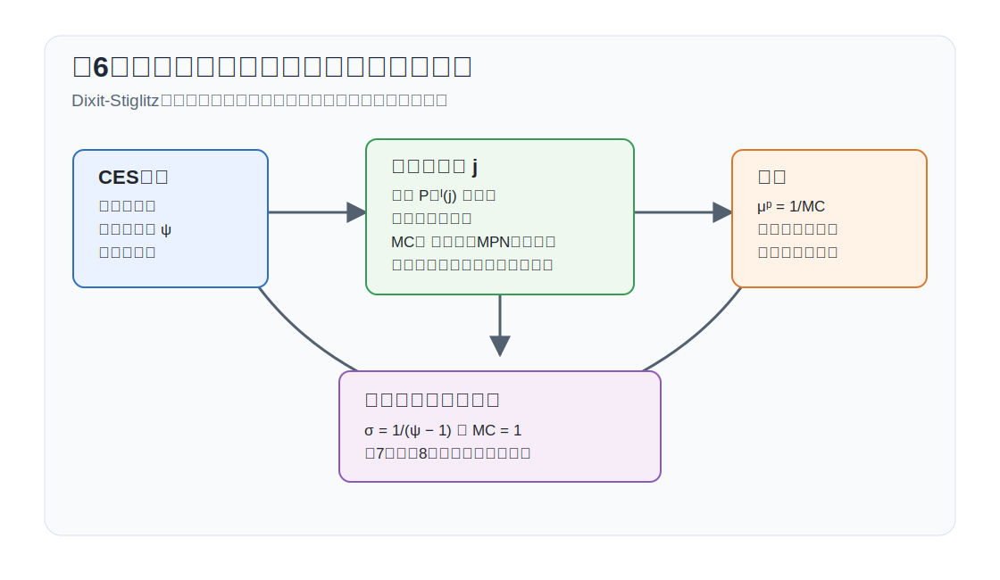

# 講義の目的

この回では、資本なし RBCモデルに独占的競争を導入します。第8回の RANKモデルに進むためには、価格硬直性の前に、なぜ企業が価格を選べるのかを理解する必要があります。その役割を担うのが Dixit--Stiglitz 型の中間財市場です。

元の第6回スライドでは資本を含むモデルが使われていましたが、このノートでは資本を導入しません。したがって、労働が唯一の生産要素であり、企業の限界費用は労働の限界生産物と実質賃金から決まります。

この回のポイントは次の4点です。

1. Dixit--Stiglitz 型の最終財集計から中間財需要を導く。
2. CES 集計の代替弾力性が市場支配力を決めることを確認する。
3. 中間財企業の価格設定からマークアップを導く。
4. 適切な補助金があると、独占的競争の定常状態歪みを取り除けることを確認する。

{#fig-lecture06-overview width=95%}

# 表記

大文字は水準、小文字は定常状態からの対数乖離を表します。第6回では価格が柔軟なので、実質限界費用 $MC_t$ は定常状態では一定ですが、第7回以降では変動する中心変数になります。

主な水準変数は次の通りです。

| 記号 | 意味 |
|---|---|
| $C_t$ | 消費 |
| $N_t$ | 労働投入 |
| $Y_t$ | 最終財産出 |
| $Y_t^M(j)$ | 中間財企業 $j$ の産出 |
| $N_t(j)$ | 中間財企業 $j$ の労働投入 |
| $W_t$ | 実質賃金 |
| $MC_t$ | 中間財企業の実質限界費用 |
| $MC_t^F$ | 最終財企業の実質限界費用 |
| $P_t$ | 最終財価格 |
| $P_t^M(j)$ | 中間財企業 $j$ の価格 |
| $D_t^F$ | 最終財企業の利潤 |
| $D_t$ | 中間財企業の配当 |
| $TX_t^M(j)$ | 中間財企業 $j$ への一括税 |
| $TX_t^M$ | 一括税の集計額 |
| $a_t$ | 対数技術水準（技術水準は $\exp(a_t)$） |
| $C,N,Y,W,MC$ | 対応する定常状態の水準 |

主な基礎パラメータは次の通りです。

| 記号 | 意味 |
|---|---|
| $\beta$ | 主観的割引因子 |
| $\gamma$ | 異時点間代替弾力性の逆数 |
| $\varphi$ | フリッシュ弾力性の逆数 |
| $0\leq\alpha<1$ | 生産関数の収穫逓減を表すパラメータ |
| $\rho$ | CES 関数の曲率パラメータ |
| $\theta,\theta_n$ | CES 集計のウェイト |
| $\psi$ | 投入または中間財の代替弾力性 |
| $\tau_p$ | 売上比例補助金率 |

本文中で使用する派生パラメータおよび変数は次の通りです。

| 記号 | 定義 | 意味 |
|---|---|---|
| $Q_{t,t+1}$ | $\beta U_{C,t+1}/U_{C,t}$ | 確率的割引因子（SDF） |
| $MRTS(X_1,X_2)$ | $F_{X_1}/F_{X_2}$ | 投入間の限界技術代替率 |
| $\mu^p$ | $1/MC_t=\psi/(\psi-1)$ | 価格と限界費用の比で測ったマークアップ |
| $MC$ | $1-1/\psi$、補助金ありでは $(1+\tau_p)(1-1/\psi)$ | 実質限界費用の定常値 |
| $\Theta_N$ | $\varphi+\alpha+\gamma(1-\alpha)$ | 定常状態と対数線形解で使う実物側の分母 |

# Dixit--Stiglitz 型の最終財企業

独占的競争モデルでは、多数の中間財を Dixit--Stiglitz 型の CES 集計でひとつの最終財に変換します。この集計式から、中間財ごとの需要曲線と価格指数が決まります。資本なしモデルの主線では、資本 $K$ を生産要素として導入せず、労働だけで中間財を生産します。

この節ではまず最終財企業の問題から始めます。CES の代替弾力性そのものの直観は、節末の補足で確認します。

## 最終財企業

最終財企業は完全競争的で、中間財 $Y_t^M(j)$ を集計して最終財 $Y_t$ を生産します。
$$
Y_t=
\left[
\int_0^1 Y_t^M(j)^{\frac{\psi-1}{\psi}}dj
\right]^{\frac{\psi}{\psi-1}},
\qquad
\psi>1
$$
ここで $\psi$ は中間財間の代替弾力性です。$\psi$ が大きいほど、各中間財は互いに代替しやすく、個別企業の市場支配力は小さくなります。

最終財企業の実質利潤は
$$
D_t^F=Y_t-\int_0^1\frac{P_t^M(j)}{P_t}Y_t^M(j)dj
$$
です。生産制約にかかるラグランジュ乗数を $MC_t^F$ とすると、最終財企業のラグランジュ関数は
$$
\begin{aligned}
\mathcal{L}_t^F
&=
Y_t-\int_0^1\frac{P_t^M(j)}{P_t}Y_t^M(j)dj\\
&\quad
+MC_t^F
\left[
\left(
\int_0^1Y_t^M(j)^{\frac{\psi-1}{\psi}}dj
\right)^{\frac{\psi}{\psi-1}}
-Y_t
\right].
\end{aligned}
$$
$Y_t$ に関する一階条件は
$$
1-MC_t^F=0
$$
なので、
$$
MC_t^F=1
$$
です。これは、最終財を1単位追加で生産する実質限界費用が1であることを意味します。利潤を最終財価格 $P_t$ で実質化しているため、名目限界費用は最終財価格 $P_t$ と等しくなります。

中間財投入 $Y_t^M(j)$ に関する一階条件は
$$
\frac{P_t^M(j)}{P_t}
=
MC_t^F
Y_t^M(j)^{-1/\psi}
\left[
\int_0^1Y_t^M(i)^{\frac{\psi-1}{\psi}}di
\right]^{\frac{1}{\psi-1}}.
$$
$MC_t^F=1$ と CES 集計式を使うと、
$$
\frac{P_t^M(j)}{P_t}
=
Y_t^M(j)^{-1/\psi}Y_t^{1/\psi}.
$$
したがって
$$
\left(\frac{P_t^M(j)}{P_t}\right)^\psi
=
\frac{Y_t}{Y_t^M(j)}
$$
であり、中間財需要は
$$
Y_t^M(j)=Y_t\left(\frac{P_t^M(j)}{P_t}\right)^{-\psi}
$$
です。中間財需要の価格弾力性は、CES の代替弾力性 $\psi$ と一致し、すべての中間財に共通です。この需要式を CES 集計式に戻すと、
$$
\begin{aligned}
Y_t
&=
\left[
\int_0^1
\left\{
Y_t\left(\frac{P_t^M(j)}{P_t}\right)^{-\psi}
\right\}^{\frac{\psi-1}{\psi}}dj
\right]^{\frac{\psi}{\psi-1}}\\
&=
Y_t
\left[
\int_0^1
\left(\frac{P_t^M(j)}{P_t}\right)^{1-\psi}dj
\right]^{\frac{\psi}{\psi-1}}.
\end{aligned}
$$
したがって $Y_t>0$ なら、
$$
\int_0^1\left(\frac{P_t^M(j)}{P_t}\right)^{1-\psi}dj=1.
$$
これを $P_t$ について整理すると、
$$
\begin{aligned}
P_t^{1-\psi}
&=\int_0^1 P_t^M(j)^{1-\psi}dj,\\
P_t
&=
\left[
\int_0^1 P_t^M(j)^{1-\psi}dj
\right]^{\frac{1}{1-\psi}}.
\end{aligned}
$$
つまり、最終財の価格は中間財価格によって構成されます。また、この条件を使うと、最終財企業の利潤がゼロになることも確認できます。実際、
$$
\begin{aligned}
D_t^F
&=
Y_t-\int_0^1\frac{P_t^M(j)}{P_t}Y_t^M(j)dj\\
&=
Y_t-\int_0^1\frac{P_t^M(j)}{P_t}
Y_t\left(\frac{P_t^M(j)}{P_t}\right)^{-\psi}dj\\
&=
Y_t\left[
1-\int_0^1\left(\frac{P_t^M(j)}{P_t}\right)^{1-\psi}dj
\right]\\
&=0.
\end{aligned}
$$
したがって、価格指数の定義により、最終財企業の利潤は均衡でゼロになります。

::: {.callout-note}
## 補足：2投入CESで見る代替弾力性

2つの一般的な投入 $X_1$ と $X_2$ を使う CES 関数を
$$
F(X_1,X_2)=\left[\theta X_1^\rho+(1-\theta)X_2^\rho\right]^{1/\rho},
\qquad
\theta\in(0,1),\quad \rho\leq 1
$$
と書くと、限界技術代替率は
$$
MRTS(X_1,X_2)
=
\frac{\theta}{1-\theta}\left(\frac{X_1}{X_2}\right)^{\rho-1}
$$
です。代替弾力性は
$$
\psi=\frac{1}{1-\rho}
$$
であり、$\psi$ が大きいほど投入同士は代替しやすくなります。第6回の主線では、この同じ CES の考え方を中間財の連続集合に適用します。ここでの $X_1$ と $X_2$ は代替弾力性を説明するための一般的な投入記号であり、この回の資本なしモデルに別の生産要素を導入するという意味ではありません。
:::

# 中間財企業とマークアップ

中間財企業 $j$ は独占的競争企業で、自社価格 $P_t^M(j)$ を選びます。第3回では企業価値を将来配当の割引現在価値として書きましたが、この回では価格を毎期自由に調整でき、価格調整費用もありません。したがって、今期の価格・生産選択は将来の制約や配当に直接影響せず、企業価値最大化は各期の配当最大化に分解されます。第7回で価格調整費用を導入すると、今期の価格選択が将来にも影響するため、企業問題は再び動学的になります。

この講義では資本を導入しないので、中間財企業は労働 $N_t(j)$ だけを使って生産します。
$$
Y_t^M(j)=\exp(a_t)F(N_t(j)).
$$
中間財需要
$$
Y_t^M(j)=Y_t\left(\frac{P_t^M(j)}{P_t}\right)^{-\psi}
$$
を収入項に代入すると、中間財企業の実質利潤最大化問題は次のラグランジュ関数で書けます。
$$
\begin{aligned}
\mathcal{L}_t
&=
Y_t\left(\frac{P_t^M(j)}{P_t}\right)^{1-\psi}
-W_tN_t(j)\\
&\quad
+MC_t(j)
\left[
\exp(a_t)F(N_t(j))
-Y_t\left(\frac{P_t^M(j)}{P_t}\right)^{-\psi}
\right].
\end{aligned}
$$
ここで $MC_t(j)$ は生産制約にかかるラグランジュ乗数です。生産制約を1単位きつくすると実質利潤が $MC_t(j)$ だけ下がるので、この乗数は中間財を1単位追加で生産する実質限界費用を表します。

労働に関する一階条件は
$$
MC_t(j)\exp(a_t)F_N(N_t(j))-W_t=0.
$$
また、$MC_t(j)$ に関する一階条件は生産制約
$$
\exp(a_t)F(N_t(j))
=Y_t\left(\frac{P_t^M(j)}{P_t}\right)^{-\psi}
$$
です。
価格に関する一階条件は
$$
(1-\psi)\frac{Y_t}{P_t}
\left(\frac{P_t^M(j)}{P_t}\right)^{-\psi}
+\psi MC_t(j)\frac{Y_t}{P_t}
\left(\frac{P_t^M(j)}{P_t}\right)^{-\psi-1}
=0
$$
です。共通項 $\frac{Y_t}{P_t}\left(P_t^M(j)/P_t\right)^{-\psi-1}>0$ で割ると、
$$
(1-\psi)\frac{P_t^M(j)}{P_t}+\psi MC_t(j)=0
$$
となるため、
$$
\frac{P_t^M(j)}{P_t}
=
\frac{\psi}{\psi-1}MC_t(j)
$$
です。対称均衡では $P_t^M(j)=P_t$、$Y_t^M(j)=Y_t$、$N_t(j)=N_t$ なので
$$
\begin{aligned}
W_t&=MC_t\exp(a_t)F_N(N_t),\\
MC_t&=1-\frac{1}{\psi},\\
Y_t&=\exp(a_t)F(N_t).
\end{aligned}
$$
価格と限界費用の比であるマークアップ率は
$$
\mu^p\equiv \frac{1}{MC_t}=\frac{\psi}{\psi-1}
$$
です。$\psi\to\infty$ のとき $\mu^p\to 1$ となり、完全競争市場に近づきます。

## 配当と市場支配力

対称均衡における中間財企業の配当は
$$
D_t=Y_t-W_tN_t
$$
です。生産関数が $Y_t=\exp(a_t)N_t^{1-\alpha}$ の場合、労働の限界生産物は $(1-\alpha)Y_t/N_t$ です。したがって
$$
W_tN_t=(1-\alpha)MC_tY_t
$$
となり、
$$
D_t=\left[1-(1-\alpha)MC_t\right]Y_t
$$
です。$\alpha=0$ の線形生産 $Y_t=\exp(a_t)N_t$ を考えると
$$
D_t=(1-MC_t)Y_t=\frac{1}{\psi}Y_t
$$
です。これは、中間財企業が価格を限界費用より高く設定できるために発生する独占利潤です。

# 家計と均衡

家計の一階条件は第4回と同じです。
$$
\begin{aligned}
W_t&=-\frac{U_{N,t}}{U_{C,t}},\\
1&=\mathbb{E}_t\left[Q_{t,t+1}\frac{R_t^N}{\Pi_{t+1}}\right],\\
V_t&=\mathbb{E}_t\left[Q_{t,t+1}(V_{t+1}+D_{t+1})\right].
\end{aligned}
$$
財市場均衡は、政府支出と価格調整費用がないこの回では
$$
Y_t=C_t
$$
です。したがって、独占的競争を含む資本なしモデルは
$$
\begin{aligned}
W_t&=-\frac{U_{N,t}}{U_{C,t}},\\
W_t&=MC_t\exp(a_t)F_N(N_t),\\
MC_t&=1-\frac{1}{\psi},\\
Y_t&=\exp(a_t)F(N_t),\\
Y_t&=C_t.
\end{aligned}
$$
とまとめられます。

完全競争モデルとの違いは、企業の労働需要が
$$
W_t=\exp(a_t)F_N(N_t)
$$
ではなく
$$
W_t=\left(1-\frac{1}{\psi}\right)\exp(a_t)F_N(N_t)
$$
になる点です。独占的競争では、企業は限界費用より高い価格を設定するため、実質限界費用は1未満になり、労働需要と産出は完全競争の場合より低くなります。

# 定常状態

定常状態を明示します。技術の定常状態を $a=0$、つまり技術水準を $\exp(a)=1$ と正規化し、実質限界費用の定常値を $MC$ と書きます。補助金がない場合は
$$
MC=1-\frac{1}{\psi}
$$
です。後で導入する売上比例補助金 $\tau_p$ がある場合は
$$
MC=(1+\tau_p)\left(1-\frac{1}{\psi}\right)
$$
です。

効用関数と生産関数を
$$
U(C,N)=\frac{C^{1-\gamma}}{1-\gamma}
-\frac{N^{1+\varphi}}{1+\varphi},
\qquad
Y=N^{1-\alpha}
$$
とします。定常状態では $C=Y$、家計の労働供給条件は
$$
W=N^\varphi C^\gamma
$$
であり、企業の労働需要条件は
$$
W=MC(1-\alpha)N^{-\alpha}
$$
です。したがって
$$
N^\varphi(N^{1-\alpha})^\gamma
=
MC(1-\alpha)N^{-\alpha}
$$
を満たします。第4回と同じく
$$
\Theta_N\equiv \varphi+\alpha+\gamma(1-\alpha)
$$
とおくと、定常状態は解析的に
$$
\begin{aligned}
N^{MC}
&=
\left[MC(1-\alpha)\right]^{1/\Theta_N},\\
Y^{MC}
&=(N^{MC})^{1-\alpha},\\
C^{MC}
&=Y^{MC},\\
W^{MC}
&=MC(1-\alpha)(N^{MC})^{-\alpha}.
\end{aligned}
$$

第4回の完全競争定常状態は $MC=1$ のケースです。これを上付き $0$ で表すと、
$$
N^0=
(1-\alpha)^{1/\Theta_N},
\qquad
Y^0=C^0=(N^0)^{1-\alpha},
\qquad
W^0=(1-\alpha)(N^0)^{-\alpha}
$$
です。したがって、独占的競争の定常状態は第4回と比べて
$$
\begin{aligned}
\frac{N^{MC}}{N^0}
&=MC^{1/\Theta_N},\\
\frac{Y^{MC}}{Y^0}
&=MC^{(1-\alpha)/\Theta_N},\\
\frac{C^{MC}}{C^0}
&=MC^{(1-\alpha)/\Theta_N},\\
\frac{W^{MC}}{W^0}
&=MC^{1-\alpha/\Theta_N}.
\end{aligned}
$$
補助金がなければ $MC=1-1/\psi<1$ なので、労働、産出、消費、実質賃金はいずれも第4回の完全競争定常状態より低くなります。これは、マークアップが労働需要を下げるためです。

配当も定常状態で書けます。補助金を一括税でファイナンスした後の対称均衡では
$$
D^{MC}=Y^{MC}-W^{MC}N^{MC}
=\left[1-(1-\alpha)MC\right]Y^{MC}
$$
です。$\alpha=0$ の線形生産なら、補助金なしでは
$$
D^{MC}=\frac{1}{\psi}Y^{MC}
$$
となり、配当は純粋にマークアップから生じます。$\alpha>0$ の場合には、労働以外の固定要素に帰属するレントも配当に含まれます。

売上比例補助金を
$$
\tau_p=\frac{1}{\psi-1}
$$
に設定すると、$MC=1$ となります。このとき上の式はすべて第4回の完全競争定常状態に戻ります。つまり、補助金は資源制約を変えるのではなく、定常状態のマークアップによるくさびを取り除きます。

## 第8回への橋渡し

この正規化は、第8回の一般形でも使います。第8回では、ここでの $MC$ に加えて、政府支出比率 $G_Y$ と一般の $\alpha$ を残します。その場合も考え方は同じで、資源制約は $C=(1-G_Y)Y$、労働供給と労働需要は
$$
W=C^\gamma N^\varphi,
\qquad
W=(1-\alpha)MC\frac{Y}{N}
$$
で決まります。補助金で $MC=1$ と置けば、定常状態のマークアップ歪みを取り除いたうえで、政府支出と収穫逓減が定常状態をどう動かすかだけを第8回で扱えます。詳しい導出は、第8回の RANKモデルの一般形で確認します。

# 政府による再配分

第5回では、一括税や一括移転は家計の限界条件に入らない一方、労働所得税や消費税のような比例税は限界条件にくさびを作ることを確認しました。ここでも同じ区別を使います。政府は中間財企業の売上に比例補助金 $\tau_p$ を与え、その財源を集計一括税 $TX_t^M$ で調達します。

独占的競争は定常状態の歪みを生みます。比例補助金はこの歪みを直接動かす政策です。中間財企業の配当は
$$
D_t(j)=(1+\tau_p)\frac{P_t^M(j)}{P_t}Y_t^M(j)-W_tN_t(j)-TX_t^M(j)
$$
です。ここで $TX_t^M(j)$ は企業 $j$ に課される一括税です。一括税は企業の価格設定条件に入らない一方、売上比例補助金は限界収入を変えます。価格に関する一階条件は
$$
(1+\tau_p)(1-\psi)\frac{Y_t}{P_t}
\left(\frac{P_t^M(j)}{P_t}\right)^{-\psi}
+\psi MC_t(j)\frac{Y_t}{P_t}
\left(\frac{P_t^M(j)}{P_t}\right)^{-\psi-1}
=0
$$
です。共通項で割ると
$$
(1+\tau_p)(1-\psi)\frac{P_t^M(j)}{P_t}
+\psi MC_t(j)=0
$$
なので、
$$
\frac{P_t^M(j)}{P_t}
=
\frac{\psi}{(1+\tau_p)(\psi-1)}MC_t(j)
$$
です。対称均衡では $P_t^M(j)=P_t$ なので、限界費用は
$$
MC_t=(1+\tau_p)\left(1-\frac{1}{\psi}\right)
$$
となります。補助金を
$$
\tau_p=\frac{1}{\psi-1}
$$
に設定すると
$$
MC_t=1
$$
です。この場合、実質賃金条件は完全競争モデルと同じ
$$
W_t=\exp(a_t)F_N(N_t)
$$
になります。

補助金は一括税でファイナンスします。連続企業の測度は1なので、対称均衡では集計一括税を
$$
TX_t^M=\tau_p Y_t
$$
と書けます。これは政府購入ではなく、企業への補助金と一括税を組み合わせた再配分です。したがって財市場の資源制約は $Y_t=C_t$ のままです。一括税 $TX_t^M(j)$ は価格設定の限界条件に影響しませんが、売上比例補助金 $\tau_p$ は企業の価格設定条件に入ります。そのため、上の政策は資源を政府が吸収するのではなく、独占的競争のマークアップ歪みだけを相殺します。第8回でも同じ考え方で、定常状態のマークアップ歪みを除いたうえで価格硬直性の効果を分析します。

# 対数線形近似

定常状態の節と同じく、効用関数と生産関数を
$$
U(C_t,N_t)=\frac{C_t^{1-\gamma}}{1-\gamma}
-\frac{N_t^{1+\varphi}}{1+\varphi},
\qquad
Y_t=\exp(a_t)N_t^{1-\alpha}
$$
とします。補助金がなく、定常状態の $MC=1-1/\psi$ が一定であれば、$mc_t=0$ です。対数線形化した体系は
$$
\begin{aligned}
y_t&=a_t+(1-\alpha)n_t,\\
c_t&=y_t,\\
w_t&=mc_t+a_t-\alpha n_t,\\
mc_t&=0,\\
w_t&=\gamma c_t+\varphi n_t.
\end{aligned}
$$
したがって、短期の変動については第4回と同じ形の解になります。独占的競争だけでは、定常状態の水準を歪ませますが、マークアップが一定で価格が柔軟なら、ショックへの線形反応は完全競争モデルと同じです。

一方、補助金で $MC=1$ にすれば、定常状態の歪みも取り除けます。この点が第7回以降で重要になります。価格硬直性を導入したとき、$MC_t$ は一定ではなくなり、インフレと実体経済を結ぶ中心変数になります。

# まとめと第7回への接続

この回では、Dixit--Stiglitz 型の最終財集計から中間財需要と価格指数を導きました。最終財企業のラグランジュ乗数は $MC_t^F=1$ であり、価格指数の定義により最終財企業の利潤はゼロになります。

中間財企業は需要曲線に直面して価格を選ぶため、価格を限界費用より高く設定します。対称均衡では
$$
MC_t=1-\frac{1}{\psi},
\qquad
\mu^p=\frac{1}{MC_t}=\frac{\psi}{\psi-1}
$$
となり、$\psi$ が大きいほどマークアップは小さくなります。このマークアップは労働需要を下げるので、補助金がなければ定常状態の労働、産出、消費は完全競争の場合より低くなります。

売上比例補助金を $\tau_p=1/(\psi-1)$ に設定すると、定常状態で $MC=1$ となり、独占的競争によるマークアップ歪みを取り除けます。この補助金は一括税でファイナンスされる再配分なので、政府購入のように資源制約を変えるものではありません。

この回では、企業は毎期自由に価格を調整できました。そのため、需要が変わっても企業は価格を即座に動かし、実質限界費用を望ましい水準に保てます。第7回では、価格調整に費用がかかる Rotemberg 型価格硬直性を導入します。すると $MC_t$ が一定ではなくなり、インフレ率と実質限界費用の間に動学的フィリップス曲線が生まれます。

# 参考文献

**必読**

- Dixit, Avinash K., and Joseph E. Stiglitz (1977) "Monopolistic Competition and Optimum Product Diversity." *American Economic Review*, 67(3), 297-308. CES集計と独占的競争の基本文献。
- Blanchard, Olivier J., and Nobuhiro Kiyotaki (1987) "Monopolistic Competition and the Effects of Aggregate Demand." *American Economic Review*, 77(4), 647-666. マークアップと総需要の関係を理解するため。
- Galí, Jordi (2015) *Monetary Policy, Inflation, and the Business Cycle* (2nd ed.). Princeton University Press. 独占的競争を価格硬直性へつなぐ標準的教科書。

**発展**

- Spence, Michael (1976) "Product Selection, Fixed Costs, and Monopolistic Competition." *Review of Economic Studies*, 43(2), 217-235.
- Rotemberg, Julio J., and Michael Woodford (1997) "An Optimization-Based Econometric Framework for the Evaluation of Monetary Policy." *NBER Macroeconomics Annual*, 12, 297-346.
- Woodford, Michael (2003) *Interest and Prices: Foundations of a Theory of Monetary Policy*. Princeton University Press. 独占的競争と歪みの厚生分析を深く学ぶため。

# 演習問題

**問1：概念確認**

Dixit--Stiglitz 型の最終財集計で、代替弾力性 $\psi$ が大きいほど中間財企業の市場支配力が小さくなる理由を説明しなさい。

**問2：導出確認**

最終財企業の CES 集計式から、中間財需要
$$
Y_t^M(j)=Y_t\left(\frac{P_t^M(j)}{P_t}\right)^{-\psi}
$$
を導出しなさい。

**問3：直観確認**

中間財企業のラグランジュ関数から、価格設定条件
$$
\frac{P_t^M(j)}{P_t}
=
\frac{\psi}{\psi-1}MC_t(j)
$$
を導出しなさい。また、対称均衡で $MC_t=1-1/\psi$ となることを確認しなさい。

**問4：政策確認**

補助金がない独占的競争の定常状態では、なぜ労働、産出、消費が完全競争の場合より低くなるのか説明しなさい。売上比例補助金がこの歪みをどう相殺するかも述べなさい。
