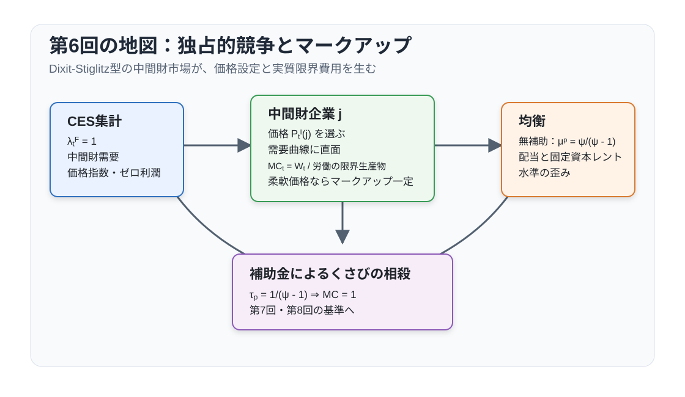

# 講義の目的

## 本講義で探究する中心的な問い

本講義では、第5回までに構築してきた固定資本（$\bar{K}=1$）・資本蓄積なしの柔軟価格モデルに「**独占的競争（Monopolistic Competition）**」の市場構造を導入します。

第7回以降で現代マクロ経済学（New Keynesianモデル）の中核である「**名目価格の硬直性（Nominal Price Rigidity）**」を本格的に分析する前段階として、本講義ではまず、「**各企業が製品差別化を通じて自社製品に対する右下がりの個別需要曲線に直面し、市場支配力（価格設定力）を持つミクロ的メカニズム**」をしっかりと理解します。その理論的基盤を提供するのが、Dixit and Stiglitz (1977) による**CES（Constant Elasticity of Substitution: 代替弾力性一定）集計**の枠組みです。

独占的競争のもとでは、各企業は価格を限界費用以上に設定するため、市場には「**価格マークアップのくさび（Markup Wedge）**」が生じます。このくさびは、経済全体の産出量、労働投入量、民間消費を完全競争の効率的水準から恒常的に押し下げるという「**市場の失敗（市場の歪み）**」を引き起こします。本講義では、第5回で学んだ税・財政政策を応用し、政府が中間財企業に**売上比例補助金**を支給し、その財源を一括税で賄うことで、マークアップのくさびを完全に相殺して完全競争配分を復元できることを論理的に確認します。

本講義の具体的な到達目標は、以下の4点です。

1. **Dixit--Stiglitz 型の最終財集計の理解**：完全競争的な最終財企業の利潤最大化問題から、個別中間財への右下がりの需要関数および集計価格指数を導出できるようになる。
2. **代替弾力性と市場支配力の関係の把握**：CES 集計における代替弾力性 $\psi$ が個別中間財の需要弾力性を決定し、それが企業の価格設定力（マークアップ）を規定するメカニズムを説明できるようになる。
3. **中間財企業の最適価格設定の導出**：中間財企業の静学的利潤最大化問題から実質限界費用 $MC_t$ とグロス・マークアップ $\mu^p$ を導出し、対称均衡における配当の分配構造を理解する。
4. **売上比例補助金によるくさびの相殺**：適切な売上比例補助金と一括税の組み合わせによってマークアップの歪みを相殺し、資源制約式 $Y_t = C_t$ を保ったまま完全競争配分を達成できる論理を理解する。

@fig-lecture06-overview は、CES 集計による中間財需要の形成から、中間財企業の価格設定、マークアップによる歪み、そして売上比例補助金によるくさびの相殺に至る本講義全体の理論的展開を一枚で整理したものです。

{#fig-lecture06-overview width=88% fig-pos="H"}

本講義でも、固定資本 $\bar{K}=1$ は各中間財企業が物理的に保有しますが、投資による資本蓄積は行われず、労働のみが可変投入として選択されます。この枠組みにより、実物側の基本的な論理構造を維持したまま、「中間財需要」「独占的価格設定」「マークアップ」という新しい概念の学習に集中することができます。なお、第7回では線形生産技術（$\alpha=0$）へと単純化して価格硬直性と金融政策を導入し、第8回において固定資本（$\alpha>0$）と政府支出を統合した一般的なNew Keynesianモデルへと拡張します。

```{=latex}
\Needspace{0.18\textheight}
```

# 表記と基本設定

本講義ノートでは、慣例に従い、変数の**水準値を大文字**で、定常状態からの**対数偏差（Log-deviation）を小文字**で表記します。本講義で扱う柔軟価格・対称均衡のもとでは、代替弾力性 $\psi$ および補助率 $\tau_p$ が時間を通じて一定である限り、実質限界費用は毎期一定（$MC_t = MC$）に保たれます。なお、第7回以降の価格硬直性モデルでは、この実質限界費用が景気循環とともに変動し、インフレ率を駆動する最も中核的な変数となります。

本ノートで使用する主要な水準変数の記号一覧は以下の通りです。

| 記号 | 経済学的意味 | 記号 | 経済学的意味 |
|---|---|---|---|
| $C_t$ | 民間実質消費水準 | $N_t$ | 経済全体の総労働投入量 |
| $Y_t$ | 最終財の総産出水準（実質GDP） | $Y_t^I(j)$ | 中間財企業 $j$ の生産量（中間財産出量） |
| $N_t(j)$ | 中間財企業 $j$ の労働投入量 | $\bar{K}(j)=1$ | 中間財企業 $j$ が保有する固定資本ストック（$1$ に正規化） |
| $W_t$ | 市場の実質賃金率 | $MC_t$ | 中間財企業の実質限界費用（消費財単位） |
| $\lambda_t^F$ | 最終財集計制約にかかるラグランジュ乗数（影の価値） | $P_t$ | 最終財の集計価格水準（一般物価水準） |
| $P_t^I(j)$ | 中間財企業 $j$ の販売価格 | $D_t^F$ | 最終財企業の実質利潤（均衡ではゼロ） |
| $D_t(j)$ | 中間財企業 $j$ が支払う実質配当（実質利潤） | $D_t$ | 中間財企業群の集計実質配当 |
| $TX_t^I(j)$ | 中間財企業 $j$ に課される実質一括税 | $TX_t^I$ | 政府が徴収する実質一括税の集計総額 |
| $a_t$ | 全要素生産性（技術水準の対数値） | $C, N, Y, W, MC$ | 対応する各変数の確定的定常状態における水準値 |

また、経済の構造を規定する基礎パラメータは以下の通りです。

| 記号 | 定義・経済学的意味 |
|---|---|
| $\gamma > 0$ | 相対的リスク回避度（異時点間消費代替弾力性の逆数）。同弾力性は $1/\gamma$ |
| $\varphi > 0$ | 労働の限界不効用パラメータ（Frisch労働供給弾力性の逆数）。同弾力性は $1/\varphi$ |
| $\nu = 1$ | 労働不効用の尺度パラメータ（計算の簡素化のため $1$ に正規化） |
| $0 \leq \alpha < 1$ | Cobb-Douglas生産関数における固定資本の分配率（資本シェア） |
| $\rho$ | 一般的なCES関数における曲率パラメータ |
| $\theta$ | 2投入CES集計におけるシェア・ウェイトパラメータ |
| $\psi > 1$ | 中間財バラエティ間の代替弾力性（需要の価格弾力性） |
| $\tau_p$ | 政府が中間財企業に支給する売上比例補助金率（政策パラメータ） |

さらに、本講義の展開において頻出する派生パラメータおよび変数は以下の通りです。

| 記号 | 定義式 | 経済学的意味 |
|---|---|---|
| $MRTS(X_1, X_2)$ | $F_{X_1}/F_{X_2}$ | 投入要素間の技術的限界代替率 |
| $\mu^p$ | $\psi/(\psi-1) > 1$ | 中間財需要の弾力性が決定する構造的グロス・マークアップ |
| $MC$ | $(1+\tau_p)/\mu^p$ | 柔軟価格・対称均衡における定常的な実質限界費用 |
| $\Theta_N$ | $\varphi+\alpha+\gamma(1-\alpha)$ | 定常状態解および対数線形解に共通して現れる実物側の分母定数 |

# Dixit--Stiglitz 型の最終財集計

独占的競争モデルの出発点となるのは、多数の差別化された中間財をひとつの均質な最終財へと束ねる「**Dixit--Stiglitz 型の CES 集計**」です。もし財が完全に同質であれば、市場価格よりわずかでも高い価格をつけた企業はすべての顧客を失ってしまいます（完全競争市場）。しかし、製品が差別化されていれば財同士の代替性は有限にとどまるため、企業が自社の販売価格を引き上げても需要は緩やかに減少するだけでゼロにはならず、各企業は**右下がりの個別需要曲線**に直面することになります。この個別需要関数とマクロの集計価格指数は、最終財企業の最適化行動から同時に導出されます。

## 最終財企業

経済には、連続体 $[0, 1]$ 上に分布する無数の差別化された中間財 $Y_t^I(j)$（$j \in [0, 1]$）が存在します。最終財部門には無数の完全競争的な企業が存在し、これらの中間財を原材料として購入し、以下の**CES生産関数（Dixit--Stiglitz 集計関数）**を用いて均質な最終財 $Y_t$ を生産・販売します。
$$
Y_t = \left[ \int_0^1 Y_t^I(j)^{\frac{\psi-1}{\psi}} dj \right]^{\frac{\psi}{\psi-1}}, \qquad \psi > 1.
$$
ここでパラメータ $\psi$ は**中間財間の代替弾力性**を表します。$\psi$ が大きいほど各中間財同士は互いに近い代替財となり、個別企業の差別化の余地（市場支配力）は小さくなります。逆に $\psi$ が $1$ に近づくほど製品の独自性が強まり、企業の価格設定力は強大になります。

最終財の市場価格を $P_t$、中間財 $j$ の購入価格を $P_t^I(j)$ とすると、プライス・テイカーである最終財企業の実質利潤 $D_t^F$ は、最終財単位で評価して次のように定義されます。
$$
D_t^F = Y_t - \int_0^1 \frac{P_t^I(j)}{P_t} Y_t^I(j) dj.
$$
生産制約（集計関数）にかかるラグランジュ乗数を $\lambda_t^F$ とおくと、最終財企業の利潤最大化問題のラグランジュ関数は次のように記述されます。
$$
\mathcal{L}_t^F = Y_t - \int_0^1 \frac{P_t^I(j)}{P_t} Y_t^I(j) dj + \lambda_t^F \left[ \left( \int_0^1 Y_t^I(j)^{\frac{\psi-1}{\psi}} dj \right)^{\frac{\psi}{\psi-1}} - Y_t \right].
$$
最終財の産出量 $Y_t$ に関する一階条件は
$$
\frac{\partial \mathcal{L}_t^F}{\partial Y_t} = 1 - \lambda_t^F = 0 \implies \lambda_t^F = 1
$$
となります。最終財そのものを価値尺度（ニュメレール）としているため、集計制約の影の価値 $\lambda_t^F$ は常に $1$ となります。

次に、各中間財の投入量 $Y_t^I(j)$ に関する一階条件を求めると、
$$
\frac{\partial \mathcal{L}_t^F}{\partial Y_t^I(j)} = -\frac{P_t^I(j)}{P_t} + \lambda_t^F \left[ \int_0^1 Y_t^I(i)^{\frac{\psi-1}{\psi}} di \right]^{\frac{\psi}{\psi-1} - 1} Y_t^I(j)^{-\frac{1}{\psi}} = 0
$$
となります。$\lambda_t^F = 1$ を代入し、大括弧の部分が $Y_t^{1/\psi}$ に等しいことを利用すると、
$$
\frac{P_t^I(j)}{P_t} = Y_t^{\frac{1}{\psi}} Y_t^I(j)^{-\frac{1}{\psi}}
$$
が得られます。両辺を $-\psi$ 乗して整理すると、個別中間財 $j$ に対する**条件付き需要関数**が美しく導出されます。
$$
Y_t^I(j) = Y_t \left( \frac{P_t^I(j)}{P_t} \right)^{-\psi}.
$$
この需要関数から明らかなように、中間財 $j$ への需要量は、マクロ全体の総産出量（総需要）$Y_t$ に比例し、自社製品の相対価格 $P_t^I(j)/P_t$ に対して一定の弾力性 $\psi$ で右下がりに減少します。

この個別需要関数を元の CES 集計関数に代入すると、
$$
Y_t = \left[ \int_0^1 \left\{ Y_t \left( \frac{P_t^I(j)}{P_t} \right)^{-\psi} \right\}^{\frac{\psi-1}{\psi}} dj \right]^{\frac{\psi}{\psi-1}} = Y_t \left[ \int_0^1 \left( \frac{P_t^I(j)}{P_t} \right)^{1-\psi} dj \right]^{\frac{\psi}{\psi-1}}
$$
となります。経済が正の産出量（$Y_t > 0$）を持つとき、両辺を $Y_t$ で割ることで
$$
\int_0^1 \left( \frac{P_t^I(j)}{P_t} \right)^{1-\psi} dj = 1
$$
が成り立たなければなりません。この関係から、中間財価格の集約としての**最終財集計価格指数（Price Index）$P_t$** が一意に決定されます。
$$
P_t = \left[ \int_0^1 P_t^I(j)^{1-\psi} dj \right]^{\frac{1}{1-\psi}}.
$$
この価格指数の定義を用いると、最終財企業の均衡実質利潤 $D_t^F$ を直接計算することができます。
$$
D_t^F = Y_t - \int_0^1 \frac{P_t^I(j)}{P_t} Y_t \left( \frac{P_t^I(j)}{P_t} \right)^{-\psi} dj = Y_t \left[ 1 - \int_0^1 \left( \frac{P_t^I(j)}{P_t} \right)^{1-\psi} dj \right] = 0.
$$
このように、CES型集計関数が1次同次（規模に関して収穫一定）であり、完全競争のもとで価格指数が適切に定義されているため、最終財企業の実質利潤は常にゼロとなります。

::: {.callout-note}
## 2投入CESによる代替弾力性の確認

一般的な2つの生産要素（または財）$X_1, X_2$ を用いる対称的な CES 関数
$$
\begin{gathered}
F(X_1, X_2) = \left[ \theta X_1^\rho + (1-\theta) X_2^\rho \right]^{\frac{1}{\rho}},\\[4pt]
X_1, X_2 > 0, \quad 0 < \theta < 1, \quad \rho < 1, \quad \rho \neq 0
\end{gathered}
$$
を考えると、限界技術代替率（MRTS）および代替弾力性 $\sigma$ はそれぞれ以下のように計算されます。
$$
\begin{aligned}
MRTS(X_1, X_2) &\equiv \frac{F_{X_1}}{F_{X_2}}
 = \frac{\theta}{1-\theta} \left( \frac{X_1}{X_2} \right)^{\rho - 1},\\[6pt]
\sigma &\equiv -\frac{d\ln(X_1/X_2)}{d\ln MRTS}
 = \frac{1}{1-\rho}.
\end{aligned}
$$
曲率パラメータ $\rho$ が $0$ に近づく極限（$\rho \to 0$）では Cobb--Douglas 関数（$\sigma \to 1$）に一致し、$\rho \to 1$ の極限では完全代替（$\sigma \to \infty$）に一致します。

本講義の Dixit--Stiglitz 集計関数における代替弾力性 $\psi > 1$ は、この一般的な記法において $\rho = (\psi - 1)/\psi \in (0, 1)$ と置いた場合に相当し、その代替弾力性は $\sigma = 1/(1 - \frac{\psi-1}{\psi}) = \psi$ と厳密に一致します。
:::

# 中間財企業とマークアップ

各中間財 $j \in [0, 1]$ を生産する中間財企業 $j$ は、差別化された自社製品の販売価格 $P_t^I(j)$ を自ら決定する「**価格設定者（Price Setter: 独占的競争企業）**」です。

本講義では企業の価格改定に一切の障害や費用が存在しない「柔軟価格」の環境を想定しています。したがって、当期の価格選択が将来の制約や配当に影響を及ぼす通時的な状態変数は存在せず、企業の動学的価値最大化問題は、各期ごとの静学的な利潤最大化問題へと自然に分解されます。なお、次回の第7回で価格調整費用（Rotemberg費用）を導入すると、当期の価格改定が将来の利益にも影響を与えるため、企業問題は再び真に動学的なものとなります。

各中間財企業は固定資本 $\bar{K}(j) = 1$ を物理的に保有しており、毎期の労働投入量 $N_t(j)$ のみを可変投入として最適に選択します。生産関数は Cobb-Douglas 型です。
$$
\begin{aligned}
Y_t^I(j) &= \exp(a_t) F(\bar{K}(j), N_t(j))\\
&= \exp(a_t) \bar{K}(j)^\alpha N_t(j)^{1-\alpha}\\
&= \exp(a_t) N_t(j)^{1-\alpha}, \qquad \bar{K}(j)=1.
\end{aligned}
$$
固定資本の取引市場や投資は存在しないため、資本の生み出す収益（固定資本レント）は企業の利潤（配当）の一部として株主に帰属します。

中間財企業 $j$ は、最終財部門から提示される個別需要曲線 $Y_t^I(j) = Y_t (P_t^I(j)/P_t)^{-\psi}$ を所与として、自社製品の販売価格 $P_t^I(j)$ と労働投入量 $N_t(j)$ を決定します。生産制約（需要を満たすための生産技術制約）にかかる実質ラグランジュ乗数を $MC_t(j)$ とおくと、企業 $j$ の実質利潤最大化問題のラグランジュ関数は次式で与えられます。
$$
\begin{aligned}
\mathcal{L}_t(j)
&= \frac{P_t^I(j)}{P_t} Y_t \left( \frac{P_t^I(j)}{P_t} \right)^{-\psi}
 - W_t N_t(j)\\
&\quad + MC_t(j) \left[ \exp(a_t) N_t(j)^{1-\alpha}
 - Y_t \left( \frac{P_t^I(j)}{P_t} \right)^{-\psi} \right].
\end{aligned}
$$
ここでラグランジュ乗数 $MC_t(j)$ は、生産量を限界的に1単位増やすために必要な実質費用、すなわち**実質限界費用（Real Marginal Cost）**の経済学的意味を持っています。

まず、労働投入量 $N_t(j)$ に関する一階条件は
$$
\frac{\partial \mathcal{L}_t(j)}{\partial N_t(j)} = MC_t(j) \exp(a_t) (1-\alpha) N_t(j)^{-\alpha} - W_t = 0
$$
となり、実質賃金と限界生産力・限界費用の関係を規定します。
$$
W_t = MC_t(j) \exp(a_t) (1-\alpha) N_t(j)^{-\alpha} = MC_t(j) MPN_t(j).
$$
完全競争市場（$MC_t = 1$）とは異なり、実質賃金は労働の限界生産力そのものではなく、それに実質限界費用 $MC_t(j)$ を乗じたものと等しくなります。

次に、販売価格 $P_t^I(j)$ に関する一階条件を求めます。収入項を展開すると
$$
\frac{\partial \mathcal{L}_t(j)}{\partial P_t^I(j)} = (1-\psi) \frac{Y_t}{P_t} \left( \frac{P_t^I(j)}{P_t} \right)^{-\psi} + \psi MC_t(j) \frac{Y_t}{P_t} \left( \frac{P_t^I(j)}{P_t} \right)^{-\psi - 1} = 0.
$$
共通因数である $\frac{Y_t}{P_t} (P_t^I(j)/P_t)^{-\psi - 1} > 0$ で両辺を割ると、
$$
(1-\psi) \frac{P_t^I(j)}{P_t} + \psi MC_t(j) = 0
$$
が得られます。これを相対価格 $P_t^I(j)/P_t$ について解くことにより、独占的競争における**マークアップ価格設定ルール（Optimal Pricing Rule）**が導かれます。
$$
\frac{P_t^I(j)}{P_t} = \frac{\psi}{\psi-1} MC_t(j).
$$
ここで、中間財需要の価格弾力性 $\psi$ によって決定される**構造的グロス・マークアップ（Gross Markup）**を
$$
\mu^p \equiv \frac{\psi}{\psi-1} > 1
$$
と定義します。企業は自社製品の価格を、実質限界費用の $\mu^p$ 倍という高い水準に設定します。財の代替弾力性が無限大に近づく完全競争の極限（$\psi \to \infty$）では、マークアップは $\mu^p \to 1$ となり、価格が限界費用に一致する完全競争ルールに収束します。

すべての企業が同一の技術と需要に直面する**対称均衡（Symmetric Equilibrium）**では、全企業が同一の価格 $P_t^I(j) = P_t$ を設定し、同一の生産量 $Y_t^I(j) = Y_t$ および労働投入量 $N_t(j) = N_t$ を選択します。したがって、$P_t^I(j)/P_t = 1$ となり、対称均衡における実質限界費用 $MC_t$ は次のように一意に定まります。
$$
MC_t = \frac{1}{\mu^p} = \frac{\psi-1}{\psi} = 1 - \frac{1}{\psi} < 1.
$$
完全競争市場では実質限界費用が常に $1$（販売価格と限界費用の完全一致）であったのに対し、独占的競争のもとでは実質限界費用は $1$ より厳密に小さい値（$MC_t < 1$）となります。この $1$ と $MC_t$ の乖離こそが、独占力によって生み出される「**マークアップのくさび**」です。

## 配当と市場支配力

対称均衡における中間財企業群の集計実質配当（実質利潤総額）は、
$$
D_t \equiv \int_0^1 D_t(j) dj = Y_t - W_t N_t
$$
で与えられます。労働の一階条件より $W_t N_t = MC_t (1-\alpha) Y_t$ であるため、集計配当は以下のように美しく要因分解できます。
$$
D_t = \left[ 1 - (1-\alpha) MC_t \right] Y_t = \underbrace{(1 - MC_t) Y_t}_{\text{マークアップに由来する独占利潤}} + \underbrace{\alpha MC_t Y_t}_{\text{固定資本レント}}.
$$
第1項の $(1-MC_t)Y_t = (1/\psi)Y_t$ は、企業が価格を限界費用以上に設定できる市場支配力（独占力）から生じる「純粋な独占利潤」を表しています。第2項の $\alpha MC_t Y_t$ は、生産における固定資本 $\bar{K}=1$ の存在によって生じる「資本のレント」を表しています。

資本シェアが存在しない線形生産技術（$\alpha = 0$、すなわち $Y_t = \exp(a_t)N_t$）の特殊ケースを考えると、資本レントは消滅し、集計配当は純粋な独占利潤のみとなります。
$$
D_t = (1 - MC_t) Y_t = \frac{1}{\psi} Y_t.
$$
これは、中間財の差別化によって各企業が超過利潤を獲得していることを示しています。

# 売上比例補助金と政府会計

前節で確認した通り、独占的競争市場では企業が価格を限界費用以上に設定するため、労働需要が過少となり、社会的に最適な水準よりも産出量と雇用量が恒常的に押し下げられてしまいます。第5回で学んだ通り、比例税や補助金は限界的な意思決定に直接「くさび」を打ち込むことができます。そこで政府は、中間財企業に対して**売上比例補助金**を交付することで限界的な販売収入を実質的に引き上げ、マークアップのくさびを相殺する政策を実施します。

## 売上比例補助金のもとでの価格設定

政府が中間財企業の売上に対して比例補助率 $\tau_p \geq 0$ を適用し、その財源を企業に対する**一括税（Lump-sum Tax）$TX_t^I(j)$** で調達する枠組みを考えます。企業の参入・退出は存在せず、企業の総測度は $1$ に固定されています。

補助金と一括税を考慮した中間財企業 $j$ の実質配当は、次式で与えられます。
$$
D_t(j) = (1+\tau_p) \frac{P_t^I(j)}{P_t} Y_t^I(j) - W_t N_t(j) - TX_t^I(j).
$$
ここで決定的に重要な前提は、「**一括税 $TX_t^I(j)$ は企業 $j$ のいかなる選択変数（価格、生産量、雇用量）にも依存せず、外生的な所与の定数として課される**」という点です。すなわち、
$$
\frac{\partial TX_t^I(j)}{\partial P_t^I(j)} = \frac{\partial TX_t^I(j)}{\partial Y_t^I(j)} = \frac{\partial TX_t^I(j)}{\partial N_t(j)} = 0
$$
が厳密に成立します。税額が企業の売上に比例すれば、限界収入が変わり、価格設定に影響します。一方、すべての費用を控除した純利益に一定税率 $\tau_D \in [0,1)$ を課す場合は、税引後利益が税引前利益の正の定数倍 $(1-\tau_D)$ になるため、ここで扱う静学的な価格選択は変わりません。

個別需要関数 $Y_t^I(j) = Y_t (P_t^I(j)/P_t)^{-\psi}$ を代入して価格 $P_t^I(j)$ に関する一階条件を求めると、
$$
(1+\tau_p)(1-\psi) \frac{Y_t}{P_t} \left( \frac{P_t^I(j)}{P_t} \right)^{-\psi} + \psi MC_t(j) \frac{Y_t}{P_t} \left( \frac{P_t^I(j)}{P_t} \right)^{-\psi - 1} = 0
$$
となります。共通因数で割り、構造的マークアップ $\mu^p \equiv \psi/(\psi-1)$ を用いて整理すると、補助金を含む最適価格設定ルールが得られます。
$$
\frac{P_t^I(j)}{P_t} = \frac{\mu^p}{1+\tau_p} MC_t(j).
$$
したがって、市場における実際の販売価格と実質限界費用の比率は
$$
\frac{P_t^I(j)/P_t}{MC_t(j)} = \frac{\mu^p}{1+\tau_p}
$$
となります。補助金が存在しない場合（$\tau_p = 0$）は構造的マークアップ $\mu^p$ に一致しますが、正の補助金（$\tau_p > 0$）を導入すると分母が増大し、見かけ上のマークアップが縮小します。

対称均衡（$P_t^I(j) = P_t$）においては、実質限界費用は以下のように定まります。
$$
MC_t = \frac{1+\tau_p}{\mu^p} = (1+\tau_p) \left( 1 - \frac{1}{\psi} \right).
$$

## 是正的補助率（Optimal Subsidy）の導出

この式から直ちにわかるように、政府が補助率 $\tau_p$ を
$$
\tau_p^* = \mu^p - 1 = \frac{\psi}{\psi-1} - 1 = \frac{1}{\psi-1}
$$
という特定の値に設定すれば、$1+\tau_p^* = \mu^p$ となるため、対称均衡における実質限界費用は完全に
$$
MC_t = 1
$$
へと回復します。価格が完全に伸縮的な本モデルでは、この等式は定常状態だけでなく、景気循環のすべての期において厳密に成立します。

## 政府予算と資源制約式の維持

政府が中間財企業に支払う総補助金支出と、企業から徴収する集計一括税 $TX_t^I$ の関係を確認しましょう。毎期において政府の財政収支が均衡しているとすると、
$$
TX_t^I \equiv \int_0^1 TX_t^I(j) dj = \tau_p \int_0^1 \frac{P_t^I(j)}{P_t} Y_t^I(j) dj = \tau_p Y_t
$$
となります。この政府予算の均衡条件を集計配当の式に代入すると、
$$
\begin{aligned}
D_t &\equiv \int_0^1 D_t(j) dj\\
&= (1+\tau_p) Y_t - W_t N_t - TX_t^I\\
&= (1+\tau_p) Y_t - W_t N_t - \tau_p Y_t\\
&= Y_t - W_t N_t
\end{aligned}
$$
となり、補助金と一括税はマクロ集計上、完全に相殺されます。

さらに重要な点として、政府は財市場から財を直接購入（$G_t$）しているわけではなく、企業部門の内部で補助金と一括税を通じた所得の再配分を行っているだけであるため、経済全体の総資源制約式は
$$
Y_t = C_t
$$
のまま不変に保たれます。すなわち、**実物資源を一切浪費することなく、独占的競争による価格マークアップの歪みだけを完璧に中和できる**のです。

::: {.callout-tip}
## 数値例：$\psi=6$

具体的な数値例として、マクロ経済学の実証研究で頻繁に用いられる代替弾力性 $\psi = 6$ のケースを考えてみましょう。

- 構造的グロス・マークアップは $\mu^p = 6/(6-1) = 6/5 = 1.2$（$20\%$ のマークアップ）となります。
- 補助金が存在しない場合、対称均衡の実質限界費用は $MC_t = 5/6 \simeq 0.833$ となり、完全競争より約 $16.7\%$ 低くなります。
- 最適な是正補助率は $\tau_p^* = 1/(6-1) = 1/5 = 0.2$（$20\%$ の売上補助）となります。
- この補助率を適用すると、$MC_t = (1+0.2)/1.2 = 1.0$ となり、実際の価格・限界費用比も $1$ に回復して完全競争市場の配分が完全に再現されます。
:::

# 家計と実物配分

家計部門の最適化行動は、第4回および第5回と全く同様です。代表的家計の静学的な労働供給条件は、主観的限界代替率を実質賃金に等置することです。
$$
W_t = -\frac{U_{N,t}}{U_{C,t}}.
$$
労働市場および企業配当の市場清算条件は、各中間財企業への投入および配当を集計して
$$
N_t = \int_0^1 N_t(j) dj, \qquad D_t = \int_0^1 D_t(j) dj
$$
となります。

以上より、独占的競争と売上比例補助金を含む本モデルにおいて、対称均衡における実物配分（$W_t, N_t, Y_t, C_t, MC_t$）を決定する体系は、以下の5本の方程式によって完結します。
$$
\begin{aligned}
W_t &= -\frac{U_{N,t}}{U_{C,t}},\\
W_t &= MC_t (1-\alpha) \exp(a_t) \bar{K}^\alpha N_t^{-\alpha},\\
MC_t &= (1+\tau_p) \left( 1 - \frac{1}{\psi} \right),\\
Y_t &= \exp(a_t) \bar{K}^\alpha N_t^{1-\alpha},\\
Y_t &= C_t, \qquad \bar{K}=1.
\end{aligned}
$$
この5式から明らかなように、補助金が存在しない場合（$\tau_p = 0$）は $MC_t = 1 - 1/\psi < 1$ となるため、労働需要条件における有効な限界生産力が $(1-1/\psi)$ 倍に押し下げられ、均衡労働投入量と産出量が完全競争水準を下回ります。一方、是正的補助金（$\tau_p = \tau_p^*$）が導入されたもとでは $MC_t = 1$ となるため、第4回で導出した完全競争モデルの実物配分が毎期において完全に再現されます。

# 定常状態

対数線形近似を行う基準点として、確定的定常状態（$a=0$、すなわち $\exp(0)=1$）における変数の水準値を導出します。

家計の期間効用関数をCRRA効用・Frisch労働不効用（$\nu=1$）とし、
$$
U(C, N) = \frac{C^{1-\gamma}-1}{1-\gamma} - \frac{N^{1+\varphi}}{1+\varphi}
$$
と特定化します。消費の限界効用は $U_C = C^{-\gamma}$ であるため、定常状態の労働供給条件は
$$
W = N^\varphi C^\gamma
$$
となります。企業の生産関数は $Y = N^{1-\alpha}$ であり、定常的な実質限界費用は一定の補助率 $\tau_p$ のもとで
$$
MC = \frac{1+\tau_p}{\mu^p} = (1+\tau_p) \left( 1 - \frac{1}{\psi} \right)
$$
です。資源制約式 $C = Y = N^{1-\alpha}$ および企業の労働需要条件 $W = MC (1-\alpha) N^{-\alpha}$ を労働供給条件に代入すると、
$$
N^\varphi \left( N^{1-\alpha} \right)^\gamma = MC (1-\alpha) N^{-\alpha} \implies N^{\varphi + \alpha + \gamma(1-\alpha)} = MC (1-\alpha)
$$
が得られます。第4回と同様に実物側の分母パラメータを $\Theta_N \equiv \varphi + \alpha + \gamma(1-\alpha) > 0$ と定義すると、独占的競争のもとでの定常状態水準値（上付き添字 $MC$）が一意に求まります。
$$
\begin{aligned}
N^{MC} &= \left[ MC (1-\alpha) \right]^{\frac{1}{\Theta_N}},\\
Y^{MC} &= (N^{MC})^{1-\alpha} = \left[ MC (1-\alpha) \right]^{\frac{1-\alpha}{\Theta_N}},\\
C^{MC} &= Y^{MC},\\
W^{MC} &= MC (1-\alpha) (N^{MC})^{-\alpha} = \left[ MC (1-\alpha) \right]^{\frac{\varphi + \gamma(1-\alpha)}{\Theta_N}}.
\end{aligned}
$$

ここで、第4回で求めた完全競争の定常状態水準（$MC = 1$ のケース、上付き添字 $0$）
$$
N^0 = (1-\alpha)^{\frac{1}{\Theta_N}}, \qquad Y^0 = C^0 = (N^0)^{1-\alpha}, \qquad W^0 = (1-\alpha) (N^0)^{-\alpha}
$$
と本モデルの定常状態との比率を計算すると、以下の極めて明快な関係式が得られます。
$$
\begin{aligned}
\frac{N^{MC}}{N^0} &= MC^{\frac{1}{\Theta_N}},\\
\frac{Y^{MC}}{Y^0} &= MC^{\frac{1-\alpha}{\Theta_N}},\\
\frac{C^{MC}}{C^0} &= MC^{\frac{1-\alpha}{\Theta_N}},\\
\frac{W^{MC}}{W^0} &= MC^{1 - \frac{\alpha}{\Theta_N}} = MC^{\frac{\varphi + \gamma(1-\alpha)}{\Theta_N}}.
\end{aligned}
$$
補助金が存在しない場合、実質限界費用は $MC = 1/\mu^p < 1$ です。したがって、指数の各項がすべて正であることから、**労働投入量、産出量、民間消費、実質賃金のすべてが、完全競争定常状態に比べて厳密に低い水準へと押し下げられる**ことが確認できます。これが独占力（マークアップ）の存在がもたらす長期的な実物厚生の損失です。是正補助金 $\tau_p = \tau_p^*$ を導入すると $MC = 1$ となり、これらすべての比率は $1$ に復帰します。

なお、政府会計を統合した後の定常状態配当総額は、
$$
\begin{aligned}
D^{MC} &= Y^{MC} - W^{MC} N^{MC}\\
&= \left[ 1 - (1-\alpha)MC \right] Y^{MC}\\
&= (1 - MC) Y^{MC} + \alpha MC Y^{MC}
\end{aligned}
$$
となります。無補助のもとで線形生産（$\alpha=0$）であれば $D^{MC} = (1/\psi)Y^{MC}$ という純粋な独占利潤となり、是正補助金（$MC=1$）を導入すると独占利潤は完全に消滅して資本レント $\alpha Y^{MC}$ のみが残ります。

# 対数線形近似

次に、定常状態の近傍における対数線形近似を行い、確率的な技術ショック $a_t$ に対するマクロ変数の動学的な反応を解析します。

実質限界費用の定常状態からの対数偏差を
$$
mc_t \equiv \ln\left( \frac{MC_t}{MC} \right)
$$
と定義します。価格が伸縮的であり、補助率 $\tau_p$ が時間を通じて一定である本モデルでは、補助金の有無にかかわらず、実質限界費用は毎期厳密に $MC_t = MC$ で一定に保たれます。したがって、対数偏差は恒等的にゼロとなります。
$$
mc_t = 0.
$$
この性質を用いて静学的均衡体系を対数線形化すると、以下の連立方程式系が得られます。
$$
\begin{aligned}
y_t &= a_t + (1-\alpha) n_t,\\
c_t &= y_t,\\
w_t &= mc_t + a_t - \alpha n_t = a_t - \alpha n_t,\\
w_t &= \gamma c_t + \varphi n_t.
\end{aligned}
$$
この方程式系は、第4回の完全競争モデルにおける対数線形方程式系と完全に同一です。したがって、技術ショック $a_t$ に対する各マクロ変数の対数線形解も全く同一となります。
$$
\begin{aligned}
n_t &= \frac{1-\gamma}{\Theta_N} a_t,\\
y_t = c_t &= \frac{1+\varphi}{\Theta_N} a_t,\\
w_t &= \frac{\gamma+\varphi}{\Theta_N} a_t.
\end{aligned}
$$

この結果は、極めて重要な理論的含意を持っています。すなわち、「**価格が完全に伸縮的であり、かつマークアップが一定である限り、独占的競争の存在はマクロ経済の『定常状態の水準値（Level）』を押し下げるものの、ショックに対する定常状態からの『百分率反応（Percentage Response）』には一切影響を与えない**」ということです。無補助の経済では定常状態水準そのものが低いため、水準値ベースでの絶対的な変動幅は異なりますが、対数偏差で測った景気循環の弾力性は完全競争と完全に一致します。

しかし、次回の第7回で導入するように、名目価格の改定に摩擦（価格硬直性）が存在する場合には、企業はショックに対して価格を即座に調整できなくなります。その結果、実質限界費用の対数偏差 $mc_t$ がゼロから大きく乖離して景気循環とともに変動するようになり、完全競争モデルとは根本的に異なる豊かな動学（金融政策の非中立性や需給ギャップの発生）が現れることになります。

# まとめと第7・8回への接続

本講義では、製品差別化と独占的競争を導入し、価格設定力とマークアップがマクロ経済に及ぼす影響を分析しました。本講義の要点は以下の通りです。

1. **CES 集計と中間財需要**：
   差別化された無数の中間財を束ねる Dixit--Stiglitz 型の CES 集計から、各中間財に対する右下がりの需要関数 $Y_t^I(j) = Y_t (P_t^I(j)/P_t)^{-\psi}$ および集計価格指数 $P_t$ が一意に導出されます。
2. **構造的マークアップと実質限界費用**：
   中間財企業は実質限界費用の $\mu^p \equiv \psi/(\psi-1)$ 倍に価格を設定します。対称均衡における実質限界費用は $MC_t = 1/\mu^p < 1$ となり、完全競争からのくさびが生じます。
3. **水準の歪みと変動の一致**：
   独占力により定常状態の労働、産出、消費、実質賃金は完全競争より恒常的に低下しますが、伸縮価格のもとではマークアップが一定であるため、技術ショックに対する対数線形反応（パーセント変動）は完全競争モデルと完全に一致します。
4. **売上比例補助金による歪みの相殺**：
   売上比例補助率を $\tau_p^* = \mu^p - 1 = 1/(\psi-1)$ に設定し、一括税で財源を調達することにより、総資源制約式 $Y_t = C_t$ を維持したままマークアップのくさびを完全に相殺し、$MC_t = 1$ の完全競争配分を達成できます。

## 第7回・第8回への接続：価格硬直性とNew Keynesianモデルへの展開

次回の第7回講義では、生産技術を線形生産（$\alpha=0$）へと簡素化し、企業が価格を変更する際にコストが発生する「**Rotemberg 型価格調整費用（名目価格硬直性）**」を導入します。価格が硬直的になると、本講義で導いたマークアップは一定ではなく時間を通じて変動し、実質限界費用 $mc_t$ の動きを通じてインフレ率と産出ギャップを結ぶ「**New Keynesian フィリップス曲線（NKPC）**」が誕生します。

さらに第8回では、資本分配率（$\alpha > 0$）と政府支出をモデルに再統合し、動学的なNew Keynesianモデルの完全な体系を完成させます。本講義で学んだ Dixit--Stiglitz 集計、マークアップ、および最適補助金政策は、それら後続のすべての講義を支える最も強固な礎石となるのです。

# 参考文献

**基本参考文献**

- Dixit, Avinash K., and Joseph E. Stiglitz (1977) "Monopolistic Competition and Optimum Product Diversity." *American Economic Review*, 67(3), pp. 297--308. [出版社公開版](https://www.aeaweb.org/aer/top20/67.3.297-308.pdf). **CES集計関数と独占的競争の基礎理論を確立した不朽の原著論文**
- Blanchard, Olivier J., and Nobuhiro Kiyotaki (1987) "Monopolistic Competition and the Effects of Aggregate Demand." *American Economic Review*, 77(4), pp. 647--666. [JSTOR](https://www.jstor.org/stable/1814537). **独占的競争とメニューコストをマクロ経済学に導入し、総需要管理政策の有効性を示した記念碑的研究**
- Galí, Jordi (2015) *Monetary Policy, Inflation, and the Business Cycle: An Introduction to the New Keynesian Framework and Its Applications* (2nd ed.). Princeton University Press. **第3章が独占的競争から価格硬直性へとつなぐ最も標準的な教科書解説**

**発展文献**

- Spence, Michael (1976) "Product Selection, Fixed Costs, and Monopolistic Competition." *Review of Economic Studies*, 43(2), pp. 217--235. [doi](https://doi.org/10.2307/2297319)
- Rotemberg, Julio J., and Michael Woodford (1997) "An Optimization-Based Econometric Framework for the Evaluation of Monetary Policy." *NBER Macroeconomics Annual*, 12, pp. 297--346. [doi](https://doi.org/10.1086/654340). **独占的競争モデルを現代の金融政策評価へと応用した先駆的研究**
- Woodford, Michael (2003) *Interest and Prices: Foundations of a Theory of Monetary Policy*. Princeton University Press. **独占的競争と歪みの厚生分析を極限まで精緻化した金字塔的大著**

```{=latex}
\Needspace{0.45\textheight}
```

# 演習問題

## 基本問題

**問1 ［Core］：代替弾力性と市場支配力の直観的理解**

Dixit--Stiglitz 型の最終財集計関数において、中間財間の代替弾力性 $\psi$ が大きくなるにつれて、個別中間財企業の市場支配力（価格設定力）が弱まり、完全競争市場に近づく理由を、個別需要関数の形状と価格マークアップの決定式に触れて平易な言葉で説明しなさい。

**問2 ［Core］［Derivation］：中間財需要関数と価格指数の導出**

完全競争的な最終財企業の利潤最大化問題
$$
\max_{\{Y_t^I(j)\}} \left[ \left( \int_0^1 Y_t^I(j)^{\frac{\psi-1}{\psi}} dj \right)^{\frac{\psi}{\psi-1}} - \int_0^1 \frac{P_t^I(j)}{P_t} Y_t^I(j) dj \right]
$$
から、個別中間財への需要関数 $Y_t^I(j) = Y_t (P_t^I(j)/P_t)^{-\psi}$、および集計価格指数の定義式 $P_t = [\int_0^1 P_t^I(j)^{1-\psi} dj]^{1/(1-\psi)}$ を途中の計算過程を含めて導出しなさい。また、この価格指数が成立するとき、最終財企業の均衡実質利潤がゼロになることを示しなさい。

**問3 ［Core］［Derivation］：最適価格設定条件と実質限界費用の導出**

中間財企業の静学的利潤最大化問題のラグランジュ関数から、各中間財企業が自社の販売価格を実質限界費用のマークアップ倍に設定する価格設定ルール $P_t^I(j)/P_t = [\psi/(\psi-1)]MC_t(j)$ を導出しなさい。さらに、すべての企業が同一の選択を行う対称均衡において、実質限界費用が $MC_t = 1 - 1/\psi < 1$ となることを確認しなさい。

```{=latex}
\Needspace{6\baselineskip}
```

**問4 ［Core］：売上比例補助金と一括税の政府会計**

中間財企業に対する売上比例補助金の財源を一括税で調達する際、なぜ一括税の額が企業自身の売上や生産の選択変数に依存してはならないのか、その理由を説明しなさい。また、政府の財政収支均衡条件から集計一括税収が $TX_t^I = \tau_p Y_t$ となることを示し、企業部門全体で補助金と一括税が相殺される結果、経済全体の総資源制約式が $Y_t = C_t$ のまま維持される論理を説明しなさい。

## 発展問題

**問5 ［Research extension］［Computation］：マークアップと是正補助金の具体的計算**

中間財間の代替弾力性が $\psi = 6$ である経済を考えます。

1. 補助金が存在しない場合の構造的グロス・マークアップ $\mu^p$ および対称均衡における実質限界費用 $MC$ の値を計算しなさい。
2. マークアップのくさびを完全に相殺するための是正的売上比例補助率 $\tau_p^*$ の値を求めなさい。
3. 是正補助金が導入されたもとで、実質限界費用 $MC$ および実際の販売価格と実質限界費用の比率がどのような値になるかを確かめなさい。

**問6 ［Research extension］：定常状態水準の歪みと対数線形変動率の一致**

補助金が存在しない独占的競争経済において、完全競争経済（第4回）と比較したとき、定常状態の労働投入量、産出量、民間消費、および実質賃金がすべて恒常的に低くなる経済学的理由を述べなさい。その一方で、伸縮価格のもとでは、外生的な技術ショック $a_t$ に対する各マクロ変数の対数線形パーセント反応が、なぜ完全競争モデルと完全に一致するのか、その数理的・直観的理由を明快に論じなさい。
