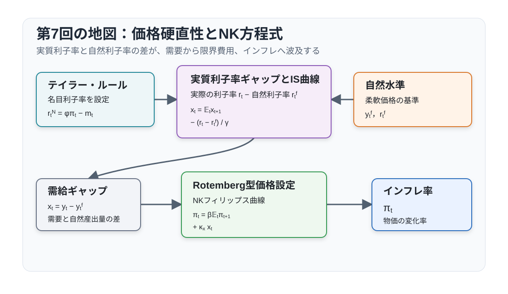
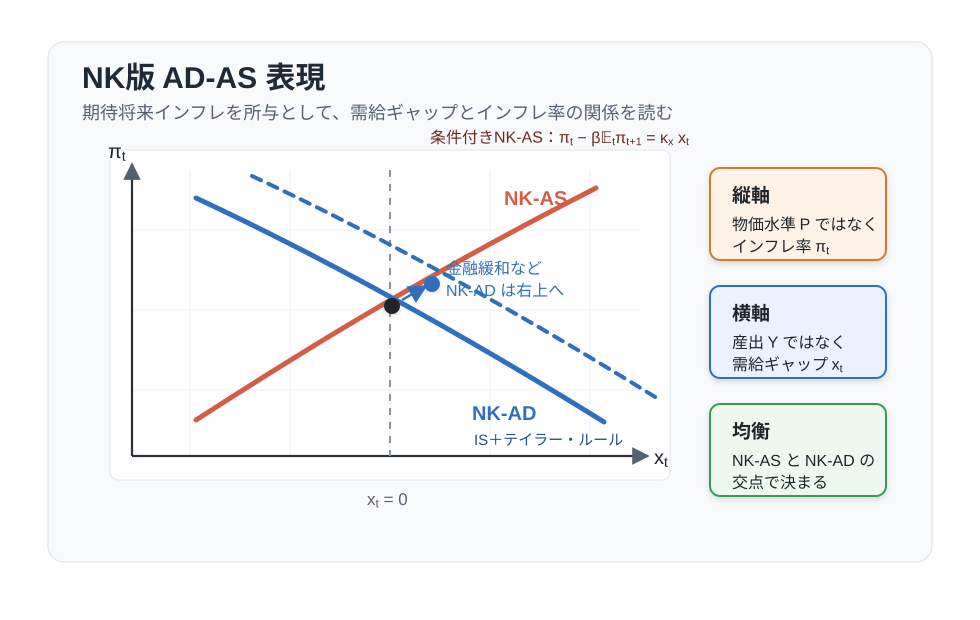

# 講義の目的

この回では、代表的家計をもつ基本 RANK（Representative Agent New Keynesian）モデルを構築します。第6回の独占的競争モデルに価格硬直性と金融政策を加えると、名目利子率が実質利子率を動かし、実質利子率と自然利子率の差が需給ギャップを生みます。需給ギャップは実質限界費用を通じてインフレ率へ波及します。

計算を見通しやすくするため、$\alpha=0$、政府支出なしとします。$\alpha=0$ では第6回の固定資本項 $\bar K^\alpha$ と固定資本レントが消えます。投資と資本蓄積は引き続き導入しません。第8回では $\alpha>0$ と政府支出を戻し、同じ RANK 構造を一般化します。

@fig-lecture07-overview は、金融政策から実質利子率、需給ギャップ、実質限界費用、インフレ率へ至る流れを示しています。

{#fig-lecture07-overview width=88% fig-pos="H"}

```{=latex}
\Needspace{0.18\textheight}
```

この回のポイントは次の4点です。

1. Rotemberg 型価格調整費用を導入する。
2. 企業の価格設定条件から動学的フィリップス曲線を導く。
3. 定常状態を明示し、対数線形化された式を自然産出量、自然利子率、需給ギャップへ整理する。
4. 家計のオイラー方程式、NKフィリップス曲線、テイラー・ルールから3本のニューケインジアン方程式を得る。

# 表記と基本設定

大文字は水準、小文字は定常状態からの対数乖離を表します。第7回では $\alpha=0$、政府支出なし、技術の定常状態 $a=0$、$\nu=1$ とします。さらに、第6回の是正補助金 $\tau_p^*=1/(\psi-1)$ を維持して定常状態の実質限界費用を $MC=1$ とするため、$N=Y=C=W=MC=1$ と正規化できます。

主な水準変数は次の通りです。

| 記号 | 意味 |
|---|---|
| $C_t$ | 消費 |
| $N_t$ | 労働投入 |
| $Y_t$ | 産出 |
| $W_t$ | 実質賃金 |
| $MC_t$ | 実質限界費用 |
| $D_t(j),D_t$ | 中間財企業 $j$ の実質配当とその集計値 |
| $V_t(j)$ | 中間財企業 $j$ の配当落ち株価 |
| $J_t(j)$ | 当期配当を含む中間財企業 $j$ の期首価値 |
| $P_t$ | 最終財価格 |
| $P_t^I(j)$ | 中間財企業 $j$ の価格 |
| $Y_t^I(j)$ | 中間財企業 $j$ の産出 |
| $N_t(j)$ | 中間財企業 $j$ の労働投入 |
| $TX_t^I(j),TX_t^I$ | 中間財企業 $j$ に課される一括税とその集計額 |
| $R_t^N$ | 粗名目利子率 |
| $\Pi_t$ | 粗インフレ率 |
| $\Pi_t^I(j)$ | 中間財企業 $j$ の個別価格の粗変化率 |
| $a_t$ | 対数技術水準（技術水準は $\exp(a_t)$） |
| $C,N,Y,W,MC,R^N,\Pi$ | 対応する定常状態の水準 |

主な基礎パラメータは次の通りです。

| 記号 | 意味 |
|---|---|
| $0<\beta<1$ | 主観的割引因子 |
| $\gamma>0$ | 異時点間代替弾力性の逆数 |
| $\varphi>0$ | フリッシュ弾力性の逆数 |
| $\alpha=0$ | 線形生産に固定する生産関数パラメータ |
| $\nu=1$ | 労働不効用の水準の正規化 |
| $\psi>1$ | 中間財の代替弾力性 |
| $\eta>0$ | Rotemberg 型価格調整費用パラメータ |
| $\tau_p$ | 売上比例補助金率 |
| $\phi>1$ | テイラー・ルールのインフレ反応係数 |
| $0\leq\rho_a,\rho_m<1$ | 技術ショック、金融政策ショックの持続性 |

# モデルの部品

## 価格調整費用

中間財企業 $j$ は自社価格 $P_t^I(j)$ を選びます。個別価格の粗変化率を $z$ とすると、価格調整費用は
$$
f_P(z)Y_t
$$
です。Rotemberg 型の標準的な特定化は次の通りです。
$$
f_P(z)=\frac{\eta}{2}(z-1)^2,
\qquad
\eta>0
$$
企業別の変化率は後で $z=\Pi_t^I(j)$ と置き、対称均衡では $\Pi_t^I(j)=\Pi_t$ となります。ゼロインフレ定常状態では
$$
f_P(1)=0,
\qquad
f_P'(1)=0
$$
なので、価格調整費用と限界調整費用はともにゼロです。$\eta=0$ は柔軟価格の極限であり、価格調整費用つきモデルの式へ直接代入せず、別に扱います。$\eta>0$ なら、企業は今期のマークアップだけでなく、将来の価格変更費用も考慮して価格を選びます。

::: {.callout-note title="Calvo 型価格硬直性との関係"}
価格硬直性のもう一つの標準的な表現は Calvo 型価格設定です。Calvo 型では、各期に価格を再設定できる企業が一定割合に限られ、再設定できない企業は過去の価格を維持します。その結果、個別価格の分布と価格分散を追跡する必要があります。

本講義は、企業が毎期価格を選べる代わりに価格変更へ実物費用を負う Rotemberg 型を使います。この特定化では対称均衡を直接扱えるため、価格分布を追加の状態として導入せずに企業の価格設定条件を導けます。

Calvo 型でも、ゼロインフレの効率的定常状態の周りで一次近似すると、Rotemberg 型と同じ形の前向きな NKフィリップス曲線が得られます。Calvo 型の価格非再設定確率と Rotemberg 型の調整費用パラメータを、同じ NKフィリップス曲線の傾きを生むように対応づければ、一次近似の係数も同一です。第9回で扱う二次厚生損失についても、同じ対応のもとで両方式の係数は一致します。本講義ではこの局所的な対応だけを使い、Calvo 型の価格分布の導出は扱いません。
:::

## 家計

代表的家計の労働供給、債券保有、企業 $j$ の株式保有に関する一階条件は
$$
\begin{aligned}
W_t&=-\frac{U_{N,t}}{U_{C,t}},\\
1&=\mathbb{E}_t\left[Q_{t,t+1}\frac{R_t^N}{\Pi_{t+1}}\right],\\
V_t(j)&=\mathbb{E}_t\left[Q_{t,t+1}\{V_{t+1}(j)+D_{t+1}(j)\}\right],
\end{aligned}
$$
です。ただし
$$
Q_{t,t+1}\equiv \beta\frac{U_{C,t+1}}{U_{C,t}}
$$
です。第4回と同じく、$Q_{t,t+1}$ は来期消費を今期消費で評価する確率的割引因子（SDF）です。オイラー方程式は、名目利子率そのものではなく、期待インフレ率で割り引いた実質収益率
$$
\frac{R_t^N}{\Pi_{t+1}}
$$
が消費の異時点間配分を動かすことを表します。

多期間の確率的割引因子を $Q_{t,t+i}=\beta^iU_{C,t+i}/U_{C,t}$ と書きます。バブルを排除する横断性条件のもとでは、上の株価式を繰り返し代入すると
$$
V_t(j)
=
\mathbb{E}_t
\left[
\sum_{i=1}^{\infty}
Q_{t,t+i}D_{t+i}(j)
\right]
$$
となります。$V_t(j)$ は $t$ 期の配当を含まない配当落ち株価です。第3回で示した配当割引モデルの詳細はここでは繰り返さず、価格設定に必要な価値のタイミングだけを使います。

## 中間財企業

第7回では $\alpha=0$ とするため、中間財企業の技術は線形です。需要関数と生産関数を
$$
Y_t^I(j)=Y_t\left(\frac{P_t^I(j)}{P_t}\right)^{-\psi},
\qquad
Y_t^I(j)=\exp(a_t)N_t(j)
$$
とします。労働需要条件と総労働費用は
$$
MC_t= W_t\exp(-a_t),
\qquad
W_tN_t(j)=MC_tY_t^I(j)
$$
です。線形技術なので限界費用と平均可変費用が一致し、総可変費用を $MC_tY_t^I(j)$ と書けます。

売上比例補助金 $\tau_p$ は、第6回と同じく企業に課す一括税で賄います。企業 $j$ の実質配当は
$$
\begin{aligned}
D_t(j)={}&
(1+\tau_p)\frac{P_t^I(j)}{P_t}Y_t^I(j)
-W_tN_t(j)\\
&-f_P\left(\frac{P_t^I(j)}{P_{t-1}^I(j)}\right)Y_t
-TX_t^I(j).
\end{aligned}
$$
一括税 $TX_t^I(j)$ は、企業自身が価格、生産、労働を選ぶときに所与とみなします。現在と前期の自社相対価格 $s_t(j),s_{t-1}(j)$、生産、労働に関する一括税の偏微分はゼロです。

価格設定問題を導くため、中間財企業 $j$ の相対価格を
$$
s_t(j)\equiv \frac{P_t^I(j)}{P_t}
$$
と書きます。このとき個別価格の粗変化率は
$$
\Pi_t^I(j)
\equiv
\frac{P_t^I(j)}{P_{t-1}^I(j)}
=
\frac{s_t(j)}{s_{t-1}(j)}\Pi_t
$$
です。前期相対価格 $s_{t-1}(j)$ は今期の価格調整費用に入るため、企業の状態変数になります。

$J_t$ を当期配当込みの期首企業価値、$V_t$ を配当落ち株価と区別します。最適価格のもとで成立する関係は次の2式です。
$$
J_t(j)=D_t(j)+V_t(j),
\qquad
V_t(j)=\mathbb{E}_t\left[Q_{t,t+1}J_{t+1}(j)\right]
$$
この区別のもとで、価格設定に使う Bellman 方程式は
$$
\begin{aligned}
J_t(s_{t-1}(j))
=\max_{s_t(j)}\Bigg\{
&\left[(1+\tau_p)s_t(j)-MC_t\right]
Y_ts_t(j)^{-\psi}\\
&-f_P\left(
\frac{s_t(j)}{s_{t-1}(j)}\Pi_t
\right)Y_t
-TX_t^I(j)\\
&+\mathbb{E}_t\left[
Q_{t,t+1}J_{t+1}(s_t(j))
\right]
\Bigg\}
\end{aligned}
$$
です。

$s_t(j)$ に関する一階条件は
$$
\begin{aligned}
0={}&
Y_ts_t(j)^{-\psi}
\left[
(1+\tau_p)(1-\psi)
+\psi\frac{MC_t}{s_t(j)}
\right]\\
&-Y_tf_P'\left(\Pi_t^I(j)\right)
\frac{\Pi_t}{s_{t-1}(j)}\\
&+\mathbb{E}_t\left[
Q_{t,t+1}J_{s,t+1}(s_t(j))
\right]
\end{aligned}
$$
です。一方、包絡線条件は
$$
J_{s,t}(s_{t-1}(j))
=
Y_t f_P'\left(\Pi_t^I(j)\right)
\frac{\Pi_t^I(j)}{s_{t-1}(j)}
$$
です。今日の選択変数 $s_t(j)$ は来期には状態変数になります。1期先の包絡線条件を使うと、継続価値の微分は
$$
J_{s,t+1}(s_t(j))
=
Y_{t+1} f_P'\left(\Pi_{t+1}^I(j)\right)
\frac{\Pi_{t+1}^I(j)}{s_t(j)}
$$
と置き換えられます。

対称均衡では $s_t(j)=s_{t-1}(j)=1$、$\Pi_t^I(j)=\Pi_t$ です。これらを一階条件に代入して $Y_t$ で割ると、非線形の価格設定条件
$$
\begin{aligned}
\Pi_tf_P'(\Pi_t)={}&
\psi\left[
MC_t-(1+\tau_p)\left(1-\frac{1}{\psi}\right)
\right]\\
&+\mathbb{E}_t\left[
Q_{t,t+1}\frac{Y_{t+1}}{Y_t}
\Pi_{t+1}f_P'(\Pi_{t+1})
\right]
\end{aligned}
$$
を得ます。$\tau_p=0$ なら無補助の条件に戻ります。是正補助率 $\tau_p^*=1/(\psi-1)$ のもとでは、ゼロインフレ定常状態で $MC=1$ です。第6回の柔軟価格モデルでは $MC_t=1$ が毎期成立しましたが、第7回では価格調整費用により $MC_t$ が1の周りで変動します。

## 金融政策

中央銀行は、名目利子率を次のテイラー・ルールで設定します。
$$
R_t^N=\frac{1}{\beta}\exp(-m_t)\Pi_t^\phi,
\qquad
\phi>1
$$
金融政策ショック $m_t$ は正負の値を取り、正の実現値 $m_t>0$ を金融緩和と呼びます。同じインフレ率のもとで $m_t$ が上昇すると、名目利子率は低く設定されます。ショック過程は
$$
m_t=\rho_m m_{t-1}+e_t^m,
\qquad
0\leq\rho_m<1
$$
です。

係数 $\phi>1$ は、中央銀行が現在のインフレ率に対して名目利子率を一対一以上に反応させるテイラー原則です。実質利子率は期待インフレ率にも依存するため、これは実質利子率を機械的に引き上げる条件ではありません。現在の単純な政策ルールでは、テイラー原則が前向き NK 体系の決定性を支えます。

## 政府会計と資源制約

補助金は、企業が自身の選択時に所与とみなす一括税で賄います。最終財企業のゼロ利潤条件を使うと、政府予算は
$$
\begin{aligned}
TX_t^I
&\equiv\int_0^1TX_t^I(j)\,dj\\
&=\tau_p\int_0^1
\frac{P_t^I(j)}{P_t}Y_t^I(j)\,dj
=\tau_pY_t
\end{aligned}
$$
です。したがって、対称均衡の集計配当は
$$
D_t
=Y_t-W_tN_t-f_P(\Pi_t)Y_t
$$
に戻ります。補助金と一括税は所得を再分配するだけですが、価格調整費用は実物資源を吸収します。家計予算と統合した資源制約は
$$
Y_t=C_t+f_P(\Pi_t)Y_t
$$
です。$f_P(1)=f_P'(1)=0$ なので、ゼロインフレ定常状態の周りの一次近似は $c_t=y_t$ です。第8回では政府購入を加え、$Y_t=C_t+G_t+f_P(\Pi_t)Y_t$ とします。

# 非線形体系と定常状態

消費から得る効用を
$$
u(C)=
\begin{cases}
\dfrac{C^{1-\gamma}-1}{1-\gamma},&\gamma\neq1,\\[6pt]
\log C,&\gamma=1
\end{cases}
$$
と定義します。期間効用と消費の限界効用は
$$
U(C_t,N_t)=u(C_t)-\frac{N_t^{1+\varphi}}{1+\varphi},
\qquad
U_{C,t}=C_t^{-\gamma}
$$
です。労働不効用の水準は $\nu=1$ に正規化しています。

第6回の是正補助率 $\tau_p^*=1/(\psi-1)$ を維持します。家計、企業、中央銀行、資源制約から得る非線形条件は次の6本です。
$$
\begin{aligned}
1&=\mathbb{E}_t\left[
\beta\left(\frac{C_{t+1}}{C_t}\right)^{-\gamma}
\frac{R_t^N}{\Pi_{t+1}}
\right],\\
W_t&=N_t^\varphi C_t^\gamma,\\
W_t&=MC_t\exp(a_t),\\
Y_t&=\exp(a_t)N_t,\\
Y_t&=C_t+f_P(\Pi_t)Y_t,\\
R_t^N&=\frac{1}{\beta}\exp(-m_t)\Pi_t^\phi.
\end{aligned}
$$
これに前節の非線形価格設定条件と、外生ショック過程
$$
a_t=\rho_a a_{t-1}+e_t^a,
\qquad
m_t=\rho_m m_{t-1}+e_t^m
$$
を加えると、配分ブロックが閉じます。配当落ち株価 $V_t(j)$ は、この配分と企業価値条件を使って後から求められます。

## 定常状態

ゼロインフレ定常状態として $\Pi=1$、$a=m=0$ を考えます。$f_P(1)=f_P'(1)=0$ なので、価格設定条件から得る定常状態の実質限界費用は次の通りです。
$$
MC
=(1+\tau_p)\left(1-\frac{1}{\psi}\right)
$$
資源制約と線形技術から $C=Y=N$、労働需要から $W=MC$ です。労働供給 $W=N^\varphi C^\gamma$ を使うと、一般の補助率における定常状態は
$$
N=Y=C
=MC^{1/(\gamma+\varphi)},
\qquad
W=MC
$$
となります。

是正補助率 $\tau_p^*=1/(\psi-1)$ なら $MC=1$ です。$\nu=1$、$\alpha=0$、$a=0$ と合わせると
$$
N=Y=C=W=MC=\Pi=1
$$
となります。無補助なら $MC=(\psi-1)/\psi<1$ なので、労働、産出、消費、実質賃金の定常状態は1を下回ります。この回では是正補助金の定常状態を基準にし、価格硬直性と利子率の役割に集中します。

異時点間条件では、定常状態で $C_{t+1}=C_t$ なので $Q=\beta$ です。実質総利子率を $R$ と書くと
$$
1=\beta R
$$
から
$$
R=\frac{1}{\beta}
$$
です。$\Pi=1$ なので、粗名目利子率の定常状態も
$$
R^N=\frac{1}{\beta}
$$
です。ここで決まっているのは実物配分と、それに整合する実質利子率です。名目利子率とインフレ率をどう組み合わせてその実質利子率を実現するかは、金融政策ルールと価格設定条件によって決まります。

# 対数線形化と実質限界費用

ゼロインフレ・是正補助金の定常状態の周りで対数線形化します。名目利子率、インフレ率、実質限界費用の乖離を次のように定義します。
$$
\begin{aligned}
r_t^N&\equiv\log\left(\frac{R_t^N}{1/\beta}\right),
&\pi_t&\equiv\log\left(\frac{\Pi_t}{1}\right),\\
mc_t&\equiv\log\left(\frac{MC_t}{MC}\right).
\end{aligned}
$$
事前実質利子率の乖離は、一次近似上 $r_t\equiv r_t^N-\mathbb{E}_t\pi_{t+1}$ と定義します。この回の基準では $MC=1$ です。$Y=C=N=W=1$ なので、その他の小文字も対応する水準変数の対数乖離です。

非線形価格設定条件を一般の定常値 $MC$ の周りで一次近似すると
$$
\eta\pi_t
=\psi MC\,mc_t
+\beta\eta\mathbb{E}_t\pi_{t+1}
$$
を得ます。将来項に入る $Q_{t,t+1}$ と $Y_{t+1}/Y_t$ の一次変動は、$f_P'(1)=0$ と掛け合わされるため二次項になります。したがって
$$
\pi_t
=\beta\mathbb{E}_t\pi_{t+1}
+\kappa_pmc_t,
\qquad
\kappa_p\equiv\frac{\psi MC}{\eta}
$$
です。是正補助金なら $\kappa_p=\psi/\eta$、無補助なら $MC=(\psi-1)/\psi$ なので $\kappa_p=(\psi-1)/\eta$ です。これは表記慣例ではなく、展開する定常状態の違いです。

Calvo (1983) 型では、各期に一定割合の企業だけが価格を改定できます。価格硬直性の入れ方と傾きの係数は異なりますが、ゼロインフレ定常状態の周りでは、Rotemberg 型と同じ前向きの NKフィリップス曲線が得られます。この回では、価格設定条件を企業の調整費用として直接追える Rotemberg 型を使います。

対数線形化された条件をまとめると、次の体系になります。

| 名称 | 式 |
|---|---|
| フィッシャー方程式 | $r_t=r_t^N-\mathbb{E}_t\pi_{t+1}$ |
| オイラー方程式 | $r_t=\gamma\mathbb{E}_t\Delta c_{t+1}$ |
| 労働供給 | $w_t=\gamma c_t+\varphi n_t$ |
| 労働需要 | $w_t=mc_t+a_t$ |
| 生産関数 | $y_t=a_t+n_t$ |
| 資源制約 | $y_t=c_t$ |
| NKフィリップス曲線 | $\pi_t=\beta\mathbb{E}_t\pi_{t+1}+\kappa_p mc_t$ |
| テイラー・ルール | $r_t^N=\phi\pi_t-m_t$ |
| 技術ショック | $a_t=\rho_a a_{t-1}+e_t^a$ |
| 金融政策ショック | $m_t=\rho_m m_{t-1}+e_t^m$ |

この表の内生変数は次の8個です。
$$
\{r_t,r_t^N,\pi_t,c_t,w_t,n_t,y_t,mc_t\}
$$
外生状態は $\{a_t,m_t\}$ の2個です。式と変数の数が一致するだけでは、有界な合理的期待解の一意性は保証されません。現在のインフレ率だけに反応する単純な政策ルールでは、$0<\beta<1$、$\gamma>0$、$\kappa_p>0$ のもとで $\phi>1$ が局所決定性を保証します。金利平滑化や産出反応を加える場合は、Blanchard--Kahn 条件を改めて確認します。

資源制約から $c_t=y_t$ なので、オイラー方程式は
$$
r_t=\gamma\left(\mathbb{E}_t y_{t+1}-y_t\right)
$$
と産出で書けます。

## 実質限界費用の解き方

以下では実質限界費用を産出と技術だけで表し、柔軟価格の基準との差へ整理します。

まず、生産関数から
$$
n_t=y_t-a_t
$$
です。家計の労働供給式に代入すると
$$
w_t=\gamma y_t+\varphi(y_t-a_t)
=(\gamma+\varphi)y_t-\varphi a_t
$$
です。一方、企業の労働需要式は
$$
w_t=mc_t+a_t
$$
です。したがって
$$
mc_t=
(\gamma+\varphi)y_t-(1+\varphi)a_t
$$
を得ます。これが解法の中心です。価格が硬直的なもとでは、産出が自然産出量からずれると実質限界費用が動き、その実質限界費用がインフレ率を動かします。

物価版フィリップス曲線は
$$
\pi_t=
\beta\mathbb{E}_t\pi_{t+1}
+\kappa_p\{(\gamma+\varphi)y_t-(1+\varphi)a_t\}
$$
と書けます。

# 自然産出量・自然利子率・NK方程式

自然産出量 $y_t^f$ は、同じ実物ショックのもとで企業が価格を柔軟に調整できる場合の産出です。この回では是正補助金を維持するため、柔軟価格では $MC_t=1$、したがって $mc_t=0$ が毎期成立します。この環境では自然産出量と効率的産出量が一致します。補助金がなければ、自然産出量は柔軟価格配分ではあっても、その水準には独占的競争の歪みが残ります。
$$
0=
(\gamma+\varphi)y_t^f
-(1+\varphi)a_t
$$
したがって
$$
y_t^f=
\frac{1+\varphi}{\gamma+\varphi}
a_t
\equiv
\zeta_a a_t,
\qquad
\zeta_a\equiv
\frac{1+\varphi}{\gamma+\varphi}
$$
です。これは第4回の固定資本・柔軟価格モデルを $\alpha=0$ に特殊化した産出反応と一致します。是正補助金のもとでは、自然産出量を潜在生産量とも読めます。

需給ギャップを
$$
x_t\equiv y_t-y_t^f
$$
と定義すると、実質限界費用は
$$
mc_t=
(\gamma+\varphi)x_t
$$
です。したがってフィリップス曲線は
$$
\pi_t=\beta\mathbb{E}_t\pi_{t+1}+\kappa_x x_t
$$
となります。ここで
$$
\kappa_x\equiv
\kappa_p(\gamma+\varphi)>0
$$
です。

自然利子率は、価格が柔軟な経済で自然産出量を実現する実質利子率です。中央銀行が直接選ぶ政策変数ではなく、自然産出量に沿う消費成長と整合する実質的な基準金利です。オイラー方程式は
$$
r_t=\gamma\mathbb{E}_t(y_{t+1}-y_t)
$$
です。自然産出量を代入した自然利子率は次の通りです。
$$
r_t^f
=
\gamma\mathbb{E}_t(y_{t+1}^f-y_t^f)
$$
技術ショックが $a_{t+1}=\rho_a a_t+e_{t+1}^a$ に従う場合、
$$
r_t^f
=
\gamma\zeta_a(\rho_a-1)a_t
$$
となります。正の技術ショックが一時的で $0\leq\rho_a<1$ なら、自然利子率は低下します。技術水準が現在上昇した後に平均へ戻る過程では、自然消費が現在から将来にかけて低下するためです。

オイラー方程式から、需給ギャップの IS 曲線は
$$
x_t=\mathbb{E}_t x_{t+1}
-\frac{1}{\gamma}\left(r_t-r_t^f\right)
$$
と書けます。実際の実質利子率は
$$
r_t=r_t^N-\mathbb{E}_t\pi_{t+1}
$$
なので、名目利子率と期待インフレ率を用いれば
$$
x_t=\mathbb{E}_t x_{t+1}
-\frac{1}{\gamma}
\left(r_t^N-\mathbb{E}_t\pi_{t+1}-r_t^f\right)
$$
です。

```{=latex}
\Needspace{0.50\textheight}
```

## 3本のニューケインジアン方程式

ここまでの計算により、$\alpha=0$、政府支出なしの基本 RANK モデルは、次の3本にまとめられます。
$$
\begin{aligned}
x_t
&=
\mathbb{E}_t x_{t+1}
-\frac{1}{\gamma}(r_t-r_t^f),\\
\pi_t
&=
\beta\mathbb{E}_t\pi_{t+1}
+\kappa_x x_t,\\
r_t
&=
\phi\pi_t-\mathbb{E}_t\pi_{t+1}-m_t.
\end{aligned}
$$
第1式は動学的 IS 曲線です。期待将来ギャップを所与とすれば、実際の実質利子率 $r_t$ と自然利子率 $r_t^f$ の差の上昇は、現在の需給ギャップを押し下げます。第2式はNKフィリップス曲線です。需給ギャップが正なら、限界費用が上がり、インフレ率が上昇します。第3式はテイラー・ルールを実質利子率で書いたものです。

この3本は、第1回の AD-AS 図に対応させて読むこともできます。横軸は需給ギャップ $x_t$、縦軸はインフレ率 $\pi_t$ です。NKフィリップス曲線が右上がりの **NK-AS**、動学的 IS 曲線とテイラー・ルールを合わせた関係が右下がりの **NK-AD** になります。

@fig-lecture07-nk-ad-as は、期待将来インフレ率、期待将来需給ギャップ、自然利子率を所与とした当期の条件付き関係です。前向き変数を含むため、第1回の静学的 AD-AS と同じ独立した曲線ではありません。

{#fig-lecture07-nk-ad-as width=88% fig-pos="H"}

期待と自然利子率を所与とすれば、金融緩和ショック $m_t>0$ は同じインフレ率のもとで実質利子率を下げ、NK-AD を右上へ動かします。合理的期待均衡での正確な反応は、将来期待と同時に解く必要があります。

```{=latex}
\Needspace{0.30\textheight}
```

## 実際の利子率と古典派の二分法

第4回の柔軟価格モデルでは、技術と選好が実物配分を決め、オイラー方程式はその消費経路に整合する実質利子率を後から決めました。名目利子率、インフレ率、物価水準は実物配分から分離していました。これが古典派の二分法です。

この回の価格硬直性モデルでは、その分離が短期的に崩れます。中央銀行は次のテイラー・ルールで名目利子率を設定します。
$$
r_t^N=\phi\pi_t-m_t
$$
期待インフレ率を差し引いた実際の実質利子率は次の通りです。
$$
r_t=\phi\pi_t-m_t-\mathbb{E}_t\pi_{t+1}
$$
期待将来ギャップ $\mathbb{E}_t x_{t+1}$ を所与とすれば、$r_t-r_t^f$ の上昇は当期の需給ギャップ $x_t$ を押し下げ、低下は押し上げます。ただし、
$$
x_t-\mathbb{E}_t x_{t+1}
=-\frac{1}{\gamma}(r_t-r_t^f)
$$
なので、当期の金利差だけでは $x_t$ の正負は決まりません。例えば $r_t>r_t^f$ でも、将来の正のギャップが十分大きく予想されれば、$x_t>0$ となりえます。$\mathbb{E}_t x_{t+1}=0$ という追加条件のもとでは、$r_t>r_t^f$ から $x_t<0$ を結論できます。

したがって、価格硬直性のもとでは金融政策が実質配分に影響します。名目利子率の変更は、期待インフレ率が同時に完全には調整しない限り、実質利子率を動かします。その実質利子率と自然利子率の差が IS 曲線を通じて需要を動かし、需給ギャップがフィリップス曲線を通じてインフレ率を動かします。

# まとめと第8回への接続

第7回では、$\alpha=0$、政府支出なしの基本 RANK モデルを構築しました。Rotemberg 型価格調整費用があると、企業は現在の利潤だけでなく、現在の価格が将来の価格変更費用へ与える影響も考慮します。その結果、実質限界費用とインフレ率を結ぶ前向きな NKフィリップス曲線が得られます。

是正補助金はゼロインフレ定常状態を $MC=1$ に正規化しますが、価格硬直性のもとでは $MC_t$ は1の周りで変動します。実際の実質利子率と自然利子率の差が需給ギャップを動かし、需給ギャップが実質限界費用を通じてインフレ率を動かします。この伝達経路を、動学的 IS 曲線、NKフィリップス曲線、実質利子率表示のテイラー・ルールという3本にまとめました。

第8回では $\alpha>0$ と政府支出を戻します。基礎パラメータ自体を再定義するのではなく、
$$
\tilde{\gamma}=\frac{\gamma}{1-G_Y},
\qquad
\tilde{\varphi}=\frac{\varphi+\alpha}{1-\alpha}
$$
という合成係数を使います。3本のNK方程式の構造は維持されますが、自然産出量と自然利子率には技術ショックだけでなく政府支出ショックも入ります。

```{=latex}
\Needspace{0.32\textheight}
```

# 参考文献

**基本参考文献**

予習では本回の講義ノートの本編と基本問題に目を通してください。以下は、各項目に示した論点を授業後に復習するための参照先です。

- Galí, Jordi (2015) *Monetary Policy, Inflation, and the Business Cycle* (2nd ed.). Princeton University Press. NKフィリップス曲線の導出を確認するため。
- Woodford, Michael (2003) *Interest and Prices: Foundations of a Theory of Monetary Policy*. Princeton University Press. 価格硬直性と金融政策の標準的な体系。
- Clarida, Richard, Jordi Galí, and Mark Gertler (1999) "The Science of Monetary Policy: A New Keynesian Perspective." *Journal of Economic Literature*, 37(4), 1661-1707. [doi](https://doi.org/10.1257/jel.37.4.1661)

```{=latex}
\Needspace{0.30\textheight}
```

**発展**

- Calvo, Guillermo A. (1983) "Staggered Prices in a Utility-Maximizing Framework." *Journal of Monetary Economics*, 12(3), 383-398. [doi](https://doi.org/10.1016/0304-3932(83)90060-0)
- Rotemberg, Julio J. (1982) "Sticky Prices in the United States." *Journal of Political Economy*, 90(6), 1187-1211. [doi](https://doi.org/10.1086/261117)
- Taylor, John B. (1993) "Discretion versus Policy Rules in Practice." *Carnegie-Rochester Conference Series on Public Policy*, 39, 195-214. [doi](https://doi.org/10.1016/0167-2231(93)90009-L)

```{=latex}
\Needspace{0.24\textheight}
```

# 演習問題

## 基本問題

**問1 [Core]：価格硬直性の直観**

Rotemberg 型価格調整費用があると、なぜ企業は現在の実質限界費用だけでなく、現在の価格が将来の価格変更費用へ与える影響も考慮するのか説明しなさい。柔軟価格の第6回との違いも述べなさい。

```{=latex}
\Needspace{0.18\textheight}
```

**問2 [Core] [Derivation]：価格設定条件**

本文で導出した対称均衡の非線形価格設定条件
$$
\begin{aligned}
\Pi_tf_P'(\Pi_t)={}&
\psi\left[
MC_t-(1+\tau_p)\left(1-\frac{1}{\psi}\right)
\right]\\
&+\mathbb{E}_t\left[
Q_{t,t+1}\frac{Y_{t+1}}{Y_t}
\Pi_{t+1}f_P'(\Pi_{t+1})
\right]
\end{aligned}
$$
を出発点とします。$f_P(\Pi)=\eta(\Pi-1)^2/2$ と是正補助金を用い、ゼロインフレ定常状態 $MC=1$ の周りで一次近似して、
$$
\pi_t
=\beta\mathbb{E}_t\pi_{t+1}
+\frac{\psi}{\eta}mc_t
$$
を示しなさい。$Q_{t,t+1}$ と $Y_{t+1}/Y_t$ の一次変動が将来インフレ項へ残らない理由も説明しなさい。Bellman 方程式と包絡線条件から非線形条件を導く部分は本文の発展的な復習とし、この問題では要求しません。

```{=latex}
\Needspace{0.18\textheight}
```

**問3 [Core] [Derivation]：自然産出量と需給ギャップ**

生産関数 $y_t=a_t+n_t$、労働供給 $w_t=\gamma y_t+\varphi n_t$、労働需要 $w_t=mc_t+a_t$ から
$$
mc_t=(\gamma+\varphi)y_t-(1+\varphi)a_t
$$
を導きなさい。柔軟価格条件 $mc_t=0$ から自然産出量 $y_t^f$ を求め、$mc_t=(\gamma+\varphi)x_t$ を示しなさい。

```{=latex}
\Needspace{0.18\textheight}
```

## 発展問題

**問4 [Research extension] [Derivation]：自然利子率**

技術ショックが $a_t=\rho_a a_{t-1}+e_t^a$ に従うとします。自然利子率
$$
r_t^f=\gamma\zeta_a(\rho_a-1)a_t
$$
を導きなさい。$0\leq\rho_a<1$ のとき、正の技術ショックが自然利子率を下げる理由も説明しなさい。

```{=latex}
\Needspace{0.18\textheight}
```

**問5 [Research extension]：3本のNK方程式と金融政策**

3本のNK方程式を列挙し、期待将来ギャップを所与として、実際の実質利子率と自然利子率の差が当期の需給ギャップを動かす経路を説明しなさい。当期の $r_t>r_t^f$ だけで $x_t<0$ といえるかも検討しなさい。期待将来変数と自然利子率を所与としたとき、金融緩和ショック $m_t>0$ が NK-AD をどちらへ動かすか述べなさい。合理的期待均衡で正確な反応を求めるには、なぜ将来期待を同時に解く必要があるかも説明しなさい。
