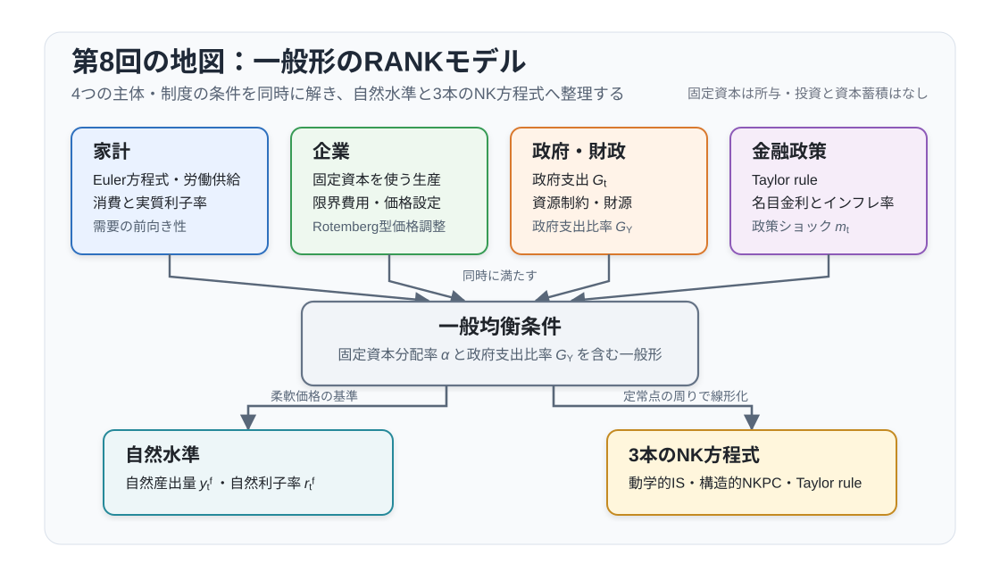
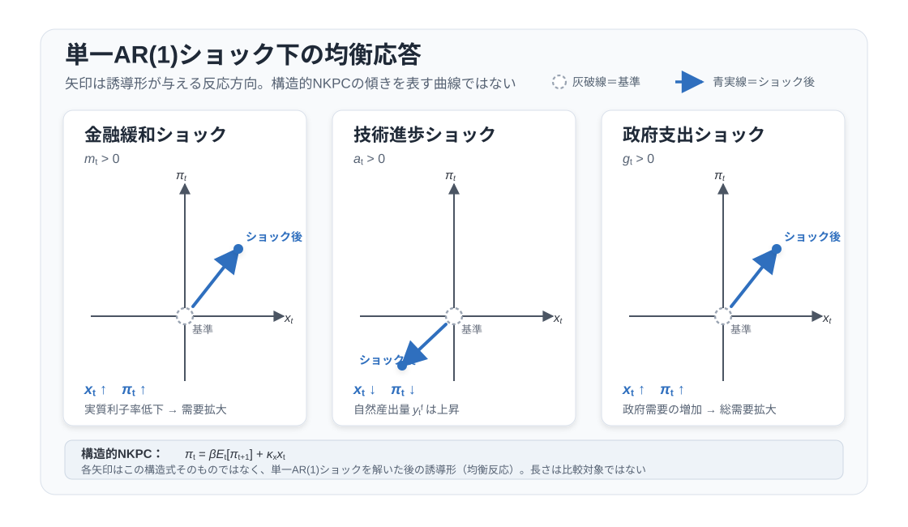

# 講義の目的

本講義では、代表的家計をもつニューケインジアン・モデルである **RANK (Representative Agent New Keynesian)** モデルを扱います。

1. 第3回から第7回までの結果を RANKモデルとして整理する。
2. 第7回の $\alpha=0$ モデルを、固定資本の分配率 $\alpha>0$ と政府支出を含む一般形へ拡張する。
3. 自然産出量、自然利子率、需給ギャップを一般形で定義する。
4. 3本のニューケインジアン方程式を使って、金融政策ショック・技術ショック・政府支出ショックを比較する。

この回の RANK は、柔軟価格の実物ブロックに価格硬直性と金融政策を加えた基本的な DSGEモデルです。固定資本は所与とし、投資と資本蓄積は導入しません。この簡略化により、自然水準と金融政策の伝達経路に集中できます。RANK は、その後の TANK や HANK を理解する基礎にもなります。


## 本回の位置づけ

DSGEモデルの分析は、基本的に次の3段階で進みます。第3回から第7回では、このうち各部品の導出を順に行いました。第8回では、それらを組み合わせて RANKモデルとして読むことに集中します。

1. 家計・企業・政府の最適化問題を定式化し、一階条件を導出する。
2. 集計条件と市場均衡条件を加えて、モデル全体の均衡条件を得る。
3. 非線形モデルを定常状態の周りで対数線形化し、状態空間表現やインパルス応答で分析する。

柔軟価格モデルでは技術ショックが実物配分を動かしました。RANK では独占的競争と価格硬直性を加えるため、金融政策や需要ショックも実体経済に影響します。ここでは Rotemberg 型の価格調整費用を用います。


@fig-lecture08-overview は、家計・企業・政府・金融政策の条件を、自然水準と3本のニューケインジアン方程式へ集約する流れを示しています。

{#fig-lecture08-overview width=88% fig-pos="H"}


# これまでの結果と第8回の役割

第8回では、第3回から第7回の個別主体の最適化問題からは再出発しません。既出の一階条件を RANKモデルの構成要素として使い、一般形の3本のニューケインジアン方程式へまとめます。

```{=latex}
\Needspace{0.24\textheight}
```

| 回 | ここで使う結果 |
|---|---|
| 第3回 | オイラー方程式、確率的割引因子（SDF）、資産価格条件 |
| 第4回 | 柔軟価格の実物配分、自然産出量、自然利子率の考え方 |
| 第5回 | 政府支出を含む資源制約 |
| 第6回 | Dixit--Stiglitz 型の独占的競争とマークアップ |
| 第7回 | Rotemberg 型価格硬直性、需給ギャップ表示、3本の NK方程式 |

第7回では、計算を見通しやすくするために $\alpha=0$、政府支出なしのケースを扱いました。第8回では、同じ構造を保ったまま、固定資本を所与としたときの労働に関する収穫逓減を表す $\alpha>0$ と、政府支出ショックを加えます。新しい点は、自然産出量と自然利子率に技術ショックだけでなく政府支出ショックも入ることです。

先に結論を示すと、第8回のRANKモデルは次の3本のNK方程式に集約されます。
$$
\begin{aligned}
x_t
&=
\mathbb{E}_t x_{t+1}
-\frac{1}{\tilde{\gamma}}(r_t-r_t^f),\\
\pi_t
&=
\beta\mathbb{E}_t\pi_{t+1}
+\kappa_x x_t,\\
r_t
&=
\phi\pi_t-\mathbb{E}_t\pi_{t+1}-m_t.
\end{aligned}
$$
第1式は動学的 IS 曲線、第2式はNKフィリップス曲線、第3式はテイラー・ルールを実質利子率で書いた式です。各ショックが同時点の主要変数に与える符号は、標準的なパラメータ範囲では次の通りです。

| 正のショック | $x_t$ | $\pi_t$ | $r_t$ |
|---|---:|---:|---:|
| 金融緩和ショック $m_t$ | $+$ | $+$ | $-$ |
| 技術ショック $a_t$ | $-$ | $-$ | $-$ |
| 政府支出ショック $g_t$ | $+$ | $+$ | $+$ |

この表は、$0\leq\rho_i<1$、$\phi>1$、$\eta>0$ のもとで、単一ショックだけが生じたときのインパクト反応を示します。$\phi>1$ は、この単純なインフレ反応ルールのもとで有界な合理的期待均衡を一意にするための標準的な条件です。以下では、なぜこの符号になるのかを非線形条件から順に導きます。

```{=latex}
\Needspace{0.58\textheight}
```

# 表記と基本設定

## モデルの環境と記号

大文字は水準、小文字は定常状態からの対数乖離を表します。ただし、技術 $a_t$ と政策ショック $m_t$ は対数で表した外生状態、政府支出は
$$
g_t=\frac{G_t-G}{Y}
$$
と定義します。粗名目利子率と粗インフレ率について
$$
r_t^N\equiv\log\left(\frac{R_t^N}{1/\beta}\right),
\qquad
\pi_t\equiv\log\Pi_t,
\qquad
mc_t\equiv\log\left(\frac{MC_t}{MC}\right)
$$
と置き、事前的実質利子率の一次近似を
$$
r_t\equiv r_t^N-\mathbb{E}_t\pi_{t+1}
$$
と定義します。需給ギャップは
$$
x_t\equiv y_t-y_t^f
$$
です。

第8回で使う主な水準変数は次の通りです。

| 記号 | 意味 |
|---|---|
| $C_t$ | 民間消費 |
| $N_t$ | 労働投入 |
| $Y_t$ | 産出 |
| $G_t$ | 政府支出 |
| $W_t$ | 実質賃金 |
| $MC_t$ | 実質限界費用 |
| $R_t^N$ | 粗名目利子率 |
| $\Pi_t$ | 粗インフレ率 |
| $a_t$ | 対数技術水準（技術水準は $\exp(a_t)$） |
| $C,N,Y,G,W,MC,R^N,\Pi$ | 対応する定常状態の水準 |

```{=latex}
\Needspace{0.46\textheight}
```

第8回で使う主な基礎パラメータは次の通りです。

| 記号 | 意味 |
|---|---|
| $0<\beta<1$ | 主観的割引因子 |
| $0\leq\alpha<1$ | 固定資本への分配率。固定資本を所与とするため、労働に関する収穫逓減も決める |
| $0\leq G_Y=G/Y<1$ | 定常状態の政府支出比率 |
| $\gamma>0$ | 異時点間代替弾力性の逆数 |
| $\varphi>0$ | フリッシュ弾力性の逆数 |
| $\nu=1$ | 労働不効用の水準の正規化 |
| $\psi>1$ | 中間財の代替弾力性 |
| $\eta>0$ | Rotemberg 型価格調整費用パラメータ |
| $\tau_p^*=1/(\psi-1)$ | 定常的な独占的競争の歪みを除く売上比例補助率 |
| $\phi>1$ | テイラー・ルールのインフレ反応係数 |
| $0\leq\rho_a,\rho_g,\rho_m<1$ | 技術、政府支出、金融政策ショックの持続性 |

派生係数は、それぞれを初めて使う箇所で定義します。

```{=latex}
\Needspace{0.56\textheight}
```

## 非線形条件

家計と企業の最適化から得られる条件に、資源制約、外生的な政府支出、金融政策ルールを加えます。個別主体の導出は第3回、第6回、第7回で行ったため、ここでは配分を決める条件だけを置きます。

消費効用を
$$
u(C_t)
=
\begin{cases}
\dfrac{C_t^{1-\gamma}-1}{1-\gamma}, & \gamma\neq1,\\[6pt]
\log C_t, & \gamma=1,
\end{cases}
\qquad
U(C_t,N_t)=u(C_t)-\nu\frac{N_t^{1+\varphi}}{1+\varphi}
$$
とします。生産関数は
$$
Y_t=\exp(a_t)\bar K^\alpha N_t^{1-\alpha},
\qquad
\bar K=1
$$
です。$\alpha$ は固定資本への分配率です。固定資本を所与とするため、同じ $\alpha$ が労働に関する収穫逓減を決めます。

以下では、第7回と同じく労働不効用の水準を $\nu=1$ に正規化します。一般形の労働供給条件は $W_t=\nu C_t^\gamma N_t^\varphi$ ですが、この正規化により
$$
W_t=C_t^\gamma N_t^\varphi
$$
を使います。政府購入と売上比例補助金は、家計と企業への一括税またはリカード的な国債で賄うと仮定します。この財源構成は現在の代表的家計の実物配分を変えません。是正補助金で定常的なマークアップ歪みを取り除くと、主要な均衡条件は
$$
\begin{aligned}
1&=\mathbb{E}_t\left[
\beta\left(\frac{C_{t+1}}{C_t}\right)^{-\gamma}
\frac{R_t^N}{\Pi_{t+1}}
\right],\\
W_t&=C_t^\gamma N_t^\varphi,\\
W_t&=(1-\alpha)MC_t\frac{Y_t}{N_t},\\
Y_t&=\exp(a_t)\bar K^\alpha N_t^{1-\alpha},\quad \bar K=1,\\
Y_t&=C_t+G_t+\frac{\eta}{2}(\Pi_t-1)^2Y_t,\\
R_t^N&=\frac{1}{\beta}\exp(-m_t)\Pi_t^\phi
\end{aligned}
$$
です。補助金とその財源は民間部門と政府を集計すると相殺され、政府購入と価格調整費用だけが財の資源制約に残ります。

```{=latex}
\Needspace{0.20\textheight}
```

価格調整費用を
$$
f_P(\Pi_t)=\frac{\eta}{2}(\Pi_t-1)^2,
\qquad
f_P'(\Pi_t)=\eta(\Pi_t-1)
$$
と置きます。NKフィリップス曲線の係数には $1/\eta$ が入るため、この価格硬直性モデルでは $\eta>0$ とします。$\eta=0$ は柔軟価格の極限であり、価格調整費用つきモデルの式にそのまま代入しません。

```{=latex}
\Needspace{0.25\textheight}
```

対称均衡の価格設定条件は非線形のまま
$$
\eta\Pi_t(\Pi_t-1)
=
\psi(MC_t-MC)
+\mathbb{E}_t\left[
\beta\left(\frac{C_{t+1}}{C_t}\right)^{-\gamma}
\frac{Y_{t+1}}{Y_t}
\eta\Pi_{t+1}(\Pi_{t+1}-1)
\right]
$$
です。ここで $MC$ は定常状態の実質限界費用です。補助金を明示すれば $MC=(1+\tau_p)(1-1/\psi)$ であり、定常状態のマークアップ歪みを取り除く設定では $MC=1$ と読めます。この式を一次近似すると
$$
\pi_t=\beta\mathbb{E}_t\pi_{t+1}
+\frac{MC\psi}{\eta}mc_t
$$
として使います。

## 柔軟価格配分とゼロインフレ定常状態

### 柔軟価格配分

第5回の政府支出入り資源制約と第6回の独占的競争モデルを組み合わせます。価格が柔軟なら価格調整費用は発生せず、実質限界費用は $MC$ に固定されます。各期の柔軟価格配分は静学体系
$$
\begin{aligned}
W_t&=C_t^\gamma N_t^\varphi,\\
W_t&=(1-\alpha)MC\frac{Y_t}{N_t},\\
Y_t&=\exp(a_t)N_t^{1-\alpha},\\
Y_t&=C_t+G_t
\end{aligned}
$$
で決まります。これらをまとめると、
$$
\left\{\exp(a_t)N_t^{1-\alpha}-G_t\right\}^{\gamma}
N_t^{\varphi+\alpha}
=
(1-\alpha)MC\exp(a_t)
$$
です。

```{=latex}
\Needspace{0.23\textheight}
```

### ゼロインフレ定常状態

定常状態では、ゼロインフレ $\Pi=1$ を置きます。価格調整費用はゼロで、オイラー方程式とテイラー・ルールから粗名目利子率は
$$
R^N=\frac{1}{\beta}
$$
です。ゼロインフレのため、事前的な粗実質収益率も $1/\beta$ です。是正補助率 $\tau_p^*=1/(\psi-1)$ により、定常状態の実質限界費用を $MC=1$ にします。政府支出比率 $G_Y=G/Y$ のもとで、資源制約は
$$
C=(1-G_Y)Y
$$
です。

```{=latex}
\Needspace{0.30\textheight}
```

生産関数は $Y=N^{1-\alpha}$ であり、労働供給と労働需要は
$$
W=C^\gamma N^\varphi,
\qquad
W=(1-\alpha)MC\frac{Y}{N}
$$
です。したがって
$$
(1-G_Y)^\gamma N^{\gamma(1-\alpha)+\varphi}
=
(1-\alpha)MC N^{-\alpha}
$$
となり、定常状態の労働投入は
$$
N
=
\left[
(1-\alpha)MC(1-G_Y)^{-\gamma}
\right]^{
\frac{1}{\varphi+\alpha+\gamma(1-\alpha)}
}
$$
です。したがって
$$
Y=N^{1-\alpha},
\qquad
C=(1-G_Y)Y,
\qquad
G=G_YY,
\qquad
W=(1-\alpha)MCN^{-\alpha}
$$
を得ます。補助金で $MC=1$ と正規化すれば、この式に $MC=1$ を代入します。第7回では $\alpha=0$、$G_Y=0$ と置いたため、$N=Y=C=W=1$ と正規化できました。第8回では $\alpha>0$ と $G_Y>0$ を許すため、定常状態の水準は一般には1になりません。

```{=latex}
\Needspace{0.50\textheight}
```

## 対数線形化

以下では、このゼロインフレ定常状態の周りで対数線形化します。すなわち $\Pi=1$、$R^N=1/\beta$、$MC=1$ を基準にし、$C,Y,G,N,W$ は上で述べた定常状態の水準の周りで測ります。小文字の $c_t,y_t,n_t,w_t,mc_t$ は定常状態からの対数乖離ですが、政府支出だけは
$$
g_t=\frac{G_t-G}{Y}
$$
と定義している点に注意してください。

政府の財源構成を省いたうえで、実物配分と物価・金利を決める対数線形体系は次の通りです。

```{=latex}
\Needspace{0.56\textheight}
```

| 名称 | 式 |
|---|---|
| フィッシャー方程式 | $r_t=r_t^N-\mathbb{E}_t\pi_{t+1}$ |
| オイラー方程式 | $r_t=\gamma\mathbb{E}_t\Delta c_{t+1}$ |
| 労働供給 | $w_t=\gamma c_t+\varphi n_t$ |
| 労働需要 | $w_t=mc_t+y_t-n_t$ |
| 生産関数 | $y_t=a_t+(1-\alpha)n_t$ |
| 資源制約 | $y_t=(1-G_Y)c_t+g_t$ |
| NKフィリップス曲線 | $\pi_t=\beta\mathbb{E}_t\pi_{t+1}+(MC\psi/\eta)mc_t$ |
| テイラー・ルール | $r_t^N=\phi\pi_t-m_t$ |
| 技術ショック | $a_t=\rho_a a_{t-1}+e_t^a$ |
| 政府支出ショック | $g_t=\rho_g g_{t-1}+e_t^g$ |
| 金融政策ショック | $m_t=\rho_m m_{t-1}+e_t^m$ |

```{=latex}
\Needspace{0.26\textheight}
```

この表では、配分を決める未知の時系列は
$$
\{r_t,r_t^N,\pi_t,c_t,w_t,n_t,y_t,mc_t,a_t,g_t,m_t\}
$$
の11個です。式も11本あるため、ショックのイノベーション $\{e_t^a,e_t^g,e_t^m\}$ を外生的に与えれば、配分ブロックの変数と式の数は一致します。政府予算、税、国債は、財源構成が実物配分に影響しないというリカード的仮定のもとで省いています。また、前向き変数を含むため、式の数が一致するだけでは十分ではありません。有界な合理的期待解の一意性には、テイラー原則やBlanchard--Kahn型の決定性条件が必要です。

この体系を後で使いやすい形に直しておきます。資源制約をオイラー方程式に代入すると、
$$
r_t
=
\tilde{\gamma}\mathbb{E}_t(\Delta y_{t+1}-\Delta g_{t+1})
$$
です。ただし
$$
\tilde{\gamma}\equiv\frac{\gamma}{1-G_Y},
\qquad
\tilde{\varphi}\equiv\frac{\varphi+\alpha}{1-\alpha}.
$$
資源制約と生産関数から、消費と労働は
$$
\begin{aligned}
c_t&=\frac{y_t-g_t}{1-G_Y},\\
n_t&=\frac{y_t-a_t}{1-\alpha}
\end{aligned}
$$
を労働供給と労働需要に代入すると、
$$
\begin{aligned}
mc_t
&=
\tilde{\gamma}(y_t-g_t)
+\tilde{\varphi}y_t
-(\tilde{\varphi}+1)a_t\\
&=
(\tilde{\gamma}+\tilde{\varphi})
\left(y_t-\zeta_a a_t-\zeta_g g_t\right)
\end{aligned}
$$
です。ここで
$$
\zeta_a=\frac{\tilde{\varphi}+1}{\tilde{\varphi}+\tilde{\gamma}},
\qquad
\zeta_g=\frac{\tilde{\gamma}}{\tilde{\varphi}+\tilde{\gamma}}.
$$

::: {.callout-note title="第7回への戻り方"}
$\alpha=0$、$G_Y=0$ と置けば
$$
\tilde{\gamma}=\gamma,
\qquad
\tilde{\varphi}=\varphi,
\qquad
\zeta_a=\frac{1+\varphi}{\gamma+\varphi},
\qquad
\zeta_g=\frac{\gamma}{\gamma+\varphi}.
$$
政府支出ショックも $g_t=0$ とすれば、第7回の基本 RANK モデルに戻ります。
:::

```{=latex}
\Needspace{0.72\textheight}
```

# 自然産出量・自然利子率・3本のNK方程式

前節の柔軟価格配分を対数線形化すると、自然産出量は閉形式で求まります。自然産出量とは、同じ技術ショックと政府支出ショックのもとで、価格が柔軟な場合に実現する産出です。柔軟価格では実質限界費用の乖離がゼロなので、
$$
0
=
\tilde{\gamma}(y_t^f-g_t)
+\tilde{\varphi}y_t^f
-(\tilde{\varphi}+1)a_t
$$
です。したがって
$$
y_t^f
=
\frac{\tilde{\varphi}+1}{\tilde{\varphi}+\tilde{\gamma}}a_t
+
\frac{\tilde{\gamma}}{\tilde{\varphi}+\tilde{\gamma}}g_t
$$
を得ます。

```{=latex}
\Needspace{0.18\textheight}
```

上で定義した係数を使えば、自然産出量は
$$
y_t^f=\zeta_a a_t+\zeta_g g_t
$$
です。本講義では是正補助金により定常的なマークアップ歪みを除いているため、自然配分と効率的配分が一致します。補助金がなければ、$y_t^f$ は柔軟価格産出量ではあっても、効率的産出量とは限りません。

自然利子率は、この自然産出量を実現する柔軟価格下の実質利子率です。資源制約とオイラー方程式から
$$
r_t^f
=
\tilde{\gamma}\mathbb{E}_t(\Delta y_{t+1}^f-\Delta g_{t+1})
$$
となります。ここで $y_t^f=\zeta_a a_t+\zeta_g g_t$ なので、
$$
\Delta y_{t+1}^f-\Delta g_{t+1}
=
\zeta_a\Delta a_{t+1}
+(\zeta_g-1)\Delta g_{t+1}
$$
です。

```{=latex}
\Needspace{0.26\textheight}
```

ショックを
$$
a_t=\rho_a a_{t-1}+e_t^a,
\qquad
g_t=\rho_g g_{t-1}+e_t^g
$$
と置けば、条件付き期待では
$$
\mathbb{E}_t\Delta a_{t+1}=-(1-\rho_a)a_t,
\qquad
\mathbb{E}_t\Delta g_{t+1}=-(1-\rho_g)g_t
$$
なので、
$$
r_t^f
=
-\tilde{\gamma}(1-\rho_a)\zeta_a a_t
+\tilde{\gamma}(1-\rho_g)(1-\zeta_g)g_t
$$
です。

```{=latex}
\Needspace{0.32\textheight}
```

需給ギャップを $x_t=y_t-y_t^f$ と定義すると、RANKモデルは次の3本に集約されます。
$$
\begin{aligned}
x_t
&=
\mathbb{E}_t x_{t+1}
-\frac{1}{\tilde{\gamma}}(r_t-r_t^f),\\
\pi_t
&=
\beta\mathbb{E}_t\pi_{t+1}
+\kappa_x x_t,\\
r_t
&=
\phi\pi_t-\mathbb{E}_t\pi_{t+1}-m_t.
\end{aligned}
$$
ここで
$$
\kappa_x
=
MC(\tilde{\gamma}+\tilde{\varphi})\frac{\psi}{\eta}.
$$
第1式は動学的 IS 曲線、第2式はNKフィリップス曲線、第3式はテイラー・ルールを実質利子率で書いたものです。第8回の分析は、この3本を使って各ショックが $x_t,\pi_t,r_t$ をどう動かすかを見ることに集中します。

```{=latex}
\Needspace{0.78\textheight}
```

# ショック別の合理的期待均衡反応

## 構造式と単一ショック下の誘導形

第1回の静学的 AD-AS と異なり、RANKモデルの当期変数は将来期待と同時に決まります。構造的な供給側の関係は
$$
\pi_t-\beta\mathbb{E}_t\pi_{t+1}=\kappa_xx_t
$$
という期待を含むNKフィリップス曲線です。この構造式の傾き $\kappa_x$ は、ショックの種類によって変わりません。

ショック $i\in\{m,a,g\}$ だけが動き、線形解がその外生状態に比例するとします。このとき
$$
\mathbb{E}_t\pi_{t+1}^{(i)}=\rho_i\pi_t^{(i)}
$$
なので、構造式を解いたショック別の誘導形は
$$
\pi_t^{(i)}=\kappa_i x_t^{(i)},
\qquad
\kappa_i\equiv\frac{\kappa_x}{1-\beta\rho_i}
$$
です。これは単一ショック下の**均衡応答線**であり、構造的なNK-ASそのものではありません。複数のショックが同時に動く場合には
$$
x_t=\sum_i x_t^{(i)},
\qquad
\pi_t=\sum_i\kappa_i x_t^{(i)}
$$
とショック別成分を重ね合わせます。

@fig-lecture08-nk-ad-as-shocks は、各ショックがゼロの基準点から、単一の正のショックが生じた均衡点へ $x_t$ と $\pi_t$ をどう動かすかを示します。図中の矢印は合理的期待均衡の反応であり、独立した静学曲線のシフトではありません。

{#fig-lecture08-nk-ad-as-shocks width=88% fig-pos="H"}

以下では、金融政策ショックを使って解法を一度詳しく示します。その後、同じ手順を技術ショックと政府支出ショックへ適用し、結果を比較します。

```{=latex}
\Needspace{0.52\textheight}
```

## ショック別の結果

### 金融政策ショックのみ

まず、金融政策ショックだけがある場合を解きます。$a_t=g_t=0$ のとき、自然産出量と自然利子率は
$$
y_t^f=0,
\qquad
r_t^f=0
$$
なので、需給ギャップはそのまま産出です。
$$
x_t=y_t.
$$
ショックを
$$
m_{t+1}=\rho_m m_t+e_{t+1}^m
$$
とし、解が $m_t$ に比例すると予想します。

```{=latex}
\Needspace{0.20\textheight}
```

NKフィリップス曲線から
$$
\pi_t
=
\beta\rho_m\pi_t+\kappa_x x_t
$$
なので、
$$
\pi_t=\kappa_m x_t,
\qquad
\kappa_m\equiv\frac{\kappa_x}{1-\beta\rho_m}
$$
です。

IS 曲線は
$$
x_t
=
\mathbb{E}_t x_{t+1}
-\frac{1}{\tilde{\gamma}}r_t
$$
です。$x_{t+1}$ も $m_{t+1}$ に比例するので、$\mathbb{E}_t x_{t+1}=\rho_m x_t$ と書けます。したがって
$$
r_t
=
-\tilde{\gamma}(1-\rho_m)x_t
$$
です。一方、テイラー・ルールとフィッシャー方程式から
$$
r_t
=
r_t^N-\mathbb{E}_t\pi_{t+1}
=
\phi\pi_t-m_t-\rho_m\pi_t
=
(\phi-\rho_m)\pi_t-m_t
$$
です。$\pi_t=\kappa_m x_t$ を代入し、IS 曲線から得た実質利子率と等置すると
$$
\left\{
\kappa_m(\phi-\rho_m)
+\tilde{\gamma}(1-\rho_m)
\right\}x_t
=
m_t
$$
を得ます。

```{=latex}
\Needspace{0.30\textheight}
```

金融政策ショックへの均衡反応は
$$
x_t = \Omega m_t,
\qquad
\pi_t = \kappa_m \Omega m_t,
\qquad
r_t = -\Omega_m m_t
$$
です。ここで
$$
\begin{aligned}
\kappa_m
=&\frac{\kappa_x}{1-\beta\rho_m},\\
   \Omega
=&
\frac{1}{\kappa_m(\phi-\rho_m)+\tilde{\gamma}(1-\rho_m)},\\
\Omega_m
=&\tilde{\gamma}(1-\rho_m)\Omega,
\quad0\leq\Omega_m\leq1
\end{aligned}
$$
です。金融緩和ショックは需給ギャップとインフレを押し上げ、実質利子率を低下させます。

名目利子率の符号は一意には決まりません。
$$
\begin{aligned}
r_t^N &= r_t + \mathbb{E}_t \pi_{t+1}=r_t+\rho_m \pi_t\\
&=\frac{\rho_{m}\kappa_m-\tilde{\gamma}(1-\rho_{m})}{\kappa_m(\phi-\rho_{m})+\tilde{\gamma}(1-\rho_{m})}m_{t}
\end{aligned}
$$
です。金融緩和ショックは直接的には名目利子率を引き下げますが、インフレ期待の上昇を通じて名目利子率を押し上げる効果もあります。

### 技術・政府支出ショック：共通の解法

技術ショックと政府支出ショックは、どちらも自然利子率を動かします。$i\in\{a,g\}$、$s_t^{(a)}=a_t$、$s_t^{(g)}=g_t$ と書き、自然利子率のショック別成分を
$$
r_t^{f,(i)}=\chi_i s_t^{(i)}
$$
と置きます。単一ショック下では
$$
\pi_t^{(i)}=\kappa_i x_t^{(i)},
\qquad
r_t^{(i)}=(\phi-\rho_i)\pi_t^{(i)},
\qquad
r_t^{(i)}=r_t^{f,(i)}-\tilde{\gamma}(1-\rho_i)x_t^{(i)}
$$
です。ただし
$$
\kappa_i\equiv\frac{\kappa_x}{1-\beta\rho_i}.
$$
3式をまとめると
$$
x_t^{(i)}
=
\frac{\chi_i}{\kappa_i(\phi-\rho_i)+\tilde{\gamma}(1-\rho_i)}s_t^{(i)}
$$
を得ます。以下の係数を定義します。
$$
\Omega_i
\equiv
\frac{\tilde{\gamma}(1-\rho_i)}
{\kappa_i(\phi-\rho_i)+\tilde{\gamma}(1-\rho_i)},
\qquad
0\leq\Omega_i\leq1.
$$

技術ショックと政府支出ショックの自然利子率への効果は
$$
\chi_a=-\tilde{\gamma}(1-\rho_a)\zeta_a,
\qquad
\chi_g=\tilde{\gamma}(1-\rho_g)(1-\zeta_g)
$$
です。したがって、両ショックの均衡反応は一つの表にまとめられます。

$$
\begin{array}{c|ccc}
\text{正のショック}
&x_t&\pi_t&r_t\\ \hline
a_t
&-\zeta_a\Omega_a a_t
&-\kappa_a\zeta_a\Omega_a a_t
&-(\phi-\rho_a)\kappa_a\zeta_a\Omega_a a_t\\[3pt]
g_t
&(1-\zeta_g)\Omega_g g_t
&\kappa_g(1-\zeta_g)\Omega_g g_t
&(\phi-\rho_g)\kappa_g(1-\zeta_g)\Omega_g g_t
\end{array}
$$

正の技術ショックは自然産出量を押し上げますが、一時的なショックなら自然利子率を引き下げます。テイラー・ルールが自然利子率の低下を自動的には相殺しないため、実際の需要は自然産出量に追いつかず、需給ギャップとインフレ率が低下します。

正の政府支出ショックは、現在の民間消費を押し下げ、将来の消費回復を見込ませるため、自然利子率を押し上げます。所与のテイラー・ルールのもとでは需要も自然産出量以上に増えるため、需給ギャップとインフレ率が上昇します。

### まとめ

```{=latex}
\Needspace{0.33\textheight}
```

3つのショックが同時に動く場合は、ショック別の線形解を重ね合わせます。
$$
\begin{aligned}
x_t
&=
\Omega m_t
- \zeta_a \Omega_a a_t
+ (1-\zeta_g)\Omega_g g_t,\\
\pi_t
&=
\kappa_m \Omega m_t
- \kappa_a \zeta_a \Omega_a a_t
+ \kappa_g (1-\zeta_g)\Omega_g g_t,\\
r_t
&=
-\Omega_m m_t
-(\phi-\rho_a)\kappa_a\zeta_a\Omega_a a_t
+(\phi-\rho_g)\kappa_g(1-\zeta_g)\Omega_g g_t.
\end{aligned}
$$
価格が柔軟な極限 $\kappa_x\to\infty$ では、$\Omega,\Omega_m,\Omega_a,\Omega_g\to0$ となり、需給ギャップは $x_t=0$ です。反対に、価格が完全に固定された極限 $\kappa_x\to0$ では
$$
\Omega\to\frac{1}{\tilde{\gamma}(1-\rho_m)},
\qquad
\Omega_m,\Omega_a,\Omega_g\to1,
$$
したがって
$$
x_t
=
\frac{m_t}{\tilde{\gamma}(1-\rho_m)}
-\zeta_a a_t
+(1-\zeta_g)g_t
$$
となります。

```{=latex}
\Needspace{0.40\textheight}
```

需給ギャップに自然産出量を戻すと、
$$
y_t = x_t + y_t^f
$$
であるため、
$$
\begin{aligned}
y_t
&=
\Omega m_t
+\zeta_a(1-\Omega_a)a_t
+\{1-(1-\zeta_g)(1-\Omega_g)\}g_t\\
(1-G_Y)c_t
=
y_t-g_t
&=
\Omega m_t
+\zeta_a(1-\Omega_a)a_t
-(1-\zeta_g)(1-\Omega_g)g_t\\
(1-\alpha)n_t
=
y_t-a_t
&=
\Omega m_t
-\{1-\zeta_a(1-\Omega_a)\}a_t
+\{1-(1-\zeta_g)(1-\Omega_g)\}g_t
\end{aligned}
$$
と、産出・消費・労働の反応も復元できます。特に価格が一定のとき、$y_t=m_t/\{\tilde{\gamma}(1-\rho_m)\} + g_t$ となります。

```{=latex}
\Needspace{0.28\textheight}
```

水準変数の反応は次のように読めます。

| 正のショック | $y_t$ | $c_t$ | $n_t$ |
|---|---:|---:|---:|
| 金融緩和 $m_t$ | $+$ | $+$ | $+$ |
| 技術進歩 $a_t$ | $+$ | $+$ | $-$[^tech-labor] |
| 政府支出 $g_t$ | $+$ | $-$ | $+$ |

金融緩和は実質利子率を下げ、総需要を増やします。技術進歩は消費可能資源を増やし、同じ産出に必要な労働を減らします。政府支出は生産と労働を増やす一方、資源制約を通じて民間消費を押しのけます。

[^tech-labor]: $\tilde{\gamma}>1$ の標準的な場合の符号です。

```{=latex}
\Needspace{0.30\textheight}
```

## 数値例：インパルス応答関数

上の解は、各ショックへの同時点の反応を完全に特徴づけています。この簡略モデルには、資本、習慣形成、金利平滑化のような内生的な所定状態がありません。単一ショック下の政策関数は、そのAR(1)状態に比例します。このため、時点 $t$ に1単位のショックが発生すると、$h$ 期後の反応はインパクト反応の $\rho_i^h$ 倍になります。一般のDSGEモデルでは、内生状態が追加の持続性を生むため、この単純な形にはなりません。

以下の数値例は、符号と持続性を可視化するための例であり、特定経済の推定値ではありません。第2回の AR(1) のインパルス応答と同じ考え方で、ここでは RANKモデルの閉形式解を使って $x_t,\pi_t,r_t$ の反応を描きます。

```{r}
#| label: fig-rank-irf-numerical
#| fig-cap: "単一の1単位ショックに対するRANKモデルのIRF。値は例示的であり、特定経済の推定値ではない。横軸はモデル期間。パラメータは β=0.99、γ=ϕ=1、α=0.33、G/Y=0.20、ψ=6、η=80、政策反応係数=1.5。持続性は金融政策0.5、技術・政府支出0.8。"
#| fig-width: 8
#| fig-height: 6.3
#| fig-pos: H
#| fig-align: center
#| out-width: "95%"
#| echo: !expr knitr::is_html_output()
#| code-fold: true
#| code-summary: "Rコードを表示"

beta <- 0.99
gamma <- 1
varphi <- 1
alpha <- 0.33
GY <- 0.2
psi <- 6
eta <- 80
phi <- 1.5
MC <- 1

rho_m <- 0.5
rho_a <- 0.8
rho_g <- 0.8

tilde_gamma <- gamma / (1 - GY)
tilde_varphi <- (varphi + alpha) / (1 - alpha)
zeta_a <- (tilde_varphi + 1) / (tilde_varphi + tilde_gamma)
zeta_g <- tilde_gamma / (tilde_varphi + tilde_gamma)
kappa_x <- MC * (tilde_gamma + tilde_varphi) * psi / eta

kappa_i <- function(rho) kappa_x / (1 - beta * rho)
omega_i <- function(rho) {
  kappa_rho <- kappa_i(rho)
  tilde_gamma * (1 - rho) /
    (kappa_rho * (phi - rho) + tilde_gamma * (1 - rho))
}

kappa_m <- kappa_i(rho_m)
kappa_a <- kappa_i(rho_a)
kappa_g <- kappa_i(rho_g)

Omega <- 1 / (kappa_m * (phi - rho_m) + tilde_gamma * (1 - rho_m))
Omega_m <- tilde_gamma * (1 - rho_m) * Omega
Omega_a <- omega_i(rho_a)
Omega_g <- omega_i(rho_g)

impact <- list(
  monetary = c(
    x = Omega,
    pi = kappa_m * Omega,
    r = -Omega_m
  ),
  technology = c(
    x = -zeta_a * Omega_a,
    pi = -kappa_a * zeta_a * Omega_a,
    r = -(phi - rho_a) * kappa_a * zeta_a * Omega_a
  ),
  government = c(
    x = (1 - zeta_g) * Omega_g,
    pi = kappa_g * (1 - zeta_g) * Omega_g,
    r = (phi - rho_g) * kappa_g * (1 - zeta_g) * Omega_g
  )
)

rhos <- c(monetary = rho_m, technology = rho_a, government = rho_g)
h <- 0:20
shock_names <- c(
  monetary = "Monetary easing shock",
  technology = "Technology shock",
  government = "Government spending shock"
)
var_names <- c(x = "Output gap", pi = "Inflation", r = "Ex ante real rate")
var_cols <- c(x = "#2F6FBE", pi = "#D45D48", r = "#379B55")

op <- par(mfrow = c(3, 3), mar = c(3.0, 3.4, 2.5, 0.8), oma = c(2.0, 0.5, 1.0, 0.2), las = 1)

for (shock in names(impact)) {
  for (v in names(var_names)) {
    response <- impact[[shock]][v] * rhos[shock]^h
    y_lim <- range(c(0, response))
    pad <- 0.08 * diff(y_lim)
    if (pad == 0) pad <- 0.1
    plot(
      h, response,
      type = "n",
      xlab = "",
      ylab = "",
      main = paste(shock_names[shock], var_names[v], sep = "\n"),
      ylim = y_lim + c(-pad, pad),
      cex.main = 0.95
    )
    grid()
    abline(h = 0, lty = 2, col = "gray55")
    lines(h, response, lwd = 2.3, col = var_cols[v])
  }
}

mtext("Horizon (model periods)", side = 1, outer = TRUE, line = 0.5)
par(op)
```

```{=latex}
\Needspace{0.13\textheight}
```

この図では、金融緩和ショックと政府支出ショックは、需給ギャップとインフレ率をともに押し上げます。一方、技術進歩ショックは自然産出量を押し上げますが、需要が同じだけ増えないため、需給ギャップとインフレ率は低下します。いずれの反応も、ショックの持続性 $\rho_i$ に従って時間とともに減衰します。

```{=latex}
\Needspace{0.42\textheight}
```

# まとめと第9回への接続

第2回のショックなしケースでは、自然産出量が定常状態に固定されるため、産出の対数乖離 $y_t$ を需給ギャップとして読めました。第8回では
$$
y_t^f=\zeta_a a_t+\zeta_g g_t
$$
が動きます。したがって、政策に依存する産出側の厚生損失は $y_t^2$ ではなく
$$
x_t^2
=
\left(y_t-\zeta_a a_t-\zeta_g g_t\right)^2
$$
に比例します。ここで $g_t$ は政府支出ショックであり、需給ギャップではありません。

この読み替えには、是正補助金により自然配分と効率的配分が一致するという前提が必要です。この講義で用いる $U_CY$ による正規化では、二次近似した期間損失を
$$
\ell_t
=
\frac{1}{2}
\left\{
(\tilde{\gamma}+\tilde{\varphi})x_t^2
+\eta\pi_t^2
\right\}
$$
と書けます。第9回の記号では、価格インフレ項の厚生ウェイトを $\eta_p\equiv\eta$ と置き、正の定数 $\tilde{\gamma}+\tilde{\varphi}$ で割って
$$
\ell_t
=
\frac{1}{2}\left(x_t^2+\omega_p\pi_t^2\right),
\qquad
\omega_p
=
\frac{\eta_p}{\tilde{\gamma}+\tilde{\varphi}}
$$
と正規化します。第9回では、この目的関数のもとで政策ルールそのものを評価します。

## 直観的な含意

1. **金融政策の実体効果**
   価格硬直性があるため、名目金利の変更は実質金利を通じて需要に影響し、産出とインフレを動かします。

2. **自然産出量と需給ギャップの分離**
   技術ショックや政府支出ショックは自然産出量を動かすため、単に産出の動きだけでは景気の過熱・不足を判断できません。

3. **テイラー原則の重要性**
   $\phi>1$ はインフレ上昇時に実質金利を十分引き上げるため、この単純な政策ルールのもとで合理的期待均衡の決定性と一意性を確保します。

4. **モデルの範囲**
   代表的家計、所与の固定資本、投資なしという簡略化により、異質性、流動性制約、分配、資本蓄積の効果は捨象されています。


## まとめ

第8回では、$\alpha>0$ と政府支出を含む RANKモデルを、動学的 IS 曲線、NKフィリップス曲線、政策ルールの3本へ集約しました。ショックは、自然産出量と自然利子率を異なる方向へ動かします。その結果、同じ政策ルールのもとでも、金融緩和、技術進歩、政府支出は異なる需給ギャップとインフレ反応を生みます。

ここまでは政策ルールを所与として均衡反応を解きました。第9回では政策ルール自体を評価し、神々の配剤、均衡の決定性、裁量とコミットメントを扱います。TANK と HANK は、その後に代表的家計の仮定を緩める拡張です。

```{=latex}
\Needspace{0.36\textheight}
```

# 参考文献

**必読**

- Galí, Jordi (2015) *Monetary Policy, Inflation, and the Business Cycle* (2nd ed.). Princeton University Press. RANKモデル、自然利子率、需給ギャップの標準的教科書。
- Woodford, Michael (2003) *Interest and Prices: Foundations of a Theory of Monetary Policy*. Princeton University Press. 3本のNK方程式を政策分析へつなぐため。
- Clarida, Richard, Jordi Galí, and Mark Gertler (1999) "The Science of Monetary Policy: A New Keynesian Perspective." *Journal of Economic Literature*, 37(4), 1661-1707. [doi](https://doi.org/10.1257/jel.37.4.1661)

```{=latex}
\Needspace{0.28\textheight}
```

**発展**

- Smets, Frank, and Raf Wouters (2003) "An Estimated Dynamic Stochastic General Equilibrium Model of the Euro Area." *Journal of the European Economic Association*, 1(5), 1123-1175. [doi](https://doi.org/10.1162/154247603770383415)
- Christiano, Lawrence J., Martin Eichenbaum, and Charles L. Evans (2005) "Nominal Rigidities and the Dynamic Effects of a Shock to Monetary Policy." *Journal of Political Economy*, 113(1), 1-45. [doi](https://doi.org/10.1086/426038)
- Schmitt-Grohé, Stephanie, and Martín Uribe (2004) "Solving Dynamic General Equilibrium Models Using a Second-Order Approximation to the Policy Function." *Journal of Economic Dynamics and Control*, 28(4), 755-775. [doi](https://doi.org/10.1016/S0165-1889(03)00043-5)

```{=latex}
\Needspace{0.28\textheight}
```

# 演習問題

## 基本問題

**問1：自然産出量と効率的産出量**

RANKモデルで自然産出量 $y_t^f$ と需給ギャップ $x_t$ を分けて考える理由を説明しなさい。自然産出量と効率的産出量が一致するために、なぜ是正補助金が必要なのかも述べなさい。

```{=latex}
\Needspace{0.23\textheight}
```

**問2：導出確認**

資源制約、労働供給、労働需要、生産関数から
$$
mc_t
=
(\tilde{\gamma}+\tilde{\varphi})
\left(y_t-\zeta_a a_t-\zeta_g g_t\right)
$$
を導出し、$\zeta_a$ と $\zeta_g$ の定義を示しなさい。

```{=latex}
\Needspace{0.23\textheight}
```

**問3：第7回の特殊ケース**

$\alpha=0$、$G_Y=0$、$g_t=0$ と置き、$\tilde{\gamma}=\gamma$、$\tilde{\varphi}=\varphi$ となることを確認しなさい。そのうえで、自然産出量と3本のNK方程式が第7回の式へ戻ることを示しなさい。

```{=latex}
\Needspace{0.25\textheight}
```

**問4：構造式と誘導形**

構造的NKフィリップス曲線と、単一のAR(1)ショック下で得られる
$$
\pi_t^{(i)}
=
\frac{\kappa_x}{1-\beta\rho_i}x_t^{(i)}
$$
の違いを説明しなさい。複数ショックが同時に動く場合、単一の $\kappa_i$ を使えない理由も述べなさい。

```{=latex}
\Needspace{0.28\textheight}
```

## 発展問題

**問5：政府支出ショック**

正の政府支出ショックについて、自然利子率と
$$
x_t=(1-\zeta_g)\Omega_g g_t,
\qquad
\pi_t=\kappa_g(1-\zeta_g)\Omega_g g_t
$$
を導出しなさい。$\kappa_x\to\infty$ と $\kappa_x\to0$ の両極限で、需給ギャップと産出がどうなるかも説明しなさい。

```{=latex}
\Needspace{0.28\textheight}
```

**問6：厚生ロスへの接続**

第2回のショックなしケースでは、厚生ロスの産出項を $y_t^2$ と読めました。第8回では、なぜ $y_t^2$ ではなく
$$
x_t^2
=
\left(y_t-\zeta_a a_t-\zeta_g g_t\right)^2
$$
を使うのか説明しなさい。さらに、この講義の正規化のもとで $\omega_p=\eta/(\tilde{\gamma}+\tilde{\varphi})$ となることを確認しなさい。
