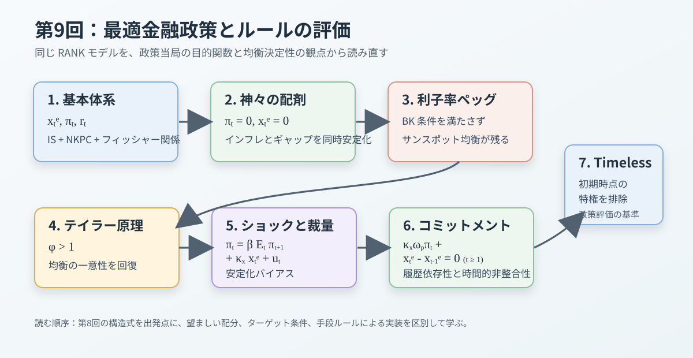

```{r}
#| label: setup-japanese-graphics
#| include: false
source("scripts/japanese-graphics.R")
jp_graphics <- configure_course_graphics()
```

```{=latex}
\clearpage
```

# 講義の目的

第8回では、動学的 IS 曲線とニューケインジアン（**NK**）フィリップス曲線を外生的なテイラー・ルールで閉じ、中央銀行が所与の「手段ルール（**Instrument Rule**）」に従うもとで、金融政策ショック、技術進歩ショック、政府支出ショックに対するマクロ経済の動学的反応を分析しました。これに対し本第9回では、分析の視点を大きく逆転させます。すなわち、「中央銀行が最大化すべき社会厚生の目的関数から出発して、最も望ましい配分とそれを満たす［**ターゲット条件（Targeting Rule）**］を導出し、その最適配分を一意に実現（**実装**）するためには政策金利をどのように設定すべきか」という［**最適金融政策（Optimal Monetary Policy）の理論**］を探究します。

第7回および第8回との記号の整合性を保つため、本ノートでも柔軟価格下の自然産出量からの乖離である［**「需給ギャップ（自然産出量ギャップ）」**］を一貫して
$$
x_t\equiv y_t-y_t^f
$$
と表記します。一方、第9回における政策評価では、社会厚生の観点から最も望ましい［**「効率的産出量（Efficient Output：$y_t^e$）」**］からの乖離である［**「厚生上の産出ギャップ（Welfare Output Gap）」**］
$$
x_t^e\equiv y_t-y_t^e
$$
を明確に区別して導入します。自然産出量と効率的産出量の差を
$$
\Delta_t^{ef}\equiv y_t^e-y_t^f
$$
と定義すると、両者の間には以下の恒等的な関係が成り立ちます。
$$
x_t=x_t^e+\Delta_t^{ef}.
$$
中央銀行が最小化すべき社会厚生損失関数は、効率的産出量からの乖離である $x_t^e$ を用いて厳密に定式化されます。

第9回で用いる基本モデルの縮約体系は、動学的 IS 曲線、NKフィリップス曲線、およびフィッシャー関係から構成されます。
$$
\begin{aligned}
x_t^e
&=
\mathbb{E}_t x_{t+1}^e
-\frac{1}{\tilde{\gamma}}(r_t-r_t^e),\\
\pi_t
&=
\beta\mathbb{E}_t\pi_{t+1}
+\kappa_x x_t^e+u_t,\\
r_t
&=
r_t^N-\mathbb{E}_t\pi_{t+1}.
\end{aligned}
$$
ここで、$r_t^e$ は効率的配分を支える実質利子率（**効率的利子率**）を表します。$\pi_t$ は価格インフレ率、$r_t$ は事前実質利子率、$r_t^N$ は政策手段である名目利子率です。第8回で扱ったベースライン経済では、是正補助金によって定常状態の独占の歪みが完全に相殺されており、時間変動する非効率なマークアップショックも存在しなかったため、自然配分と効率的配分は常に一致していました。
$$
y_t^e=y_t^f,
\qquad
r_t^e=r_t^f.
$$

第8回における第3の方程式は所与のテイラー・ルールでしたが、第9回では政策ルール自体の望ましさを評価するため、体系の第3式には政策ルールではなくフィッシャー関係（**定義式**）を配置しています。以下では、利用可能な情報集合 $\mathcal{I}_t$ に応じて名目利子率を設定する具体的な操作式 $r_t^N=f(\mathcal{I}_t)$ を［**「手段ルール（Instrument Rule）」**］と呼び、厚生最適化の一階条件として導かれるインフレ率と産出ギャップの望ましい関係式 $F(\pi_t, x_t^e, x_{t-1}^e)=0$ を［**「ターゲット条件（Targeting Rule）」**］と呼びます。

ターゲット条件は政策金利の操作式そのものではありません。ターゲット条件から導かれた望ましい配分経路 $(x_t^e, \pi_t)$ を動学的 IS 曲線とフィッシャー関係へ代入することにより、その配分を均衡の一つとして成立させる［**「支持する金利経路（Supporting Interest Rate Path）」**］がまず求まります。しかし、それだけでは自己実現的な期待の変動による他の不決定な均衡を排除できません。目標からの逸脱に対して名目金利を能動的に反応させ、望ましい均衡だけを一意に選ぶ手段ルールを確定するプロセスを［**「一意実装（Unique Implementation）」**］と呼びます。

先に本講義の結論を要約すると、第9回の主要な政策的含意は以下の通りです。［**「神々の配剤（Divine Coincidence）」**］とは、インフレ率の完全安定化と厚生上の産出ギャップの完全安定化がトレードオフなく同時に達成される理想的な性質を指します（**この命名および実質賃金硬直性によってこの配剤が崩壊するメカニズムについては Blanchard and Galí 2007 を参照してください**）。

| 主要な政策論点 | 本講義における結論 |
|---|---|
| コストプッシュ・ウェッジなし | 是正補助金のもとで［**神々の配剤**］が成立し、インフレ率と産出ギャップの双方を同時に完全安定化（$\pi_t=x_t^e=0$）できる。 |
| 利子率ペッグ | 名目利子率を一定に固定すると、期待インフレが自己実現し、合理的期待均衡は［**不決定（Indeterminate）**］となる。 |
| テイラー原則 | インフレ率に対する名目金利の反応係数を $\phi>1$ とすることで、インフレ期待の自己実現を排除し、局所決定性が回復する。 |
| コストプッシュショック | 時間変動的なマークアップ・ウェッジ（$u_t \neq 0$）の存在により、インフレ安定化と厚生上の産出ギャップ安定化の間に［**トレードオフ**］が生じる。 |
| 裁量政策 | 毎期最適化を行う政策枠組み。平均的なインフレ・バイアスは生じないものの、将来の期待をコントロールできないため［**安定化バイアス**］が生じる。 |
| コミットメント政策 | 将来の政策経路をあらかじめ約束することで民間期待を誘導し、過去の行動を引き継ぐ［**履歴依存的なターゲット条件**］が導かれる。 |
| タイムレス・パースペクティブ | 過去の約束を拘束力のある状態変数として引き継ぐことで、初期時点の特権を取り除いた［**規範的な政策評価ベンチマーク**］を与える。 |

以下では、神々の配剤とその一意実装、利子率ルールと均衡の決定性、ならびにコストプッシュショック下における裁量政策とコミットメント政策の比較の順に論じます。@fig-lecture09-overview はこの全体の論理展開を示しています。なお、固有値計算の数学的詳細は末尾の補論にまとめています。

::: {#fig-lecture09-overview}

{width=95%}

```{=latex}
\begin{minipage}{\linewidth}\raggedright
```

*Notes:* RANK モデルの最適政策問題から、神々の配剤、利子率ペッグの不決定性、テイラー原則、裁量政策、コミットメント政策、およびタイムレス・パースペクティブへと進む講義の全体構成。

```{=latex}
\end{minipage}
```

第9回講義の全体像

:::

# 表記と基本設定

本講義で用いる主な内生変数は以下の通りです。

| 記号 | 経済学的な意味 |
|---|---|
| $x_t$ | 自然産出量からの需給ギャップ（**$x_t \equiv y_t - y_t^f$**） |
| $x_t^e$ | 厚生上の産出ギャップ（**$x_t^e \equiv y_t - y_t^e$**） |
| $\pi_t$ | 価格インフレ率のゼロインフレ定常状態からの対数乖離 |
| $r_t$ | 事前的実質利子率の定常状態からの対数乖離 |
| $r_t^N$ | 粗名目利子率の定常状態からの対数乖離 |
| $y_t$ | 集計産出量の定常状態からの対数乖離 |

主な外生状態変数および派生変数は以下の通りです。

| 記号 | 経済学的な意味 |
|---|---|
| $y_t^e$ | パレート効率的な産出量（**効率的産出量**） |
| $y_t^f$ | 柔軟価格下で達成される産出量（**自然産出量**） |
| $\Delta_t^{ef}$ | 効率的産出量と自然産出量の差（**$\Delta_t^{ef} \equiv y_t^e - y_t^f$**） |
| $r_t^e$ | 効率的配分を支える実質利子率（**効率的利子率**） |
| $r_t^f$ | 自然産出量を支える実質利子率（**自然利子率**） |
| $u_t$ | 効率的産出量と自然産出量の乖離から生じるコストプッシュ・ウェッジ |
| $e_t^u$ | コストプッシュショックの撹乱項（**イノベーション**） |

主なパラメータの設定は以下の通りです。

| 記号 | 経済学的な意味 |
|---|---|
| $\beta\in(0,1)$ | 家計の主観的割引因子 |
| $\gamma>0$ | 異時点間代替弾力性の逆数（**相対的リスク回避度**） |
| $\varphi>0$ | フリッシュ労働供給弾力性の逆数 |
| $\tilde{\gamma}>0$ | IS 曲線における実質利子率弾力性の逆数（**$\tilde{\gamma} \equiv \frac{\gamma}{1-G_Y}$**） |
| $\tilde{\varphi}>0$ | 労働収穫逓減を考慮した限界費用の労働供給弾力性（**$\tilde{\varphi} \equiv \frac{\varphi+\alpha}{1-\alpha}$**） |
| $\kappa_x>0$ | 需給ギャップに対する NKフィリップス曲線の傾き |
| $\phi\geq0$ | テイラー・ルールにおけるインフレ反応係数 |
| $\eta_p>0$ | Rotemberg 型価格調整費用パラメータ（**第8回の $\eta$**） |
| $\omega_p>0$ | 価格インフレ安定化に対する相対的な社会厚生重み |
| $\rho_u\in[0,1)$ | コストプッシュショックの持続性パラメータ |

第8回と同様に、合成係数は
$$
\tilde{\gamma}=\frac{\gamma}{1-G_Y},
\qquad
\tilde{\varphi}=\frac{\varphi+\alpha}{1-\alpha}
$$
と定義されます。定常状態の政府支出比率 $G_Y$ は $\tilde{\gamma}$ に、固定資本シェア $\alpha$ に伴う収穫逓減は $\tilde{\varphi}$ に集約されます（**$G_Y=0, \alpha=0$ の単純モデルでは $\tilde{\gamma}=\gamma, \tilde{\varphi}=\varphi$ となります**）。

本講義では、厚生上の産出ギャップの重みを1に正規化し、価格インフレ率の相対的重みを $\omega_p$ と表します。この正規化を採用しておくと、第10回で名目賃金硬直性を導入した際に、社会厚生損失関数を
$$
\left(x_t^e\right)^2+\omega_p(\pi_t^p)^2+\omega_w(\pi_t^w)^2
$$
のように極めて自然に拡張することができます。ここで $\pi_t^p$ は価格インフレ率、$\pi_t^w$ は賃金インフレ率、$\omega_w$ は賃金インフレ安定化の重みです。本第9回では賃金硬直性をまだ導入しないため、簡潔に $\pi_t = \pi_t^p$ と表記します。

## ロス関数の厚生的基礎

第2回で確認した通り、現代ニューケインジアン理論における中央銀行の社会厚生損失関数は、恣意的なアドホックの二乗和ではなく、代表的家計の生涯効用関数の二階テイラー展開（**二階近似**）から厳密に基礎づけられます。ここでは詳細な代数展開は省略し、第9回の政策分析で必要となる核心部分を確認します。

代表的家計の期間効用関数は
$$
\begin{aligned}
u(C_t)
&=
\begin{cases}
\dfrac{C_t^{1-\gamma}-1}{1-\gamma}, & \gamma\neq1,\\[6pt]
\log C_t, & \gamma=1,
\end{cases}\\
U(C_t,N_t)
&=
u(C_t)-\nu\frac{N_t^{1+\varphi}}{1+\varphi}
\end{aligned}
$$
として与えられます。効用単位で測られた損失を、定常状態の消費の限界効用 $U_C \equiv u'(C)>0$ と集計産出量 $Y$ の積である $U_CY$ で割って正規化します。

是正補助金によって定常状態の独占マークアップ歪みが取り除かれた効率的定常状態の周りで二階近似を行い、政策運営に依存しない外生ショックのみの項を落とすと、期ごとの社会厚生損失は以下のように導出されます。
$$
\ell_t
=
\frac{1}{2}
\left[
(\tilde{\gamma}+\tilde{\varphi})\left(x_t^e\right)^2+\eta_p\pi_t^2
\right].
$$
ここで、$x_t^e \equiv y_t - y_t^e$ であり、第1項は効率的産出量からの乖離がもたらす資源配分の歪みによる損失、第2項は価格調整費用を通じて実物資源が散逸することによる損失を表しています。

ここで $\eta_p \equiv \eta$ は、第8回で導入した Rotemberg 型価格調整費用の規模パラメータです。価格硬直性が存在する限り $\eta_p>0$ です。正の定数 $\tilde{\gamma}+\tilde{\varphi}$ で全体を割っても中央銀行の最適化問題の解（**一階条件**）は全く変化しないため、本講義では以下の正規化された社会厚生損失関数を一貫して用います。
$$
\ell_t
=
\frac{1}{2}
\left(
\left(x_t^e\right)^2+\omega_p\pi_t^2
\right),
\qquad
\omega_p
=
\frac{\eta_p}{\tilde{\gamma}+\tilde{\varphi}}.
$$
線形生産技術（$\alpha=0$）かつ政府支出なし（$G_Y=0$）の単純形では、分母は単に $\gamma+\varphi$ となります。

::: {.callout-note title="［**補足：Calvo 型価格硬直性における厚生損失の一致**］"}
第7回で述べたように、Rotemberg 型と Calvo（1983）型は、ゼロインフレ定常状態の周りにおける一次近似の NKフィリップス曲線の傾きを等しく揃えることができます。Calvo 型では、各期に価格を改定できない企業が存在するため、企業間の「相対価格のばらつき（**価格分散**）」が発生し、これが財市場の集計生産性を低下させます。家計効用を二階近似すると、この価格分散による厚生損失がまさに価格インフレ率の二乗項（**$\pi_t^2$**）として現れます。

したがって、Calvo 型を用いても、厚生上の産出ギャップと価格インフレ率の二乗和という、本講義と数学的に全く同一の二次厚生損失関数が導かれます。両モデルの一次近似フィリップス曲線の傾きを一致させるようにパラメータを対応づければ、インフレ項の評価ウェイト $\omega_p$ も完全に一致します（**詳細な比較については Lombardo and Vestin 2008 を参照してください**）。本講義では計算の見通しを良くするため、Rotemberg 型の枠組みで統一して議論を進めます。
:::

# 神々の配剤

## ベースラインモデル

まず、時間変動する非効率なコストプッシュ・ウェッジが存在しないベースライン経済を考えます（**技術ショック $a_t$ や政府支出ショック $g_t$ が存在しないという意味ではありません**）。［**「神々の配剤（Divine Coincidence）」**］が成立するためには、以下の4つの条件が満たされている必要があります。

1. 価格硬直性以外の名目硬直性（**名目賃金硬直性など**）が存在しない。
2. 是正補助金 $\tau_p^*$ によって定常的なマークアップ歪みが完全に除去されており、$y_t^e=y_t^f$ である。
3. 時間変動的な非効率マークアップ・ショックが存在せず、$u_t=0$ である。
4. 中央銀行が効率的配分を支える実質利子率 $r_t^e=r_t^f$ を制約なく実装できる。

このとき、経済の構造方程式体系は以下のように書けます。
$$
\begin{aligned}
x_t^e
&=
\mathbb{E}_t x_{t+1}^e
-\frac{1}{\tilde{\gamma}}(r_t-r_t^e),\\
\pi_t
&=
\beta\mathbb{E}_t\pi_{t+1}
+\kappa_x x_t^e.
\end{aligned}
$$
第1式は動学的 IS 曲線、第2式は NKフィリップス曲線です。

中央銀行が直面する社会厚生損失の最小化問題は以下の通りです。
$$
\min_{\{x_t^e,\pi_t\}_{t=0}^\infty}
\frac{1}{2}
\mathbb{E}_0
\sum_{t=0}^{\infty}
\beta^t
\left(
\left(x_t^e\right)^2+\omega_p\pi_t^2
\right).
$$
この損失関数は二乗和であるため常に非負（$\geq 0$）です。したがって、もしすべての時点 $t$ において
$$
\pi_t=0,
\qquad
x_t^e=0
$$
を同時に達成できるのであれば、損失は理論上の絶対的最小値であるゼロを達成し、それが文句なしの最適配分となります。

この配分候補が実際にモデルの構造制約を満たしているかを確認します。NKフィリップス曲線に $\pi_t=0, x_t^e=0, \mathbb{E}_t\pi_{t+1}=0$ を代入すると、
$$
0=\beta\cdot 0+\kappa_x\cdot 0 = 0
$$
となり、制約は完全に満たされます。さらに動学的 IS 曲線についても、中央銀行が現実の実質利子率 $r_t$ を効率的利子率 $r_t^e$ に一致させれば、
$$
r_t=r_t^e \implies 0=0-\frac{1}{\tilde{\gamma}}(r_t^e-r_t^e) = 0
$$
となり、IS 曲線も完全に充足されます。

したがって、ベースライン経済における最適政策は常に
$$
\pi_t=0,
\qquad
x_t^e=0
$$
となります。この驚くべき性質を［**「神々の配剤」**］と呼びます。中央銀行が物価の安定（**$\pi_t=0$**）を達成することと、実体経済の効率性（**$x_t^e=0$**）を達成することの間に、一切のトレードオフが存在しません。ただし、これは「望ましい配分が存在する」という目標の性質に過ぎず、その配分を現実の市場において一意に実現（**実装**）できるかどうかは、政策金利ルールの設定に依存します。

## 実装に必要な政策金利

最適配分が $\pi_t=x_t^e=0$ であることと、どのような名目利子率ルールを採用してもその配分が自動的に実現することとは全く別の問題です。この最適配分を一意に実装するためには、以下の実務的・理論的条件が必要です。

1. 名目利子率に有効下限制約（**ELB / ZLB**）が存在せず、中央銀行が必要な水準まで自由に金利を引き下げられる。
2. 中央銀行が効率的配分を支える利子率 $r_t^e$（**自然利子率 $r_t^f$**）を正確に観測・推計できる。
3. 採用する手段ルールが自己実現的なインフレ期待を排除し、目標とする配分を一意の均衡として選択できる（**局所決定性**）。

望ましい配分のもとでは、将来にわたって $\pi_t=0$ が維持されるため、期待インフレ率は $\mathbb{E}_t\pi_{t+1}=0$ となります。フィッシャー方程式
$$
r_t=r_t^N-\mathbb{E}_t\pi_{t+1}
$$
と $r_t=r_t^e$ を連立させると、この配分を支持するために必要な名目利子率（**支持する金利経路**）は
$$
r_t^N=r_t^e
$$
となります。ベースラインでは $r_t^e=r_t^f$ であるため、中央銀行は名目政策金利を実物的な自然利子率に完全に追随して変動させる必要があります。

しかし、外生ショックを捨象して $r_t^e=r_t^f=0$ となる特殊なケースを考えたとしても、中央銀行が単に名目利子率を $r_t^N=0$ に固定するだけでは、望ましい配分は一意には実現しません。民間の期待インフレ率が勝手に変動し、それが実質利子率を動かして自己実現的な景気変動を引き起こしてしまうからです。

# 利子率ルールと決定性の直観

## 利子率ペッグの固有値条件

外生ショックが存在せず、$r_t^e=r_t^f=0$ である環境を考えます。中央銀行がゼロインフレ定常状態と整合的な水準に名目利子率を機械的に固定する政策ルールを［**「利子率ペッグ（Interest Rate Peg）」**］と呼びます。
$$
r_t^N=0.
$$
このルールは定常状態そのものとは整合的ですが、合理的期待均衡を一意に定める力を持ちません。

フィッシャー方程式より、利子率ペッグのもとでの実質利子率は
$$
r_t=-\mathbb{E}_t\pi_{t+1}
$$
となります。いま、民間部門が何らかの理由で将来のインフレ率上昇（$\mathbb{E}_t\pi_{t+1}>0$）を予想したとします。名目利子率がゼロに固定されているため、事前の実質利子率は自動的に低下します（$r_t<0$）。実質利子率の低下は家計の消費を刺激して総需要を拡大させ、需給ギャップがプラスになります。そしてプラスの需給ギャップは NKフィリップス曲線を通じて、まさに当期の現実のインフレ率 $\pi_t$ を押し上げます。このようにして、根拠のないインフレ期待が自らを正当化するように［**自己実現（Self-fulfilling）**］してしまうのです。

本モデルの内生変数である産出ギャップ $x_t^e$ とインフレ率 $\pi_t$ は、いずれも過去から引き継がれる物理的なストックを持たない［**「前向き変数（Jump Variables）」**］です。利子率ペッグのもとでは、民間の勝手な期待のブレを抑え込むフィードバック機構が存在しないため、無数の有界な均衡経路が存在してしまう［**「不決定性（Indeterminacy）」**］に陥ります（**行列の固有値を用いた厳密な証明は補論を参照してください**）。

## テイラー原則

次に、中央銀行が名目利子率を現在のインフレ率に能動的に反応させる単純なテイラー・ルールを考えます。
$$
r_t^N=\phi\pi_t,
\qquad
\phi\geq0.
$$
ここで、インフレ反応係数に関する決定的な条件が［**「テイラー原則（Taylor Principle）」**］です。
$$
\phi>1.
$$
この条件の経済学的直観は明快です。民間部門でインフレ期待が高まりインフレ率が例えば1%上昇したとき、中央銀行は名目利子率をそれを上回る「1%超（**$\phi>1$**）」引き上げます。その結果、事前の実質利子率 $r_t = r_t^N - \mathbb{E}_t\pi_{t+1}$ は上昇します。実質利子率の上昇は借入コストを高めて消費需要を抑制し、需給ギャップを引き締めてインフレ圧力を消火します。したがって、自己実現的なインフレ期待の発生が未然に防止され、経済は一意の均衡経路に固定されます。

逆に $\phi<1$ の場合は、インフレ率が上昇しても名目金利の引き上げが不十分なため、実質金利はむしろ低下してしまい、総需要の過熱とインフレ期待の自己実現を助長してしまいます（**$\phi=1$ は単位根を持つ境界ケースです**）。

このように、望ましい最適配分を数式として導出することと、その配分を市場において一意に実現する手段ルールを設計することとは本質的に異なる課題です。

## 目標経路を一意に実装する手段ルール {#sec-lecture09-implementation}

外生ショックが存在する一般的なケースに戻ります。中央銀行が厚生最適化によって選定した望ましい目標経路を $(x_t^{e,*}, \pi_t^*)$ とします。この目標経路は NKフィリップス曲線を満たしています。

動学的 IS 曲線とフィッシャー関係から、この目標配分を支持するために必要な名目金利経路は以下のように求まります。
$$
r_t^{N,*}
=r_t^e
+\tilde{\gamma}\left(\mathbb{E}_t x_{t+1}^{e,*}-x_t^{e,*}\right)
+\mathbb{E}_t\pi_{t+1}^*.
$$
中央銀行が外生ショックの情報を観測でき、名目金利の有効下限制約に直面していない場合、この支持金利 $r_t^{N,*}$ に「目標からの逸脱に対するフィードバック」を付加した以下の手段ルールを設計することができます。
$$
r_t^N=r_t^{N,*}+\phi(\pi_t-\pi_t^*),
\qquad \phi>1.
$$
目標配分からの乖離を $d_t \equiv x_t^e - x_t^{e,*}$、$p_t \equiv \pi_t - \pi_t^*$ と定義します。現実の方程式体系から目標経路の方程式を差し引くと、乖離に関する動学方程式は
$$
\begin{aligned}
d_t&=\mathbb{E}_t d_{t+1}
-\frac{1}{\tilde{\gamma}}\left(\phi p_t-\mathbb{E}_t p_{t+1}\right),\\
p_t&=\beta\mathbb{E}_t p_{t+1}+\kappa_x d_t
\end{aligned}
$$
となります。これは外生ショックが存在しない場合の同次体系と完全に一致します。補論で証明するように、$\phi>1$ であれば遷移行列の2つの固有値がいずれも単位円の外側に位置するため、前向き変数の組 $(d_t, p_t)$ が発散しない有界解は $(d_t, p_t) = (0, 0)$ のみに一意に定まります。

したがって、この手段ルールを採用すれば、中央銀行は目標経路 $(x_t^{e,*}, \pi_t^*)$ を局所的に一意に実装することができます。神々の配剤が成立するケース（$x_t^{e,*}=\pi_t^*=0$）に適用すれば、ルールは $r_t^N = r_t^e + \phi\pi_t$ となり、「実物的な自然利子率の追跡」と「インフレに対する能動的な引き締め（テイラー原則）」が見事に融合した実践的な金融政策ルールとなります。

# 外生ショックとトレードオフ

## コストプッシュショック

ここまでは、是正補助金によって自然産出量と効率的産出量が完全に一致する理想的な環境を扱ってきました。しかし現実の経済では、時間変動する様々な構造的歪みによって、両者が乖離することがあります。

自然産出量からの需給ギャップ $x_t \equiv y_t - y_t^f$ で表された NKフィリップス曲線を、厚生上の産出ギャップ $x_t^e \equiv y_t - y_t^e$ を用いて書き直すと、
$$
\begin{aligned}
\pi_t
&=
\beta\mathbb{E}_t\pi_{t+1}
+\kappa_x x_t\\
&=
\beta\mathbb{E}_t\pi_{t+1}
+\kappa_x x_t^e+u_t
\end{aligned}
$$
となります。ここで、外生項 $u_t$ は［**「コストプッシュショック（Cost-push Shock）」**］と呼ばれ、以下のように定義されます。
$$
u_t\equiv\kappa_x(y_t^e-y_t^f).
$$
企業の望ましい価格マークアップの時間変動や、歪みをもたらす売上税率・労務コストの突発的な変動などが生じると、自然産出量が効率的産出量を下回り（$y_t^f < y_t^e$）、正のコストプッシュ・ウェッジ（$u_t>0$）が発生します。

なお、厚生上の産出ギャップを用いてモデルを記述する場合、動学的 IS 曲線の基準となる実質利子率も自然利子率 $r_t^f$ から効率的利子率 $r_t^e$ へと修正されます。$\Delta_t^{ef} \equiv y_t^e - y_t^f = u_t/\kappa_x$ より、
$$
r_t^e
=
r_t^f
+\tilde{\gamma}\left(\mathbb{E}_t \Delta_{t+1}^{ef}-\Delta_t^{ef}\right)
=
r_t^f
+\frac{\tilde{\gamma}}{\kappa_x}\left(\mathbb{E}_t u_{t+1}-u_t\right)
$$
が成り立ちます。コストプッシュショックは以下の自己回帰過程に従うと仮定します。
$$
u_t=\rho_u u_{t-1}+e_t^u,
\qquad
0\leq \rho_u<1.
$$

## 神々の配剤の崩壊

コストプッシュショックが存在するもとで（$u_t \neq 0$）、インフレと産出ギャップの同時完全安定化（$\pi_t=0, x_t^e=0$）が可能かどうかを検証します。NKフィリップス曲線にこれらを代入すると、
$$
0=\beta\cdot 0+\kappa_x\cdot 0+u_t \implies 0 = u_t
$$
となり、これは $u_t=0$ でない限り決して成立しません。

したがって、正のコストプッシュショック（$u_t>0$）に直面した中央銀行は、以下の二者択一の厳しい［**政策トレードオフ**］に直面します。

1. インフレ率の上昇を抑え込むために、金融を引き締めて意図的に景気を冷やし、負の厚生上の産出ギャップ（$x_t^e<0$）を作り出す。
2. 雇用の悪化や産出ギャップの縮小を回避する代わりに、物価の上昇（$\pi_t>0$）を甘受する。

直観的には、コストプッシュショックは NKフィリップス曲線を上方へとシフトさせます。このトレードオフに直面したとき、中央銀行がインフレ安定化と実体経済安定化の痛みをどのようなバランスで配分すべきかという問題こそが、現代の最適金融政策論の中核をなすテーマです。

```{=latex}
\Needspace{0.35\textheight}
```

# 裁量政策

## 裁量の考え方

［**「裁量政策（Discretion）」**］とは、中央銀行が毎期毎期、その時点で直面する経済状態と民間の期待形成を所与として、当期の社会厚生損失を最小化する政策運営の枠組みです。中央銀行は自らの将来の行動について民間部門を信服させる拘束力のある約束を結ぶことができず、民間部門も「中央銀行は来期になれば来期の都合で再び最適化を行う」ことを見通して行動します。

名目利子率に有効下限制約がなく、中央銀行が効率的配分を支える利子率 $r_t^e$ を観測でき、政策金利を自由に設定できると仮定します。このとき、NKフィリップス曲線を満たす任意の $x_t^e$ と $\pi_t$ の経路は、動学的 IS 曲線とフィッシャー方程式によって均衡の一つとして支持できます。その配分の一意実装には、@sec-lecture09-implementation で示したように目標からの逸脱に反応する手段ルールを組み合わせます。したがって、配分を選ぶ最適化問題では IS 曲線を制約として明示せず、NKフィリップス曲線だけを制約として置くことができます。

時点 $t$ において中央銀行が解くべき静学的な最小化問題は以下の通りです。
$$
\min_{\pi_t,x_t^e}
\frac{1}{2}
\left(
\left(x_t^e\right)^2+\omega_p\pi_t^2
\right)
$$
制約条件：
$$
\pi_t
=
\beta\mathbb{E}_t\pi_{t+1}
+\kappa_x x_t^e
+u_t.
$$
ここで、民間の期待将来インフレ率 $\mathbb{E}_t\pi_{t+1}$ は、裁量のもとでは当期の中央銀行が直接コントロールできない外生的な所与として扱われます。

ラグランジュ関数を
$$
\mathcal{L}_t
=
\frac{1}{2}
\left(
\left(x_t^e\right)^2+\omega_p\pi_t^2
\right)
+\mu_t
\left(
\pi_t-\beta\mathbb{E}_t\pi_{t+1}-\kappa_x x_t^e-u_t
\right)
$$
と設定します。一階条件（**FOC**）は
$$
\begin{aligned}
\frac{\partial\mathcal{L}_t}{\partial \pi_t}
&=
\omega_p\pi_t+\mu_t=0,\\
\frac{\partial\mathcal{L}_t}{\partial x_t^e}
&=
x_t^e-\kappa_x\mu_t=0
\end{aligned}
$$
となります。第1式よりラグランジュ乗数は $\mu_t = -\omega_p\pi_t$ と求まります。これを第2式に代入して乗数を消去すると、裁量政策における［**ターゲット条件**］が得られます。
$$
x_t^e+\kappa_x\omega_p\pi_t=0
\implies
\pi_t=-\frac{1}{\kappa_x\omega_p}x_t^e.
$$
このターゲット条件は、正のコストプッシュショックに対して、中央銀行がインフレ率のプラスと厚生上の産出ギャップのマイナスを限界的にどのようにトレードオフすべきかを鮮やかに示しています。しかし、裁量政策には将来の約束を通じて民間の期待に働きかける能力が欠如しているため、後述するように［**安定化バイアス**］という厚生上の非効率性を生み出すことになります。

# コミットメント政策

## コミットメントの考え方

［**「コミットメント政策（Commitment）」**］とは、中央銀行が当期だけでなく将来のすべての期間にわたる政策行動ルールをあらかじめ策定し、それを完全に遵守することを民間部門に対して信服させる政策運営の枠組みです。民間部門はその公約を信頼して前向きに将来期待を形成するため、中央銀行は将来の政策約束を通じて民間の期待インフレ率を直接誘導することができます。

結論を先取りすると、コミットメント政策のもとでの一階条件は、第1期以降において
$$
\kappa_x\omega_p\pi_t+x_t^e-x_{t-1}^e=0,
\qquad
t\geq1
$$
というターゲット条件へと結実します。裁量政策の条件（$x_t^e + \kappa_x\omega_p\pi_t = 0$）と比較すると、過去の産出ギャップ $x_{t-1}^e$ が引き継がれている点が決定的に異なります。

中央銀行の動学的計画問題は以下の通りです。
$$
\min_{\{\pi_t,x_t^e\}_{t=0}^{\infty}}
\frac{1}{2}
\mathbb{E}_0
\sum_{t=0}^{\infty}
\beta^t
\left(
\left(x_t^e\right)^2+\omega_p\pi_t^2
\right)
$$
制約条件：
$$
\pi_t
=
\beta\mathbb{E}_t\pi_{t+1}
+\kappa_x x_t^e
+u_t,
\qquad
t=0,1,2,\ldots
$$

数式展開の見通しを良くするため、確実性等価の表記を用います。ラグランジュ関数は
$$
\mathcal{L}
=
\mathbb{E}_0
\sum_{t=0}^{\infty}
\beta^t
\left[
\frac{1}{2}
\left(
\left(x_t^e\right)^2+\omega_p\pi_t^2
\right)
+\mu_t
\left(
\pi_t-\beta\pi_{t+1}-\kappa_x x_t^e-u_t
\right)
\right]
$$
となります。

## 一階条件

$x_t^e$ に関する一階条件は、任意の時点 $t \geq 0$ において
$$
x_t^e-\kappa_x\mu_t=0
\implies
\mu_t=\frac{1}{\kappa_x}x_t^e
$$
となります。

次に $\pi_t$ に関する一階条件を考えます。インフレ率 $\pi_t$ は、$t$ 期の制約式に $\beta^t \mu_t \pi_t$ として現れるだけでなく、前期（$t-1$ 期）の制約式における期待インフレ項としても $-\beta^{t-1} \mu_{t-1} \beta \pi_t = -\beta^t \mu_{t-1} \pi_t$ として現れます。したがって、$t \geq 1$ における一階条件は
$$
\omega_p\pi_t+\mu_t-\mu_{t-1}=0
$$
となります。しかし初期時点 $t=0$ においては、それ以前の制約が存在しないため、
$$
\mu_{-1}=0
$$
とおく必要があります。

したがって、$t=0$ におけるターゲット条件は
$$
\omega_p\pi_0+\mu_0=0
\implies
\kappa_x\omega_p\pi_0+x_0^e=0
$$
となります。一方、$t \geq 1$ におけるターゲット条件は
$$
\omega_p\pi_t+\mu_t-\mu_{t-1}=0
\implies
\kappa_x\omega_p\pi_t+x_t^e-x_{t-1}^e=0,
\qquad
t\geq1.
$$

このターゲット条件こそがコミットメント政策の真髄です。コミットメントのもとでは、現在の需給ギャップの水準 $x_t^e$ そのものではなく、過去からの変化分である $x_t^e - x_{t-1}^e$ がインフレ率と結びつけられます。この過去の政策の痕跡を引きずる性質を［**「履歴依存性（History Dependence）」**］と呼びます。

## 履歴依存性の意味

正のコストプッシュショック（$u_t>0$）が発生したとき、コミットメント政策を採用する中央銀行は、ショックが発生した当期だけに厳しい引き締めを行うのではなく、「ショックが去った後の将来期間においても、あらかじめ約束して意図的にマイナスの産出ギャップを継続させる」という政策公約を提示します。

民間部門がこの公約を信頼すると、「将来のインフレ率は低くなるだろう」という期待（$\mathbb{E}_t\pi_{t+1}$ の低下）が醸成されます。NKフィリップス曲線において現在のインフレ率は将来の期待インフレ率に強く依存するため、この将来期待の低下が、当期のインフレ率を強力に引き下げてくれます。その結果、中央銀行は当期の産出を過度に犠牲にすることなく、インフレを効率的に沈静化させることができるのです。

コミットメント政策のもとでの需給ギャップ $x_t^e$ は、NKフィリップス曲線とターゲット条件を連立させることで、以下の前向き二階差分方程式を満たします。
$$
\beta\mathbb{E}_t x_{t+1}^e
+x_{t-1}^e
-
\left\{
1+\beta+\kappa_x^2\omega_p
\right\}x_t^e
-\kappa_x\omega_p u_t=0.
$$
ここで過去の産出ギャップ $x_{t-1}^e$ が内生的な状態変数として方程式に登場している事実こそが、履歴依存性の数学的証左です。

# 時間的非整合性

## 初期時点と第1期以降の違い

通常のコミットメント計画には、初期時点（$t=0$）のみが特別扱いされるという本質的な非対称性が存在します。
$$
\begin{aligned}
t=0:
\qquad
&\kappa_x\omega_p\pi_0+x_0^e=0,\\
t\geq1:
\qquad
&\kappa_x\omega_p\pi_t+x_t^e-x_{t-1}^e=0.
\end{aligned}
$$
第1期以降には過去の約束を反映する $x_{t-1}^e$ が入るのに対し、初期時点には過去が存在しないため $x_{-1}^e$（すなわち $\mu_{-1}=0$）が入りません。

## 再最適化の誘因

ここに［**「時間的非整合性（Time Inconsistency：Kydland and Prescott 1977）」**］の根本的な問題が生じます。

いま、時点0において中央銀行が長期計画を立案したとします。その計画に基づけば、翌期である時点1においては
$$
\kappa_x\omega_p\pi_1+x_1^e-x_0^e=0
$$
という引き締め気味の政策を実行することが約束されています。しかし、実際に時が流れて時点1に到達したとき、中央銀行の前に広がる状況を考えてみてください。時点0におけるインフレ期待はすでに過去のものとして確定してしまっています。もし時点1において中央銀行が過去の約束を反故にし、「今日を新たな初期時点（$t=1$）」とみなして白紙から再最適化を行うことが許されるならば、中央銀行は喜んで
$$
\kappa_x\omega_p\pi_1+x_1^e=0
$$
を選び直してしまいます。$x_0^e \neq 0$ である限り、この2つの条件は決して一致しません。

このように、時点0の視点からは最適であった政策計画が、将来の時点に到達した政策当局にとってはもはや最適ではなくなり、約束を反故にして再最適化を行いたくなる誘因が生じる現象を［**時間的非整合性**］と呼びます。

## 実行可能性の問題

時間的非整合性は、単なる理論上のパズルにとどまらず、政策の信認性と実行可能性を根底から揺るがします。もし民間部門が「中央銀行は来期になればどうせ再最適化を行って約束を破るだろう」と予見すれば、中央銀行の提示する将来の引き締め公約は全く信用されなくなります。その結果、コミットメント政策が持つ最大の武器である「将来期待のコントロール能力」は完全に失われ、経済は劣悪な裁量均衡へと転落してしまいます。

したがって、政策評価の基準としては、特定の暦上の初期時点に依存した計画ではなく、初期時点の特権を排除した持続可能な政策規範を構築する必要があります。

# タイムレス・パースペクティブ

## 初期時点の特権を取り除く

［**「タイムレス・パースペクティブ（Timeless Perspective：Woodford 2003）」**］とは、あたかもコミットメント政策がはるか過去の時点から継続して実施されてきたかのように想定する政策思想です。初期時点だけを特別扱い（$\mu_{-1}=0$）するのではなく、すべての時点において例外なく同一の履歴依存的ターゲット条件を課します。

すなわち、初期時点 $t=0$ を含むすべての期において、
$$
\kappa_x\omega_p\pi_t+x_t^e-x_{t-1}^e=0,
\qquad
t=0,1,2,\ldots
$$
を一貫した政策運営の規範とします。ここでは、初期時点 $t=0$ においても過去から引き継がれた状態変数 $x_{-1}^e$（**あるいは同値なラグランジュ乗数 $\mu_{-1}$**）が存在するものとして扱います（**数値シミュレーション等で $x_{-1}^e=0$ とおくのは「過去のショックがたまたまゼロであった」という例示に過ぎず、概念として初期時点を特別扱いしているわけではありません**）。

このように特定の「今日」という時点の特権性を捨象し、時間に依存しない恒久的な規範としてコミットメントを定式化することから、［**タイムレス（時間を超越した）・パースペクティブ**］と呼ばれます。

## 政策評価のベンチマーク

タイムレス・パースペクティブの最大の利点は、政策評価の基準が暦上の日付や分析開始時点の恣意性に一切左右されない点にあります。過去から引き継がれた公約を拘束力のある状態変数として誠実に尊重する限り、中央銀行は常に一貫した政策行動をとることができます。

ただし、タイムレス・パースペクティブの数式を宣言するだけで、再最適化を行いたいという誘因そのものが魔法のように消滅するわけではありません。将来の政策当局が過去の約束を破棄できる制度環境にある限り、時間的非整合性のリスクは依然として残ります。したがって、タイムレス・パースペクティブとは「自動的に信認を保証する技術」ではなく、裁量政策や単純なテイラー・ルールを比較・評価するための［**最も優れた規範的ベンチマーク（金字塔的基準）**］として理解されるべきものです。現実の金融政策運営においてこの規範を実現するためには、中央銀行の独立性、物価目標に対する明確なアカウンタビリティ、および政策の透明性とレピュテーション（**評判**）の確立が不可欠となります。

# まとめと第10回への接続

本講義では、RANK モデルを舞台として最適金融政策の体系的な理論を展開しました。得られた主要な結論は以下の通りです。

1. 是正補助金のもとで非効率なコストプッシュ・ウェッジが存在しない場合、インフレ率と産出ギャップをトレードオフなく同時に完全安定化できる。これが［**神々の配剤**］である。
2. 社会厚生損失関数は代表的家計の効用関数の二階近似から厳密に導かれ、効率的産出量からの乖離 $x_t^e$ を用いて $\ell_t = \frac{1}{2}((x_t^e)^2 + \omega_p\pi_t^2)$ と正規化される。
3. 名目利子率を一定に固定する利子率ペッグは、期待インフレの自己実現的な変動を許し、合理的期待均衡を不決定にする。
4. テイラー原則（$\phi>1$）は、インフレ期待が高まった際に実質利子率を能動的に引き上げることで、自己実現的な変動を排除し、解の一意決定性を担保する。
5. 時間変動的なコストプッシュショックが存在する場合、神々の配剤は崩壊し、インフレ安定化と実体経済安定化の間に不可避なトレードオフが生じる。
6. 裁量政策は平均的なインフレ・バイアスは生じないものの、将来の期待を動かせないために過大な厚生損失をもたらす［**安定化バイアス**］を抱える。
7. コミットメント政策は将来の政策約束を通じて民間の将来期待を有利に誘導し、過去の行動を引き継ぐ［**履歴依存的なターゲット条件**］をもたらす。
8. 通常のコミットメント計画は初期時点を特別扱いするため、将来時点での再最適化の誘因という［**時間的非整合性**］に直面する。
9. タイムレス・パースペクティブは、初期時点の特権を取り除いて過去の約束を一貫して尊重することにより、持続可能で規範的な政策評価基準を提供する。

続く第10回では、この価格硬直性モデルに［**「名目賃金硬直性（Staggered Wage Setting）」**］を導入します。第10回では分析を明快にするため資本なし（$\alpha=0$）かつ政府支出なし（$G_Y=0$）の環境に戻るため、合成係数のチルダ記号は外れますが、これは賃金硬直性の本質とは無関係です。また、財と労働の双方に是正補助金を導入するため、自然配分と効率的配分は再び一致し、$x_t = x_t^e$ となります。

決定的な変化は、単一であった NKフィリップス曲線が［**「価格フィリップス曲線」**］と［**「賃金フィリップス曲線」**］の2本へと拡張され、社会厚生損失関数にも
$$
x_t^2+\omega_p(\pi_t^p)^2+\omega_w(\pi_t^w)^2
$$
のように価格インフレと賃金インフレの双方がペナルティとして加わる点にあります。第10回では、価格と賃金の二重の硬直性のもとで中央銀行がどのような最適金融政策を追求すべきかを学びます。

```{=latex}
\Needspace{0.25\textheight}
```

# 参考文献

予習は本講義ノートの本文を対象とし、復習では必要に応じて以下の文献の当該論点を参照してください。

**基本参考文献**

- Woodford, Michael (2003) *Interest and Prices: Foundations of a Theory of Monetary Policy*. Princeton University Press. 最適金融政策、ターゲット条件、タイムレス・パースペクティブの理論体系を打ち立てた金字塔的名著。
- Galí, Jordi (2015) *Monetary Policy, Inflation, and the Business Cycle* (2nd ed.). Princeton University Press. 第4章および第5章を参照。ニューケインジアン・モデルにおける政策ルール、裁量とコミットメントの標準的教科書。
- Walsh, Carl E. (2017) *Monetary Theory and Policy* (4th ed.). MIT Press. 金融政策理論、政策ルール、および時間的非整合性に関する包括的な大学院レベルの標準体系書。

**発展文献**

- Calvo, Guillermo A. (1983) "Staggered Prices in a Utility-Maximizing Framework." *Journal of Monetary Economics*, 12(3), 383-398. [doi](https://doi.org/10.1016/0304-3932(83)90060-0). ランダム価格改定モデルの原典。
- Erceg, Christopher J., Dale W. Henderson, and Andrew T. Levin (2000) "Optimal Monetary Policy with Staggered Wage and Price Contracts." *Journal of Monetary Economics*, 46(2), 281-313. [doi](https://doi.org/10.1016/S0304-3932(00)00028-3). 価格と賃金の二重硬直性モデルを確立した第10回の基盤文献。
- Kydland, Finn E., and Edward C. Prescott (1977) "Rules Rather than Discretion: The Inconsistency of Optimal Plans." *Journal of Political Economy*, 85(3), 473-491. [doi](https://doi.org/10.1086/260580). 経済政策における時間的非整合性の概念を提唱したノーベル経済学賞受賞論文。
- Barro, Robert J., and David B. Gordon (1983) "Rules, Discretion and Reputation in a Model of Monetary Policy." *Journal of Monetary Economics*, 12(1), 101-121. [doi](https://doi.org/10.1016/0304-3932(83)90051-X). 金融政策におけるインフレ・バイアスと信認の数理モデルを提示した古典的名著。
- Clarida, Richard, Jordi Galí, and Mark Gertler (1999) "The Science of Monetary Policy: A New Keynesian Perspective." *Journal of Economic Literature*, 37(4), 1661-1707. [doi](https://doi.org/10.1257/jel.37.4.1661). 最適金融政策論のフロンティアを整理した名サーベイ。
- Taylor, John B. (1993) "Discretion versus Policy Rules in Practice." *Carnegie-Rochester Conference Series on Public Policy*, 39, 195-214. [doi](https://doi.org/10.1016/0167-2231(93)90009-L). テイラー・ルールを提唱した原典論文。
- Blanchard, Olivier, and Jordi Galí (2007) "Real Wage Rigidities and the New Keynesian Model." *Journal of Money, Credit and Banking*, 39(S1), 35-65. [doi](https://doi.org/10.1111/j.1538-4616.2007.00015.x). 神々の配剤の命名と、実質賃金硬直性によるその崩壊を論証した名論文。
- Lombardo, Giovanni, and David Vestin (2008) "Welfare Implications of Calvo vs. Rotemberg-pricing Assumptions." *Economics Letters*, 100(2), 275-279. [doi](https://doi.org/10.1016/j.econlet.2008.02.008). Calvo 型と Rotemberg 型の二次厚生比較における効率的定常状態の役割を解明した論文。

```{=latex}
\Needspace{0.28\textheight}
```

# 演習問題

## 基本問題

1. **［**Core**］ 概念確認：神々の配剤の論理**
   ［**「神々の配剤（Divine Coincidence）」**］とはどのような現象を指すか説明しなさい。是正補助金によって $y_t^e=y_t^f$ が成立し、コストプッシュ・ウェッジが存在しない環境において、なぜ $\pi_t=0$ と $x_t^e=0$ を同時に達成できるのか、その数理的・経済学的理由を述べなさい。

2. **［**Core**］ 概念確認：利子率ペッグと不決定性**
   中央銀行が名目利子率を定常状態の水準に固定する［**利子率ペッグ**］を採用した場合、なぜ合理的期待均衡が不決定（**Indeterminate**）になるのか、期待インフレ率と事前的実質利子率の相互連関に注目して直観的に説明しなさい。

3. **［**Core**］ ［**Derivation**］ 導出確認：裁量政策のターゲット条件**
   裁量政策における中央銀行の最適化問題
   $$
   \min_{\pi_t,x_t^e}\frac{1}{2}\left(\left(x_t^e\right)^2+\omega_p\pi_t^2\right)
   $$
   制約条件：
   $$
   \pi_t=\beta\mathbb{E}_t\pi_{t+1}+\kappa_x x_t^e+u_t
   $$
   を出発点として、一階条件から裁量政策のターゲット条件
   $$
   \kappa_x\omega_p\pi_t+x_t^e=0
   $$
   を導出しなさい。

4. **［**Core**］ 直観確認：コミットメント政策と履歴依存性**
   コミットメント政策の一階条件において
   $$
   \kappa_x\omega_p\pi_t+x_t^e-x_{t-1}^e=0
   $$
   のように過去の産出ギャップ $x_{t-1}^e$ が引き継がれる［**履歴依存性**］が現れる理由を、民間部門の前向きな期待形成と関連づけて説明しなさい。

```{=latex}
\Needspace{0.22\textheight}
```

## 発展問題

5. **［**Research extension**］ ［**Computation**］ 応用確認：ショックの持続性と裁量政策**
   インパクト時点のコストプッシュショック $u_0$ の大きさを固定したとき、ショックの持続性パラメータ $\rho_u$ が高くなると、裁量政策のもとでのインフレ率と厚生上の産出ギャップのインパクト反応はどのように変化するか。閉形式解の分母
   $$
   1-\beta\rho_u+\kappa_x^2\omega_p
   $$
   の挙動に着目して論じなさい。

6. **［**Research extension**］ 比較確認：コミットメントとタイムレス・パースペクティブ**
   通常のコミットメント計画とタイムレス・パースペクティブの差異を、初期時点 $t=0$ とそれ以降 $t\geq1$ のターゲット条件の扱いに着目して比較しなさい。また、タイムレス・パースペクティブが過去の約束を引き継ぐことを前提とする規範的理由を述べなさい。

7. **［**Research extension**］ ［**Derivation**］ 実装確認：目標経路の一意実装**
   中央銀行が目標配分経路 $(x_t^{e,*}, \pi_t^*)$ を策定したとき、動学的 IS 曲線とフィッシャー関係から、その配分を支持する名目金利経路
   $$
   r_t^{N,*}
   =
   r_t^e
   +\tilde{\gamma}\left(\mathbb{E}_t x_{t+1}^{e,*}-x_t^{e,*}\right)
   +\mathbb{E}_t\pi_{t+1}^*
   $$
   を導きなさい。また、単にこの金利経路を告知・実施するだけでは不十分であり、目標からの逸脱に反応する手段ルール $r_t^N = r_t^{N,*} + \phi(\pi_t - \pi_t^*)$（$\phi>1$）が必要となる理由を説明しなさい。

8. **［**Research extension**］ ［**Derivation**］ 決定性確認：テイラー原理の固有値解析**
   補論で導出されるテイラー・ルールの遷移行列 $A(\phi)$ の特性方程式 $q(\lambda)$ について、$q(1)$、$\operatorname{tr}A(\phi)$、および $\det A(\phi)$ の性質を用いて、$\phi>1$ のとき2つの固有値がいずれも単位円の外側に存在することを示しなさい。また、これが前向き変数の個数とどのように整合しているかを論じなさい。

9. **［**Research extension**］ 概念比較：安定化バイアスとインフレ・バイアス**
   最適金融政策論における［**「安定化バイアス（Stabilization Bias）」**］と、Barro--Gordon 型の古典的な［**「インフレ・バイアス（Inflation Bias）」**］との概念的相違を明確に説明し、本講義の目的関数設定において後者が発生しない理由を述べなさい。

```{=latex}
\clearpage
```

# 補論（発展）：裁量政策とタイムレス・パースペクティブの数値比較

この補論は、授業時間に余裕がある場合や自習用の発展的トピックとして扱う内容です。

## 裁量均衡の閉形式

コストプッシュショックが AR(1) 過程に従うとき、裁量政策のもとでの合理的期待均衡解がショック $u_t$ に比例すると予想します（**未定係数法**）。
$$
\pi_t^D=b_Du_t,
\qquad
x_t^{e,D}=a_Du_t.
$$
このとき期待インフレ率は
$$
\mathbb{E}_t\pi_{t+1}^D
=
\rho_u b_Du_t
$$
となります。これらを NKフィリップス曲線に代入すると、
$$
b_Du_t
=
\beta\rho_u b_Du_t
+\kappa_x a_Du_t
+u_t
$$
が得られます。また、裁量政策のターゲット条件より
$$
a_D+\kappa_x\omega_p b_D=0
$$
が成り立ちます。これら2式を未定係数 $a_D, b_D$ について連立して解くと、
$$
b_D
=
\frac{1}
{1-\beta\rho_u+\kappa_x^2\omega_p},
\qquad
a_D
=
-\frac{\kappa_x\omega_p}
{1-\beta\rho_u+\kappa_x^2\omega_p}
$$
が得られます。したがって、裁量均衡における各変数の閉形式解は以下の通りです。
$$
\pi_t^D
=
\frac{1}
{1-\beta\rho_u+\kappa_x^2\omega_p}
u_t,
\qquad
x_t^{e,D}
=
-\frac{\kappa_x\omega_p}
{1-\beta\rho_u+\kappa_x^2\omega_p}
u_t.
$$

正のコストプッシュショック（$u_t>0$）に対して、裁量政策のもとでは常に $\pi_t^D>0$ かつ $x_t^{e,D}<0$ となります。中央銀行が将来の引き締めを約束して民間の期待インフレ率を引き下げることができないため、裁量政策はコミットメント政策に比べて過大な厚生損失をもたらします。これを［**「安定化バイアス」**］と呼びます。これは、中央銀行が潜在生産量を超える非現実的な高産出を目標とするために定常的な平均インフレが発生してしまう Barro--Gordon 型の［**「インフレ・バイアス」**］とは本質的に異なります。本モデルの中央銀行は効率的産出量そのもの（$x_t^e=0$）を目標としているため、平均インフレ・バイアスは一切生じません。

次に、同一のコストプッシュショックに対する裁量政策とタイムレス・パースペクティブの動学反応を比較し、履歴依存性が民間の期待形成とインパルス応答をどのように改善するかを確認します。

タイムレス・パースペクティブでは、すべての期において以下の二階差分方程式を解くことになります。
$$
\left\{
1+\beta+\kappa_x^2\omega_p
\right\}x_t^e
-
\beta\mathbb{E}_t x_{t+1}^e
-
x_{t-1}^e
=
-\kappa_x\omega_p u_t.
$$
有限期間 $T$ で近似する場合、十分大きな $T$ を選定し、終端条件として $x_{T+1}^e=0$ を設定することで、$x_0^e, \ldots, x_T^e$ に関する連立一次方程式系（**三重対角行列方程式**）として効率的に数値解を求めることができます（**ショックが $T$ 期以降も持続する場合は近似誤差が生じますが、$T$ を十分大きく取れば極めて高精度な解が得られます**）。

@fig-lecture09-discretion-timeless-irf は、この数値解法に基づいて描画したインパルス応答関数（**IRF**）です。パラメータ値は教育用の例示であり、特定国の推計値ではありません。

```{r}
#| label: fig-lecture09-discretion-timeless-irf
#| fig-cap: "コストプッシュショックに対する裁量政策とタイムレス・パースペクティブの動学的反応の比較"
#| fig-width: 8
#| fig-height: 4.8
#| echo: !expr knitr::is_html_output()
#| code-fold: true
#| code-summary: "Rコードを表示"

font_family <- jp_graphics$family

beta <- 0.99
kappa_x <- 0.08
omega_p <- 20
rho_u <- 0.7
T <- 40

u <- rho_u^(0:T)

# 裁量政策
den <- (1 - beta * rho_u) + kappa_x^2 * omega_p
pi_D <- 1 / den * u
x_D <- -kappa_x * omega_p / den * u

# タイムレス・パースペクティブの有限期間近似
B <- 1 + beta + kappa_x^2 * omega_p
A <- matrix(0, nrow = T + 1, ncol = T + 1)
b <- -kappa_x * omega_p * u
x_lag <- 0

for (t in 1:(T + 1)) {
  A[t, t] <- B
  if (t < T + 1) A[t, t + 1] <- -beta
  if (t > 1) {
    A[t, t - 1] <- -1
  } else {
    b[t] <- b[t] + x_lag
  }
}

x_C <- as.vector(solve(A, b))
pi_C <- -1 / (kappa_x * omega_p) * c(x_C[1] - x_lag, diff(x_C))

h <- 0:T
col_discretion <- "#2F6FBE"
col_timeless <- "#D45D48"

op <- par(
  mfrow = c(1, 2),
  mar = c(4.1, 4.1, 3.0, 1.0),
  las = 1,
  family = font_family
)

plot(
  h, x_D,
  type = "n",
  ylim = range(c(0, x_D, x_C)),
  xlab = "経過期間（期）",
  ylab = "厚生上の産出ギャップ",
  main = "産出ギャップの反応"
)
grid()
abline(h = 0, lty = 2, col = "gray55")
lines(h, x_D, lwd = 2.4, col = col_discretion)
lines(h, x_C, lwd = 2.4, col = col_timeless)
legend(
  "bottomright",
  legend = c("裁量政策", "タイムレス"),
  col = c(col_discretion, col_timeless),
  lty = 1,
  lwd = 2.4,
  bty = "n"
)

plot(
  h, pi_D,
  type = "n",
  ylim = range(c(0, pi_D, pi_C)),
  xlab = "経過期間（期）",
  ylab = "価格インフレ率",
  main = "価格インフレ率の反応"
)
grid()
abline(h = 0, lty = 2, col = "gray55")
lines(h, pi_D, lwd = 2.4, col = col_discretion)
lines(h, pi_C, lwd = 2.4, col = col_timeless)
legend(
  "topright",
  legend = c("裁量政策", "タイムレス"),
  col = c(col_discretion, col_timeless),
  lty = 1,
  lwd = 2.4,
  bty = "n"
)

par(op)
```

この図から読み取るべき重要ポイントは以下の3点です。

1. **インパクト時点の反応**：
   正のコストプッシュショックに対して、裁量政策・タイムレスの双方においてインフレ率は上昇し、産出ギャップはマイナスとなります。
2. **履歴依存性とインフレの沈静化**：
   タイムレス・パースペクティブのもとでは、将来にわたってマイナスの産出ギャップを意図的に継続させるため、民間のインフレ期待が急速に低下します。その結果、インパクト時点のインフレ率上昇が裁量政策に比べて大幅に抑えられ、ショック通過後にはインフレ率が一時的にマイナスへとオーバーシュートして速やかに安定化します。
3. **持続性の影響**：
   ショックの持続性 $\rho_u$ が高いほど、裁量政策におけるインフレと産出の歪みは増大し、コミットメント政策が持つ期待安定化効果の優位性が一段と際立つことになります。

# 補論（発展）：二次近似と決定性の詳細

## 対数二次近似の参照

社会厚生損失関数の厳密な導出の基礎は、第2回の「効用関数の二次近似」を参照してください。第2回では、政府支出がなく生産技術が線形で、技術ショックもなく効率的産出量が定常状態に固定される最も単純な環境（$C=N=1, \nu=1$）において、対数二次近似から
$$
\ell_t
=
\frac{1}{2}
\left[
(\gamma+\varphi)y_t^2+\eta_p\pi_t^2
\right]
$$
が導かれることを確認しました。

第8回では、是正補助金によって自然配分と効率的配分が常に一致していました。技術ショック $a_t$ と政府支出ショック $g_t$ が存在するとき、効率的産出量および自然産出量は
$$
y_t^e=y_t^f=\zeta_a a_t+\zeta_g g_t
$$
として内生的に変動します。このベースラインのもとでは、自然産出量からの需給ギャップと厚生上の産出ギャップは完全に一致します。
$$
x_t=x_t^e=y_t-y_t^e=y_t-y_t^f.
$$

しかし本第9回のように、時間変動する非効率なマークアップ・ウェッジ（**コストプッシュショック**）が存在する場合、一般に $y_t^e \neq y_t^f$ となります。社会厚生の損失を真に決める変数は、あくまで効率的産出量からの乖離である
$$
x_t^e \equiv y_t - y_t^e
$$
であり、自然産出量からの需給ギャップとの間には以下のズレが生じます。
$$
x_t
=
x_t^e+(y_t^e-y_t^f)
=
x_t^e+\frac{u_t}{\kappa_x}.
$$
したがって、コストプッシュショックが存在する環境では、自然産出量からの需給ギャップ $x_t$ と厚生上の産出ギャップ $x_t^e$ を決して混同してはなりません。

政策に依存しない項を除去した一般形の期ごとの社会厚生損失関数は
$$
\ell_t
=
\frac{1}{2}
\left[
(\tilde{\gamma}+\tilde{\varphi})\left(x_t^e\right)^2
+\eta_p\pi_t^2
\right]
$$
となります。正の定数 $\tilde{\gamma}+\tilde{\varphi}$ で割って正規化すると、本文で用いた損失関数
$$
\ell_t
=
\frac{1}{2}
\left(
\left(x_t^e\right)^2+\omega_p\pi_t^2
\right),
\qquad
\omega_p
=
\frac{\eta_p}{\tilde{\gamma}+\tilde{\varphi}}
$$
が得られます。

## 利子率ペッグの固有値解析

外生ショックを捨象し、$r_t^e=r_t^f=0$ とおきます。名目利子率をゼロに固定する利子率ペッグ
$$
r_t^N=0
$$
のもとでは、フィッシャー方程式より $r_t=-\mathbb{E}_t\pi_{t+1}$ です。これを動学的 IS 曲線に代入すると、
$$
x_t^e
=
\mathbb{E}_t x_{t+1}^e
+\frac{1}{\tilde{\gamma}}\mathbb{E}_t\pi_{t+1}
$$
となります。これと NKフィリップス曲線を連立させると、
$$
\begin{aligned}
x_t^e
&=
\mathbb{E}_t x_{t+1}^e
+\frac{1}{\tilde{\gamma}}\mathbb{E}_t\pi_{t+1},\\
\pi_t
&=
\beta\mathbb{E}_t\pi_{t+1}
+\kappa_x x_t^e.
\end{aligned}
$$
状態ベクトルを $z_t \equiv (x_t^e, \pi_t)'$ とおくと、行列形式で
$$
\begin{bmatrix}
1 & 0\\
-\kappa_x & 1
\end{bmatrix}
z_t
=
\begin{bmatrix}
1 & 1/\tilde{\gamma}\\
0 & \beta
\end{bmatrix}
\mathbb{E}_t z_{t+1}
$$
と表せます。両辺を整理すると、前向き差分方程式体系
$$
\mathbb{E}_t z_{t+1}=A_0 z_t
$$
が得られます。ここで遷移行列 $A_0$ は以下の通りです。
$$
A_0
=
\begin{bmatrix}
1+\frac{\kappa_x}{\beta\tilde{\gamma}}
&
-\frac{1}{\beta\tilde{\gamma}}\\
-\frac{\kappa_x}{\beta}
&
\frac{1}{\beta}
\end{bmatrix}.
$$
この行列のトレースおよび行列式は
$$
\operatorname{tr}(A_0)
=
1+\frac{1}{\beta}
+\frac{\kappa_x}{\beta\tilde{\gamma}}>2,
\qquad
\det(A_0)=\frac{1}{\beta}>1
$$
となります。固有値を $\lambda$ とすると、特性方程式は
$$
q_0(\lambda)
\equiv
\lambda^2-\operatorname{tr}(A_0)\lambda+\det(A_0)=0
$$
です。ここで $\lambda=1$ における多項式の値を調べると、
$$
q_0(1)
=
1 - \left(1+\frac{1}{\beta}+\frac{\kappa_x}{\beta\tilde{\gamma}}\right) + \frac{1}{\beta}
=
-\frac{\kappa_x}{\beta\tilde{\gamma}}<0
$$
となります。また $\lambda=0$ では $q_0(0) = \det(A_0) = 1/\beta > 0$ です。中間値の定理より、1つの固有値 $\lambda_1$ は必ず開区間 $(0, 1)$ に存在し（**単位円の内側**）、もう1つの固有値 $\lambda_2$ は 1 より大きくなります（**単位円の外側**）。

本モデルには所定状態変数がなく、前向き変数が2つ存在します。Blanchard--Kahn 条件によれば、有界な一意の合理的期待均衡が存在するためには、単位円の外側に存在する固有値が「前向き変数の個数と同数（**すなわち2個**）」必要です。しかし利子率ペッグのもとでは単位円外の固有値が1個しか存在しないため、自由度が1余り、均衡は［**不決定（Indeterminate）**］となります。

## テイラー原理の固有値条件

次に、名目利子率をインフレ率に反応させるテイラー・ルール
$$
r_t^N=\phi\pi_t,
\qquad
\phi\geq0
$$
を導入します。フィッシャー方程式と動学的 IS 曲線から、
$$
x_t^e+\frac{\phi}{\tilde{\gamma}}\pi_t
=
\mathbb{E}_t x_{t+1}^e
+\frac{1}{\tilde{\gamma}}\mathbb{E}_t\pi_{t+1}
$$
が得られます。これと NKフィリップス曲線を連立させると、
$$
\begin{bmatrix}
1 & \phi/\tilde{\gamma}\\
-\kappa_x & 1
\end{bmatrix}
z_t
=
\begin{bmatrix}
1 & 1/\tilde{\gamma}\\
0 & \beta
\end{bmatrix}
\mathbb{E}_t z_{t+1}
$$
となり、前向き差分方程式体系
$$
\mathbb{E}_t z_{t+1}=A(\phi)z_t
$$
が得られます。ここで遷移行列 $A(\phi)$ は以下の通りです。
$$
A(\phi)
=
\begin{bmatrix}
1+\frac{\kappa_x}{\beta\tilde{\gamma}}
&
\frac{\phi}{\tilde{\gamma}}-\frac{1}{\beta\tilde{\gamma}}\\
-\frac{\kappa_x}{\beta}
&
\frac{1}{\beta}
\end{bmatrix}.
$$
この行列のトレースおよび行列式は
$$
\operatorname{tr}(A(\phi))
=
1+\frac{1}{\beta}
+\frac{\kappa_x}{\beta\tilde{\gamma}},
\qquad
\det(A(\phi))
=
\frac{1+\kappa_x\phi/\tilde{\gamma}}{\beta}
$$
となります。特性方程式を
$$
q(\lambda)
\equiv
\lambda^2-\operatorname{tr}(A(\phi))\lambda+\det(A(\phi))=0
$$
と定義すると、$\lambda=1$ における値は
$$
q(1)
=
1 - \left(1+\frac{1}{\beta}+\frac{\kappa_x}{\beta\tilde{\gamma}}\right) + \frac{1+\kappa_x\phi/\tilde{\gamma}}{\beta}
=
\frac{\kappa_x(\phi-1)}{\beta\tilde{\gamma}}
$$
となります。

1. もし $\phi<1$ であれば、$q(1)<0$ かつ $q(0)=\det A(\phi)>0$ となるため、1つの固有値が単位円の内側 $(0, 1)$ に入り、Blanchard--Kahn 条件が満たされず均衡は不決定になります。
2. もし $\phi>1$ であれば、$q(1)>0$ となります。さらに $\beta<1, \kappa_x>0, \tilde{\gamma}>0$ より、
   $$
   \operatorname{tr}A(\phi) > 2,
   \qquad
   \det A(\phi) > 1
   $$
   が常に満たされます。
   - 固有値が実数根の場合：解と係数の関係より2根の積と和がともに正であるため、2根はともに正の実数です。$q(1)>0$ より2根は1に対して同じ側に存在しますが、2根の和が2を上回っているため、双方が1より大（$\lambda_1>1, \lambda_2>1$）となります。
   - 固有値が複素共役根の場合：各根の絶対値は $|\lambda_1|=|\lambda_2|=\sqrt{\det A(\phi)} > 1$ となり、双方とも単位円の外側に位置します。

したがって、$\phi>1$ のもとでは、固有値の判別式が正であれ負であれ、常に「2つの固有値が単位円の外側に存在」します。これにより、2つの前向き変数に対する Blanchard--Kahn 条件が完全に満たされ、合理的期待均衡の一意決定性が厳密に担保されます。これが、マクロ経済学において［**テイラー原則 $\phi>1$**］が決定的な至上命題とされる数学的根拠です。
