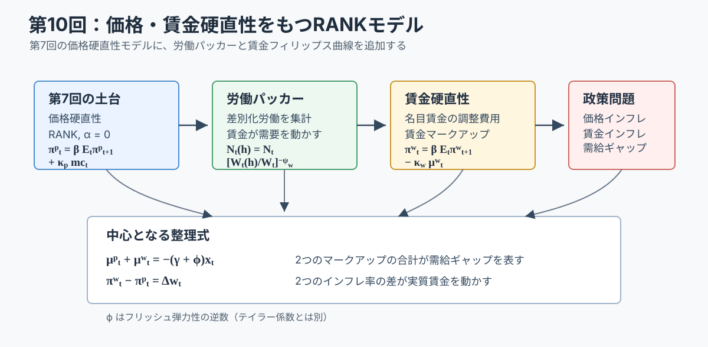
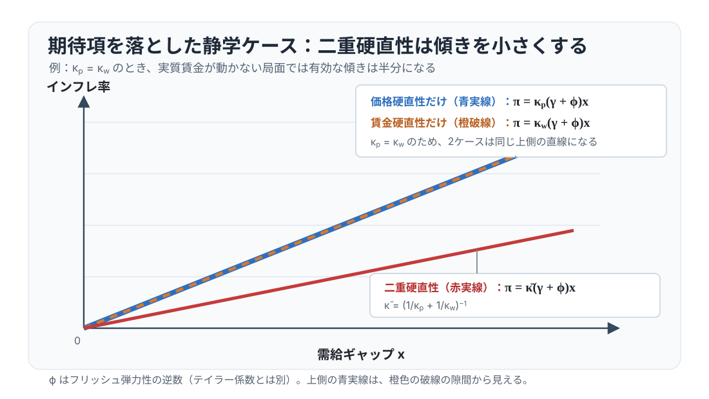

# 講義の目的

第10回では、第7回の価格硬直性モデルに **賃金硬直性** を加えます。家計は代表的家計のままです。したがって、ここで扱うのは TANK や HANK ではなく、二重の名目硬直性をもつ RANKモデルです。

この回でも、第7回と同じく
$$
\alpha=0
$$
と置きます。生産関数は線形で、政府支出も導入しません。したがって、新しく学ぶことは収穫逓減や財政ではなく、価格と賃金という2つの名目変数がゆっくり調整されるとき、ニューケインジアン・モデルの方程式がどう変わるかです。

この回は、第7回で導いた価格硬直性の RANKモデルに賃金硬直性を加え、二重の名目硬直性が価格設定、賃金設定、実質賃金の調整をどう変えるかを確認します。第9回で扱った神々の配剤と裁量政策への応用は発展補論にまとめ、授業時間に余裕がある場合に扱います。

先に結論をまとめると、価格硬直性だけのモデルと比べた主な違いは次の通りです。

| 論点 | 価格硬直性だけの RANKモデル | 価格・賃金硬直性をもつ RANKモデル |
|---|---|---|
| 家計 | 代表的家計 | 代表的家計 |
| 労働市場 | 同質労働、柔軟賃金 | 差別化された労働、労働集計業者（労働パッカー）、硬直的名目賃金 |
| 賃金条件 | $\mu^w_t=0$ | $\pi^w_t=\beta\mathbb{E}_t\pi^w_{t+1}-\kappa_w\mu^w_t$ |
| 価格インフレ率 | 価格マークアップに反応 | 価格マークアップに反応 |
| 賃金インフレ率 | 登場しない | 賃金マークアップに反応 |
| 実質賃金 | 即時に調整 | 価格インフレ率と賃金インフレ率の差でゆっくり調整 |
| 厚生損失に入る変数 | 需給ギャップ、価格インフレ率 | 需給ギャップ、価格インフレ率、賃金インフレ率 |
| 完全安定化 | コストプッシュ・ウェッジがなければ2変数を同時にゼロにできる | 効率的実質賃金を動かすショックのもとでは3変数を同時にゼロにできない |

価格補助金と賃金補助金が定常的なマークアップ歪みを取り除くため、この回では柔軟価格・柔軟賃金の自然配分が効率的です。したがって、
$$
y_t^e=y_t^f,
\qquad
r_t^e=r_t^f,
\qquad
x_t=y_t-y_t^f=y_t-y_t^e
$$
です。第9回の厚生上の産出ギャップと同じ対象を、以下では自然産出量を使って表します。

この回の中心となる2式は
$$
\mu_t^p+\mu_t^w=-(\gamma+\varphi)x_t,
\qquad
\pi_t^w-\pi_t^p=\Delta w_t
$$
第1式は2つのマークアップと需給ギャップを結び、第2式は価格・賃金インフレ率の差が実質賃金を動かすことを示します。以下では、労働パッカーと賃金設定からこの2式を導きます。神々の配剤と金融政策への含意は発展補論で扱います。

@fig-lecture10-overview は、この回の流れをまとめています。価格硬直性は企業の価格設定から、賃金硬直性は家計の賃金設定から生じます。2つの名目硬直性は、実質賃金を通じて結びつきます。

{#fig-lecture10-overview width=95%}

# 表記と基本設定

大文字は水準、小文字はゼロインフレ定常状態からの対数乖離を表します。この回では $\alpha=0$、政府支出なし、技術の定常状態 $a=0$、$\nu=1$ と置き、技術水準 $\exp(a)=1$ の定常状態で
$$
N=Y=C=W=1,
\qquad
MU^p=MU^w=1
$$
となるように正規化します。

この講義では価格硬直性と賃金硬直性を同時に扱うため、この講義に限り、価格に関する変数には上付き $p$、賃金に関する変数には上付き $w$ を付けます。たとえば、他の回で $\pi_t$ と書いていた価格インフレ率は、この回では $\pi_t^p$ と書き、賃金インフレ率を $\pi_t^w$ と書きます。代替弾力性や調整費用などのパラメータは、対応して $\psi_p,\eta_p$ と $\psi_w,\eta_w$ のように下付き $p,w$ で区別します。

主な水準・非線形変数は次の通りです。

| 記号 | 意味 |
|---|---|
| $C_t$ | 消費 |
| $N_t$ | 労働投入 |
| $N_t(h)$ | 労働タイプ $h$ の労働供給 |
| $Y_t$ | 産出 |
| $W_t^N$ | 集計名目賃金 |
| $W_t^N(h)$ | 労働タイプ $h$ の名目賃金 |
| $s_t^w(h)=W_t^N(h)/W_t^N$ | 労働タイプ $h$ の相対賃金 |
| $W_t=W_t^N/P_t$ | 集計実質賃金 |
| $P_t$ | 最終財価格 |
| $\Pi_t^p=P_t/P_{t-1}$ | 価格の粗インフレ率 |
| $\Pi_t^w=W_t^N/W_{t-1}^N$ | 賃金の粗インフレ率 |
| $R_t^N$ | 粗名目利子率 |
| $Q_{t,t+1}$ | 確率的割引因子 |
| $MU_t^p$ | 価格マークアップ |
| $MU_t^w$ | 賃金マークアップ |
| $a_t$ | 対数技術水準（技術水準は $\exp(a_t)$） |

主な対数乖離変数は次の通りです。

| 記号 | 意味 |
|---|---|
| $c_t,y_t,n_t,w_t$ | 消費、産出、労働、実質賃金の対数乖離 |
| $\pi_t^p=\log\Pi_t^p$ | 価格インフレ率の乖離 |
| $\pi_t^w=\log\Pi_t^w$ | 賃金インフレ率の乖離 |
| $r_t^N=\log(R_t^N/R^N)$ | 名目利子率の乖離 |
| $r_t=r_t^N-\mathbb{E}_t\pi^p_{t+1}$ | 事前実質利子率 |
| $\mu_t^p$ | 価格マークアップの対数乖離 |
| $\mu_t^w$ | 賃金マークアップの対数乖離 |
| $y_t^f=y_t^e$ | 柔軟価格・柔軟賃金の自然産出量。この回では効率的産出量に等しい |
| $r_t^f=r_t^e$ | 自然実質利子率。この回では効率的配分を支える実質利子率に等しい |
| $x_t=y_t-y_t^f=y_t-y_t^e$ | 厚生上の産出ギャップ |

主なパラメータは次の通りです。

| 記号 | 意味 |
|---|---|
| $\alpha=0$ | 線形生産に固定する生産関数パラメータ |
| $\nu=1$ | 労働不効用の水準の正規化 |
| $\beta\in(0,1)$ | 主観的割引因子 |
| $\gamma>0$ | 異時点間代替弾力性の逆数 |
| $\varphi>0$ | フリッシュ弾力性の逆数 |
| $\psi_p>1$ | 中間財の代替弾力性 |
| $\eta_p>0$ | Rotemberg 型価格調整費用パラメータ |
| $\psi_w>1$ | 労働タイプ間の代替弾力性 |
| $\eta_w>0$ | Rotemberg 型賃金調整費用パラメータ |
| $\tau_p$ | 売上補助金率 |
| $\tau_w$ | 賃金補助金率 |
| $\phi>1$ | テイラー・ルールのインフレ反応係数 |
| $\rho_a,\rho_m$ | 技術ショック、金融政策ショックの持続性 |

以下では
$$
\kappa_p\equiv\frac{\psi_p}{\eta_p},
\qquad
\kappa_w\equiv\frac{\psi_w}{\eta_w}
$$
と書きます。$\kappa_p$ は価格マークアップに対する価格インフレ率の反応、$\kappa_w$ は賃金マークアップに対する賃金インフレ率の反応を表します。調整費用パラメータ $\eta_p,\eta_w$ が大きいほど、インフレ率はマークアップのずれに対して緩やかに反応します。

```{=latex}
\Needspace{0.18\textheight}
```

ここでの $\eta_p,\eta_w$ は Rotemberg 型調整費用の構造パラメータです。対応する厚生上の相対重みを、第9回と同じく $\omega_p,\omega_w$ と書きます。具体的な正規化は目的関数の補論で示します。

期間効用は
$$
U(C_t,N_t)
=
\begin{cases}
\dfrac{C_t^{1-\gamma}}{1-\gamma}
-\dfrac{N_t^{1+\varphi}}{1+\varphi},
& \gamma\neq1,\\[6pt]
\log C_t-\dfrac{N_t^{1+\varphi}}{1+\varphi},
& \gamma=1
\end{cases}
$$
とします。この関数形と $\nu=1$ のもとでは、消費で測った労働の限界不効用は
$$
MRS(C_t,N_t)=C_t^\gamma N_t^\varphi
$$
です。賃金設定ではこの限界代替率を使います。

# モデルの部品

## 価格硬直性

価格ブロックは第7回と同じです。中間財企業 $j$ は価格 $P_t(j)$ を選び、最終財で測った Rotemberg 型価格調整費用 $f_P(\Pi_t^p)Y_t$ を支払います。ここで
$$
f_P(\Pi_t^p)=\frac{\eta_p}{2}(\Pi_t^p-1)^2,
\qquad
\eta_p>0
$$

定常状態の価格マークアップ歪みを取り除くため、売上補助金 $\tau_p$ を
$$
1+\tau_p=\frac{1}{1-1/\psi_p}
$$
と置きます。このときゼロインフレ定常状態で $MU^p=1$ です。

対称均衡では、価格設定条件は
$$
\eta_p\Pi_t^p(\Pi_t^p-1)
=
\psi_p
\left\{
\frac{1}{MU_t^p}
-
(1+\tau_p)\left(1-\frac{1}{\psi_p}\right)
\right\}
+
\eta_p\mathbb{E}_t
\left[
Q_{t,t+1}
\frac{Y_{t+1}}{Y_t}
\Pi_{t+1}^p(\Pi_{t+1}^p-1)
\right]
$$
です。第7回では実質限界費用 $MC_t$ を使って書きました。この回では後の賃金ブロックとそろえるため、価格マークアップを次で定義します。
$$
MU_t^p\equiv\frac{\exp(a_t)}{W_t}
$$
$\alpha=0$ なので、労働の限界生産物は $\exp(a_t)$ です。

第7回の記号との関係もここで確認しておきます。第7回では実質限界費用を
$$
MC_t=\frac{W_t}{\exp(a_t)}
$$
と書きました。価格マークアップはその逆数です。
$$
MU_t^p=\frac{1}{MC_t}
$$
したがって、ゼロインフレ定常状態で $MC=MU^p=1$ の周りで対数線形化すると、
$$
\mu_t^p=-mc_t
$$
です。第7回の価格フィリップス曲線を
$$
\pi_t^p
=
\beta\mathbb{E}_t\pi_{t+1}^p
+
\kappa_p mc_t
$$
と書くなら、この回のマークアップ表示では
$$
\pi_t^p
=
\beta\mathbb{E}_t\pi_{t+1}^p
-
\kappa_p\mu_t^p
$$
です。同じ式を、実質限界費用で見るか、価格マークアップで見るかの違いです。

## 労働パッカー

賃金硬直性を導入するため、労働は差別化されているとします。労働タイプ $h\in[0,1]$ は、それぞれ名目賃金 $W_t^N(h)$ を設定します。労働パッカーは、差別化された労働を集計し、同質的な労働投入 $N_t$ として中間財企業に販売します。

これは、第6回の Dixit--Stiglitz 型の財集計を労働市場に置いたものです。最終財企業が差別化された中間財を集計したように、労働パッカーは差別化された労働サービスを集計します。

労働集計関数は次の式です。
$$
N_t
=
\left[
\int_0^1
N_t(h)^{\frac{\psi_w-1}{\psi_w}}dh
\right]^{\frac{\psi_w}{\psi_w-1}},
\qquad
\psi_w>1
$$
労働パッカーは、各タイプの名目賃金 $\{W_t^N(h)\}_{h\in[0,1]}$ と集計名目賃金 $W_t^N$ を所与として、次の利潤を最大化します。
$$
W_t^N N_t-\int_0^1 W_t^N(h)N_t(h)dh
$$

一階条件から、労働タイプ $h$ への需要は
$$
N_t(h)
=
N_t
\left(
\frac{W_t^N(h)}{W_t^N}
\right)^{-\psi_w}
$$
です。相対的に高い名目賃金を設定した労働タイプには、少ない労働需要しか来ません。

集計名目賃金は
$$
W_t^N
=
\left[
\int_0^1
W_t^N(h)^{1-\psi_w}dh
\right]^{\frac{1}{1-\psi_w}}
$$
です。対称均衡では、すべての労働タイプが同じ賃金を設定するので、$W_t^N(h)=W_t^N$、$N_t(h)=N_t$ です。ただし、各タイプは自分の賃金を限界的に変更したときに労働需要がどう変わるかを理解して賃金を選びます。この点が、同質労働の柔軟賃金モデルとの違いです。

## 賃金設定と賃金調整費用

代表的家計は、多数の労働タイプを含む家計と考えます。家計内では完全な保険があり、すべての構成員は同じ消費 $C_t$ を得ます。一方で、各労働タイプ $h$ は自分の名目賃金 $W_t^N(h)$ を設定します。

賃金設定を考えるときだけ、労働不効用の内訳を明示します。労働タイプ $h$ の不効用を
$$
\frac{N_t(h)^{1+\varphi}}{1+\varphi}
$$
とし、家計全体の労働不効用は各タイプの不効用を集計したものとします。対称均衡では $N_t(h)=N_t$ なので、本編で使う集計表記
$$
\frac{N_t^{1+\varphi}}{1+\varphi}
$$
に戻ります。

労働タイプ $h$ は、上で導いた労働需要 $N_t(h)=N_t[W_t^N(h)/W_t^N]^{-\psi_w}$ を所与として、自分の名目賃金を選びます。賃金補助金がある場合、家計が受け取る実効実質賃金は
$$
(1+\tau_w)\frac{W_t^N(h)}{P_t}
$$
です。補助金の財源は一括税で賄われると考え、ここでは集計資源制約に影響しないものとして扱います。

名目賃金を変更すると、家計は最終財で測った費用
$$
f_W\left(\frac{W_t^N(h)}{W_{t-1}^N(h)}\right)Y_t
$$
を支払うとします。Rotemberg 型の標準的な特定化は
$$
f_W(\Pi_t^w)=\frac{\eta_w}{2}(\Pi_t^w-1)^2,
\qquad
\eta_w>0
$$
です。

賃金マークアップを
$$
MU_t^w
\equiv
\frac{W_t}{MRS(C_t,N_t)}
$$
と定義します。ここで $MRS(C_t,N_t)$ は、消費で測った労働の限界不効用です。賃金が柔軟でも、差別化された労働の独占力があるため、一般には
$$
MU_t^w
=
\frac{1}
{(1+\tau_w)(1-1/\psi_w)}
$$
です。以下で設定する是正補助金のもとで初めて $MU_t^w=1$ になります。賃金が硬直的なら、賃金マークアップはこの効率的な基準から毎期ずれます。

第7回の価格設定問題と同じように、個別の相対賃金を状態変数として明示します。労働タイプ $h$ の相対賃金を
$$
s_t^w(h)\equiv \frac{W_t^N(h)}{W_t^N}
$$
と書くと、個別賃金インフレ率は
$$
\Pi_t^w(h)
\equiv
\frac{W_t^N(h)}{W_{t-1}^N(h)}
=
\frac{s_t^w(h)}{s_{t-1}^w(h)}\Pi_t^w
$$
です。したがって、前期の相対賃金 $s_{t-1}^w(h)$ は、今期の賃金調整費用に入る状態変数になります。

労働タイプ $h$ の価値を $V_t^w(s_{t-1}^w(h))$ と書きます。各タイプは集計変数 $\{C_t,N_t,Y_t,W_t,W_t^N\}$ を所与として、自分の相対賃金 $s_t^w(h)$ を選びます。消費財で測った Bellman方程式は
$$
\begin{aligned}
V_t^w(s_{t-1}^w(h))
=
\max_{s_t^w(h)}
\Bigg\{
&
(1+\tau_w)W_t s_t^w(h)N_t(h)
-
\int_0^{N_t(h)}
MRS(C_t,n)\,dn
\\
&
-f_W(\Pi_t^w(h))Y_t
+
\mathbb{E}_t
\left[
Q_{t,t+1}V_{t+1}^w(s_t^w(h))
\right]
\Bigg\}.
\end{aligned}
$$
第1項は賃金補助金込みの労働所得、第2項は消費財で測った労働不効用、第3項は賃金調整費用です。労働需要 $N_t(h)=N_t s_t^w(h)^{-\psi_w}$ を使うので、賃金を高く設定すると賃金収入は増えますが、労働需要は減ります。

$s_t^w(h)$ に関する一階条件は
$$
\begin{aligned}
0
=&
\psi_w W_tN_t(h)
\left\{
\frac{1}{MU_t^w(h)}
-
(1+\tau_w)\left(1-\frac{1}{\psi_w}\right)
\right\}
\\
&
-Y_t f_W'(\Pi_t^w(h))
\frac{\Pi_t^w}{s_{t-1}^w(h)}
+
\mathbb{E}_t
\left[
Q_{t,t+1}
V_{s,t+1}^w(s_t^w(h))
\right],
\end{aligned}
$$
です。ここで
$$
MU_t^w(h)
\equiv
\frac{W_t s_t^w(h)}{MRS(C_t,N_t(h))}
$$
です。中括弧の中は、個別賃金が柔軟賃金条件からどれだけずれているかを表します。

包絡線条件は
$$
V_{s,t}^w(s_{t-1}^w(h))
=
Y_t f_W'(\Pi_t^w(h))
\frac{\Pi_t^w(h)}{s_{t-1}^w(h)}
$$
です。今日の選択変数 $s_t^w(h)$ は、来期には状態変数になります。したがって、1期先の包絡線条件を使うと、
$$
V_{s,t+1}^w(s_t^w(h))
=
Y_{t+1} f_W'(\Pi_{t+1}^w(h))
\frac{\Pi_{t+1}^w(h)}{s_t^w(h)}
$$
と置き換えられます。

対称均衡では $s_t^w(h)=s_{t-1}^w(h)=1$、$N_t(h)=N_t$、$MU_t^w(h)=MU_t^w$、$\Pi_t^w(h)=\Pi_t^w$ です。これらを一階条件に代入して $Y_t$ で割ると、
$$
\begin{aligned}
\Pi_t^w f_W'(\Pi_t^w)
={}&
\psi_w
\left\{
\frac{1}{MU_t^w}
-
(1+\tau_w)\left(1-\frac{1}{\psi_w}\right)
\right\}
\frac{W_tN_t}{Y_t}
\\
&+
\mathbb{E}_t
\left[
Q_{t,t+1}
\frac{Y_{t+1}}{Y_t}
\Pi_{t+1}^w f_W'(\Pi_{t+1}^w)
\right]
\end{aligned}
$$
この式では、第7回の価格設定条件で実質限界費用が出てきた場所に、賃金マークアップのずれが入ります。

定常状態の賃金マークアップ歪みを取り除くため、賃金補助金 $\tau_w$ を
$$
1+\tau_w=\frac{1}{1-1/\psi_w}
$$
と置きます。さらに $f_W'(\Pi_t^w)=\eta_w(\Pi_t^w-1)$ を代入すると、対称均衡の賃金設定条件は
$$
\begin{aligned}
\eta_w\Pi_t^w(\Pi_t^w-1)
={}&
\psi_w
\left\{
\frac{1}{MU_t^w}
-
(1+\tau_w)\left(1-\frac{1}{\psi_w}\right)
\right\}
\frac{W_tN_t}{Y_t}
\\
&+
\eta_w\mathbb{E}_t
\left[
Q_{t,t+1}
\frac{Y_{t+1}}{Y_t}
\Pi_{t+1}^w(\Pi_{t+1}^w-1)
\right]
\end{aligned}
$$
です。右辺の第1項は、現在の賃金マークアップが望ましい水準からどれだけずれているかを表します。右辺の第2項は、将来の賃金変更費用を表します。

## 家計・企業・金融政策

家計の名目債券に関する一階条件は
$$
1
=
\mathbb{E}_t
\left[
Q_{t,t+1}
\frac{R_t^N}{\Pi_{t+1}^p}
\right],
\qquad
Q_{t,t+1}
=
\beta
\frac{U_C(C_{t+1},N_{t+1})}{U_C(C_t,N_t)}
$$
です。価格の粗インフレ率で割った名目利子率が、事前の実質収益率です。

企業は労働パッカーから同質労働 $N_t$ を雇い、生産します。$\alpha=0$ なので、集計生産関数は
$$
Y_t=\exp(a_t)N_t
$$
です。企業の価格設定式も、このブロックに含めておきます。対称均衡では
$$
\eta_p\Pi_t^p(\Pi_t^p-1)
=
\psi_p
\left\{
\frac{1}{MU_t^p}
-
(1+\tau_p)\left(1-\frac{1}{\psi_p}\right)
\right\}
+
\eta_p\mathbb{E}_t
\left[
Q_{t,t+1}
\frac{Y_{t+1}}{Y_t}
\Pi_{t+1}^p(\Pi_{t+1}^p-1)
\right]
$$
です。ここで、$\alpha=0$ の価格マークアップは
$$
MU_t^p=\frac{\exp(a_t)}{W_t}
$$
です。第7回の実質限界費用表記では $MC_t=W_t/\exp(a_t)$ なので、同じ価格設定式を $MU_t^p=1/MC_t$ で書き換えているだけです。

価格調整費用と賃金調整費用は実物資源を使うため、資源制約は
$$
Y_t
=
C_t
+
\frac{\eta_p}{2}(\Pi_t^p-1)^2Y_t
+
\frac{\eta_w}{2}(\Pi_t^w-1)^2Y_t
$$
です。ただし、ゼロインフレ定常状態の周りの一次近似では、これらの調整費用は二次の項なので落ちます。

中央銀行は、第7回と同じテイラー・ルールで名目利子率を設定します。
$$
R_t^N
=
\frac{1}{\beta}\exp(-m_t)(\Pi_t^p)^\phi,
\qquad
\phi>1
$$
ショック $m_t$ は正負を取り、正の実現値が同じ価格インフレ率のもとで名目利子率を下げる金融緩和ショックです。

# 非線形体系と定常状態

上で定めた効用関数を使い、補助金により定常状態の価格マークアップと賃金マークアップを取り除くと、非線形体系は次のようにまとめられます。
$$
\begin{aligned}
1
&=
\mathbb{E}_t
\left[
\beta
\left(\frac{C_{t+1}}{C_t}\right)^{-\gamma}
\frac{R_t^N}{\Pi_{t+1}^p}
\right],
\\
MU_t^w
&=
\frac{W_t}{C_t^\gamma N_t^\varphi},
\\
MU_t^p
&=
\frac{\exp(a_t)}{W_t},
\\
\frac{W_t}{W_{t-1}}
&=
\frac{\Pi_t^w}{\Pi_t^p},
\\
Y_t
&=
\exp(a_t)N_t,
\\
Y_t
&=
C_t
+
\frac{\eta_p}{2}(\Pi_t^p-1)^2Y_t
+
\frac{\eta_w}{2}(\Pi_t^w-1)^2Y_t,
\\
R_t^N
&=
\frac{1}{\beta}\exp(-m_t)(\Pi_t^p)^\phi.
\end{aligned}
$$
これに価格設定条件、賃金設定条件、外生ショック過程
$$
a_t=\rho_a a_{t-1}+e_t^a,
\qquad
m_t=\rho_m m_{t-1}+e_t^m
$$
を加えればモデルが閉じます。

## 定常状態

ゼロインフレ定常状態を考えます。技術の定常状態を $a=0$、つまり技術水準を $\exp(a)=1$ とし、価格の粗インフレ率と賃金の粗インフレ率を
$$
\Pi^p=\Pi^w=1
$$
と正規化します。調整費用はゼロなので、資源制約は
$$
Y=C
$$
です。補助金により
$$
MU^p=MU^w=1
$$
となります。

価格マークアップ $MU^p=\exp(a)/W$ から
$$
W=1
$$
です。賃金マークアップ $MU^w=W/(C^\gamma N^\varphi)$ から
$$
1=C^\gamma N^\varphi
$$
です。生産関数と資源制約から $C=Y=N$ なので、
$$
1=N^{\gamma+\varphi}
$$
です。したがって
$$
N=Y=C=W=1,
\qquad
MU^p=MU^w=1,
\qquad
\Pi^p=\Pi^w=1
$$
です。

定常状態の粗実質利子率を $R$ と書くと、粗実質利子率と粗名目利子率は第7回と同じく
$$
R=R^N=\frac{1}{\beta}
$$
です。

# 対数線形化と方程式リスト

ゼロインフレ定常状態の周りで対数線形化します。第10回では、価格調整費用と賃金調整費用は一次近似の資源制約には現れません。そのため
$$
y_t=c_t
$$
です。

第7回との違いは、労働市場と価格設定の書き方に集中します。対数線形化された体系は、次の方程式リストにまとめられます。

| No. | 名称 | 式 |
|---:|---|---|
| 1 | フィッシャー方程式 | $r_t=r_t^N-\mathbb{E}_t\pi^p_{t+1}$ |
| 2 | オイラー方程式 | $r_t=\gamma\mathbb{E}_t\Delta c_{t+1}$ |
| 3 | 資源制約 | $y_t=c_t$ |
| 4 | 生産関数 | $y_t=a_t+n_t$ |
| 5 | 価格マークアップ定義 | $\mu^p_t=y_t-n_t-w_t=a_t-w_t$ |
| 6 | 価格フィリップス曲線 | $\pi^p_t=-\kappa_p\mu^p_t+\beta\mathbb{E}_t\pi^p_{t+1}$ |
| 7 | 賃金マークアップ定義 | $\mu^w_t=w_t-\gamma c_t-\varphi n_t$ |
| 8 | 賃金インフレ恒等式 | $\pi^w_t=w_t-w_{t-1}+\pi^p_t$ |
| 9 | 賃金フィリップス曲線 | $\pi^w_t=-\kappa_w\mu^w_t+\beta\mathbb{E}_t\pi^w_{t+1}$ |
| 10 | テイラー・ルール | $r_t^N=\phi\pi^p_t-m_t$ |
| 11 | 技術ショック | $a_t=\rho_a a_{t-1}+e_t^a$ |
| 12 | 金融政策ショック | $m_t=\rho_m m_{t-1}+e_t^m$ |

: {tbl-colwidths="[6,28,66]"}

ここで
$$
\kappa_p=\frac{\psi_p}{\eta_p},
\qquad
\kappa_w=\frac{\psi_w}{\eta_w}
$$
です。第7回の価格硬直性だけの表に戻すには、上の表の5番から9番を次のように縮約すれば十分です。

まず、7番の賃金マークアップ定義に次の柔軟賃金条件を課します。
$$
\mu_t^w=0
$$
この条件から
$$
w_t=\gamma c_t+\varphi n_t
$$
となり、第7回の労働供給式を回収します。この場合、8番の賃金インフレ恒等式と9番の賃金フィリップス曲線は不要になります。

次に、5番の価格マークアップ定義を実質限界費用で書き直します。第7回の表では価格ブロックを $mc_t$ で書きました。第10回では、賃金マークアップと並べるために価格マークアップ $\mu_t^p$ で書いています。両者の関係は
$$
mc_t=w_t-a_t,
\qquad
\mu_t^p=a_t-w_t=-mc_t
$$
です。したがって、5番は第7回の労働需要式
$$
w_t=mc_t+a_t
$$
と同じ内容です。6番の価格フィリップス曲線も
$$
\pi_t^p=\beta\mathbb{E}_t\pi^p_{t+1}+\kappa_p mc_t
$$
と書けます。最後に $\pi_t^p=\pi_t$、$\kappa_p=\kappa_P$ と読めば、第7回の NKフィリップス曲線に戻ります。

逆に、第10回ではこの第7回の静学的な柔軟賃金条件を、7番から9番の賃金ブロックに置き換えます。そのため、価格フィリップス曲線は
$$
\pi_t^p=\beta\mathbb{E}_t\pi^p_{t+1}-\kappa_p\mu_t^p
$$
という価格マークアップ表示になりますが、実質限界費用が高いことは価格マークアップが低いことと同じです。

テイラー・ルールとフィッシャー方程式を組み合わせると、実質利子率は
$$
r_t
=
\phi\pi^p_t
-
\mathbb{E}_t\pi^p_{t+1}
-
m_t
$$
です。中央銀行は価格インフレ率に反応して名目利子率を設定します。賃金インフレ率にも反応させるルールは考えられますが、この回では第7回との比較を明確にするため、価格インフレ率だけに反応する標準的なテイラー・ルールを使います。

# マークアップで読む二重の名目硬直性

第7回では、実質限界費用を産出と技術だけで表し、そこから自然産出量と需給ギャップ表示を得ました。第10回でも同じ順序で考えます。ただし、賃金が硬直的なので、価格マークアップと賃金マークアップを分けて追跡する必要があります。

資源制約と生産関数から
$$
c_t=y_t,
\qquad
n_t=y_t-a_t
$$
です。価格マークアップ定義は
$$
\mu^p_t=a_t-w_t
$$
です。賃金マークアップ定義は
$$
\mu^w_t
=
w_t-\gamma y_t-\varphi(y_t-a_t)
=
w_t-(\gamma+\varphi)y_t+\varphi a_t
$$
です。

2つのマークアップを足すと、実質賃金 $w_t$ は消えます。
$$
\mu^p_t+\mu^w_t
=
(1+\varphi)a_t-(\gamma+\varphi)y_t
$$
この式が、第10回の中心です。価格硬直性だけのモデルでは、柔軟賃金により $\mu^w_t=0$ なので、価格マークアップだけが需給ギャップを表しました。賃金硬直性があると、価格マークアップと賃金マークアップの合計が、産出と技術のずれを表します。

価格と賃金がともに柔軟なら、$MU_t^p=MU_t^w=1$、つまり
$$
\mu^p_t=\mu^w_t=0
$$
です。このときの自然産出量は
$$
0
=
(1+\varphi)a_t-(\gamma+\varphi)y_t^f
$$
を満たすので、
$$
y_t^f
=
\frac{1+\varphi}{\gamma+\varphi}a_t
\equiv
\zeta_a a_t,
\qquad
\zeta_a
\equiv
\frac{1+\varphi}{\gamma+\varphi}
$$
です。$\alpha=0$ なので、自然産出量は第7回と同じです。

需給ギャップを
$$
x_t\equiv y_t-y_t^f
$$
と定義すると、
$$
\mu^p_t+\mu^w_t
=
-(\gamma+\varphi)x_t
$$
です。したがって、
$$
\mu^p_t
=
-(\gamma+\varphi)x_t-\mu^w_t
$$
と書けます。

この式を価格フィリップス曲線に代入すると、
$$
\pi^p_t
=
\beta\mathbb{E}_t\pi^p_{t+1}
+
\kappa_p\{(\gamma+\varphi)x_t+\mu^w_t\}
$$
です。価格インフレ率は、需給ギャップだけでなく、賃金マークアップにも反応します。

賃金フィリップス曲線は
$$
\pi^w_t
=
\beta\mathbb{E}_t\pi^w_{t+1}
-
\kappa_w\mu^w_t
$$
です。賃金マークアップが正、つまり実質賃金が労働供給の限界費用より高いと、家計は相対賃金を下げたいので、賃金インフレ率には下向きの圧力がかかります。

自然利子率は、第7回と同じく自然産出量を実現する実質利子率です。オイラー方程式から
$$
r_t^f
=
\gamma\mathbb{E}_t(y^f_{t+1}-y^f_t)
$$
です。技術ショックが
$$
a_{t+1}=\rho_a a_t+e^a_{t+1}
$$
に従うなら、
$$
r_t^f
=
\gamma\zeta_a(\rho_a-1)a_t
$$
です。

したがって、動学的 IS 曲線は
$$
x_t
=
\mathbb{E}_t x_{t+1}
-
\frac{1}{\gamma}(r_t-r_t^f)
$$
です。ここまでは第7回と同じです。違いは、インフレ率のブロックが1本ではなく、価格インフレ率と賃金インフレ率の2本になることです。

## 整理形

第10回のモデルは、次の形で読むと見通しがよくなります。
$$
\begin{aligned}
x_t
&=
\mathbb{E}_t x_{t+1}
-
\frac{1}{\gamma}(r_t-r_t^f),
\\
\pi^p_t
&=
\beta\mathbb{E}_t\pi^p_{t+1}
+
\kappa_p\{(\gamma+\varphi)x_t+\mu^w_t\},
\\
\pi^w_t
&=
\beta\mathbb{E}_t\pi^w_{t+1}
-
\kappa_w\mu^w_t,
\\
\pi^w_t
&=
w_t-w_{t-1}+\pi^p_t,
\\
r_t
&=
\phi\pi^p_t
-
\mathbb{E}_t\pi^p_{t+1}
-
m_t.
\end{aligned}
$$
この整理形では、賃金マークアップ $\mu^w_t$ が追加の内生変数として残ります。したがって、第7回のように $x_t$ と $\pi_t$ だけでインフレ・需要ブロックを閉じることはできません。

実質賃金は
$$
w_t
=
a_t+(\gamma+\varphi)x_t+\mu^w_t
$$
と回収できます。賃金インフレ恒等式は、名目賃金インフレ率と価格インフレ率の差が実質賃金の変化を作ることを表します。
$$
\pi^w_t-\pi^p_t
=
w_t-w_{t-1}
$$

# 第7回との比較

第7回では、価格が硬直的でも賃金は柔軟でした。そのため、実質賃金は毎期
$$
w_t=\gamma c_t+\varphi n_t
$$
を満たし、賃金マークアップは常にゼロでした。価格インフレ率だけを追跡すれば、名目硬直性の効果を分析できました。

第10回では、実質賃金がただちには限界代替率に一致しません。名目賃金がゆっくりしか変わらないため、実質賃金は価格インフレ率と賃金インフレ率の差によって動きます。

この違いは、技術ショックを考えると明確です。正の技術ショックが起きると、柔軟価格・柔軟賃金の経済では自然産出量が上がり、実質賃金も上がります。第7回の価格硬直性モデルでは、賃金が柔軟なので、実質賃金はすぐに調整できます。

しかし、賃金も硬直的なら、実質賃金を上げるには
$$
\pi^w_t>\pi^p_t
$$
が必要です。価格インフレ率と賃金インフレ率を同時に完全安定化すると、実質賃金は動けません。したがって、二重の名目硬直性のもとでは、価格インフレ安定化、賃金インフレ安定化、需給ギャップ安定化の間に追加のトレードオフが生じます。

## 賃金硬直性のみの場合

逆に、価格は柔軟で、賃金だけが硬直的な場合を考えます。価格が柔軟であれば、企業は実質限界費用を常に定常値に保つので、
$$
mc_t=0
$$
です。これは価格マークアップの乖離がゼロ、$\mu_t^p=0$、という条件と同じです。

二重の名目硬直性モデルで得た賃金フィリップス曲線は
$$
\pi_t^w
=
\beta\mathbb{E}_t\pi_{t+1}^w
+
\kappa_w\{(\gamma+\varphi)x_t-mc_t\}
$$
でした。これは、賃金マークアップ表示
$$
\pi_t^w
=
\beta\mathbb{E}_t\pi_{t+1}^w
-
\kappa_w\mu_t^w
$$
に
$$
mc_t=(\gamma+\varphi)x_t+\mu_t^w
$$
を代入したものです。したがって
$$
-\mu_t^w=(\gamma+\varphi)x_t-mc_t
$$
です。価格が柔軟なら $mc_t=0$ なので、
$$
\pi_t^w
=
\beta\mathbb{E}_t\pi_{t+1}^w
+
\kappa_w(\gamma+\varphi)x_t
$$
これは、賃金インフレ率を左辺に置いた NKフィリップス曲線です。

賃金インフレ恒等式は
$$
\pi_t^w
=
mc_t-mc_{t-1}
+
(a_t-a_{t-1})
+
\pi_t^p
$$
です。価格が柔軟なら $mc_t=mc_{t-1}=0$ なので、
$$
\pi_t^w
=
\pi_t^p+(a_t-a_{t-1})
$$
です。したがって、技術ショックがない場合、つまり
$$
a_t=0
\quad
\text{for all }t
$$
なら、
$$
\pi_t^w=\pi_t^p
$$
です。

このとき、賃金硬直性のみのモデルは
$$
\begin{aligned}
x_t
&=
\mathbb{E}_t x_{t+1}
-
\frac{1}{\gamma}(r_t-r_t^f),
\\
\pi_t
&=
\beta\mathbb{E}_t\pi_{t+1}
+
\kappa_w(\gamma+\varphi)x_t
\end{aligned}
$$
と書けます。ただし $\pi_t=\pi_t^w=\pi_t^p$ です。第7回の価格硬直性のみのモデルは
$$
\begin{aligned}
x_t
&=
\mathbb{E}_t x_{t+1}
-
\frac{1}{\gamma}(r_t-r_t^f),
\\
\pi_t
&=
\beta\mathbb{E}_t\pi_{t+1}
+
\kappa_p(\gamma+\varphi)x_t
\end{aligned}
$$
でした。したがって、$a_t=0$ のもとでは、価格硬直性のみのモデルと賃金硬直性のみのモデルは同じ形の2本のNK方程式に縮約されます。違いは、インフレ率の背後にある調整費用が価格か賃金か、そして傾きが $\kappa_p(\gamma+\varphi)$ か $\kappa_w(\gamma+\varphi)$ かだけです。$\kappa_p=\kappa_w$ なら、$x_t$ と $\pi_t$ を決める方程式は完全に同じです。

ただし、これは集計需要とインフレ率の方程式が同じという意味であり、実質賃金や配当まで同じという意味ではありません。第7回と同じく、価格補助金と企業に課す一括税を相殺した純配当を考えます。$\alpha=0$ で調整費用の一次項を落とすと、純配当を定常産出で割った一次近似は
$$
d_t
=
y_t-(w_t+n_t)
$$
技術ショックがなければ $a_t=0$ かつ $n_t=y_t$ なので、
$$
d_t=-w_t
$$
です。

価格硬直性のみで賃金が柔軟な場合、労働供給条件から
$$
w_t=(\gamma+\varphi)x_t
$$
です。したがって
$$
d_t=-(\gamma+\varphi)x_t
$$
となります。一方、賃金硬直性のみで価格が柔軟な場合は $mc_t=w_t-a_t=0$ なので、$a_t=0$ なら
$$
w_t=0,
\qquad
d_t=0
$$
です。つまり、$x_t$ と $\pi_t$ の動学が同じ形でも、労働所得と配当の分解は異なります。RANKでは家計が労働所得、配当、補助金財源の一括税をまとめて負担するため、この違いは集計消費の式には出にくくなります。家計を分ける TANK では、配当だけでなく補助金財源の負担をどの家計へ帰着させるかも分配を変えます。ここでの比較は、所得分解の会計的な違いを示すものです。

この同値性は、技術ショックがないときに限られます。$a_t$ が動くと、賃金硬直性のみのモデルでは
$$
\pi_t^w-\pi_t^p=a_t-a_{t-1}
$$
となり、実質賃金を動かすために賃金インフレ率と価格インフレ率が分かれます。この点が、価格硬直性のみのモデルとの本質的な違いです。

第9回のロス関数は
$$
x_t^2+\omega_p(\pi_t^p)^2
$$
でした。賃金硬直性を入れると、自然な拡張は
$$
x_t^2+\omega_p(\pi_t^p)^2+\omega_w(\pi_t^w)^2
$$
です。補論で導出するように、価格インフレ率だけでなく、賃金インフレ率も資源配分上の損失を表すようになります。

# まとめと第11回への接続

この回では、第7回の $\alpha=0$ の価格硬直性モデルに、労働パッカーと Rotemberg 型賃金調整費用を導入しました。方程式リストで見ると、価格硬直性だけのモデルからの変更点は明確です。柔軟賃金条件 $\mu^w_t=0$ が消え、賃金マークアップ定義、賃金インフレ恒等式、賃金フィリップス曲線が追加されます。

この回の中心式は
$$
\mu^p_t+\mu^w_t
=
-(\gamma+\varphi)x_t
$$
です。価格硬直性だけのモデルでは、価格マークアップが需給ギャップを直接表しました。賃金硬直性を加えると、価格マークアップと賃金マークアップの合計が需給ギャップを表します。

発展補論では、この二重硬直性を第9回の政策問題へ応用します。効率的実質賃金を動かすショックのもとで神々の配剤が崩れる理由と、Markov 裁量政策で将来の政策関数を固定しながら、翌期状態を通じる民間期待と継続損失の変化を考慮する理由を確認します。この政策分析は第10回の本編を理解するための必須項目ではありません。

第11回では、家計異質性の効果を分離するため、賃金を再び柔軟にして第7回の価格硬直性モデルへ戻ります。そのうえで家計を貯蓄家計（saver）と手元流動性制約家計（hand-to-mouth）に分け、代表的家計の Euler 方程式だけでは集計需要を記述できなくなることを確認します。第10回で確認した賃金所得と配当所得の会計的な違いは、TANK では所得の受取先と税負担の帰着を明示する必要があることを予告しています。

# 参考文献

**必読**

- Erceg, Christopher J., Dale W. Henderson, and Andrew T. Levin (2000) "Optimal Monetary Policy with Staggered Wage and Price Contracts." *Journal of Monetary Economics*, 46(2), 281-313. [doi](https://doi.org/10.1016/S0304-3932(00)00028-3). 価格・賃金硬直性のもとで生じる3変数間の政策トレードオフの基礎文献。
- Rotemberg, Julio J. (1982) "Sticky Prices in the United States." *Journal of Political Economy*, 90(6), 1187-1211. [doi](https://doi.org/10.1086/261117). 本講義で使う調整費用型の名目硬直性の原典。
- Galí, Jordi (2015) *Monetary Policy, Inflation, and the Business Cycle* (2nd ed.). Princeton University Press. 賃金硬直性をRANKモデルへ組み込む標準的参照先。
- Woodford, Michael (2003) *Interest and Prices: Foundations of a Theory of Monetary Policy*. Princeton University Press. 価格・賃金硬直性の厚生評価を深く学ぶため。

**発展**

- Christiano, Lawrence J., Martin Eichenbaum, and Charles L. Evans (2005) "Nominal Rigidities and the Dynamic Effects of a Shock to Monetary Policy." *Journal of Political Economy*, 113(1), 1-45. [doi](https://doi.org/10.1086/426038)
- Smets, Frank, and Raf Wouters (2003) "An Estimated Dynamic Stochastic General Equilibrium Model of the Euro Area." *Journal of the European Economic Association*, 1(5), 1123-1175. [doi](https://doi.org/10.1162/154247603770383415)
- Calvo, Guillermo A. (1983) "Staggered Prices in a Utility-Maximizing Framework." *Journal of Monetary Economics*, 12(3), 383-398. [doi](https://doi.org/10.1016/0304-3932(83)90060-0)
- Svensson, Lars E. O. (2010) "Inflation Targeting." *Handbook of Monetary Economics*, Vol. 3B, Chapter 22, 1237-1302. [著者版](https://larseosvensson.se/files/papers/HandbookIT.pdf). §3.8 は、内生状態をもつモデルの裁量政策と民間期待の扱いを説明します。

```{=latex}
\Needspace{0.35\textheight}
```

# 演習問題

## 基本問題

**問1 [Core] [Derivation]：労働パッカー**

労働集計関数
$$
N_t
=
\left[
\int_0^1
N_t(h)^{\frac{\psi_w-1}{\psi_w}}dh
\right]^{\frac{\psi_w}{\psi_w-1}}
$$
のもとで、労働パッカーの利潤最大化問題から
$$
N_t(h)
=
N_t
\left(
\frac{W_t^N(h)}{W_t^N}
\right)^{-\psi_w}
$$
を導出しなさい。

**問2 [Core]：賃金フィリップス曲線の符号**

賃金フィリップス曲線
$$
\pi^w_t
=
\beta\mathbb{E}_t\pi^w_{t+1}
-
\kappa_w\mu^w_t
$$
で、$\mu^w_t$ の係数が負になる理由を説明しなさい。

**問3 [Core] [Derivation]：マークアップと需給ギャップ**

$c_t=y_t$、$n_t=y_t-a_t$、
$$
\mu^p_t=a_t-w_t,
\qquad
\mu^w_t=w_t-\gamma c_t-\varphi n_t
$$
から
$$
\mu^p_t+\mu^w_t=-(\gamma+\varphi)x_t
$$
を導出しなさい。ただし
$$
x_t=y_t-\frac{1+\varphi}{\gamma+\varphi}a_t
$$
です。

**問4 [Core]：技術ショックと実質賃金**

正の技術ショックが発生し、自然実質賃金が上昇する状況を考えます。賃金インフレ率と価格インフレ率を同時にゼロに固定すると、なぜ実質賃金が調整できないのか説明しなさい。

```{=latex}
\Needspace{0.42\textheight}
```

## 発展問題

**問5 [Research extension] [Derivation]：二期間で学ぶ Markov 裁量政策**

$0<\beta<1$、$q\equiv\gamma+\varphi>0$、$K\equiv\kappa_wq>0$ とし、$t=0,1$ の二期間を考えます。各期の損失は
$$
\ell_t=\frac12\left[x_t^2+\omega_p(\pi_t^p)^2+\omega_w(\pi_t^w)^2\right]
$$
です。$z_t\equiv mc_t$、$s_t\equiv mc_{t-1}$ と置くと、$s_1=z_0$ です。初期状態 $s_0$ と当期の技術変化 $d_0\equiv a_0-a_{-1}$ は所与とし、翌期の技術変化は $d_1\equiv a_1-a_0=0$ とします。第1期には不確実性がなく、第2期の期待値と継続損失を
$$
\mathbb E_1\pi_2^p=\mathbb E_1\pi_2^w=\mathbb E_1x_2=0,
\qquad V_2=0
$$
と設定します。Taylorルールに代えて裁量的な政策最適化を考え、金利制約は置きません。中央銀行は第1期に再最適化します。各期の配分は、後の政策補論で示す価格・賃金Phillips曲線と賃金インフレ恒等式を満たします。

1. **終端期を先に解く。** 第1期の3つの制約を、$s_1$ を所与とする選択変数 $z_1$ だけの式に直しなさい。次に $\ell_1$ を $z_1$ で微分し、次の静学ターゲット条件を導きなさい。

$$
(1+\kappa_p+\kappa_w)x_1
+K\left[\kappa_p\omega_p\pi_1^p
+(1+\kappa_p)\omega_w\pi_1^w\right]=0.
$$

2. **将来政策の状態依存性を残す。** (1)の終端解は、$s_1$ に対する係数を $a_p,a_w,a_x$ として

$$
\pi_1^p=a_ps_1,\qquad \pi_1^w=a_ws_1,\qquad x_1=a_xs_1,
$$
$$
V_1(s_1)=\frac12P s_1^2,\qquad
P=a_x^2+\omega_pa_p^2+\omega_wa_w^2
$$

と書けます。第0期の中央銀行はこれらの**関数**を変更できません。$s_1=z_0$ を使い、$F_j(z_0)\equiv\mathbb E_0\pi_1^j$（$j=p,w$）、$F_x(z_0)\equiv\mathbb E_0x_1$、$\Gamma_0^{mc}\equiv\beta V_1'(z_0)$ を求めなさい。関数を固定しても、$z_0$ を動かすと期待値が動く理由を説明しなさい。

3. **第0期を解く。** $\ell_0+\beta V_1(z_0)$ を最小化します。(2)で求めた期待を民間制約に代入し、$\pi_0^p,\pi_0^w,x_0$ を $z_0$ の関数として書きなさい。その微分、またはラグランジュ乗数を使い、

$$
\widehat\kappa_{p,0}\equiv\kappa_p+\beta a_p,
\qquad
\widehat\kappa_{w,0}\equiv\kappa_w-\beta a_w
$$

のもとで

$$
\begin{aligned}
&(1+\widehat\kappa_{p,0}+\widehat\kappa_{w,0})x_0\\
&\quad+K\left[
\widehat\kappa_{p,0}\omega_p\pi_0^p
+(1+\widehat\kappa_{p,0})\omega_w\pi_0^w+\Gamma_0^{mc}
\right]=0
\end{aligned}
$$

を導きなさい。継続損失の微分 $\Gamma_0^{mc}$ と、民間期待の微分が別々に必要なことを説明しなさい。無限期間の問題への接続は @sec-markov-target で扱います。

**問6 [Research extension]：二期間の配分と政策金利**

問5で選ばれた配分を実装する実質利子率 $r_0,r_1$ と名目利子率 $r_0^N,r_1^N$ を、IS曲線とフィッシャー関係
$$
r_t=r_t^f+\gamma(\mathbb E_t x_{t+1}-x_t),
\qquad r_t^N=r_t+\mathbb E_t\pi_{t+1}^p
$$
から求めなさい。第0期には $F_j(mc_0)=a_jmc_0$、第1期には翌期期待がゼロであることを使います。自然利子率 $r_t^f$ は所与です。

さらに、問5の条件が配分のターゲット条件であり、政策金利の反応関数ではないことを説明しなさい。配分を支持する金利を求めることと、特定の金利ルールのもとで合理的期待均衡の一意性を証明することも区別しなさい。

```{=latex}
\Needspace{0.45\textheight}
```

**問7 [Research extension] [Derivation]：柔軟賃金モデルへの縮約**

賃金調整費用を最初から $\eta_w=0$ としたモデルを考えます。本講義と同じ是正補助金のもとで、賃金マークアップ乖離は $\mu_t^w=0$、したがって $mc_t=qx_t$ です。$\omega_w=0$ となり、価格と産出に関する経済的に必要な状態は外生状態だけになります。

この縮約モデルの価格Phillips曲線と損失関数から
$$
x_t+\kappa_p(\gamma+\varphi)\omega_p\pi_t^p=0
$$
を直接導出しなさい。さらに、価格インフレ率・需給ギャップ・価値関数が $s_t=mc_{t-1}$ に依存しなくても、賃金インフレ恒等式から $g_{w,s}=-1$ が残ることを示しなさい。

**任意の追加問：** $\eta_w>0$ の正則な解を $\eta_w\downarrow0$ としたとき、一般ターゲット条件が同じ式に収束するために必要な追加条件を、@sec-markov-flex-limit を参考に述べなさい。$\Gamma^{mc}\to0$ だけで十分かも検討しなさい。

```{=latex}
\clearpage
```

# 補論（発展）：期待項を落とした静学ケース

この補論は、動学的な期待項を落として価格・賃金マークアップの関係を確認する発展項目です。授業時間に余裕がある場合に扱います。

ここまでのモデルは動学モデルなので、本来は将来の期待を含めて解く必要があります。ただし、二重の名目硬直性が何をしているかを見るだけなら、期待項を落とした静学ケースが有用です。ここでは、定量分析の較正としてではなく、代数構造を見せるために将来インフレの期待項をゼロとして扱います。
$$
\mathbb{E}_t\pi_{t+1}^p=\mathbb{E}_t\pi_{t+1}^w=0
$$
と置きます。割引因子 $\beta$ は通常通り $0<\beta<1$ のパラメータであり、この節では期待項そのものを捨象しています。

このとき、価格フィリップス曲線と賃金フィリップス曲線は
$$
\pi_t^p
=
-\kappa_p\mu_t^p,
\qquad
\pi_t^w
=
-\kappa_w\mu_t^w
$$
ここで中心式
$$
\mu_t^p+\mu_t^w
=
-(\gamma+\varphi)x_t
$$
を使うと、
$$
\frac{\pi_t^p}{\kappa_p}
+
\frac{\pi_t^w}{\kappa_w}
=
(\gamma+\varphi)x_t
$$
この関係は、需給ギャップが作るインフレ圧力を、価格インフレ率と賃金インフレ率が分担していることを表します。

さらに、実質賃金の変化を
$$
\Delta w_t
\equiv
w_t-w_{t-1}
=
\pi_t^w-\pi_t^p
$$
と書きます。上の2本を $\pi_t^p,\pi_t^w$ について解くと、
$$
\pi_t^p
=
\frac{\kappa_p\kappa_w}{\kappa_p+\kappa_w}
(\gamma+\varphi)x_t
-
\frac{\kappa_p}{\kappa_p+\kappa_w}\Delta w_t,
$$
$$
\pi_t^w
=
\frac{\kappa_p\kappa_w}{\kappa_p+\kappa_w}
(\gamma+\varphi)x_t
+
\frac{\kappa_w}{\kappa_p+\kappa_w}\Delta w_t.
$$

この2本から、二重硬直性の直観がかなりはっきりします。実質賃金を上げる必要があるとき、つまり $\Delta w_t>0$ のときには、賃金インフレ率は価格インフレ率より高くならなければなりません。逆に、価格インフレ率と賃金インフレ率を同時に同じ値へ固定すると、実質賃金は動けません。

特に、実質賃金が動かない局面、すなわち
$$
\Delta w_t=0
$$
を考えると、
$$
\pi_t^p=\pi_t^w
=
\bar{\kappa}(\gamma+\varphi)x_t,
\qquad
\bar{\kappa}
\equiv
\left(
\frac{1}{\kappa_p}
+
\frac{1}{\kappa_w}
\right)^{-1}
$$
です。$\bar{\kappa}$ は $\kappa_p$ と $\kappa_w$ の調和平均型の合成係数です。価格硬直性だけなら傾きは $\kappa_p(\gamma+\varphi)$、賃金硬直性だけなら $\kappa_w(\gamma+\varphi)$ ですが、価格と賃金が両方とも硬直的で実質賃金が動かない場合、有効な傾きは $\bar{\kappa}(\gamma+\varphi)$ になります。

例えば $\kappa_p=\kappa_w$ なら、
$$
\bar{\kappa}
=
\frac{\kappa_p}{2}.
$$
したがって、二重硬直性の静学ケースでは、同じ需給ギャップに対する共通インフレ率の反応は、価格硬直性だけの場合の半分になります。これは、二重硬直性が「より多くの調整対象を作る」だけでなく、実質賃金の調整を通じてインフレと需給ギャップの関係を鈍くすることを示しています。

@fig-lecture10-static-slopes は、この静学ケースの傾きを示しています。図は $\Delta w_t=0$ の特殊ケースを描いたものであり、動学モデル全体の解ではありません。目的は、価格と賃金の2つの硬直性が有効なフィリップス曲線の傾きを小さくすることを視覚化する点にあります。

{#fig-lecture10-static-slopes width=90%}

# 補論（発展）：目的関数の導出

この補論では、第9回と同じ考え方で、効用関数と資源制約を二階近似し、中央銀行の目的関数を導きます。ここでは対称均衡の周りで近似し、賃金分散から生じる追加的な厚生項は扱いません。賃金硬直性の厚生損失は、Rotemberg 型賃金調整費用を通じて表します。

本編と同じく、$\alpha=0$、政府支出なし、$\nu=1$ とします。定常状態は次の通りです。
$$
C=N=Y=W=1,
\qquad
MU^p=MU^w=1
$$
この定常状態の周りで近似します。価格と賃金の定常状態マークアップは補助金で取り除かれているとします。

## 資源制約の二階近似

価格調整費用と賃金調整費用を含む資源制約は
$$
Y_t
=
C_t
+
\frac{\eta_p}{2}(\Pi_t^p-1)^2Y_t
+
\frac{\eta_w}{2}(\Pi_t^w-1)^2Y_t
$$
です。したがって
$$
C_t
=
Y_t
\left[
1
-
\frac{\eta_p}{2}(\Pi_t^p-1)^2
-
\frac{\eta_w}{2}(\Pi_t^w-1)^2
\right]
$$
この式が、調整費用を差し引いた消費可能な資源を表します。

インフレ率は粗インフレ率の対数乖離なので、
$$
\Pi_t^p-1=\pi_t^p+O(2),
\qquad
\Pi_t^w-1=\pi_t^w+O(2)
$$
調整費用はすでに二階の項なので、二階近似では
$$
\frac{\eta_p}{2}(\Pi_t^p-1)^2
+
\frac{\eta_w}{2}(\Pi_t^w-1)^2
=
\frac{\eta_p}{2}(\pi_t^p)^2
+
\frac{\eta_w}{2}(\pi_t^w)^2
+O(3)
$$
と書けます。これを $\Phi_t$ と置くと、
$$
\Phi_t
\equiv
\frac{\eta_p}{2}(\pi_t^p)^2
+
\frac{\eta_w}{2}(\pi_t^w)^2
$$
$\Phi_t$ は二階の小さい量です。

資源制約を対数で書くと
$$
c_t
=
y_t+\log(1-\Phi_t)
=
y_t-\Phi_t+O(3)
$$
です。したがって二階まででは
$$
c_t
=
y_t
-
\frac{\eta_p}{2}(\pi_t^p)^2
-
\frac{\eta_w}{2}(\pi_t^w)^2
+O(3)
$$
価格インフレ率と賃金インフレ率は、調整費用を通じて消費可能な財を減らします。

```{=latex}
\Needspace{0.28\textheight}
```

## 効用関数の二階近似

$\gamma\neq1$ のとき、期間効用は
$$
U(C_t,N_t)
=
\frac{C_t^{1-\gamma}}{1-\gamma}
-
\frac{N_t^{1+\varphi}}{1+\varphi}
$$
です。$C_t=\exp(c_t)$、$N_t=\exp(n_t)$ と書き、定常状態の周りで二階近似します。一般に、$Z_t=\exp(z_t)$ なら
$$
Z_t^q
=
1+qz_t+\frac{q^2}{2}z_t^2+O(3)
$$
です。したがって
$$
\frac{C_t^{1-\gamma}}{1-\gamma}
=
\text{const.}
+
c_t
+
\frac{1-\gamma}{2}c_t^2
+O(3)
$$
となります。$\gamma=1$ では消費の効用に $\log C_t=c_t$ を用います。これは $C=1$ の正規化のもとで厳密に成り立つので、消費の二次項はゼロとなり、以下の期間効用の近似式も適用できます。労働不効用は
$$
\frac{N_t^{1+\varphi}}{1+\varphi}
=
\text{const.}
+
n_t
+
\frac{1+\varphi}{2}n_t^2
+O(3)
$$
です。以上から、期間効用の二階近似は
$$
U(C_t,N_t)
=
\text{const.}
+
c_t-n_t
+
\frac{1}{2}
\left\{
(1-\gamma)c_t^2
-
(1+\varphi)n_t^2
\right\}
+O(3)
$$

$\Phi_t$ は二階の項なので、二次項の中では $c_t=y_t+O(2)$ と置けます。一方、線形項では資源費用を残す必要があります。生産関数 $Y_t=\exp(a_t)N_t$ から
$$
y_t=a_t+n_t,
\qquad
n_t=y_t-a_t
$$
です。これらを代入すると、
$$
\begin{aligned}
U(C_t,N_t)
=
&\text{const.}
+y_t-\Phi_t-(y_t-a_t)
\\
&+
\frac{1}{2}
\left[
(1-\gamma)y_t^2
-
(1+\varphi)(y_t-a_t)^2
\right]
+O(3).
\end{aligned}
$$
整理すると、
$$
U(C_t,N_t)
=
\text{const.}
+a_t
-\Phi_t
+
\frac{1}{2}
\left[
-(\gamma+\varphi)y_t^2
+2(1+\varphi)a_t y_t
-(1+\varphi)a_t^2
\right]
+O(3)
$$
です。

ここで、技術ショック $a_t$ だけに依存する項は政策で選べないため、目的関数から落とせます。平方完成すると、
$$
U(C_t,N_t)
=
\text{policy-independent terms}
-
\frac{\gamma+\varphi}{2}
\left(
y_t-\frac{1+\varphi}{\gamma+\varphi}a_t
\right)^2
-
\Phi_t
+O(3)
$$
です。

第7回と同じく、柔軟価格・柔軟賃金の自然産出量は
$$
y_t^f
=
\frac{1+\varphi}{\gamma+\varphi}a_t
$$
です。需給ギャップを
$$
x_t\equiv y_t-y_t^f
$$
と定義すると、期間効用は
$$
U(C_t,N_t)
=
\text{policy-independent terms}
-
\frac{1}{2}
\left[
(\gamma+\varphi)x_t^2
+
\eta_p(\pi_t^p)^2
+
\eta_w(\pi_t^w)^2
\right]
+O(3)
$$
と書けます。

## 目的関数

政策に依存しない項を落とすと、効用最大化は次の厚生損失を最小化する問題と同じです。
$$
\ell_t
=
\frac{1}{2}
\left[
(\gamma+\varphi)x_t^2
+
\eta_p(\pi_t^p)^2
+
\eta_w(\pi_t^w)^2
\right].
$$
したがって、中央銀行の目的関数は
$$
\mathbb{E}_0
\sum_{t=0}^{\infty}
\beta^t
\ell_t
$$
です。

正の定数 $\gamma+\varphi$ で割っても最適政策は変わらないので、本編では次の正規化を使えます。
$$
\ell_t
=
\frac{1}{2}
\left[
x_t^2
+
\omega_p(\pi_t^p)^2
+
\omega_w(\pi_t^w)^2
\right],
\qquad
\omega_p
=
\frac{\eta_p}{\gamma+\varphi},
\qquad
\omega_w
=
\frac{\eta_w}{\gamma+\varphi}.
$$

第9回の価格硬直性だけの目的関数は、この式で $\eta_w=0$、または賃金インフレ安定化の項を落とした特殊ケースです。第10回では賃金調整費用が実物資源を使うため、賃金インフレ率も厚生損失に入ります。

```{=latex}
\Needspace{0.35\textheight}
```

# 補論（発展）：神々の配剤と最適金融政策

この補論は、第10回の二重名目硬直性を第9回の最適金融政策へ応用します。授業時間に余裕がある場合に扱う発展項目です。本編の中心である価格・賃金フィリップス曲線、マークアップの合計、実質賃金の調整を理解するためには、この補論は必須ではありません。

## 縮約表現

最適政策を考えるには、実質限界費用を明示した方が見通しがよくなります。第10回の記号では
$$
mc_t
=
w_t-a_t
=
(\gamma+\varphi)x_t+\mu_t^w
=
-\mu_t^p
$$
と置けます。$mc_t$ は、第7回で使った実質限界費用の乖離です。価格マークアップで見れば、その符号を反転したものです。

この記号を使うと、政策分析に必要な主要式は次のように書けます。
$$
\begin{aligned}
x_t
&=
\mathbb{E}_t x_{t+1}
-
\frac{1}{\gamma}(r_t-r_t^f),
\\
\pi_t^p
&=
\beta\mathbb{E}_t\pi_{t+1}^p+\kappa_p mc_t,
\\
\pi_t^w
&=
\beta\mathbb{E}_t\pi_{t+1}^w
+
\kappa_w\{(\gamma+\varphi)x_t-mc_t\},
\\
\pi_t^w
&=
mc_t-mc_{t-1}
+
(a_t-a_{t-1})
+
\pi_t^p.
\end{aligned}
$$
第2式は価格フィリップス曲線です。第3式は賃金フィリップス曲線を $mc_t$ で書き直したものです。第4式は賃金インフレ恒等式です。実質賃金は $w_t=mc_t+a_t$ なので、名目賃金インフレ率は実質限界費用、技術、価格インフレ率の動きで決まります。

## 効率的実質賃金が動くと神々の配剤が崩れる

価格硬直性だけのベースラインでは、コストプッシュショックがなければ、中央銀行は価格インフレ率と需給ギャップを同時にゼロにできました。これが第9回で扱った神々の配剤です。

価格と賃金がともに硬直的で、技術ショックなどが効率的実質賃金を動かすと、この性質は成立しません。$\alpha=0$ の本モデルでは効率的実質賃金が $w_t^e=a_t$ なので、技術ショックに応じて実質賃金を動かす必要があります。しかし名目賃金も価格も硬直的なら、実質賃金を動かすには賃金インフレ率と価格インフレ率の差が必要です。

```{=latex}
\Needspace{0.24\textheight}
```

この点は、上の縮約表現から確認できます。中央銀行が厳格な価格インフレ目標として、すべての時点で次を実現するとします。
$$
\pi_t^p=0
$$
このとき価格フィリップス曲線から、安定的な解では
$$
mc_t=0
$$
が必要です。さらに、柔軟配分も実現して
$$
x_t=0
$$
としたいとします。この場合、賃金フィリップス曲線は
$$
\pi_t^w
=
\beta\mathbb{E}_t\pi_{t+1}^w
$$
となるため、安定的な解では $\pi_t^w=0$ です。

しかし、賃金インフレ恒等式は
$$
\pi_t^w
=
a_t-a_{t-1}
$$
を要求します。技術ショックが動く限り、右辺は一般にゼロではありません。したがって、価格インフレ率をゼロに固定しながら、同時に需給ギャップもゼロにすることは一般にはできません。

この結論は、第9回の政策問題との重要な違いです。技術ショックなど効率的実質賃金の経路を変えるショックのもとでは、価格インフレ安定化、賃金インフレ安定化、厚生上の産出ギャップ安定化の3つを同時に完全達成できません。反対に、効率的実質賃金を動かさない需要ショックだけなら、二重硬直性があるという理由だけでこの不可能性が生じるわけではありません。

## Markov 裁量政策と二期間の足場

補論で導いた厚生損失を使うと、中央銀行は
$$
\frac12\mathbb E_0\sum_{t=0}^{\infty}\beta^t
\left[x_t^2+\omega_p(\pi_t^p)^2+\omega_w(\pi_t^w)^2\right]
$$
を最小化します。ここでは金利制約や金利平滑化費用を置かず、自然利子率を観察して必要な実質利子率を実装できるとします。この最適化は本編のTaylorルールに代わる政策設定です。

第9回との違いは、実質限界費用 $mc_t$ が翌期の状態になることです。賃金インフレ恒等式を1期先へ進めると、$mc_t$ は翌期に所与の変数として残ります。したがって、裁量政策で所与とするのは将来の政策**関数**です。当期の $mc_t$ を動かせば、その関数を評価する翌期状態が変わります。中央銀行は、将来の損失だけでなく、当期のPhillips曲線に入る将来インフレ期待の変化も考慮します。

この点は問5の二期間問題で確認できます。終端の第1期で翌期期待と継続損失をゼロとすると、$s_1=mc_0$ を所与として静学問題を解けます。その解を
$$
\pi_1^p=a_ps_1,\qquad\pi_1^w=a_ws_1,\qquad
x_1=a_xs_1,\qquad V_1(s_1)=\frac12P s_1^2
$$
と書きます。第0期の中央銀行は係数 $a_p,a_w,a_x,P$ を変更できません。しかし $mc_0$ を選び直すと
$$
\mathbb E_0\pi_1^p=a_pmc_0,\qquad
\mathbb E_0\pi_1^w=a_wmc_0,\qquad
\beta V_1'(mc_0)=\beta Pmc_0
$$
が変わります。最後の式が継続損失の限界効果 $\Gamma_0^{mc}$ です。最初の2つの期待微分も、第0期の最適条件に入ります。

無限期間では、同じ区別を将来政策関数と価値関数の固定点として表します。完全な一階条件、一般ターゲット条件、包絡条件は次の発展補論で導きます。これらの導出は本編の価格・賃金Phillips曲線と実質賃金の調整を理解するための必須項目ではありません。

## ターゲット条件と金利による実装

ターゲット条件は望ましい配分を記述します。配分が決まったあと、それを支持する実質利子率と名目利子率は
$$
\begin{aligned}
r_t&=r_t^f+\gamma\left(\mathbb E_t x_{t+1}-x_t\right),\\
r_t^N&=r_t+\mathbb E_t\pi_{t+1}^p
\end{aligned}
$$
から求めます。これらはIS曲線とフィッシャー関係による実装式です。特定の金利反応ルールを定め、そのルールのもとで合理的期待均衡が一意になることを証明したわけではありません。問6では二期間の期待関数を使って、この実装金利を具体的に求めます。

柔軟賃金モデルとの比較では、$\eta_w=0$ の縮約モデルを直接解くと、第9回の条件
$$
x_t+\kappa_p(\gamma+\varphi)\omega_p\pi_t^p=0
$$
が得られます。正の調整費用からの極限には、継続損失だけでなく期待関数の状態依存性についても条件が必要です。この区別は問7と @sec-markov-flex-limit で扱います。

# 補論（発展）：Markov 裁量政策のターゲット条件 {#sec-markov-target}

この補論では、将来の政策関数を固定しながら、その引数である翌期状態の変化を微分に残します。問5の二期間問題を無限期間へ拡張し、民間期待と継続損失の2つの経路を明示します。

## 状態と期待関数

期首の内生状態と当期の選択を
$$
s_t\equiv mc_{t-1},\qquad z\equiv mc_t=s_{t+1}
$$
と置きます。$z$ はこの導出の略記です。外生状態 $\xi_t$ は、$a_t-a_{t-1}$、自然利子率、翌期の条件付き分布を決める情報を含みます。たとえば技術がAR(1)に従う場合も、賃金インフレ恒等式を評価するために $(a_t,a_{t-1})$ を含めます。移行核 $\mathcal P(d\xi'\mid\xi)$ は当期政策の影響を受けないとします。

将来の価格インフレ率、賃金インフレ率、需給ギャップの政策関数を $g_p(s,\xi),g_w(s,\xi),g_x(s,\xi)$ とし、
$$
F_j(z,\xi)\equiv\int g_j(z,\xi')\mathcal P(d\xi'\mid\xi),
\qquad j\in\{p,w,x\}
$$
と定義します。$F_{j,z}$ は第1引数による偏微分です。中央銀行は将来の政策関数を変更できませんが、当期の $z$ を選ぶことで翌期状態を変えられます。**関数を固定することと、その期待値を固定することは異なります。**

継続損失の限界効果は
$$
\Gamma^{mc}(z,\xi)
\equiv\beta\int V_s(z,\xi')\mathcal P(d\xi'\mid\xi)
$$
と定めます。$V_s$ は価値関数の第1引数による微分です。$\Gamma^{mc}$ は継続損失の微分だけを表し、民間期待の制約微分を含みません。

裁量でも将来の状態を通じて民間期待が当期政策に反応する扱いは、Svensson の *Inflation Targeting*、§3.8・式(3.51)にも示されています。以下の条件は本講義の制約から導きます。

## Bellman問題と均衡の固定点

略記を
$$
q\equiv\gamma+\varphi>0,\qquad K\equiv\kappa_wq>0,
\qquad d(\xi)\equiv a_t-a_{t-1}
$$
とします。$0<\beta<1$、$\gamma>0$、$\kappa_j=\psi_j/\eta_j>0$、$\omega_j=\eta_j/q>0$、$j=p,w$ です。実質利子率 $r$ は自由に選べるとし、金利制約や金利平滑化費用、Taylorルールは追加制約として課しません。

滑らかな内点解を対象として、価値関数を
$$
\begin{aligned}
V(s,\xi)=\min_{\pi^p,\pi^w,x,z,r}\Bigl\{
&\tfrac12\bigl[x^2+\omega_p(\pi^p)^2+\omega_w(\pi^w)^2\bigr]\\
&+\beta\int V(z,\xi')\mathcal P(d\xi'\mid\xi)\Bigr\}
\end{aligned}
$$
と書きます。制約は
$$
\begin{aligned}
\kappa_pz+\beta F_p(z,\xi)-\pi^p&=0,\\
Kx-\kappa_wz+\beta F_w(z,\xi)-\pi^w&=0,\\
z-s+d(\xi)+\pi^p-\pi^w&=0,\\
F_x(z,\xi)-(r-r^f(\xi))/\gamma-x&=0
\end{aligned}
$$ {#eq-l10-markov-constraints}
です。順に価格Phillips曲線、賃金Phillips曲線、賃金インフレ恒等式、IS曲線に対応します。

全状態で、この最適化から得る $\pi^p,\pi^w,x$ が予想した $g_p,g_w,g_x$ と一致し、継続価値が $V$ に一致することが均衡の固定点条件です。一階条件だけで均衡の存在や一意性が保証されるわけではありません。有限期間では将来政策関数と価値関数に時点を付け、終端から後ろ向きに解きます。

```{=latex}
\Needspace{0.42\textheight}
```

## 完全な一階条件

@eq-l10-markov-constraints の各左辺を $C_1,\ldots,C_4$ と呼び、ラグランジュ関数を
$$
\mathcal L=\ell+\beta\int V(z,\xi')\mathcal P(d\xi'\mid\xi)
+\sum_{k=1}^4\Lambda_k C_k
$$
とします。$\pi^p,x,\pi^w,z,r$ の一階条件は
$$
\begin{aligned}
\omega_p\pi^p-\Lambda_1+\Lambda_3&=0,\\
x+K\Lambda_2-\Lambda_4&=0,\\
\omega_w\pi^w-\Lambda_2-\Lambda_3&=0,\\
(\kappa_p+\beta F_{p,z})\Lambda_1
+(-\kappa_w+\beta F_{w,z})\Lambda_2&\\
\quad+\Lambda_3+F_{x,z}\Lambda_4+\Gamma^{mc}&=0,\\
-\Lambda_4/\gamma&=0
\end{aligned}
$$ {#eq-l10-markov-focs}
です。$z$ の条件には、継続損失の微分 $\Gamma^{mc}$ に加えて、民間期待の微分が入ります。

実質利子率の条件から $\Lambda_4=0$ となるため、ISの期待微分 $F_{x,z}\Lambda_4$ は消えます。一方、価格・賃金Phillips曲線から生じる
$$
\beta F_{p,z}\Lambda_1+\beta F_{w,z}\Lambda_2
$$
は一般には消えません。これらを落とすと、問5で求めた将来政策の状態依存性を無視した別の問題になります。

## 一般ターゲット条件

有効な限界係数を
$$
\widehat\kappa_p\equiv\kappa_p+\beta F_{p,z},\qquad
\widehat\kappa_w\equiv\kappa_w-\beta F_{w,z}
$$
と置きます。これらは構造パラメータではなく、一般には $(z,\xi)$ に依存し、正とは限りません。

他の一階条件から
$$
\Lambda_2=-\frac{x}{K},\qquad
\Lambda_3=\omega_w\pi^w+\frac{x}{K},\qquad
\Lambda_1=\omega_p\pi^p+\Lambda_3
$$
を得ます。これを $z$ の一階条件へ代入すると
$$
\widehat\kappa_p\omega_p\pi^p
+(1+\widehat\kappa_p)\omega_w\pi^w
+\frac{1+\widehat\kappa_p+\widehat\kappa_w}{K}x
+\Gamma^{mc}=0
$$
です。従って一般ターゲット条件は
$$
\boxed{\begin{aligned}
&(1+\widehat\kappa_p+\widehat\kappa_w)x\\
&\quad+K\left[
\widehat\kappa_p\omega_p\pi^p
+(1+\widehat\kappa_p)\omega_w\pi^w+\Gamma^{mc}
\right]=0.
\end{aligned}}
$$ {#eq-l10-markov-target}

この表示は $1+\widehat\kappa_p+\widehat\kappa_w\ne0$ を仮定しません。$x$ について解いた表示を使う場合には、その係数が非ゼロであることを別途確認する必要があります。

## 一変数還元による確認

$(s,\xi)$ を固定し、民間制約を順に解くと
$$
\begin{aligned}
\pi^p(z)&=\kappa_pz+\beta F_p(z,\xi),\\
\pi^w(z)&=z-s+d(\xi)+\pi^p(z),\\
x(z)&=\frac{\pi^w(z)+\kappa_wz-\beta F_w(z,\xi)}{K}
\end{aligned}
$$
となります。従って
$$
\pi^p_z=\widehat\kappa_p,\qquad
\pi^w_z=1+\widehat\kappa_p,\qquad
x_z=\frac{1+\widehat\kappa_p+\widehat\kappa_w}{K}.
$$

還元した目的関数 $J(z)$ の微分は
$$
J_z=xx_z+\omega_p\pi^p\pi^p_z+\omega_w\pi^w\pi^w_z+\Gamma^{mc}
$$
です。$J_z=0$ に $K$ を掛けると @eq-l10-markov-target に一致します。問5の二期間問題では、終端政策の線形性を使ってこの微分を具体的に計算できます。

非線形な将来政策関数のもとでは、一般にこの式は必要条件です。将来政策がアフィンで継続価値が凸二次なら、還元した目的関数の凸性を確認することで十分性を検証できます。

## 包絡条件と実装金利

外生状態 $\xi$ を固定すると、現在の所与状態 $s$ は賃金インフレ恒等式の $-s$ だけに現れます。包絡定理より
$$
V_s(s,\xi)=-\Lambda_3(s,\xi)
$$
です。従って均衡経路では
$$
\begin{aligned}
\Gamma_t^{mc}&=-\beta\mathbb E_t\Lambda_{3,t+1}\\
&=-\beta\mathbb E_t\left[
\omega_w\pi_{t+1}^w+\frac{x_{t+1}}{K}\right].
\end{aligned}
$$ {#eq-l10-markov-envelope}

これは所与状態 $s$ による微分です。当期選択 $z$ が将来期待を変える効果を省略する理由にはなりません。@eq-l10-markov-envelope を使うと、ターゲット条件は同値に
$$
\begin{aligned}
&(1+\widehat\kappa_{p,t}+\widehat\kappa_{w,t})x_t\\
&\quad+K\left[\widehat\kappa_{p,t}\omega_p\pi_t^p
+(1+\widehat\kappa_{p,t})\omega_w\pi_t^w\right]\\
&\quad-\beta\mathbb E_t\left[x_{t+1}+K\omega_w\pi_{t+1}^w\right]=0
\end{aligned}
$$
と表せます。

配分を支持する金利は
$$
r_t=r_t^f+\gamma[F_x(mc_t,\xi_t)-x_t],\qquad
r_t^N=r_t+F_p(mc_t,\xi_t)
$$
で復元します。講義と同じく、金利は定常値からの乖離です。金利に制約を置く場合には $\Lambda_4=0$ が一般に成立せず、このターゲット条件も見直す必要があります。

## 期待を固定した静学問題と終端期

期待値を外から固定して当期損失だけを最小化する問題では
$$
F_{p,z}=F_{w,z}=0,\qquad\Gamma^{mc}=0
$$
です。このとき @eq-l10-markov-target は
$$
(1+\kappa_p+\kappa_w)x
+K\left[\kappa_p\omega_p\pi^p+(1+\kappa_p)\omega_w\pi^w\right]=0
$$
に縮約されます。翌期期待と継続損失をともにゼロに設定する終端期も、この場合に含まれます。問5の第1期がその例です。

$\Gamma^{mc}=0$ だけでは、この縮約は一般に保証されません。損失だけを有限期で打ち切り、民間期待には状態依存の将来政策を残す場合、期待の微分は残ります。特定の点で微分項が偶然相殺することと、一般的なターゲット条件が一致することは区別します。

## 柔軟賃金モデルと正則な極限 {#sec-markov-flex-limit}

### 調整費用がゼロのモデルを直接解く

$\eta_w=0$ とすると、本講義と同じ是正補助金のもとで賃金マークアップ乖離は $\mu_t^w=0$ となり、$\omega_w=0$、$mc_t=qx_t$ が成立します。価格と産出の制約・損失から継承状態 $s_t$ が消えるため、経済的に必要な状態だけに依存する基本的なMarkov解では
$$
g_{p,s}=g_{x,s}=V_s=0
$$
です。価格Phillips曲線と当期損失の最小化
$$
\pi_t^p=\kappa_pqx_t+\beta\mathbb E_t\pi_{t+1}^p,
\qquad
\min_{x_t}\ \frac12\left[x_t^2+\omega_p(\pi_t^p)^2\right]
$$
から
$$
\boxed{x_t+\kappa_p(\gamma+\varphi)\omega_p\pi_t^p=0}
$$
を得ます。この縮約では将来期待と継続損失が当期選択に依存しません。$\kappa_p(\gamma+\varphi)$ は、第9回の価格硬直性だけのPhillips曲線の傾きです。

ただし、賃金インフレ恒等式は
$$
\pi_t^w=qx_t-s_t+d(\xi_t)+\pi_t^p
$$
なので、$g_{w,s}=-1$ が残ります。価格と産出に不要な状態となっても、賃金インフレ率の記述には過去の実質賃金が必要です。ここでは経済的に不要な履歴への依存を許した全均衡の一意性は主張していません。

### 正の調整費用からの極限を取る場合

$\eta_w>0$ のモデルから比較する場合には、
$$
\eta_w\downarrow0,\qquad
\kappa_w=\psi_w/\eta_w\to\infty,\qquad
\omega_w=\eta_w/q\to0
$$
のもとで正則な解の列を考えます。さらに
$$
\widehat\kappa_p\to\kappa_p,\qquad
\frac{\widehat\kappa_w}{\kappa_w}\to1,\qquad
\Gamma^{mc}\to0
$$
と、配分・必要な導関数の有界性を確認します。@eq-l10-markov-target を $\kappa_w$ で割ると
$$
\begin{aligned}
&\frac{1+\widehat\kappa_p+\widehat\kappa_w}{\kappa_w}x\\
&\quad+q\left[
\widehat\kappa_p\omega_p\pi^p
+(1+\widehat\kappa_p)\omega_w\pi^w+\Gamma^{mc}\right]=0
\end{aligned}
$$
となり、以上の条件のもとで価格硬直性だけのターゲット条件に収束します。$\Gamma^{mc}\to0$ という仮定だけでは、この縮約を保証できません。$g_{w,s}\to-1$ でも $\widehat\kappa_w/\kappa_w\to1$ とは両立するため、全ての将来政策関数の状態微分がゼロになる必要もありません。
