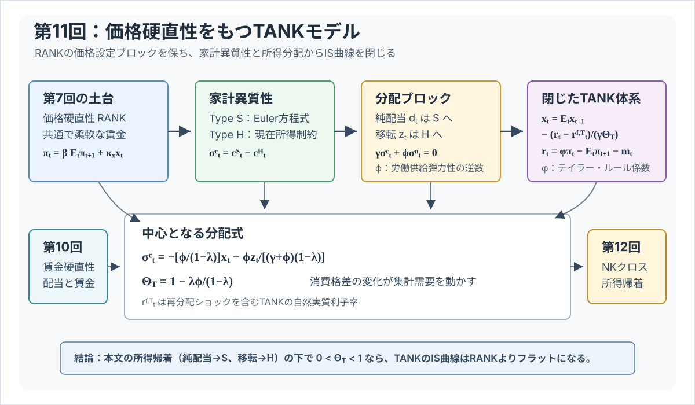
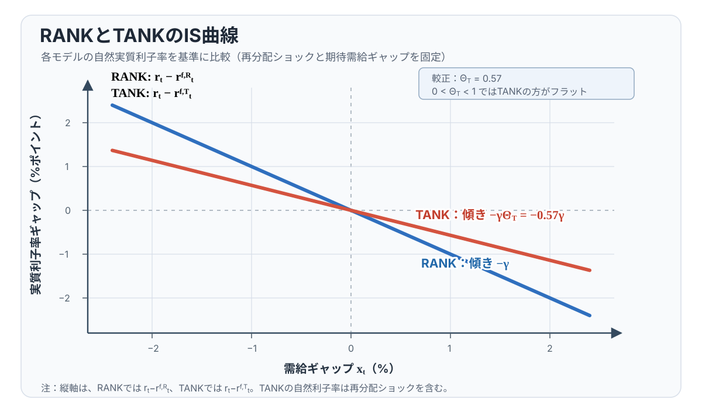
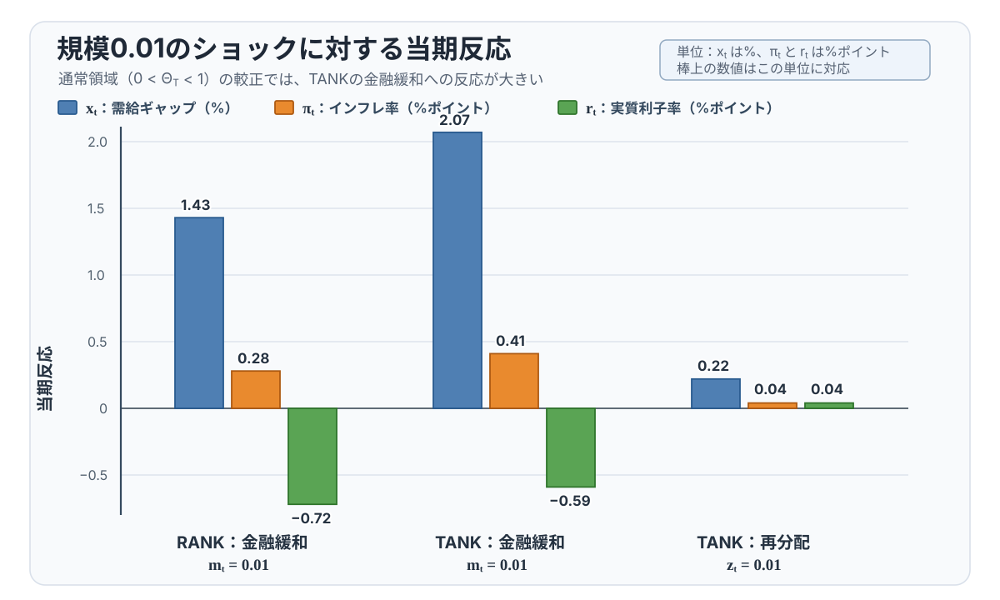

# 講義の目的

第11回では、第7回の価格硬直性モデルを **TANK (Two-Agent New Keynesian) モデル** に拡張します。結論は明確です。家計異質性はこの講義の一次近似の価格設定ブロックを変えませんが、Type H 家計の現在所得反応を通じて IS 曲線を変えます。通常領域では、期待需給ギャップを同じに保ち、各モデルの自然利子率から実質利子率が同じ幅だけ乖離すると、TANK の需要が RANK より大きく動きます。ただし、この増幅は無条件ではなく、所得帰着の仮定と $0<\Theta_T<1$ に依存します。

本編は、分配ブロックから閉じた TANK の IS 曲線を導き、RANK と傾きを比較するところまでを中心にします。金融政策ショックと再分配ショックの閉形式解、数値例は発展補論にまとめ、授業時間に余裕がある場合に扱います。

生産関数を線形に固定するパラメータを $\alpha$ とし、第7回と同じく $\alpha=0$、政府支出なしとします。柔軟価格の自然産出量を $y_t^f$、需給ギャップを $x_t\equiv y_t-y_t^f$ と書きます。また、価格インフレ率を $\pi_t$、名目利子率を $r_t^N$ とし、事前実質利子率を
$$
r_t\equiv r_t^N-\mathbb{E}_t\pi_{t+1}
$$
と定義します。

TANKモデルでは、家計は次の2タイプに分かれます。

| タイプ | 呼び方 | 役割 |
|---|---|---|
| Type H | 流動性制約家計（hand-to-mouth） | 資産を取引せず、現在所得を消費する |
| Type S | 貯蓄家計（saver） | 名目債券を取引し、全企業株式を保有する |

: TANKモデルの固定された2つの家計タイプ。Type H の人口比率は $\lambda$、Type S の人口比率は $1-\lambda$ である。

第7回の RANKモデルでは、1つの代表的家計の Euler 方程式がそのまま集計需要を決めました。第11回では、Euler 方程式を満たすのは Type S 家計だけです。Type H 家計は現在所得で消費します。したがって、集計需要を理解するには、消費格差と労働格差を追跡する必要があります。

まず、消費格差を $\sigma_t^c\equiv c_t^S-c_t^H$、労働格差を $\sigma_t^n\equiv n_t^S-n_t^H$ と定義します。技術ショックだけを反映する第7回基準の自然実質利子率を
$$
r_t^{f,R}\equiv\gamma\mathbb{E}_t\Delta y_{t+1}^f
$$
と書くと、価格硬直性をもつ TANKモデルは、分配変数を残した次の **開いた表示** で読めます。
$$
\begin{aligned}
x_t
&=
\mathbb{E}_t x_{t+1}
-\frac{1}{\gamma}(r_t-r_t^{f,R})
+
\lambda\mathbb{E}_t\Delta\sigma_{t+1}^c,
\\
\pi_t
&=
\beta\mathbb{E}_t\pi_{t+1}
+
\kappa_x x_t,
\\
r_t
&=
\phi\pi_t-\mathbb{E}_t\pi_{t+1}-m_t.
\end{aligned}
$$
ここで、$\beta$ は割引因子、$\gamma$ は異時点間代替の逆弾力性、$\varphi$ は逆 Frisch 弾力性、$\phi$ はテイラー・ルールのインフレ反応係数、$m_t>0$ は金融緩和ショックです。特に $\phi$ と $\varphi$ は別の記号です。また、$\Delta\sigma_{t+1}^c=\sigma_{t+1}^c-\sigma_t^c$、$\kappa_p=\psi_p/\eta_p$、$\kappa_x=\kappa_p(\gamma+\varphi)$ と置きます。

```{=latex}
\Needspace{22\baselineskip}
```

第1式には未決定の $\sigma_t^c$ が残るため、これだけでは均衡は閉じません。Type S の Euler 方程式、Type H の現在所得制約、所得帰着を合わせて分配ブロックを解くと、
$$
\Theta_T\equiv1-\frac{\lambda\varphi}{1-\lambda}
$$
および、再分配を含む TANK の自然実質利子率
$$
r_t^{f,T}
\equiv
r_t^{f,R}
-
\frac{\gamma\lambda\varphi}
{(\gamma+\varphi)(1-\lambda)}
\mathbb{E}_t\Delta z_{t+1}
$$
を使って、閉じた IS 曲線を
$$
x_t
=
\mathbb{E}_t x_{t+1}
-
\frac{1}{\gamma\Theta_T}
(r_t-r_t^{f,T})
$$
と書けます。$z_t$ は Type H 一人当たりの移転です。再分配ショックは、付加的な需要項というだけでなく、Type S が消費を平準化するために必要な TANK 自然利子率を動かします。

以下では主に $0<\Theta_T<1$ を扱います。この範囲で、期待需要と各モデルの自然利子率を固定すると、TANK の利子率感応度 $1/(\gamma\Theta_T)$ は RANK の $1/\gamma$ より大きくなります。$\Theta_T=0$ は閉じた IS 曲線を割れない特異点であり、$\Theta_T<0$ は需要曲線の符号が反転する別の領域です。

@fig-lecture11-overview は、この回の流れをまとめています。第11回の中心は、価格設定ブロックではなく、Type S 家計の Euler 方程式と Type H 家計の現在所得制約を、分配ブロックを通じて IS 曲線へ戻すことです。

{#fig-lecture11-overview width=95%}

# 表記と基本設定

家計タイプは生涯を通じて固定され、両タイプは同じ選好と労働生産性をもちます。違いは資産市場への参加です。Type H は債券も株式も保有せず、当期の労働所得と移転を消費します。Type S は全企業株式を保有し、名目債券を取引します。債券はゼロ純供給で、政府債務はありません。したがって、対称均衡では Type S の債券保有もゼロになります。ただし、個別の Type S 家計の予算制約には債券購入と償還があり、その最適化から Euler 方程式が生じます。

移転 $z_t$ は Type H 一人当たりの実質移転を定常消費で割った一次近似であり、その総費用を Type S が負担します。配当 $d_t$ は、価格補助金と企業への一括税を相殺した後の純配当を定常消費で割った一次近似であり、すべて Type S に帰属します。この所得帰着は、後で得る $\Theta_T$ と増幅結果に不可欠です。

対数線形化は、$\bar C^H=\bar C^S$、$\bar N^H=\bar N^S$、$\bar D=\bar Z=\bar B=0$ の定常状態の周りで行います。したがって、正規化後の定常値も $d=z=B=0$ です。人口比率による対数集計
$$
c_t=\lambda c_t^H+(1-\lambda)c_t^S,
\qquad
n_t=\lambda n_t^H+(1-\lambda)n_t^S
$$
は、タイプ間で定常消費と定常労働が等しいという仮定に依存します。

## 記号一覧

大文字は水準、小文字は定常状態からの対数乖離を表します。ただし、企業配当 $d_t$ と移転 $z_t$ は例外です。定常状態の配当や移転がゼロの場合、対数乖離は定義できません。この講義では、$d_t$ と $z_t$ を、定常消費（同じ正規化のもとでは定常産出）で割った実質配当・実質移転の一次近似として扱います。

第11回では、第7回の売上補助金の記号 $\sigma$ と混同しないように、補助金の記号は使いません。定常状態のマークアップ歪みは補助金で取り除かれていると考えます。

主な変数は次の通りです。

| 記号 | 意味 |
|---|---|
| $C_t^H,C_t^S$ | Type H、Type S の消費 |
| $N_t^H,N_t^S$ | Type H、Type S の労働 |
| $W_t$ | 共通の実質賃金 |
| $C_t,N_t$ | 集計消費、集計労働 |
| $Y_t$ | 産出 |
| $a_t$ | 対数技術水準（技術水準は $\exp(a_t)$） |
| $D_t$ | 価格補助金と企業一括税を相殺した後の純配当 |
| $Z_t$ | Type H 一人当たりの移転 |
| $B_t$ | Type S 家計の名目債券保有。対称均衡ではゼロ |
| $R_t^N$ | 粗名目利子率 |
| $\Pi_t$ | 価格の粗インフレ率 |

: 水準変数。家計タイプは固定され、上付き $H,S$ はそれぞれ Type H、Type S を表す。

対数乖離変数と一次近似変数は次の通りです。

| 記号 | 意味 |
|---|---|
| $c_t^H,c_t^S,c_t$ | タイプ別消費と集計消費 |
| $n_t^H,n_t^S,n_t$ | タイプ別労働と集計労働 |
| $w_t$ | 共通の実質賃金 |
| $\pi_t$ | 価格インフレ率 |
| $r_t^N$ | 名目利子率 |
| $r_t=r_t^N-\mathbb{E}_t\pi_{t+1}$ | 事前実質利子率 |
| $mc_t$ | 実質限界費用 |
| $y_t^f$ | 柔軟価格の自然産出量 |
| $r_t^{f,R}=\gamma\mathbb{E}_t\Delta y_{t+1}^f$ | 技術ショック基準の RANK 自然実質利子率 |
| $r_t^{f,T}$ | 再分配を含む TANK 自然実質利子率 |
| $x_t=y_t-y_t^f$ | 第7回ベンチマークに対する需給ギャップ |
| $m_t$ | 金融政策ショック。$m_t>0$ は金融緩和ショック |
| $d_t$ | 純配当を定常消費で割った一次近似 |
| $z_t$ | Type H 家計一人当たり移転を定常消費で割った一次近似 |
| $\sigma_t^c=c_t^S-c_t^H$ | 消費格差 |
| $\sigma_t^n=n_t^S-n_t^H$ | 労働格差 |

: 対数乖離と一次近似変数。$d_t,z_t$ はゼロ定常値のため対数ではなく、定常消費で正規化した一次近似である。

パラメータは第7回の記号を維持します。新しいパラメータは、Type H 家計の人口比率 $\lambda\in[0,1)$ です。$\lambda=0$ とすれば、Type H 家計が存在しないため RANKモデルに戻ります。

| 記号 | 意味 |
|---|---|
| $\alpha=0$ | 生産関数を線形に固定するパラメータ |
| $\beta$ | 割引因子 |
| $\gamma$ | 異時点間代替の逆弾力性 |
| $\varphi$ | 労働供給弾力性の逆数 |
| $\lambda$ | Type H 家計の人口比率 |
| $\psi_p$ | 財の代替弾力性 |
| $\eta_p$ | 価格調整費用パラメータ |
| $\eta_w$ | 賃金調整費用パラメータ（第11回では0） |
| $\psi_w$ | 差別化労働タイプ間の代替弾力性（同質労働極限では $\psi_w\to\infty$） |
| $\kappa_p=\psi_p/\eta_p$ | 実質限界費用に対する価格インフレ率の傾き |
| $\kappa_x=\kappa_p(\gamma+\varphi)$ | 需給ギャップに対する NKフィリップス曲線の傾き |
| $\phi$ | テイラー・ルールのインフレ反応係数 |
| $\rho_a,\rho_m,\rho_z$ | 技術、金融政策、再分配ショックの持続性 |
| $e_t^a,e_t^m,e_t^z$ | 各ショック過程の当期イノベーション |
| $\Theta_T=1-\lambda\varphi/(1-\lambda)$ | 閉じた IS 曲線の利子率感応度を決める係数 |

: 第11回で使うパラメータとショック。$\phi$ と逆 Frisch 弾力性 $\varphi$ は別の記号である。

第10回の二重硬直性モデルとの関係では、賃金調整費用を除く構造的な柔軟賃金条件は $\eta_w=0$ です。第11回ではこれに加えて、同質労働と競争的な柔軟賃金を直接仮定し、両タイプに共通の賃金 $w_t$ を使います。差別化労働と労働パッカーを残す表現に対応づけるなら、労働タイプ間の代替弾力性について $\psi_w\to\infty$ とする追加の極限です。$\eta_w=0$ と $\psi_w\to\infty$ は別の制約です。

# 第7回から何を変えるか

第7回では、代表的家計の Euler 方程式、柔軟賃金条件、生産関数から
$$
mc_t=(\gamma+\varphi)y_t-(1+\varphi)a_t
$$
を得ました。これを自然産出量で引き直すと
$$
mc_t=(\gamma+\varphi)x_t
$$
となり、3本の NK方程式が得られました。

第11回で変わるのは、家計ブロックです。代表的家計の消費 $c_t$ がそのまま Euler 方程式に入るのではなく、Type S の消費 $c_t^S$ が入ります。また、Type H と Type S は同じ賃金に直面しますが、消費が異なるため、労働供給はタイプ間で異なりえます。この差を労働格差 $\sigma_t^n$ として追跡します。

```{=latex}
\Needspace{12\baselineskip}
```

一方で、企業の価格設定ブロックは第7回と同じです。価格硬直性から
$$
\pi_t
=
\beta\mathbb{E}_t\pi_{t+1}
+
\kappa_p mc_t
$$
が得られます。したがって、第11回の仕事は、TANK の家計ブロックから IS 曲線がどう変わるか、そして価格硬直性だけなら $mc_t$ がなぜ第7回と同じ形に戻るかを確認することにあります。

# 対数線形化と方程式リスト

第11回の対数線形体系は、次の方程式リストにまとめられます。第7回と同じ価格設定ブロックに、タイプ別の家計ブロックと分配ブロックを加えたものです。

| No. | 名称 | 式 |
|---:|---|---|
| 1 | フィッシャー方程式 | $r_t=r_t^N-\mathbb{E}_t\pi_{t+1}$ |
| 2 | Type S Euler 方程式 | $r_t=\gamma\mathbb{E}_t\Delta c^S_{t+1}$ |
| 3 | 消費の集計と格差 | $c_t=\lambda c_t^H+(1-\lambda)c_t^S,\quad \sigma_t^c=c_t^S-c_t^H$ |
| 4 | 労働の集計と格差 | $n_t=\lambda n_t^H+(1-\lambda)n_t^S,\quad \sigma_t^n=n_t^S-n_t^H$ |
| 5 | Type H 現在所得制約 | $c_t^H=w_t+n_t^H+z_t$ |
| 6 | Type S の対称均衡における所得会計 | $c_t^S=w_t+n_t^S+\dfrac{1}{1-\lambda}d_t-\dfrac{\lambda}{1-\lambda}z_t$ |
| 7 | 共通の柔軟賃金条件 | $w_t=\gamma c_t^H+\varphi n_t^H=\gamma c_t^S+\varphi n_t^S$ |
| 8 | 生産関数 | $y_t=a_t+n_t$ |
| 9 | 資源制約 | $y_t=c_t$ |
| 10 | 実質限界費用 | $mc_t=w_t-a_t$ |
| 11 | 配当の一次近似 | $d_t=y_t-(w_t+n_t)$ |
| 12 | NKフィリップス曲線 | $\pi_t=\beta\mathbb{E}_t\pi_{t+1}+\kappa_p mc_t$ |
| 13 | テイラー・ルール | $r_t^N=\phi\pi_t-m_t$ |
| 14 | 技術ショック | $a_t=\rho_a a_{t-1}+e_t^a$ |
| 15 | 金融政策ショック | $m_t=\rho_m m_{t-1}+e_t^m$ |
| 16 | 再分配ショック | $z_t=\rho_z z_{t-1}+e_t^z$ |

: 第11回の対数線形体系。Type S の個別予算制約には債券項があるが、ゼロ純供給かつ政府債務なしの対称均衡では債券保有がゼロとなり、6番の所得会計に帰着する。 {#tbl-lecture11-equations tbl-colwidths="[6,28,66]"}

```{=latex}
\Needspace{16\baselineskip}
```

第7回の RANK に戻すには、Type H と移転 $z_t$ のブロックを落とし、Type S を代表的家計として $c_t^S=c_t$、$n_t^S=n_t$ と置きます。すると、2番は代表的家計の Euler 方程式に戻り、7番は第7回の労働供給式
$$
w_t=\gamma c_t+\varphi n_t
$$
になります。5番、6番、11番、16番は家計間の分配を追跡する追加ブロックなので、RANK の集計体系では不要です。残る価格設定ブロックは第7回と同じで、10番と12番から
$$
\pi_t=\beta\mathbb{E}_t\pi_{t+1}+\kappa_p mc_t
$$
を使います。

# 家計ブロック

## 集計と格差

Type H 家計の人口比率を $\lambda$、Type S 家計の人口比率を $1-\lambda$ とします。集計消費と集計労働は
$$
c_t=\lambda c_t^H+(1-\lambda)c_t^S,
\qquad
n_t=\lambda n_t^H+(1-\lambda)n_t^S
$$
です。

消費格差と労働格差を
$$
\sigma_t^c\equiv c_t^S-c_t^H,
\qquad
\sigma_t^n\equiv n_t^S-n_t^H
$$
と定義します。この定義から
$$
\begin{aligned}
c_t^S&=c_t+\lambda\sigma_t^c,
&
c_t^H&=c_t-(1-\lambda)\sigma_t^c,
\\
n_t^S&=n_t+\lambda\sigma_t^n,
&
n_t^H&=n_t-(1-\lambda)\sigma_t^n.
\end{aligned}
$$
Type S の消費が Type H より大きいとき、$\sigma_t^c>0$ です。Type S の労働が Type H より大きいとき、$\sigma_t^n>0$ です。

## Type S の Euler 方程式

Type S 家計は名目債券を取引します。個別予算制約の債券項は対称均衡の所得会計では消えますが、債券選択の最適化条件として次の Euler 方程式が成立します。
$$
r_t
=
\gamma\mathbb{E}_t\Delta c_{t+1}^S
$$
第7回と違い、右辺は集計消費 $c_t$ ではなく、Type S の消費 $c_t^S$ です。

財市場の一次近似では、価格調整費用は二次の項なので落ちます。政府支出もないため
$$
y_t=c_t
$$
です。したがって
$$
c_t^S=y_t+\lambda\sigma_t^c
$$
です。これを Euler 方程式に代入すると
$$
r_t
=
\gamma
\mathbb{E}_t
\left[
(y_{t+1}-y_t)
+
\lambda(\sigma_{t+1}^c-\sigma_t^c)
\right].
$$

ここで、第7回と同じ自然産出量 $y_t^f$ を使います。後で見るように、
$$
y_t^f=
\frac{1+\varphi}{\gamma+\varphi}a_t.
$$
技術ショックだけを反映する第7回基準の自然利子率を
$$
r_t^{f,R}
=
\gamma\mathbb{E}_t(y_{t+1}^f-y_t^f)
$$
と定義します。この段階では移転による消費格差の変化をまだ含まないため、上付き $R$ を付けます。需給ギャップ $x_t=y_t-y_t^f$ を使うと、分配変数を残した TANK の IS 曲線は
$$
x_t
=
\mathbb{E}_t x_{t+1}
-\frac{1}{\gamma}(r_t-r_t^{f,R})
+
\lambda\mathbb{E}_t\Delta\sigma_{t+1}^c
$$
です。

RANK では $c_t^S=c_t$ なので最後の項はありません。TANK では、Type S の消費が集計消費からずれるため、消費格差の期待変化が IS 曲線に入ります。分配ブロックを解いた後に、この項を $r_t^{f,T}$ と $\Theta_T$ へまとめます。

## Type H の現在所得制約

第10回では、同じ需給ギャップとインフレ率のもとでも、賃金所得と配当所得の分解が価格硬直性だけの場合と異なることを確認しました。TANK では、その所得分解が家計タイプ間の消費格差を直接決めます。

```{=latex}
\Needspace{12\baselineskip}
```

Type H 家計は資産を取引しないため、消費は現在所得に結びつきます。政府支出なし、価格調整費用の一次項なしで書けば、Type H の現在所得制約は
$$
c_t^H=w_t+n_t^H+z_t
$$
です。ここで $z_t$ は、Type H 家計一人当たり移転を定常消費で割った一次近似です。

Type S 家計は、労働所得に加えて純配当を受け取り、Type H 家計への移転を負担します。個別予算制約には債券購入と償還がありますが、ゼロ純供給の対称均衡では債券項が消えるため、所得会計は
$$
c_t^S
=
w_t+n_t^S
+
\frac{1}{1-\lambda}d_t
-
\frac{\lambda}{1-\lambda}z_t.
$$
となります。この2本は、消費格差 $\sigma_t^c$ が現在所得、配当、移転で動くことを表します。

# 労働市場と実質限界費用

## 共通賃金と柔軟賃金条件

第11回では、賃金硬直性を入れません。第10回との対応では賃金調整費用を $\eta_w=0$ とし、さらに同質労働を仮定するため、労働パッカーや賃金フィリップス曲線は使いません。差別化労働モデルの表記なら、後者は $\psi_w\to\infty$ という追加の極限に対応します。Type H と Type S の労働は完全代替になり、両タイプは同じ労働市場で共通の実質賃金 $w_t$ に直面します。

各タイプの柔軟賃金条件は
$$
w_t=\gamma c_t^H+\varphi n_t^H,
\qquad
w_t=\gamma c_t^S+\varphi n_t^S
$$
です。同じ賃金 $w_t$ が両方の式の左辺にあることが重要です。この2本を引くと
$$
\gamma\sigma_t^c+\varphi\sigma_t^n=0
$$
この条件は、消費が高いタイプほど、同じ賃金のもとで労働の限界不効用も高く、労働供給が相対的に低いことを表します。

```{=latex}
\Needspace{16\baselineskip}
```

さらに、2本の柔軟賃金条件を人口比率で集計すると
$$
w_t=\gamma c_t+\varphi n_t
$$
です。財市場均衡 $c_t=y_t$ と、生産関数
$$
y_t=a_t+n_t
$$
を使うと
$$
w_t
=
\gamma y_t+\varphi(y_t-a_t)
=
(\gamma+\varphi)y_t-\varphi a_t
$$
です。

```{=latex}
\Needspace{12\baselineskip}
```

企業の実質限界費用は、$\alpha=0$ では
$$
mc_t=w_t-a_t
$$
です。したがって
$$
mc_t
=
(\gamma+\varphi)y_t
-
(1+\varphi)a_t
$$
を得ます。これは第7回と同じ式です。

この点が、価格硬直性だけの TANK を簡単にしている理由です。消費格差と労働格差は家計間の分配を動かしますが、共通賃金と柔軟賃金条件を課すと、それらは集計実質賃金の式では相殺されます。したがって、実質限界費用は第7回と同じく、産出と技術だけで表せます。

# 自然産出量と NKフィリップス曲線

第7回との接続を保つため、自然産出量は、第7回と同じく柔軟価格で $mc_t=0$ を満たす産出として定義します。すなわち
$$
0=(\gamma+\varphi)y_t^f-(1+\varphi)a_t
$$
より
$$
y_t^f
=
\frac{1+\varphi}{\gamma+\varphi}a_t.
$$

需給ギャップを
$$
x_t=y_t-y_t^f
$$
と定義します。すると実質限界費用は
$$
mc_t
=
(\gamma+\varphi)x_t.
$$

```{=latex}
\Needspace{14\baselineskip}
```

価格設定ブロックは第7回と同じです。
$$
\pi_t
=
\beta\mathbb{E}_t\pi_{t+1}
+
\kappa_p mc_t.
$$
したがって、TANK の NKフィリップス曲線は
$$
\pi_t
=
\beta\mathbb{E}_t\pi_{t+1}
+
\kappa_x x_t
$$
です。ただし
$$
\kappa_x=\kappa_p(\gamma+\varphi)
$$
です。

この式は、第7回の NKフィリップス曲線と同じ形です。価格硬直性だけなら、賃金は共通かつ柔軟なので、消費格差と労働格差は実質限界費用には直接残りません。TANK らしさは、NKフィリップス曲線ではなく、IS 曲線と分配ブロックに現れます。

# 開いた体系の読み方

冒頭の3本は、分配変数を残した開いた表示です。RANK から変わるのは IS 曲線であり、Type S の Euler 方程式から $\mathbb{E}_t\Delta\sigma_{t+1}^c$ が加わります。価格硬直性だけなら、共通で柔軟な賃金により NKフィリップス曲線は第7回と同じ形です。テイラー・ルールも変わらず、$m_t>0$ は同じインフレ率のもとで実質利子率を下げる金融緩和ショックです。

したがって、次の課題は $\sigma_t^c$ を需給ギャップと移転で表し、開いた IS 曲線を閉じることです。

# 分配ブロックの読み方

開いた TANK 体系だけでは、$\sigma_t^c$ と $\sigma_t^n$ の動きはまだ決まりません。これらは、Type H の現在所得制約、Type S の対称均衡所得会計、柔軟賃金条件、移転ルール、配当の帰属によって決まります。

```{=latex}
\Needspace{18\baselineskip}
```

政府支出なし、価格調整費用の一次項なしでは、価格補助金と企業への一括税を相殺した純配当の一次近似は
$$
d_t=y_t-(w_t+n_t)
$$
です。ここでも $d_t$ は配当のログ乖離ではありません。二つの所得会計を引くと、共通賃金 $w_t$ は消えるため、消費格差は
$$
\sigma_t^c
=
\sigma_t^n
+
\frac{1}{1-\lambda}d_t
-
\frac{1}{1-\lambda}z_t
$$
と書けます。

差別化労働と労働パッカーを残す一般形では、対応する式は
$$
\sigma_t^c
=
\left(1-\frac{1}{\psi_w}\right)\sigma_t^n
+
\frac{1}{1-\lambda}(d_t-z_t)
$$
です。第11回の同質労働は、この式で $\psi_w\to\infty$ とする追加の極限に対応します。完全代替の極限では、賃金差による項が消え、労働格差の係数は1になります。これは、賃金調整費用を除く $\eta_w=0$ とは別の仮定です。

この式は、TANK の分配チャネルをよく表しています。配当 $d_t$ は Type S 家計に入り、移転 $z_t$ は Type H 家計に入ります。したがって、配当と移転は消費格差を反対方向に動かします。

## 分配ブロックを解く

柔軟賃金条件からは
$$
\gamma\sigma_t^c
+
\varphi\sigma_t^n
=0
$$
も得られます。ここから実際に $\sigma_t^c,\sigma_t^n$ を解きます。

```{=latex}
\Needspace{23\baselineskip}
```

まず、柔軟賃金条件を
$$
\sigma_t^n=-\frac{\gamma}{\varphi}\sigma_t^c
$$
と書き直します。これを消費格差の式に代入すると
$$
\sigma_t^c
=
-
\frac{\gamma}{\varphi}\sigma_t^c
+
\frac{1}{1-\lambda}(d_t-z_t)
$$
です。したがって
$$
\left(1+\frac{\gamma}{\varphi}\right)\sigma_t^c
=
\frac{1}{1-\lambda}(d_t-z_t)
$$
となり、
$$
\sigma_t^c
=
\frac{\varphi}{\gamma+\varphi}
\frac{d_t-z_t}{1-\lambda}
$$
を得ます。労働格差は
$$
\sigma_t^n
=
-
\frac{\gamma}{\gamma+\varphi}
\frac{d_t-z_t}{1-\lambda}
$$
です。

```{=latex}
\Needspace{18\baselineskip}
```

さらに、$\alpha=0$ では
$$
d_t=y_t-(w_t+n_t)=-mc_t=-(\gamma+\varphi)x_t
$$
です。したがって、格差を需給ギャップと移転だけで書けば
$$
\sigma_t^c
=
-
\frac{\varphi}{1-\lambda}x_t
-
\frac{\varphi}{(\gamma+\varphi)(1-\lambda)}z_t,
$$
$$
\sigma_t^n
=
\frac{\gamma}{1-\lambda}x_t
+
\frac{\gamma}{(\gamma+\varphi)(1-\lambda)}z_t.
$$

最後に、この $\sigma_t^c$ を開いた TANK の IS 曲線に代入します。$\Theta_T\equiv 1-\lambda\varphi/(1-\lambda)$ と置くと、
$$
\Theta_T x_t
=
\Theta_T\mathbb{E}_t x_{t+1}
-
\frac{1}{\gamma}(r_t-r_t^{f,R})
-
\frac{\lambda\varphi}{(\gamma+\varphi)(1-\lambda)}
\mathbb{E}_t\Delta z_{t+1}.
$$
したがって、$\Theta_T\neq0$ なら
$$
x_t
=
\mathbb{E}_t x_{t+1}
-
\frac{1}{\gamma\Theta_T}(r_t-r_t^{f,R})
-
\frac{\lambda\varphi}{(\gamma+\varphi)(1-\lambda)\Theta_T}
\mathbb{E}_t\Delta z_{t+1}.
$$
ここで
$$
r_t^{f,T}
\equiv
r_t^{f,R}
-
\frac{\gamma\lambda\varphi}
{(\gamma+\varphi)(1-\lambda)}
\mathbb{E}_t\Delta z_{t+1}
$$
この $r_t^{f,T}$ を用いると、閉じた IS 曲線は
$$
x_t
=
\mathbb{E}_t x_{t+1}
-
\frac{1}{\gamma\Theta_T}(r_t-r_t^{f,T})
$$
となります。$r_t^{f,R}$ は技術ショック基準、$r_t^{f,T}$ は再分配を含む TANK の自然実質利子率です。後者は、柔軟価格の TANK 配分で需給ギャップをゼロに保つ実質利子率を表します。

# RANK との比較

閉じた IS 曲線の係数は
$$
\Theta_T
=
\frac{1-\lambda(1+\varphi)}{1-\lambda}
$$
です。以下では通常領域
$$
0<\Theta_T<1
$$
に集中します。$\lambda>0$ の TANK では、これは $0<\lambda<1/(1+\varphi)$ に対応します。$\Theta_T=0$ では分配ブロックを代入した式の $x_t$ の係数が消え、閉じた IS 曲線を $x_t$ について解けません。$\Theta_T<0$ では利子率と需要の関係が反転し、通常領域とは異なる決定性条件が必要です。

## IS 曲線の傾き

RANK の IS 曲線は
$$
x_t=\mathbb{E}_t x_{t+1}-\frac{1}{\gamma}(r_t-r_t^{f,R})
$$
でした。TANK の閉じた IS 曲線は
$$
x_t=\mathbb{E}_t x_{t+1}-\frac{1}{\gamma\Theta_T}(r_t-r_t^{f,T})
$$
です。期待需要と各モデルの自然利子率を固定すれば、$0<\Theta_T<1$ のもとで
$$
\frac{1}{\gamma\Theta_T}>\frac{1}{\gamma}
$$
です。

この不等式から、TANK は実質利子率乖離により敏感だと分かります。縦軸に $r_t-r_t^{f,T}$、横軸に $x_t$ を置き、期待需要を固定すると
$$
r_t-r_t^{f,T}
=
\gamma\Theta_T(\mathbb{E}_t x_{t+1}-x_t).
$$
したがって、IS 曲線の傾きは
$$
\frac{\partial r_t}{\partial x_t}
=
-\gamma\Theta_T
$$
です。RANK の傾きは $-\gamma$ なので、$0<\Theta_T<1$ の TANK では IS 曲線がよりフラットになります。この比較は、各モデルの自然利子率からの乖離についての比較です。

{#fig-lecture11-is width=85%}

::: {.callout-important}
## 金融政策ショックへの含意

$0<\Theta_T<1$ のもとでは、同じ金融緩和ショックに対する需給ギャップとインフレ率の反応は TANK の方が RANK より大きくなります。Type H の現在所得反応が集計需要へ戻り、TANK の IS 曲線がよりフラットになるためです。AR(1) ショックに対する閉形式解、再分配ショック、数値例は発展補論で扱います。反応が大きいことは厚生が改善することを意味しません。
:::
# まとめと第12回への接続

この回では、第7回の価格硬直性モデルに家計異質性を加えました。賃金は共通で柔軟なので、価格設定ブロックは RANK と同じです。TANK らしさは、Type S の Euler 方程式と Type H の現在所得制約をつなぐ分配ブロックに現れます。分配を解くと、IS 曲線の利子率係数は $1/(\gamma\Theta_T)$ となり、自然利子率は技術ショック基準の $r_t^{f,R}$ から再分配込みの $r_t^{f,T}$ へ変わります。

$0<\Theta_T<1$ では、期待需要と各モデルの自然利子率を固定した TANK の IS 曲線は RANK よりフラットです。$\Theta_T=0$ は特異点、$\Theta_T<0$ は反転領域であり、同じ比較は使えません。また、ショック反応の増大は厚生改善を意味しません。

```{=latex}
\Needspace{10\baselineskip}
```

この回では、ここまでを正の分析として扱いました。TANK では消費格差と労働格差も厚生に関わるため、最適金融政策を考えると論点は増えます。ただし、厚生目的関数やターゲット条件まで同じ回に入れると焦点が分散するので、ここでは TANK が IS 曲線とショック反応をどう変えるかに集中します。

| 論点 | 第7回 | 第10回 | 第11回 |
|---|---|---|---|
| 家計 | 代表的家計 | 代表的家計 | Type H と Type S |
| 賃金 | 柔軟 | 硬直的 | 柔軟 |
| 価格 | 硬直的 | 硬直的 | 硬直的 |
| 追加される変数 | なし | $\mu_t^w,\pi_t^w$ | $\sigma_t^c,\sigma_t^n$ |
| IS 曲線 | 集計消費の Euler 方程式 | 集計消費の Euler 方程式 | Type S 消費の Euler 方程式 |
| NKPC | $\kappa_x x_t$ | 価格・賃金マークアップ | $\kappa_x x_t$ |

: 第7回、第10回、第11回のモデル構造。第11回の NKPC は第7回と同じだが、IS 曲線には分配ブロックが加わる。

第12回では、同じ TANK 構造を **NKクロス** として読み直します。政府支出は入れず、財市場は引き続き $y_t=c_t$ です。ただし、第11回のようにテイラー・ルールと NKフィリップス曲線を前面に出すのではなく、実質利子率を所与として、消費関数と所得フィードバックを見ることに集中します。

Bilbiie 型の表記では、配当の一部を Type H 家計に移すルール
$$
z_t=\frac{\tau_D}{\lambda}d_t
$$
を置くことが多いです。第11回では $z_t$ を外生的な移転ショックとして扱いましたが、第12回では配当と連動する内生的な分配ルールとして扱います。このルールを使うと
$$
d_t-z_t
=
\left(1-\frac{\tau_D}{\lambda}\right)d_t
$$
となるため、閉じた IS 曲線の利子率感応度も変わります。具体的には
$$
\Theta_D
=
1-\frac{\lambda\varphi}{1-\lambda}
\left(1-\frac{\tau_D}{\lambda}\right)
$$
を使う形になります。

```{=latex}
\Needspace{13\baselineskip}
```

Bilbiie の記号に寄せれば、
$$
\chi
=
1+\varphi\left(1-\frac{\tau_D}{\lambda}\right),
\qquad
\Theta_D
=
\frac{1-\lambda\chi}{1-\lambda}
$$
です。第12回では、この仕組みを Type H 家計の所得弾力性や NKクロスの傾きとして読み替えます。

ここで $\tau_D$ は、集計純配当の変動のうち Type H へ再分配する割合を表す一次近似上の負荷係数です。$\Theta_D$ はそのルールのもとで閉じた需要曲線の傾きを決める係数、$\chi$ は所得フィードバックの合成パラメータです。再分配がない $\tau_D=0$ では
$$
\chi=1+\varphi,
\qquad
\Theta_D=\frac{1-\lambda(1+\varphi)}{1-\lambda}=\Theta_T
$$
となり、第11回の所得帰着に戻ります。

したがって、第11回から第12回への橋渡しは次の通りです。第11回では「TANK は IS 曲線をどう変えるか」を3本の NK方程式の中で見ました。第12回では、その IS 曲線の背後にある消費関数を取り出します。$\beta\simeq1$ の較正では RANK の現在所得フィードバックが小さい一方、TANK では現在所得への反応と一般均衡フィードバックが金融政策の効果を増幅しうることを確認します。

```{=latex}
\Needspace{10\baselineskip}
```

# 参考文献

**必読**

- Bilbiie, Florin O. (2008) "Limited Asset Markets Participation, Monetary Policy and (Inverted) Aggregate Demand Logic." *Journal of Economic Theory*, 140(1), 162-196. [doi](https://doi.org/10.1016/j.jet.2007.07.008) 通常領域と反転領域、金融政策ルールの決定性を理解するため。
- Bilbiie, Florin O. (2020) "The New Keynesian Cross." *Journal of Monetary Economics*, 114, 90-108. [doi](https://doi.org/10.1016/j.jmoneco.2019.03.003) TANK の所得フィードバックと第12回の NKクロスをつなぐため。
- Galí, Jordi, J. David López-Salido, and Javier Vallés (2007) "Understanding the Effects of Government Spending on Consumption." *Journal of the European Economic Association*, 5(1), 227-270. [doi](https://doi.org/10.1162/JEEA.2007.5.1.227) 現在所得を消費する家計を含む二家計モデルの基礎を確認するため。
- Galí, Jordi (2015) *Monetary Policy, Inflation, and the Business Cycle* (2nd ed.). Princeton University Press. 標準的な RANK の3方程式と比較するため。

**発展**

- Campbell, John Y., and N. Gregory Mankiw (1989) "Consumption, Income, and Interest Rates: Reinterpreting the Time Series Evidence." In Olivier Jean Blanchard and Stanley Fischer (eds.), *NBER Macroeconomics Annual 1989*, Vol. 4, 185-246. Cambridge, MA: MIT Press. [doi](https://doi.org/10.1086/654107) 現在所得消費者という実証的動機を確認するため。
- Kaplan, Greg, Benjamin Moll, and Giovanni L. Violante (2018) "Monetary Policy According to HANK." *American Economic Review*, 108(3), 697-743. [doi](https://doi.org/10.1257/aer.20160042) TANK とより豊かな HANK の波及経路を比較するため。
- Auclert, Adrien (2019) "Monetary Policy and the Redistribution Channel." *American Economic Review*, 109(6), 2333-2367. [doi](https://doi.org/10.1257/aer.20160137) 金融政策が所得・資産ポジションを通じて消費を動かす経路を整理するため。
- McKay, Alisdair, Emi Nakamura, and Jón Steinsson (2016) "The Power of Forward Guidance Revisited." *American Economic Review*, 106(10), 3133-3158. [doi](https://doi.org/10.1257/aer.20150063) 市場不完備が前方指針の効果をどう変えるかを見るため。

# 演習問題

```{=latex}
\Needspace{12\baselineskip}
```

## 基本問題

```{=latex}
\Needspace{10\baselineskip}
```

**問1 [Core] [Derivation]：集計と格差**

消費格差を $\sigma_t^c=c_t^S-c_t^H$ と定義する。集計消費
$$
c_t=\lambda c_t^H+(1-\lambda)c_t^S
$$
を使って、
$$
c_t^S=c_t+\lambda\sigma_t^c,
\qquad
c_t^H=c_t-(1-\lambda)\sigma_t^c
$$
を示しなさい。

```{=latex}
\Needspace{12\baselineskip}
```

**問2 [Core] [Derivation]：分配変数を残した IS 曲線**

Type S の Euler 方程式
$$
r_t=\gamma\mathbb{E}_t\Delta c_{t+1}^S
$$
と $c_t^S=y_t+\lambda\sigma_t^c$ を使い、
$$
x_t
=
\mathbb{E}_t x_{t+1}
-\frac{1}{\gamma}(r_t-r_t^{f,R})
+
\lambda\mathbb{E}_t\Delta\sigma_{t+1}^c
$$
を導出しなさい。ただし $r_t^{f,R}=\gamma\mathbb{E}_t\Delta y_{t+1}^f$ とする。$r_t^{f,R}$ がまだ再分配を含まない技術ショック基準の自然利子率であることも説明しなさい。

```{=latex}
\Needspace{10\baselineskip}
```

**問3 [Core] [Derivation]：実質限界費用**

共通賃金の柔軟賃金条件と生産関数を使い、
$$
mc_t
=
(\gamma+\varphi)x_t
$$
を導出しなさい。消費格差と労働格差が、この式に直接残らない理由も説明しなさい。

```{=latex}
\Needspace{9\baselineskip}
```

**問4 [Core]：RANK への縮約**

Type H と移転 $z_t$ のブロックを落とし、Type S を代表的家計として $c_t^S=c_t$、$n_t^S=n_t$ と置きなさい。$\lambda=0$、$\Theta_T=1$、$r_t^{f,T}=r_t^{f,R}$ となり、第11回の閉じた体系が第7回の RANK に戻ることを確認しなさい。

```{=latex}
\Needspace{14\baselineskip}
```

**問5 [Core] [Derivation]：柔軟賃金の整合性条件**

Type H と Type S の柔軟賃金条件を引き、
$$
\gamma\sigma_t^c
+
\varphi\sigma_t^n
=0
$$
を導出しなさい。さらに、消費格差の式
$$
\sigma_t^c
=
\sigma_t^n
+
\frac{1}{1-\lambda}(d_t-z_t)
$$
と組み合わせて、
$$
\sigma_t^c
=
\frac{\varphi}{\gamma+\varphi}
\frac{d_t-z_t}{1-\lambda},
\qquad
\sigma_t^n
=
-
\frac{\gamma}{\gamma+\varphi}
\frac{d_t-z_t}{1-\lambda}
$$
を導出しなさい。

```{=latex}
\Needspace{16\baselineskip}
```

**問6 [Core] [Derivation]：閉じた IS 曲線と TANK 自然利子率**

**(a) 閉じた IS 曲線**　$d_t=-(\gamma+\varphi)x_t$ を使って $\sigma_t^c$ を $x_t,z_t$ で表し、それを分配変数を残した IS 曲線に代入しなさい。$\mathbb E_t\Delta x_{t+1}=\mathbb E_tx_{t+1}-x_t$ を使い、$\Theta_T=1-\lambda\varphi/(1-\lambda)$ と置くと、
$$
x_t
=
\mathbb{E}_t x_{t+1}
-
\frac{1}{\gamma\Theta_T}(r_t-r_t^{f,R})
-
\frac{\lambda\varphi}{(\gamma+\varphi)(1-\lambda)\Theta_T}
\mathbb{E}_t\Delta z_{t+1}
$$
が得られることを確認しなさい。

**(b) TANK 自然利子率**　TANK 自然利子率を
$$
r_t^{f,T}
=
r_t^{f,R}
-
\frac{\gamma\lambda\varphi}
{(\gamma+\varphi)(1-\lambda)}
\mathbb{E}_t\Delta z_{t+1}
$$
と定義し、閉じた IS 曲線が
$$
x_t=\mathbb{E}_t x_{t+1}
-\frac{1}{\gamma\Theta_T}(r_t-r_t^{f,T})
$$
と書けることを示しなさい。最後に、$r_t^{f,T}$ が柔軟価格の TANK 配分を支える利子率である理由を説明しなさい。

```{=latex}
\Needspace{12\baselineskip}
```

## 発展問題

```{=latex}
\Needspace{14\baselineskip}
```

**問7 [Research extension] [Derivation]：金融緩和ショック**

再分配ショックと技術ショックをゼロにし、$m_{t+1}=\rho_m m_t+e_{t+1}^m$ とする。第8回と同じ手順で
$$
x_t=\Omega_T m_t,
\qquad
\Omega_T=
\frac{1}
{\kappa_m(\phi-\rho_m)+\gamma\Theta_T(1-\rho_m)}
$$
を導出しなさい。$\phi>1$、$0\leq\rho_m<1$、$0<\Theta_T<1$ のとき、なぜ $\Omega_T$ が RANK の係数より大きくなるのか説明しなさい。最後に、$x_t$ と $\pi_t$ の反応が大きいことだけから厚生改善を結論できない理由を、消費格差と労働格差に触れて説明しなさい。

```{=latex}
\Needspace{16\baselineskip}
```

**問8 [Research extension] [Derivation]：再分配ショックと自然利子率**

金融政策ショックと技術ショックをゼロにし、$z_{t+1}=\rho_z z_t+e_{t+1}^z$ とする。閉じた IS 曲線を使って
$$
x_t=\Omega_z^T z_t,
\qquad
\Omega_z^T
=
\frac{
\dfrac{\gamma\lambda\varphi}{(\gamma+\varphi)(1-\lambda)}(1-\rho_z)
}
{\kappa_z(\phi-\rho_z)+\gamma\Theta_T(1-\rho_z)}
$$
を導出しなさい。ただし $\kappa_z=\kappa_x/(1-\beta\rho_z)$、$0\leq\rho_z<1$ とする。その前段として、
$$
r_t^{f,T}
=
\frac{\gamma\lambda\varphi}
{(\gamma+\varphi)(1-\lambda)}(1-\rho_z)z_t
$$
を示し、移転が需要を動かす仕組みを自然利子率の変化として説明しなさい。$\rho_z=1$ は定常 AR(1) ではなく、恒久変化を表す単位根の極限として別扱いすべきことにも触れなさい。

```{=latex}
\Needspace{12\baselineskip}
```

**問9 [Research extension]：通常領域、特異点、反転領域**

$\Theta_T>0$、$\Theta_T=0$、$\Theta_T<0$ の3つを比較しなさい。通常領域の単純なインフレ反応ルールでは標準的なテイラー原理が $\phi>1$ であること、$\Theta_T=0$ では閉じた IS 曲線を $x_t$ について解けないこと、$\Theta_T<0$ では需要の利子率反応と決定性条件が反転しうることを説明しなさい。なぜ $\phi>\rho_m$ だけをテイラー原理と呼べないかも述べなさい。

```{=latex}
\Needspace{14\baselineskip}
```

**問10 [Research extension] [Derivation]：第12回への橋渡し**

配当再分配ルール $z_t=(\tau_D/\lambda)d_t$ のもとで
$$
\chi=1+\varphi\left(1-\frac{\tau_D}{\lambda}\right),
\qquad
\Theta_D=\frac{1-\lambda\chi}{1-\lambda}
$$
と定義する。$\tau_D=0$ なら $\chi=1+\varphi$、$\Theta_D=\Theta_T$ となることを示しなさい。$\tau_D$ が変わると NKクロスの所得フィードバックと需要曲線の傾きがどう変わるか説明しなさい。

```{=latex}
\clearpage
```

# 補論（発展）：TANKにおけるショックの閉形式解

この補論は、閉じた TANK の IS 曲線を金融政策ショックと再分配ショックへ応用します。授業時間に余裕がある場合に扱う発展項目です。本編の中心である分配ブロック、閉じた IS 曲線、RANK との傾きの比較を理解するためには必須ではありません。

## 金融政策ショック

この性質を使うと、第8回と同じ手順で貨幣ショック、つまり金融政策ショックの効果を明示できます。手順は、AR(1) のショック過程を置き、解がショックに比例すると予想し、NKフィリップス曲線で $\pi_t$ を $x_t$ に戻し、IS 曲線とテイラー・ルールを等置する、というものです。

```{=latex}
\Needspace{20\baselineskip}
```

金融緩和ショック $m_t>0$ だけを考え、$a_t=z_t=0$、したがって $r_t^{f,R}=r_t^{f,T}=0$ とします。ショックは
$$
m_{t+1}=\rho_m m_t+e_{t+1}^m
$$
に従うとし、$0\leq\rho_m<1$ とします。通常領域 $\Theta_T>0$ では、標準的なテイラー原理（Taylor principle）$\phi>1$ のもとで有界な基本解を選びます。$\phi-\rho_m$ は以下の代数に現れますが、$\phi>\rho_m$ だけを決定性条件と呼ぶことはできません。解が $m_t$ に比例すると予想すると、NKフィリップス曲線から
$$
\pi_t=\kappa_m x_t,
\qquad
\kappa_m\equiv\frac{\kappa_x}{1-\beta\rho_m}
$$
です。テイラー・ルールから
$$
r_t=(\phi-\rho_m)\pi_t-m_t
$$
です。一方、TANK の IS 曲線から
$$
r_t=-\gamma\Theta_T(1-\rho_m)x_t
$$
です。これらを組み合わせると
$$
x_t=\Omega_T m_t,
\qquad
\Omega_T
\equiv
\frac{1}
{\kappa_m(\phi-\rho_m)+\gamma\Theta_T(1-\rho_m)}.
$$
したがって
$$
\pi_t=\kappa_m\Omega_T m_t,
\qquad
r_t=-\gamma\Theta_T(1-\rho_m)\Omega_T m_t.
$$

第8回の RANK では、同じ係数は
$$
\Omega_R
\equiv
\frac{1}
{\kappa_m(\phi-\rho_m)+\gamma(1-\rho_m)}
$$
でした。$\phi>1$、$0\leq\rho_m<1$、$0<\Theta_T<1$ のもとでは両分母が正であり、
$$
\Omega_T>\Omega_R
$$
です。したがって、この所得帰着と通常領域のもとでは、同じ金融緩和ショック $m_t>0$ が TANK の需給ギャップとインフレ率を RANK より大きく押し上げます。理由は、IS 曲線がフラットになり、Type H の現在所得反応が集計需要へ戻るからです。

この比較が、金融政策ショックを見る主な理由です。ただし、$x_t$ や $\pi_t$ の反応が大きいことは、厚生が改善することを意味しません。TANK では消費格差と労働格差も厚生に入るため、反応の大きさと政策評価を分ける必要があります。

```{=latex}
\Needspace{22\baselineskip}
```

## 再分配ショック

再分配ショック $z_t$ は Type S から Type H への移転であり、政府購入ではありません。したがって資源制約を直接動かさず、移転の期待成長を通じて TANK 自然利子率 $r_t^{f,T}$ を動かします。

この節では、第12回で使う内生的な配当分配ルールではなく、外生的な移転ショックとして $z_t$ を扱います。ここでは $a_t=m_t=0$、したがって $r_t^{f,R}=0$ とし、定常的な過程
$$
z_{t+1}=\rho_z z_t+e_{t+1}^z
$$
を $0\leq\rho_z<1$ について考えます。このとき
$$
r_t^{f,T}
=
\frac{\gamma\lambda\varphi}
{(\gamma+\varphi)(1-\lambda)}
(1-\rho_z)z_t
$$
です。展開形で見れば、閉じた IS 曲線に入る項は
$$
-
\frac{\lambda\varphi}{(\gamma+\varphi)(1-\lambda)\Theta_T}
\mathbb{E}_t\Delta z_{t+1}
=
\frac{\lambda\varphi}{(\gamma+\varphi)(1-\lambda)\Theta_T}
(1-\rho_z)z_t
$$
です。したがって、Type H 家計への一時的な移転増加は TANK 自然利子率を上げ、所与の実質利子率のもとで総需要を押し上げます。以下でも $\phi>1$ のもとで有界な基本解を選びます。

解が $z_t$ に比例すると予想します。NKフィリップス曲線から
$$
\pi_t=\kappa_z x_t,
\qquad
\kappa_z\equiv\frac{\kappa_x}{1-\beta\rho_z}
$$
です。テイラー・ルールから
$$
r_t=(\phi-\rho_z)\pi_t
$$
です。IS 曲線に代入すると、
$$
x_t
=
\Omega_z^T z_t
$$
を得ます。ただし
$$
\Omega_z^T
\equiv
\frac{
\dfrac{\gamma\lambda\varphi}{(\gamma+\varphi)(1-\lambda)}(1-\rho_z)
}
{\kappa_z(\phi-\rho_z)+\gamma\Theta_T(1-\rho_z)}
$$
この係数を用いると、インフレ率と実質利子率は
$$
\pi_t=\kappa_z\Omega_z^T z_t,
\qquad
r_t=(\phi-\rho_z)\kappa_z\Omega_z^T z_t.
$$

一時的な移転では、現在の需要が将来需要より相対的に高くなり、需給ギャップとインフレ率が上がります。$\rho_z=1$ は定常 AR(1) ではなく、恒久変化を表す単位根の極限として別に扱います。恒久的な水準変化の後に $\mathbb{E}_t\Delta z_{t+1}=0$ なら $r_t^{f,T}$ は当期に動きませんが、$\sigma_t^c$ と $\sigma_t^n$ の水準差は残ります。

```{=latex}
\Needspace{12\baselineskip}
```

## 数値例：ショックの大きさ

金融政策ショックについては、RANK との比較が中心です。次の単純な較正を使うと、どの程度大きさが変わるかが見えます。

| パラメータ | 値 |
|---|---:|
| $\beta$ | 0.99 |
| $\gamma$ | 1.00 |
| $\varphi$ | 1.00 |
| $\lambda$ | 0.30 |
| $\kappa_x$ | 0.10 |
| $\phi$ | 1.50 |
| $\rho_m=\rho_z$ | 0.50 |
| ショックの大きさ | $m_t=z_t=0.01$ |

: 数値例の較正。$m_t=0.01$ はテイラー・ルールの切片を1パーセントポイント下げる金融緩和、$z_t=0.01$ は定常消費の1%に相当する Type H 一人当たり移転である。

このとき
$$
\Theta_T
=
1-\frac{0.30}{0.70}
\simeq
0.571,
\qquad
\kappa_m=\kappa_z\simeq0.198
$$
です。金融緩和ショックに対する係数は
$$
\Omega_R\simeq1.43,
\qquad
\Omega_T\simeq2.07
$$
なので、同じ $m_t=0.01$ は、RANK では $x_t$ を約 $1.43\%$、TANK では約 $2.07\%$ 押し上げます。TANK の効果は、この較正では RANK の約 $1.44$ 倍です。

| ショック | モデル | $x_t$（%） | $\pi_t$（%ポイント） | $r_t$（%ポイント） |
|---|---|---:|---:|---:|
| 金融緩和 $m_t=0.01$ | RANK | 1.43 | 0.28 | -0.72 |
| 金融緩和 $m_t=0.01$ | TANK | 2.07 | 0.41 | -0.59 |
| 再分配 $z_t=0.01$ | TANK | 0.22 | 0.04 | 0.04 |

: 規模0.01のショックへの当期反応。$x_t$ は定常産出からの百分率、$\pi_t$ と $r_t$ はパーセントポイントで示す。$m_t>0$ は金融緩和である。

金融緩和ショックでは、テイラー・ルール自体が下方にシフトするため、実質利子率 $r_t$ は下がります。TANK では需要とインフレ率がより大きく上がるので、内生的な政策反応も強まり、実質利子率の低下幅だけを見ると RANK より小さくなることがあります。重要なのは、同じショックに対する $x_t$ と $\pi_t$ の反応が RANK より大きい点です。

{#fig-lecture11-shock-numerical width=90%}

最後に、RANK への縮約も確認しておきます。Type H と移転のブロックを落とし、
$$
\lambda=0
$$
とすれば $\Theta_T=1$、$r_t^{f,T}=r_t^{f,R}$ です。このとき、閉じた IS 曲線も金融政策ショックの係数も第8回の RANK に戻ります。

```{=latex}
\Needspace{12\baselineskip}
```
