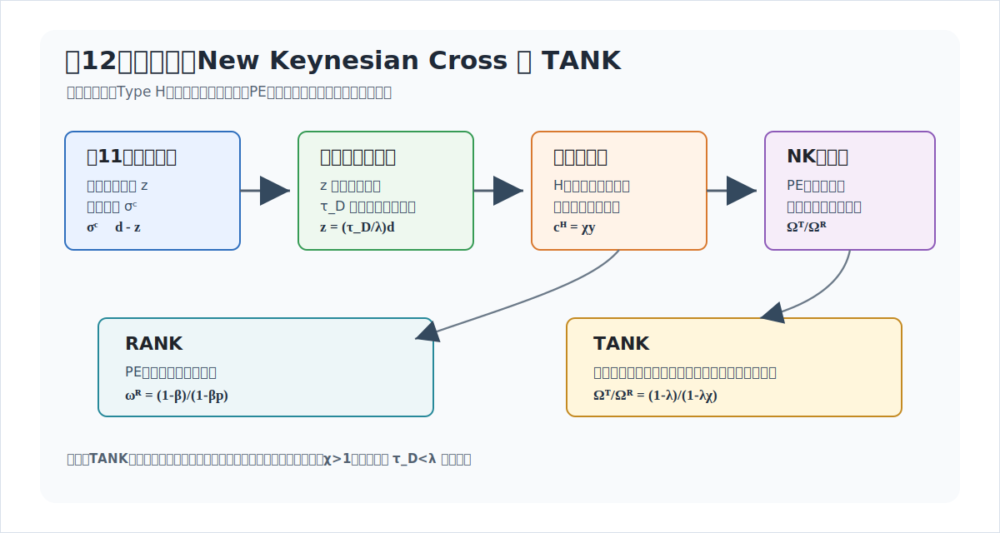
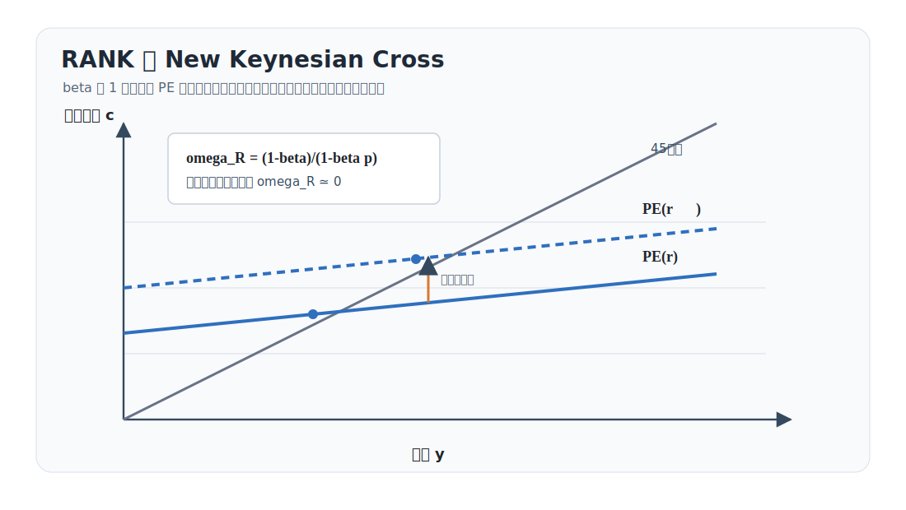
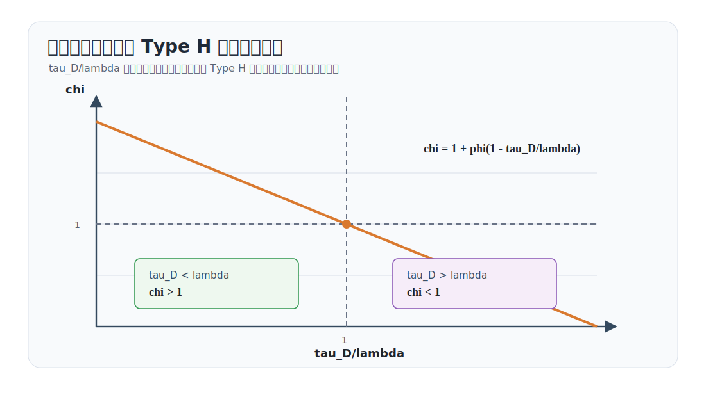
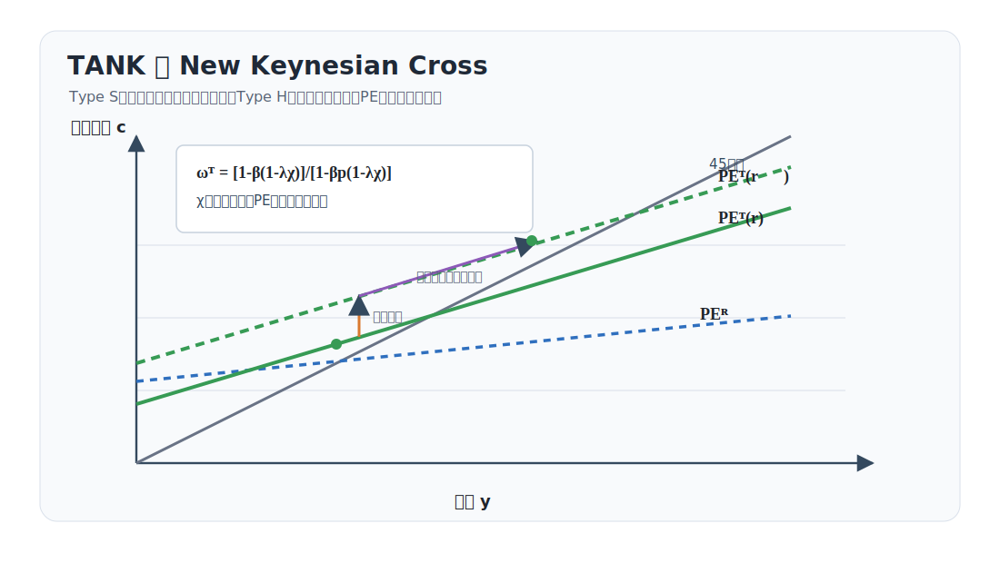
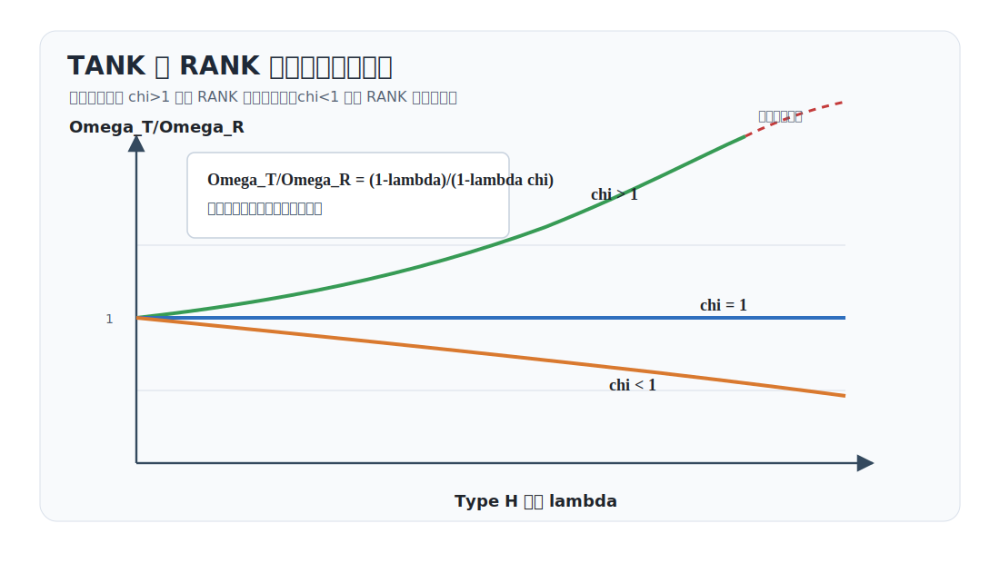
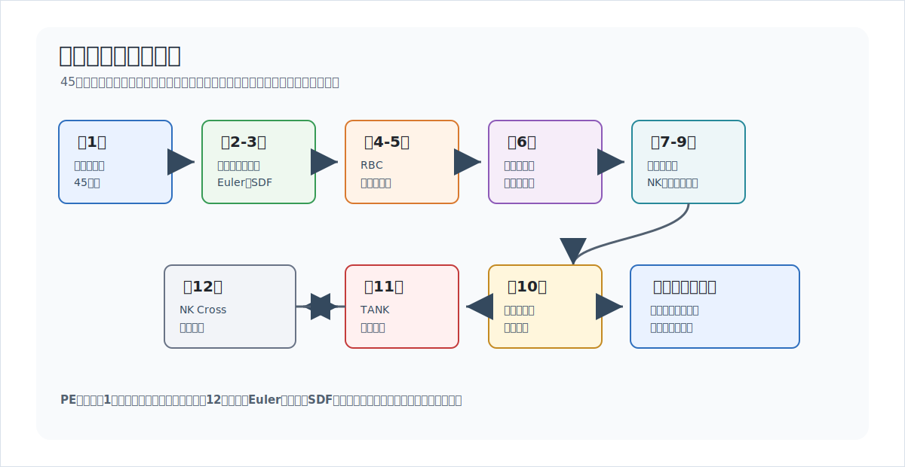

# 講義の目的

第12回では、第11回の TANK (Two-Agent New Keynesian) モデルを **New Keynesian Cross** として読み直します。第11回では、Type H 家計への移転 $z_t$ を外生的な再分配ショックとして扱いました。本回では、$z_t$ を外生ショックではなく、配当・独占利潤 $d_t$ の一部を Type H 家計へ移すルール
$$
z_t=\frac{\tau_D}{\lambda}d_t
$$
で決めます。ここで $\lambda$ は Type H 家計の人口比率、$\tau_D$ は配当・独占利潤のうち Type H 家計へ移転される割合です。

この変更の意味は大きいです。第11回の $z_t$ は、IS 曲線の右辺に入る外生的な需要シフトでした。第12回の $z_t$ は、産出が動くと配当が動き、配当が動くと移転が動く、という所得分配のフィードバックです。したがって、$z_t$ は外生的なショック項ではなく、計画支出曲線の傾きと利子率感応度を変える制度パラメータになります。

本回の中心は、TANK を3本の NK方程式としてではなく、**Planned Expenditure (PE) 曲線** と45度線の交点として読むことです。RANK (Representative-Agent New Keynesian) モデルでは、現在所得の変化が消費に与える影響は小さく、実質利子率を通じる直接効果が中心です。TANK では、Type H 家計が現在所得をすべて消費するため、現在所得を通じる間接効果が大きくなります。ただし、実質利子率に直接反応するのは Type S 家計だけなので、直接効果は RANK より小さくなります。

この2つの力をまとめる合成パラメータが
$$
\chi
\equiv
1+\varphi\left(1-\frac{\tau_D}{\lambda}\right)
$$
です。$\chi$ は、Type H 家計の消費、つまり現在所得が、集計所得に対して何倍動くかを表します。本回の結論は次の一文にまとめられます。

> 通常領域 $1-\lambda\chi>0$ のもとで、TANK が RANK より大きな総需要反応を持つのは、流動性制約家計がいること自体ではなく、Type H 家計の所得が集計所得より強く動くとき、すなわち $\chi>1$ のときである。

@fig-lecture12-overview は、本回の議論の流れを示しています。

{#fig-lecture12-overview width=95%}

# 略語と表記

## 用語

**New Keynesian (NK) モデル**とは、価格硬直性のもとで総需要が産出を決める標準的なニューケインジアン・モデルを指します。**RANK** は代表的家計を置く NKモデルです。**TANK** は流動性制約家計と貯蓄家計の2タイプを置く NKモデルです。本回では、**Type H** は hand-to-mouth、すなわち流動性制約家計、**Type S** は saver、すなわち貯蓄家計を表します。**HANK** は、より豊かな家計異質性、資産分布、自己保険、予備的貯蓄を持つ NKモデルです。本回は TANK までで止め、HANK の自己保険や予備的貯蓄は扱いません。

**Planned Expenditure (PE) 曲線**とは、所与の実質利子率のもとで、計画消費または計画支出を現在所得の関数として表す曲線です。政府支出を入れない本回では、計画支出は計画消費と同じです。**Marginal Propensity to Consume (MPC)** は限界消費性向、**Elasticity of Intertemporal Substitution (EIS)** は異時点間代替弾力性を指します。本講義ノートでは $\gamma$ が EIS の逆数なので、EIS は $1/\gamma$ です。

## 環境と家計タイプ

本回では、政府支出と技術ショックを入れません。財市場は
$$
y_t=c_t
$$
です。自然産出量はゼロに正規化します。したがって、本回の $y_t$ は、第11回の需給ギャップ $x_t$ と同じ役割を持ちます。

表記の混乱を避けるため、RANK と TANK で消費・所得の上付きの使い方を分けます。RANK では代表的家計しかいないので、原則として上付きなしの $c_t,y_t$ を使います。必要なときだけ代表的家計の消費・所得を $c_t^R,y_t^R$ と書きますが、均衡では
$$
c_t^R=c_t=y_t^R=y_t
$$
です。TANK では、Type H 家計と Type S 家計を明示するために $c_t^H,c_t^S$ を使います。集計消費は
$$
c_t=\lambda c_t^H+(1-\lambda)c_t^S
$$
です。

補論では、再帰的消費関数を一度に導出するため、家計タイプを $j$ で表します。RANK では $j=R$ で、$c_t^R=c_t$、$y_t^R=y_t$ です。TANK では、Euler 方程式を満たす Type S 家計についてだけ $j=S$ と置きます。Type H 家計は現在所得制約 $c_t^H=y_t^H$ で閉じるので、再帰的消費関数は使いません。

## Bilbiie 表記との対応

Bilbiie の表記では、異時点間代替弾力性を $\sigma$ と書くことがあります。本講義ノートでは第7回以降に合わせて、異時点間代替弾力性の逆数を $\gamma$ と書いています。したがって、Bilbiie 型の式に出てくる $\sigma$ は、このノートでは
$$
\sigma=\frac{1}{\gamma}
$$
と読み替えます。

## 記号一覧

表記の対応は次の通りです。

| Bilbiie 側で出やすい表記 | 本講義ノートでの読み方 |
|---|---|
| EIS の $\sigma$ | $1/\gamma$ |
| $\sigma_t^c$ | EIS ではなく、消費格差 $c_t^S-c_t^H$ |
| $d_t,z_t$ | 定常消費で割った一次近似。ログ乖離ではない |
| $\Omega_R,\Omega_T$ | 本回では実質利子率低下に対する総効果。資産保有量ではない |

: {tbl-colwidths="[24,76]"}

主な変数は次の通りです。

| 記号 | 意味 |
|---|---|
| $c_t$ | 集計消費。PE 曲線では計画消費、均衡では $c_t=y_t$ |
| $c_t^H,c_t^S$ | Type H、Type S の消費 |
| $c_t^R$ | RANK の代表的家計の消費。均衡では $c_t^R=c_t$ |
| $y_t$ | 産出。政府支出なしなので $y_t=c_t$ |
| $y_t^H,y_t^S$ | Type H、Type S の所得。Type H では $y_t^H=c_t^H$ |
| $y_t^R$ | RANK の代表的家計所得。均衡では $y_t^R=y_t$ |
| $n_t,w_t$ | 労働、実質賃金 |
| $j\in\{R,S\}$ | 再帰的消費関数の導出で使う家計タイプ。RANK では代表的家計、TANK では Type S 家計 |
| $Q_{t,t+i}^j$ | $j$ 家計の $t$ から $t+i$ への確率的割引因子 |
| $q_{t,t+i}^j$ | $j$ 家計の $t$ から $t+i$ への確率的割引因子の対数乖離 |
| $d_t$ | 配当・独占利潤を定常消費で割った一次近似 |
| $z_t$ | Type H 家計一人当たり移転を定常消費で割った一次近似 |
| $r_t$ | 事前実質利子率。自然利子率からの乖離として読む |
| $\sigma_t^c=c_t^S-c_t^H$ | 消費格差 |

: {tbl-colwidths="[22,78]"}

外生・較正パラメータは次の通りです。

| 記号 | 範囲 | 意味 |
|---|---:|---|
| $\beta$ | $(0,1)$ | 割引因子 |
| $\gamma$ | $>0$ | EIS の逆数。EIS は $1/\gamma$ |
| $\varphi$ | $>0$ | 労働供給弾力性の逆数 |
| $\lambda$ | $(0,1)$ | Type H 家計の人口比率 |
| $\tau_D$ | 制度係数 | 配当・独占利潤を Type H 家計へ移す割合を決める係数 |
| $p$ | $0\le p<1$ | $\mathbb{E}_t c_{t+1}=p c_t$ と置く簡約形の反応持続性 |

: {tbl-colwidths="[16,18,66]"}

派生係数は次の通りです。

| 記号 | 定義 | 役割 |
|---|---|---|
| $\chi$ | $1+\varphi\left(1-\tau_D/\lambda\right)$ | Type H 所得・消費の集計所得に対する反応係数 |
| $\Theta_D$ | $(1-\lambda\chi)/(1-\lambda)$ | Type S 所得を集計所得に戻す係数 |
| $\omega_R,\omega_T$ | PE 曲線の $y_t$ 係数 | RANK、TANK の PE 曲線の傾き。集計MPCと呼ばれることがある |
| $\Omega_R^D,\Omega_T^D$ | PE 曲線の $(-r_t)$ 係数 | 所得を固定したときの直接効果 |
| $\Omega_R,\Omega_T$ | $\Omega^D/(1-\omega)$ | 実質利子率低下に対する総効果 |

: {tbl-colwidths="[18,32,50]"}

Bilbiie の New Keynesian Cross では、$\omega_R$ や $\omega_T$ のような PE 曲線の傾きを MPC と呼ぶことがあります。ただし、ここでの MPC は、個別家計が手元所得1単位をどれだけ消費するかというミクロの限界消費性向そのものではありません。期待形成、持続性 $p$、家計タイプの構成、配当移転ルールを含んだ、集計 PE 曲線上の有効MPCです。特に Type H 家計の個別MPCは1ですが、$\omega_T$ はそれとは別の集計係数です。

通常の総需要領域では $0<\lambda\chi<1$、すなわち $1-\lambda\chi>0$ を仮定します。$1-\lambda\chi=0$ では NKクロスの乗数が発散し、$1-\lambda\chi<0$ では通常とは異なる反転領域になります。

# なぜ NKクロスに戻るのか

第7回では、代表的家計の Euler 方程式、価格硬直性、テイラー・ルールから RANK の3本の NK方程式を得ました。第11回では、家計を Type H と Type S に分け、Type S の Euler 方程式と Type H の現在所得制約から TANK の IS 曲線を導きました。

第12回では、NKフィリップス曲線やテイラー・ルールを前面に出しません。実質利子率 $r_t$ を所与として、計画消費が現在所得 $y_t$ にどう反応するかを見ます。これは Bilbiie の New Keynesian Cross の読み方です。PE 曲線と45度線の交点で均衡所得が決まるという図解に戻すことで、TANK の新しさを次の2つに分解できます。

1. 誰が実質利子率に直接反応するのか。
2. 誰が現在所得の変化をどれだけ消費に回すのか。

RANK では、代表的家計が資産市場を通じて消費を平準化するため、現在所得への反応は小さくなります。TANK では、Type H 家計が現在所得をすべて消費するため、所得フィードバックが強くなります。

ただし、TANK は常に RANK より大きな総需要反応を持つわけではありません。Type S 家計だけが Euler 方程式を満たすので、実質利子率に直接反応する家計の比率は $1-\lambda$ に下がります。TANK の総効果は、直接効果の縮小と所得フィードバックの増幅のどちらが勝つかで決まります。

# 対数線形化と方程式リスト

第12回では、NKフィリップス曲線とテイラー・ルールを前面に出さず、所与の実質利子率のもとで計画消費を現在所得の関数として書きます。対数線形化された体系は、次の方程式リストにまとめられます。

| No. | 名称 | 式 |
|---:|---|---|
| 1 | 共通 PE 曲線 | $c_t=\omega y_t+\Omega^D(-r_t)$ |
| 2 | 財市場均衡 | $y_t=c_t$ |
| 3 | NKクロス乗数 | $\Omega=\Omega^D/(1-\omega)$ |
| 4 | RANK 再帰的消費関数 | $c_t=(1-\beta)y_t-\dfrac{\beta}{\gamma}r_t+\beta\mathbb{E}_t c_{t+1}$ |
| 5 | 持続性仮定 | $\mathbb{E}_t c_{t+1}=p c_t$ |
| 6 | RANK の PE 係数 | $\omega_R=\dfrac{1-\beta}{1-\beta p},\quad \Omega_R^D=\dfrac{\beta}{\gamma(1-\beta p)}$ |
| 7 | 配当移転ルール | $z_t=\dfrac{\tau_D}{\lambda}d_t$ |
| 8 | 配当・独占利潤 | $d_t=-(\gamma+\varphi)y_t$ |
| 9 | Type H 消費 | $c_t^H=\chi y_t,\quad \chi=1+\varphi\left(1-\dfrac{\tau_D}{\lambda}\right)$ |
| 10 | Type S 所得 | $y_t^S=\dfrac{1-\lambda\chi}{1-\lambda}y_t$ |
| 11 | Type S 再帰的消費関数 | $c_t^S=(1-\beta)y_t^S-\dfrac{\beta}{\gamma}r_t+\beta\mathbb{E}_t c_{t+1}^S$ |
| 12 | TANK 集計 PE 曲線 | $c_t=\left[1-\beta(1-\lambda\chi)\right]y_t-(1-\lambda)\dfrac{\beta}{\gamma}r_t+\beta(1-\lambda\chi)\mathbb{E}_t c_{t+1}$ |
| 13 | TANK の PE 係数 | $\omega_T=\dfrac{1-\beta(1-\lambda\chi)}{1-\beta p(1-\lambda\chi)},\quad \Omega_T^D=\dfrac{(1-\lambda)\beta}{\gamma[1-\beta p(1-\lambda\chi)]}$ |
| 14 | RANK との総効果比 | $\dfrac{\Omega_T}{\Omega_R}=\dfrac{1-\lambda}{1-\lambda\chi}$ |

: {tbl-colwidths="[6,28,66]"}

RANK に戻すには、家計タイプの区別をなくします。TANK 固有の7番から13番の分配ブロックは $\lambda>0$ のもとで定義されるため、$\tau_D/\lambda$ を含む式にそのまま $\lambda=0$ を代入するのではなく、このブロックを落として、4番から6番の RANK の PE 曲線と1番から3番の共通 NKクロスだけで閉じます。第11回との違いは、外生的な再分配ショック $z_t$ を、7番の配当移転ルールで内生化する点です。その結果、分配ブロックは $z_t$ の外生項ではなく、9番の $\chi$ と10番の Type S 所得係数として PE 曲線の傾きに入ります。

# NKクロスの共通枠組み

RANK と TANK に入る前に、NKクロスの読み方をそろえます。所与の実質利子率のもとで、計画消費が
$$
c_t=\omega y_t+\Omega^D(-r_t)
$$
と書けるとします。$\omega$ は PE 曲線の傾き、$\Omega^D$ は所得を固定したときの実質利子率低下の直接効果です。

政府支出がないので、均衡では
$$
y_t=c_t
$$
です。したがって
$$
y_t
=
\omega y_t+\Omega^D(-r_t)
$$
となり、実質利子率低下の総効果は
$$
\Omega
\equiv
\frac{\partial y_t}{\partial(-r_t)}
=
\frac{\Omega^D}{1-\omega}
$$
です。この式の $1/(1-\omega)$ が、PE 曲線の傾きから来る NKクロスの乗数です。

第11回では、外生的な移転 $z_t$ が IS 曲線の右辺を直接動かしました。第12回では、$z_t$ を配当移転ルール
$$
z_t=\frac{\tau_D}{\lambda}d_t
$$
で内生化します。これにより、第11回の消費格差 $\sigma_t^c$ は、本回では Type H 所得・消費の反応係数 $\chi$ と、Type S 所得を集計所得に戻す係数 $\Theta_D$ として現れます。

# RANK の NKクロス

まず RANK を確認します。代表的家計の再帰的な消費関数は
$$
c_t
=
(1-\beta)y_t
-
\frac{\beta}{\gamma}r_t
+
\beta\mathbb{E}_t c_{t+1}
$$
です。これは Euler 方程式を家計の資産制約と組み合わせた表現です。現在所得 $y_t$ が高いほど今期消費は増え、実質利子率 $r_t$ が高いほど現在消費は下がります。
この式は、本回の補論で導出します。RANK では代表的家計しかいないので、補論の一般式で $j=R$、$c_t^R=c_t$、$y_t^R=y_t$ と置けばこの式になります。

消費反応について、簡約形の持続性を $p$ と置きます。
$$
\mathbb{E}_t c_{t+1}=p c_t,
\qquad
0\leq p<1
$$
これは構造的なショック過程そのものではなく、NKクロス図の中で将来消費の期待を現在消費に戻すための仮定です。このとき
$$
c_t
=
\frac{1-\beta}{1-\beta p}y_t
-
\frac{\beta}{\gamma(1-\beta p)}r_t
$$
です。したがって、RANK の PE 曲線は
$$
c_t=\omega_R y_t+\Omega_R^D(-r_t)
$$
と書けます。ただし
$$
\omega_R
=
\frac{1-\beta}{1-\beta p},
\qquad
\Omega_R^D
=
\frac{\beta}{\gamma(1-\beta p)}
$$
です。$\Omega_R^D$ は、所得を固定したときの実質利子率低下の直接効果です。

均衡では $c_t=y_t$ なので、
$$
y_t
=
\omega_R y_t+\Omega_R^D(-r_t)
$$
です。したがって、実質利子率低下の総効果は
$$
\Omega_R
=
\frac{\Omega_R^D}{1-\omega_R}
=
\frac{1}{\gamma(1-p)}
$$
となります。

## 整理1：RANK の NKクロス

RANK の PE 曲線は
$$
c_t
=
\frac{1-\beta}{1-\beta p}y_t
-
\frac{\beta}{\gamma(1-\beta p)}r_t
$$
である。均衡 $c_t=y_t$ のもとで、実質利子率低下の総効果は
$$
\Omega_R=\frac{1}{\gamma(1-p)}
$$
である。特に $p=0$ かつ $\beta\simeq1$ なら、PE 曲線の傾きは
$$
\omega_R\simeq0
$$
である。

この整理の直観は単純です。$\beta$ が 1 に近いと、代表的家計は現在所得の一時的な変化を消費にほとんど反映しません。所得が少し増えても、将来にわたって平準化するからです。したがって、RANK の NKクロスでは、実質利子率低下による PE 曲線の直接シフトが中心になります。

@fig-rank-nk-cross はこの関係を示しています。横軸は現在所得 $y_t$、縦軸は計画消費 $c_t$ です。RANK の PE 曲線はほぼ水平に近く、実質利子率低下で上方にシフトします。傾きが小さいため、シフト後の追加的な所得フィードバックは小さいです。

{#fig-rank-nk-cross width=88%}

# 第11回 TANK から第12回 TANK へ

第11回では、Type H 家計への移転 $z_t$ を外生変数として扱いました。分配ブロックを解くと、消費格差
$$
\sigma_t^c\equiv c_t^S-c_t^H
$$
は
$$
\sigma_t^c
=
\frac{\varphi}{\gamma+\varphi}
\frac{d_t-z_t}{1-\lambda}
$$
で与えられました。

第12回では、移転を配当・独占利潤に連動する配当移転ルールで決めます。
$$
z_t=\frac{\tau_D}{\lambda}d_t.
$$
したがって
$$
d_t-z_t
=
\left(1-\frac{\tau_D}{\lambda}\right)d_t
$$
です。

さらに、価格が硬直的で、技術をゼロに正規化し、政府支出なしで $y_t=c_t$ と置きます。生産関数は $y_t=n_t$ です。ここではゼロ定常配当のまわりで、かつ定常状態で $Y=WN=C$ となる正規化を使います。このとき、配当・独占利潤の一次近似は
$$
d_t=y_t-(w_t+n_t)
$$
です。$y_t=n_t$ なので
$$
d_t=-w_t
$$
です。柔軟賃金条件から
$$
w_t=\gamma c_t+\varphi n_t
$$
であり、$c_t=y_t$、$n_t=y_t$ を使えば
$$
w_t=(\gamma+\varphi)y_t
$$
です。したがって
$$
d_t=-(\gamma+\varphi)y_t
$$
を得ます。

これを消費格差の式に代入すると
$$
\sigma_t^c
=
-
\frac{\varphi}{1-\lambda}
\left(1-\frac{\tau_D}{\lambda}\right)y_t
$$
です。

集計式から
$$
c_t^H=c_t-(1-\lambda)\sigma_t^c
$$
です。$c_t=y_t$ を使うと
$$
c_t^H
=
\left[
1+\varphi\left(1-\frac{\tau_D}{\lambda}\right)
\right]y_t
$$
を得ます。ここで
$$
\chi
\equiv
1+\varphi\left(1-\frac{\tau_D}{\lambda}\right)
$$
と定義すれば、
$$
c_t^H=\chi y_t
$$
です。

## 整理2：配当移転 TANK の所得反応係数

Type H 家計への移転を
$$
z_t=\frac{\tau_D}{\lambda}d_t
$$
とし、配当・独占利潤を
$$
d_t=-(\gamma+\varphi)y_t
$$
と書けるとき、
$$
c_t^H=\chi y_t
$$
が成立する。ただし
$$
\chi
=
1+\varphi\left(1-\frac{\tau_D}{\lambda}\right)
$$
である。

この $\chi$ が本回の中心的な派生係数です。Type H 家計は現在所得をすべて消費するので、$c_t^H=y_t^H$ です。したがって $\chi$ は、Type H 所得と Type H 消費が、集計所得 $y_t$ に対して何倍動くかを表します。

# 配当移転ルールと $\chi$ の解釈

$\chi$ は
$$
\chi
=
1+\varphi\left(1-\frac{\tau_D}{\lambda}\right)
$$
です。$\varphi>0$ のもとで、次の3つのケースに分かれます。

第一に、
$$
\tau_D<\lambda
\quad\Longleftrightarrow\quad
\chi>1
$$
です。この場合、Type H 家計は配当・独占利潤の変動を人口比率より小さくしか負担しません。景気拡大で労働需要と実質賃金が上がると、Type H の労働所得は増えます。一方で、実質賃金の上昇は企業配当を下げますが、その下落の多くは Type S 家計が負担します。したがって、Type H の所得は集計所得より大きく反応します。

第二に、
$$
\tau_D=\lambda
\quad\Longleftrightarrow\quad
\chi=1
$$
です。この場合、配当・独占利潤は人口比率に応じて均等に分配されます。Type H 所得は集計所得と一対一で動きます。これは Campbell-Mankiw 型の手元所得消費者の仮定に対応します。

第三に、
$$
\tau_D>\lambda
\quad\Longleftrightarrow\quad
\chi<1
$$
です。この場合、Type H 家計は配当・独占利潤の変動を人口比率以上に負担します。景気拡大で実質賃金が上がると配当は下がるため、Type H への移転も強く下がります。これにより、Type H 所得の反応は集計所得より小さくなります。

@fig-chi-tax-rule は、$\tau_D/\lambda$ と $\chi$ の関係を示しています。横軸が1のところで $\chi=1$ です。左側では TANK は所得フィードバックを強め、右側では弱めます。

{#fig-chi-tax-rule width=88%}

ここで重要なのは、$\tau_D$ を外生ショックではなく、分配ルールの制度係数として扱う点です。ゼロ定常配当のまわりで一次近似しているため、制度係数 $\tau_D$ そのものの小さな時変ショックを入れても、定常配当がゼロであれば一次の需要ショックとしては現れにくいです。本回では、ショックは実質利子率 $r_t$ の変化とし、$\tau_D$ はその伝播を決める制度パラメータとして扱います。

# 均衡での Type S 消費と消費格差

集計消費は
$$
c_t
=
\lambda c_t^H+(1-\lambda)c_t^S
$$
です。この節では、均衡の消費配分を確認するために財市場均衡 $c_t=y_t$ を使います。ここに
$$
c_t^H=\chi y_t
$$
を代入すると
$$
y_t
=
\lambda\chi y_t+(1-\lambda)c_t^S
$$
です。したがって
$$
c_t^S
=
\frac{1-\lambda\chi}{1-\lambda}y_t
$$
を得ます。

Type S と Type H の消費格差は
$$
c_t^S-c_t^H
=
\frac{1-\lambda\chi}{1-\lambda}y_t-\chi y_t
=
\frac{1-\chi}{1-\lambda}y_t
$$
です。したがって、$\chi>1$ なら、景気拡大時に Type S と Type H の消費格差は縮小し、景気後退時には拡大します。この意味で、消費格差は反景気循環的です。逆に、$\chi<1$ なら、景気拡大時に格差は拡大し、景気後退時に縮小します。

第11回の消費格差 $\sigma_t^c$ と、本回の $\chi$ は同じ分配構造を別の角度から表しています。第11回では、$\sigma_t^c$ が TANK の IS 曲線の補正項として現れました。第12回では、同じ分配構造を
$$
c_t^H=\chi y_t
$$
という消費関数として読みます。

# TANK の集計 Euler 方程式

Type S 家計だけが Euler 方程式を持ちます。したがって
$$
c_t^S
=
\mathbb{E}_t c_{t+1}^S
-
\frac{1}{\gamma}r_t
$$
です。ここに
$$
c_t^S
=
\frac{1-\lambda\chi}{1-\lambda}c_t
$$
を代入します。係数は時点を通じて一定なので、
$$
\frac{1-\lambda\chi}{1-\lambda}c_t
=
\frac{1-\lambda\chi}{1-\lambda}\mathbb{E}_t c_{t+1}
-
\frac{1}{\gamma}r_t
$$
です。したがって
$$
c_t
=
\mathbb{E}_t c_{t+1}
-
\frac{1}{\gamma}
\frac{1-\lambda}{1-\lambda\chi}r_t
$$
を得ます。

第11回との接続を強めるため、
$$
\Theta_D
\equiv
\frac{1-\lambda\chi}{1-\lambda}
$$
と定義します。すると
$$
c_t
=
\mathbb{E}_t c_{t+1}
-
\frac{1}{\gamma\Theta_D}r_t
$$
です。さらに
$$
\chi
=
1+\varphi\left(1-\frac{\tau_D}{\lambda}\right)
$$
を代入すれば
$$
\Theta_D
=
1-
\frac{\lambda\varphi}{1-\lambda}
\left(1-\frac{\tau_D}{\lambda}\right)
$$
です。

## 整理3：配当移転 TANK の集計 Euler 方程式

Type S 家計だけが Euler 方程式を満たすとき、集計 Euler 方程式は
$$
c_t
=
\mathbb{E}_t c_{t+1}
-
\frac{1}{\gamma}
\frac{1-\lambda}{1-\lambda\chi}r_t
$$
である。第11回の記号では、
$$
\Theta_D=\frac{1-\lambda\chi}{1-\lambda}
$$
なので
$$
c_t
=
\mathbb{E}_t c_{t+1}
-
\frac{1}{\gamma\Theta_D}r_t
$$
である。

第11回では、外生的な $z_t$ が IS 曲線の右辺のショック項として入りました。第12回では、$z_t$ が $d_t$、さらに $y_t$ に連動するため、右辺の外生項ではなく、$\Theta_D$ を通じて利子率感応度を変えます。

# 通常の総需要領域

通常の総需要の読み方が成立するには
$$
1-\lambda\chi>0
$$
が必要です。これは
$$
\lambda\chi<1
$$
と同じです。この条件のもとでは、実質利子率 $r_t$ が上がると、集計消費 $c_t$ は下がります。

一方、
$$
1-\lambda\chi<0
$$
なら、Euler--IS の利子率係数の符号が反転します。この場合、実質利子率の上昇が集計需要を増やすという、通常とは異なる総需要論理になります。直観的には、Type H 家計から来る所得フィードバックが強すぎるため、45度線との交点の比較静学が通常の需要曲線として読みにくくなります。Bilbiie の TANK ではこの反転領域も重要な論点ですが、本回の本編では通常領域
$$
0<\lambda\chi<1
$$
を主対象にします。反転領域は、最後の発展問題で考えます。

# TANK の PE 曲線

NKクロスとして表すため、Type S の再帰的消費関数から始めます。
$$
c_t^S
=
(1-\beta)y_t^S
-
\frac{\beta}{\gamma}r_t
+
\beta\mathbb{E}_t c_{t+1}^S
$$
です。この式も補論の一般式で $j=S$ と置いたものです。TANK では Type S 家計だけが Euler 方程式を満たすので、再帰的消費関数を持つのは $c_t^S$ だけです。

Type H は現在所得をすべて消費するので、$y_t^H=c_t^H=\chi y_t$ です。集計所得
$$
y_t=\lambda y_t^H+(1-\lambda)y_t^S
$$
から、Type S の所得は
$$
y_t^S
=
\frac{1-\lambda\chi}{1-\lambda}y_t.
$$
また、将来期にも同じ分配ルールが続き、将来の均衡で $c_{t+1}=y_{t+1}$ が成り立つので、
$$
\mathbb{E}_t c_{t+1}^S
=
\frac{1-\lambda\chi}{1-\lambda}\mathbb{E}_t c_{t+1}
$$
です。ここでは現在の計画消費 $c_t$ を均衡条件で先に置き換えず、集計計画消費の式に戻して PE 曲線を作ります。

集計消費は
$$
c_t
=
\lambda c_t^H+(1-\lambda)c_t^S
$$
であり、$c_t^H=\chi y_t$ です。したがって
$$
\begin{aligned}
c_t
&=
\lambda\chi y_t
+
(1-\lambda)
\left[
(1-\beta)\frac{1-\lambda\chi}{1-\lambda}y_t
-
\frac{\beta}{\gamma}r_t
+
\beta\frac{1-\lambda\chi}{1-\lambda}\mathbb{E}_t c_{t+1}
\right]
\\
&=
\left[1-\beta(1-\lambda\chi)\right]y_t
-
(1-\lambda)\frac{\beta}{\gamma}r_t
+
\beta(1-\lambda\chi)\mathbb{E}_t c_{t+1}.
\end{aligned}
$$

この式が TANK の集計 PE 曲線です。RANK と TANK の違いは2つあります。

第一に、実質利子率に直接反応するのは Type S 家計だけなので、利子率項には $1-\lambda$ が掛かります。これは直接効果を小さくします。

第二に、Type H 家計の消費が現在所得に反応するため、$y_t$ の係数は
$$
1-\beta(1-\lambda\chi)
$$
になります。$\chi$ が大きいほど、PE 曲線は急になります。これは間接効果を大きくします。

持続性 $p$ を置き、
$$
\mathbb{E}_t c_{t+1}=p c_t
$$
とすれば
$$
c_t
=
\omega_T y_t+\Omega_T^D(-r_t)
$$
と書けます。ただし
$$
\omega_T
=
\frac{1-\beta(1-\lambda\chi)}
{1-\beta p(1-\lambda\chi)}
$$
であり、
$$
\Omega_T^D
=
\frac{(1-\lambda)\beta}
{\gamma[1-\beta p(1-\lambda\chi)]}
$$
です。

均衡 $c_t=y_t$ を使うと、実質利子率低下の総効果は
$$
\Omega_T
=
\frac{\Omega_T^D}{1-\omega_T}
=
\frac{1}{\gamma(1-p)}
\frac{1-\lambda}{1-\lambda\chi}
$$
となります。

@fig-tank-nk-cross は、このメカニズムを描いています。TANK では、PE 曲線の直接シフトは RANK より小さいです。しかし、PE 曲線が急になるため、45度線との交点は大きく動きます。これが所得フィードバックによる増幅です。

{#fig-tank-nk-cross width=88%}

# RANK との比較

RANK の乗数は
$$
\Omega_R
=
\frac{1}{\gamma(1-p)}
$$
でした。TANK の乗数は
$$
\Omega_T
=
\frac{1}{\gamma(1-p)}
\frac{1-\lambda}{1-\lambda\chi}
$$
です。したがって、TANK と RANK の比は
$$
\frac{\Omega_T}{\Omega_R}
=
\frac{1-\lambda}{1-\lambda\chi}
$$
です。

RANK と TANK の違いを横に並べると、次のようになります。

| 項目 | RANK | TANK |
|---|---|---|
| PE 曲線の傾き | $\omega_R=\dfrac{1-\beta}{1-\beta p}$ | $\omega_T=\dfrac{1-\beta(1-\lambda\chi)}{1-\beta p(1-\lambda\chi)}$ |
| 直接効果 | $\Omega_R^D=\dfrac{\beta}{\gamma(1-\beta p)}$ | $\Omega_T^D=\dfrac{(1-\lambda)\beta}{\gamma[1-\beta p(1-\lambda\chi)]}$ |
| 総効果 | $\Omega_R=\dfrac{1}{\gamma(1-p)}$ | $\Omega_T=\dfrac{1}{\gamma(1-p)}\dfrac{1-\lambda}{1-\lambda\chi}$ |
| RANK との比 | $1$ | $\dfrac{1-\lambda}{1-\lambda\chi}$ |

: {tbl-colwidths="[18,41,41]"}

この比は、2つの要素に分けて読めます。
$$
\frac{\Omega_T}{\Omega_R}
=
\underbrace{(1-\lambda)}_{\text{Type S 家計の直接効果}}
\times
\underbrace{\frac{1}{1-\lambda\chi}}_{\text{所得フィードバック成分}}.
$$
この分解は、総効果比を読むための正確な代数分解です。ただし、$p>0$ のとき、右辺の各項は PE 曲線の直接シフト比や PE 乗数比そのものではありません。PE 曲線の乗数は、一般には $1/(1-\omega_R)$ と $1/(1-\omega_T)$ です。

それでも、第1項の $1-\lambda$ は、実質利子率に直接反応するのが Type S 家計だけであることを表します。Type H 家計は Euler 方程式を持たないので、直接効果だけを見れば、TANK の反応は RANK より小さくなります。

第2項の
$$
\frac{1}{1-\lambda\chi}
$$
は、RANK との比較で残る Type H 所得フィードバック成分です。Type H 家計の計画消費は $c_t^H=\chi y_t$ なので、集計計画消費のうち Type H 家計から来る所得フィードバックの傾きは $\lambda\chi$ です。通常ケースで $0<\lambda\chi<1$ なら、
$$
\frac{1}{1-\lambda\chi}
=
1+\lambda\chi+(\lambda\chi)^2+\cdots
$$
と書けます。最初の需要増加が所得を増やし、その所得増加が Type H 家計の消費を $\lambda\chi$ だけ増やし、それがさらに所得を増やす、という無限等比級数です。

したがって、TANK の総効果は「利子率に直接反応する家計は $1-\lambda$ に減るが、Type H の所得フィードバックが $1/(1-\lambda\chi)$ として総効果比を押し上げる」と読めます。この所得フィードバック成分が十分に大きければ、TANK の総需要反応は RANK を上回ります。

通常領域 $1-\lambda\chi>0$ のもとで、
$$
\frac{\Omega_T}{\Omega_R}>1
$$
となる条件は
$$
1-\lambda>1-\lambda\chi
$$
です。$\lambda>0$ なら、これは
$$
\chi>1
$$
と同値です。配当移転ルールを代入すれば
$$
\chi>1
\quad\Longleftrightarrow\quad
\tau_D<\lambda
$$
です。

## 整理4：TANK の増幅条件

通常領域 $1-\lambda\chi>0$ のもとで、TANK の実質利子率低下に対する総効果が RANK より大きいことと、$\chi>1$ は同値である。配当移転ルールのもとでは、これは
$$
\tau_D<\lambda
$$
と同値である。

この整理は、TANK の直観をまとめるものです。流動性制約家計が存在すると、実質利子率に直接反応する家計の比率は下がります。これは TANK の直接効果を小さくします。しかし、Type H 家計は現在所得をすべて消費するため、所得フィードバックは大きくなります。TANK が RANK より大きな総需要反応を持つのは、所得フィードバックの増加が直接効果の低下を上回る場合です。その条件が $\chi>1$ であり、配当移転ルールのもとでは $\tau_D<\lambda$ です。

@fig-multiplier-ratio は、乗数比
$$
\frac{\Omega_T}{\Omega_R}
=
\frac{1-\lambda}{1-\lambda\chi}
$$
を、各曲線で $\chi$ を固定して $\lambda$ の関数として描いています。通常領域では、$\chi>1$ なら比は1を上回り、$\chi=1$ なら1に等しく、$\chi<1$ なら1を下回ります。

{#fig-multiplier-ratio width=88%}

# 数値例

第11回と同じ較正を使います。

| パラメータ | 値 | 意味 |
|---|---:|---|
| $\beta$ | $0.99$ | 割引因子 |
| $\gamma$ | $1$ | EIS の逆数 |
| $\varphi$ | $1$ | 労働供給弾力性の逆数 |
| $\lambda$ | $0.30$ | Type H 家計の人口比率 |
| $p$ | $0$ | 一時的な反応 |

: {tbl-colwidths="[16,14,70]"}

RANK では
$$
\omega_R=1-\beta=0.01
$$
であり、
$$
\Omega_R=1
$$
です。TANK では、配当移転ルールによって結果が変わります。

次の表の $\Theta_D$ は
$$
\Theta_D=\frac{1-\lambda\chi}{1-\lambda}
$$
です。$\lambda\chi<1$ なら通常領域です。

| ケース | $\chi$ | $\lambda\chi$ | $\Theta_D$ | $\Omega_T/\Omega_R$ | 解釈 |
|---:|---:|---:|---:|---:|---|
| $\tau_D=0$ | $2.00$ | $0.60$ | $0.571$ | $1.75$ | Type H 所得が集計所得より強く動き、TANK は増幅する |
| $\tau_D=\lambda=0.30$ | $1.00$ | $0.30$ | $1.000$ | $1.00$ | Campbell-Mankiw 型の基準。総効果は RANK と同じ |
| $\tau_D=0.45$ | $0.50$ | $0.15$ | $1.214$ | $0.824$ | Type H 所得の反応が弱く、TANK は抑制する |

: {tbl-colwidths="[16,11,12,13,14,34]"}

$\tau_D=0$ では、
$$
\chi=2,
\qquad
\Theta_D=\frac{1-0.3\cdot2}{0.7}\simeq0.571
$$
なので
$$
\Omega_T=\frac{1}{\Theta_D}\simeq1.75
$$
です。同じ1%の実質利子率低下は、RANK では消費を約1%、TANK では約1.75%増やします。

$\tau_D=\lambda$ では、$\chi=1$ なので
$$
\Omega_T=\Omega_R=1
$$
です。ただし、直接効果と間接効果の内訳は RANK と異なります。TANK では直接効果が小さく、所得フィードバックが大きいですが、両者がちょうど相殺されます。

$\tau_D=0.45$ では、
$$
\chi=0.5
$$
なので
$$
\frac{\Omega_T}{\Omega_R}
=
\frac{0.7}{1-0.3\cdot0.5}
\simeq0.824
$$
です。この場合、TANK は RANK より小さい総需要反応を持ちます。

この数値例から分かるように、配当移転ルールが「Type H への移転を増やすから常に総需要を増やす」とは言えません。ここで問題になっているのは、静学的な移転額ではなく、景気変動時に Type H 所得が集計所得に何倍反応するかです。

# 本回と講義全体のまとめ

## 本回のまとめ

第12回の結論は3つです。

第一に、RANK の NKクロスでは、PE 曲線の傾きが小さいです。したがって、金融政策の効果は主に EIS を通じる直接効果として読まれます。現在所得の変化を通じる間接効果は、$\beta\simeq1$ のもとでは小さくなります。

第二に、TANK では、Type H 家計が現在所得をすべて消費するため、PE 曲線の傾きが大きくなります。ただし、実質利子率に直接反応するのは Type S 家計だけなので、PE 曲線の直接シフトは小さくなります。

第三に、TANK が RANK より大きな総需要反応を持つかどうかは、Type H 家計の所得が集計所得に対して何倍動くか、すなわち $\chi$ によって決まります。配当移転ルールのもとでは
$$
\chi
=
1+\varphi\left(1-\frac{\tau_D}{\lambda}\right)
$$
であり、
$$
\tau_D<\lambda
\quad\Longleftrightarrow\quad
\chi>1
$$
なら増幅、
$$
\tau_D=\lambda
\quad\Longleftrightarrow\quad
\chi=1
$$
なら RANK と同じ総効果、
$$
\tau_D>\lambda
\quad\Longleftrightarrow\quad
\chi<1
$$
なら抑制です。

TANK は、単に流動性制約家計を足したモデルではありません。分配ルールが Type H の所得反応係数 $\chi$ を決め、その $\chi$ が PE 曲線の傾きと総需要反応を決めます。これが New Keynesian Cross から見た TANK の核心です。

## 第1回から第12回までの対応

この講義全体の流れは、学部マクロで見た「需要が産出を決める」という考えを、動学的最適化、一般均衡、価格硬直性、金融政策、家計異質性の言葉で作り直すことでした。第12回の NKクロスは、第1回の45度線分析に戻っているように見えます。しかし、戻っているだけではありません。今回は、PE 曲線の傾きとシフトが、Euler 方程式、SDF、配当、移転、家計タイプから導かれています。

第1回から第12回までの対応は次のように整理できます。

| 回 | 中心テーマ | 第12回との対応 |
|---:|---|---|
| 第1回 | 学部マクロの復習 | 45度線、IS-LM、AD-AS の直観が、最後に NKクロスとして戻る |
| 第2回 | 時系列分析と対数線形近似 | 持続性 $p$、期待値、対数線形化された消費・所得・利子率の表記を支える |
| 第3回 | 動学的最適化と資産価格付け | Euler 方程式、SDF、横断性条件が、補論の再帰的消費関数の基礎になる |
| 第4回 | 資本なし RBC | 家計・企業・労働市場の一般均衡と自然産出量の基準を作る |
| 第5回 | 政府部門 | 政府支出、税、移転の区別を導入し、$z_t$ を再分配として読む準備をする |
| 第6回 | 独占的競争 | マークアップと独占利潤を導入し、配当・独占利潤 $d_t$ の意味を作る |
| 第7回 | 価格硬直性 | RANK の IS 曲線、NKPC、テイラー・ルールを得て、需要が産出を動かす NKモデルに入る |
| 第8回 | RANKモデル | 代表的家計の Euler 方程式が集計需要を決めるベンチマークを確認する |
| 第9回 | 最適金融政策とルール | 実質利子率と政策ルールが総需要をどう動かすかを整理する |
| 第10回 | 価格・賃金硬直性をもつ RANK | 同じ集計需要でも賃金所得と配当所得の分解が変わることを確認する |
| 第11回 | 価格硬直性をもつ TANK | Type S の Euler 方程式、Type H の現在所得制約、消費格差 $\sigma_t^c$ を導入する |
| 第12回 | NK Cross と TANK | 配当移転ルールから $\chi$ を導き、PE 曲線の傾きと総需要増幅を読む |

: {tbl-colwidths="[10,27,63]"}

この表から分かるように、第12回は新しいトピックを単に足した回ではありません。これまでの部品を組み合わせ直す回です。第3回の Euler 方程式は、RANK と Type S 家計の消費関数になります。第6回の独占利潤は、TANK の配当 $d_t$ になります。第5回の移転は、Type H 家計への $z_t$ になります。第7回以降の価格硬直性は、所与の実質利子率のもとで需要が産出を決める環境を作ります。第11回の消費格差は、第12回では $c_t^H=\chi y_t$ という PE 曲線の傾きとして読み替えられます。

## 講義全体を貫く3つの見方

第一に、**現在所得と将来所得の区別**です。学部マクロの消費関数では、現在所得が消費を動かします。動学的最適化では、家計は将来所得まで見て消費を平準化します。RANK の PE 曲線がほぼ水平になるのは、この平準化の力が強いからです。TANK では、Type H 家計だけが学部マクロに近い現在所得消費を行うため、現在所得フィードバックが戻ってきます。

第二に、**相対価格と数量調整の区別**です。RBC では価格と賃金が柔軟に動き、産出は主に供給側で決まります。NKモデルでは価格が硬直的なので、実質利子率が需要を動かし、需要が産出を動かします。したがって、RBC の自然産出量は、NK で需給ギャップを定義する基準になります。

第三に、**集計量と分配の区別**です。RANK では、代表的家計が賃金所得、配当所得、資産収益をまとめて受け取るため、誰が所得を受け取るかは集計需要に出にくいです。TANK では、Type H と Type S の MPC が違うため、同じ集計所得でも、賃金・配当・移転の分配が総需要を変えます。第12回の $\chi$ は、この分配チャネルを1つの係数にまとめたものです。

## 最終的な見取り図

この講義で作ってきたモデルは、次の順序で積み上がっています。

{#fig-course-roadmap width=95%}

最初の45度線分析では、PE 曲線は外から与えられていました。最後の NKクロスでは、PE 曲線の傾きもシフトも、家計の最適化と分配ルールから導かれます。これが、本講義全体で得たもっとも大きな進歩です。

最終的なメッセージは次の通りです。金融政策の効果は、単に「利子率が下がると消費が増える」という直接効果だけでは決まりません。誰が Euler 方程式を持ち、誰が現在所得を消費し、賃金所得・配当所得・移転が誰に入るかによって、所得フィードバックの大きさが変わります。TANK の NKクロスは、そのことをもっとも簡潔に示す枠組みです。

## 今後の発展

本講義は TANK で止めますが、ここから先にはいくつかの自然な発展があります。重要なのは、発展先がすべて本講義で作った部品の拡張になっていることです。

第一に、**HANKモデルへの拡張**です。TANK では家計を Type H と Type S の2タイプに分けました。HANK では、資産保有、所得リスク、借入制約、MPC が連続的に分布します。すると、総需要反応は単一の $\chi$ だけではなく、家計分布全体、限界消費性向の分布、所得リスク、流動性制約の強さで決まります。本回の $\chi$ は、その豊かな分布効果を2タイプに圧縮した最小限の表現です。

第二に、**資本と投資の導入**です。本講義では資本なしモデルを使いました。資本を入れると、財市場は
$$
y_t=c_t+i_t+g_t
$$
となり、総需要は消費だけでは閉じません。実質利子率は消費だけでなく投資にも作用します。また、企業価値、配当、資本収益の分配がより重要になります。第3回の資産価格付けと第4回の RBC の考え方が、ここで再び必要になります。

第三に、**財政政策との接続**です。本回の $z_t$ は配当移転ルールとして扱いましたが、現実の政策では政府支出、所得税、消費税、社会保険料、給付が同時に動きます。TANK や HANK では、財政政策の効果は「政府がいくら支出したか」だけでは決まりません。誰に課税し、誰に移転し、その家計の MPC がどれだけ高いかが乗数を決めます。第5回の政府部門は、この方向への入口です。

第四に、**名目賃金硬直性と所得分配の相互作用**です。第10回では価格硬直性と賃金硬直性を扱いました。第11回と第12回では、TANK を価格硬直性だけで分析しました。これらを合わせると、賃金調整の遅れが Type H と Type S の労働所得をどう変え、消費格差と総需要をどう動かすかを分析できます。賃金硬直性は、単にフィリップス曲線を変えるだけでなく、分配チャネルも変えます。

第五に、**非線形性と制約付き政策**です。本講義では一次近似を中心にしました。しかし、ゼロ金利制約、大きなショック、借入制約の強い家計が多い局面では、線形近似だけでは不十分です。通常領域 $1-\lambda\chi>0$ と反転領域 $1-\lambda\chi<0$ の境界も、非線形モデルではより慎重に扱う必要があります。第9回の政策ルールと安定性の議論は、この方向の基礎になります。

第六に、**実証との接続**です。本回の $\chi$ は、Type H 所得が集計所得にどれだけ反応するかを表す係数でした。現実のデータでこれを考えるには、所得階層別の労働所得、資本所得、移転、MPC を測る必要があります。TANK や HANK の政策含意は、これらの分布データに強く依存します。理論式
$$
\frac{\Omega_T}{\Omega_R}
=
\frac{1-\lambda}{1-\lambda\chi}
$$
は、どの統計量を測れば総需要反応の大きさを評価できるかを教えています。

この先の発展を一言でまとめると、次の問いになります。

> 総需要を動かす政策は、誰の所得を動かし、その人がどれだけ消費するのか。

第12回の NKクロスは、この問いをもっとも単純な TANKモデルで表したものです。HANK、資本、財政政策、非線形制約、実証分析は、すべてこの問いをより現実的な環境で考えるための発展です。

# 参考文献

**必読**

- Bilbiie, Florin O. (2020) "The New Keynesian Cross." *Journal of Monetary Economics*, 114, 90-108. https://doi.org/10.1016/j.jmoneco.2019.03.003
- Bilbiie, Florin O. (2008) "Limited Asset Markets Participation, Monetary Policy and (Inverted) Aggregate Demand Logic." *Journal of Economic Theory*, 140(1), 162-196. https://doi.org/10.1016/j.jet.2007.07.008
- Galí, Jordi, J. David López-Salido, and Javier Vallés (2007) "Understanding the Effects of Government Spending on Consumption." *Journal of the European Economic Association*, 5(1), 227-270. https://doi.org/10.1162/JEEA.2007.5.1.227

**発展**

- Kaplan, Greg, Benjamin Moll, and Giovanni L. Violante (2018) "Monetary Policy According to HANK." *American Economic Review*, 108(3), 697-743. https://doi.org/10.1257/aer.20160042
- McKay, Alisdair, Emi Nakamura, and Jón Steinsson (2016) "The Power of Forward Guidance Revisited." *American Economic Review*, 106(10), 3133-3158. https://doi.org/10.1257/aer.20150063
- Auclert, Adrien (2019) "Monetary Policy and Redistribution." *American Economic Review*, 109(6), 2333-2367.
- Werning, Iván (2015) "Incomplete Markets and Aggregate Demand." NBER Working Paper No. 21448.

# 演習問題

## 基本問題

**問1：RANK の PE 曲線**

RANK の消費関数
$$
c_t=(1-\beta)y_t-\frac{\beta}{\gamma}r_t+\beta\mathbb{E}_t c_{t+1}
$$
から、持続性 $p$ のもとで
$$
\omega_R=\frac{1-\beta}{1-\beta p},
\qquad
\Omega_R=\frac{1}{\gamma(1-p)}
$$
を導出しなさい。

**問2：配当移転ルールと Type H 消費**

第11回の分配式
$$
\sigma_t^c
=
\frac{\varphi}{\gamma+\varphi}
\frac{d_t-z_t}{1-\lambda}
$$
に
$$
z_t=\frac{\tau_D}{\lambda}d_t,
\qquad
d_t=-(\gamma+\varphi)y_t
$$
を代入し、
$$
c_t^H
=
\left[
1+\varphi\left(1-\frac{\tau_D}{\lambda}\right)
\right]y_t
$$
を導出しなさい。

**問3：Type S 消費**

集計式
$$
y_t=\lambda c_t^H+(1-\lambda)c_t^S
$$
と
$$
c_t^H=\chi y_t
$$
から、
$$
c_t^S=\frac{1-\lambda\chi}{1-\lambda}y_t
$$
を示しなさい。

**問4：TANK の集計 Euler 方程式**

Type S の Euler 方程式
$$
c_t^S=\mathbb{E}_t c_{t+1}^S-\frac{1}{\gamma}r_t
$$
を用いて、TANK の集計 Euler 方程式
$$
c_t
=
\mathbb{E}_t c_{t+1}
-
\frac{1}{\gamma}
\frac{1-\lambda}{1-\lambda\chi}r_t
$$
を導出しなさい。

**問5：TANK の PE 曲線**

Type S の再帰的消費関数
$$
c_t^S
=
(1-\beta)y_t^S
-
\frac{\beta}{\gamma}r_t
+
\beta\mathbb{E}_t c_{t+1}^S
$$
と $c_t^H=\chi y_t$ を用いて、集計 PE 曲線
$$
c_t
=
\left[1-\beta(1-\lambda\chi)\right]y_t
-
(1-\lambda)\frac{\beta}{\gamma}r_t
+
\beta(1-\lambda\chi)\mathbb{E}_t c_{t+1}
$$
を導出しなさい。

## 発展問題

**問6：増幅条件**

通常領域 $1-\lambda\chi>0$ のもとで、
$$
\frac{\Omega_T}{\Omega_R}
=
\frac{1-\lambda}{1-\lambda\chi}
$$
が1を上回る条件を求めなさい。その条件を $\tau_D$ と $\lambda$ の関係で表しなさい。

**問7：数値例**

$\lambda=0.3$、$\varphi=1$、$\gamma=1$、$p=0$ とする。$\tau_D=0$、$\tau_D=\lambda$、$\tau_D=0.45$ の3ケースについて、$\chi$、$\Theta_D$、$\Omega_T/\Omega_R$ を計算しなさい。

**問8：反転領域**

$\lambda\chi>1$ の場合、TANK の集計 Euler 方程式の利子率係数の符号がどう変わるかを説明しなさい。その場合、通常の総需要曲線として読みにくくなる理由を述べなさい。

**問9：直接効果と間接効果**

TANK では、実質利子率に直接反応する家計の比率が $1-\lambda$ に下がるにもかかわらず、総効果が RANK より大きくなりうる。この理由を、PE 曲線の直接シフトと傾きの2つに分けて説明しなさい。

# 補論：再帰的消費関数の導出

本編では、RANK の代表的家計と TANK の Type S 家計について、再帰的消費関数
$$
c_t^j
=
(1-\beta)y_t^j
-
\frac{\beta}{\gamma}r_t
+
\beta\mathbb{E}_t c_{t+1}^j
$$
を使いました。ここでは、異時点間予算制約からこの式を導きます。$j=R$ なら RANK の代表的家計、$j=S$ なら TANK の Type S 家計です。Type H 家計は Euler 方程式を満たさないので、この補論の対象ではありません。

::: {.callout-note}
## 第3回との関係

Euler 方程式、確率的割引因子、無限期間の横断性条件は、第3回「動学的最適化と資産価格付け」で導出しました。この補論では、それらを導き直すのではなく、第3回の結果を第12回の表記に直し、RANK と TANK の PE 曲線で使う再帰的消費関数を得る部分だけを確認します。
:::

## 確率的割引因子

第3回で定義した多期間の確率的割引因子を、家計タイプ $j$ について $Q_{t,t+i}^j$ と書きます。定常状態では $Q_{t,t+i}^j=\beta^i$ なので、その対数乖離を
$$
q_{t,t+i}^j
\equiv
\log Q_{t,t+i}^j-\log \beta^i
$$
とします。CRRA 効用のもとで、第3回の SDF の定義を対数線形化すると
$$
q_{t,t+i}^j
=
-\gamma\left(c_{t+i}^j-c_t^j\right)
$$
です。したがって
$$
c_t^j
=
\mathbb{E}_t c_{t+i}^j
+
\frac{1}{\gamma}\mathbb{E}_t q_{t,t+i}^j
$$
です。また、$i$ 期間の割引ファクターは1期間の割引ファクターの和なので、
$$
\mathbb{E}_t q_{t,t+i}^j
=
-\mathbb{E}_t\sum_{k=0}^{i-1}r_{t+k}
$$
です。

## 現在価値型の消費関数

第3回で見たように、各期の予算制約を確率的割引因子で現在価値に直して足し合わせ、横断性条件で終端資産項を消すと、生涯予算制約が得られます。定常周りで純金融資産をゼロに正規化し、消費と所得だけを残すと、
$$
\mathbb{E}_t
\sum_{i=0}^{\infty}
\beta^i
\left(
q_{t,t+i}^j+c_{t+i}^j
\right)
=
\mathbb{E}_t
\sum_{i=0}^{\infty}
\beta^i
\left(
q_{t,t+i}^j+y_{t+i}^j
\right)
$$
です。この両辺に
$$
\left(\frac{1}{\gamma}-1\right)
\mathbb{E}_t
\sum_{i=0}^{\infty}
\beta^i q_{t,t+i}^j
$$
を加えます。これは、左辺の $q_{t,t+i}^j+c_{t+i}^j$ を
$$
c_{t+i}^j+\frac{1}{\gamma}q_{t,t+i}^j
$$
に変えるための操作です。実際、左辺は
$$
\mathbb{E}_t
\sum_{i=0}^{\infty}
\beta^i
\left(
c_{t+i}^j+\frac{1}{\gamma}q_{t,t+i}^j
\right)
$$
になります。前節の Euler 方程式から、任意の $i$ について
$$
c_t^j
=
\mathbb{E}_t c_{t+i}^j
+
\frac{1}{\gamma}\mathbb{E}_t q_{t,t+i}^j
$$
です。したがって、期待値の中の各 $i$ 期先の項は、$t$ 期から見れば $c_t^j$ に等しくなります。よって左辺全体は
$$
\sum_{i=0}^{\infty}\beta^i c_t^j
=
\frac{1}{1-\beta}c_t^j
$$
です。ここで $i=0$ の項については、$q_{t,t}^j=0$ なので同じ式がそのまま成り立ちます。

右辺は、所得項と確率的割引因子項に分けて
$$
\mathbb{E}_t
\sum_{i=0}^{\infty}
\beta^i y_{t+i}^j
+
\frac{1}{\gamma}
\mathbb{E}_t
\sum_{i=0}^{\infty}
\beta^i q_{t,t+i}^j
$$
と書けます。残る仕事は、最後の $q$ の割引和を実質利子率の割引和で書き直すことです。

まず
$$
\mathbb{E}_t
\sum_{i=0}^{\infty}
\beta^i q_{t,t+i}^j
=
-\frac{\beta}{1-\beta}
\sum_{i=0}^{\infty}
\beta^i\mathbb{E}_t r_{t+i}
$$
を確認します。$i$ 期間の割引ファクターは1期間割引ファクターの和なので、
$$
\mathbb{E}_t q_{t,t+i}^j
=
-
\mathbb{E}_t\sum_{k=0}^{i-1}r_{t+k}
$$
でした。これを代入すると
$$
\begin{aligned}
\mathbb{E}_t
\sum_{i=0}^{\infty}\beta^i q_{t,t+i}^j
&=
-
\sum_{i=1}^{\infty}\beta^i
\mathbb{E}_t\sum_{k=0}^{i-1}r_{t+k}
\\
&=
-
\sum_{k=0}^{\infty}
\left(\sum_{i=k+1}^{\infty}\beta^i\right)
\mathbb{E}_t r_{t+k}
\\
&=
-
\sum_{k=0}^{\infty}
\frac{\beta^{k+1}}{1-\beta}
\mathbb{E}_t r_{t+k}
\\
&=
-
\frac{\beta}{1-\beta}
\sum_{k=0}^{\infty}
\beta^k\mathbb{E}_t r_{t+k}.
\end{aligned}
$$
2行目では、$r_{t+k}$ が $q_{t,t+i}^j$ に含まれるのは $i\geq k+1$ のときであることを使っています。

以上をまとめると、
$$
\frac{1}{1-\beta}c_t^j
=
\mathbb{E}_t
\sum_{i=0}^{\infty}
\beta^i y_{t+i}^j
-
\frac{1}{\gamma}
\frac{\beta}{1-\beta}
\sum_{i=0}^{\infty}
\beta^i\mathbb{E}_t r_{t+i}
$$
です。両辺に $1-\beta$ を掛ければ、
$$
c_t^j
=
(1-\beta)
\sum_{i=0}^{\infty}
\beta^i\mathbb{E}_t y_{t+i}^j
-
\frac{\beta}{\gamma}
\sum_{i=0}^{\infty}
\beta^i\mathbb{E}_t r_{t+i}
$$
を得ます。

## 再帰的表現

現在価値型の式で、$i=0$ の項と $i\geq1$ の項を分けると、将来部分は $\beta\mathbb{E}_t c_{t+1}^j$ です。したがって
$$
c_t^j
=
(1-\beta)y_t^j
-
\frac{\beta}{\gamma}r_t
+
\beta\mathbb{E}_t c_{t+1}^j
$$
となります。

RANK では $j=R$、$c_t^R=c_t$、$y_t^R=y_t$ と置けば、本編の RANK の再帰的消費関数になります。TANK では $j=S$ と置き、現在の Type S 所得
$$
y_t^S=\frac{1-\lambda\chi}{1-\lambda}y_t
$$
と将来均衡から得られる
$$
\mathbb{E}_t c_{t+1}^S
=
\frac{1-\lambda\chi}{1-\lambda}\mathbb{E}_t c_{t+1}
$$
を使います。そのうえで、現在の集計計画消費
$$
c_t=\lambda\chi y_t+(1-\lambda)c_t^S
$$
に戻すと、本編の TANK の PE 曲線が得られます。
