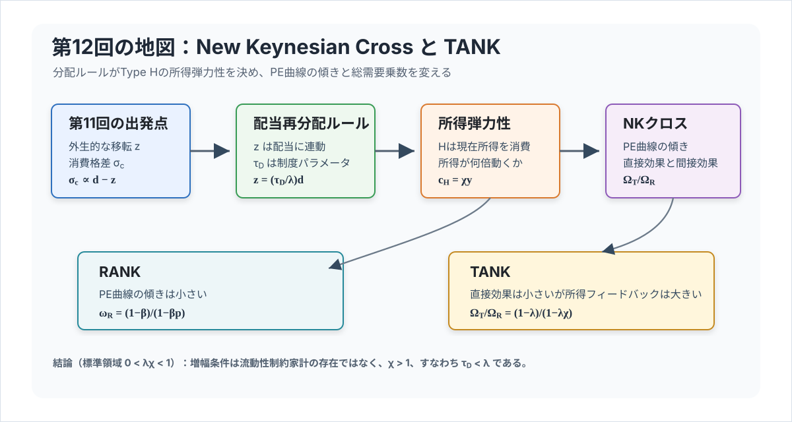
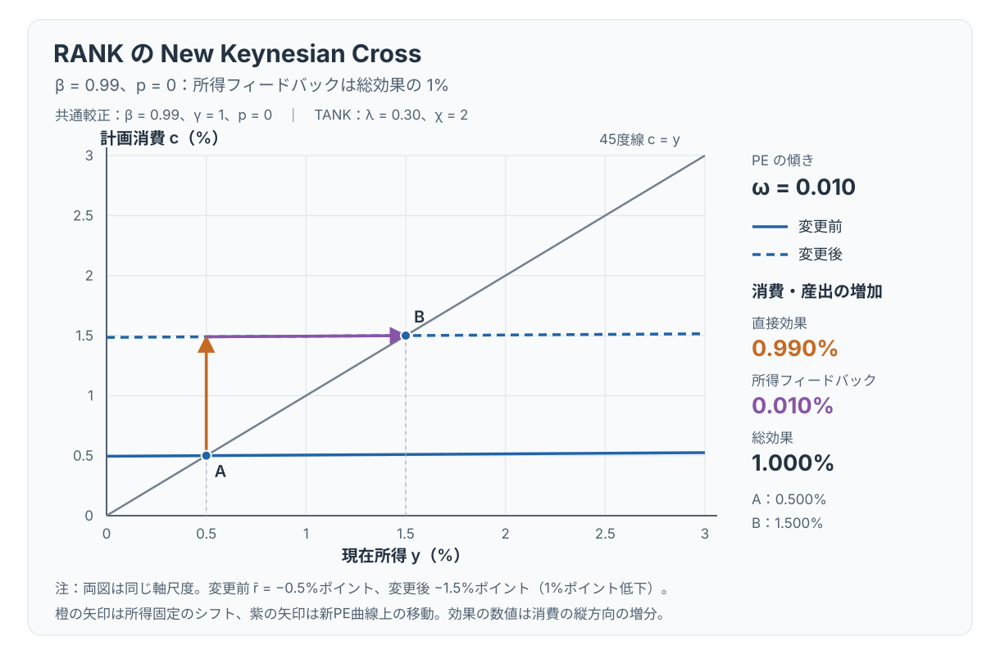
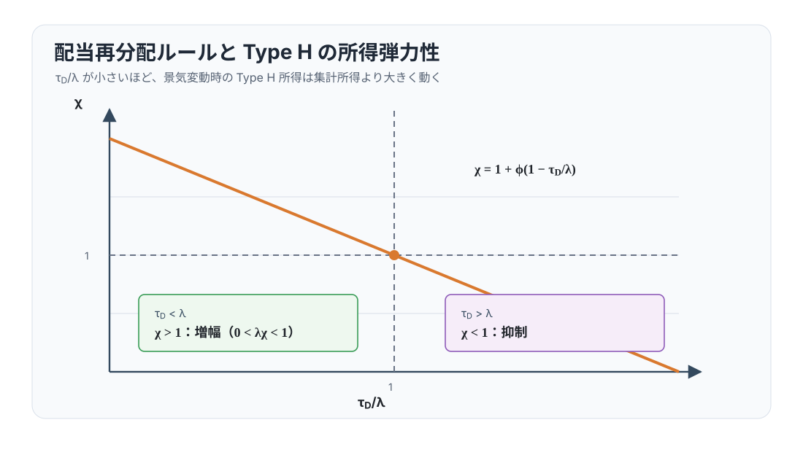
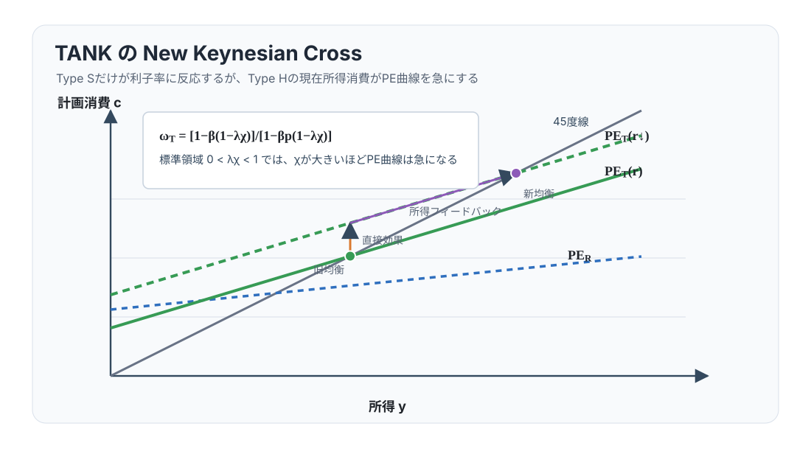
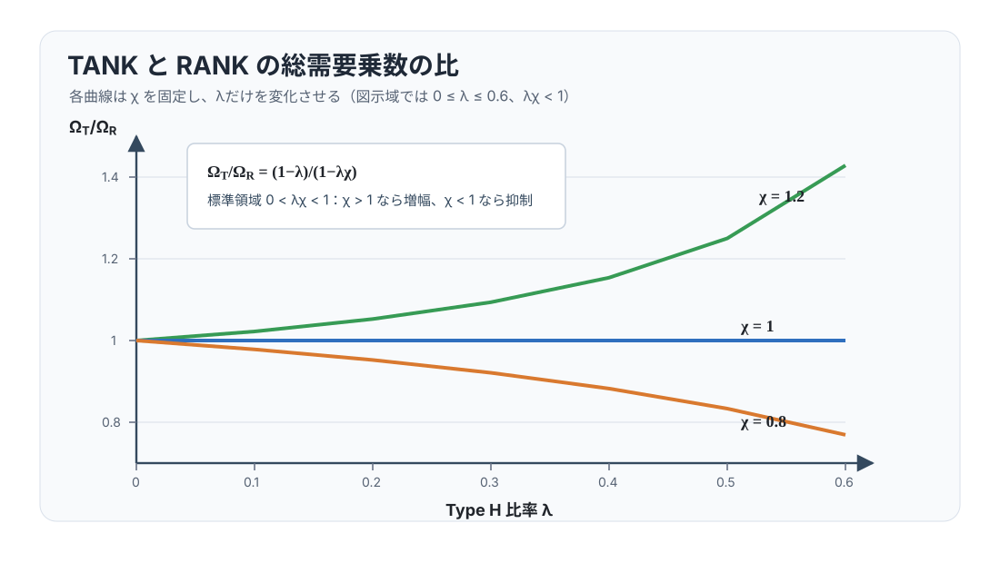
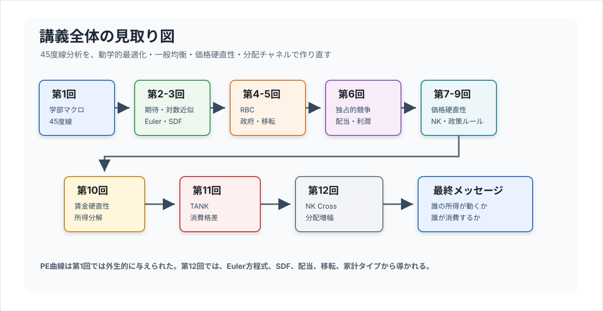

```{=latex}
\Needspace{24\baselineskip}
```

# 講義の目的

第12回では、第11回の TANK (Two-Agent New Keynesian) モデルを **New Keynesian Cross** として読み直します。第11回では、Type H 家計への移転 $z_t$ を外生的に与え、その期待成長 $\mathbb{E}_t\Delta z_{t+1}$ が TANK 自然利子率 $r_t^{f,T}$ を動かしました。本回では、$z_t$ を外生ショックではなく、集計純配当 $d_t$ に連動させるルール
$$
\lambda z_t=\tau_D d_t
$$
で決めます。ここで $\lambda$ は Type H 家計の人口比率です。$\tau_D$ は、集計純配当の変動のうち Type H への総移転に連動させる一次近似上の負荷係数です。したがって、Type H 一人当たりの移転は $z_t=(\tau_D/\lambda)d_t$ です。

この変更により、外生的な $\mathbb{E}_t\Delta z_{t+1}$ が自然利子率を動かす第11回の表現は、産出、純配当、移転が連動する所得分配のフィードバックへ変わります。$z_t$ は制度パラメータではなく内生変数であり、その連動の強さを決める $\tau_D$ が制度係数です。この係数は、計画支出曲線の傾きと利子率感応度を変えます。

本回の中心は、TANK を3本の NK方程式としてではなく、**Planned Expenditure (PE) 曲線** と45度線の交点として読むことです。$\beta$ が1に近く、期待閉鎖係数 $p$ が1に近すぎなければ、RANK (Representative-Agent New Keynesian) モデルでは現在所得の変化が消費に与える影響は小さく、実質利子率ギャップを通じる直接効果が中心です。TANK では、Type H 家計が現在所得をすべて消費するため、標準領域では現在所得を通じる間接効果が大きくなります。ただし、実質利子率ギャップに直接反応するのは Type S 家計だけなので、直接効果は RANK より小さくなります。

```{=latex}
\Needspace{18\baselineskip}
```

例えば $\beta=0.99$、$\gamma=\varphi=1$、$\lambda=0.30$、$p=0$、$\tau_D=0$ なら、各モデルの自然利子率から測った実質利子率ギャップを同じ 0.01（1パーセントポイント）だけ低下させたとき、TANK の産出反応は RANK の $1.75$ 倍です。この2つの力をまとめる合成パラメータが
$$
\chi
\equiv
1+\varphi\left(1-\frac{\tau_D}{\lambda}\right)
$$
です。$\chi$ は、Type H 家計の消費、つまり現在所得が、集計所得に対して何倍動くかを表します。本回の結論は次の一文にまとめられます。

> 同じ $\gamma$ と $p$、同じ実質利子率ギャップ低下を比較すると、通常符号領域 $\lambda\chi<1$ のもとで TANK の産出反応が RANK より大きいことと、Type H 所得が集計所得より強く動くこと、すなわち $\chi>1$ は同値である。

この結論は、所与の実質利子率ギャップ経路に対する条件付き需要反応です。完全均衡の金融政策効果や厚生改善を、それだけで意味するものではありません。

本編は、純配当移転ルールから $\chi$ を導き、TANK の PE 曲線と RANK との条件付き反応比を得るところまでを中心にします。Bilbiie の表記との対応、集計 Euler 方程式の詳細、反転領域、数値例の代入計算、再帰的消費関数の導出は発展補論にまとめ、授業時間に余裕がある場合に扱います。

@fig-lecture12-overview は、本回の議論の流れを示しています。

{#fig-lecture12-overview width=95%}

# 表記と基本設定

## 用語

**New Keynesian (NK) モデル**とは、価格硬直性のもとで総需要が産出を決める標準的なニューケインジアン・モデルを指します。**RANK** は代表的家計を置く NKモデルです。**TANK** は流動性制約家計と貯蓄家計の2タイプを置く NKモデルです。本回では、**Type H** は hand-to-mouth、すなわち流動性制約家計、**Type S** は saver、すなわち貯蓄家計を表します。

**HANK** は、より豊かな家計異質性、資産分布、自己保険、予備的貯蓄を持つ NKモデルです。本回は TANK までで止め、HANK の自己保険や予備的貯蓄は扱いません。

**Planned Expenditure (PE) 曲線**とは、所与の実質利子率ギャップのもとで、計画消費または計画支出を現在所得の関数として表す曲線です。政府支出を入れない本回では、計画支出は計画消費と同じです。**Marginal Propensity to Consume (MPC)** は限界消費性向、**Elasticity of Intertemporal Substitution (EIS)** は異時点間代替弾力性を指します。本講義ノートでは $\gamma$ が EIS の逆数なので、EIS は $1/\gamma$ です。

```{=latex}
\Needspace{16\baselineskip}
```

## 環境と家計タイプ

家計タイプは生涯を通じて固定され、両タイプは同じ選好と労働生産性をもちます。違いは資産市場への参加と所得帰着です。Type H は債券も株式も保有せず、当期の労働所得と移転をすべて消費します。Type S は全企業株式を保有し、名目債券を取引します。債券はゼロ純供給で、政府債務はありません。したがって対称均衡では Type S の債券保有もゼロですが、個別予算制約にある債券選択から Euler 方程式が生じます。

$d_t$ は、価格補助金と企業への一括税を相殺した後の集計純配当を定常消費で割った一次近似です。Type H への総移転は $\lambda z_t=\tau_Dd_t$、純配当の残余は Type S に帰属します。Type S 一人当たりでは、残余は $(1-\tau_D)d_t/(1-\lambda)$ です。$\tau_D$ はゼロ定常純配当の周りの一次近似上の負荷係数であり、必ずしも水準での配当持分を表しません。

対数線形化は、$\bar C^H=\bar C^S$、$\bar N^H=\bar N^S$、$\bar D=\bar Z=\bar B=0$ の均等定常状態の周りで行います。この定常値の等しさにより、集計消費と集計労働の対数乖離を人口比率で加重できます。$d_t$ と $z_t$ はゼロ定常値のため対数乖離ではなく、定常消費で正規化した一次近似です。

本回では、政府支出と技術ショックを入れません。財市場は
$$
y_t=c_t
$$
です。自然産出量はゼロに正規化します。したがって、本回の $y_t$ は、第11回の需給ギャップ $x_t$ と同じ役割を持ちます。

第7〜11回と同じく、$r_t$ は事前実質利子率、$r_t^{f,j}$ はモデル $j\in\{R,T\}$ の自然実質利子率とします。需要を動かす実質利子率ギャップを
$$
\widetilde r_t^j
\equiv
r_t-r_t^{f,j},
\qquad j\in\{R,T\}
$$
と定義します。RANK または TANK だけを扱う箇所では、上付きに混乱がなければ $\widetilde r_t$ と略記します。両モデルを比較するときは、各モデルの自然利子率から同じ幅だけ乖離させ、$\widetilde r_t^R=\widetilde r_t^T\equiv\widetilde r_t$ と置きます。金融緩和方向の変化は $-\widetilde r_t$ の増加です。

表記の混乱を避けるため、RANK と TANK で消費・所得の上付きの使い方を分けます。RANK では代表的家計しかいないので、原則として上付きなしの $c_t,y_t$ を使います。必要なときだけ代表的家計の消費・所得を $c_t^R,y_t^R$ と書き、均衡では次の等式が成り立ちます。
$$
c_t^R=c_t=y_t^R=y_t
$$

TANK では、Type H 家計と Type S 家計を明示するために $c_t^H,c_t^S$ を使います。集計消費は
$$
c_t=\lambda c_t^H+(1-\lambda)c_t^S
$$
です。

```{=latex}
\Needspace{10\baselineskip}
```

## 記号一覧

主な変数は次の通りです。

| 記号 | 意味 |
|---|---|
| $c_t$ | 集計消費。PE 曲線では計画消費、均衡では $c_t=y_t$ |
| $c_t^H,c_t^S$ | Type H、Type S の消費 |
| $c_t^R$ | RANK の代表的家計の消費。均衡では $c_t^R=c_t$ |
| $y_t$ | 産出。政府支出なしなので $y_t=c_t$ |
| $y_t^H,y_t^S$ | Type H、Type S の所得。Type H では $y_t^H=c_t^H$ |
| $y_t^R$ | RANK の代表的家計所得。均衡では $y_t^R=y_t$ |
| $n_t,w_t$ | 労働、実質賃金 |
| $d_t$ | 集計純配当を定常消費で割った一次近似 |
| $z_t$ | Type H 家計一人当たり移転を定常消費で割った一次近似 |
| $r_t$ | 事前実質利子率 |
| $r_t^{f,R},r_t^{f,T}$ | RANK、TANK の自然実質利子率 |
| $\widetilde r_t^j=r_t-r_t^{f,j}$ | モデル $j$ の実質利子率ギャップ。モデル内では $\widetilde r_t$ と略記 |
| $\sigma_t^c=c_t^S-c_t^H$ | 消費格差 |

: 本回で使う主な変数。消費・産出・利子率は定常状態からの対数乖離、$d_t,z_t$ は定常消費で正規化した一次近似である。 {#tbl-lecture12-variables tbl-colwidths="[22,78]"}

注：RANK と TANK の比較では $\widetilde r_t^R=\widetilde r_t^T\equiv\widetilde r_t$ と置き、同じ実質利子率ギャップを与える。

| 記号 | 範囲 | 意味 |
|---|---:|---|
| $\beta$ | $(0,1)$ | 割引因子 |
| $\gamma$ | $>0$ | EIS の逆数。EIS は $1/\gamma$ |
| $\varphi$ | $>0$ | 労働供給弾力性の逆数 |
| $\lambda$ | $(0,1)$ | Type H 家計の人口比率 |
| $\tau_D$ | 制度係数 | $\lambda z_t=\tau_Dd_t$ を決める一次近似上の負荷係数 |
| $p$ | $0\le p<1$ | $\mathbb{E}_t c_{t+1}=p c_t$ と置く簡約形の期待閉鎖係数 |

: 外生・較正パラメータ。$p$ は構造的ショック過程や政策ルールではなく、NKクロスを閉じる簡約形の係数である。 {#tbl-lecture12-parameters tbl-colwidths="[16,18,66]"}

注：数値例では $\beta=0.99$、$\gamma=\varphi=1$、$\lambda=0.30$、$p=0$ を使う。

派生係数は次の通りです。

| 記号 | 定義 | 役割 |
|---|---|---|
| $\chi$ | $1+\varphi\left(1-\tau_D/\lambda\right)$ | Type H 所得・消費の集計所得に対する反応係数 |
| $\Theta_D$ | $(1-\lambda\chi)/(1-\lambda)$ | Type S 所得を集計所得に戻す係数 |
| $\omega_R,\omega_T$ | PE 曲線の $y_t$ 係数 | RANK、TANK の PE 曲線の傾き。集計MPCと呼ばれることがある |
| $\Omega_R^D,\Omega_T^D$ | PE 曲線の $(-\widetilde r_t)$ 係数 | 所得を固定したときの直接効果 |
| $\Omega_R,\Omega_T$ | $\Omega^D/(1-\omega)$ | 実質利子率ギャップ低下に対する総効果 |

: 本回で使う派生係数。$\Omega^D$ は所得を固定した直接効果、$\Omega$ は所得フィードバックを含む総効果である。 {#tbl-lecture12-derived-coefficients tbl-colwidths="[18,32,50]"}

ここでの $\omega,\omega_R,\omega_T$ は PE 曲線の所得係数です。第10回のロス関数で使った $\omega_p,\omega_w$ はインフレ安定化の厚生重みであり、意味は異なります。

Bilbiie の New Keynesian Cross では、$\omega_R$ や $\omega_T$ のような PE 曲線の傾きを MPC と呼ぶことがあります。ただし、ここでの MPC は、個別家計が手元所得1単位をどれだけ消費するかというミクロの限界消費性向そのものではありません。期待形成、期待閉鎖係数 $p$、家計タイプの構成、純配当移転ルールを含んだ、集計 PE 曲線上の有効MPCです。特に Type H 家計の個別MPCは1ですが、$\omega_T$ はそれとは別の集計係数です。

```{=latex}
\Needspace{12\baselineskip}
```

# なぜ NKクロスに戻るのか

第7回では、代表的家計の Euler 方程式、価格硬直性、テイラー・ルールから RANK の3本の NK方程式を得ました。第11回では、家計を Type H と Type S に分け、Type S の Euler 方程式と Type H の現在所得制約から TANK の IS 曲線を導きました。

第12回では、NKフィリップス曲線やテイラー・ルールを前面に出しません。実質利子率ギャップ $\widetilde r_t$ を所与として、計画消費が現在所得 $y_t$ にどう反応するかを見ます。期待を閉じる $p$ も、構造的ショック過程ではなく簡約形の係数です。したがって、本回が求めるのは所与の実質利子率ギャップ経路に対する条件付き需要反応であり、インフレと政策金利を同時に決める完全均衡の金融政策反応ではありません。これは Bilbiie の New Keynesian Cross の読み方です。PE 曲線と45度線の交点で均衡所得が決まるという図解に戻すことで、TANK の新しさを次の2つに分解できます。

1. 誰が実質利子率ギャップに直接反応するのか。
2. 誰が現在所得の変化をどれだけ消費に回すのか。

RANK では、代表的家計が資産市場を通じて消費を平準化するため、現在所得への反応は小さくなります。TANK では、Type H 家計が現在所得をすべて消費するため、所得フィードバックが強くなります。

ただし、TANK は常に RANK より大きな総需要反応を持つわけではありません。Type S 家計だけが Euler 方程式を満たすので、実質利子率ギャップに直接反応する家計の比率は $1-\lambda$ に下がります。TANK の総効果は、直接効果の縮小と所得フィードバックの増幅のどちらが勝つかで決まります。

```{=latex}
\Needspace{18\baselineskip}
```

# 対数線形化と方程式リスト

第12回では、NKフィリップス曲線とテイラー・ルールを前面に出さず、所与の実質利子率ギャップのもとで計画消費を現在所得の関数として書きます。対数線形化された体系は、次の方程式リストにまとめられます。

| No. | 名称 | 式 |
|---:|---|---|
| 1 | 共通 PE 曲線 | $c_t=\omega y_t+\Omega^D(-\widetilde r_t)$ |
| 2 | 財市場均衡 | $y_t=c_t$ |
| 3 | NKクロス乗数 | $\Omega=\Omega^D/(1-\omega)$ |
| 4 | RANK 再帰的消費関数 | $c_t=(1-\beta)y_t-\dfrac{\beta}{\gamma}\widetilde r_t^R+\beta\mathbb{E}_t c_{t+1}$ |
| 5 | 簡約形の期待閉鎖 | $\mathbb{E}_t c_{t+1}=p c_t$ |
| 6 | RANK の PE 係数 | $\omega_R=\dfrac{1-\beta}{1-\beta p},\quad \Omega_R^D=\dfrac{\beta}{\gamma(1-\beta p)}$ |
| 7 | 純配当移転ルール | $\lambda z_t=\tau_Dd_t$ |
| 8 | 集計純配当 | $d_t=-(\gamma+\varphi)y_t$ |
| 9 | Type H 消費 | $c_t^H=\chi y_t,\quad \chi=1+\varphi\left(1-\dfrac{\tau_D}{\lambda}\right)$ |
| 10 | Type S 所得 | $y_t^S=\dfrac{1-\lambda\chi}{1-\lambda}y_t$ |
| 11 | Type S 再帰的消費関数 | $c_t^S=(1-\beta)y_t^S-\dfrac{\beta}{\gamma}\widetilde r_t^T+\beta\mathbb{E}_t c_{t+1}^S$ |
| 12 | TANK 集計 PE 曲線 | $c_t=\left[1-\beta(1-\lambda\chi)\right]y_t-(1-\lambda)\dfrac{\beta}{\gamma}\widetilde r_t^T+\beta(1-\lambda\chi)\mathbb{E}_t c_{t+1}$ |
| 13 | TANK の PE 係数 | $\omega_T=\dfrac{1-\beta(1-\lambda\chi)}{1-\beta p(1-\lambda\chi)},\quad \Omega_T^D=\dfrac{(1-\lambda)\beta}{\gamma[1-\beta p(1-\lambda\chi)]}$ |
| 14 | RANK との総効果比 | $\dfrac{\Omega_T}{\Omega_R}=\dfrac{1-\lambda}{1-\lambda\chi}$ |

: 第12回の対数線形体系。1--3番は共通の NKクロス、4--6番は RANK、7--13番は TANK の分配・消費ブロック、14番は同じ $\gamma,p$ と同じ実質利子率ギャップ $-\widetilde r_t$ を用いる比較である。 {#tbl-lecture12-equations tbl-colwidths="[6,28,66]"}

注：$p$ は構造的ショック過程ではない。$d_t,z_t$ は定常消費で正規化した一次近似である。

RANK に戻すには、家計タイプの区別をなくします。TANK 固有の7番から13番の分配ブロックは $\lambda>0$ のもとで定義されるため、$\tau_D/\lambda$ を含む式にそのまま $\lambda=0$ を代入するのではなく、このブロックを落として、4番から6番の RANK の PE 曲線と1番から3番の共通 NKクロスだけで閉じます。第11回との違いは、外生的な $\mathbb{E}_t\Delta z_{t+1}$ が TANK 自然利子率を動かす分配ブロックを、7番の純配当移転ルールで内生化する点です。その結果、移転の期待成長は産出と純配当の期待成長に結びつき、9番の $\chi$ と10番の Type S 所得係数として PE 曲線の傾きに入ります。

```{=latex}
\Needspace{14\baselineskip}
```

# NKクロスの共通枠組み

RANK と TANK に入る前に、NKクロスの読み方をそろえます。所与の実質利子率ギャップのもとで、計画消費が
$$
c_t=\omega y_t+\Omega^D(-\widetilde r_t)
$$
と書けるとします。$\omega$ は PE 曲線の傾き、$\Omega^D$ は所得を固定したときの実質利子率ギャップ低下の直接効果です。

政府支出がないので、均衡では
$$
y_t=c_t
$$
です。したがって
$$
y_t
=
\omega y_t+\Omega^D(-\widetilde r_t)
$$
となり、実質利子率ギャップ低下の総効果は
$$
\Omega
\equiv
\frac{\partial y_t}{\partial(-\widetilde r_t)}
=
\frac{\Omega^D}{1-\omega}
$$
です。この式の $1/(1-\omega)$ が、PE 曲線の傾きから来る NKクロスの乗数です。

第11回では、外生的に与えた移転の期待成長 $\mathbb{E}_t\Delta z_{t+1}$ が TANK 自然利子率 $r_t^{f,T}$ を動かしました。第12回では、$z_t$ を純配当移転ルール
$$
\lambda z_t=\tau_Dd_t
$$
で内生化します。これにより、$\mathbb{E}_t\Delta z_{t+1}$ は産出と純配当の期待成長に連動します。第11回の消費格差 $\sigma_t^c$ は、本回では Type H 所得・消費の反応係数 $\chi$ と、Type S 所得を集計所得に戻す係数 $\Theta_D$ として現れます。

後で導く $d_t=-(\gamma+\varphi)y_t$ を使えば、具体的には
$$
\mathbb{E}_t\Delta z_{t+1}
=
-\frac{\tau_D}{\lambda}(\gamma+\varphi)
\mathbb{E}_t\Delta y_{t+1}
$$
です。第11回で自然利子率を動かした移転の期待成長が、本回では期待所得成長へ結びつきます。

```{=latex}
\Needspace{16\baselineskip}
```

# RANK の NKクロス

まず RANK を確認します。代表的家計の再帰的な消費関数は
$$
c_t
=
(1-\beta)y_t
-
\frac{\beta}{\gamma}\widetilde r_t^R
+
\beta\mathbb{E}_t c_{t+1}
$$
です。これは Euler 方程式を家計の資産制約と組み合わせた表現です。現在所得 $y_t$ が高いほど今期消費は増え、実質利子率ギャップ $\widetilde r_t^R$ が高いほど現在消費は下がります。
この式は、本回の補論で導出します。RANK では代表的家計しかいないので、補論の一般式で $j=R$、$c_t^R=c_t$、$y_t^R=y_t$ と置けばこの式になります。

消費反応について、簡約形の持続性を $p$ と置きます。
$$
\mathbb{E}_t c_{t+1}=p c_t,
\qquad
0\leq p<1
$$
これは構造的なショック過程や金融政策ルールではなく、NKクロス図の中で将来消費の期待を現在消費に戻すための簡約形の閉鎖です。このとき
$$
c_t
=
\frac{1-\beta}{1-\beta p}y_t
-
\frac{\beta}{\gamma(1-\beta p)}\widetilde r_t^R
$$
です。したがって、RANK の PE 曲線は
$$
c_t=\omega_R y_t+\Omega_R^D(-\widetilde r_t^R)
$$
と書けます。ただし
$$
\omega_R
=
\frac{1-\beta}{1-\beta p},
\qquad
\Omega_R^D
=
\frac{\beta}{\gamma(1-\beta p)}
$$
です。$\Omega_R^D$ は、所得を固定したときの実質利子率ギャップ低下の直接効果です。

```{=latex}
\Needspace{13\baselineskip}
```

均衡では $c_t=y_t$ なので、
$$
y_t
=
\omega_R y_t+\Omega_R^D(-\widetilde r_t^R)
$$
です。したがって、実質利子率ギャップ低下の総効果は
$$
\Omega_R
=
\frac{\Omega_R^D}{1-\omega_R}
=
\frac{1}{\gamma(1-p)}
$$
となります。

```{=latex}
\Needspace{15\baselineskip}
```

::: {.callout-note}
## RANK の要点

RANK では $\omega_R=(1-\beta)/(1-\beta p)$、$\Omega_R=1/[\gamma(1-p)]$ です。$\beta$ が1に近く、$p$ が1に近すぎなければ $\omega_R$ は小さくなります。$p$ が1に近づくと分母も小さくなるため、$\beta\simeq1$ だけでは「ほぼ水平」とはいえません。
:::

```{=latex}
\Needspace{23\baselineskip}
```

@fig-rank-nk-cross は $\beta=0.99$、$p=0$ の関係を示しています。横軸は現在所得 $y_t$、縦軸は計画消費 $c_t$ です。RANK の PE 曲線はほぼ水平に近く、実質利子率ギャップの低下で上方にシフトします。傾きが小さいため、シフト後の追加的な所得フィードバックは小さいです。

{#fig-rank-nk-cross width=88%}

```{=latex}
\Needspace{14\baselineskip}
```

# 第11回 TANK から第12回 TANK へ

第11回では、Type H 家計への移転 $z_t$ を外生変数として扱い、その期待成長 $\mathbb{E}_t\Delta z_{t+1}$ が TANK 自然利子率を動かしました。分配ブロックを解くと、消費格差
$$
\sigma_t^c\equiv c_t^S-c_t^H
$$
は
$$
\sigma_t^c
=
\frac{\varphi}{\gamma+\varphi}
\frac{d_t-z_t}{1-\lambda}
$$
で与えられました。

第12回では、移転を集計純配当に連動する純配当移転ルールで決めます。
$$
\lambda z_t=\tau_Dd_t,
\qquad
z_t=\frac{\tau_D}{\lambda}d_t.
$$
したがって
$$
d_t-z_t
=
\left(1-\frac{\tau_D}{\lambda}\right)d_t
$$
です。

さらに、価格が硬直的で、技術をゼロに正規化し、政府支出なしで $y_t=c_t$ と置きます。生産関数は $y_t=n_t$ です。ここではゼロ定常純配当のまわりで、かつ定常状態で $Y=WN=C$ となる正規化を使います。このとき、集計純配当の一次近似は
$$
d_t=y_t-(w_t+n_t)
$$
です。$y_t=n_t$ なので
$$
d_t=-w_t
$$
です。柔軟賃金条件から
$$
w_t=\gamma c_t+\varphi n_t
$$
であり、$c_t=y_t$、$n_t=y_t$ を使えば
$$
w_t=(\gamma+\varphi)y_t
$$
です。集計純配当は
$$
d_t=-(\gamma+\varphi)y_t
$$

この純配当式を消費格差の式に代入すると
$$
\sigma_t^c
=
-
\frac{\varphi}{1-\lambda}
\left(1-\frac{\tau_D}{\lambda}\right)y_t
$$
です。

集計式から
$$
c_t^H=c_t-(1-\lambda)\sigma_t^c
$$
です。$c_t=y_t$ を使うと
$$
c_t^H
=
\left[
1+\varphi\left(1-\frac{\tau_D}{\lambda}\right)
\right]y_t
$$
を得ます。ここで
$$
\chi
\equiv
1+\varphi\left(1-\frac{\tau_D}{\lambda}\right)
$$
と定義すれば、
$$
c_t^H=\chi y_t
$$
です。

```{=latex}
\Needspace{14\baselineskip}
```

::: {.callout-note}
## 純配当移転 TANK の要点

$\lambda z_t=\tau_Dd_t$ と $d_t=-(\gamma+\varphi)y_t$ により、$c_t^H=y_t^H=\chi y_t$ となります。したがって $\chi=1+\varphi(1-\tau_D/\lambda)$ は、Type H 所得と消費の集計所得に対する反応係数です。
:::

```{=latex}
\Needspace{12\baselineskip}
```

# 純配当移転ルールと $\chi$ の解釈

$\chi$ は
$$
\chi
=
1+\varphi\left(1-\frac{\tau_D}{\lambda}\right)
$$
です。$\varphi>0$ のもとで、次の3つのケースに分かれます。

第一に、
$$
\tau_D<\lambda
\quad\Longleftrightarrow\quad
\chi>1
$$
です。この場合、Type H 家計への総移転は集計純配当の変動に人口比率より弱く連動します。景気拡大で労働需要と実質賃金が上がると、Type H の労働所得は増えます。

一方で、実質賃金の上昇は純配当を下げますが、その下落の多くは Type S 家計が負担します。したがって、Type H の所得は集計所得より大きく反応します。

第二に、
$$
\tau_D=\lambda
\quad\Longleftrightarrow\quad
\chi=1
$$
です。この場合、純配当変動に連動する総移転は人口比率に一致します。Type H 所得は集計所得と一対一で動きます。これは Campbell--Mankiw 型の手元所得消費者の仮定に対応します。

第三に、
$$
\tau_D>\lambda
\quad\Longleftrightarrow\quad
\chi<1
$$
です。この場合、Type H 家計への総移転は集計純配当の変動に人口比率以上に連動します。景気拡大で実質賃金が上がると純配当は下がるため、Type H への移転も強く下がります。これにより、Type H 所得の反応は集計所得より小さくなります。

```{=latex}
\Needspace{22\baselineskip}
```

@fig-chi-tax-rule は、$\tau_D/\lambda$ と $\chi$ の関係を示しています。横軸が1のところで $\chi=1$ です。左側では TANK は所得フィードバックを強め、右側では弱めます。

{#fig-chi-tax-rule width=88%}

ここで重要なのは、$\tau_D$ を外生ショックではなく、分配ルールの制度係数として扱う点です。ゼロ定常配当のまわりで一次近似しているため、制度係数 $\tau_D$ そのものの小さな時変ショックを入れても、定常配当がゼロであれば一次の需要ショックとしては現れにくいです。本回では、ショックは実質利子率ギャップ $\widetilde r_t$ の変化とし、$\tau_D$ はその伝播を決める制度パラメータとして扱います。

```{=latex}
\Needspace{13\baselineskip}
```

# 均衡での Type S 消費と消費格差

集計消費は
$$
c_t
=
\lambda c_t^H+(1-\lambda)c_t^S
$$
です。この節では、均衡の消費配分を確認するために財市場均衡 $c_t=y_t$ を使います。ここに
$$
c_t^H=\chi y_t
$$
を代入すると
$$
y_t
=
\lambda\chi y_t+(1-\lambda)c_t^S
$$
です。したがって
$$
c_t^S
=
\frac{1-\lambda\chi}{1-\lambda}y_t
$$
を得ます。

Type S と Type H の消費格差は
$$
c_t^S-c_t^H
=
\frac{1-\lambda\chi}{1-\lambda}y_t-\chi y_t
=
\frac{1-\chi}{1-\lambda}y_t
$$
です。したがって、$\chi>1$ なら、景気拡大時に Type S と Type H の消費格差は縮小し、景気後退時には拡大します。この意味で、消費格差は反景気循環的です。逆に、$\chi<1$ なら、景気拡大時に格差は拡大し、景気後退時に縮小します。

第11回の消費格差 $\sigma_t^c$ と、本回の $\chi$ は同じ分配構造を別の角度から表しています。第11回では、$\sigma_t^c$ が TANK の IS 曲線の補正項として現れました。第12回では、同じ分配構造を
$$
c_t^H=\chi y_t
$$
という消費関数として読みます。

```{=latex}
\Needspace{15\baselineskip}
```

::: {.callout-note}
## 第11回との接続と本編の標準領域

Type S だけが Euler 方程式を満たすため、集計消費は
$$
c_t=\mathbb{E}_t c_{t+1}-\frac{1}{\gamma\Theta_D}\widetilde r_t^T,
\qquad
\Theta_D=\frac{1-\lambda\chi}{1-\lambda}
$$
と書けます。$\tau_D=0$ なら $\Theta_D=\Theta_T$ となり、第11回の再分配なしの IS 曲線に戻ります。以下の本編では $0<\lambda\chi<1$ を標準領域とします。導出と反転領域は発展補論で扱います。
:::

# TANK の PE 曲線

NKクロスとして表すため、Type S の再帰的消費関数から始めます。
$$
c_t^S
=
(1-\beta)y_t^S
-
\frac{\beta}{\gamma}\widetilde r_t^T
+
\beta\mathbb{E}_t c_{t+1}^S
$$
です。この式も補論の一般式で $j=S$ と置いたものです。TANK では Type S 家計だけが Euler 方程式を満たすので、再帰的消費関数を持つのは $c_t^S$ だけです。

Type H は現在所得をすべて消費するので、$y_t^H=c_t^H=\chi y_t$ です。集計所得
$$
y_t=\lambda y_t^H+(1-\lambda)y_t^S
$$
から、Type S の所得は
$$
y_t^S
=
\frac{1-\lambda\chi}{1-\lambda}y_t.
$$
また、将来期にも同じ分配ルールが続き、将来の均衡で $c_{t+1}=y_{t+1}$ が成り立つので、
$$
\mathbb{E}_t c_{t+1}^S
=
\frac{1-\lambda\chi}{1-\lambda}\mathbb{E}_t c_{t+1}
$$
です。ここでは現在の計画消費 $c_t$ を均衡条件で先に置き換えず、集計計画消費の式に戻して PE 曲線を作ります。

集計消費は
$$
c_t
=
\lambda c_t^H+(1-\lambda)c_t^S
$$
であり、$c_t^H=\chi y_t$ です。したがって
$$
\begin{aligned}
c_t
&=
\lambda\chi y_t
+
(1-\lambda)
\left[
(1-\beta)\frac{1-\lambda\chi}{1-\lambda}y_t
-
\frac{\beta}{\gamma}\widetilde r_t^T
+
\beta\frac{1-\lambda\chi}{1-\lambda}\mathbb{E}_t c_{t+1}
\right]
\\
&=
\left[1-\beta(1-\lambda\chi)\right]y_t
-
(1-\lambda)\frac{\beta}{\gamma}\widetilde r_t^T
+
\beta(1-\lambda\chi)\mathbb{E}_t c_{t+1}.
\end{aligned}
$$

この式が TANK の集計 PE 曲線です。RANK と TANK の違いは2つあります。

第一に、実質利子率ギャップに直接反応するのは Type S 家計だけなので、利子率項には $1-\lambda$ が掛かります。これは直接効果を小さくします。

第二に、Type H 家計の消費が現在所得に反応するため、$y_t$ の係数は
$$
1-\beta(1-\lambda\chi)
$$
になります。$\chi$ が大きいほど、PE 曲線は急になります。これは間接効果を大きくします。

RANK と同じ簡約形の期待閉鎖係数 $p$ を置き、
$$
\mathbb{E}_t c_{t+1}=p c_t
$$
とすれば
$$
c_t
=
\omega_T y_t+\Omega_T^D(-\widetilde r_t^T)
$$
と書けます。ただし
$$
\omega_T
=
\frac{1-\beta(1-\lambda\chi)}
{1-\beta p(1-\lambda\chi)}
$$
であり、
$$
\Omega_T^D
=
\frac{(1-\lambda)\beta}
{\gamma[1-\beta p(1-\lambda\chi)]}
$$
です。

この係数表示には
$$
1-\beta p(1-\lambda\chi)\neq 0
$$
が必要です。本編の標準領域 $0<\lambda\chi<1$ では、この分母は自動的に正です。$\lambda\chi\leq 0$ まで扱う場合は非零条件を別に確認し、実質利子率ギャップ低下の直接シフトを正と読むには、さらに $1-\beta p(1-\lambda\chi)>0$ が必要です。

均衡 $c_t=y_t$ を使うと、実質利子率ギャップ低下の総効果は
$$
\Omega_T
=
\frac{\Omega_T^D}{1-\omega_T}
=
\frac{1}{\gamma(1-p)}
\frac{1-\lambda}{1-\lambda\chi}
$$
となります。

```{=latex}
\Needspace{23\baselineskip}
```

@fig-tank-nk-cross は、RANK と同じ $\beta=0.99$、$p=0$ と同じ実質利子率ギャップ低下を使って、このメカニズムを描いています。TANK では、PE 曲線の直接シフトは RANK より小さいです。しかし、PE 曲線が急になるため、45度線との交点は大きく動きます。これが所得フィードバックによる増幅です。

{#fig-tank-nk-cross width=88%}

```{=latex}
\Needspace{16\baselineskip}
```

# RANK との条件付き比較

以下では、RANK と TANK で $\gamma$ と簡約形の $p$ を同じにし、各モデルの自然利子率から同じ幅だけ低下させます。すなわち
$$
\widetilde r_t^R
=
\widetilde r_t^T
\equiv
\widetilde r_t
$$
と置き、共通の緩和幅を $-\widetilde r_t$ で表します。RANK の条件付き総効果は
$$
\Omega_R
=
\frac{1}{\gamma(1-p)}
$$
でした。TANK の乗数は
$$
\Omega_T
=
\frac{1}{\gamma(1-p)}
\frac{1-\lambda}{1-\lambda\chi}
$$
です。したがって、TANK と RANK の比は
$$
\frac{\Omega_T}{\Omega_R}
=
\frac{1-\lambda}{1-\lambda\chi}
$$
です。

RANK と TANK の違いを横に並べると、次のようになります。

| 項目 | RANK | TANK |
|---|---|---|
| PE 曲線の傾き | $\omega_R=\dfrac{1-\beta}{1-\beta p}$ | $\omega_T=\dfrac{1-\beta(1-\lambda\chi)}{1-\beta p(1-\lambda\chi)}$ |
| 直接効果 | $\Omega_R^D=\dfrac{\beta}{\gamma(1-\beta p)}$ | $\Omega_T^D=\dfrac{(1-\lambda)\beta}{\gamma[1-\beta p(1-\lambda\chi)]}$ |
| 総効果 | $\Omega_R=\dfrac{1}{\gamma(1-p)}$ | $\Omega_T=\dfrac{1}{\gamma(1-p)}\dfrac{1-\lambda}{1-\lambda\chi}$ |
| RANK との比 | $1$ | $\dfrac{1-\lambda}{1-\lambda\chi}$ |

: RANK と TANK の PE 係数。同じ $\beta,\gamma,p$ と、各モデルの自然利子率から測った同じ実質利子率ギャップ低下を比較する。 {#tbl-rank-tank-comparison tbl-colwidths="[18,41,41]"}

注：$\Omega^D$ は所得固定の直接効果、$\Omega$ は均衡所得フィードバックを含む条件付き総効果である。完全均衡の政策反応ではない。

この比は、2つの要素に分けて読めます。
$$
\frac{\Omega_T}{\Omega_R}
=
\underbrace{(1-\lambda)}_{\text{Type S 家計の直接効果}}
\times
\underbrace{\frac{1}{1-\lambda\chi}}_{\text{所得フィードバック成分}}.
$$
この分解は、総効果比を読むための正確な代数分解です。ただし、$p>0$ のとき、右辺の各項は PE 曲線の直接シフト比や PE 乗数比そのものではありません。PE 曲線の乗数は、一般には $1/(1-\omega_R)$ と $1/(1-\omega_T)$ です。

それでも、第1項の $1-\lambda$ は、実質利子率ギャップに直接反応するのが Type S 家計だけであることを表します。Type H 家計は Euler 方程式を持たないので、直接効果だけを見れば、TANK の反応は RANK より小さくなります。

第2項の
$$
\frac{1}{1-\lambda\chi}
$$
は、RANK との比較で残る Type H 所得フィードバック成分です。Type H 家計の計画消費は $c_t^H=\chi y_t$ なので、集計計画消費のうち Type H 家計から来る所得フィードバックの傾きは $\lambda\chi$ です。標準領域 $0<\lambda\chi<1$ なら、
$$
\frac{1}{1-\lambda\chi}
=
1+\lambda\chi+(\lambda\chi)^2+\cdots
$$
と書けます。最初の需要増加が所得を増やし、その所得増加が Type H 家計の消費を $\lambda\chi$ だけ増やし、それがさらに所得を増やす、という無限等比級数です。

したがって、TANK の総効果は「利子率に直接反応する家計は $1-\lambda$ に減るが、Type H の所得フィードバックが $1/(1-\lambda\chi)$ として総効果比を押し上げる」と読めます。この所得フィードバック成分が十分に大きければ、TANK の総需要反応は RANK を上回ります。

通常符号領域 $\lambda\chi<1$ のもとで、
$$
\frac{\Omega_T}{\Omega_R}>1
$$
となる条件は
$$
1-\lambda>1-\lambda\chi
$$
です。$\lambda>0$ なら、これは
$$
\chi>1
$$
と同値です。純配当移転ルールを代入すれば
$$
\chi>1
\quad\Longleftrightarrow\quad
\tau_D<\lambda
$$
です。

```{=latex}
\Needspace{9\baselineskip}
```

::: {.callout-important}
## 主結果

同じ $\gamma,p$ と同じ実質利子率ギャップ低下を比較すると、$\lambda\chi<1$ のもとで $\Omega_T>\Omega_R$、$\chi>1$、$\tau_D<\lambda$ は同値です。流動性制約家計の存在だけでなく、所得フィードバックが直接効果の縮小を上回ることが必要です。
:::

$\Omega_T/\Omega_R$ は所与の実質利子率ギャップ経路に対する産出反応の比です。NKフィリップス曲線と政策ルールを閉じた金融政策効果でも、消費格差を含む厚生の順位でもありません。完全均衡の政策評価にはインフレ反応と政策金利の内生反応を、厚生評価にはタイプ別効用を別に計算する必要があります。

```{=latex}
\Needspace{22\baselineskip}
```

@fig-multiplier-ratio は、乗数比
$$
\frac{\Omega_T}{\Omega_R}
=
\frac{1-\lambda}{1-\lambda\chi}
$$
を、各曲線で $\chi$ を固定して $\lambda$ の関数として描いています。$\lambda\chi<1$ の領域では、$\chi>1$ なら比は1を上回り、$\chi=1$ なら1に等しく、$\chi<1$ なら1を下回ります。

{#fig-multiplier-ratio width=88%}

```{=latex}
\Needspace{18\baselineskip}
```

# 数値例

第11回と共通する $\beta,\gamma,\varphi,\lambda$ を引き継ぎます。ただし、実験は第11回の政策ルールを閉じた金融政策ショックとは異なります。本回では、簡約形の期待閉鎖 $p=0$ のもとで、RANK と TANK の自然利子率から測った実質利子率ギャップを、それぞれ 0.01（1パーセントポイント）低下させます。

次の表の $\Theta_D$ は
$$
\Theta_D=\frac{1-\lambda\chi}{1-\lambda}
$$
です。$\lambda\chi<1$ なら通常符号領域、さらに $0<\lambda\chi<1$ なら本編の標準領域です。

| ケース | $\chi$ | $\lambda\chi$ | $\Theta_D$ | $\Omega_T/\Omega_R$ | 解釈 |
|---:|---:|---:|---:|---:|---|
| $\tau_D=0$ | $2.00$ | $0.60$ | $0.571$ | $1.75$ | Type H 所得が集計所得より強く動き、TANK は増幅する |
| $\tau_D=\lambda=0.30$ | $1.00$ | $0.30$ | $1.000$ | $1.00$ | Campbell-Mankiw 型の基準。総効果は RANK と同じ |
| $\tau_D=0.45$ | $0.50$ | $0.15$ | $1.214$ | $0.824$ | Type H 所得の反応が弱く、TANK は抑制する |

: 純配当移転ルール別の TANK 反応。$\beta=0.99$、$\gamma=\varphi=1$、$\lambda=0.30$、$p=0$。 {#tbl-lecture12-numerical-cases tbl-colwidths="[16,11,12,13,14,34]"}

注：$\Theta_D=(1-\lambda\chi)/(1-\lambda)$、$\Omega_T/\Omega_R=(1-\lambda)/(1-\lambda\chi)$。比率は無単位である。

この数値例から分かるように、純配当移転ルールが「Type H への移転を増やすから常に総需要を増やす」とは言えません。ここで問題になっているのは、静学的な移転額ではなく、景気変動時に Type H 所得が集計所得に何倍反応するかです。また、産出反応が大きいことは厚生改善を意味しません。

```{=latex}
\Needspace{12\baselineskip}
```

# 本回と講義全体のまとめ

## 本回のまとめ

第12回の結論は3つです。

第一に、$\beta\simeq1$ で $p$ が1に近すぎなければ、RANK の PE 曲線の傾きは小さくなります。所与の実質利子率ギャップ低下に対する反応は、主に EIS を通じる直接効果として読めます。

第二に、標準領域の TANK では、Type H 家計が現在所得をすべて消費するため、PE 曲線の傾きが大きくなります。ただし、実質利子率ギャップに直接反応するのは Type S 家計だけなので、PE 曲線の直接シフトは小さくなります。

第三に、同じ $\gamma,p$ と同じ実質利子率ギャップ低下のもとで TANK が RANK より大きな総需要反応を持つかどうかは、Type H 家計の所得が集計所得に対して何倍動くか、すなわち $\chi$ によって決まります。純配当移転ルールのもとでは
$$
\chi
=
1+\varphi\left(1-\frac{\tau_D}{\lambda}\right)
$$
であり、
$$
\tau_D<\lambda
\quad\Longleftrightarrow\quad
\chi>1
$$
なら増幅、
$$
\tau_D=\lambda
\quad\Longleftrightarrow\quad
\chi=1
$$
なら RANK と同じ総効果、
$$
\tau_D>\lambda
\quad\Longleftrightarrow\quad
\chi<1
$$
なら抑制です。

TANK は、単に流動性制約家計を足したモデルではありません。分配ルールが Type H の所得反応係数 $\chi$ を決め、その $\chi$ が PE 曲線の傾きと条件付き総需要反応を決めます。乗数の大小だけから完全均衡の金融政策効果や厚生を順位づけることはできません。

## 第1回から第12回までの対応

この講義全体の流れは、学部マクロで見た「需要が産出を決める」という考えを、動学的最適化、一般均衡、価格硬直性、金融政策、家計異質性の言葉で作り直すことでした。第12回の NKクロスは、第1回の45度線分析に戻っているように見えます。しかし、戻っているだけではありません。今回は、PE 曲線の傾きとシフトが、Euler 方程式、SDF、配当、移転、家計タイプから導かれています。

第1回から第12回までの対応は次のように整理できます。

| 回 | 中心テーマ | 第12回との対応 |
|---:|---|---|
| 第1回 | 学部マクロの復習 | 45度線、IS-LM、AD-AS の直観が、最後に NKクロスとして戻る |
| 第2回 | 時系列分析と対数線形近似 | 持続性 $p$、期待値、対数線形化された消費・所得・利子率の表記を支える |
| 第3回 | 動学的最適化と資産価格付け | Euler 方程式、SDF、横断性条件が、補論の再帰的消費関数の基礎になる |
| 第4回 | 資本なし RBC | 家計・企業・労働市場の一般均衡と自然産出量の基準を作る |
| 第5回 | 政府部門 | 政府支出、税、移転の区別を導入し、$z_t$ を再分配として読む準備をする |
| 第6回 | 独占的競争 | マークアップと企業利潤を導入し、本回の純配当 $d_t$ の基礎を作る |
| 第7回 | 価格硬直性 | RANK の IS 曲線、NKPC、テイラー・ルールを得て、需要が産出を動かす NKモデルに入る |
| 第8回 | RANKモデル | 代表的家計の Euler 方程式が集計需要を決めるベンチマークを確認する |
| 第9回 | 最適金融政策とルール | 実質利子率と政策ルールが総需要をどう動かすかを整理する |
| 第10回 | 価格・賃金硬直性をもつ RANK | 同じ集計需要でも賃金所得と純配当所得の分解が変わることを確認する |
| 第11回 | 価格硬直性をもつ TANK | Type S の Euler 方程式、Type H の現在所得制約、消費格差 $\sigma_t^c$ を導入する |
| 第12回 | NK Cross と TANK | 純配当移転ルールから $\chi$ を導き、PE 曲線の傾きと総需要増幅を読む |

: 第1回から第12回までの中心テーマと、本回の NKクロスへの接続。 {#tbl-course-map tbl-colwidths="[10,27,63]"}

注：第12回の $p$ は第2回の時系列モデルそのものではなく、期待を閉じる簡約形の係数である。

この表から分かるように、第12回は新しいトピックを単に足した回ではありません。これまでの部品を組み合わせ直す回です。第3回の Euler 方程式は、RANK と Type S 家計の消費関数になります。第6回の企業利潤は、補助金と企業一括税を差し引いた TANK の純配当 $d_t$ につながります。第5回の移転は、Type H 家計への $z_t$ になります。第7回以降の価格硬直性は、所与の実質利子率ギャップのもとで需要が産出を決める環境を作ります。第11回の消費格差は、第12回では $c_t^H=\chi y_t$ という PE 曲線の傾きとして読み替えられます。

```{=latex}
\clearpage
```



## 講義全体を貫く3つの見方

第一に、**現在所得と将来所得の区別**です。学部マクロの消費関数では、現在所得が消費を動かします。動学的最適化では、家計は将来所得まで見て消費を平準化します。$\beta\simeq1$ かつ $p$ が1に近すぎないとき、RANK の PE 曲線はほぼ水平になります。TANK では、Type H 家計だけが学部マクロに近い現在所得消費を行うため、現在所得フィードバックが戻ってきます。

第二に、**相対価格と数量調整の区別**です。RBC では価格と賃金が柔軟に動き、産出は主に供給側で決まります。NKモデルでは価格が硬直的なので、実質利子率が需要を動かし、需要が産出を動かします。したがって、RBC の自然産出量は、NK で需給ギャップを定義する基準になります。

第三に、**集計量と分配の区別**です。RANK では、代表的家計が賃金所得、純配当所得、資産収益をまとめて受け取るため、誰が所得を受け取るかは集計需要に出にくいです。

TANK では、Type H と Type S の MPC が違うため、同じ集計所得でも、賃金・純配当・移転の分配が総需要を変えます。第12回の $\chi$ は、この分配チャネルを1つの係数にまとめたものです。

## 最終的な見取り図

この講義で作ってきたモデルは、次の順序で積み上がっています。

```{=latex}
\Needspace{24\baselineskip}
```

{#fig-course-roadmap width=95%}

最初の45度線分析では、PE 曲線は外から与えられていました。最後の NKクロスでは、PE 曲線の傾きもシフトも、家計の最適化と分配ルールから導かれます。これが、本講義全体で得たもっとも大きな進歩です。

最終的なメッセージは次の通りです。所与の実質利子率ギャップ低下に対する需要反応は、直接効果だけでは決まりません。誰が Euler 方程式を持ち、誰が現在所得を消費し、賃金所得・純配当・移転が誰に入るかによって、所得フィードバックの大きさが変わります。TANK の NKクロスは、その条件付き反応を簡潔に示す枠組みです。

## 今後の発展

本講義から先の発展は3群に整理できます。

第一に、**家計・所得分配を豊かにする方向**です。HANK では資産保有、所得リスク、借入制約、MPC が連続的に分布します。名目賃金硬直性も加えると、賃金調整の遅れがタイプ別の労働所得、消費格差、総需要を同時に動かします。本回の $\chi$ は、こうした分布効果を2タイプに圧縮した係数です。

第二に、**需要項と政策を広げる方向**です。投資と政府購入を含めると、財市場は水準で
$$
Y_t=C_t+I_t+G_t
$$
となります。ここで $Y_t,C_t,I_t,G_t$ は、それぞれ産出、消費、投資、政府購入の水準です。実質利子率は消費だけでなく投資にも作用します。政府支出、税、社会保険料、給付を入れれば、誰に課税し、誰に移転するかも乗数を決めます。企業価値、純配当、資本収益の帰着を明示する必要もあります。

::: {.callout-note title="資本を含むRBCモデルとDSGEの数値解法"}
マクロ経済学Aでは成長理論の資本蓄積を扱いますが、確率的ショックのもとで資本ストックを内生化するRBCモデルは扱いません。本講義でも、各回の経済機構を閉形式で追えるように、資本ストックを所与としてきました。

資本を導入すると、財市場に投資 $I_t$ が加わり、水準の資本蓄積式
$$
K_{t+1}=(1-\delta)K_t+I_t
$$
が新たな動学を作ります。$\delta$ は減耗率です。資本ストックの水準 $K_t$ は所定状態変数となり、消費や資産価格などの前向き変数と同時に解かなければなりません。そのため、単一のAR(1)ショックに比例する解を予想する方法だけでは一般に不十分です。

次の段階では、定常状態の周りで対数線形化し、静的変数・所定状態・前向き変数を分類して、線形合理的期待体系を行列で表します。Blanchard--Kahn条件で解の存在と一意性を確認し、generalized Schur（QZ）法で policy function と transition law を計算して、そこからインパルス応答を作ります。資本を含むRBCモデルは、本講義で学んだ動学的最適化と一般均衡を、この数値解法へ接続する最初の応用です。
:::

第三に、**非線形分析と実証へ進む方向**です。ゼロ金利制約、大きなショック、強い借入制約のもとでは一次近似だけでは不十分です。同時に、所得階層別の労働所得、資本所得、移転、MPC を測れば、
$$
\frac{\Omega_T}{\Omega_R}
=
\frac{1-\lambda}{1-\lambda\chi}
$$
の要素をデータに対応づけられます。ただし、完全均衡の政策評価には価格調整と政策ルールを、厚生評価にはタイプ別効用を追加する必要があります。

この先の発展を一言でまとめると、次の問いになります。

> 総需要を動かす政策は、誰の所得を動かし、その人がどれだけ消費するのか。

第12回の NKクロスは、この問いをもっとも単純な TANKモデルで表したものです。3つの発展は、この問いをより現実的な環境で考えるための道筋です。

```{=latex}
\Needspace{12\baselineskip}
```

# 参考文献

**必読**

- Bilbiie, Florin O. (2020) "The New Keynesian Cross." *Journal of Monetary Economics*, 114, 90-108. [doi](https://doi.org/10.1016/j.jmoneco.2019.03.003)
- Bilbiie, Florin O. (2008) "Limited Asset Markets Participation, Monetary Policy and (Inverted) Aggregate Demand Logic." *Journal of Economic Theory*, 140(1), 162-196. [doi](https://doi.org/10.1016/j.jet.2007.07.008)
- Galí, Jordi, J. David López-Salido, and Javier Vallés (2007) "Understanding the Effects of Government Spending on Consumption." *Journal of the European Economic Association*, 5(1), 227-270. [doi](https://doi.org/10.1162/JEEA.2007.5.1.227)
- Campbell, John Y., and N. Gregory Mankiw (1989) "Consumption, Income, and Interest Rates: Reinterpreting the Time Series Evidence." In Olivier Jean Blanchard and Stanley Fischer (eds.), *NBER Macroeconomics Annual 1989*, Vol. 4, 185-246. Cambridge, MA: MIT Press. [doi](https://doi.org/10.1086/654107)

**発展**

- Kaplan, Greg, Benjamin Moll, and Giovanni L. Violante (2018) "Monetary Policy According to HANK." *American Economic Review*, 108(3), 697-743. [doi](https://doi.org/10.1257/aer.20160042)
- McKay, Alisdair, Emi Nakamura, and Jón Steinsson (2016) "The Power of Forward Guidance Revisited." *American Economic Review*, 106(10), 3133-3158. [doi](https://doi.org/10.1257/aer.20150063)
- Auclert, Adrien (2019) "Monetary Policy and the Redistribution Channel." *American Economic Review*, 109(6), 2333-2367. [doi](https://doi.org/10.1257/aer.20160137)
- Werning, Iván (2015) "Incomplete Markets and Aggregate Demand." NBER Working Paper No. 21448. [doi](https://doi.org/10.3386/w21448)

```{=latex}
\Needspace{12\baselineskip}
```

# 演習問題

## 基本問題

```{=latex}
\Needspace{12\baselineskip}
```

**問1 [Core] [Derivation]：RANK の PE 曲線**

RANK の消費関数
$$
c_t=(1-\beta)y_t-\frac{\beta}{\gamma}\widetilde r_t^R+\beta\mathbb{E}_t c_{t+1}
$$
から、持続性 $p$ のもとで
$$
\omega_R=\frac{1-\beta}{1-\beta p},
\qquad
\Omega_R=\frac{1}{\gamma(1-p)}
$$
を導出しなさい。

```{=latex}
\Needspace{12\baselineskip}
```

**問2 [Core] [Derivation]：純配当移転ルールと Type H 消費**

第11回の分配式
$$
\sigma_t^c
=
\frac{\varphi}{\gamma+\varphi}
\frac{d_t-z_t}{1-\lambda}
$$
に
$$
z_t=\frac{\tau_D}{\lambda}d_t,
\qquad
d_t=-(\gamma+\varphi)y_t
$$
を代入し、
$$
c_t^H
=
\left[
1+\varphi\left(1-\frac{\tau_D}{\lambda}\right)
\right]y_t
$$
を導出しなさい。

```{=latex}
\Needspace{12\baselineskip}
```

**問3 [Core] [Derivation]：Type S 消費**

集計式
$$
y_t=\lambda c_t^H+(1-\lambda)c_t^S
$$
と
$$
c_t^H=\chi y_t
$$
から、
$$
c_t^S=\frac{1-\lambda\chi}{1-\lambda}y_t
$$
を示しなさい。

```{=latex}
\Needspace{12\baselineskip}
```

**問4 [Core] [Derivation]：TANK の集計 Euler 方程式**

Type S の Euler 方程式
$$
c_t^S=\mathbb{E}_t c_{t+1}^S-\frac{1}{\gamma}\widetilde r_t^T
$$
を用いて、TANK の集計 Euler 方程式
$$
c_t
=
\mathbb{E}_t c_{t+1}
-
\frac{1}{\gamma}
\frac{1-\lambda}{1-\lambda\chi}\widetilde r_t^T
$$
を導出しなさい。

```{=latex}
\Needspace{15\baselineskip}
```

**問5 [Core] [Derivation]：TANK の PE 曲線**

Type S の再帰的消費関数
$$
c_t^S
=
(1-\beta)y_t^S
-
\frac{\beta}{\gamma}\widetilde r_t^T
+
\beta\mathbb{E}_t c_{t+1}^S
$$
と $c_t^H=\chi y_t$ を用います。次の分配関係はヒントとして使ってよいものとします。
$$
y_t^S=\Theta_Dy_t,
\qquad
\mathbb E_tc_{t+1}^S=\Theta_D\mathbb E_tc_{t+1},
\qquad
\Theta_D=\frac{1-\lambda\chi}{1-\lambda}.
$$
これらを集計式 $c_t=\lambda c_t^H+(1-\lambda)c_t^S$ に代入し、集計 PE 曲線
$$
c_t
=
\left[1-\beta(1-\lambda\chi)\right]y_t
-
(1-\lambda)\frac{\beta}{\gamma}\widetilde r_t^T
+
\beta(1-\lambda\chi)\mathbb{E}_t c_{t+1}
$$
を導出しなさい。

## 発展問題

```{=latex}
\Needspace{12\baselineskip}
```

**問6 [Research extension] [Derivation]：増幅条件**

通常符号領域 $\lambda\chi<1$ のもとで、
$$
\frac{\Omega_T}{\Omega_R}
=
\frac{1-\lambda}{1-\lambda\chi}
$$
が1を上回る条件を求めなさい。その条件を $\tau_D$ と $\lambda$ の関係で表しなさい。

```{=latex}
\Needspace{12\baselineskip}
```

**問7 [Research extension] [Computation]：数値例**

$\lambda=0.3$、$\varphi=1$、$\gamma=1$、$p=0$ とする。$\tau_D=0$、$\tau_D=\lambda$、$\tau_D=0.45$ の3ケースについて、$\chi$、$\Theta_D$、$\Omega_T/\Omega_R$ を計算しなさい。

```{=latex}
\Needspace{12\baselineskip}
```

**問8 [Research extension]：反転領域**

$\lambda\chi>1$ の場合、TANK の集計 Euler 方程式の利子率係数の符号がどう変わるかを説明しなさい。その場合、通常の総需要曲線として読みにくくなる理由を述べなさい。

```{=latex}
\Needspace{12\baselineskip}
```

**問9 [Research extension]：直接効果と間接効果**

TANK では、実質利子率ギャップに直接反応する家計の比率が $1-\lambda$ に下がるにもかかわらず、総効果が RANK より大きくなりうる。この理由を、PE 曲線の直接シフトと傾きの2つに分けて説明しなさい。

```{=latex}
\Needspace{13\baselineskip}
```

**問10 [Research extension] [Derivation]：第11回への接続**

$\tau_D=0$ のとき、
$$
\chi=1+\varphi,
\qquad
\Theta_D=\frac{1-\lambda\chi}{1-\lambda}
$$
から $\Theta_D=\Theta_T$ を示しなさい。その経済的意味を、純配当がすべて Type S に帰属する第11回の所得帰着と結びつけて説明しなさい。

```{=latex}
\Needspace{11\baselineskip}
```

**問11 [Research extension]：乗数と厚生**

$\Omega_T/\Omega_R>1$ から、TANK の金融政策が RANK より有効であり、厚生も高いと直ちに結論できない理由を説明しなさい。完全均衡の政策反応と厚生評価に追加で必要な方程式または情報を挙げなさい。

```{=latex}
\clearpage
```

# 補論（発展）：Bilbiie 表記との対応

この補論は、原論文や関連文献を読むための表記対応です。授業時間に余裕がある場合に扱います。

Bilbiie の表記では、異時点間代替弾力性を $\sigma$ と書くことがあります。本講義ノートでは第7回以降に合わせて、異時点間代替弾力性の逆数を $\gamma$ と書いています。したがって、Bilbiie 型の式に出てくる $\sigma$ は、このノートでは
$$
\sigma=\frac{1}{\gamma}
$$
と読み替えます。

表記の対応は次の通りです。

| Bilbiie 側で出やすい表記 | 本講義ノートでの読み方 |
|---|---|
| EIS の $\sigma$ | $1/\gamma$ |
| $\sigma_t^c$ | EIS ではなく、消費格差 $c_t^S-c_t^H$ |
| $d_t,z_t$ | 定常消費で割った一次近似。ログ乖離ではない |
| $\Omega_R,\Omega_T$ | 本回では実質利子率ギャップ低下に対する総効果。資産保有量ではない |

: Bilbiie の表記と本講義ノートの表記の対応。$d_t,z_t$ はゼロ定常値のため対数乖離ではない。 {#tbl-bilbiie-notation tbl-colwidths="[24,76]"}

注：$\Omega_R,\Omega_T$ は同じ実質利子率ギャップ低下に対する条件付き産出反応を表す。

# 補論（発展）：第11回との接続と集計 Euler 方程式

この補論は、TANK の集計 Euler 方程式を第11回の IS 曲線へ対応づけ、標準領域の外側も確認します。授業時間に余裕がある場合に扱う発展項目です。本編の NKクロスと RANK・TANK 比較を理解するためには必須ではありません。

Type S 家計だけが Euler 方程式を持ちます。したがって
$$
c_t^S
=
\mathbb{E}_t c_{t+1}^S
-
\frac{1}{\gamma}\widetilde r_t^T
$$
です。ここに
$$
c_t^S
=
\frac{1-\lambda\chi}{1-\lambda}c_t
$$
を代入します。係数は時点を通じて一定なので、
$$
\frac{1-\lambda\chi}{1-\lambda}c_t
=
\frac{1-\lambda\chi}{1-\lambda}\mathbb{E}_t c_{t+1}
-
\frac{1}{\gamma}\widetilde r_t^T
$$
です。したがって
$$
c_t
=
\mathbb{E}_t c_{t+1}
-
\frac{1}{\gamma}
\frac{1-\lambda}{1-\lambda\chi}\widetilde r_t^T
$$
を得ます。

第11回との接続を強めるため、
$$
\Theta_D
\equiv
\frac{1-\lambda\chi}{1-\lambda}
$$
と定義します。すると
$$
c_t
=
\mathbb{E}_t c_{t+1}
-
\frac{1}{\gamma\Theta_D}\widetilde r_t^T
$$
です。さらに
$$
\chi
=
1+\varphi\left(1-\frac{\tau_D}{\lambda}\right)
$$
を代入すれば
$$
\Theta_D
=
1-
\frac{\lambda\varphi}{1-\lambda}
\left(1-\frac{\tau_D}{\lambda}\right)
$$
です。

$\tau_D=0$ なら $\chi=1+\varphi$ であり、
$$
\Theta_D
=
\frac{1-\lambda(1+\varphi)}{1-\lambda}
=
\Theta_T
$$
となって、第11回の再分配なしの係数に戻ります。本回の $\chi$ は Type H 所得の反応を表す定数です。

```{=latex}
\Needspace{15\baselineskip}
```

::: {.callout-note}
## 集計 Euler 方程式の要点

Type S だけが Euler 方程式を満たすため、集計消費の利子率係数は $1/(\gamma\Theta_D)$ です。ここで $\Theta_D=(1-\lambda\chi)/(1-\lambda)$ です。
:::

第11回では、外生的に与えた $\mathbb{E}_t\Delta z_{t+1}$ が TANK 自然利子率 $r_t^{f,T}$ を動かしました。第12回では、$z_t$ が $d_t$、さらに $y_t$ に連動するため、移転の期待成長は内生化され、$\Theta_D$ を通じて条件付き需要の利子率感応度に現れます。

```{=latex}
\Needspace{13\baselineskip}
```

## 通常符号領域と標準領域

実質利子率ギャップの上昇が集計消費を下げる通常の符号には
$$
1-\lambda\chi>0
$$
が必要です。これは
$$
\lambda\chi<1
$$
と同じです。この条件のもとでは、実質利子率ギャップ $\widetilde r_t^T$ が上がると、集計消費 $c_t$ は下がります。

この通常符号領域のうち、Type H から正の所得フィードバックが働く
$$
0<\lambda\chi<1
$$
を本編の標準領域と呼びます。$\lambda\chi\leq0$ でも利子率係数の符号は通常ですが、Type H からの所得フィードバックは非正です。$\lambda\chi=1$ では分母がゼロになり、比較静学は特異になります。

一方、
$$
1-\lambda\chi<0
$$
なら、Euler--IS の利子率係数の符号が反転します。この場合、実質利子率ギャップの上昇が集計需要を増やすという、通常とは異なる総需要論理になります。直観的には、Type H 家計から来る所得フィードバックが強すぎるため、45度線との交点の比較静学が通常の需要曲線として読みにくくなります。Bilbiie の TANK ではこの反転領域も重要な論点ですが、本回の本編では標準領域を主対象にします。反転領域は、最後の発展問題で考えます。

```{=latex}
\Needspace{16\baselineskip}
```

# 補論（発展）：数値例の詳細

この補論は、本編の三つのケースについて代入計算を確認します。授業時間に余裕がある場合に扱う発展項目です。

| パラメータ | 値 | 意味 |
|---|---:|---|
| $\beta$ | $0.99$ | 割引因子 |
| $\gamma$ | $1$ | EIS の逆数 |
| $\varphi$ | $1$ | 労働供給弾力性の逆数 |
| $\lambda$ | $0.30$ | Type H 家計の人口比率 |
| $p$ | $0$ | 1期先期待をゼロに置く簡約形の閉鎖 |

: 数値例の共通較正。RANK と TANK で同じ値を用いる。 {#tbl-lecture12-calibration tbl-colwidths="[16,14,70]"}

注：$p=0$ は一時的な期待閉鎖であり、構造的ショック過程ではない。

RANK では
$$
\omega_R=1-\beta=0.01
$$
であり、
$$
\Omega_R=1
$$
です。TANK では、純配当移転ルールによって結果が変わります。

本編の比較表に示した各ケースを順に計算します。

$\tau_D=0$ では、
$$
\chi=2,
\qquad
\Theta_D=\frac{1-0.3\cdot2}{0.7}\simeq0.571
$$
なので
$$
\Omega_T=\frac{1}{\Theta_D}\simeq1.75
$$
です。同じ 0.01（1パーセントポイント）の実質利子率ギャップ低下は、一次近似上、RANK では消費・産出を約1%、TANK では約1.75%増やします。

$\tau_D=\lambda$ では、$\chi=1$ なので
$$
\Omega_T=\Omega_R=1
$$
です。ただし、直接効果と間接効果の内訳は RANK と異なります。TANK では直接効果が小さく、所得フィードバックが大きいですが、両者がちょうど相殺されます。

$\tau_D=0.45$ では、
$$
\chi=0.5
$$
なので
$$
\frac{\Omega_T}{\Omega_R}
=
\frac{0.7}{1-0.3\cdot0.5}
\simeq0.824
$$
です。この場合、TANK は RANK より小さい総需要反応を持ちます。


# 補論（発展）：再帰的消費関数の導出

この補論は、再帰的消費関数を異時点間予算制約から導く発展項目です。授業時間に余裕がある場合に扱います。
補論では、再帰的消費関数を一度に導出するため、家計タイプを $j$ で表します。RANK では $j=R$ で、$c_t^R=c_t$、$y_t^R=y_t$ です。TANK では、Euler 方程式を満たす Type S 家計についてだけ $j=S$ と置きます。Type H 家計は現在所得制約 $c_t^H=y_t^H$ で閉じるので、再帰的消費関数は使いません。

本編では、RANK の代表的家計と TANK の Type S 家計について、再帰的消費関数
$$
c_t^j
=
(1-\beta)y_t^j
-
\frac{\beta}{\gamma}\widetilde r_t^j
+
\beta\mathbb{E}_t c_{t+1}^j
$$
を使いました。ここでは、異時点間予算制約からこの式を導きます。$j=R$ なら RANK の代表的家計、$j=S$ なら TANK の Type S 家計です。Type H 家計は Euler 方程式を満たさないので、この補論の対象ではありません。

Type S は全企業株式を固定的に保有し、純配当のうち Type H への総移転を除いた残余を受け取ります。したがって、この補論の $y_t^S$ は、労働所得に純配当所得を加え、移転負担を差し引いた可処分所得です。RANK の $y_t^R$ も労働所得と純配当を含みます。株式配当を $y_t^j$ に含めるので、右辺に別の配当項を足しません。

名目債券はゼロ純供給で、政府債務はありません。初期の債券純資産もゼロに正規化します。個別家計は債券を選択するため Euler 方程式を持ちますが、対称均衡では債券保有はゼロです。初期純資産が非ゼロなら、以下の現在価値型消費関数に金融富の年金価値が加わります。

::: {.callout-note}
## 第3回との関係

Euler 方程式、確率的割引因子、無限期間の横断性条件は、第3回「動学的最適化と資産価格付け」で導出しました。この補論では、それらを導き直すのではなく、第3回の結果を第12回の表記に直し、RANK と TANK の PE 曲線で使う再帰的消費関数を得る部分だけを確認します。
:::

```{=latex}
\Needspace{14\baselineskip}
```

## 確率的割引因子

第3回で定義した多期間の確率的割引因子を、家計タイプ $j$ について $Q_{t,t+i}^j$ と書き、モデル $j$ の自然配分に対応する割引因子を $Q_{t,t+i}^{f,j}$ と書きます。自然配分からの対数乖離を
$$
q_{t,t+i}^j
\equiv
\log Q_{t,t+i}^j-\log Q_{t,t+i}^{f,j}
$$
とします。本回は技術・政府支出ショックを入れず、自然配分をゼロに正規化しているため、$Q_{t,t+i}^{f,j}=\beta^i$ です。CRRA 効用のもとで、第3回の SDF の定義を自然配分の周りで対数線形化すると
$$
q_{t,t+i}^j
=
-\gamma\left(c_{t+i}^j-c_t^j\right)
$$
です。したがって
$$
c_t^j
=
\mathbb{E}_t c_{t+i}^j
+
\frac{1}{\gamma}\mathbb{E}_t q_{t,t+i}^j
$$
です。水準の $i$ 期間割引ファクターは、1期間割引ファクターの積です。対数を取ると積が和に変わるため、その対数乖離は1期間の対数乖離の和になります。Euler 方程式を使えば、
$$
\mathbb{E}_t q_{t,t+i}^j
=
-\mathbb{E}_t\sum_{k=0}^{i-1}\widetilde r_{t+k}^j
$$
です。

```{=latex}
\Needspace{14\baselineskip}
```

## 現在価値型の消費関数

第3回で見たように、各期の予算制約を確率的割引因子で現在価値に直して足し合わせ、横断性条件で終端債券項を消すと、生涯予算制約が得られます。初期債券純資産をゼロに正規化し、株式の純配当を可処分所得 $y_t^j$ に含めて、消費と所得だけを残すと、次の生涯予算制約を得ます。
$$
\mathbb{E}_t
\sum_{i=0}^{\infty}
\beta^i
\left(
q_{t,t+i}^j+c_{t+i}^j
\right)
=
\mathbb{E}_t
\sum_{i=0}^{\infty}
\beta^i
\left(
q_{t,t+i}^j+y_{t+i}^j
\right)
$$

```{=latex}
\Needspace{22\baselineskip}
```

この両辺に
$$
\left(\frac{1}{\gamma}-1\right)
\mathbb{E}_t
\sum_{i=0}^{\infty}
\beta^i q_{t,t+i}^j
$$
を加えます。これは、左辺の $q_{t,t+i}^j+c_{t+i}^j$ を
$$
c_{t+i}^j+\frac{1}{\gamma}q_{t,t+i}^j
$$
に変えるための操作です。この操作により、左辺は
$$
\mathbb{E}_t
\sum_{i=0}^{\infty}
\beta^i
\left(
c_{t+i}^j+\frac{1}{\gamma}q_{t,t+i}^j
\right)
$$
になります。前節の Euler 方程式から、任意の $i$ について
$$
c_t^j
=
\mathbb{E}_t c_{t+i}^j
+
\frac{1}{\gamma}\mathbb{E}_t q_{t,t+i}^j
$$
です。したがって、期待値の中の各 $i$ 期先の項は、$t$ 期から見れば $c_t^j$ に等しくなります。よって左辺全体は
$$
\sum_{i=0}^{\infty}\beta^i c_t^j
=
\frac{1}{1-\beta}c_t^j
$$
です。ここで $i=0$ の項については、$q_{t,t}^j=0$ なので同じ式がそのまま成り立ちます。

右辺は、所得項と確率的割引因子項に分けて
$$
\mathbb{E}_t
\sum_{i=0}^{\infty}
\beta^i y_{t+i}^j
+
\frac{1}{\gamma}
\mathbb{E}_t
\sum_{i=0}^{\infty}
\beta^i q_{t,t+i}^j
$$
と書けます。残る仕事は、最後の $q$ の割引和を実質利子率ギャップの割引和で書き直すことです。

まず
$$
\mathbb{E}_t
\sum_{i=0}^{\infty}
\beta^i q_{t,t+i}^j
=
-\frac{\beta}{1-\beta}
\sum_{i=0}^{\infty}
\beta^i\mathbb{E}_t \widetilde r_{t+i}^j
$$
を確認します。水準の $i$ 期間割引ファクターは1期間割引ファクターの積であり、その対数乖離が和になるので、
$$
\mathbb{E}_t q_{t,t+i}^j
=
-
\mathbb{E}_t\sum_{k=0}^{i-1}\widetilde r_{t+k}^j
$$
この関係を割引和に代入すると
$$
\begin{aligned}
\mathbb{E}_t
\sum_{i=0}^{\infty}\beta^i q_{t,t+i}^j
&=
-
\sum_{i=1}^{\infty}\beta^i
\mathbb{E}_t\sum_{k=0}^{i-1}\widetilde r_{t+k}^j
\\
&=
-
\sum_{k=0}^{\infty}
\left(\sum_{i=k+1}^{\infty}\beta^i\right)
\mathbb{E}_t \widetilde r_{t+k}^j
\\
&=
-
\sum_{k=0}^{\infty}
\frac{\beta^{k+1}}{1-\beta}
\mathbb{E}_t \widetilde r_{t+k}^j
\\
&=
-
\frac{\beta}{1-\beta}
\sum_{k=0}^{\infty}
\beta^k\mathbb{E}_t \widetilde r_{t+k}^j.
\end{aligned}
$$
上の式の2行目では、$\widetilde r_{t+k}^j$ が $q_{t,t+i}^j$ に含まれるのは $i\geq k+1$ のときであることを使っています。

以上をまとめると、
$$
\frac{1}{1-\beta}c_t^j
=
\mathbb{E}_t
\sum_{i=0}^{\infty}
\beta^i y_{t+i}^j
-
\frac{1}{\gamma}
\frac{\beta}{1-\beta}
\sum_{i=0}^{\infty}
\beta^i\mathbb{E}_t \widetilde r_{t+i}^j
$$
です。両辺に $1-\beta$ を掛ければ、
$$
c_t^j
=
(1-\beta)
\sum_{i=0}^{\infty}
\beta^i\mathbb{E}_t y_{t+i}^j
-
\frac{\beta}{\gamma}
\sum_{i=0}^{\infty}
\beta^i\mathbb{E}_t \widetilde r_{t+i}^j
$$
を得ます。

```{=latex}
\Needspace{14\baselineskip}
```

## 再帰的表現

現在価値型の式で、$i=0$ の項と $i\geq1$ の項を分けると、将来部分は $\beta\mathbb{E}_t c_{t+1}^j$ です。したがって
$$
c_t^j
=
(1-\beta)y_t^j
-
\frac{\beta}{\gamma}\widetilde r_t^j
+
\beta\mathbb{E}_t c_{t+1}^j
$$
となります。

RANK では $j=R$、$c_t^R=c_t$、$y_t^R=y_t$ と置けば、本編の RANK の再帰的消費関数になります。TANK では $j=S$ と置き、現在の Type S 所得
$$
y_t^S=\frac{1-\lambda\chi}{1-\lambda}y_t
$$
と将来均衡から得られる
$$
\mathbb{E}_t c_{t+1}^S
=
\frac{1-\lambda\chi}{1-\lambda}\mathbb{E}_t c_{t+1}
$$
を使います。そのうえで、現在の集計計画消費
$$
c_t=\lambda\chi y_t+(1-\lambda)c_t^S
$$
に戻すと、本編の TANK の PE 曲線が得られます。
