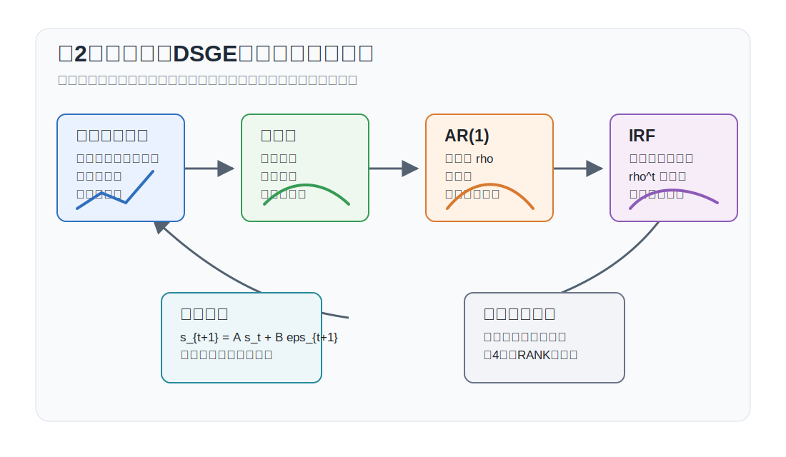
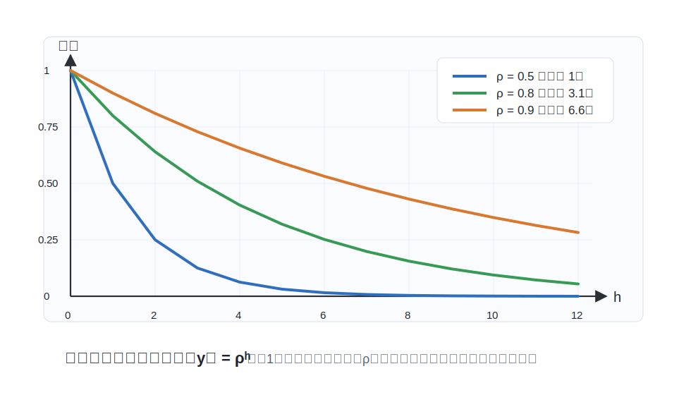
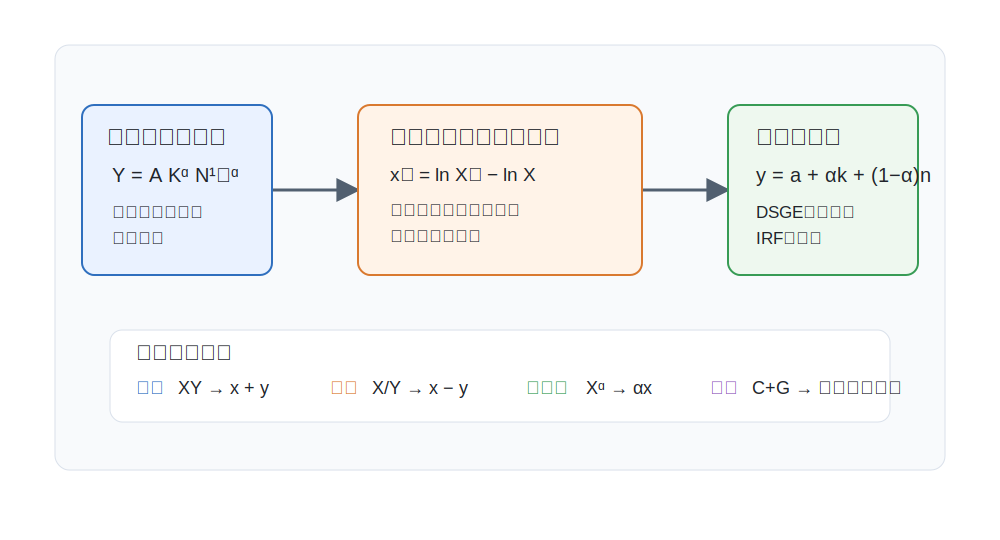

# 講義の目的

本講義では、動学的マクロ経済モデルを読むために必要な時系列分析と対数線形近似を整理します。第3回以降では、家計や企業の最適化問題から得られる非線形の均衡条件を、定常状態の周りで線形化して分析します。その準備として、本講義では次の3点を扱います。

1. **時系列分析の基礎**：定常性、持続性、自己相関、予測
2. **ショックの波及**：AR(1)、インパルス応答関数、線形状態空間表現
3. **対数線形近似**：非線形方程式を定常状態の周りで線形化する方法

ここでは、モデルの動学を読むための時系列分析と対数線形近似に集中します。

{#fig-lecture02-overview width=95%}

# 時系列データと定常性

**時系列データとモデルの見方**

マクロ経済データは時間の順序を持つデータです。GDP、消費、インフレ率、名目金利、労働投入、技術水準はいずれも、ある時点だけでなく過去から現在への推移が重要です。動学モデルでは、ある変数の現在値が過去の状態、現在のショック、将来への期待に依存します。

時系列モデルを読むときは、次の3つを区別します。

1. **水準**：$Y_t, C_t, R_t$ のような元の変数
2. **定常状態からの乖離**：$Y_t-Y$ や $\ln Y_t-\ln Y$
3. **成長率・変化率**：$\Delta \ln Y_t=\ln Y_t-\ln Y_{t-1}$

DSGEモデルでは、多くの場合、まず定常状態を求め、その周りの小さな乖離を分析します。したがって、時系列分析で重要なのは「ショックを受けた変数が定常状態に戻るのか」「戻るならどれくらい速いのか」です。

**弱定常性**

確率過程 $\{y_t\}$ が弱定常であるとは、平均、分散、自己共分散が時間の位置に依存しないことを意味します。具体的には、次を満たすとき、$\{y_t\}$ は弱定常です。

1. 平均が一定：$\mathbb{E}[y_t]=\mu$
2. 分散が一定：$\operatorname{Var}(y_t)=\sigma_y^2$
3. 自己共分散がラグだけに依存：$\operatorname{Cov}(y_t,y_{t-k})=\gamma_k$

第3条件は、$y_{2026}$ と $y_{2025}$ の関係が、$y_{2010}$ と $y_{2009}$ の関係と同じ形で記述できるという意味です。モデルが定常であれば、過去の一時的なショックの影響は時間とともに薄れていきます。

**定常性が重要な理由**

定常性は、動学モデルの解釈を安定させます。たとえば、技術ショック後の産出が定常状態へ戻るなら、そのショックは一時的な景気変動を生みます。一方、ショックの影響が永久に残るなら、変数の水準そのものが恒久的に変わります。

第4回以降で使う対数線形モデルでは、変数を定常状態からの乖離として書きます。このとき、線形化されたシステムが安定であることは、乖離が発散せず定常状態の周りに戻ることを意味します。

# AR(1)過程

**基本形**

マクロ経済学で最もよく使われるショック過程は、1次の自己回帰過程 AR(1) です。
$$
y_t=(1-\rho)\mu+\rho y_{t-1}+\varepsilon_t,
\qquad
\varepsilon_t\sim i.i.d.(0,\sigma_\varepsilon^2)
$$
ここで、$\mu$ は長期平均、$\rho$ は持続性、$\varepsilon_t$ は予期されないショックです。$|\rho|<1$ なら、この過程は弱定常です。

平均は次のように確認できます。両辺の期待値を取ると、
$$
\mathbb{E}[y_t]
=
(1-\rho)\mu+\rho\mathbb{E}[y_{t-1}]
$$
です。定常状態では $\mathbb{E}[y_t]=\mathbb{E}[y_{t-1}]$ なので、平均は $\mu$ になります。

**分散と自己相関**

平均からの乖離を $\tilde{y}_t\equiv y_t-\mu$ と書くと、AR(1)は
$$
\tilde{y}_t=\rho\tilde{y}_{t-1}+\varepsilon_t
$$
です。定常分散を $\sigma_y^2$ とすると、
$$
\sigma_y^2
=
\rho^2\sigma_y^2+\sigma_\varepsilon^2
$$
より、
$$
\operatorname{Var}(y_t)
=
\frac{\sigma_\varepsilon^2}{1-\rho^2}
$$
を得ます。また、$k$ 期ラグの自己相関は
$$
\operatorname{Corr}(y_t,y_{t-k})=\rho^k
$$
です。$\rho$ が大きいほど、現在の値は過去の値を強く引きずります。

**予測**

AR(1)では、$t$ 期に観察された $y_t$ から、$h$ 期先の条件付き期待値を簡単に計算できます。
$$
\mathbb{E}_t[y_{t+h}]
=
\mu+\rho^h(y_t-\mu)
$$
したがって、$|\rho|<1$ なら、予測値は $h$ が大きくなるにつれて長期平均 $\mu$ に近づきます。

この式は、ショックの持続性を読むうえで重要です。たとえば $0<\rho<1$ のとき、ショックの影響が半分になるまでの期間は
$$
h_{1/2}
=
\frac{\ln(0.5)}{\ln(\rho)}
$$
です。$\rho=0.9$ なら半減期は約6.6期、$\rho=0.5$ なら1期です。

# インパルス応答関数

**AR(1)のインパルス応答**

インパルス応答関数は、ある時点でショックが1単位発生したとき、その後の変数がどのように反応するかを示します。AR(1)
$$
y_t=\rho y_{t-1}+\varepsilon_t
$$
で、$y_{-1}=0$、$\varepsilon_0=1$、$\varepsilon_t=0$ for $t\geq 1$ とすると、
$$
y_0=1,\qquad
y_1=\rho,\qquad
y_2=\rho^2,\qquad
y_h=\rho^h
$$
です。したがって、AR(1)のインパルス応答は $\rho^h$ です。

次の図は、同じ1単位のショックを与えたときの反応を、$\rho=0.5,0.8,0.9$ で比較したものです。$\rho$ が大きいほどショックは長く残り、半減期も長くなります。

{#fig-ar1-irf-simulation width=90%}

**DSGEモデルでのインパルス応答**

DSGEモデルでは、技術ショック、金融政策ショック、政府支出ショックなどをAR(1)で表すことが多いです。たとえば技術ショックは
$$
a_t=\rho_a a_{t-1}+\varepsilon_t^a
$$
と書かれます。$\rho_a$ が大きいほど、技術ショックは長く残り、産出や労働の反応も長く続きます。

線形化されたDSGEモデルの解は、しばしば次の状態空間表現で書けます。
$$
s_{t+1}=A s_t+B\varepsilon_{t+1}
$$
ここで、$s_t$ は状態変数のベクトル、$\varepsilon_{t+1}$ はショックのベクトルです。このとき、$t+1$ 期のショックが $h$ 期後の状態に与える影響は
$$
A^hB
$$
で表されます。つまり、インパルス応答関数は、線形システムの行列 $A$ を繰り返し掛けることで得られます。

# 安定性と差分方程式

**1変数の安定性**

1変数の線形差分方程式
$$
x_{t+1}=a x_t
$$
を考えます。初期値が $x_0$ なら、
$$
x_t=a^t x_0
$$
です。したがって、$|a|<1$ なら $x_t$ は0に収束し、$|a|>1$ なら発散します。$a<0$ かつ $|a|<1$ の場合は、符号を交互に変えながら収束します。

この単純な性質は、対数線形化したDSGEモデルでも中心的です。複数変数の場合、安定性は行列の固有値で判断します。直感的には、システムの各方向における増幅率が1より小さければ、その方向の乖離は定常状態に戻ります。

**前向き変数と期待**

DSGEモデルには、消費、インフレ率、資産価格のように将来への期待で決まる変数が出てきます。たとえば、単純化した前向き方程式
$$
x_t=\alpha\mathbb{E}_t x_{t+1}+u_t,
\qquad 0<\alpha<1
$$
を考えます。これを前向きに繰り返すと、
$$
x_t
=
\mathbb{E}_t
\sum_{j=0}^{\infty}\alpha^j u_{t+j}
$$
となります。ただし、発散する期待成分を排除する条件が必要です。この発想は、第3回で扱う横断性条件や資産価格式と同じです。

# 対数線形近似

対数線形近似は、非線形の均衡条件を、定常状態の周りの小さな乖離について線形の方程式に置き換える方法です。次の図のように、水準の式を対数偏差に変換することで、ショックの波及や安定性を線形システムとして扱えるようになります。

{#fig-log-linearization-map width=92%}

**対数偏差**

変数 $X_t$ の定常状態を $X$ とします。対数偏差を
$$
x_t
\equiv
\ln X_t-\ln X
$$
と定義します。定常状態からの乖離が小さいとき、
$$
x_t
\approx
\frac{X_t-X}{X}
$$
なので、$x_t=0.01$ は、およそ定常状態から1パーセント高いことを意味します。

本講義以降では、大文字を水準、小文字を対数偏差として使うことが多くなります。たとえば $Y_t$ は産出の水準、$y_t$ は産出の定常状態からの対数乖離です。

**基本公式**

対数線形化では、積、商、べき乗が簡単に扱えます。$Z_t=X_tY_t$ なら、
$$
z_t=x_t+y_t
$$
です。$Z_t=X_t/Y_t$ なら、
$$
z_t=x_t-y_t
$$
です。$Z_t=X_t^\alpha$ なら、
$$
z_t=\alpha x_t
$$
です。

コブ＝ダグラス型生産関数
$$
Y_t=A_tK_t^\alpha N_t^{1-\alpha}
$$
を対数線形化すると、
$$
y_t=a_t+\alpha k_t+(1-\alpha)n_t
$$
です。非線形の生産関数が、対数偏差の線形結合になります。

**和の近似**

和の対数線形化では、定常状態のシェアが係数になります。$Y_t=C_t+G_t$ とし、定常状態でも $Y=C+G$ が成り立つとします。このとき、
$$
y_t
=
\frac{C}{Y}c_t+\frac{G}{Y}g_t
$$
です。資源制約の対数線形化では、このシェアの重みが重要です。

この公式は積の公式より間違えやすい点です。$Y_t=C_t+G_t$ だからといって、$y_t=c_t+g_t$ にはなりません。和を線形化するときは、必ず定常状態の比率で重みづけします。

**総収益率とインフレ率**

金融変数では、粗収益率と純利子率を区別します。粗名目利子率を $R_t^N$、粗インフレ率を $\Pi_{t+1}=P_{t+1}/P_t$ とすると、名目債券の来期実質総収益率は
$$
\frac{R_t^N}{\Pi_{t+1}}
$$
です。定常状態の周りで対数を取ると、
$$
r_t
=
r_t^N-\pi_{t+1}
$$
となります。期待値を取れば、フィッシャー方程式の対数線形近似として
$$
\mathbb{E}_t r_t
=
r_t^N-\mathbb{E}_t\pi_{t+1}
$$
を得ます。

第4回のRANKモデルでは、この関係が家計のEuler方程式と金融政策ルールを結びます。

# まとめ

本講義のポイントは次の通りです。

1. **定常性**：平均、分散、自己共分散が時間に依存しないとき、時系列は弱定常である。
2. **AR(1)**：$|\rho|<1$ なら定常で、ショックの影響は $\rho^h$ の速さで減衰する。
3. **インパルス応答**：線形システムでは、ショックの動学的効果は状態方程式を繰り返すことで得られる。
4. **安定性**：1変数では係数の絶対値、複数変数では固有値が収束性を決める。
5. **対数線形近似**：積と商は簡単だが、和の近似では定常状態のシェアが必要である。

次回は、制約つき最適化を正面から扱います。有限期間のラグランジュ問題から出発し、無限期間、ダイナミック・プログラミング、不確実性、資産価格条件へ進みます。

# 演習問題

**問1：AR(1)のインパルス応答**

次のAR(1)過程を考えます。
$$
y_t=0.8y_{t-1}+\varepsilon_t
$$
$y_{-1}=0$、$\varepsilon_0=1$、$\varepsilon_t=0$ for $t\geq 1$ とします。$t=0,1,2,3,4$ における $y_t$ を求めなさい。また、ショックの半減期を計算しなさい。

**問2：平均回帰**

次の過程を考えます。
$$
y_t=(1-\rho)\mu+\rho y_{t-1}+\varepsilon_t,
\qquad
\rho=0.6,\quad \mu=2
$$
$y_t=5$ が観察されたとき、$\mathbb{E}_t[y_{t+1}]$ と $\mathbb{E}_t[y_{t+2}]$ を求めなさい。

**問3：和の対数線形化**

資源制約 $Y_t=C_t+G_t$ を考えます。定常状態で $C/Y=0.8$、$G/Y=0.2$ とします。$C_t$ が定常状態から1パーセント高く、$G_t$ が定常状態から2パーセント高いとき、$Y_t$ は定常状態からおよそ何パーセント高いですか。

**問4：フィッシャー方程式**

名目債券の来期実質総収益率が $R_t^N/\Pi_{t+1}$ で与えられるとします。この式を対数線形化し、名目利子率が上昇しても期待インフレ率が同じだけ上昇する場合、実質利子率がどうなるか説明しなさい。
