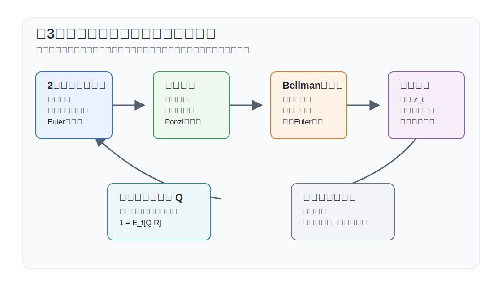
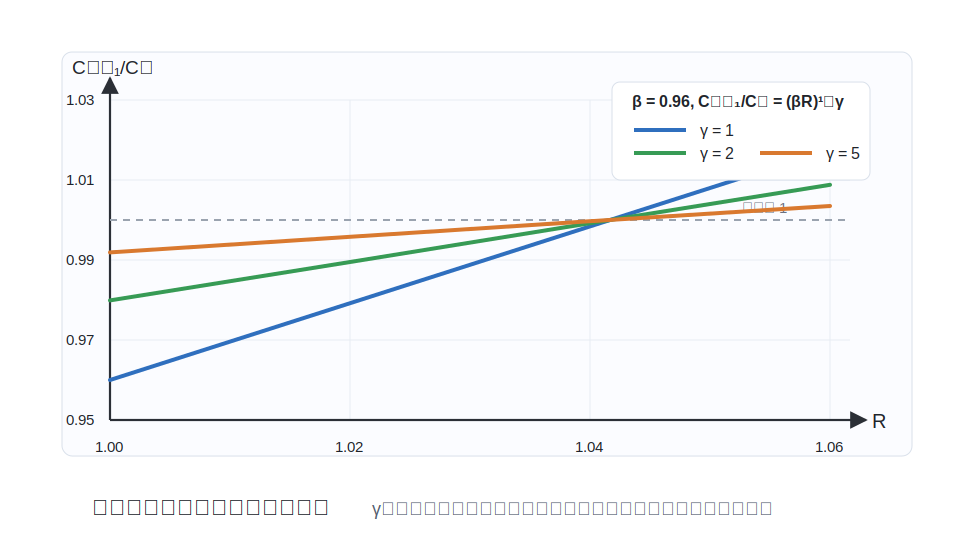
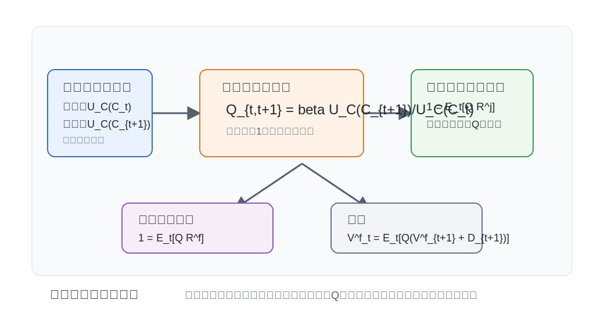

# 講義の目的と全体像

## この講義で扱う問い

この講義では、家計の異時点間最適化問題を次の順序で導出します。

1. 有限期間の決定論的な消費・貯蓄問題をラグランジュ法で解く。
2. 期間を無限に伸ばし、オイラー方程式と横断性条件を確認する。
3. 同じ問題をダイナミック・プログラミングで解き、ラグランジュ法と同じ一階条件が出ることを示す。
4. 不確実性を導入し、期待値つきのオイラー方程式と確率的割引因子を導く。
5. 株式保有を導入し、企業価値が将来配当の割引現在価値になることを示す。

最低限の到達目標は、オイラー方程式と確率的割引因子（SDF）を自分で導出し、資産価格条件 $1=\mathbb{E}_t[Q_{t,t+1}R^j_{t+1}]$ の意味を説明できることです。有限期間・無限期間・ダイナミック・プログラミングはその導出手順です。株式価値と配当割引モデルは、同じSDFを企業価値に応用する発展項目として扱います。

ゴールは、DSGEモデルで頻繁に現れる次の3つの条件を、自分で導出できるようにすることです。
$$
\begin{aligned}
U_C(C_t)&=\beta R U_C(C_{t+1}),\\
1&=\mathbb{E}_t\left[
\beta\frac{U_C(C_{t+1})}{U_C(C_t)}R^j_{t+1}
\right],\\
V_t^F&=\mathbb{E}_t\left[
\beta\frac{U_C(C_{t+1})}{U_C(C_t)}
\left(V_{t+1}^F+D_{t+1}\right)
\right].
\end{aligned}
$$
最初の式は決定論的なオイラー方程式、2番目は不確実性下の資産価格条件、3番目は企業価値の条件です。

{#fig-lecture03-overview width=95%}

## タイミングと記号

家計は各期 $t$ のはじめに、前期から持ち越した債券 $B_{t-1}$ を保有しています。確率的な節では、$t$ 期に購入する無リスク債券 $B_t$ が $t+1$ 期に支払う総収益率を $R_t^f$ と書きます。したがって、$t$ 期に前期債券から受け取る収益は $R_{t-1}^fB_{t-1}$ です。家計は所得 $Y_t$ を受け取り、消費 $C_t$ と次期に持ち越す債券 $B_t$ を選びます。

決定論的な基礎ケースでは、総収益率を一定の $R=1+r$ とします。このとき予算制約は
$$
C_t+B_t=RB_{t-1}+Y_t
$$
です。右辺は今期に使える資源、左辺は今期消費と来期に持ち越す資産です。

効用関数は
$$
U_C(C)>0,\qquad U_{CC}(C)<0
$$
を満たすと仮定します。つまり、消費は効用を高めますが、限界効用は逓減します。また、割引因子は $0<\beta<1$ とします。

本ノートで使う主な記号は次の通りです。第4回以降の表記と完全に同じ形にはせず、この回の動学的最適化と資産価格付けで必要な記号だけをまとめます。

| 記号 | 意味 |
|---|---|
| $C_t$ | 消費 |
| $Y_t$ | 外生所得 |
| $B_t$ | $t$ 期に選び、次期に持ち越す債券保有 |
| $R$ | 決定論的な基礎ケースの粗総収益率 |
| $R_t^f$ | $t$ 期に確定している無リスク総収益率 |
| $R^j_{t+1}$ | 危険資産 $j$ の $t+1$ 期総収益率 |
| $\theta_t$ | 株式保有量 |
| $D_t$ | 配当 |
| $V^H$ | 家計の価値関数 |
| $V_t^F$ | 企業価値 |
| $\Lambda,\Lambda_t$ | ラグランジュ乗数 |
| $\mathcal{L}$ | ラグランジュ関数 |

本文中で使用する派生パラメータおよび変数は次の通りです。

| 記号 | 定義 | 意味 |
|---|---|---|
| $Q_{t,t+1}$ | $\beta U_C(C_{t+1})/U_C(C_t)$ | 確率的割引因子（SDF） |
| $Q_{t,t+i}$ | $\prod_{s=1}^{i}Q_{t+s-1,t+s}$ | $t$ 期から $t+i$ 期までの SDF |

::: {.callout-note}
## 内点解と端点解

以下では、消費と資産選択が内点解であるとして一階条件を導きます。借入制約 $B_t\geq \underline{B}$ などがバインドする場合には、一階条件は等式ではなく不等式と補完スラックネス条件を含むKKT条件になります。
:::

# 静学的ラグランジュ法の復習

第3回では動学的な制約つき最適化を扱います。その準備として、等式制約つきの静学的問題を確認します。
$$
\max_{x,y} U(x,y)
\quad
\text{制約条件}
\quad
g(x,y)=c
$$
制約の右辺を左辺に移し、ラグランジュ乗数 $\Lambda$ をつけると、
$$
\mathcal{L}
=
U(x,y)+\Lambda[c-g(x,y)]
$$
です。一階条件は
$$
\begin{aligned}
U_x(x,y)&=\Lambda g_x(x,y),\\
U_y(x,y)&=\Lambda g_y(x,y),\\
g(x,y)&=c
\end{aligned}
$$
です。最初の2本を割ると、
$$
\frac{U_x(x,y)}{U_y(x,y)}
=
\frac{g_x(x,y)}{g_y(x,y)}
$$
となります。これは、限界代替率と制約の傾きが一致するという条件です。

ラグランジュ乗数 $\Lambda$ は、制約を1単位緩めたときに目的関数の最大値がどれだけ増えるかを表します。動学的な消費・貯蓄問題では、各期の予算制約につく乗数 $\Lambda_t$ が、その期の資源を1単位増やすことの限界価値になります。この解釈が、後でオイラー方程式や確率的割引因子につながります。

# 必要条件と十分条件

## なぜ一階条件だけでは足りないのか

制約つき最適化では、まず一階条件を導きます。しかし一階条件は、一般には最適解の必要条件にすぎません。つまり、最適解なら一階条件を満たしますが、一階条件を満たす点が必ず最適解とは限りません。

本講義の消費・貯蓄問題では、目的関数が凹関数で、予算制約が線形です。そのため、実行可能集合が凸で、効用関数が狭義凹なら、一階条件と横断性条件を満たす内点解は最適解です。

整理すると、必要な条件は次の通りです。

1. 各期の予算制約
2. 各期の一階条件
3. 無限期間問題では横断性条件
4. 端点解がある場合にはKKT条件

特に無限期間問題では、オイラー方程式だけでは不十分です。オイラー方程式は隣り合う2期間の消費配分を決めますが、無限遠の資産をどう扱うかを決めません。そこで横断性条件が必要になります。

# 2期間の決定論的問題

## 問題設定

まず、もっとも単純な2期間問題を考えます。家計は $t$ 期と $t+1$ 期の消費を選びます。初期資産 $B_{t-1}$ は所与で、最後の期には資産を残さないとします。

家計の問題は
$$
\max_{C_t,C_{t+1},B_t}
U(C_t)+\beta U(C_{t+1})
$$
制約条件は
$$
\begin{aligned}
C_t+B_t&=RB_{t-1}+Y_t,\\
C_{t+1}&=RB_t+Y_{t+1}.
\end{aligned}
$$
2本の予算制約をまとめると、生涯予算制約は
$$
C_t+\frac{C_{t+1}}{R}
=
RB_{t-1}+Y_t+\frac{Y_{t+1}}{R}
$$
になります。左辺は消費の現在価値、右辺は所得と初期資産の現在価値です。

## ラグランジュ法

生涯予算制約にラグランジュ乗数 $\Lambda$ をつけると、
$$
\mathcal{L}
=U(C_t)+\beta U(C_{t+1})
+\Lambda\left[
RB_{t-1}+Y_t+\frac{Y_{t+1}}{R}
-C_t-\frac{C_{t+1}}{R}
\right].
$$
一階条件は
$$
\begin{aligned}
\frac{\partial \mathcal{L}}{\partial C_t}
&=U_C(C_t)-\Lambda=0,\\
\frac{\partial \mathcal{L}}{\partial C_{t+1}}
&=\beta U_C(C_{t+1})-\frac{\Lambda}{R}=0.
\end{aligned}
$$
したがって
$$
U_C(C_t)=\beta R U_C(C_{t+1})
$$
を得ます。これが2期間問題のオイラー方程式です。

## 経済的な解釈

今日の消費を1単位減らすと、効用は $U_C(C_t)$ だけ低下します。これが貯蓄の限界費用です。

一方、その1単位を貯蓄すると来期には $R$ 単位になります。来期の限界効用は $U_C(C_{t+1})$ なので、来期効用の増加は $RU_C(C_{t+1})$ です。これを現在の効用に割り引くと、限界便益は $\beta RU_C(C_{t+1})$ です。

最適化のもとでは、限界費用と限界便益が一致します。
$$
\text{今日の消費を減らす限界費用}
=
\text{貯蓄して明日の消費を増やす限界便益}.
$$

::: {.callout-tip}
## CRRA効用の例

効用関数が
$$
U(C)=\frac{C^{1-\gamma}}{1-\gamma},\qquad \gamma>0
$$
であれば、限界効用は $U_C(C)=C^{-\gamma}$ です。オイラー方程式は
$$
C_t^{-\gamma}=\beta R C_{t+1}^{-\gamma}
$$
なので、
$$
\frac{C_{t+1}}{C_t}=(\beta R)^{1/\gamma}
$$
となります。$\beta R>1$ なら消費は成長し、$\beta R<1$ なら消費は低下します。
:::

次の図は、$\beta=0.96$ として、粗利子率 $R$ と異時点間代替弾力性の逆数 $\gamma$ が消費成長率 $C_{t+1}/C_t$ に与える影響を数値で示しています。$\gamma$ が大きいほど、利子率が変化しても消費成長率はあまり動きません。

{#fig-consumption-growth-simulation width=90%}

# 有限期間への拡張

## 生涯予算制約

次に、$t,t+1,\ldots,t+N$ の $N+1$ 期間を考えます。各期の予算制約は
$$
C_{t+i}+B_{t+i}=RB_{t+i-1}+Y_{t+i},
\qquad i=0,1,\ldots,N.
$$
各期の制約を現在価値に直して足し合わせると、
$$
\sum_{i=0}^{N}\frac{C_{t+i}}{R^i}
+\frac{B_{t+N}}{R^N}
=
RB_{t-1}
+\sum_{i=0}^{N}\frac{Y_{t+i}}{R^i}.
$$
最後の期に資産を残す効用がなければ、最適解では $B_{t+N}=0$ です。したがって、
$$
\sum_{i=0}^{N}\frac{C_{t+i}}{R^i}
=
RB_{t-1}
+\sum_{i=0}^{N}\frac{Y_{t+i}}{R^i}.
$$
## 現在価値制約を使ったラグランジュ法

有限期間問題は
$$
\max_{\{C_{t+i}\}_{i=0}^{N}}
\sum_{i=0}^{N}\beta^i U(C_{t+i})
$$
制約条件は
$$
\sum_{i=0}^{N}\frac{C_{t+i}}{R^i}
=
RB_{t-1}
+\sum_{i=0}^{N}\frac{Y_{t+i}}{R^i}
$$
です。ラグランジュ関数は
$$
\mathcal{L}
=
\sum_{i=0}^{N}\beta^i U(C_{t+i})
+\Lambda
\left[
RB_{t-1}
+\sum_{i=0}^{N}\frac{Y_{t+i}}{R^i}
-\sum_{i=0}^{N}\frac{C_{t+i}}{R^i}
\right].
$$
$C_{t+i}$ についての一階条件は
$$
\beta^i U_C(C_{t+i})
-\frac{\Lambda}{R^i}=0.
$$
隣り合う $i$ と $i+1$ の条件を比べると、
$$
U_C(C_{t+i})
=
\beta R U_C(C_{t+i+1}),
\qquad i=0,1,\ldots,N-1.
$$
2期間で得たオイラー方程式が、すべての隣接期間について成り立ちます。

## 逐次制約を使ったラグランジュ法

同じ有限期間問題は、各期の予算制約にそれぞれ乗数をつけても解けます。
$$
\mathcal{L}
=
\sum_{i=0}^{N}\beta^i
\left\{
U(C_{t+i})
+\Lambda_{t+i}
\left(RB_{t+i-1}+Y_{t+i}-C_{t+i}-B_{t+i}\right)
\right\}.
$$
$C_{t+i}$ についての一階条件は
$$
U_C(C_{t+i})=\Lambda_{t+i}.
$$
中間期の資産 $B_{t+i}$ についての一階条件は
$$
-\beta^i\Lambda_{t+i}
+\beta^{i+1}R\Lambda_{t+i+1}=0.
$$
したがって
$$
\Lambda_{t+i}=\beta R\Lambda_{t+i+1}.
$$
$\Lambda_{t+i}=U_C(C_{t+i})$ を代入すれば、再び
$$
U_C(C_{t+i})
=
\beta R U_C(C_{t+i+1})
$$
が得られます。現在価値制約を使っても、逐次制約を使っても、同じ必要条件に到達します。

# 無限期間の決定論的問題

## 問題設定

有限期間の終点 $N$ を無限大に送ると、家計の問題は
$$
\max_{\{C_{t+i},B_{t+i}\}_{i=0}^{\infty}}
\sum_{i=0}^{\infty}\beta^i U(C_{t+i})
$$
制約条件は
$$
C_{t+i}+B_{t+i}=RB_{t+i-1}+Y_{t+i},
\qquad i=0,1,2,\ldots
$$
です。

無限期間では、有限期間のように「最後の期に資産をゼロにする」とは言えません。したがって、オイラー方程式に加えて、無限遠の資産を制御する条件が必要です。

## No-Ponzi条件と横断性条件

家計が借金を無限に先送りできると、有限の所得でも無限に消費できてしまいます。これを排除するために、No-Ponzi条件を置きます。一定利子率のもとでは、典型的には
$$
\liminf_{N\to\infty}\frac{B_{t+N}}{R^N}\geq 0
$$
を仮定します。

最適解では、さらに横断性条件
$$
\lim_{N\to\infty}
\beta^N U_C(C_{t+N})B_{t+N}=0
$$
が成り立ちます。これは、限界効用で評価した将来資産の現在価値が、無限遠でゼロになるという条件です。

直観的には、次の2つを同時に排除します。

1. 借金を無限に先送りするポンジー・ゲーム
2. 効用を生まない資産を無限遠に残し続ける非最適な貯蓄

## 無限期間のオイラー方程式

内点解であれば、有限期間の場合と同じ議論により、すべての $i=0,1,2,\ldots$ について
$$
U_C(C_{t+i})
=
\beta R U_C(C_{t+i+1})
$$
が成り立ちます。

したがって、無限期間の決定論的な消費・貯蓄問題の必要条件は、
$$
\begin{aligned}
C_{t+i}+B_{t+i}&=RB_{t+i-1}+Y_{t+i},\\
U_C(C_{t+i})
&=
\beta R U_C(C_{t+i+1}),\\
\lim_{N\to\infty}
\beta^N U_C(C_{t+N})B_{t+N}&=0
\end{aligned}
$$
の3つです。

::: {.callout-warning}
## オイラー方程式だけで終わらない

無限期間問題では、オイラー方程式は局所的な最適性を表します。しかし、資産経路全体が実行可能か、無限遠で不自然な借入や貯蓄をしていないかは、横断性条件で確認する必要があります。
:::

# ダイナミック・プログラミング

## Bellman方程式

次に、同じ問題をダイナミック・プログラミングで解きます。ここでは、所得 $Y$ と利子率 $R$ が一定である定常的な環境を考えます。

状態変数は期首資産 $B_{t-1}$ です。価値関数を $V^H(B_{t-1})$ と書くと、Bellman方程式は
$$
V^H(B_{t-1})
=
\max_{C_t,B_t}
\left\{
U(C_t)+\beta V^H(B_t)
\right\}
$$
制約条件は
$$
C_t+B_t=RB_{t-1}+Y
$$
です。

## Bellman方程式の一階条件

ラグランジュ関数は
$$
\mathcal{L}
=
U(C_t)+\beta V^H(B_t)
+\Lambda_t
\left(RB_{t-1}+Y-C_t-B_t\right).
$$
$C_t$ と $B_t$ についての一階条件は
$$
\begin{aligned}
U_C(C_t)&=\Lambda_t,\\
\beta V^H_B(B_t)&=\Lambda_t.
\end{aligned}
$$
また、包絡線定理より
$$
V^H_B(B_{t-1})=R\Lambda_t
$$
が得られます。1期先に進めると、
$$
V^H_B(B_t)=R\Lambda_{t+1}.
$$
これを一階条件 $\beta V^H_B(B_t)=\Lambda_t$ に代入すると、
$$
\Lambda_t=\beta R\Lambda_{t+1}.
$$
$\Lambda_t=U_C(C_t)$ なので、
$$
U_C(C_t)=\beta R U_C(C_{t+1})
$$
を得ます。これはラグランジュ法で導いたオイラー方程式と同じです。

## ラグランジュ法との同値性

ラグランジュ法は、家計が将来の消費と資産の列を一度に選ぶ問題として書きます。ダイナミック・プログラミングは、今日の選択と明日以降の価値に分けて書きます。

しかし、どちらも同じ経済問題を表しています。Bellman方程式が正しく書けていて、価値関数が微分可能で、最適政策が横断性条件を満たすなら、Bellman方程式の一階条件から得られる政策は、逐次的なラグランジュ問題の必要条件を満たします。

逆に、逐次的なラグランジュ問題の最適経路が存在し、横断性条件を満たすなら、その経路の任意の時点以降の部分経路も、その時点の状態から見て最適です。これが最適性原理です。

::: {.callout-note}
## 同値性の要点

ラグランジュ法では「すべての期を同時に」最適化します。ダイナミック・プログラミングでは「今日の選択」と「明日以降の価値」に分けます。分け方が違うだけで、予算制約、オイラー方程式、横断性条件は同じです。
:::

# 不確実性を導入したダイナミック・プログラミング

## 確率的な環境

次に、不確実性を導入します。外生状態を $z_t$ とし、所得は
$$
Y_t=Y(z_t)
$$
で与えられるとします。外生状態はマルコフ過程に従い、$t$ 期の状態 $z_t$ が観察された後、$t+1$ 期の状態 $z_{t+1}$ が条件付き分布 $\Pr(z_{t+1}\mid z_t)$ に従って実現します。無リスク債券の $t$ 期から $t+1$ 期までの総収益率を $R_t^f$ とします。

$t$ 期のタイミングは次の通りです。まず $z_t$ が観察され、現在所得 $Y(z_t)$ が決まります。そのうえで家計は $C_t$ と $B_t$ を選びます。$t$ 期に選んだ債券 $B_t$ は、$t+1$ 期に総収益率 $R_t^f$ を支払います。したがって $t$ 期の予算制約は
$$
C_t+B_t=R_{t-1}^fB_{t-1}+Y(z_t).
$$
価値関数は状態 $z_t$ にも依存するので、
$$
V^H(B_{t-1},z_t)
=
\max_{C_t,B_t}
\left\{
U(C_t)+\beta\mathbb{E}_t
V^H(B_t,z_{t+1})
\right\}
$$
制約条件は
$$
C_t+B_t=R_{t-1}^fB_{t-1}+Y(z_t)
$$
です。ここで $\mathbb{E}_t[\cdot]$ は、$t$ 期に利用可能な情報、すなわち現在の状態 $z_t$ に基づく条件付き期待値です。

タイミングを明確にすると、$t$ 期の家計は $z_t$ を観察したうえで $C_t$ と $B_t$ を選びます。この時点では、来期の状態 $z_{t+1}$ はまだ分かりません。したがって、$z_{t+1}$ は今期の予算制約には入りませんが、来期に実現する所得 $Y(z_{t+1})$、来期消費 $C_{t+1}$、来期の限界効用を決めます。そのため、来期以降の価値は $V^H(B_t,z_{t+1})$ と書かれ、今期の目的関数ではその期待値 $\mathbb{E}_t V^H(B_t,z_{t+1})$ が継続価値として入ります。つまり、今期の選択 $B_t$ は固定されますが、その資産を持って迎える来期の状態が確率的なので、継続価値を期待値で評価します。

## 一階条件と包絡線条件

ラグランジュ関数は
$$
\mathcal{L}
=
U(C_t)+\beta\mathbb{E}_t V^H(B_t,z_{t+1})
+\Lambda_t(R_{t-1}^fB_{t-1}+Y(z_t)-C_t-B_t).
$$
一階条件は
$$
\begin{aligned}
U_C(C_t)&=\Lambda_t,\\
\Lambda_t
&=
\beta\mathbb{E}_t
\left[
V^H_B(B_t,z_{t+1})
\right].
\end{aligned}
$$
1期先の包絡線条件は
$$
V^H_B(B_t,z_{t+1})
=
R_t^f\Lambda_{t+1}.
$$
ここで $\Lambda_{t+1}=U_C(C_{t+1})$ であり、来期消費は政策関数として $C_{t+1}=C(B_t,z_{t+1})$ と決まります。したがって、$z_{t+1}$ は明示的には包絡線条件の引数として現れ、経済的には来期所得と来期消費を通じて限界効用を動かします。
したがって
$$
\Lambda_t
=
\beta\mathbb{E}_t
\left[
R_t^f\Lambda_{t+1}
\right].
$$
$\Lambda_t=U_C(C_t)$ を代入すると、不確実性下のオイラー方程式
$$
U_C(C_t)
=
\beta\mathbb{E}_t
\left[
R_t^fU_C(C_{t+1})
\right]
$$
を得ます。

## 確率的割引因子

両辺を $U_C(C_t)$ で割ると、
$$
1
=
\mathbb{E}_t
\left[
\beta\frac{U_C(C_{t+1})}{U_C(C_t)}
R_t^f
\right].
$$
ここで
$$
Q_{t,t+1}
\equiv
\beta\frac{U_C(C_{t+1})}{U_C(C_t)}
$$
を確率的割引因子（SDF）と呼びます。すると、オイラー方程式は
$$
1=\mathbb{E}_t[Q_{t,t+1}R_t^f]
$$
と書けます。

確率的割引因子 $Q_{t,t+1}$ は、債券にも株式にも同じように使われる価格付けの核です。したがって、異なる資産の条件を別々の公式として覚えるより、すべてが $1=\mathbb{E}_t[Q_{t,t+1}R^j_{t+1}]$ の応用だと理解すると見通しがよくなります。

{#fig-sdf-asset-pricing-map width=92%}

任意の危険資産 $j$ の総収益率を $R^j_{t+1}$ とすると、裁定がない均衡では
$$
1=\mathbb{E}_t[Q_{t,t+1}R^j_{t+1}]
$$
が成り立ちます。無リスク債券はこの特殊ケースで、$t$ 期に収益率が確定しているため $R^j_{t+1}=R_t^f$ と書いています。資産価格理論の多くは、この1本の式から始まります。

## 確率的な横断性条件

多期間の確率的割引因子を
$$
Q_{t,t+N}
\equiv
\prod_{s=1}^{N}Q_{t+s-1,t+s}
=
\beta^N
\frac{U_C(C_{t+N})}{U_C(C_t)}
$$
と定義します。確率的な横断性条件は
$$
\lim_{N\to\infty}
\mathbb{E}_t
\left[
Q_{t,t+N}B_{t+N}
\right]
=0
$$
です。将来資産を、家計の限界効用にもとづく割引因子で現在価値に直したものが、無限遠でゼロになるという条件です。

# 発展：株式保有と企業価値

## 家計の予算制約

最後に、家計が債券だけでなく株式も保有できる場合を考えます。外生所得は引き続き $Y_t=Y(z_t)$ とします。企業価値を $V_t^F$、配当を $D_t$、家計の株式保有量を $\theta_t$ とします。

$t$ 期の予算制約は
$$
C_t+B_t+V_t^F\theta_t
=
R_{t-1}^fB_{t-1}+Y(z_t)
+\theta_{t-1}(V_t^F+D_t).
$$
左辺は今期の支出です。消費、債券購入、株式購入から成ります。右辺は今期の資源です。前期から持ち越した債券の収益、所得、前期から持ち越した株式の売却価値と配当から成ります。

価値関数は
$$
V^H(B_{t-1},\theta_{t-1},z_t)
$$
と書けます。Bellman方程式は
$$
V^H(B_{t-1},\theta_{t-1},z_t)
=
\max_{C_t,B_t,\theta_t}
\left\{
U(C_t)
+\beta\mathbb{E}_t
V^H(B_t,\theta_t,z_{t+1})
\right\}
$$
制約条件は
$$
C_t+B_t+V_t^F\theta_t
=
R_{t-1}^fB_{t-1}+Y(z_t)
+\theta_{t-1}(V_t^F+D_t)
$$
です。

## 一階条件

ラグランジュ関数は
$$
\begin{aligned}
\mathcal{L}
=\;&
U(C_t)
+\beta\mathbb{E}_t
V^H(B_t,\theta_t,z_{t+1}) \\
&+\Lambda_t
\left[
R_{t-1}^fB_{t-1}+Y(z_t)
+\theta_{t-1}(V_t^F+D_t)
-C_t-B_t-V_t^F\theta_t
\right].
\end{aligned}
$$
消費についての一階条件は
$$
U_C(C_t)=\Lambda_t.
$$
債券についての一階条件は
$$
\Lambda_t
=
\beta\mathbb{E}_t
\left[
V^H_B(B_t,\theta_t,z_{t+1})
\right].
$$
株式保有についての一階条件は
$$
V_t^F\Lambda_t
=
\beta\mathbb{E}_t
\left[
V^H_{\theta}(B_t,\theta_t,z_{t+1})
\right].
$$
1期先の包絡線条件は
$$
\begin{aligned}
V^H_B(B_t,\theta_t,z_{t+1})
&=
R_t^f\Lambda_{t+1},\\
V^H_{\theta}(B_t,\theta_t,z_{t+1})
&=
\Lambda_{t+1}(V_{t+1}^F+D_{t+1}).
\end{aligned}
$$
したがって、債券については
$$
1
=
\mathbb{E}_t
\left[
Q_{t,t+1}R_t^f
\right],
$$
株式については
$$
V_t^F
=
\mathbb{E}_t
\left[
Q_{t,t+1}
(V_{t+1}^F+D_{t+1})
\right]
$$
を得ます。

## 株式収益率による表現

株式の総収益率を
$$
R_{t+1}^e
\equiv
\frac{V_{t+1}^F+D_{t+1}}{V_t^F}
$$
と定義します。この総収益率は、キャピタルゲインとインカムゲインに分けられます。
$$
R_{t+1}^e
=
1
+\frac{V_{t+1}^F-V_t^F}{V_t^F}
+\frac{D_{t+1}}{V_t^F}.
$$
右辺の第2項は企業価値の変化率、つまりキャピタルゲイン率です。第3項は配当利回り、つまりインカムゲインです。
ここで注意したいのは、配当利回り $\frac{D_{t+1}}{V_t^F}$ は債券利回りではないという点です。これは株式を1期保有したときの総収益率 $R_{t+1}^e$ の一部です。株式のリスクプレミアムは、配当利回りだけではなく、キャピタルゲインを含む総収益率に対して定義されます。$t$ 期に確定している無リスク債券の総収益率を $R_t^f$ と書けば、株式の期待超過収益率は
$$
\mathbb{E}_t R_{t+1}^e-R_t^f
$$
です。したがって、物理確率の期待値で株式を評価するときには、無リスク利子率だけでなく、このリスクプレミアムを含む要求収益率で割り引いていると解釈できます。

企業価値条件は
$$
1
=
\mathbb{E}_t
\left[
Q_{t,t+1}R_{t+1}^e
\right]
$$
と書けます。無リスク債券についても
$$
1
=
\mathbb{E}_t
\left[
Q_{t,t+1}R_t^f
\right]
$$
が成り立ちます。したがって、無リスク債券と株式はいずれも同じ確率的割引因子 $Q_{t,t+1}$ で価格づけされています。これは、通常の期待収益率 $\mathbb{E}_t R_{t+1}^e$ と $R_t^f$ が等しいという意味ではありません。正しい条件は、確率的割引因子で評価した期待収益が等しいということです。
$$
\mathbb{E}_t
\left[
Q_{t,t+1}R_{t+1}^e
\right]
=
\mathbb{E}_t
\left[
Q_{t,t+1}R_t^f
\right]
=1.
$$
同じことを超過収益率で書けば、
$$
\mathbb{E}_t
\left[
Q_{t,t+1}
\left(R_{t+1}^e-R_t^f\right)
\right]
=0
$$
です。これが無裁定条件です。もし $Q_{t,t+1}$ で割り引いた株式の期待ペイオフが価格より高ければ、株式を買って債券を売る裁定機会が生じます。逆に低ければ、株式を売って債券を買う裁定機会が生じます。均衡では、そのような裁定機会が消えるように企業価値 $V_t^F$ が決まります。

## 発展：配当割引モデル

企業価値条件
$$
V_t^F
=
\mathbb{E}_t
\left[
Q_{t,t+1}
(V_{t+1}^F+D_{t+1})
\right]
$$
を前向きに繰り返し代入すると、
$$
V_t^F
=
\mathbb{E}_t
\left[
\sum_{i=1}^{N}
Q_{t,t+i}D_{t+i}
+Q_{t,t+N}V_{t+N}^F
\right].
$$
ここで
$$
Q_{t,t+i}
=
\beta^i
\frac{U_C(C_{t+i})}{U_C(C_t)}
$$
です。企業価値の横断性条件、またはバブルを排除する条件として
$$
\lim_{N\to\infty}
\mathbb{E}_t
\left[
Q_{t,t+N}V_{t+N}^F
\right]
=0
$$
を置けば、
$$
V_t^F
=
\mathbb{E}_t
\left[
\sum_{i=1}^{\infty}
Q_{t,t+i}D_{t+i}
\right]
$$
を得ます。つまり、企業価値は将来配当の確率的割引現在価値です。

同じ価格は、リスクフリー率のコンパウンドを使っても表現できます。ただし、このとき物理確率の下で期待配当をそのままリスクフリー率で割り引くのではありません。リスクを調整した期待値、すなわちリスク中立期待値を使う必要があります。

$t$ 期から $t+i$ 期までの無リスク割引債価格を
$$
P_{t,i}^f
\equiv
\mathbb{E}_t[Q_{t,t+i}]
$$
と定義します。対応する $i$ 期間の無リスク総収益率を
$$
R_{t,t+i}^f
\equiv
\frac{1}{P_{t,i}^f}
$$
と書けば、リスク中立期待値 $\mathbb{E}_t^*[\cdot]$ のもとで
$$
\mathbb{E}_t[Q_{t,t+i}X_{t+i}]
=
P_{t,i}^f\mathbb{E}_t^*[X_{t+i}]
=
\frac{\mathbb{E}_t^*[X_{t+i}]}{R_{t,t+i}^f}
$$
が成り立ちます。したがって企業価値は
$$
V_t^F
=
\sum_{i=1}^{\infty}
\frac{\mathbb{E}_t^*[D_{t+i}]}{R_{t,t+i}^f}
$$
とも書けます。将来の短期無リスク金利の経路が確定している特殊な場合には、
$$
R_{t,t+i}^f
=
\prod_{s=0}^{i-1}R_{t+s}^f
$$
なので、
$$
V_t^F
=
\mathbb{E}_t^*
\left[
\sum_{i=1}^{\infty}
\frac{D_{t+i}}{\prod_{s=0}^{i-1}R_{t+s}^f}
\right]
$$
と書けます。

重要なのは、リスクフリー率で割り引く場合には期待値の側がリスク調整されている、という点です。物理確率の期待値で書くと、
$$
\mathbb{E}_t[Q_{t,t+i}D_{t+i}]
=
\frac{\mathbb{E}_t[D_{t+i}]}{R_{t,t+i}^f}
+\operatorname{Cov}_t(Q_{t,t+i},D_{t+i})
$$
となります。配当が不況時に低く、家計の限界効用が高い状態で低いペイオフを支払うなら、この共分散項は価格に重要な影響を与えます。

# 必要条件を見つける手順

動学的最適化問題で一階条件を導くときは、次の順序で考えると混乱しにくくなります。

1. 状態変数と操作変数を分ける。
2. 各期の予算制約を、今期の資源と今期の支出に分けて書く。
3. 各制約にラグランジュ乗数をつける。
4. 消費の一階条件から、乗数を限界効用で表す。
5. 資産の一階条件から、今日のシャドープライスと明日の価値を結ぶ。
6. 包絡線条件を使って、価値関数の微分を次期の乗数に置き換える。
7. 乗数を消去して、オイラー方程式または資産価格条件を得る。
8. 無限期間なら、横断性条件を確認する。

この手順を使うと、債券、株式、資本、名目債券など、どの資産を導入しても基本構造は同じです。資産ごとに変わるのは、来期に支払うペイオフだけです。

# 第4回への接続

第4回の資本なしRBCモデルでは、家計の一階条件と企業価値条件を均衡条件として使います。企業価値を表す記号は簡略化し、第3回の $V_t^F$ を $V_t$ と書きます。家計の価値関数 $V^H$ は、第3回で動学計画法と Bellman方程式を説明するために使った記号であり、第4回では価値関数を明示せず、家計の一階条件だけを使います。

債券については、第4回の本体では実質債券を使い、実質総利子率を $R_t$ と書きます。このときオイラー方程式は
$$
1=\mathbb{E}_t[Q_{t,t+1}R_t]
$$
です。名目債券を明示する第7回以降では、来期実質総収益率が $R_t^N/\Pi_{t+1}$ なので、
$$
1=\mathbb{E}_t\left[Q_{t,t+1}\frac{R_t^N}{\Pi_{t+1}}\right]
$$
と書きます。名目では無リスクな債券でも、インフレが確率的なら実質収益率にはインフレリスクが残る点に注意します。

# まとめ

本講義では、有限期間のラグランジュ問題から出発し、無限期間、ダイナミック・プログラミング、不確実性、企業価値へと順に拡張しました。

決定論的な消費・貯蓄問題では、
$$
U_C(C_t)=\beta R U_C(C_{t+1})
$$
が中心条件です。不確実性を導入すると、
$$
1=\mathbb{E}_t[Q_{t,t+1}R^j_{t+1}]
$$
という資産価格条件になります。株式を導入すると、
$$
V_t^F
=
\mathbb{E}_t
\left[
Q_{t,t+1}
(V_{t+1}^F+D_{t+1})
\right]
$$
が得られ、企業価値は将来配当を確率的割引因子で割り引いた現在価値として表されます。

重要なのは、これらの式が別々の公式ではないという点です。すべては「今日1単位の資源を別の用途に回す限界費用」と「それが将来生む限界便益」を等しくする条件です。

# 練習問題

## 問1：2期間問題

効用関数を $U(C)=\log C$ とします。2期間問題において、$C_{t+1}/C_t$ を $\beta$ と $R$ の関数として求めなさい。

## 問2：借入制約

2期間問題に借入制約 $B_t\geq \underline{B}$ を加えます。制約がバインドする場合、オイラー方程式は等式ではなくどのような不等式になるかを説明しなさい。

## 問3：確率的オイラー方程式

不確実性下で、$R_t^f$ が $t$ 期時点で確定している無リスク総収益率であるとします。このとき
$$
1=\mathbb{E}_t[Q_{t,t+1}R_t^f]
$$
から、無リスク総収益率 $R_t^f$ を $Q_{t,t+1}$ の条件付き期待値で表しなさい。

## 問4：企業価値

株式配当が毎期一定で $D_{t+i}=D$、確率的割引因子も一定で $Q_{t,t+i}=q^i$、かつ $0<q<1$ とします。企業価値 $V_t^F$ を求めなさい。
