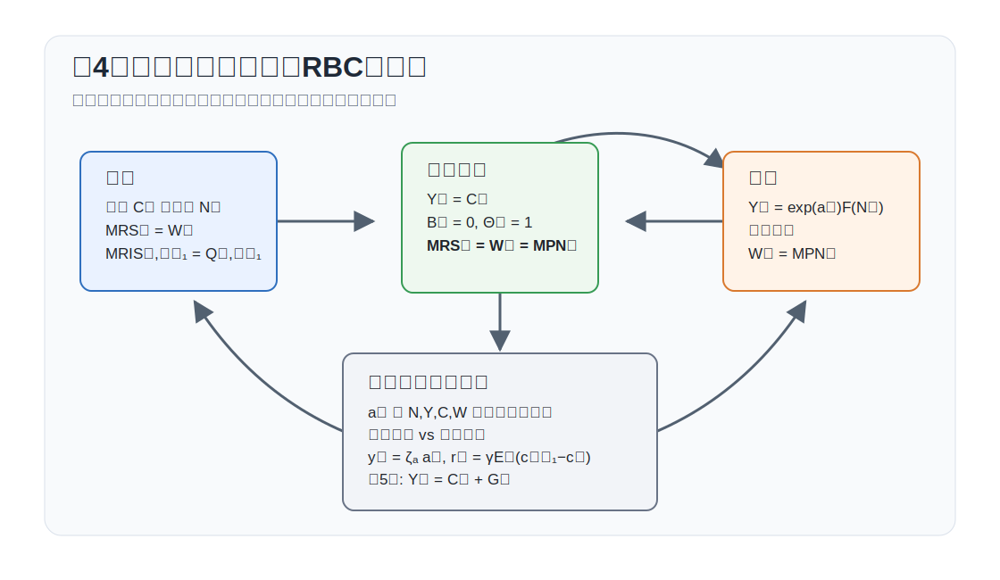

# 講義の目的

この回では、資本を導入しない最も単純な RBCモデルを扱います。目的は、家計と企業の最適化から均衡条件を導き、技術ショックが消費、産出、労働、賃金にどのように伝わるかを明示することです。

第8回の RANKモデルでは、独占的競争、価格硬直性、金融政策を導入します。その前に、資本も価格硬直性もない環境で、次の4点を確認します。

1. MRS、MRIS、MPN の意味を確認する。
2. 家計の労働供給条件と企業の労働需要条件を導く。
3. 資源制約と生産関数からなる静学的均衡を解く。
4. 技術ショックに対する対数線形近似解を求める。

この回では資本がないため、投資、資本蓄積、資本レンタル率は登場しません。時間をまたぐ意思決定は債券のオイラー方程式として残せますが、実物配分を決めるうえでは、労働と消費の静学的条件が中心になります。

{#fig-lecture04-overview width=95%}

# 表記

大文字は水準、小文字は定常状態からの対数乖離を表します。たとえば
$$
y_t \equiv \ln Y_t-\ln Y,
\qquad
c_t \equiv \ln C_t-\ln C,
\qquad
n_t \equiv \ln N_t-\ln N
$$
です。第8回と合わせて、労働投入は $N_t$、実質賃金は $W_t$、名目利子率は $R_t^N$、粗インフレ率は $\Pi_t=P_t/P_{t-1}$ と書きます。

主な水準変数は次の通りです。

| 記号 | 意味 |
|---|---|
| $C_t$ | 消費 |
| $N_t$ | 労働投入 |
| $Y_t$ | 産出 |
| $W_t$ | 実質賃金 |
| $B_t$ | 実質債券保有 |
| $\Theta_t$ | 企業持分保有 |
| $V_t$ | 株式価値または企業価値 |
| $D_t$ | 企業利潤または配当 |
| $A_t=\exp(a_t)$ | 技術水準 |
| $R_t$ | 実質利子率 |
| $R_t^N$ | 名目利子率 |
| $\Pi_t$ | 粗インフレ率 |
| $C,N,Y,W,A,R,R^N,\Pi$ | 対応する定常状態の水準 |

主な基礎パラメータは次の通りです。

| 記号 | 意味 |
|---|---|
| $\beta$ | 主観的割引因子 |
| $\gamma$ | 異時点間代替弾力性の逆数 |
| $\varphi$ | フリッシュ弾力性の逆数 |
| $0\leq\alpha<1$ | 生産関数の収穫逓減を表すパラメータ |
| $\nu$ | 労働不効用の水準を調整するパラメータ |
| $\rho_a$ | 技術ショックの持続性 |

本文中で使用する派生パラメータおよび変数は次の通りです。

| 記号 | 定義 | 意味 |
|---|---|---|
| $MRS_t$ | $-U_{N,t}/U_{C,t}$ | 消費で測った労働の限界不効用 |
| $MRIS_{t,t+1}$ | $\beta U_{C,t+1}/U_{C,t}$ | 消費選択で見る異時点間の限界代替率 |
| $Q_{t,t+1}$ | $MRIS_{t,t+1}$ | 資産価格で使う確率的割引因子（SDF） |
| $MRIS_{t,t+i}$ | $\beta^i U_{C,t+i}/U_{C,t}$ | $i$ 期先消費を今期消費で評価する割引率 |
| $Q_{t,t+i}$ | $MRIS_{t,t+i}$ | 資産価格で使う $i$ 期先までの SDF |
| $MPN_t$ | $A_tF_N(N_t)$ | 労働の限界生産物 |
| $EIS$ | $1/\gamma$ | 異時点間代替弾力性 |
| $\zeta_a$ | $(1+\varphi)/\{\varphi+\alpha+\gamma(1-\alpha)\}$ | 柔軟価格産出の技術ショックへの反応係数 |

代表的家計の限界効用は $U_{C,t}=U_C(C_t,N_t)$、労働の限界不効用は $-U_{N,t}$ と書きます。$MRIS_{t,t+1}$ と $Q_{t,t+1}$ は同じ割引率ですが、消費選択の直観を説明するときは $MRIS$、資産価格条件を書くときは $Q$ または SDF と呼びます。

特に重要なのは、$MRS$、$MRIS$、$MPN$ の3つです。第4回の均衡条件は、これらの限界概念で読むと整理しやすくなります。ここでは先に名前だけを確認し、家計と企業の一階条件を導いた後で、それぞれの意味を詳しく読み直します。

| 記号 | 名前 | このモデルでの意味 |
|---|---|---|
| $MRS_t$ | marginal rate of substitution | 消費で測った労働の限界不効用 |
| $MRIS_{t,t+1}$ | marginal rate of intertemporal substitution | 明日の消費を今日の消費で評価する割引率 |
| $MPN_t$ | marginal product of labor | 労働の限界生産物 |

# 均衡条件

**家計**

導出の考え方は、第3回で扱った逐次的なラグランジュ法と同じです。内点解を仮定し、予算制約にラグランジュ乗数を置いて、消費、労働、債券、企業持分について一階条件を取ります。そのうえで、消費の一階条件を使って乗数を限界効用で置き換えます。動的計画法で書く場合も同じオイラー方程式が得られますが、この回では価値関数を明示せず、一階条件だけを均衡条件として使います。

家計 $h$ は、消費、労働、債券、企業持分を選んで期待生涯効用を最大化します。
$$
\max_{\{C_t(h),N_t(h),B_t(h),\Theta_t(h)\}_{t=0}^{\infty}}
\mathbb{E}_0\sum_{t=0}^{\infty}\beta^t U(C_t(h),N_t(h))
$$
予算制約は実質表示で
$$
C_t(h)+B_t(h)+\Theta_t(h)V_t
=R_{t-1}B_{t-1}(h)+\Theta_{t-1}(h)(V_t+D_t)+W_tN_t(h)
$$
です。ここで $R_{t-1}$ は前期に購入した実質債券の今期総収益率です。第4回の本体では、この実質債券で資産条件を統一します。

家計 $h$ の限界効用を
$$
U_{C,t}(h)\equiv U_C(C_t(h),N_t(h)),
\qquad
U_{N,t}(h)\equiv U_N(C_t(h),N_t(h))
$$
と書き、家計 $h$ の割引率を
$$
Q_{t,t+1}(h)
\equiv
\beta\frac{U_{C,t+1}(h)}{U_{C,t}(h)}
$$
と定義します。内点解の一階条件は
$$
\begin{aligned}
W_t&=-\frac{U_{N,t}(h)}{U_{C,t}(h)},\\
1&=\mathbb{E}_t\left[Q_{t,t+1}(h)R_t\right],\\
V_t&=\mathbb{E}_t\left[Q_{t,t+1}(h)(V_{t+1}+D_{t+1})\right].
\end{aligned}
$$
です。第1式は労働供給条件、第2式は実質債券のオイラー方程式、第3式は株式価値の無裁定条件です。

対称均衡では、すべての家計が同じ選択を行うので、$C_t(h)=C_t$、$N_t(h)=N_t$、$Q_{t,t+1}(h)=Q_{t,t+1}$ です。したがって、上の条件は
$$
\begin{aligned}
W_t&=-\frac{U_{N,t}}{U_{C,t}},\\
1&=\mathbb{E}_t\left[Q_{t,t+1}R_t\right],\\
V_t&=\mathbb{E}_t\left[Q_{t,t+1}(V_{t+1}+D_{t+1})\right].
\end{aligned}
$$
と書けます。これらを限界概念でどう読むかは、集計均衡をまとめた後で読み直します。

名目債券を使う場合には、$t$ 期に購入した債券の来期実質総収益率は $R_t^N/\Pi_{t+1}$ です。この場合のオイラー方程式は
$$
1=\mathbb{E}_t\left[
Q_{t,t+1}\frac{R_t^N}{\Pi_{t+1}}
\right]
$$
となります。名目では無リスクでも、将来インフレ率が不確実なら実質収益率にはインフレリスクがあります。第7回以降で金融政策とインフレを明示するときに、この名目債券版を使います。

**企業**

完全競争企業 $j$ は、労働投入 $N_t(j)$ を選んで実質利潤
$$
D_t(j)=Y_t(j)-W_tN_t(j)
$$
を最大化します。ここでは第3回で扱った「将来配当の割引現在価値」を企業の目的関数として明示的には書いていません。理由は、この回の企業には資本蓄積、価格調整費用、将来に持ち越される価格などの状態変数がないためです。したがって、企業価値最大化は各期の配当 $D_t$ をその期ごとに最大化する問題に分解されます。

生産関数は
$$
Y_t(j)=A_tF(N_t(j))
$$
です。労働投入に関する一階条件は、対称均衡で評価すると
$$
W_t=A_tF_N(N_t)
$$
です。右辺は労働の限界生産物 $MPN_t$ です。完全競争では、実質賃金は $MPN_t$ に等しくなります。

**集計均衡**

この経済の対称均衡は、家計最適化、企業最適化、市場均衡から構成されます。対称均衡ではすべての家計と企業が同じ選択を行うので、
$$
C_t(h)=C_t,\qquad N_t(h)=N_t,\qquad
N_t(j)=N_t,\qquad Y_t(j)=Y_t
$$
です。債券市場は純供給ゼロなので
$$
B_t=0
$$
となり、企業持分は集計で $\Theta_t=1$ です。財市場の均衡は
$$
Y_t=C_t
$$
です。したがって、資本なし・政府なしの RBCモデルは次の4本にまとめられます。
$$
\begin{aligned}
W_t&=-\frac{U_{N,t}}{U_{C,t}},\\
W_t&=A_tF_N(N_t),\\
Y_t&=A_tF(N_t),\\
Y_t&=C_t.
\end{aligned}
$$
この体系では、技術ショック $A_t$ が与えられると、労働、産出、消費、賃金が同時点で決まります。

**限界概念で読む均衡条件**

ここまでの条件を、見取り図で示した $MRS$、$MRIS$、$MPN$ で読み直します。代表的家計の生涯効用を
$$
\mathcal{U}_0
=
\mathbb{E}_0
\sum_{t=0}^{\infty}\beta^t U(C_t,N_t)
$$
とします。ある実現経路に沿って限界効果を見ると、$C_t$ と $N_t$ に関する生涯効用の偏微分は
$$
\frac{\partial \mathcal{U}_0}{\partial C_t}
=\beta^t U_{C,t},
\qquad
\frac{\partial \mathcal{U}_0}{\partial N_t}
=\beta^t U_{N,t}
$$
です。したがって、労働と消費の静学的な限界代替率は
$$
MRS_t\equiv -\frac{U_{N,t}}{U_{C,t}}
$$
です。これは、$(C_t,N_t)$ 平面における無差別曲線の傾きです。労働 $N_t$ が増えると効用は下がるので、家計が同じ効用水準にとどまるには、どれだけ消費を補償される必要があるかを表します。家計の労働供給条件は
$$
W_t=MRS_t
$$
と書けます。実質賃金は、家計が追加的に1単位働くために必要な消費補償に等しくなります。

次に、今期消費 $C_t$ と来期消費 $C_{t+1}$ の無差別曲線を考えます。$C_t$ と $C_{t+1}$ 以外を固定すると、
$$
\frac{\partial \mathcal{U}_0}{\partial C_t}
=\beta^t U_{C,t},
\qquad
\frac{\partial \mathcal{U}_0}{\partial C_{t+1}}
=\beta^{t+1}U_{C,t+1}
$$
です。異時点間の限界代替率を、来期消費を今期消費で評価する現在価値の向きで定義します。
$$
MRIS_{t,t+1}
\equiv
\frac{\partial \mathcal{U}_0/\partial C_{t+1}}
{\partial \mathcal{U}_0/\partial C_t}
=
\beta\frac{U_{C,t+1}}{U_{C,t}}
=Q_{t,t+1}
$$
です。これは、明日1単位の消費を得る価値を今日の消費で測ったものです。消費選択の文脈ではこの量を $MRIS$ と呼びます。資産価格の文脈では、同じ量を $Q$ または確率的割引因子（SDF）と呼びます。したがって、第3回の資産価格条件は
$$
1=\mathbb{E}_t[Q_{t,t+1}R^j_{t+1}]
$$
と書けます。

文献によっては、今日の消費1単位をあきらめる代わりに明日の消費を何単位受け取りたいか、という向きで異時点間の限界代替率を定義することがあります。その場合は本ノートの $MRIS_{t,t+1}$ の逆数になります。ここでは $Q$ や SDF と同じ現在価値の向きにそろえます。実質債券のオイラー方程式は
$$
1=\mathbb{E}_t[Q_{t,t+1}R_t]
$$
と書けます。

$i$ 期先までの異時点間の限界代替率も同じ考え方で定義できます。
$$
MRIS_{t,t+i}
\equiv
\frac{\partial \mathcal{U}_0/\partial C_{t+i}}
{\partial \mathcal{U}_0/\partial C_t}
=
\beta^i
\frac{U_{C,t+i}}{U_{C,t}}
=
Q_{t,t+i}
=
\prod_{j=1}^{i} Q_{t+j-1,t+j}
$$
消費選択では左辺の $MRIS$、資産価格では同じ量を $Q$ と読むとよいでしょう。たとえば株式価値は
$$
V_t
=
\mathbb{E}_t
\sum_{i=1}^{\infty}
Q_{t,t+i}D_{t+i}
$$
と書けます。

企業側では、労働の限界生産物を
$$
MPN_t\equiv A_tF_N(N_t)
$$
と書きます。完全競争のもとでは
$$
W_t=MPN_t
$$
です。家計の労働供給条件と企業の労働需要条件を合わせると
$$
-\frac{U_{N,t}}{U_{C,t}}=A_tF_N(N_t)
$$
を得ます。この式が、資本なし RBCモデルの中心です。左辺は労働供給側の $MRS_t$、右辺は労働需要側の $MPN_t$ です。
$$
MRS_t=W_t=MPN_t
$$
つまり、家計側の労働供給と企業側の労働需要が、実質賃金を通じて一致します。

この回の実物配分では、債券と株式は均衡価格の決定には重要ですが、資本がないため生産能力を変える状態変数にはなりません。したがって、まずは労働供給条件と企業の労働需要条件から $N_t$ を決め、そこから $Y_t$ と $C_t$ を決めます。

# 関数形の特定

効用関数と生産関数を次のように特定します。
$$
U(C_t,N_t)=\frac{C_t^{1-\gamma}}{1-\gamma}
-\nu\frac{N_t^{1+\varphi}}{1+\varphi},
\qquad
Y_t=A_tN_t^{1-\alpha}
$$
ただし $\gamma>0$、$\varphi>0$、$0\leq \alpha<1$、$\nu>0$ です。上の MRS・MRIS の定義をこの関数形に当てはめると、$\gamma$ は異時点間代替弾力性 EIS の逆数、$\varphi$ は Frisch 労働供給弾力性の逆数です。$\nu$ は労働不効用の水準を調整します。

この関数形のもとでは
$$
U_{C,t}=C_t^{-\gamma},
\qquad
U_{N,t}=-\nu N_t^{\varphi},
\qquad
A_tF_N(N_t)=(1-\alpha)A_tN_t^{-\alpha}
$$
です。したがって
$$
MRS_t
=
\nu N_t^{\varphi}C_t^\gamma,
\qquad
MRIS_{t,t+1}
=
\beta
\left(\frac{C_{t+1}}{C_t}\right)^{-\gamma}
$$
となります。

EIS は、実質利子率や異時点間価格が変わったとき、家計が消費を今日と将来の間でどれだけ移すかを表します。この関数形では
$$
EIS
\equiv
-\frac{d\ln(C_{t+1}/C_t)}
{d\ln MRIS_{t,t+1}}
=
\frac{1}{\gamma}
$$
です。$MRIS_{t,t+1}$ は来期消費の割引現在価値なので、$MRIS_{t,t+1}$ が低いほど来期消費が相対的に安く、家計は消費を来期へ移しやすくなります。実質総利子率を $R_t$ と書き、不確実性を無視して考えると、オイラー方程式は $1=MRIS_{t,t+1}R_t$、すなわち $MRIS_{t,t+1}=1/R_t$ と読めるので、
$$
\frac{d\ln(C_{t+1}/C_t)}{d\ln R_t}
=
EIS
=
\frac{1}{\gamma}
$$
です。$\gamma$ が大きいほど EIS は小さく、家計は消費を平準化しようとします。$\gamma$ が小さいほど EIS は大きく、家計は異時点間価格の変化に応じて消費時点を大きく動かします。

均衡労働は
$$
\nu N_t^{\varphi}C_t^\gamma=(1-\alpha)A_tN_t^{-\alpha}
$$
を満たします。さらに $C_t=Y_t=A_tN_t^{1-\alpha}$ を代入すると
$$
N_t=
\left[
\frac{1-\alpha}{\nu}A_t^{1-\gamma}
\right]^{\frac{1}{\varphi+\alpha+\gamma(1-\alpha)}}
$$
です。技術水準が上がると、実質賃金が上がり、労働供給は代替効果と所得効果の差によって変化します。

Frisch 弾力性は、消費の限界効用を一定に保ったときの労働供給の賃金弾力性です。労働供給条件
$$
W_t=\nu N_t^\varphi C_t^\gamma
$$
で $U_{C,t}=C_t^{-\gamma}$ を一定に保つと、$C_t$ も一定なので
$$
\frac{d\ln N_t}{d\ln W_t}\bigg|_{U_C}
=\frac{1}{\varphi}
$$
です。したがって $\varphi$ が大きいほど、労働供給は賃金に対して動きにくくなります。

# 定常状態

対数線形化の前に、水準の定常状態を確認します。技術の定常状態を
$$
A=1
$$
と正規化します。定常状態では $C_t=C$、$N_t=N$、$Y_t=Y$、$W_t=W$ であり、資源制約と生産関数から
$$
C=Y=N^{1-\alpha}
$$
です。労働需要と労働供給は
$$
W=(1-\alpha)N^{-\alpha},
\qquad
W=\nu N^\varphi C^\gamma
$$
なので、$C=N^{1-\alpha}$ を代入すると
$$
\nu N^{\varphi+\alpha+\gamma(1-\alpha)}=1-\alpha
$$
を得ます。したがって
$$
N=
\left(\frac{1-\alpha}{\nu}\right)^{1/\{\varphi+\alpha+\gamma(1-\alpha)\}},
\qquad
Y=C=N^{1-\alpha},
\qquad
W=(1-\alpha)N^{-\alpha},
$$
です。

この定常状態から分かるように、現在の生産関数 $Y_t=A_tN_t^{1-\alpha}$ の正規化では、$\nu=1$ としても一般には $N=Y=C=W=1$ にはなりません。$\nu=1$ のときは
$$
N=(1-\alpha)^{1/\{\varphi+\alpha+\gamma(1-\alpha)\}},
\qquad
Y=C=N^{1-\alpha}
$$
です。たとえば $\alpha>0$ なら $1-\alpha<1$ なので、通常 $N$ は1より小さくなります。

例外は $\alpha=0$ の場合です。このとき生産関数は
$$
Y_t=A_tN_t
$$
となり、$A=1$、$\nu=1$ のもとで
$$
N=1,
\qquad
Y=C=1,
\qquad
W=1
$$
が成り立ちます。したがって、$\nu=1$ で水準が1にそろうという直観は、$\alpha=0$、つまり労働の限界生産物が1に正規化されている線形生産の場合には正しいです。

もし $A=1$ のもとで $N=Y=C=1$ と正規化したいなら、必要なのは
$$
\nu=1-\alpha
$$
です。このとき $W=1-\alpha$ です。さらに $W=1$ まで同時に正規化したいなら、現在の生産関数の係数も変更する必要があります。つまり「すべての水準を1にする」ことは、$\nu$ だけでなく生産関数の正規化にも依存します。

異時点間条件については、定常状態では $C_{t+1}=C_t$ なので
$$
MRIS=\beta.
$$
実質総利子率を $R$ と書くと、オイラー方程式 $1=MRIS\cdot R$ から
$$
R=\frac{1}{\beta}
$$
です。インフレ率の定常状態を $\Pi=1$ と置けば、粗名目利子率の定常状態も $R^N=1/\beta$ になります。

この後に使う小文字の $a_t,y_t,c_t,n_t,w_t$ は定常状態からの対数乖離なので、定常状態ではすべて0です。これは水準の $A,Y,C,N,W$ がすべて1であるという意味ではありません。

# 対数線形近似と利子率

定常状態の周りで対数線形化します。小文字は対数乖離を表します。関数形のもとで、均衡条件は
$$
\begin{aligned}
y_t&=a_t+(1-\alpha)n_t,\\
c_t&=y_t,\\
w_t&=a_t-\alpha n_t,\\
w_t&=\gamma c_t+\varphi n_t
\end{aligned}
$$
となります。最後の式は $W_t=\nu N_t^\varphi C_t^\gamma$ を対数線形化したものです。

ここで
$$
\zeta_a\equiv\frac{1+\varphi}{\varphi+\alpha+\gamma(1-\alpha)}
$$
とおくと、この4本の解は
$$
\begin{aligned}
y_t&=\zeta_a a_t,\\
n_t&=\frac{\zeta_a-1}{1-\alpha}a_t,\\
c_t&=y_t,\\
w_t&=\frac{1-\alpha\zeta_a}{1-\alpha}a_t.
\end{aligned}
$$
この分母 $\varphi+\alpha+\gamma(1-\alpha)>0$ は、労働供給の傾き、労働需要の傾き、消費平準化の強さをまとめたものです。この回の柔軟価格産出 $y_t=\zeta_a a_t$ は、第8回で使う自然産出量の技術ショック係数の、政府支出なしの特殊ケースです。

この解から、正の技術ショック $a_t>0$ は、産出 $y_t$、消費 $c_t$、実質賃金 $w_t$ を増やすことが分かります。実際、
$$
\zeta_a>0,
\qquad
\frac{1-\alpha\zeta_a}{1-\alpha}
=
\frac{\varphi+\gamma}{\varphi+\alpha+\gamma(1-\alpha)}>0
$$
です。$c_t=y_t$ なので、消費も産出と同じ方向に動きます。

一方、労働 $n_t$ の反応は $\gamma$ に依存します。

- $\gamma<1$ のとき、技術上昇は労働を増やします。代替効果が所得効果を上回るためです。
- $\gamma=1$ のとき、労働は技術ショックに反応しません。所得効果と代替効果が相殺されます。
- $\gamma>1$ のとき、技術上昇は労働を減らします。消費変動を避けたい家計が余暇を増やすためです。

**利子率と古典派の二分法**

この回の資本なし RBCモデルでは、実物配分 $n_t,y_t,c_t,w_t$ は、労働供給、労働需要、生産関数、資源制約から先に決まります。オイラー方程式は、この実物配分を決める式ではありません。むしろ、すでに決まった消費経路 $c_t$ と整合する実質利子率を後から決める条件です。

実質総利子率を $R_t$ と書くと、実質債券のオイラー方程式は
$$
1
=
\mathbb{E}_t
\left[
\beta
\left(\frac{C_{t+1}}{C_t}\right)^{-\gamma}
R_t
\right]
$$
です。$R_t$ が時点 $t$ で決まるリスクなし実質利子率なら、
$$
R_t
=
\left\{
\mathbb{E}_t
\left[
\beta
\left(\frac{C_{t+1}}{C_t}\right)^{-\gamma}
\right]
\right\}^{-1}
$$
です。したがって、実質利子率は消費成長率の期待によって決まります。定常状態からの対数乖離を $r_t$ と書くと、一次近似では
$$
r_t
=
\gamma\mathbb{E}_t(c_{t+1}-c_t)
$$
です。

このモデルでは
$$
c_t
=
\zeta_a a_t
$$
なので、技術ショックが $a_{t+1}=\rho_a a_t+e_{t+1}^a$ に従うなら、
$$
r_t
=
\gamma
\zeta_a
(\rho_a-1)a_t
$$
です。正の技術ショックが一時的で、$0\leq\rho_a<1$ なら、現在の消費が将来の消費より相対的に高くなるため、自然な実質利子率は低下します。

ここには古典派の二分法があります。実物側では、技術、選好、生産関数が $n_t,y_t,c_t,w_t$ と、それに整合する実質利子率 $r_t$ を決めます。一方、名目利子率 $R_t^N$、インフレ率 $\Pi_{t+1}$、物価水準は、この実物ブロックだけでは別々には決まりません。名目債券のオイラー方程式は
$$
1
=
\mathbb{E}_t
\left[
Q_{t,t+1}
\frac{R_t^N}{\Pi_{t+1}}
\right]
$$
なので、重要なのは名目利子率そのものではなく、期待インフレ率で割り引いた実質収益率 $R_t^N/\Pi_{t+1}$ です。

実際の名目利子率がどう決まるかは、金融政策ルールやインフレ率の決まり方を導入してから扱います。価格が柔軟な経済では、名目変数が調整して実際の実質利子率がここで得た実質利子率に一致します。第7回以降では、この実質利子率を自然利子率、ここで得た産出を自然産出量または潜在生産量として使います。価格硬直性があると、金融政策が決める実際の実質利子率が自然利子率からずれ、そのずれが需給ギャップを生みます。

# 技術ショックと第5回への接続

技術水準は次の AR(1) 過程に従うとします。
$$
a_t=\rho_a a_{t-1}+e_t^a,
\qquad
0\leq \rho_a<1
$$
このとき、モデルの状態変数は $a_{t-1}$ です。ショック $e_t^a$ が発生すると、その影響は $a_t$ を通じて同時点の $n_t,y_t,c_t,w_t$ に伝わり、持続性 $\rho_a$ に応じて将来へ残ります。

数値例として、$\alpha=0.4$、$\varphi=1$ とします。このとき、$y_t$ の技術ショックに対する弾性は
$$
\frac{1+\varphi}{\varphi+\alpha+\gamma(1-\alpha)}
$$
です。$\gamma=1$ なら弾性は $1$、$\gamma=2$ なら $2/(1+0.4+1.2)=0.769$、$\gamma=0.5$ なら $2/(1+0.4+0.3)=1.176$ です。異時点間の代替弾力性が高いほど、技術ショックに対する産出の反応は大きくなります。

**第5回への接続**

この回では、資源制約は $Y_t=C_t$ でした。第5回では政府支出 $G_t$ を導入し、
$$
Y_t=C_t+G_t
$$
に変更します。資本は引き続き導入しないため、政府支出は投資をクラウドアウトするのではなく、同じ期の消費と労働を通じて実物配分に影響します。

# 演習問題

**問1：概念確認**

資本なしRBCモデルで、$MRS_t=W_t=MPN_t$ が何を意味するかを、家計側と企業側の両方から説明しなさい。

**問2：導出確認**

効用関数 $U(C_t,N_t)=C_t^{1-\gamma}/(1-\gamma)-\nu N_t^{1+\varphi}/(1+\varphi)$、生産関数 $Y_t=A_tN_t^{1-\alpha}$、資源制約 $Y_t=C_t$ から、均衡労働 $N_t$ の式を導出しなさい。

**問3：直観確認**

正の技術ショックが起きたとき、産出、消費、実質賃金はどう動くか説明しなさい。労働の反応が $\gamma$ に依存する理由も述べなさい。
