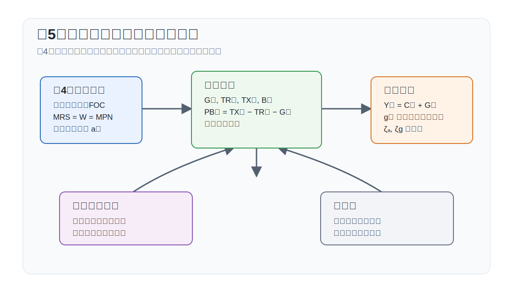

# 講義の目的

この回では、第4回の資本なし RBCモデルに政府部門を導入します。資本は引き続き導入せず、政府支出、一括税、移転、政府債務を加えたモデルとして整理します。

目的は次の4点です。

1. 政府予算制約とプライマリーバランスを理解する。
2. 一括税と政府支出が資源配分へ与える効果を区別する。
3. 政府支出ショックを含む資本なし RBCモデルを対数線形化する。
4. 労働所得税だけを用いてラッファーカーブを導出する。

{#fig-lecture05-overview width=95%}

# 表記

大文字は水準、小文字は定常状態からの対数乖離を表します。ただし政府支出ショックは
$$
g_t\equiv \frac{G_t-G}{Y}
$$
と定義します。

主な水準変数は次の通りです。

| 記号 | 意味 |
|---|---|
| $C_t$ | 民間消費 |
| $N_t$ | 労働投入 |
| $Y_t$ | 産出 |
| $G_t$ | 政府支出 |
| $W_t$ | 実質賃金 |
| $B_t(h)$ | 家計 $h$ の債券保有 |
| $B_t$ | 政府債務 |
| $\Theta_t(h)$ | 家計 $h$ の企業持分保有 |
| $V_t$ | 株式価値または企業価値 |
| $D_t$ | 企業利潤または配当 |
| $TX_t$ | 税収 |
| $TR_t$ | 一括移転 |
| $PB_t$ | プライマリーバランス |
| $R_t^N$ | 粗名目利子率 |
| $\Pi_t$ | 粗インフレ率 |
| $A_t=\exp(a_t)$ | 技術水準 |
| $C,N,Y,G,W,A$ | 対応する定常状態の水準 |

主な基礎パラメータは次の通りです。

| 記号 | 意味 |
|---|---|
| $\beta$ | 主観的割引因子 |
| $\gamma$ | 異時点間代替弾力性の逆数 |
| $\varphi$ | フリッシュ弾力性の逆数 |
| $0\leq\alpha<1$ | 生産関数の収穫逓減を表すパラメータ |
| $\nu$ | 労働不効用の水準を調整するパラメータ |
| $G_Y=G/Y$ | 定常状態の政府支出比率 |
| $\rho_a,\rho_g$ | 技術ショック、政府支出ショックの持続性 |
| $\tau_N,\tau^C$ | 労働所得税率、消費税率 |

本文中で使用する派生パラメータおよび変数は次の通りです。

| 記号 | 定義 | 意味 |
|---|---|---|
| $g_t$ | $(G_t-G)/Y$ | 定常状態の産出で測った政府支出ショック |
| $Q_{t,t+i}$ | $t$ 期から $t+i$ 期までの確率的割引因子（SDF） | 将来のプライマリーバランスを現在価値に直す割引係数 |
| $\zeta_a$ | $(1-G_Y)(1+\varphi)/\{(1-G_Y)(\alpha+\varphi)+\gamma(1-\alpha)\}$ | 柔軟価格産出の技術ショックへの反応係数 |
| $\zeta_g$ | $\gamma(1-\alpha)/\{(1-G_Y)(\alpha+\varphi)+\gamma(1-\alpha)\}$ | 柔軟価格産出の政府支出ショックへの反応係数 |
| $\vartheta$ | $(1-\alpha)/\{\varphi+\alpha+\gamma(1-\alpha)\}$ | 労働所得税ラッファーカーブの弾性 |
| $\mathcal{A}$ | 本文の定義式 | ラッファーカーブの水準係数 |

# 政府予算制約

政府は政府購入 $G_t$、移転 $TR_t$、税収 $TX_t$、国債 $B_t$ を用います。名目国債を実質化して書くと、政府予算制約は
$$
G_t+TR_t+\frac{R_{t-1}^N}{\Pi_t}B_{t-1}
=TX_t+B_t
$$
です。左辺は政府支出と既存国債の実質償還額、右辺は税収と新規国債発行です。

プライマリーバランスを
$$
PB_t\equiv TX_t-TR_t-G_t
$$
と定義すると、政府予算制約は
$$
B_t=\frac{R_{t-1}^N}{\Pi_t}B_{t-1}-PB_t
$$
と書けます。国債が増えるのは、利払い込みの既存債務が大きいか、プライマリーバランスが赤字のときです。

家計のオイラー方程式から
$$
1=\mathbb{E}_t\left[Q_{t,t+1}\frac{R_t^N}{\Pi_{t+1}}\right]
$$
が成り立ちます。この割引ファクターを使って政府予算制約を前向きに解くと
$$
B_t=
\mathbb{E}_t\sum_{i=1}^{\infty}Q_{t,t+i}PB_{t+i}
$$
となります。ただし $Q_{t,t+i}$ は $t$ 期から $t+i$ 期までの確率的割引因子（SDF）であり、横断性条件
$$
\lim_{i\to\infty}\mathbb{E}_t\left[Q_{t,t+i}B_{t+i}\right]=0
$$
を仮定しています。この式は、現在の政府債務が将来のプライマリーバランスの確率的割引現在価値に等しいことを表します。

一括税と一括移転だけが変わる場合、家計の生涯予算制約は変わりますが、相対価格や限界条件は変わりません。したがって、国債発行で政府支出を先送りしても、将来の一括税が調整されるなら、実物配分は変わりません。これがバロー・リカードの中立性です。

# 家計・企業・均衡

## 家計

家計の個別最適化は第4回と同じです。この回で加わるのは、一括税 $TX_t$ と一括移転 $TR_t$ です。家計 $h$ の予算制約は
$$
C_t(h)+B_t(h)+\Theta_t(h)V_t+TX_t
=R_{t-1}^N\frac{P_{t-1}}{P_t}B_{t-1}(h)
+\Theta_{t-1}(h)(V_t+D_t)+W_tN_t(h)+TR_t
$$
です。ここでは $TX_t$ と $TR_t$ は家計に一律に課される一括税・一括移転です。

対称均衡で評価した一階条件は第4回と同じです。
$$
\begin{aligned}
W_t&=-\frac{U_{N,t}}{U_{C,t}},\\
1&=\mathbb{E}_t\left[Q_{t,t+1}\frac{R_t^N}{\Pi_{t+1}}\right],\\
V_t&=\mathbb{E}_t\left[Q_{t,t+1}(V_{t+1}+D_{t+1})\right].
\end{aligned}
$$
一括税と一括移転は限界条件に現れません。このため、資源配分への直接の効果は政府購入 $G_t$ を通じて生じます。

## 企業

企業の最適化も第4回と同じです。完全競争企業は各期の実質利潤
$$
D_t=Y_t-W_tN_t
$$
を最大化します。生産関数
$$
Y_t=\exp(a_t)F(N_t)
$$
のもとで、労働の一階条件は
$$
W_t=\exp(a_t)F_N(N_t)
$$
です。したがって、家計の労働供給条件と合わせると
$$
-\frac{U_{N,t}}{U_{C,t}}=\exp(a_t)F_N(N_t)
$$
を得ます。

## 政府支出を含む均衡

政府支出が実物資源を吸収するため、財市場の均衡は
$$
Y_t=C_t+G_t
$$
です。定常状態の政府支出比率を
$$
G_Y\equiv \frac{G}{Y}
$$
とし、政府支出ショックを
$$
g_t\equiv \frac{G_t-G}{Y}
$$
と定義します。ここで分母の $Y$ は定常状態の産出です。政府支出ショックは次の AR(1) 過程に従うとします。
$$
g_t=\rho_g g_{t-1}+e_t^g
$$

均衡条件は次の5本にまとめられます。
$$
\begin{aligned}
W_t&=-\frac{U_{N,t}}{U_{C,t}},\\
W_t&=\exp(a_t)F_N(N_t),\\
Y_t&=\exp(a_t)F(N_t),\\
Y_t&=C_t+G_t,\\
g_t&=\frac{G_t-G}{Y}.
\end{aligned}
$$
一括税で政府支出をファイナンスする場合でも、国債で一時的にファイナンスする場合でも、政府支出 $G_t$ の経路が同じなら、実物配分は同じです。

# 関数形と定常状態

効用関数と生産関数を
$$
U(C_t,N_t)=\frac{C_t^{1-\gamma}}{1-\gamma}
-\nu\frac{N_t^{1+\varphi}}{1+\varphi},
\qquad
Y_t=\exp(a_t)N_t^{1-\alpha}
$$
とします。このとき、均衡労働は
$$
\nu N_t^\varphi C_t^\gamma=(1-\alpha)\exp(a_t)N_t^{-\alpha}
$$
を満たします。政府支出が増えると、同じ $Y_t$ の下で民間消費 $C_t$ が低下します。消費の限界効用が上昇するため、家計はより多く働く方向に動きます。この効果は資本なしモデルでは投資のクラウドアウトではなく、消費と労働の静学的調整として現れます。

## 定常状態と第4回との比較

定常状態で $a_t=a$、$G_t=G$ とします。政府支出を水準 $G$ として外生的に置くと、定常状態の労働は
$$
\nu N^\varphi\left(\exp(a)N^{1-\alpha}-G\right)^\gamma
=(1-\alpha)\exp(a)N^{-\alpha}
$$
を満たします。この式は一般の $\gamma$ と $\alpha$ では閉形式で解きにくく、数値的に解くのが自然です。

一方、講義ノートのように定常状態の政府支出比率
$$
G_Y\equiv \frac{G}{Y}
$$
を所与にすれば、$C=(1-G_Y)Y$ なので解析的に解けます。これは定常値を決めるための比率であり、各期に $G_t/Y_t$ を固定するという意味ではありません。

第4回と同じ分母 $\varphi+\alpha+\gamma(1-\alpha)$ を用いると、政府支出を含む定常状態は
$$
\begin{aligned}
N^G
&=
\left[
\frac{1-\alpha}{\nu}
(1-G_Y)^{-\gamma}
\exp\{(1-\gamma)a\}
\right]^{1/\{\varphi+\alpha+\gamma(1-\alpha)\}},\\
Y^G
&=\exp(a)(N^G)^{1-\alpha},\\
C^G
&=(1-G_Y)Y^G,\\
W^G
&=(1-\alpha)\exp(a)(N^G)^{-\alpha}.
\end{aligned}
$$

第4回の政府なし定常状態を上付き $0$ で表すと、
$$
N^0=
\left[
\frac{1-\alpha}{\nu}
\exp\{(1-\gamma)a\}
\right]^{1/\{\varphi+\alpha+\gamma(1-\alpha)\}},
\qquad
Y^0=C^0=\exp(a)(N^0)^{1-\alpha}
$$
です。したがって、政府支出を導入した定常状態は第4回と比べて
$$
\begin{aligned}
\frac{N^G}{N^0}
&=(1-G_Y)^{-\gamma/\{\varphi+\alpha+\gamma(1-\alpha)\}}>1,\\
\frac{Y^G}{Y^0}
&=(1-G_Y)^{-\gamma(1-\alpha)/\{\varphi+\alpha+\gamma(1-\alpha)\}}>1,\\
\frac{C^G}{C^0}
&=(1-G_Y)^{(\varphi+\alpha)/\{\varphi+\alpha+\gamma(1-\alpha)\}}<1,\\
\frac{W^G}{W^0}
&=(1-G_Y)^{\alpha\gamma/\{\varphi+\alpha+\gamma(1-\alpha)\}}<1.
\end{aligned}
$$
政府支出は財を吸収するため、民間消費を押し下げます。消費の限界効用が上がるので労働供給は増え、産出も増えます。ただし労働投入が増えるため、限界生産物としての実質賃金は低下します。

# 対数線形近似

政府支出ショック $g_t=(G_t-G)/Y$ を用いると、財市場の対数線形近似は
$$
y_t=(1-G_Y)c_t+g_t
$$
です。その他の条件は
$$
\begin{aligned}
y_t&=a_t+(1-\alpha)n_t,\\
w_t&=a_t-\alpha n_t,\\
w_t&=\gamma c_t+\varphi n_t,\\
a_t&=\rho_a a_{t-1}+e_t^a,\\
g_t&=\rho_g g_{t-1}+e_t^g.
\end{aligned}
$$
この5本が、政府支出を含む資本なし RBCモデルの対数線形体系です。

政府支出ショックの効果を明示するため、上の式を解きます。まず財市場から
$$
c_t=\frac{y_t-g_t}{1-G_Y}
$$
です。これを労働供給条件に代入し、企業側の条件と合わせると
$$
a_t-\alpha n_t
=\gamma\frac{a_t+(1-\alpha)n_t-g_t}{1-G_Y}
+\varphi n_t
$$
です。したがって
$$
n_t=
\frac{(1-G_Y-\gamma)a_t+\gamma g_t}
{(1-G_Y)(\alpha+\varphi)+\gamma(1-\alpha)}
$$
を得ます。

第8回の表記に合わせて
$$
\zeta_a\equiv
\frac{(1-G_Y)(1+\varphi)}
{(1-G_Y)(\alpha+\varphi)+\gamma(1-\alpha)},
\qquad
\zeta_g\equiv
\frac{\gamma(1-\alpha)}
{(1-G_Y)(\alpha+\varphi)+\gamma(1-\alpha)}
$$
と定義すると、産出は
$$
y_t=\zeta_a a_t+\zeta_g g_t
$$
と書けます。この式は第8回の自然産出量
$y_t^f=\zeta_a a_t+\zeta_g g_t$ と同じ形です。政府支出を含む柔軟価格 RBCモデルでは、ここで求めた産出がそのまま自然産出量になります。

他の変数は、産出の式を生産関数と資源制約に戻せば得られます。生産関数から
$$
n_t=\frac{y_t-a_t}{1-\alpha},
\qquad
w_t=a_t-\alpha n_t
$$
であり、資源制約から
$$
c_t=\frac{y_t-g_t}{1-G_Y}
$$
です。したがって
$$
\begin{aligned}
y_t&=\zeta_a a_t+\zeta_g g_t,\\
n_t&=\frac{\zeta_a-1}{1-\alpha}a_t
+\frac{\zeta_g}{1-\alpha}g_t,\\
c_t&=\frac{\zeta_a}{1-G_Y}a_t
+\frac{\zeta_g-1}{1-G_Y}g_t,\\
w_t&=\frac{1-\alpha\zeta_a}{1-\alpha}a_t
-\frac{\alpha\zeta_g}{1-\alpha}g_t.
\end{aligned}
$$

第4回の政府なしモデルでは
$$
\zeta_a'
\equiv
\frac{1+\varphi}{\varphi+\alpha+\gamma(1-\alpha)}
$$
とおけば
$$
\begin{aligned}
y_t&=\zeta_a' a_t,\\
n_t&=\frac{\zeta_a'-1}{1-\alpha}a_t,\\
c_t&=y_t,\\
w_t&=\frac{1-\alpha\zeta_a'}{1-\alpha}a_t.
\end{aligned}
$$
ここでの $\zeta_a'$ は第4回の政府なし係数であり、この第5回で定義した政府支出込みの $\zeta_a$ とは区別します。上の政府支出モデルで $G_Y=0$ かつ $g_t=0$ とおけば、第5回の $\zeta_a$ は $\zeta_a'$ に一致し、第4回の式に戻ります。

違いは財市場の近似式にあります。第4回では $c_t=y_t$ でしたが、政府支出を入れると
$$
y_t=(1-G_Y)c_t+g_t
$$
となります。したがって、政府支出ショック $e_t^g>0$ は、労働と産出を増やす一方で、民間消費と実質賃金を下げます。直観的には、政府が財を吸収すると民間消費が減り、消費の限界効用が上昇します。その結果、家計はより多く働きます。

技術ショックに対する反応も、第4回と完全には同じではありません。$g_t=0$ の技術ショックでは政府支出の水準は同時点で動かないため、追加的な産出は民間消費に強く反映されます。たとえば $\gamma=1$ なら第4回では $n_t=0$ ですが、政府支出モデルでは
$$
n_t=-\frac{G_Y}{(1-G_Y)(\alpha+\varphi)+(1-\alpha)}a_t
$$
となり、正の技術ショックに対して労働は低下します。これは、政府支出の定常比率を用いて定常状態を置いていても、短期の $G_t$ は独立した外生過程として扱っているためです。

# 補論：税制とラッファーカーブ

## 一括税と比例税

資本なしモデルで比例税を入れるなら、資本所得税ではなく労働所得税や消費税を考えるのが自然です。

労働所得税率 $\tau_N$ を導入すると、家計が受け取る税引後実質賃金は $(1-\tau_N)W_t$ です。ここでは税率を時間で変動する変数ではなく、所与の政策パラメータとして扱います。労働供給条件は
$$
(1-\tau_N)W_t=-\frac{U_{N,t}}{U_{C,t}}
$$
に変わります。企業の労働需要条件 $W_t=\exp(a_t)F_N(N_t)$ は変わらないため、労働所得税は労働供給と労働需要の間にくさびを作ります。

消費税率 $\tau^C$ を導入すると、予算制約上の消費価格が $1+\tau^C$ 倍になります。これも所与の政策パラメータとして扱います。労働供給条件は
$$
\frac{1-\tau_N}{1+\tau^C}W_t=-\frac{U_{N,t}}{U_{C,t}}
$$
となります。資本なしモデルでは、消費税と労働所得税は静学的な労働供給のくさびとして似た役割を持ちます。

## 労働所得税だけのラッファーカーブ

ここでは消費税を置かず、労働所得税率 $\tau_N$ だけを考えます。$\tau_N$ は均衡内で決まる変数ではなく、政府が選ぶ政策パラメータです。定常状態の政府予算制約は
$$
G+TR=TX
$$
です。ラッファーカーブでは労働所得税による税収と課税ベースの関係だけを見るため、政府購入はゼロ、
$$
G=0
$$
とします。したがって税収は一括移転として家計に戻され、
$$
TR=TX=\tau_N WN
$$
です。

この仮定のもとでは、税は労働供給条件にくさびを作りますが、政府購入として実物資源を吸収しないため、資源制約は
$$
C=Y
$$
です。定常状態で時間添字を省略し、生産関数を
$$
Y=\exp(a)N^{1-\alpha}
$$
とします。企業の労働需要条件は
$$
W=(1-\alpha)\exp(a)N^{-\alpha}
$$
です。労働所得税があると、家計の労働供給条件は
$$
(1-\tau_N)W=\nu N^\varphi C^\gamma
$$
となります。資源制約 $C=Y=\exp(a)N^{1-\alpha}$ と企業の労働需要条件を代入すると
$$
(1-\tau_N)(1-\alpha)\exp(a)N^{-\alpha}
=\nu N^\varphi\left(\exp(a)N^{1-\alpha}\right)^\gamma
$$
です。したがって
$$
N(\tau_N)
=
\left[
\frac{(1-\tau_N)(1-\alpha)}{\nu}
\exp\{(1-\gamma)a\}
\right]^{\frac{1}{\varphi+\alpha+\gamma(1-\alpha)}}
$$
を得ます。ここで分母 $\varphi+\alpha+\gamma(1-\alpha)$ は正です。労働所得税率が上がると、税引後実質賃金が下がるため、均衡労働は低下します。

労働所得税収は
$$
TX(\tau_N)=\tau_N W(\tau_N)N(\tau_N)
$$
です。企業の一階条件から $WN=(1-\alpha)Y$ なので、
$$
TX(\tau_N)
=
\tau_N(1-\alpha)\exp(a)N(\tau_N)^{1-\alpha}
$$
となります。上で求めた $N(\tau_N)$ を代入すると
$$
TX(\tau_N)
=
\mathcal{A}\,
\tau_N(1-\tau_N)^\vartheta,
\qquad
\vartheta\equiv
\frac{1-\alpha}{\varphi+\alpha+\gamma(1-\alpha)}>0
$$
です。ただし
$$
\mathcal{A}
\equiv
(1-\alpha)\exp(a)
\left[
\frac{1-\alpha}{\nu}\exp\{(1-\gamma)a\}
\right]^\vartheta
$$
は税率に依存しない正の定数です。

この式が労働所得税だけのラッファーカーブです。税率がゼロなら税収はゼロです。一方、$\tau_N\to 1$ では税引後賃金がゼロに近づき、労働供給が消えるため、税収もゼロに近づきます。内点の最大税収率は一階条件
$$
\frac{d\ln TX(\tau_N)}{d\tau_N}
=
\frac{1}{\tau_N}-\frac{\vartheta}{1-\tau_N}=0
$$
から
$$
\tau_N^*
=
\frac{1}{1+\vartheta}
=
\frac{\varphi+\alpha+\gamma(1-\alpha)}
{\varphi+\alpha+\gamma(1-\alpha)+1-\alpha}
$$
です。したがって
$$
\frac{d TX}{d\tau_N}>0
\quad
(\tau_N<\tau_N^*),
\qquad
\frac{d TX}{d\tau_N}<0
\quad
(\tau_N>\tau_N^*)
$$
労働所得税率が低い範囲では、税率引き上げの直接効果が税収を増やします。税率が高い範囲では、労働供給と課税ベースの縮小効果が直接効果を上回り、税収は減少します。

例として、$\alpha=0.4$、$\gamma=1$、$\varphi=1$ とすると
$$
\varphi+\alpha+\gamma(1-\alpha)=1+0.4+1(1-0.4)=2,
\qquad
\vartheta=\frac{0.6}{2}=0.3
$$
なので
$$
\tau_N^*=\frac{1}{1.3}\simeq0.769
$$
です。この値は、ここでの単純な資本なしモデルにおける理論上の最大税収率です。実際の経済では、人的資本、就業参加、税回避、異質な家計、政府支出の便益などがあるため、経験的な最大税収率はこの単純な式だけでは決まりません。

下の R コードでは、$\mathcal{A}=1$ と正規化して
$TX(\tau_N)/\mathcal{A}=\tau_N(1-\tau_N)^\vartheta$
を描きます。

```{r}
#| label: fig-laffer-curve
#| fig-cap: "労働所得税だけのラッファーカーブ"
#| fig-width: 6.5
#| fig-height: 4
#| echo: !expr knitr::is_html_output()
#| code-fold: true
#| code-summary: "Rコードを表示"

alpha <- 0.4
gamma <- 1
varphi <- 1

denom <- varphi + alpha + gamma * (1 - alpha)
vartheta <- (1 - alpha) / denom
tau_star <- 1 / (1 + vartheta)

tau <- seq(0, 1, length.out = 501)
tax_revenue <- tau * (1 - tau)^vartheta
tax_revenue_star <- tau_star * (1 - tau_star)^vartheta

op <- par(mar = c(4.5, 4.5, 2.5, 1), las = 1)
plot(
  tau, tax_revenue,
  type = "n",
  xlim = c(0, 1),
  ylim = c(0, max(tax_revenue) * 1.08),
  xlab = expression("tax rate " * tau[N]),
  ylab = "normalized tax revenue",
  main = "Labor income tax Laffer curve"
)
grid()
lines(tau, tax_revenue, lwd = 2, col = "#1F77B4")
abline(v = tau_star, lty = 2, lwd = 1.5, col = "#D62728")
points(tau_star, tax_revenue_star, pch = 19, col = "#D62728")
text(
  tau_star - 0.03,
  tax_revenue_star,
  labels = sprintf("tau* = %.3f", tau_star),
  pos = 2,
  col = "#D62728"
)
par(op)
```

# まとめと第6回への接続

第5回までの企業は完全競争企業でした。第6回では、最終財と中間財を分け、中間財企業が独占的競争に直面する環境を導入します。資本は引き続き導入しないため、変わるのは生産側の価格設定とマークアップであり、資本蓄積ではありません。

第6回で使う政府政策は、この回の整理と直接つながります。独占的競争の歪みを取り除くため、中間財企業に売上比例補助金を与え、その財源を一括税で調達します。一括税は限界条件に入らないため、財源調達そのものは配分を歪めません。一方、売上比例補助金は企業の価格設定条件に入るので、マークアップによるくさびを相殺できます。これは、政府購入 $G_t$ が実物資源を吸収するケースとは異なり、政府による再配分だけを使って生産側の歪みを補正する例です。

# 演習問題

**問1：概念確認**

一括税・一括移転と政府購入 $G_t$ は、資本なしRBCモデルの実物配分に対してなぜ異なる効果を持つのか説明しなさい。

**問2：導出確認**

政府支出を含む資源制約 $Y_t=C_t+G_t$ と $g_t=(G_t-G)/Y$ から、一次近似
$$
y_t=(1-G_Y)c_t+g_t
$$
を導出しなさい。

**問3：直観確認**

正の政府支出ショックは、民間消費、労働、産出、実質賃金をそれぞれどう動かすか説明しなさい。資本なしモデルで「クラウドアウト」がどの変数に現れるかも述べなさい。
