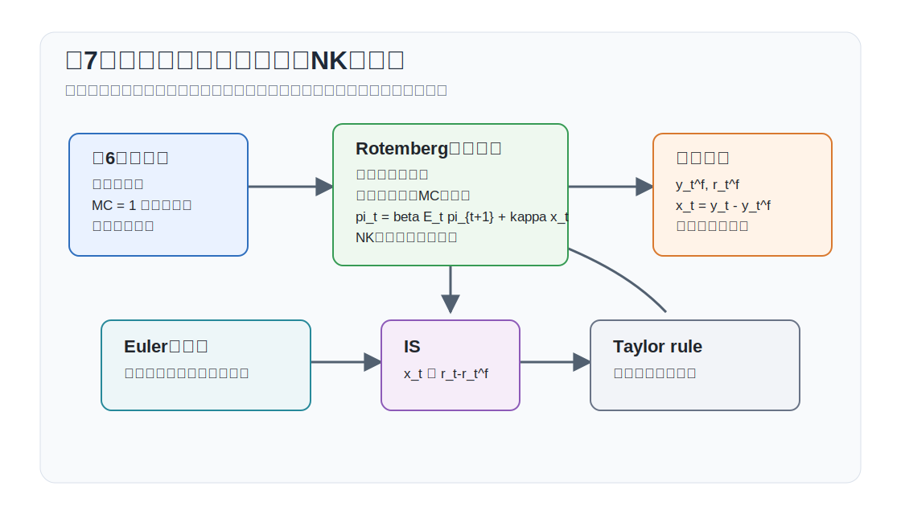
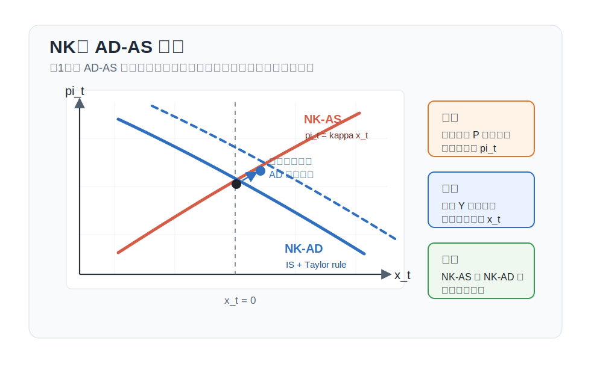

# 講義の目的

この回では、第6回の独占的競争モデルに価格硬直性と金融政策を導入します。資本は導入しません。したがって、価格硬直性が実体経済に影響する仕組みを、投資や資本蓄積ではなく、消費、労働、産出、実質限界費用を通じて理解します。

第8回の RANKモデルは、この回の内容をより一般的な非線形条件と自然産出量・需給ギャップの形に整理したものです。この第7回では、その直前段階として $\alpha=0$ の線形生産モデルを使い、資本なしニューケインジアン・モデルの核になる式を導きます。

この回のポイントは次の4点です。

1. Rotemberg 型価格調整費用を導入する。
2. 企業の価格設定条件から動学的フィリップス曲線を導く。
3. 定常状態を明示し、対数線形化された式を自然産出量、自然利子率、需給ギャップへ整理する。
4. 家計のオイラー方程式、NKフィリップス曲線、テイラー・ルールから3本のニューケインジアン方程式を得る。

{#fig-lecture07-overview width=95%}

# 表記

大文字は水準、小文字は定常状態からの対数乖離を表します。第7回では $\alpha=0$、政府支出なし、$A=1$、$\nu=1$ と置き、定常状態で $N=Y=C=W=MC=1$ となるように正規化します。

主な水準変数は次の通りです。

| 記号 | 意味 |
|---|---|
| $C_t$ | 消費 |
| $N_t$ | 労働投入 |
| $Y_t$ | 産出 |
| $W_t$ | 実質賃金 |
| $MC_t$ | 実質限界費用 |
| $D_t(j)$ | 中間財企業 $j$ の実質配当 |
| $V_t$ | 株式価値または企業価値 |
| $P_t$ | 最終財価格 |
| $P_t^I(j)$ | 中間財企業 $j$ の価格 |
| $Y_t^I(j)$ | 中間財企業 $j$ の産出 |
| $N_t(j)$ | 中間財企業 $j$ の労働投入 |
| $R_t^N$ | 粗名目利子率 |
| $\Pi_t$ | 粗インフレ率 |
| $A_t=\exp(a_t)$ | 技術水準 |
| $C,N,Y,W,MC,R^N,\Pi,A$ | 対応する定常状態の水準 |

主な基礎パラメータは次の通りです。

| 記号 | 意味 |
|---|---|
| $\beta$ | 主観的割引因子 |
| $\gamma$ | 異時点間代替弾力性の逆数 |
| $\varphi$ | フリッシュ弾力性の逆数 |
| $\alpha=0$ | 線形生産に固定する生産関数パラメータ |
| $\nu=1$ | 労働不効用の水準の正規化 |
| $\psi$ | 中間財の代替弾力性 |
| $\eta>0$ | Rotemberg 型価格調整費用パラメータ |
| $\tau_p$ | 売上比例補助金率 |
| $\phi$ | テイラー・ルールのインフレ反応係数 |
| $\rho_a,\rho_m$ | 技術ショック、金融政策ショックの持続性 |

本文中で使用する派生パラメータおよび変数は次の通りです。

| 記号 | 定義 | 意味 |
|---|---|---|
| $Q_{t,t+1}$ | $\beta U_{C,t+1}/U_{C,t}$ | 確率的割引因子（SDF） |
| $y_t^f$ | 柔軟価格で $mc_t=0$ を満たす産出 | 自然産出量 |
| $x_t$ | $y_t-y_t^f$ | 需給ギャップ |
| $r_t^f$ | 柔軟価格で $y_t^f$ を実現する実質利子率 | 自然利子率 |
| $\kappa_P$ | $\psi/\eta$ | 実質限界費用に対するインフレの反応係数 |
| $\zeta_a$ | $(1+\varphi)/(\gamma+\varphi)$ | 自然産出量の技術ショックへの反応係数 |
| $\kappa$ | $\kappa_P(\gamma+\varphi)$ | 需給ギャップに対するインフレの反応係数 |

# モデルの部品

## 価格調整費用

中間財企業 $j$ は自社価格 $P_t^I(j)$ を選びます。価格を変更すると、最終財で測った費用
$$
f_P\left(\frac{P_t^I(j)}{P_{t-1}^I(j)}\right)Y_t
$$
を支払うとします。Rotemberg 型の標準的な特定化は
$$
f_P(\Pi_t)=\frac{\eta}{2}(\Pi_t-1)^2,
\qquad
\eta>0
$$
です。定常状態で $\Pi=1$ なら、価格調整費用はゼロで、限界調整費用もゼロです。NKフィリップス曲線の係数には $1/\eta$ が入るため、この価格硬直性モデルでは $\eta>0$ とします。$\eta=0$ は価格調整費用がない柔軟価格の極限であり、別扱いにします。
$$
f_P(1)=0,
\qquad
f_P'(1)=0
$$
価格調整費用があると、企業は今期のマークアップだけでなく、将来の価格変更費用も考慮して価格を選びます。

## 家計

代表的家計の一階条件は
$$
\begin{aligned}
W_t&=-\frac{U_{N,t}}{U_{C,t}},\\
1&=\mathbb{E}_t\left[Q_{t,t+1}\frac{R_t^N}{\Pi_{t+1}}\right],\\
V_t&=\mathbb{E}_t\left[Q_{t,t+1}(V_{t+1}+D_{t+1})\right],
\end{aligned}
$$
です。ただし
$$
Q_{t,t+1}\equiv \beta\frac{U_{C,t+1}}{U_{C,t}}
$$
です。第4回と同じく、$Q_{t,t+1}$ は来期消費を今期消費で評価する確率的割引因子（SDF）であり、ここでは $MRIS_{t,t+1}$ と同じものとして読めます。オイラー方程式は、名目利子率そのものではなく、期待インフレ率で割り引いた実質収益率
$$
\frac{R_t^N}{\Pi_{t+1}}
$$
が消費の異時点間配分を動かすことを表します。

第3回で導出した企業価値の式を、この回の記号で明示します。企業価値を $V_t$ と書くと、上の1期先の価格付け条件を前向きに繰り返し代入して、
$$
V_t
=
\mathbb{E}_t
\left[
\sum_{i=1}^{N}
Q_{t,t+i}D_{t+i}
+Q_{t,t+N}V_{t+N}
\right],
$$
ただし
$$
Q_{t,t+i}
=
\beta^i
\frac{U_{C,t+i}}{U_{C,t}}
$$
です。バブルを排除する横断性条件
$$
\lim_{N\to\infty}
\mathbb{E}_t
\left[
Q_{t,t+N}V_{t+N}
\right]
=0
$$
のもとでは、
$$
V_t
=
\mathbb{E}_t
\left[
\sum_{i=1}^{\infty}
Q_{t,t+i}D_{t+i}
\right]
$$
となります。したがって、企業価値は将来配当の確率的割引現在価値です。

## 中間財企業

中間財企業の実質配当は
$$
D_t(j)=
\frac{P_t^I(j)}{P_t}Y_t^I(j)
-f_P\left(\frac{P_t^I(j)}{P_{t-1}^I(j)}\right)Y_t
-W_tN_t(j)
$$
です。資本はないため、費用は労働費用と価格調整費用だけです。需要関数と生産関数は
$$
Y_t^I(j)=Y_t\left(\frac{P_t^I(j)}{P_t}\right)^{-\psi},
\qquad
Y_t^I(j)=A_tF(N_t(j))
$$
です。

実質限界費用 $MC_t(j)$ を用いると、労働投入に関する一階条件は
$$
W_t=MC_t(j)A_tF_N(N_t(j))
$$
です。

価格に関する一階条件は、第3回の動学計画法と同じ手順で導けます。中間財企業 $j$ の相対価格を
$$
s_t(j)\equiv \frac{P_t^I(j)}{P_t}
$$
と書きます。このとき個別価格の粗変化率は
$$
\Pi_t^I(j)
\equiv
\frac{P_t^I(j)}{P_{t-1}^I(j)}
=
\frac{s_t(j)}{s_{t-1}(j)}\Pi_t
$$
です。前期相対価格 $s_{t-1}(j)$ は、今期の価格調整費用に入るため状態変数になります。企業の価値関数を
$$
V_t(s_{t-1}(j))
$$
と書くと、Bellman方程式は
$$
V_t(s_{t-1}(j))
=
\max_{s_t(j)}
\left\{
\left[s_t(j)-MC_t(j)\right]
Y_t s_t(j)^{-\psi}
-f_P\left(\frac{s_t(j)}{s_{t-1}(j)}\Pi_t\right)Y_t
+\mathbb{E}_t\left[
Q_{t,t+1}V_{t+1}(s_t(j))
\right]
\right\}.
$$
ここでは、労働投入は所与の産出を最小費用で生産するように選ばれているため、実質限界費用 $MC_t(j)$ を使って可変費用をまとめています。

$s_t(j)$ に関する一階条件は
$$
0
=
Y_t s_t(j)^{-\psi}
\left[
1-\psi+\psi\frac{MC_t(j)}{s_t(j)}
\right]
-Y_t f_P'\left(\Pi_t^I(j)\right)
\frac{\Pi_t}{s_{t-1}(j)}
+\mathbb{E}_t
\left[
Q_{t,t+1}
V_{s,t+1}(s_t(j))
\right]
$$
です。一方、包絡線条件は
$$
V_{s,t}(s_{t-1}(j))
=
Y_t f_P'\left(\Pi_t^I(j)\right)
\frac{\Pi_t^I(j)}{s_{t-1}(j)}
$$
です。第3回と同じく、今日の選択変数 $s_t(j)$ は来期には状態変数になります。したがって、1期先の包絡線条件を使うと、継続価値の微分は
$$
V_{s,t+1}(s_t(j))
=
Y_{t+1} f_P'\left(\Pi_{t+1}^I(j)\right)
\frac{\Pi_{t+1}^I(j)}{s_t(j)}
$$
と置き換えられます。

対称均衡では $s_t(j)=s_{t-1}(j)=1$、$MC_t(j)=MC_t$、$\Pi_t^I(j)=\Pi_t$ です。これらを一階条件に代入して $Y_t$ で割ると、
$$
\Pi_t f_P'(\Pi_t)
=\psi\left[MC_t-\left(1-\frac{1}{\psi}\right)\right]
+\mathbb{E}_t\left[
Q_{t,t+1}\frac{Y_{t+1}}{Y_t}
\Pi_{t+1}f_P'(\Pi_{t+1})
\right]
$$
を得ます。第6回と異なり、$MC_t$ は一定ではありません。価格を変える費用があるため、企業は望ましいマークアップから一時的に離れることを受け入れます。

定常状態のマークアップ歪みを取り除くため、売上補助金 $\tau_p$ を入れる場合は
$$
\Pi_t f_P'(\Pi_t)
=\psi\left[MC_t-(1+\tau_p)\left(1-\frac{1}{\psi}\right)\right]
+\mathbb{E}_t\left[
Q_{t,t+1}\frac{Y_{t+1}}{Y_t}
\Pi_{t+1}f_P'(\Pi_{t+1})
\right]
$$
です。$\tau_p=1/(\psi-1)$ なら、定常状態で $MC=1$ になります。

## 金融政策

政府または中央銀行は、名目利子率をテイラー・ルールで設定するとします。
$$
R_t^N=\frac{1}{\beta}\exp(-m_t)\Pi_t^\phi,
\qquad
\phi>1
$$
ここで $m_t>0$ は金融緩和ショックです。$m_t$ が上昇すると、同じインフレ率のもとで名目利子率が低く設定されます。ショックは
$$
m_t=\rho_m m_{t-1}+e_t^m,
\qquad
0\leq\rho_m<1
$$
に従うとします。

係数 $\phi>1$ はテイラー原則です。インフレが上がったとき、名目利子率をそれ以上に引き上げることで実質利子率を上昇させ、需要を抑えるための条件です。

## 資源制約

政府支出を入れない基本形では、価格調整費用が実物資源を消費するため
$$
Y_t=C_t+f_P(\Pi_t)Y_t
$$
です。定常状態や一次近似では $f_P(1)=f_P'(1)=0$ なので、一次の資源制約は
$$
c_t=y_t
$$
となります。政府支出を含める場合は
$$
Y_t=C_t+G_t+f_P(\Pi_t)Y_t
$$
であり、第8回ではこの形を用いて政府支出ショックを扱います。

# 関数形・非線形体系・定常状態

この回では、計算の流れを明確にするために $\alpha=0$ と置きます。したがって生産関数は線形で、
$$
Y_t=A_tN_t
$$
です。第8回では、$\alpha>0$、政府支出、より一般的な表記をまとめて導入します。

効用関数は
$$
U(C_t,N_t)=\frac{C_t^{1-\gamma}}{1-\gamma}
-\frac{N_t^{1+\varphi}}{1+\varphi}
$$
とします。ここでは $\nu=1$ と正規化しています。この正規化により、$A=1$、$\alpha=0$ の定常状態で $N=Y=C=W=1$ になります。

補助金により定常状態のマークアップ歪みを取り除くと、非線形体系は次のようにまとめられます。
$$
\begin{aligned}
1&=\mathbb{E}_t\left[
\beta\left(\frac{C_{t+1}}{C_t}\right)^{-\gamma}
\frac{R_t^N}{\Pi_{t+1}}
\right],\\
W_t&=N_t^\varphi C_t^\gamma,\\
W_t&=MC_tA_t,\\
Y_t&=A_tN_t,\\
Y_t&=C_t+f_P(\Pi_t)Y_t,\\
R_t^N&=\frac{1}{\beta}\exp(-m_t)\Pi_t^\phi.
\end{aligned}
$$
これに価格設定条件と、外生ショック過程
$$
a_t=\rho_a a_{t-1}+e_t^a,
\qquad
m_t=\rho_m m_{t-1}+e_t^m
$$
を加えればモデルが閉じます。

## 定常状態

ゼロインフレ定常状態を考えます。技術の定常状態を $A=1$、インフレ率を
$$
\Pi=1
$$
と正規化します。Rotemberg 型価格調整費用は $f_P(1)=f_P'(1)=0$ なので、定常状態では資源制約は
$$
C=Y
$$
に戻ります。補助金により定常状態のマークアップ歪みを取り除いて $MC=1$ としていれば、実物側の定常状態は第4回の柔軟価格モデルと同じです。

生産関数から
$$
C=Y=N
$$
です。企業の労働需要条件は
$$
W=MC\cdot A=1
$$
です。家計の労働供給条件は
$$
W=N^\varphi C^\gamma
$$
なので、$C=N$ と $W=1$ を使うと
$$
1=N^{\varphi+\gamma}
$$
です。したがって
$$
N=Y=C=W=1,
\qquad
MC=1,
\qquad
\Pi=1
$$
です。第7回で $\alpha=0$ と $\nu=1$ を置く理由は、ここで定常状態をすべて1にそろえ、価格硬直性と利子率の役割に集中するためです。

異時点間条件では、定常状態で $C_{t+1}=C_t$ なので $Q=\beta$ です。実質総利子率を $R$ と書くと
$$
1=\beta R
$$
から
$$
R=\frac{1}{\beta}
$$
です。$\Pi=1$ なので、粗名目利子率の定常状態も
$$
R^N=\frac{1}{\beta}
$$
です。ここで決まっているのは実物配分と、それに整合する実質利子率です。名目利子率とインフレ率をどう組み合わせてその実質利子率を実現するかは、金融政策ルールと価格設定条件によって決まります。

# 対数線形化と実質限界費用

ゼロインフレ定常状態 $\Pi=1$ の周りで対数線形化します。第7回では $Y=C=N=W=MC=A=1$ なので、小文字は定常状態からの対数乖離です。対数線形化された条件を網羅的に書くと、次の体系になります。

| 名称 | 式 |
|---|---|
| フィッシャー方程式 | $r_t=r_t^N-\mathbb{E}_t\pi_{t+1}$ |
| オイラー方程式 | $r_t=\gamma\mathbb{E}_t\Delta c_{t+1}$ |
| 労働供給 | $w_t=\gamma c_t+\varphi n_t$ |
| 労働需要 | $w_t=mc_t+a_t$ |
| 生産関数 | $y_t=a_t+n_t$ |
| 資源制約 | $y_t=c_t$ |
| NKフィリップス曲線 | $\pi_t=\beta\mathbb{E}_t\pi_{t+1}+\kappa_P mc_t$ |
| テイラー・ルール | $r_t^N=\phi\pi_t-m_t$ |
| 技術ショック | $a_t=\rho_a a_{t-1}+e_t^a$ |
| 金融政策ショック | $m_t=\rho_m m_{t-1}+e_t^m$ |

この表では、未知の時系列は
$$
\{r_t,r_t^N,\pi_t,c_t,w_t,n_t,y_t,mc_t,a_t,m_t\}
$$
の10個です。式も10本あるため、ショックのイノベーション $\{e_t^a,e_t^m\}$ を外生的に与えれば、変数の数と式の数は一致しています。ただし、これは体系を閉じるための必要条件にすぎません。NKモデルには前向き変数が含まれるため、有界な合理的期待解の一意性には、テイラー原則やBlanchard--Kahn型の決定性条件が追加で必要です。

ここで $r_t$ は実質総利子率の定常状態からの対数乖離、$r_t^N$ は名目利子率の対数乖離、$\pi_t$ はインフレ率の乖離、$mc_t$ は実質限界費用の乖離です。資源制約から $c_t=y_t$ なので、オイラー方程式は
$$
r_t=\gamma\left(\mathbb{E}_t y_{t+1}-y_t\right)
$$
と消費ではなく産出で書けます。また
$$
\kappa_P\equiv \frac{\psi}{\eta}
$$
です。別の慣例では $\psi-1$ を用いて $\kappa_P=(\psi-1)/\eta$ と置く書き方もあります。どちらを使うかは、価格設定条件で限界費用をどの定常値の周りで展開するかに依存します。このノートでは、第8回の非線形式に合わせて $MC=1$ の周りでの表記を採ります。

## 対数近似の解き方

第8回と同じ順序で、線形化された条件を解きます。目標は、実質限界費用を産出と技術だけで表し、そこから自然産出量、自然利子率、需給ギャップ表示を得ることです。

まず、生産関数から
$$
n_t=y_t-a_t
$$
です。家計の労働供給式に代入すると
$$
w_t=\gamma y_t+\varphi(y_t-a_t)
=(\gamma+\varphi)y_t-\varphi a_t
$$
です。一方、企業の労働需要式は
$$
w_t=mc_t+a_t
$$
です。したがって
$$
mc_t=
(\gamma+\varphi)y_t-(1+\varphi)a_t
$$
を得ます。これが解法の中心です。価格が硬直的なもとでは、産出が自然産出量からずれると実質限界費用が動き、その実質限界費用がインフレ率を動かします。

物価版フィリップス曲線は
$$
\pi_t=
\beta\mathbb{E}_t\pi_{t+1}
+\kappa_P\{(\gamma+\varphi)y_t-(1+\varphi)a_t\}
$$
と書けます。

# 自然産出量・自然利子率・NK方程式

価格が完全に柔軟なら、企業は $mc_t=0$ を保ちます。このときの産出を自然産出量 $y_t^f$ と呼びます。
$$
0=
(\gamma+\varphi)y_t^f
-(1+\varphi)a_t
$$
したがって
$$
y_t^f=
\frac{1+\varphi}{\gamma+\varphi}
a_t
\equiv
\zeta_a a_t,
\qquad
\zeta_a\equiv
\frac{1+\varphi}{\gamma+\varphi}
$$
です。これは第4回の柔軟価格・資本なし RBCモデルで、$\alpha=0$ としたときの産出反応と同じです。価格が柔軟なら、技術ショックは潜在生産量をこの大きさだけ動かします。

需給ギャップを
$$
x_t\equiv y_t-y_t^f
$$
と定義すると、実質限界費用は
$$
mc_t=
(\gamma+\varphi)x_t
$$
です。したがってフィリップス曲線は
$$
\pi_t=\beta\mathbb{E}_t\pi_{t+1}+\kappa x_t
$$
となります。ここで
$$
\kappa\equiv
\kappa_P(\gamma+\varphi)>0
$$
です。

自然利子率は、価格が柔軟な経済で自然産出量を実現する実質利子率です。オイラー方程式
$$
r_t=\gamma\mathbb{E}_t(y_{t+1}-y_t)
$$
に自然産出量 $y_t^f$ を代入すると
$$
r_t^f
=
\gamma\mathbb{E}_t(y_{t+1}^f-y_t^f)
$$
です。技術ショックが $a_{t+1}=\rho_a a_t+e_{t+1}^a$ に従うなら、
$$
r_t^f
=
\gamma\zeta_a(\rho_a-1)a_t
$$
です。正の技術ショックが一時的で $0\leq\rho_a<1$ なら、自然利子率は低下します。

オイラー方程式から、需給ギャップの IS 曲線は
$$
x_t=\mathbb{E}_t x_{t+1}
-\frac{1}{\gamma}\left(r_t-r_t^f\right)
$$
と書けます。実際の実質利子率は
$$
r_t=r_t^N-\mathbb{E}_t\pi_{t+1}
$$
なので、名目利子率と期待インフレ率を用いれば
$$
x_t=\mathbb{E}_t x_{t+1}
-\frac{1}{\gamma}
\left(r_t^N-\mathbb{E}_t\pi_{t+1}-r_t^f\right)
$$
です。

## 3本のニューケインジアン方程式

ここまでの計算により、$\alpha=0$ の資本なしニューケインジアン・モデルは、次の3本にまとめられます。
$$
\begin{aligned}
x_t
&=
\mathbb{E}_t x_{t+1}
-\frac{1}{\gamma}(r_t-r_t^f),\\
\pi_t
&=
\beta\mathbb{E}_t\pi_{t+1}
+\kappa x_t,\\
r_t
&=
\phi\pi_t-\mathbb{E}_t\pi_{t+1}-m_t.
\end{aligned}
$$
第1式は動学的 IS 曲線です。実際の実質利子率 $r_t$ が自然利子率 $r_t^f$ より高いと、現在の需要は抑えられます。第2式はNKフィリップス曲線です。需給ギャップが正なら、限界費用が上がり、インフレ率が上昇します。第3式はテイラー・ルールを実質利子率で書いたものです。

この3本は、第1回の AD-AS 図に対応させて読むこともできます。ただし、ここでの横軸は産出水準 $Y_t$ ではなく需給ギャップ $x_t$、縦軸は物価水準 $P_t$ ではなくインフレ率 $\pi_t$ です。NKフィリップス曲線が右上がりの **NK-AS**、動学的 IS 曲線とテイラー・ルールを合わせた関係が右下がりの **NK-AD** になります。

{#fig-lecture07-nk-ad-as width=90%}

この図は、第1回の直観を残しつつ、現代的なモデルの変数へ置き換えたものです。金融緩和ショック $m_t>0$ は、同じインフレ率のもとで実質利子率を下げるため、NK-AD を右上へ動かします。ショック別の厳密なシフトと均衡反応は第8回で扱います。

この3本の形は第8回でも同じです。第8回では、$\alpha>0$ と政府支出を導入するため、$\gamma$ や $\varphi$ が再定義された係数に置き換わり、自然産出量と自然利子率に政府支出ショックも入ります。

## 実際の利子率と古典派の二分法

第4回の柔軟価格モデルでは、技術と選好が実物配分を決め、オイラー方程式はその消費経路に整合する実質利子率を後から決めました。名目利子率、インフレ率、物価水準は実物配分から分離していました。これが古典派の二分法です。

この回の価格硬直性モデルでは、その分離が短期的に崩れます。中央銀行はテイラー・ルール
$$
r_t^N=\phi\pi_t-m_t
$$
で名目利子率を設定します。期待インフレ率を差し引くと、実際の実質利子率は
$$
r_t=\phi\pi_t-m_t-\mathbb{E}_t\pi_{t+1}
$$
です。この $r_t$ が自然利子率 $r_t^f$ より高ければ、現在の需要は自然産出量より低くなり、需給ギャップは低下します。逆に $r_t<r_t^f$ なら、需要は自然産出量を上回り、需給ギャップは上昇します。

したがって、価格硬直性のもとでは金融政策が実質配分に影響します。名目利子率の変更は、期待インフレ率が同時に完全には調整しない限り、実質利子率を動かします。その実質利子率と自然利子率の差が IS 曲線を通じて需要を動かし、需給ギャップがフィリップス曲線を通じてインフレ率を動かします。

# まとめと第8回への接続

この回では、Rotemberg 型価格調整費用を導入し、企業価値にもとづく価格設定問題から価格に関する一階条件を導きました。さらに、その条件をゼロインフレ定常状態の周りで一次近似し、実質限界費用と需給ギャップを通じて NKフィリップス曲線が得られることを示しました。

したがって、第7回の役割は、資本なしニューケインジアン・モデルを
$$
\begin{aligned}
x_t
&=
\mathbb{E}_t x_{t+1}
-\frac{1}{\gamma}(r_t-r_t^f),\\
\pi_t
&=
\beta\mathbb{E}_t\pi_{t+1}
+\kappa x_t,\\
r_t
&=
\phi\pi_t-\mathbb{E}_t\pi_{t+1}-m_t
\end{aligned}
$$
という3本の方程式まで組み立てることです。

ショックが実際に $x_t,\pi_t,r_t,y_t,c_t,n_t,w_t$ をどう動かすかは、第8回で扱います。第8回では、同じ3本の構造を保ったまま、$\alpha>0$ と政府支出を導入し、金融政策ショック、技術ショック、政府支出ショックの影響を比較します。

# 参考文献

**必読**

- Galí, Jordi (2015) *Monetary Policy, Inflation, and the Business Cycle* (2nd ed.). Princeton University Press. NKフィリップス曲線の導出を確認するため。
- Woodford, Michael (2003) *Interest and Prices: Foundations of a Theory of Monetary Policy*. Princeton University Press. 価格硬直性と金融政策の標準的な体系。
- Clarida, Richard, Jordi Galí, and Mark Gertler (1999) "The Science of Monetary Policy: A New Keynesian Perspective." *Journal of Economic Literature*, 37(4), 1661-1707. https://doi.org/10.1257/jel.37.4.1661

**発展**

- Calvo, Guillermo A. (1983) "Staggered Prices in a Utility-Maximizing Framework." *Journal of Monetary Economics*, 12(3), 383-398. https://doi.org/10.1016/0304-3932(83)90060-0
- Rotemberg, Julio J. (1982) "Sticky Prices in the United States." *Journal of Political Economy*, 90(6), 1187-1211. https://doi.org/10.1086/261117
- Taylor, John B. (1993) "Discretion versus Policy Rules in Practice." *Carnegie-Rochester Conference Series on Public Policy*, 39, 195-214. https://doi.org/10.1016/0167-2231(93)90009-L

# 演習問題

**問1：概念確認**

Rotemberg 型価格調整費用があると、なぜ実質限界費用とインフレ率が動学的に結びつくのか説明しなさい。

**問2：導出確認**

生産関数 $y_t=a_t+n_t$、労働供給 $w_t=\gamma y_t+\varphi n_t$、労働需要 $w_t=mc_t+a_t$ から、
$$
mc_t=(\gamma+\varphi)y_t-(1+\varphi)a_t
$$
を導出しなさい。

**問3：直観確認**

金融緩和ショック $m_t>0$ は、3本のNK方程式を通じて需給ギャップ、インフレ率、実質利子率をどう動かすか説明しなさい。
