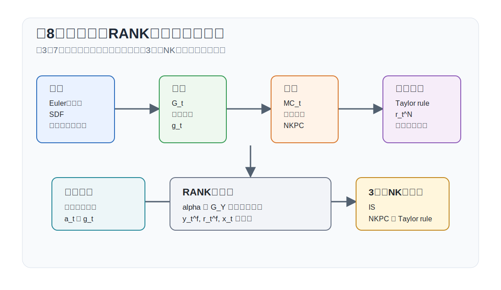
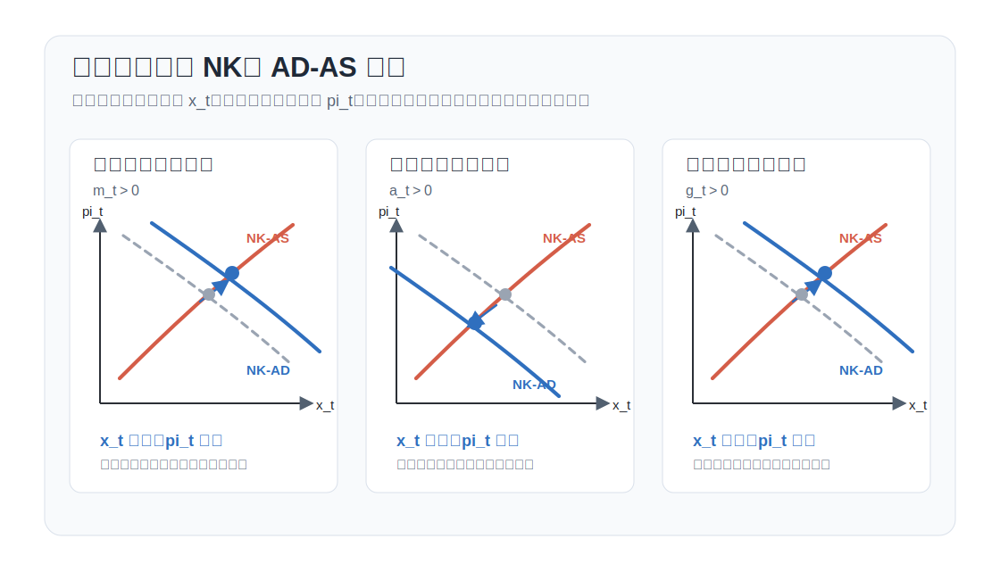

# 講義の目的と位置づけ

## 講義の目的

本講義では、代表的家計をもつニューケインジアン・モデルである **RANK (Representative Agent New Keynesian)** モデルを扱います。

1. 第3回から第7回までの結果を RANKモデルとして整理する。
2. 第7回の $\alpha=0$ モデルを、$\alpha>0$ と政府支出を含む一般形へ拡張する。
3. 自然産出量、自然利子率、需給ギャップを一般形で定義する。
4. 3本のニューケインジアン方程式を使って、金融政策ショック・技術ショック・政府支出ショックを比較する。

RANK は、RBCモデルに価格硬直性と金融政策を導入した最も基本的な DSGEモデルであり、その後の HANK や TANK を理解する基礎になります。


## DSGEモデルとしての位置づけ

DSGEモデルの分析は、基本的に次の3段階で進みます。第3回から第7回では、このうち各部品の導出を順に行いました。第8回では、それらを組み合わせて RANKモデルとして読むことに集中します。

1. 家計・企業・政府の最適化問題を定式化し、一階条件を導出する。
2. 集計条件と市場均衡条件を加えて、モデル全体の均衡条件を得る。
3. 非線形モデルを定常状態の周りで対数線形化し、状態空間表現やインパルス応答で分析する。

RBCモデルでは景気変動の主因は技術ショックでしたが、RANK では独占的競争と価格硬直性を導入することで、金融政策や需要ショックが実体経済に影響します。ここでは Rotemberg 型の価格調整費用を用います。


{#fig-lecture08-overview width=95%}


# これまでの結果と第8回の役割

第8回では、第3回から第7回で導いた条件を再導出しません。ここでは、それらを RANKモデルの構成要素として使い、一般形の 3 本のニューケインジアン方程式へまとめます。

| 回 | ここで使う結果 |
|---|---|
| 第3回 | オイラー方程式、確率的割引因子（SDF）、資産価格条件 |
| 第4回 | 柔軟価格の実物配分、自然産出量、自然利子率の考え方 |
| 第5回 | 政府支出を含む資源制約 |
| 第6回 | Dixit--Stiglitz 型の独占的競争とマークアップ |
| 第7回 | Rotemberg 型価格硬直性、需給ギャップ表示、3本の NK方程式 |

第7回では、計算を見通しやすくするために $\alpha=0$、政府支出なしのケースを中心に扱いました。第8回では、同じ構造を保ったまま、収穫逓減を表す $\alpha>0$ と政府支出ショックを加えます。新しい点は、自然産出量と自然利子率に技術ショックだけでなく政府支出ショックも入ることです。

先に結論を示すと、第8回のRANKモデルは次の3本のNK方程式に集約されます。
$$
\begin{aligned}
x_t
&=
\mathbb{E}_t x_{t+1}
-\frac{1}{\tilde{\gamma}}(r_t-r_t^f),\\
\pi_t
&=
\beta\mathbb{E}_t\pi_{t+1}
+\kappa x_t,\\
r_t
&=
\phi\pi_t-\mathbb{E}_t\pi_{t+1}-m_t.
\end{aligned}
$$
第1式は動学的 IS 曲線、第2式はNKフィリップス曲線、第3式はテイラー・ルールを実質利子率で書いた式です。各ショックが同時点の主要変数に与える符号は、標準的なパラメータ範囲では次の通りです。

| 正のショック | $x_t$ | $\pi_t$ | $r_t$ |
|---|---:|---:|---:|
| 金融緩和ショック $m_t$ | $+$ | $+$ | $-$ |
| 技術ショック $a_t$ | $-$ | $-$ | $-$ |
| 政府支出ショック $g_t$ | $+$ | $+$ | $+$ |

この表は、$0\leq\rho_i<1$、$\phi>\rho_i$、$\eta>0$ のもとで、単一ショックだけを考えた比較静学です。以下では、なぜこの符号になるのかを非線形条件から順に導きます。

# RANKモデルの一般形

## 表記

大文字は水準、小文字は定常状態からの対数乖離を表します。ただし政府支出は
$$
g_t=\frac{G_t-G}{Y}
$$
と定義します。実質利子率、名目利子率、インフレ率の対数乖離はそれぞれ $r_t,r_t^N,\pi_t$ と書きます。需給ギャップは
$$
x_t\equiv y_t-y_t^f
$$
です。

第8回で使う主な水準変数は次の通りです。

| 記号 | 意味 |
|---|---|
| $C_t$ | 民間消費 |
| $N_t$ | 労働投入 |
| $Y_t$ | 産出 |
| $G_t$ | 政府支出 |
| $W_t$ | 実質賃金 |
| $MC_t$ | 実質限界費用 |
| $R_t^N$ | 粗名目利子率 |
| $\Pi_t$ | 粗インフレ率 |
| $A_t=\exp(a_t)$ | 技術水準 |
| $C,N,Y,G,W,MC,R^N,\Pi$ | 対応する定常状態の水準 |

第8回で使う主な基礎パラメータは次の通りです。

| 記号 | 意味 |
|---|---|
| $\beta$ | 主観的割引因子 |
| $0\leq\alpha<1$ | 生産関数の収穫逓減を表すパラメータ |
| $G_Y=G/Y$ | 定常状態の政府支出比率 |
| $\gamma$ | 異時点間代替弾力性の逆数 |
| $\varphi$ | フリッシュ弾力性の逆数 |
| $\nu$ | 労働不効用の水準を調整するパラメータ。本講義では以後 $\nu=1$ に正規化 |
| $\psi$ | 中間財の代替弾力性 |
| $\eta>0$ | Rotemberg 型価格調整費用パラメータ |
| $\phi$ | テイラー・ルールのインフレ反応係数 |
| $\rho_a,\rho_g,\rho_m$ | 技術、政府支出、金融政策ショックの持続性 |

本文中で使用する派生パラメータおよび変数は次の通りです。

| 記号 | 定義 | 意味 |
|---|---|---|
| $g_t$ | $(G_t-G)/Y$ | 定常状態の産出で測った政府支出ショック |
| $y_t^f$ | $\zeta_a a_t+\zeta_g g_t$ | 自然産出量 |
| $x_t$ | $y_t-y_t^f$ | 需給ギャップ |
| $r_t^f$ | $\tilde{\gamma}\mathbb{E}_t(\Delta y_{t+1}^f-\Delta g_{t+1})$ | 自然利子率 |
| $\tilde{\gamma}$ | $\gamma/(1-G_Y)$ | 政府支出を考慮したオイラー方程式の傾き |
| $\tilde{\varphi}$ | $(\varphi+\alpha)/(1-\alpha)$ | 収穫逓減を考慮した限界費用の労働供給側係数 |
| $\zeta_a$ | $(\tilde{\varphi}+1)/(\tilde{\varphi}+\tilde{\gamma})$ | 自然産出量の技術ショックへの反応係数 |
| $\zeta_g$ | $\tilde{\gamma}/(\tilde{\varphi}+\tilde{\gamma})$ | 自然産出量の政府支出ショックへの反応係数 |
| $\kappa$ | $MC(\tilde{\gamma}+\tilde{\varphi})\psi/\eta$ | 需給ギャップに対するインフレの反応係数 |
| $\kappa_i,\; i\in\{a,m,g\}$ | $\kappa/(1-\beta\rho_i)$ | ショック $i$ 用のフィリップス曲線係数 |
| $\Omega$ | $1/\{\kappa_m(\phi-\rho_m)+\tilde{\gamma}(1-\rho_m)\}$ | 金融政策ショックが需給ギャップを動かす係数 |
| $\Omega_i,\; i\in\{a,m,g\}$ | $\tilde{\gamma}(1-\rho_i)/\{\kappa_i(\phi-\rho_i)+\tilde{\gamma}(1-\rho_i)\}$ | ショック $i$ 用の係数。金融政策ショックでは $\Omega_m=\tilde{\gamma}(1-\rho_m)\Omega$ |

## 非線形条件

家計、企業、政府の最適化から得られる非線形条件は、第3回、第6回、第7回で導いたものです。ここでは結果だけを置きます。効用関数と生産関数は一般には
$$
U(C_t,N_t)
=
\frac{C_t^{1-\gamma}}{1-\gamma}
-\nu\frac{N_t^{1+\varphi}}{1+\varphi},
\qquad
Y_t=\exp(a_t)N_t^{1-\alpha}
$$
です。以下では、第7回と同じく労働不効用の水準を $\nu=1$ に正規化します。一般形の労働供給条件は $W_t=\nu C_t^\gamma N_t^\varphi$ ですが、$\nu=1$ の正規化により
$$
W_t=C_t^\gamma N_t^\varphi
$$
を使います。補助金で定常状態のマークアップ歪みを取り除くと、主要な均衡条件は
$$
\begin{aligned}
1&=\mathbb{E}_t\left[
\beta\left(\frac{C_{t+1}}{C_t}\right)^{-\gamma}
\frac{R_t^N}{\Pi_{t+1}}
\right],\\
W_t&=C_t^\gamma N_t^\varphi,\\
W_t&=(1-\alpha)MC_t\frac{Y_t}{N_t},\\
Y_t&=\exp(a_t)N_t^{1-\alpha},\\
Y_t&=C_t+G_t+\frac{\eta}{2}(\Pi_t-1)^2Y_t,\\
R_t^N&=\frac{1}{\beta}\exp(-m_t)\Pi_t^\phi
\end{aligned}
$$
です。価格調整費用を最初から
$$
f_P(\Pi_t)=\frac{\eta}{2}(\Pi_t-1)^2,
\qquad
f_P'(\Pi_t)=\eta(\Pi_t-1)
$$
と置きます。NKフィリップス曲線の係数には $1/\eta$ が入るため、この価格硬直性モデルでは $\eta>0$ とします。$\eta=0$ は柔軟価格の極限であり、価格調整費用つきモデルの式にそのまま代入しません。価格設定条件は非線形のまま
$$
\eta\Pi_t(\Pi_t-1)
=
\psi(MC_t-MC)
+\mathbb{E}_t\left[
\beta\left(\frac{C_{t+1}}{C_t}\right)^{-\gamma}
\frac{Y_{t+1}}{Y_t}
\eta\Pi_{t+1}(\Pi_{t+1}-1)
\right]
$$
です。ここで $MC$ は定常状態の実質限界費用です。補助金を明示すれば $MC=(1+\tau_p)(1-1/\psi)$ であり、定常状態のマークアップ歪みを取り除く設定では $MC=1$ と読めます。この式を一次近似すると
$$
\pi_t=\beta\mathbb{E}_t\pi_{t+1}
+\frac{MC\psi}{\eta}mc_t
$$
として使います。

## 定常状態

第5回の政府支出入り資源制約と第6回の独占的競争モデルを組み合わせると、柔軟価格の定常状態は解析的に求められます。価格が柔軟なら価格調整費用は発生せず、実質限界費用は定常値 $MC$ に固定されます。水準で書くと、柔軟価格配分は静学体系
$$
\begin{aligned}
W_t&=C_t^\gamma N_t^\varphi,\\
W_t&=(1-\alpha)MC\frac{Y_t}{N_t},\\
Y_t&=\exp(a_t)N_t^{1-\alpha},\\
Y_t&=C_t+G_t
\end{aligned}
$$
で決まります。これらをまとめると、
$$
\left\{\exp(a_t)N_t^{1-\alpha}-G_t\right\}^{\gamma}
N_t^{\varphi+\alpha}
=
(1-\alpha)MC\exp(a_t)
$$
です。

定常状態では、ゼロインフレ $\Pi=1$ を置きます。価格調整費用はゼロで、オイラー方程式とテイラー・ルールから
$$
R=R^N=\frac{1}{\beta}
$$
を得ます。補助金により定常状態の実質限界費用を $MC=1$ に正規化します。政府支出比率 $G_Y=G/Y$ のもとで、資源制約は
$$
C=(1-G_Y)Y
$$
です。生産関数は $Y=N^{1-\alpha}$ であり、労働供給と労働需要は
$$
W=C^\gamma N^\varphi,
\qquad
W=(1-\alpha)MC\frac{Y}{N}
$$
です。したがって
$$
(1-G_Y)^\gamma N^{\gamma(1-\alpha)+\varphi}
=
(1-\alpha)MC N^{-\alpha}
$$
となり、定常状態の労働投入は
$$
N
=
\left[
(1-\alpha)MC(1-G_Y)^{-\gamma}
\right]^{
\frac{1}{\varphi+\alpha+\gamma(1-\alpha)}
}
$$
です。したがって
$$
Y=N^{1-\alpha},
\qquad
C=(1-G_Y)Y,
\qquad
G=G_YY,
\qquad
W=(1-\alpha)MCN^{-\alpha}
$$
を得ます。補助金で $MC=1$ と正規化すれば、この式に $MC=1$ を代入します。第7回では $\alpha=0$、$G_Y=0$ と置いたため、$N=Y=C=W=1$ と正規化できました。第8回では $\alpha>0$ と $G_Y>0$ を許すため、定常状態の水準は一般には1になりません。

## 対数線形化

以下では、このゼロインフレ定常状態の周りで対数線形化します。すなわち $\Pi=1$、$R=R^N=1/\beta$、$MC=1$ を基準にし、$C,Y,G,N,W$ は上で述べた定常状態の水準の周りで測ります。小文字の $c_t,y_t,n_t,w_t,mc_t$ は定常状態からの対数乖離ですが、政府支出だけは
$$
g_t=\frac{G_t-G}{Y}
$$
と定義している点に注意してください。

対数線形化された条件を網羅的に書くと、次の体系になります。

| 名称 | 式 |
|---|---|
| フィッシャー方程式 | $r_t=r_t^N-\mathbb{E}_t\pi_{t+1}$ |
| オイラー方程式 | $r_t=\gamma\mathbb{E}_t\Delta c_{t+1}$ |
| 労働供給 | $w_t=\gamma c_t+\varphi n_t$ |
| 労働需要 | $w_t=mc_t+y_t-n_t$ |
| 生産関数 | $y_t=a_t+(1-\alpha)n_t$ |
| 資源制約 | $y_t=(1-G_Y)c_t+g_t$ |
| NKフィリップス曲線 | $\pi_t=\beta\mathbb{E}_t\pi_{t+1}+(MC\psi/\eta)mc_t$ |
| テイラー・ルール | $r_t^N=\phi\pi_t-m_t$ |
| 技術ショック | $a_t=\rho_a a_{t-1}+e_t^a$ |
| 政府支出ショック | $g_t=\rho_g g_{t-1}+e_t^g$ |
| 金融政策ショック | $m_t=\rho_m m_{t-1}+e_t^m$ |

この表では、未知の時系列は
$$
\{r_t,r_t^N,\pi_t,c_t,w_t,n_t,y_t,mc_t,a_t,g_t,m_t\}
$$
の11個です。式も11本あるため、ショックのイノベーション $\{e_t^a,e_t^g,e_t^m\}$ を外生的に与えれば、変数の数と式の数は一致しています。ただし、これは体系を閉じるための必要条件にすぎません。前向き変数を含むため、有界な合理的期待解の一意性には、テイラー原則やBlanchard--Kahn型の決定性条件が追加で必要です。

この体系を後で使いやすい形に直しておきます。資源制約をオイラー方程式に代入すると、
$$
r_t
=
\tilde{\gamma}\mathbb{E}_t(\Delta y_{t+1}-\Delta g_{t+1})
$$
です。ただし
$$
\tilde{\gamma}\equiv\frac{\gamma}{1-G_Y},
\qquad
\tilde{\varphi}\equiv\frac{\varphi+\alpha}{1-\alpha}.
$$
また、
$$
\begin{aligned}
c_t&=\frac{y_t-g_t}{1-G_Y},\\
n_t&=\frac{y_t-a_t}{1-\alpha}
\end{aligned}
$$
を労働供給と労働需要に代入すると、
$$
\begin{aligned}
mc_t
&=
\tilde{\gamma}(y_t-g_t)
+\tilde{\varphi}y_t
-(\tilde{\varphi}+1)a_t\\
&=
(\tilde{\gamma}+\tilde{\varphi})
\left(y_t-\zeta_a a_t-\zeta_g g_t\right)
\end{aligned}
$$
です。ここで
$$
\zeta_a=\frac{\tilde{\varphi}+1}{\tilde{\varphi}+\tilde{\gamma}},
\qquad
\zeta_g=\frac{\tilde{\gamma}}{\tilde{\varphi}+\tilde{\gamma}}.
$$

# 自然産出量・自然利子率・3本のNK方程式

前節の柔軟価格配分を対数線形化すると、自然産出量は閉形式で求まります。柔軟価格では実質限界費用の乖離がゼロなので、
$$
0
=
\tilde{\gamma}(y_t^f-g_t)
+\tilde{\varphi}y_t^f
-(\tilde{\varphi}+1)a_t
$$
です。したがって
$$
y_t^f
=
\frac{\tilde{\varphi}+1}{\tilde{\varphi}+\tilde{\gamma}}a_t
+
\frac{\tilde{\gamma}}{\tilde{\varphi}+\tilde{\gamma}}g_t
$$
を得ます。

上で定義した係数を使えば、自然産出量は
$$
y_t^f=\zeta_a a_t+\zeta_g g_t
$$
です。自然利子率は、この自然産出量を実現する柔軟価格下の実質利子率です。資源制約とオイラー方程式から
$$
r_t^f
=
\tilde{\gamma}\mathbb{E}_t(\Delta y_{t+1}^f-\Delta g_{t+1})
$$
となります。ここで $y_t^f=\zeta_a a_t+\zeta_g g_t$ なので、
$$
\Delta y_{t+1}^f-\Delta g_{t+1}
=
\zeta_a\Delta a_{t+1}
+(\zeta_g-1)\Delta g_{t+1}
$$
です。ショックを
$$
a_t=\rho_a a_{t-1}+e_t^a,
\qquad
g_t=\rho_g g_{t-1}+e_t^g
$$
と置けば、条件付き期待では
$$
\mathbb{E}_t\Delta a_{t+1}=-(1-\rho_a)a_t,
\qquad
\mathbb{E}_t\Delta g_{t+1}=-(1-\rho_g)g_t
$$
なので、
$$
r_t^f
=
-\tilde{\gamma}(1-\rho_a)\zeta_a a_t
+\tilde{\gamma}(1-\rho_g)(1-\zeta_g)g_t
$$
です。

需給ギャップを $x_t=y_t-y_t^f$ と定義すると、RANKモデルは次の3本に集約されます。
$$
\begin{aligned}
x_t
&=
\mathbb{E}_t x_{t+1}
-\frac{1}{\tilde{\gamma}}(r_t-r_t^f),\\
\pi_t
&=
\beta\mathbb{E}_t\pi_{t+1}
+\kappa x_t,\\
r_t
&=
\phi\pi_t-\mathbb{E}_t\pi_{t+1}-m_t.
\end{aligned}
$$
ここで
$$
\kappa
=
MC(\tilde{\gamma}+\tilde{\varphi})\frac{\psi}{\eta}.
$$
第1式は動学的 IS 曲線、第2式はNKフィリップス曲線、第3式はテイラー・ルールを実質利子率で書いたものです。第8回の分析は、この3本を使って各ショックが $x_t,\pi_t,r_t$ をどう動かすかを見ることに集中します。


# 対数二次近似から見た需給ギャップ

第2回では、対数二次近似の基本ケースとして、技術ショックも政府支出ショックもない場合を扱いました。その場合、自然産出量は定常状態に固定されるので、産出の対数乖離 $y_t$ をそのまま需給ギャップとして読めました。

第8回では状況が変わります。技術ショック $a_t$ は生産性を動かし、政府支出ショック $g_t$ は財の資源配分を動かします。ここで $g_t$ は定常産出で測った政府支出ショックであり、需給ギャップではありません。需給ギャップはあくまで
$$
x_t=y_t-y_t^f
$$
です。

この違いは、対数二次近似でロス関数を読むときにも重要です。第2回のショックなしケースでは、政策に依存する産出側の損失は $y_t^2$ に比例しました。しかし、第8回のように自然産出量が
$$
y_t^f=\zeta_a a_t+\zeta_g g_t
$$
と動く場合、政策に依存する産出側の損失は
$$
\left(y_t-\zeta_a a_t-\zeta_g g_t\right)^2
=
x_t^2
$$
に比例します。

直観は単純です。技術進歩によって自然産出量が上がったとき、実際の産出 $y_t$ が上がること自体は厚生上の問題ではありません。問題になるのは、実際の産出が柔軟価格で望ましい産出 $y_t^f$ に追いついているかです。同じように、政府支出ショック $g_t$ は自然産出量も動かすので、産出 $y_t$ の水準だけでは景気の過熱・不足を判断できません。

したがって、第8回以降では、対数二次近似から来るロス関数の産出項を
$$
\frac{1}{2}(\tilde{\gamma}+\tilde{\varphi})x_t^2
$$
として読みます。価格硬直性による価格調整費用は、同じく二階項として
$$
\frac{1}{2}\eta_p\pi_t^2
$$
を加えます。ここで $\eta_p$ は、第9回で使うロス関数側の価格インフレ項の重みです。第8回の NKフィリップス曲線に出てくる Rotemberg パラメータ $\eta$ と対応しますが、方程式の傾きに入る $\eta$ とロス関数の重みを区別するため、ここでは $\eta_p$ と書きます。正の比例係数や定常状態シェアはロス関数の重みに吸収できるので、第9回では
$$
\ell_t
=
\frac{1}{2}\left(x_t^2+\omega_p\pi_t^2\right)
$$
という正規化済みの形から政策問題を始めます。

この節の役割は、厚生近似そのものを完全に導出することではありません。第2回の $a_t=g_t=0$ の基本ケースを、第8回の自然産出量
$$
y_t^f=\zeta_a a_t+\zeta_g g_t
$$
に合わせて読み替えることです。

# ショック別の比較静学

## NK版 AD-AS 表現

第1回の AD-AS 分析では、横軸に産出 $Y$、縦軸に物価水準 $P$ を置き、需要ショックや供給ショックで曲線がどちらへ動くかを見ました。RANKモデルでは、同じ直観を $x_t$ と $\pi_t$ の平面で読み替えます。横軸は需給ギャップ $x_t$、縦軸はインフレ率 $\pi_t$ です。

NKフィリップス曲線は、ショック $i\in\{m,a,g\}$ だけを単独で考え、そのショックの持続性を所与とすると
$$
\pi_t=\kappa_i x_t,
\qquad
\kappa_i=\frac{\kappa}{1-\beta\rho_i}
$$
と書けます。これが **NK-AS** です。複数のショックが同時に動く場合には、それぞれの持続性に応じた項を足し合わせて考えます。一方、動学的 IS 曲線、自然利子率、テイラー・ルールを組み合わせると、右下がりの **NK-AD** が得られます。ショックは、この NK-AD の位置を動かします。

{#fig-lecture08-nk-ad-as-shocks width=95%}

図はシフト方向を示すためのものです。以下では、金融政策ショック、技術ショック、政府支出ショックについて、それぞれの NK-AD と NK-AS を明示し、交点として $x_t,\pi_t,r_t$ を解きます。

## ショック別の結果

### 金融政策ショックのみ

まず、金融政策ショックだけがある場合を解きます。$a_t=g_t=0$ のとき、自然産出量と自然利子率は
$$
y_t^f=0,
\qquad
r_t^f=0
$$
なので、需給ギャップはそのまま産出です。
$$
x_t=y_t.
$$
ショックを
$$
m_{t+1}=\rho_m m_t+e_{t+1}^m
$$
とし、解が $m_t$ に比例すると予想します。NKフィリップス曲線から
$$
\pi_t
=
\beta\rho_m\pi_t+\kappa x_t
$$
なので、
$$
\pi_t=\kappa_m x_t,
\qquad
\kappa_m\equiv\frac{\kappa}{1-\beta\rho_m}
$$
です。

IS 曲線は
$$
x_t
=
\mathbb{E}_t x_{t+1}
-\frac{1}{\tilde{\gamma}}r_t
$$
です。$x_{t+1}$ も $m_{t+1}$ に比例するので、$\mathbb{E}_t x_{t+1}=\rho_m x_t$ と書けます。したがって
$$
r_t
=
-\tilde{\gamma}(1-\rho_m)x_t
$$
です。一方、テイラー・ルールとフィッシャー方程式から
$$
r_t
=
r_t^N-\mathbb{E}_t\pi_{t+1}
=
\phi\pi_t-m_t-\rho_m\pi_t
=
(\phi-\rho_m)\pi_t-m_t
$$
です。$\pi_t=\kappa_m x_t$ を代入し、IS 曲線から得た実質利子率と等置すると
$$
\left\{
\kappa_m(\phi-\rho_m)
+\tilde{\gamma}(1-\rho_m)
\right\}x_t
=
m_t
$$
を得ます。したがって
$$
x_t = \Omega m_t,
\qquad
\pi_t = \kappa_m \Omega m_t,
\qquad
r_t = -\Omega_m m_t
$$
です。ここで
$$
\begin{aligned}
\kappa_m
=&\frac{\kappa}{1-\beta\rho_m},\\
   \Omega
=&
\frac{1}{\kappa_m(\phi-\rho_m)+\tilde{\gamma}(1-\rho_m)},\\
\Omega_m
=&\tilde{\gamma}(1-\rho_m)\Omega,
\quad0\leq\Omega_m\leq1
\end{aligned}
$$
です。金融緩和ショックは需給ギャップとインフレを押し上げ、実質利子率を低下させます。

名目利子率の符号は一意には決まりません。
$$
\begin{aligned}
r_t^N &= r_t + \mathbb{E}_t \pi_{t+1}=r_t+\rho_m \pi_t\\
&=\frac{\rho_{m}\kappa_{m}-\tilde{\gamma}(1-\rho_{m})}{\kappa_{m}(\phi-\rho_{m})+\tilde{\gamma}(1-\rho_{m})}m_{t}
\end{aligned}
$$
です。金融緩和ショックは直接的には名目利子率を引き下げますが、インフレ期待の上昇を通じて名目利子率を押し上げる効果もあります。

### 技術進歩ショックのみ

次に、技術進歩ショックだけがある場合を解きます。$m_t=g_t=0$ のとき、
$$
y_t^f=\zeta_a a_t,
\qquad
r_t^f=-\tilde{\gamma}(1-\rho_a)\zeta_a a_t
$$
です。正の技術進歩ショックは自然産出量を押し上げます。一方、一時的なショックで $0\leq\rho_a<1$ なら、自然利子率は低下します。

解が $a_t$ に比例すると予想します。NKフィリップス曲線から
$$
\pi_t
=
\beta\rho_a\pi_t+\kappa x_t
$$
なので、
$$
\pi_t=\kappa_a x_t,
\qquad
\kappa_a\equiv\frac{\kappa}{1-\beta\rho_a}
$$
です。IS 曲線は
$$
x_t
=
\mathbb{E}_t x_{t+1}
-\frac{1}{\tilde{\gamma}}(r_t-r_t^f)
$$
です。$x_{t+1}$ も $a_{t+1}$ に比例するので、$\mathbb{E}_t x_{t+1}=\rho_a x_t$ と書けます。したがって
$$
r_t
=
r_t^f-\tilde{\gamma}(1-\rho_a)x_t
$$
です。

金融政策ショックがないので、テイラー・ルールとフィッシャー方程式から
$$
r_t
=
\phi\pi_t-\mathbb{E}_t\pi_{t+1}
=
(\phi-\rho_a)\pi_t
$$
です。$\pi_t=\kappa_a x_t$ を代入し、IS 曲線と等置すると
$$
\left\{
\kappa_a(\phi-\rho_a)
+\tilde{\gamma}(1-\rho_a)
\right\}x_t
=
-\tilde{\gamma}(1-\rho_a)\zeta_a a_t
$$
を得ます。したがって
$$
x_t = -\zeta_a \Omega_a a_t,
\qquad
\pi_t = -\kappa_a \zeta_a \Omega_a a_t,
\qquad
r_t = -(\phi-\rho_a)\kappa_a\zeta_a\Omega_a a_t
$$
です。ここで
$$
\kappa_a=\frac{\kappa}{1-\beta\rho_a},
\qquad
\Omega_a
=
\frac{\tilde{\gamma}(1-\rho_a)}{\kappa_a(\phi-\rho_a)+\tilde{\gamma}(1-\rho_a)},
\qquad 0\leq\Omega_a\leq1
$$
です。技術進歩ショックが正であれば自然産出量が上がります。しかし価格硬直性のもとでは、実際の需要が自然産出量にすぐ追いつかないため、需給ギャップとインフレは低下しうることがわかります。

### 政府支出ショックのみ

$m_t=a_t=0$ のとき、
$$
\begin{aligned}
r_t &= r_t^f+\tilde{\gamma}(\rho_g-1)x_t\\
\pi_t &= \kappa_g x_t\\
r_t &= (\phi-\rho_g)\pi_t
\end{aligned}
$$
となります。ここで
$$
r_t^f=\tilde{\gamma}(1-\zeta_g)(1-\rho_g)g_t,
\qquad
x_t=y_t-\zeta_g g_t
$$
です。AD-AS 表現は
$$
\begin{aligned}
\pi_t
&=
\frac{\tilde{\gamma}(\rho_g-1)x_t+\tilde{\gamma}(1-\zeta_g)(1-\rho_g)g_t}{\phi-\rho_g}\\
\pi_t &= \kappa_g x_t
\end{aligned}
$$
です。ここで
$$
\kappa_g = \frac{\kappa}{1-\beta\rho_g}
$$
です。上の2本を等置すると
$$
\left\{\kappa_g(\phi-\rho_g)+\tilde{\gamma}(1-\rho_g)\right\}x_t
=
\tilde{\gamma}(1-\zeta_g)(1-\rho_g)g_t
$$
となります。したがって
$$
x_t = (1-\zeta_g)\Omega_g g_t,
\qquad
\pi_t = \kappa_g (1-\zeta_g)\Omega_g g_t,
\qquad
r_t = (\phi-\rho_g)\kappa_g(1-\zeta_g)\Omega_g g_t
$$
です。ここで
$$
\Omega_g
=
\frac{\tilde{\gamma}(1-\rho_g)}{\kappa_g(\phi-\rho_g)+\tilde{\gamma}(1-\rho_g)},
\qquad 0\leq\Omega_g\leq1
$$
です。政府支出拡大は総需要を押し上げるため、需給ギャップとインフレを上昇させます。

### まとめ

以上をまとめると、

$$
\begin{aligned}
x_t
&=
\Omega m_t
- \zeta_a \Omega_a a_t
+ (1-\zeta_g)\Omega_g g_t\\
\pi_t
&=
\kappa_m \Omega m_t
- \kappa_a \zeta_a \Omega_a a_t
+ \kappa_g (1-\zeta_g)\Omega_g g_t\\
r_t
&=
-\Omega_m m_t
-(\phi-\rho_a)\kappa_a\zeta_a\Omega_a a_t
+(\phi-\rho_g)\kappa_g(1-\zeta_g)\Omega_g g_t
\end{aligned}
$$
です。なお、価格が柔軟なとき（$\kappa\to\infty$）、$\Omega,\;\Omega_{m},\;\Omega_{a},\;\Omega_{g}\to 0$なので、$x_t=0$。
価格が一定のとき（$\kappa\to0$）、$\Omega\to1/\{\tilde{\gamma}(1-\rho_{m})\}, \Omega_{m},\Omega_{a},\Omega_{g}\to1$なので、$x_{t}=m_t/{\tilde{\gamma}(1-\rho_m)}-\zeta_{a}a_{t}+(1-\zeta_{g})g_{t}$となります。

また、
$$
y_t = x_t + y_t^f
$$
より、
$$
\begin{aligned}
y_t
&=
\Omega m_t
+\zeta_a(1-\Omega_a)a_t
+\{1-(1-\zeta_g)(1-\Omega_g)\}g_t\\
(1-G_Y)c_t
=
y_t-g_t
&=
\Omega m_t
+\zeta_a(1-\Omega_a)a_t
-(1-\zeta_g)(1-\Omega_g)g_t\\
(1-\alpha)n_t
=
y_t-a_t
&=
\Omega m_t
-\{1-\zeta_a(1-\Omega_a)\}a_t
+\{1-(1-\zeta_g)(1-\Omega_g)\}g_t
\end{aligned}
$$
と、産出・消費・労働の反応も復元できます。特に価格が一定のとき、$y_t=m_t/\{\tilde{\gamma}(1-\rho_m)\} + g_t$ となります。

この式から、各ショックの直観的な効果も読み取れます。

- 金融政策ショック $m_t$ は、$y_t$, $c_t$, $n_t$ のすべてを押し上げます。金融緩和によって実質利子率が低下し、総需要が拡大するためです。
- 技術ショック $a_t$ は、$y_t$ を押し上げます。生産性の改善によって自然産出量が増加するためです。
- 技術ショック $a_t$ は、$c_t$ にもプラスです。より少ない労働でより多くの財を生産できるため、消費可能資源が増えます。
- 技術ショック $a_t$ は、$n_t$ には $\tilde{\gamma}>1$ のとき、明確にマイナスです。生産性上昇により同じ産出をより少ない労働で達成できるためです。
- 政府支出ショック $g_t$ は、$y_t$ にはプラスです。総需要の増加が産出を押し上げるためです。
- 政府支出ショック $g_t$ は、$c_t$ にはマイナスです。資源制約のもとで政府支出の増加が民間消費を押しのけるためです。
- 政府支出ショック $g_t$ は、$n_t$ にはプラスです。政府需要の増加に対応して生産を増やすため、労働投入が増加します。

## 数値例：インパルス応答関数

上の解は、各ショックへの同時点の反応を完全に特徴づけています。さらに、ショックが AR(1) に従うため、時点 $t$ に1単位のショックが発生したとき、$h$ 期後のショックは $\rho_i^h$ 倍になります。したがって、インパルス応答関数は、上で得た同時点反応に $\rho_i^h$ を掛けるだけで描けます。

以下の数値例は、符号と持続性を可視化するための例であり、特定経済の推定値ではありません。第2回の AR(1) のインパルス応答と同じ考え方で、ここでは RANKモデルの閉形式解を使って $x_t,\pi_t,r_t$ の反応を描きます。

```{r}
#| label: fig-rank-irf-numerical
#| fig-cap: "RANKモデルのインパルス応答関数の数値例"
#| fig-width: 8
#| fig-height: 6
#| echo: !expr knitr::is_html_output()
#| code-fold: true
#| code-summary: "Rコードを表示"

beta <- 0.99
gamma <- 1
varphi <- 1
alpha <- 0.33
GY <- 0.2
psi <- 6
eta <- 80
phi <- 1.5
MC <- 1

rho_m <- 0.5
rho_a <- 0.8
rho_g <- 0.8

tilde_gamma <- gamma / (1 - GY)
tilde_varphi <- (varphi + alpha) / (1 - alpha)
zeta_a <- (tilde_varphi + 1) / (tilde_varphi + tilde_gamma)
zeta_g <- tilde_gamma / (tilde_varphi + tilde_gamma)
kappa <- MC * (tilde_gamma + tilde_varphi) * psi / eta

kappa_i <- function(rho) kappa / (1 - beta * rho)
omega_i <- function(rho) {
  kappa_rho <- kappa_i(rho)
  tilde_gamma * (1 - rho) /
    (kappa_rho * (phi - rho) + tilde_gamma * (1 - rho))
}

kappa_m <- kappa_i(rho_m)
kappa_a <- kappa_i(rho_a)
kappa_g <- kappa_i(rho_g)

Omega <- 1 / (kappa_m * (phi - rho_m) + tilde_gamma * (1 - rho_m))
Omega_m <- tilde_gamma * (1 - rho_m) * Omega
Omega_a <- omega_i(rho_a)
Omega_g <- omega_i(rho_g)

impact <- list(
  monetary = c(
    x = Omega,
    pi = kappa_m * Omega,
    r = -Omega_m
  ),
  technology = c(
    x = -zeta_a * Omega_a,
    pi = -kappa_a * zeta_a * Omega_a,
    r = -(phi - rho_a) * kappa_a * zeta_a * Omega_a
  ),
  government = c(
    x = (1 - zeta_g) * Omega_g,
    pi = kappa_g * (1 - zeta_g) * Omega_g,
    r = (phi - rho_g) * kappa_g * (1 - zeta_g) * Omega_g
  )
)

rhos <- c(monetary = rho_m, technology = rho_a, government = rho_g)
h <- 0:20
shock_names <- c(
  monetary = "Monetary easing shock",
  technology = "Technology shock",
  government = "Government spending shock"
)
var_names <- c(x = "Output gap x", pi = "Inflation pi", r = "Real rate r")
var_cols <- c(x = "#2F6FBE", pi = "#D45D48", r = "#379B55")

op <- par(mfrow = c(3, 3), mar = c(3.0, 3.4, 2.5, 0.8), oma = c(2.0, 0.5, 1.0, 0.2), las = 1)

for (shock in names(impact)) {
  for (v in names(var_names)) {
    response <- impact[[shock]][v] * rhos[shock]^h
    y_lim <- range(c(0, response))
    pad <- 0.08 * diff(y_lim)
    if (pad == 0) pad <- 0.1
    plot(
      h, response,
      type = "n",
      xlab = "",
      ylab = "",
      main = paste(shock_names[shock], var_names[v], sep = "\n"),
      ylim = y_lim + c(-pad, pad),
      cex.main = 0.95
    )
    grid()
    abline(h = 0, lty = 2, col = "gray55")
    lines(h, response, lwd = 2.3, col = var_cols[v])
  }
}

mtext("horizon h", side = 1, outer = TRUE, line = 0.5)
par(op)
```

この図では、金融緩和ショックと政府支出ショックは、需給ギャップとインフレ率をともに押し上げます。一方、技術進歩ショックは自然産出量を押し上げますが、需要が同じだけ増えないため、需給ギャップとインフレ率は低下します。いずれの反応も、ショックの持続性 $\rho_i$ に従って時間とともに減衰します。


# 直観的な含意とまとめ

## 直観的な含意

1. **金融政策の実体効果**
   価格硬直性があるため、名目金利の変更は実質金利を通じて需要に影響し、産出とインフレを動かします。

2. **自然産出量と需給ギャップの分離**
   技術ショックや政府支出ショックは自然産出量を動かすため、単に産出の動きだけでは景気の過熱・不足を判断できません。

3. **テイラー原則の重要性**
   $\phi>1$ はインフレ上昇時に実質金利を十分引き上げるため、均衡の安定性に重要です。

4. **RANK の限界**
   代表的家計を仮定しているため、異質性や流動性制約、分配面の効果は捨象されています。これが次の TANK や HANK への出発点です。


## まとめ

本講義では、RANKモデルを

1. 既出の最適化条件と均衡条件
2. 第7回から第8回への一般化
3. 自然産出量・自然利子率・需給ギャップ
4. 3本の NK方程式
5. ショック別の均衡反応

という順に整理しました。

# 演習問題

**問1：概念確認**

RANKモデルで自然産出量 $y_t^f$ と需給ギャップ $x_t$ を分けて考える理由を説明しなさい。技術ショックと政府支出ショックが自然産出量に入る点にも触れなさい。

**問2：導出確認**

資源制約、労働供給、労働需要、生産関数から
$$
mc_t
=
(\tilde{\gamma}+\tilde{\varphi})
\left(y_t-\zeta_a a_t-\zeta_g g_t\right)
$$
を導出し、$\zeta_a$ と $\zeta_g$ の定義を示しなさい。

**問3：対数二次近似と需給ギャップ**

第2回のショックなしケースでは、厚生ロスの産出項を $y_t^2$ と読めました。第8回では、なぜ $y_t^2$ ではなく
$$
x_t^2
=
\left(y_t-\zeta_a a_t-\zeta_g g_t\right)^2
$$
を使うのか説明しなさい。特に、$g_t$ は需給ギャップではなく政府支出ショックであることに注意しなさい。

**問4：直観確認**

金融緩和ショック、技術ショック、政府支出ショックが、それぞれ $x_t$、$\pi_t$、$r_t$ に与える符号を説明しなさい。特に、正の技術ショックで需給ギャップとインフレ率が下がりうる理由を述べなさい。
