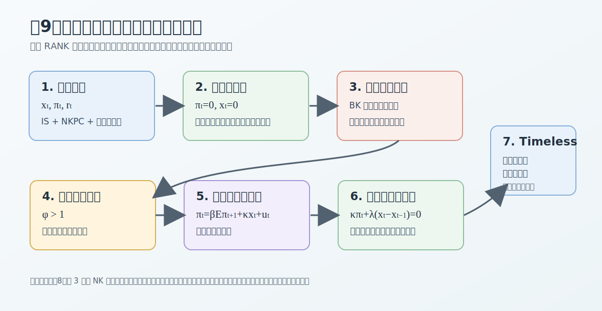

# 講義の目的と基本概念

## 講義の目的

第8回では、所与のテイラー・ルールのもとで、金融政策ショック、技術ショック、政府支出ショックへの反応を分析しました。第9回では視点を変え、金融政策ルールそのものを評価します。出発点は、第8回で整理した次の3本のニューケインジアン方程式です。
$$
\begin{aligned}
x_t
&=
\mathbb{E}_t x_{t+1}
-\frac{1}{\tilde{\gamma}}(r_t-r_t^f),\\
\pi_t
&=
\beta\mathbb{E}_t\pi_{t+1}
+\kappa x_t,\\
r_t
&=
r_t^N-\mathbb{E}_t\pi_{t+1}.
\end{aligned}
$$
ここで $x_t$ は需給ギャップ、$\pi_t$ はインフレ率、$r_t$ は実質利子率、$r_t^N$ は名目利子率、$r_t^f$ は自然利子率です。

先に結論をまとめると、第9回の主な政策含意は次の通りです。神々の配剤（divine coincidence）とは、インフレ安定化と需給ギャップ安定化を同時に達成できる性質です。

| 論点 | 結論 |
|---|---|
| ショックなし | 神々の配剤により、$\pi_t=x_t=0$ を同時に実現できる。 |
| 利子率ペッグ | 名目利子率を固定すると、期待インフレが自己実現し、均衡は不決定になる。 |
| テイラー原理 | 標準的には $\phi>1$ が決定性を回復する。 |
| コストプッシュショック | インフレ安定化と需給ギャップ安定化のトレードオフが生じる。 |
| 裁量政策 | 毎期の期待を所与として最適化するため、安定化バイアスを持つ。 |
| コミットメント政策 | 将来の約束が期待を動かし、履歴依存的なターゲット条件を生む。 |
| タイムレス・パースペクティブ | 初期時点の特権を取り除く政策評価基準になる。 |

この回のポイントは次の6点です。

1. **神々の配剤**が成立するベースラインでは、インフレ率と需給ギャップを同時にゼロにできることを確認する。
2. それでも名目利子率を一定に固定するだけでは、均衡が一意に定まらないことを確認する。
3. テイラー原理 $\phi>1$ が、なぜ均衡の一意性に重要なのかを直観で理解する。
4. コストプッシュショックを導入すると、インフレ安定化と需給ギャップ安定化の間にトレードオフが生じることを確認する。
5. 裁量政策とコミットメント政策を比較し、安定化バイアスと履歴依存性を導く。
6. 時間的非整合性を避ける評価基準として、タイムレス・パースペクティブを理解する。

@fig-lecture09-overview は、第9回の流れをまとめています。固有値計算の細部は補論に回し、本編では政策評価の主線に集中します。

{#fig-lecture09-overview width=95%}

## 変数とパラメータ

このノートでは、**変数**とは、時点、状態、ショック、政策に応じて値が変わる数値情報を指します。たとえば $\pi_t$、$x_t$、$r_t^N$、$u_t$ は変数です。これに対して、**パラメータ**とは、モデル内では一定と仮定する数値情報を指します。たとえば $\beta$、$\kappa$、$\tilde{\gamma}$、$\omega_p$ はパラメータです。

主な内生変数は次の通りです。

| 記号 | 意味 |
|---|---|
| $x_t$ | 需給ギャップ、$x_t=y_t-y_t^f$ |
| $\pi_t$ | 価格インフレ率の定常状態からの乖離 |
| $r_t$ | 実質利子率の定常状態からの乖離 |
| $r_t^N$ | 名目利子率の定常状態からの乖離 |
| $y_t$ | 産出の定常状態からの対数乖離 |
| $y_t^f$ | 自然産出量 |
| $r_t^f$ | 自然利子率 |

主な外生変数は次の通りです。

| 記号 | 意味 |
|---|---|
| $u_t$ | コストプッシュショック、またはマークアップショック |
| $m_t$ | 金融緩和ショック |
| $e_t^u$ | コストプッシュショックのイノベーション |

主なパラメータは次の通りです。

| 記号 | 意味 |
|---|---|
| $\beta\in(0,1)$ | 主観的割引因子 |
| $\gamma>0$ | 異時点間代替弾力性の逆数 |
| $\varphi>0$ | フリッシュ弾力性の逆数 |
| $\tilde{\gamma}>0$ | IS曲線における実質利子率への反応係数の逆数 |
| $\tilde{\varphi}>0$ | 収穫逓減を考慮した限界費用の労働供給側係数 |
| $\kappa>0$ | 需給ギャップに対するインフレ率の反応係数 |
| $\phi\geq0$ | テイラー・ルールにおけるインフレ反応係数 |
| $\eta_p>0$ | 厚生損失に現れる価格調整費用の重み |
| $\omega_p>0$ | 価格インフレ安定化の相対的な厚生重み |
| $\rho_u\in[0,1)$ | コストプッシュショックの持続性 |

第8回と同じく、$\tilde{\gamma}$ は政府支出や収穫逓減を含む一般形の IS曲線で使う係数です。政府支出がなく、より単純な標準形で書く場合は $\tilde{\gamma}=\gamma$ と読めます。

ここでは需給ギャップの重みを1に正規化し、価格インフレ率の重みを $\omega_p$ と書きます。この正規化を使うと、後で賃金硬直性を導入したときに、目的関数を
$$
x_t^2+\omega_p(\pi_t^p)^2+\omega_w(\pi_t^w)^2
$$
のように自然に拡張できます。ここで $\pi_t^p$ は価格インフレ率、$\pi_t^w$ は賃金インフレ率、$\omega_w$ は賃金インフレ安定化の重みです。この第9回では賃金硬直性をまだ導入しないため、簡単に $\pi_t=\pi_t^p$ と書きます。

## ロス関数の厚生的基礎

第2回で確認したように、中央銀行のロス関数は単なる便宜的な二乗和ではなく、家計効用の二階近似から導くことができます。ここでは導出の細部は繰り返さず、第9回で使う形だけを確認します。

代表的家計の期間効用を
$$
U(C_t,N_t)
=
\frac{C_t^{1-\gamma}}{1-\gamma}
-
\nu\frac{N_t^{1+\varphi}}{1+\varphi}
$$
とします。この節では、第2回の単純形に合わせて、効率的な定常状態の周りで
$$
C=N=1,
\qquad
\nu=1
$$
と正規化します。より一般には、$\nu$ や定常状態の水準は二階近似の係数に入りますが、ここでは需給ギャップの重みを1に正規化するため、それらは後で定義する相対的な重みに吸収されます。

価格硬直性だけをもつ単純な RANKモデルでは、効用を定常状態の周りで二階近似し、政策に依存しない項を落とすと、厚生損失は
$$
\ell_t
=
\frac{1}{2}
\left\{
(\gamma+\varphi)x_t^2+\eta_p\pi_t^2
\right\}
$$
と書けます。第1項は需給ギャップを動かす資源配分上の損失、第2項は価格調整費用を通じたインフレの損失です。

ここで $\eta_p$ は、厚生損失側に現れる価格調整費用の重みです。第8回の NK方程式で使ったローテンバーグ型価格調整費用のパラメータ $\eta$ に対応する量ですが、この回ではロス関数に入る価格インフレ項の係数であることを明確にするため、$\eta_p$ と書きます。以下では価格硬直性があるケースとして $\eta_p>0$ を仮定します。$\eta_p=0$ は価格調整費用が消える柔軟価格の極限であり、この講義の政策トレードオフとは分けて考えます。

正の定数 $\gamma+\varphi$ で割っても最適政策は変わらないので、この講義では次の正規化を使います。
$$
\ell_t
=
\frac{1}{2}
\left(
x_t^2+\omega_p\pi_t^2
\right),
\qquad
\omega_p
=
\frac{\eta_p}{\gamma+\varphi}.
$$

第8回の一般形では、政府支出と収穫逓減を反映した限界費用係数を使い、
$$
\omega_p
=
\frac{\eta_p}{\tilde{\gamma}+\tilde{\varphi}}
$$
と書きます。以下では、常にこの厚生近似に基づく正規化済みロス関数を使います。

# 神々の配剤

## ベースラインモデル

まず、コストプッシュショックがないベースラインを考えます。自然利子率を政策で相殺できるとすると、モデルは
$$
\begin{aligned}
x_t
&=
\mathbb{E}_t x_{t+1}
-\frac{1}{\tilde{\gamma}}(r_t-r_t^f),\\
\pi_t
&=
\beta\mathbb{E}_t\pi_{t+1}
+\kappa x_t
\end{aligned}
$$
です。第1式は動学的 IS曲線、第2式は NKフィリップス曲線です。

中央銀行の目的関数を
$$
\frac{1}{2}
\mathbb{E}_0
\sum_{t=0}^{\infty}
\beta^t
\left(
x_t^2+\omega_p\pi_t^2
\right)
$$
とします。この損失は非負です。したがって、もし全ての時点で
$$
\pi_t=0,
\qquad
x_t=0
$$
を実現できるなら、それが最小値です。

この候補が NKフィリップス曲線を満たすことを確認します。$\pi_t=0$、$x_t=0$、$\mathbb{E}_t\pi_{t+1}=0$ を代入すると、
$$
0=\beta\cdot 0+\kappa\cdot 0
$$
となり、制約を満たします。IS曲線についても、中央銀行が実質利子率を自然利子率に一致させるように
$$
r_t=r_t^f
$$
を実現すれば、
$$
0=0-\frac{1}{\tilde{\gamma}}(r_t^f-r_t^f)
$$
となります。

したがって、ベースラインでは
$$
\pi_t=0,
\qquad
x_t=0
$$
が最適政策です。この性質を **神々の配剤** と呼びます。価格安定化を達成すると同時に、需給ギャップも安定化されます。言い換えると、この単純なモデルでは、インフレ安定化と実体経済安定化の間にトレードオフがありません。

## 実装に必要な政策金利

ただし、最適配分が $\pi_t=x_t=0$ であることと、どの名目利子率ルールでもその配分が一意に実現することは別です。この実装には、少なくとも次の前提が必要です。

1. 名目利子率に有効下限制約がなく、中央銀行が必要な水準まで利子率を動かせる。
2. 中央銀行が自然利子率 $r_t^f$ を観測できる。
3. 政策が完全に信認され、期待インフレ率がゼロにアンカーされる。

この前提のもとで、フィッシャー方程式は
$$
r_t=r_t^N-\mathbb{E}_t\pi_{t+1}
$$
です。$\pi_t=0$ を期待まで含めて実現するなら、$\mathbb{E}_t\pi_{t+1}=0$ なので、
$$
r_t^N=r_t^f
$$
が必要です。

ここから次の問題が出ます。もし神々の配剤が成立するなら、中央銀行は名目利子率を適切な定数に固定しておけばよいのでしょうか。答えは一般に **いいえ** です。理由は、名目利子率を固定すると、期待インフレ率が実質利子率を動かし、自己実現的な景気変動を許すからです。

# 利子率ルールと決定性の直観

## 利子率ペッグ

外生ショックを捨象し、$r_t^f=0$ とします。ゼロインフレ定常状態と整合する名目利子率に固定するルールを
$$
r_t^N=0
$$
と書きます。この利子率ペッグは、望ましい定常状態とは整合しますが、均衡を一意に選ぶ力を持ちません。

フィッシャー方程式から
$$
r_t=-\mathbb{E}_t\pi_{t+1}
$$
です。人々が将来のインフレ率上昇を期待すると、名目利子率が固定されているため、期待実質利子率は低下します。期待実質利子率の低下は需要を押し上げ、NKフィリップス曲線を通じて実際のインフレ率も上昇します。したがって、期待インフレ率の変化が部分的に自己実現します。

このモデルでは $x_t$ と $\pi_t$ の2つが前向き変数です。どちらも資本ストックのように過去から物理的に所与になる初期値を持ちません。利子率ペッグでは、非発散的な均衡経路を一意に選ぶだけの政策フィードバックが不足するため、均衡は不決定になります。行列表示と固有値による確認は補論で扱います。

## テイラー原理

次に、名目利子率をインフレ率に反応させる単純なテイラー・ルールを考えます。
$$
r_t^N=\phi\pi_t,
\qquad
\phi\geq0.
$$
ここでは産出ギャップへの反応や金融政策ショックを省き、インフレ反応係数 $\phi$ の役割だけを見ます。

標準的な結論は
$$
\phi>1
$$
です。この条件を **テイラー原理** と呼びます。インフレ率が1%上昇したとき、中央銀行が名目利子率を1%以上引き上げると、期待実質利子率が上昇します。実質利子率の上昇は需要を抑え、インフレ上昇を打ち消します。したがって、インフレ期待の自己実現的な変動は消えます。

逆に $\phi<1$ では、インフレ期待が上がったときに名目利子率の引き上げが不十分です。期待実質利子率はむしろ低下し、需要が拡大し、インフレ期待が自己実現しやすくなります。$\phi=1$ は境界ケースです。

ここまでの結論は、望ましい配分を知っているだけでは政策ルールとして不十分だということです。金融政策ルールは、ショックへの平均的な反応だけでなく、期待の自己実現を排除できるかという観点から評価する必要があります。

# 外生ショックとトレードオフ

## コストプッシュショック

神々の配剤は、NKフィリップス曲線に余分な歪みがないために成立しました。次に、時間を通じて変化する外生的なマークアップショックを導入します。これを $u_t$ と書きます。
$$
\pi_t
=
\beta\mathbb{E}_t\pi_{t+1}
+\kappa x_t
+u_t.
$$
$u_t$ は **コストプッシュショック** とも呼ばれます。たとえば、企業の望ましいマークアップが一時的に上昇する、輸入原材料価格が上昇する、賃金設定に外生的な圧力がかかる、といった要因をまとめて表す変数です。

ショック過程は
$$
u_t=\rho_u u_{t-1}+e_t^u,
\qquad
0\leq \rho_u<1
$$
とします。

## 神々の配剤の崩壊

$u_t\neq0$ のとき、$\pi_t=0$ と $x_t=0$ を同時に実現できるかを確認します。NKフィリップス曲線に代入すると、
$$
0=\beta\cdot0+\kappa\cdot0+u_t
$$
となります。これは $u_t=0$ のときしか成立しません。

したがって、コストプッシュショックがあると、中央銀行は次のどちらかを選ばなければなりません。

1. インフレ率を抑えるために $x_t<0$ を作る。
2. 需給ギャップを安定させる代わりに $\pi_t>0$ を受け入れる。

このトレードオフが、最適金融政策の中心問題です。

直観的には、コストプッシュショックは NKフィリップス曲線を上方にシフトさせます。同じ需給ギャップでもインフレ率が高くなります。インフレを抑えるには、中央銀行は需要を冷やして負の需給ギャップを作る必要があります。

ここまでの結論は、神々の配剤はベースラインの便利な性質であって、一般的な政策問題そのものではないということです。コストプッシュショックが入ると、中央銀行はインフレ率と需給ギャップのどちらをどれだけ安定化するかを選ぶ必要があります。

# 裁量政策

## 裁量の考え方

裁量政策では、中央銀行は毎期、その時点の民間期待を所与として最適化します。つまり、中央銀行は今期の $x_t$ と $\pi_t$ を選ぶとき、将来の期待形成を直接約束で動かすことができません。

以下では、名目利子率に有効下限制約がなく、中央銀行が自然利子率 $r_t^f$ を観測でき、政策金利を自由に設定できると仮定します。このとき、任意の $x_t$ と期待経路は
$$
r_t
=
r_t^f+\tilde{\gamma}
\left(
\mathbb{E}_t x_{t+1}-x_t
\right),
\qquad
r_t^N
=
r_t+\mathbb{E}_t\pi_{t+1}
$$
によって実装できます。したがって、最適化問題では IS曲線を制約として明示せず、NKフィリップス曲線だけを制約として置きます。

時点 $t$ の静学的な問題は
$$
\min_{\pi_t,x_t}
\frac{1}{2}
\left(
x_t^2+\omega_p\pi_t^2
\right)
$$
制約条件は
$$
\pi_t
=
\beta\mathbb{E}_t\pi_{t+1}
+\kappa x_t
+u_t
$$
です。ここで $\mathbb{E}_t\pi_{t+1}$ は、時点 $t$ の最適化では所与として扱います。

ラグランジュ関数を
$$
\mathcal{L}_t
=
\frac{1}{2}
\left(
x_t^2+\omega_p\pi_t^2
\right)
+\mu_t
\left(
\pi_t-\beta\mathbb{E}_t\pi_{t+1}-\kappa x_t-u_t
\right)
$$
とします。一階条件は
$$
\begin{aligned}
\frac{\partial\mathcal{L}_t}{\partial \pi_t}
&=
\omega_p\pi_t+\mu_t=0,\\
\frac{\partial\mathcal{L}_t}{\partial x_t}
&=
x_t-\kappa\mu_t=0.
\end{aligned}
$$
第1式から $\mu_t=-\omega_p\pi_t$ です。これを第2式に代入すると、
$$
x_t+\kappa\omega_p\pi_t=0
$$
を得ます。したがって裁量政策のターゲット条件は
$$
\pi_t=-\frac{1}{\kappa\omega_p}x_t
$$
です。正のコストプッシュショックに対して、中央銀行は正のインフレ率と負の需給ギャップを組み合わせます。

ここまでの結論は、裁量政策では毎期のターゲット条件が
$$
\kappa\omega_p\pi_t+x_t=0
$$
になるということです。これはインフレ率と需給ギャップの静学的なトレードオフを表します。

## 補足：裁量均衡の閉形式

ショックが AR(1) で、均衡が $u_t$ に比例すると予想します。
$$
\pi_t^D=b_Du_t,
\qquad
x_t^D=a_Du_t.
$$
このとき
$$
\mathbb{E}_t\pi_{t+1}^D
=
\rho_u b_Du_t
$$
です。NKフィリップス曲線は
$$
b_Du_t
=
\beta\rho_u b_Du_t
+\kappa a_Du_t
+u_t
$$
となります。またターゲット条件から
$$
a_D+\kappa\omega_p b_D=0
$$
です。これらを解くと、
$$
b_D
=
\frac{1}
{1-\beta\rho_u+\kappa^2\omega_p},
\qquad
a_D
=
-\frac{\kappa\omega_p}
{1-\beta\rho_u+\kappa^2\omega_p}.
$$
したがって
$$
\pi_t^D
=
\frac{1}
{1-\beta\rho_u+\kappa^2\omega_p}
u_t,
\qquad
x_t^D
=
-\frac{\kappa\omega_p}
{1-\beta\rho_u+\kappa^2\omega_p}
u_t.
$$

正のコストプッシュショック $u_t>0$ が起きると、裁量政策のもとでは $\pi_t^D>0$、$x_t^D<0$ です。中央銀行は景気を冷やしてインフレを抑えますが、ショックが持続的であれば将来のインフレ期待も高くなります。その期待を今期の約束で十分に抑えられないため、裁量政策はコミットメント政策に比べて安定化の効率が低くなります。これを **安定化バイアス** と呼びます。

ここまでの結論は、裁量政策の安定化バイアスは「今期の約束だけで将来期待を十分に動かせない」ことから生じるということです。ショックの持続性 $\rho_u$ が高いほど、将来インフレ期待が現在のインフレ率を押し上げやすくなります。

# コミットメント政策

## コミットメントの考え方

コミットメント政策では、中央銀行は将来の政策経路まで含めて、時点0で一度に計画を選びます。民間部門はその計画を信じ、将来のインフレ期待を形成します。したがって、中央銀行は現在の政策だけでなく、将来の政策約束を通じて現在の期待にも影響できます。

結論を先に書くと、通常のコミットメント政策は第1期以降に
$$
\kappa\omega_p\pi_t+x_t-x_{t-1}=0,
\qquad
t\geq1
$$
というターゲット条件を持ちます。裁量政策の $\kappa\omega_p\pi_t+x_t=0$ と異なり、過去の需給ギャップ $x_{t-1}$ が入る点が重要です。

裁量政策と同じく、名目利子率の有効下限制約を捨象し、自然利子率を観測できると仮定します。任意の $x_t$ 経路は政策金利で実装できるため、ここでも制約として明示するのは NKフィリップス曲線だけです。

問題は
$$
\min_{\{\pi_t,x_t\}_{t=0}^{\infty}}
\frac{1}{2}
\mathbb{E}_0
\sum_{t=0}^{\infty}
\beta^t
\left(
x_t^2+\omega_p\pi_t^2
\right)
$$
制約条件は
$$
\pi_t
=
\beta\mathbb{E}_t\pi_{t+1}
+\kappa x_t
+u_t
\qquad
t=0,1,2,\ldots
$$
です。

数式展開を見通しやすくするため、確実性等価の形で書きます。ラグランジュ関数は
$$
\mathcal{L}
=
\mathbb{E}_0
\sum_{t=0}^{\infty}
\beta^t
\left[
\frac{1}{2}
\left(
x_t^2+\omega_p\pi_t^2
\right)
+\mu_t
\left(
\pi_t-\beta\pi_{t+1}-\kappa x_t-u_t
\right)
\right].
$$
期待がある場合も、一階条件の形は同じです。

## 一階条件

$x_t$ に関する一階条件は
$$
x_t-\kappa\mu_t=0
$$
です。したがって
$$
\mu_t=\frac{1}{\kappa}x_t.
$$

$\pi_t$ に関する一階条件では、$\pi_t$ は今期の制約だけでなく、前期の制約にも現れます。前期の制約には $-\beta\pi_t$ として入るため、割引を考慮すると
$$
\omega_p\pi_t+\mu_t-\mu_{t-1}=0
$$
を得ます。ただし初期時点では、前期の制約が存在しないので
$$
\mu_{-1}=0
$$
と置きます。

したがって、$t=0$ では
$$
\omega_p\pi_0+\mu_0=0
$$
です。$\mu_0=x_0/\kappa$ を代入すると、
$$
\kappa\omega_p\pi_0+x_0=0
$$
です。

一方、$t\geq1$ では
$$
\omega_p\pi_t+\mu_t-\mu_{t-1}=0
$$
なので、
$$
\kappa\omega_p\pi_t+x_t-x_{t-1}=0
$$
です。すなわち
$$
\kappa\omega_p\pi_t+x_t-x_{t-1}=0,
\qquad
t\geq1.
$$

この式がコミットメント政策の中心です。裁量政策では $\kappa\omega_p\pi_t+x_t=0$ でした。コミットメント政策では $x_t$ の水準ではなく、$x_t-x_{t-1}$ という変化が入ります。これを **履歴依存性** と呼びます。

## 履歴依存性の意味

正のコストプッシュショックに対して、中央銀行は今期だけ景気を冷やすのではなく、将来にも一定期間、負の需給ギャップを残すことを約束できます。民間部門がその約束を信じると、将来インフレ率が低くなるという期待が生まれます。NKフィリップス曲線では現在のインフレ率が将来の期待インフレ率に依存するため、
$$
\mathbb{E}_t\pi_{t+1}
$$
が下がると、現在のインフレ率も下がります。

このため、コミットメント政策は裁量政策よりも期待チャネルを強く使えます。現在のショックに対して、将来の政策経路を約束することで、今期のインフレ安定化を助けます。

コミットメント下の $x_t$ は、NKフィリップス曲線とターゲット条件を組み合わせることで、次の前向き差分方程式を満たします。
$$
\beta\mathbb{E}_t x_{t+1}
+x_{t-1}
-
\left\{
1+\beta+\kappa^2\omega_p
\right\}x_t
-\kappa\omega_p u_t=0.
$$
ここで $x_{t-1}$ が状態変数として現れます。これが、コミットメント政策の履歴依存性を数式で表したものです。

ここまでの結論は、コミットメント政策の強みは将来の政策約束を使って現在の期待を動かせることにある、ということです。その代わり、政策ルールは過去の約束を状態変数として引き継ぐ履歴依存的な形になります。

# 時間的非整合性

## 初期時点と第1期以降の違い

通常のコミットメント計画には、初期時点だけ特別な条件があります。
$$
\begin{aligned}
t=0:
\qquad
&\kappa\omega_p\pi_0+x_0=0,\\
t\geq1:
\qquad
&\kappa\omega_p\pi_t+x_t-x_{t-1}=0.
\end{aligned}
$$
第1期以降には $x_{t-1}$ が入りますが、初期時点には入りません。理由は、初期時点には過去の約束から引き継がれるラグランジュ乗数がないからです。上の導出では、これを
$$
\mu_{-1}=0
$$
として表しました。

## 再最適化の誘因

問題は、時点1に到達した中央銀行が再び計画を立て直したくなることです。時点0で立てた計画では、時点1の条件は
$$
\kappa\omega_p\pi_1+x_1-x_0=0
$$
です。

しかし、時点1の中央銀行が過去の約束を無視して新たに「時点1を初期時点」として最適化すると、初期条件は
$$
\kappa\omega_p\pi_1+x_1=0
$$
になります。この2つは、一般に一致しません。特に $x_0\neq0$ なら、時点0で約束された時点1の政策は、時点1に再最適化する中央銀行にとって最適ではありません。

これが **時間的非整合性** です。時点0から見れば最適な計画でも、将来の時点に到達した政策当局が同じ計画を続けたいとは限りません。

## 実行可能性の問題

時間的非整合性は、数式上の問題にとどまらず、実行可能性の問題を生みます。現実の政策運営では、中央銀行は毎期、新しい情報を観測し、政策を見直す機会を持ちます。そのたびに「今日を初期時点として再最適化したい」という誘因があるなら、時点0の計画は信頼されません。

民間部門が約束を信じなければ、コミットメント政策が期待を動かす力は失われます。したがって、政策評価では、単に時点0から見た最適計画を求めるだけでは不十分です。時間が経っても同じ形で実行できるルールを考える必要があります。

ここまでの結論は、通常のコミットメント計画は期待を安定化する力を持つ一方で、初期時点を特別扱いするため、将来の再最適化に弱いということです。この問題を避けるために、次にタイムレス・パースペクティブを導入します。

# タイムレス・パースペクティブ

## 初期時点の特権を取り除く

タイムレス・パースペクティブは、あたかもコミットメント政策がはるか過去から実施されてきたかのように考える方法です。初期時点だけ特別扱いするのではなく、すべての時点で同じターゲット条件を課します。

通常のコミットメント計画では、$t=0$ だけ
$$
\kappa\omega_p\pi_0+x_0=0
$$
となり、$t\geq1$ で初めて履歴依存的な条件が出ます。タイムレス・パースペクティブでは、この初期時点の特別扱いを取り除き、同じ履歴依存的な条件をすべての時点で使います。

すなわち、
$$
\kappa\omega_p\pi_t+x_t-x_{t-1}=0
\qquad
t=0,1,2,\ldots
$$
を政策評価の基準にします。ここでは $x_{-1}$ は過去から引き継がれた状態変数として扱います。別の言い方をすれば、$\mu_{-1}=0$ という初期時点の特権を捨て、過去の約束を表すラグランジュ乗数を状態変数として引き継ぐということです。

数値例で $x_{-1}=0$ と置く場合、それは「過去から引き継いだ状態がたまたまゼロだった」という例示の初期条件です。タイムレス・パースペクティブの定義そのものが $x_{-1}=0$ を要求するわけではありません。

この考え方を **タイムレス・パースペクティブ** と呼びます。タイムレスとは、特定の初期時点だけを特別扱いしないという意味です。

## 政策評価のベンチマーク

タイムレス・パースペクティブの利点は、政策ルールが時間を通じて同じ形を保つことです。時点0でも時点1でも、中央銀行は同じターゲット条件
$$
\kappa\omega_p\pi_t+x_t-x_{t-1}=0
$$
に従います。したがって、将来に同じ問題を解き直しても、初期時点の特権を使って別のルールに変える誘因がありません。

このため、タイムレス・パースペクティブは、マクロ経済学における政策評価の標準的なベンチマークとして使われます。特に、裁量政策、単純なテイラー・ルール、通常のコミットメント計画を比較するとき、タイムレス・パースペクティブは「長期的に維持できるコミットメント」の基準を与えます。

ただし、タイムレス・パースペクティブは制度そのものではありません。中央銀行が実際に約束を守れるかどうかは、中央銀行の独立性、透明性、説明責任、政策枠組みへの信認に依存します。この講義で扱うのは、そうした制度問題を抽象化したうえで、どの政策ルールがモデル内で整合的かを評価する理論的基準です。

## 発展：数値例による裁量とタイムレス・パースペクティブの比較

この節は発展的な数値確認です。第8回では、テイラー・ルールのもとで金融政策ショック、技術ショック、政府支出ショックへの反応を描きました。つまり、所与のルールのもとで経済がどう反応するかを見ました。第9回では、コストプッシュショックに対して、裁量政策とタイムレス・パースペクティブという政策評価基準を比較します。

裁量政策は閉形式で書けます。
$$
\pi_t^D
=
\frac{1}
{1-\beta\rho_u+\kappa^2\omega_p}
u_t,
\qquad
x_t^D
=
-\frac{\kappa\omega_p}
{1-\beta\rho_u+\kappa^2\omega_p}
u_t.
$$

タイムレス・パースペクティブでは、次の差分方程式を解きます。通常のコミットメント計画は $t=0$ に特別な条件を持ちますが、ここではすべての時点で同じ履歴依存的なターゲット条件を使います。
$$
\left\{
1+\beta+\kappa^2\omega_p
\right\}x_t
-
\beta\mathbb{E}_t x_{t+1}
-
x_{t-1}
=
-\kappa\omega_p u_t.
$$
有限期間で近似するなら、十分大きな $T$ を取り、$x_{T+1}=0$ の終端条件を置いて、$x_0,\ldots,x_T$ の連立一次方程式として解けます。この終端条件は近似です。AR(1) ショックが $T$ 期以降にも残っているなら、無限期間問題の厳密な終端条件ではありません。

@fig-lecture09-discretion-timeless-irf では、この近似解を使ってインパルス応答を図示します。パラメータ値は講義用の例示であり、特定の国や時期を推定したものではありません。授業では、パラメータやショックの持続性を変え、裁量とタイムレス・パースペクティブの反応を比較します。

```{r}
#| label: fig-lecture09-discretion-timeless-irf
#| fig-cap: "コストプッシュショックに対する裁量政策とタイムレス・パースペクティブの反応"
#| fig-width: 8
#| fig-height: 4.8
#| echo: !expr knitr::is_html_output()
#| code-fold: true
#| code-summary: "Rコードを表示"

jp_font_candidates <- c(
  "/System/Library/AssetsV2/com_apple_MobileAsset_Font8/ee89e7987a76cc8cfdff36c96bd7bc77655b343e.asset/AssetData/YuGothic-Medium.otf",
  "/System/Library/AssetsV2/com_apple_MobileAsset_Font8/42529d87b12845309dd4a57dea9e58446826e94c.asset/AssetData/BIZ_UDGothic.ttc",
  "/System/Library/Fonts/Supplemental/AppleGothic.ttf",
  "/System/Library/Fonts/Hiragino Sans GB.ttc"
)
jp_font <- jp_font_candidates[file.exists(jp_font_candidates)][1]
font_family <- ""

if (
  requireNamespace("showtext", quietly = TRUE) &&
    requireNamespace("sysfonts", quietly = TRUE) &&
    !is.na(jp_font)
) {
  suppressWarnings(sysfonts::font_add("jp_sans", regular = jp_font))
  showtext::showtext_auto(enable = TRUE)
  font_family <- "jp_sans"
}

beta <- 0.99
kappa <- 0.08
omega_p <- 20
rho_u <- 0.7
T <- 40

u <- rho_u^(0:T)

# 裁量政策
den <- (1 - beta * rho_u) + kappa^2 * omega_p
pi_D <- 1 / den * u
x_D <- -kappa * omega_p / den * u

# タイムレス・パースペクティブの有限期間近似
B <- 1 + beta + kappa^2 * omega_p
A <- matrix(0, nrow = T + 1, ncol = T + 1)
b <- -kappa * omega_p * u
x_lag <- 0

for (t in 1:(T + 1)) {
  A[t, t] <- B
  if (t < T + 1) A[t, t + 1] <- -beta
  if (t > 1) {
    A[t, t - 1] <- -1
  } else {
    b[t] <- b[t] + x_lag
  }
}

x_C <- as.vector(solve(A, b))
pi_C <- -1 / (kappa * omega_p) * c(x_C[1] - x_lag, diff(x_C))

h <- 0:T
col_discretion <- "#2F6FBE"
col_timeless <- "#D45D48"

op <- par(
  mfrow = c(1, 2),
  mar = c(4.1, 4.1, 3.0, 1.0),
  las = 1,
  family = font_family
)

plot(
  h, x_D,
  type = "n",
  ylim = range(c(0, x_D, x_C)),
  xlab = "期",
  ylab = "需給ギャップ",
  main = "需給ギャップ"
)
grid()
abline(h = 0, lty = 2, col = "gray55")
lines(h, x_D, lwd = 2.4, col = col_discretion)
lines(h, x_C, lwd = 2.4, col = col_timeless)
legend(
  "bottomright",
  legend = c("裁量", "タイムレス"),
  col = c(col_discretion, col_timeless),
  lty = 1,
  lwd = 2.4,
  bty = "n"
)

plot(
  h, pi_D,
  type = "n",
  ylim = range(c(0, pi_D, pi_C)),
  xlab = "期",
  ylab = "インフレ率",
  main = "価格インフレ率"
)
grid()
abline(h = 0, lty = 2, col = "gray55")
lines(h, pi_D, lwd = 2.4, col = col_discretion)
lines(h, pi_C, lwd = 2.4, col = col_timeless)
legend(
  "topright",
  legend = c("裁量", "タイムレス"),
  col = c(col_discretion, col_timeless),
  lty = 1,
  lwd = 2.4,
  bty = "n"
)

par(op)

if (font_family == "jp_sans") {
  showtext::showtext_auto(enable = FALSE)
}
```

見るべきポイントは3つです。

1. 正のコストプッシュショックに対して、インパクトではインフレ率は上昇し、需給ギャップは低下する。
2. タイムレス・パースペクティブでは、将来の政策約束が期待を動かすため、需給ギャップの低下がより長く続き、インフレ率が一時的に定常値を下回ることもある。
3. ショックの持続性 $\rho_u$ が高いほど、裁量政策の安定化バイアスが大きくなりやすい。

ここまでの結論は、タイムレス・パースペクティブは通常のコミットメント計画の期待管理の利点を残しつつ、初期時点だけを特別扱いしない評価基準だということです。

# まとめ

本講義では、RANKモデルを政策評価の道具として使いました。主な結論は次の通りです。

1. コストプッシュショックがないベースラインでは、$\pi_t=0$ と $x_t=0$ を同時に実現できる。これが神々の配剤である。
2. ロス関数は家計効用の二階近似から導くことができ、価格硬直性のみの RANKモデルでは $x_t^2+\omega_p\pi_t^2$ という形に正規化できる。
3. しかし名目利子率を一定に固定するだけでは、ブランチャード＝カーン条件を満たさず、均衡は不決定になる。
4. テイラー原理 $\phi>1$ は、インフレ期待が上がったときに実質利子率を上げ、自己実現的なインフレ変動を排除する条件である。
5. コストプッシュショックがあると、インフレ安定化と需給ギャップ安定化の間にトレードオフが生じる。
6. 裁量政策は毎期の期待を所与として最適化するため、安定化バイアスを持つ。
7. コミットメント政策は将来の期待形成を内生化し、履歴依存的なターゲット条件を生む。
8. 通常のコミットメント計画は初期時点だけ特別な条件を持つため、時間的非整合性を抱える。
9. タイムレス・パースペクティブは初期時点の特権を取り除き、長期的に一貫した政策評価の基準を与える。

次回は、賃金硬直性を導入したときに、目的関数とターゲット条件がどのように変わるかを扱います。賃金硬直性が入ると、ロス関数には価格インフレ率だけでなく賃金インフレ率も入り、最適政策のターゲット条件も変わります。ただし、政策ルールを評価するときの軸、すなわち安定化トレードオフ、期待管理、時間的非整合性、履歴依存性は第9回と同じです。

# 演習問題

1. **概念確認**：神々の配剤とは何か。コストプッシュショックがない場合に、なぜ $\pi_t=x_t=0$ を同時に実現できるのかを説明しなさい。

2. **概念確認**：利子率ペッグがゼロインフレ定常状態と整合していても、均衡が不決定になる理由を、期待実質利子率の動きに注目して説明しなさい。

3. **導出確認**：裁量政策の問題
$$
\min_{\pi_t,x_t}\frac{1}{2}(x_t^2+\omega_p\pi_t^2)
$$
制約条件は
$$
\pi_t=\beta\mathbb{E}_t\pi_{t+1}+\kappa x_t+u_t
$$
である。この問題の一階条件から
$$
\kappa\omega_p\pi_t+x_t=0
$$
を導出しなさい。

4. **直観確認**：通常のコミットメント政策で
$$
\kappa\omega_p\pi_t+x_t-x_{t-1}=0
$$
という履歴依存的なターゲット条件が現れる理由を、民間部門の期待形成と結びつけて説明しなさい。

5. **応用確認**：コストプッシュショックの持続性 $\rho_u$ が高くなると、裁量政策のインフレ率と需給ギャップの反応はどのように変わるか。閉形式解の分母
$$
1-\beta\rho_u+\kappa^2\omega_p
$$
に注目して説明しなさい。

6. **比較確認**：通常のコミットメント計画とタイムレス・パースペクティブの違いを、$t=0$ のターゲット条件と $t\geq1$ のターゲット条件の違いに注目して説明しなさい。

# 補論


## 対数二次近似の参照

基本的な導出は、第2回の「効用関数の二次近似」を参照してください。第2回では、技術ショックや政府支出ショックがなく、自然産出量が定常状態に固定されるケースで、
$$
C=N=1,
\qquad
\nu=1
$$
と正規化し、対数二次近似から
$$
\ell_t
=
\frac{1}{2}
\left[
(\gamma+\varphi)y_t^2+\eta_p\pi_t^2
\right]
$$
が得られることを確認しました。

第8回では、この基本ケースを RANKモデルの自然産出量表示に読み替えました。技術ショック $a_t$ と政府支出ショック $g_t$ があると、自然産出量は
$$
y_t^f=\zeta_a a_t+\zeta_g g_t
$$
と動きます。ここで $g_t$ は政府支出ショックであり、需給ギャップではありません。需給ギャップは
$$
x_t=y_t-y_t^f
$$
です。したがって、厚生ロスの産出項は $y_t^2$ ではなく $x_t^2$ で表します。係数を第9回の簡約表記で書けば、
$$
\ell_t
=
\frac{1}{2}
\left[
(\gamma+\varphi)x_t^2+\eta_p\pi_t^2
\right]
$$
という形になります。

この式では、第1項が需給ギャップを動かす資源配分上の損失、第2項が価格調整費用を通じたインフレの損失です。第9回では、この結果を出発点として使います。正の定数 $\gamma+\varphi$ で割っても最適政策は変わらないので、本文では
$$
\ell_t
=
\frac{1}{2}
\left(
x_t^2+\omega_p\pi_t^2
\right),
\qquad
\omega_p
=
\frac{\eta_p}{\gamma+\varphi}
$$
という正規化済みロス関数を用います。

政府支出や収穫逓減を含む第8回の一般形では、同じ議論の係数が $\gamma+\varphi$ から $\tilde{\gamma}+\tilde{\varphi}$ に置き換わります。

## 利子率ペッグ

外生ショックを捨象し、$r_t^f=0$ とします。利子率ペッグ
$$
r_t^N=0
$$
のもとでは、フィッシャー方程式から
$$
r_t=-\mathbb{E}_t\pi_{t+1}
$$
です。これを IS曲線に代入すると、
$$
x_t
=
\mathbb{E}_t x_{t+1}
+\frac{1}{\tilde{\gamma}}\mathbb{E}_t\pi_{t+1}
$$
となります。NKフィリップス曲線と合わせると、
$$
\begin{aligned}
x_t
&=
\mathbb{E}_t x_{t+1}
+\frac{1}{\tilde{\gamma}}\mathbb{E}_t\pi_{t+1},\\
\pi_t
&=
\beta\mathbb{E}_t\pi_{t+1}
+\kappa x_t.
\end{aligned}
$$

$z_t=(x_t,\pi_t)'$ と置くと、
$$
\begin{bmatrix}
1 & 0\\
-\kappa & 1
\end{bmatrix}
z_t
=
\begin{bmatrix}
1 & 1/\tilde{\gamma}\\
0 & \beta
\end{bmatrix}
\mathbb{E}_t z_{t+1}
$$
です。したがって
$$
\mathbb{E}_t z_{t+1}=A_0 z_t
$$
であり、
$$
A_0
=
\begin{bmatrix}
1+\frac{\kappa}{\beta\tilde{\gamma}}
&
-\frac{1}{\beta\tilde{\gamma}}\\
-\frac{\kappa}{\beta}
&
\frac{1}{\beta}
\end{bmatrix}.
$$
この行列のトレースと行列式は
$$
\operatorname{tr}(A_0)
=
1+\frac{1}{\beta}
+\frac{\kappa}{\beta\tilde{\gamma}},
\qquad
\det(A_0)=\frac{1}{\beta}.
$$
固有値を $\lambda$ とすると、特性方程式は
$$
q_0(\lambda)
=
\lambda^2-\operatorname{tr}(A_0)\lambda+\det(A_0)=0
$$
です。$\lambda=1$ を代入すると、
$$
q_0(1)
=
-\frac{\kappa}{\beta\tilde{\gamma}}<0
$$
であり、$q_0(0)=1/\beta>0$ です。したがって、1つの固有値は $0$ と $1$ の間にあります。もう1つの固有値は単位円の外にあります。

このモデルには前向き変数 $x_t$ と $\pi_t$ が2つあります。ブランチャード＝カーン条件を満たすには、単位円の外にある固有値が2個必要です。しかし利子率ペッグでは1個しかないため、均衡は不決定です。

## テイラー原理の固有値条件

単純なテイラー・ルールを
$$
r_t^N=\phi\pi_t,
\qquad
\phi\geq0
$$
とします。フィッシャー方程式と IS曲線から、
$$
x_t+\frac{\phi}{\tilde{\gamma}}\pi_t
=
\mathbb{E}_t x_{t+1}
+\frac{1}{\tilde{\gamma}}\mathbb{E}_t\pi_{t+1}
$$
です。NKフィリップス曲線と合わせると、
$$
\begin{bmatrix}
1 & \phi/\tilde{\gamma}\\
-\kappa & 1
\end{bmatrix}
z_t
=
\begin{bmatrix}
1 & 1/\tilde{\gamma}\\
0 & \beta
\end{bmatrix}
\mathbb{E}_t z_{t+1}.
$$
したがって
$$
\mathbb{E}_t z_{t+1}=A(\phi)z_t
$$
であり、
$$
A(\phi)
=
\begin{bmatrix}
1+\frac{\kappa}{\beta\tilde{\gamma}}
&
\frac{\phi}{\tilde{\gamma}}-\frac{1}{\beta\tilde{\gamma}}\\
-\frac{\kappa}{\beta}
&
\frac{1}{\beta}
\end{bmatrix}.
$$

この行列のトレースと行列式は
$$
\operatorname{tr}(A(\phi))
=
1+\frac{1}{\beta}
+\frac{\kappa}{\beta\tilde{\gamma}},
\qquad
\det(A(\phi))
=
\frac{1+\kappa\phi/\tilde{\gamma}}{\beta}.
$$
特性方程式を
$$
q(\lambda)
=
\lambda^2-\operatorname{tr}(A(\phi))\lambda+\det(A(\phi))
$$
とすると、
$$
q(1)
=
\frac{\kappa(\phi-1)}{\beta\tilde{\gamma}}.
$$

$\phi<1$ なら $q(1)<0$ となり、利子率ペッグと同じく1つの固有値が単位円の内側に残ります。$\phi=1$ は単位根を持つ境界ケースです。$\phi>1$ なら $q(1)>0$ で、2つの固有値は単位円の外にあります。前向き変数2つに対して単位円外の固有値が2つになるので、ブランチャード＝カーン条件が満たされます。

この意味で、標準的なニューケインジアンモデルでは
$$
\phi>1
$$
が均衡の決定性を回復する条件になります。
