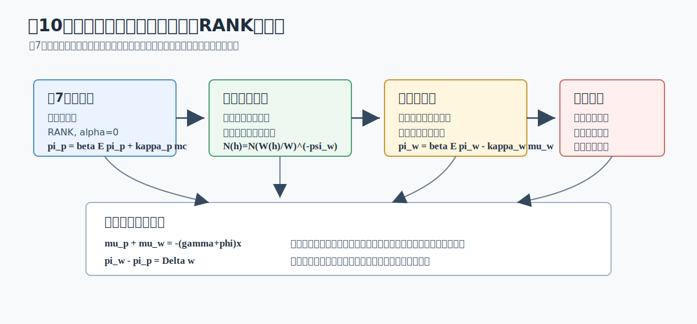
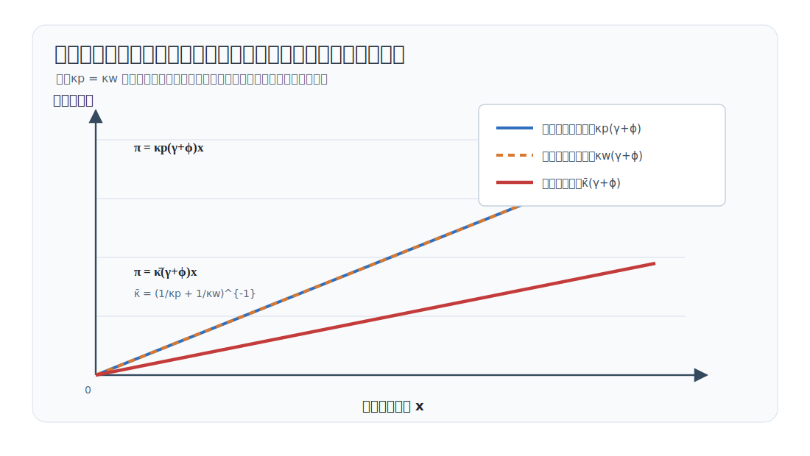

# 講義の目的

第10回では、第7回の価格硬直性モデルに **賃金硬直性** を加えます。家計は代表的家計のままです。したがって、ここで扱うのは TANK や HANK ではなく、二重の名目硬直性をもつ RANK モデルです。

この回でも、第7回と同じく
$$
\alpha=0
$$
と置きます。生産関数は線形で、政府支出も導入しません。したがって、新しく学ぶことは収穫逓減や財政ではなく、価格と賃金という2つの名目変数がゆっくり調整されるとき、ニューケインジアン・モデルの方程式がどう変わるかです。

この回は、第7回のモデル構築と第9回の政策評価をつなぐ回です。第7回で導いた価格硬直性の RANK モデルに賃金硬直性を加え、第9回で扱った神々の配剤（divine coincidence：価格インフレ率と需給ギャップを同時に安定化できる性質）と裁量政策のターゲット条件がどう変わるかを確認します。

先に結論をまとめると、価格硬直性だけのモデルと比べた主な違いは次の通りです。

| 論点 | 価格硬直性だけの RANK モデル | 価格・賃金硬直性をもつ RANK モデル |
|---|---|---|
| 家計 | 代表的家計 | 代表的家計 |
| 労働市場 | 同質労働、柔軟賃金 | 差別化された労働、労働集計業者（労働パッカー）、硬直的名目賃金 |
| 賃金条件 | $\mu^w_t=0$ | $\pi^w_t=\beta\mathbb{E}_t\pi^w_{t+1}-\kappa_w\mu^w_t$ |
| 価格インフレ率 | 価格マークアップに反応 | 価格マークアップに反応 |
| 賃金インフレ率 | 登場しない | 賃金マークアップに反応 |
| 実質賃金 | 即時に調整 | 価格インフレ率と賃金インフレ率の差でゆっくり調整 |
| 最適政策 | 価格インフレ率と需給ギャップの安定化 | 価格インフレ率、賃金インフレ率、需給ギャップの安定化 |

この回のポイントは次の6点です。

1. 労働集計業者（労働パッカー）を導入し、差別化された労働サービスの需要関数と集計賃金を導く。
2. Rotemberg 型賃金調整費用から、賃金フィリップス曲線を導く。
3. 第7回と同じ $\alpha=0$ の環境で、価格マークアップと賃金マークアップを定義する。
4. 対数線形化後の方程式リストを作成する。
5. 価格硬直性だけの3本のNK方程式が、賃金硬直性によりどのように拡張されるかを理解する。
6. 神々の配剤が崩れる理由と、裁量政策下のターゲット条件を理解する。

@fig-lecture10-overview は、この回の流れをまとめています。価格硬直性は企業の価格設定から、賃金硬直性は家計の賃金設定から生じます。2つの名目硬直性は、実質賃金を通じて結びつきます。

{#fig-lecture10-overview width=95%}

# 表記

大文字は水準、小文字はゼロインフレ定常状態からの対数乖離を表します。この回では $\alpha=0$、政府支出なし、$A=1$、$\chi=1$ と置き、定常状態で
$$
N=Y=C=W=1,
\qquad
MU^p=MU^w=1
$$
となるように正規化します。

主な水準変数は次の通りです。

| 記号 | 意味 |
|---|---|
| $C_t$ | 消費 |
| $N_t$ | 労働投入 |
| $N_t(h)$ | 労働タイプ $h$ の労働供給 |
| $Y_t$ | 産出 |
| $W_t^N$ | 集計名目賃金 |
| $W_t^N(h)$ | 労働タイプ $h$ の名目賃金 |
| $W_t=W_t^N/P_t$ | 集計実質賃金 |
| $P_t$ | 最終財価格 |
| $\Pi_t^p=P_t/P_{t-1}$ | 価格の粗インフレ率 |
| $\Pi_t^w=W_t^N/W_{t-1}^N$ | 賃金の粗インフレ率 |
| $R_t^N$ | 粗名目利子率 |
| $Q_{t,t+1}$ | 確率的割引因子 |
| $MU_t^p$ | 価格マークアップ |
| $MU_t^w$ | 賃金マークアップ |
| $A_t=\exp(a_t)$ | 技術水準 |

主な対数乖離変数は次の通りです。

| 記号 | 意味 |
|---|---|
| $c_t,y_t,n_t,w_t$ | 消費、産出、労働、実質賃金の対数乖離 |
| $\pi_t^p$ | 価格インフレ率の乖離 |
| $\pi_t^w$ | 賃金インフレ率の乖離 |
| $r_t^N$ | 名目利子率の乖離 |
| $r_t=r_t^N-\mathbb{E}_t\pi^p_{t+1}$ | 事前実質利子率 |
| $\mu_t^p$ | 価格マークアップの対数乖離 |
| $\mu_t^w$ | 賃金マークアップの対数乖離 |
| $x_t=y_t-y_t^f$ | 需給ギャップ |

主なパラメータは次の通りです。

| 記号 | 意味 |
|---|---|
| $\beta\in(0,1)$ | 主観的割引因子 |
| $\gamma>0$ | 異時点間代替弾力性の逆数 |
| $\varphi>0$ | フリッシュ弾力性の逆数 |
| $\psi_p>1$ | 中間財の代替弾力性 |
| $\eta_p>0$ | Rotemberg 型価格調整費用パラメータ |
| $\psi_w>1$ | 労働タイプ間の代替弾力性 |
| $\eta_w>0$ | Rotemberg 型賃金調整費用パラメータ |
| $\tau_p$ | 売上補助金率 |
| $\tau_w$ | 賃金補助金率 |
| $\phi>1$ | テイラー・ルールのインフレ反応係数 |
| $\rho_a,\rho_m$ | 技術ショック、金融政策ショックの持続性 |

以下では
$$
\kappa_p\equiv\frac{\psi_p}{\eta_p},
\qquad
\kappa_w\equiv\frac{\psi_w}{\eta_w}
$$
と書きます。$\kappa_p$ は価格マークアップに対する価格インフレ率の反応、$\kappa_w$ は賃金マークアップに対する賃金インフレ率の反応を表します。調整費用パラメータ $\eta_p,\eta_w$ が大きいほど、インフレ率はマークアップのずれに対して緩やかに反応します。

# モデルの部品

## 価格硬直性

価格ブロックは第7回と同じです。中間財企業 $j$ は価格 $P_t(j)$ を選び、Rotemberg 型価格調整費用
$$
f_P(\Pi_t^p)=\frac{\eta_p}{2}(\Pi_t^p-1)^2,
\qquad
\eta_p>0
$$
を支払います。

定常状態の価格マークアップ歪みを取り除くため、売上補助金 $\tau_p$ を
$$
1+\tau_p=\frac{1}{1-1/\psi_p}
$$
と置きます。このときゼロインフレ定常状態で $MU^p=1$ です。

対称均衡では、価格設定条件は
$$
\eta_p\Pi_t^p(\Pi_t^p-1)
=
\psi_p
\left\{
\frac{1}{MU_t^p}
-
(1+\tau_p)\left(1-\frac{1}{\psi_p}\right)
\right\}
+
\eta_p\mathbb{E}_t
\left[
Q_{t,t+1}
\frac{Y_{t+1}}{Y_t}
\Pi_{t+1}^p(\Pi_{t+1}^p-1)
\right]
$$
です。第7回では実質限界費用 $MC_t$ を使って書きましたが、この回では後の賃金ブロックとそろえるため、価格マークアップ
$$
MU_t^p\equiv\frac{A_t}{W_t}
$$
を使います。$\alpha=0$ なので、労働の限界生産物は $A_t$ です。

第7回の記号との関係もここで確認しておきます。第7回では実質限界費用を
$$
MC_t=\frac{W_t}{A_t}
$$
と書きました。価格マークアップはその逆数です。
$$
MU_t^p=\frac{1}{MC_t}
$$
したがって、ゼロインフレ定常状態で $MC=MU^p=1$ の周りで対数線形化すると、
$$
\mu_t^p=-mc_t
$$
です。第7回の価格フィリップス曲線を
$$
\pi_t^p
=
\beta\mathbb{E}_t\pi_{t+1}^p
+
\kappa_p mc_t
$$
と書くなら、この回のマークアップ表示では
$$
\pi_t^p
=
\beta\mathbb{E}_t\pi_{t+1}^p
-
\kappa_p\mu_t^p
$$
です。同じ式を、実質限界費用で見るか、価格マークアップで見るかの違いです。

## 労働パッカー

賃金硬直性を導入するため、労働は差別化されているとします。労働タイプ $h\in[0,1]$ は、それぞれ名目賃金 $W_t^N(h)$ を設定します。労働パッカーは、差別化された労働を集計し、同質的な労働投入 $N_t$ として中間財企業に販売します。

これは、第6回の Dixit--Stiglitz 型の財集計を労働市場に置いたものです。最終財企業が差別化された中間財を集計したように、労働パッカーは差別化された労働サービスを集計します。

労働集計関数は
$$
N_t
=
\left[
\int_0^1
N_t(h)^{\frac{\psi_w-1}{\psi_w}}dh
\right]^{\frac{\psi_w}{\psi_w-1}},
\qquad
\psi_w>1
$$
です。労働パッカーは、各タイプの名目賃金 $\{W_t^N(h)\}_{h\in[0,1]}$ と集計名目賃金 $W_t^N$ を所与として、利潤
$$
W_t^N N_t-\int_0^1 W_t^N(h)N_t(h)dh
$$
を最大化します。

一階条件から、労働タイプ $h$ への需要は
$$
N_t(h)
=
N_t
\left(
\frac{W_t^N(h)}{W_t^N}
\right)^{-\psi_w}
$$
です。相対的に高い名目賃金を設定した労働タイプには、少ない労働需要しか来ません。

集計名目賃金は
$$
W_t^N
=
\left[
\int_0^1
W_t^N(h)^{1-\psi_w}dh
\right]^{\frac{1}{1-\psi_w}}
$$
です。対称均衡では、すべての労働タイプが同じ賃金を設定するので、$W_t^N(h)=W_t^N$、$N_t(h)=N_t$ です。ただし、各タイプは自分の賃金を限界的に変更したときに労働需要がどう変わるかを理解して賃金を選びます。この点が、同質労働の柔軟賃金モデルとの違いです。

## 賃金設定と賃金調整費用

代表的家計は、多数の労働タイプを含む家計と考えます。家計内では完全な保険があり、すべての構成員は同じ消費 $C_t$ を得ます。一方で、各労働タイプ $h$ は自分の名目賃金 $W_t^N(h)$ を設定します。

賃金設定を考えるときだけ、労働不効用の内訳を明示します。労働タイプ $h$ の不効用を
$$
\frac{N_t(h)^{1+\varphi}}{1+\varphi}
$$
とし、家計全体の労働不効用は各タイプの不効用を集計したものとします。対称均衡では $N_t(h)=N_t$ なので、本編で使う集計表記
$$
\frac{N_t^{1+\varphi}}{1+\varphi}
$$
に戻ります。

労働タイプ $h$ は、労働需要
$$
N_t(h)
=
N_t
\left(
\frac{W_t^N(h)}{W_t^N}
\right)^{-\psi_w}
$$
を所与として、自分の名目賃金を選びます。賃金補助金がある場合、家計が受け取る実効実質賃金は
$$
(1+\tau_w)\frac{W_t^N(h)}{P_t}
$$
です。補助金の財源は一括税で賄われると考え、ここでは集計資源制約に影響しないものとして扱います。

名目賃金を変更すると、家計は最終財で測った費用
$$
f_W\left(\frac{W_t^N(h)}{W_{t-1}^N(h)}\right)Y_t
$$
を支払うとします。Rotemberg 型の標準的な特定化は
$$
f_W(\Pi_t^w)=\frac{\eta_w}{2}(\Pi_t^w-1)^2,
\qquad
\eta_w>0
$$
です。

賃金マークアップを
$$
MU_t^w
\equiv
\frac{W_t}{MRS(C_t,N_t)}
$$
と定義します。ここで $MRS(C_t,N_t)$ は、消費で測った労働の限界不効用です。賃金が柔軟なら、家計は実質賃金を限界代替率に一致させるため、$MU_t^w=1$ です。賃金が硬直的なら、この等式は毎期は成立しません。

この賃金設定問題の一階条件を対称均衡で整理すると、賃金インフレ率、賃金マークアップ、将来の賃金変更費用を結ぶ式が得られます。定常状態の賃金マークアップ歪みを取り除くため、賃金補助金 $\tau_w$ を
$$
1+\tau_w=\frac{1}{1-1/\psi_w}
$$
と置きます。このとき、対称均衡の賃金設定条件は
$$
\eta_w\Pi_t^w(\Pi_t^w-1)
=
\psi_w
\left\{
\frac{1}{MU_t^w}
-
(1+\tau_w)\left(1-\frac{1}{\psi_w}\right)
\right\}
\frac{W_tN_t}{Y_t}
+
\eta_w\mathbb{E}_t
\left[
Q_{t,t+1}
\frac{Y_{t+1}}{Y_t}
\Pi_{t+1}^w(\Pi_{t+1}^w-1)
\right]
$$
です。右辺の第1項は、現在の賃金マークアップが望ましい水準からどれだけずれているかを表します。右辺の第2項は、将来の賃金変更費用を表します。

## 家計・企業・金融政策

家計の名目債券に関する一階条件は
$$
1
=
\mathbb{E}_t
\left[
Q_{t,t+1}
\frac{R_t^N}{\Pi_{t+1}^p}
\right],
\qquad
Q_{t,t+1}
=
\beta
\frac{U_C(C_{t+1},N_{t+1})}{U_C(C_t,N_t)}
$$
です。価格の粗インフレ率で割った名目利子率が、事前の実質収益率です。

企業は労働パッカーから同質労働 $N_t$ を雇い、生産します。$\alpha=0$ なので、集計生産関数は
$$
Y_t=A_tN_t
$$
です。企業の価格設定式も、このブロックに含めておきます。対称均衡では
$$
\eta_p\Pi_t^p(\Pi_t^p-1)
=
\psi_p
\left\{
\frac{1}{MU_t^p}
-
(1+\tau_p)\left(1-\frac{1}{\psi_p}\right)
\right\}
+
\eta_p\mathbb{E}_t
\left[
Q_{t,t+1}
\frac{Y_{t+1}}{Y_t}
\Pi_{t+1}^p(\Pi_{t+1}^p-1)
\right]
$$
です。ここで、$\alpha=0$ の価格マークアップは
$$
MU_t^p=\frac{A_t}{W_t}
$$
です。第7回の実質限界費用表記では $MC_t=W_t/A_t$ なので、同じ価格設定式を $MU_t^p=1/MC_t$ で書き換えているだけです。

価格調整費用と賃金調整費用は実物資源を使うため、資源制約は
$$
Y_t
=
C_t
+
\frac{\eta_p}{2}(\Pi_t^p-1)^2Y_t
+
\frac{\eta_w}{2}(\Pi_t^w-1)^2Y_t
$$
です。ただし、ゼロインフレ定常状態の周りの一次近似では、これらの調整費用は二次の項なので落ちます。

中央銀行は、第7回と同じテイラー・ルールで名目利子率を設定します。
$$
R_t^N
=
\frac{1}{\beta}\exp(-m_t)(\Pi_t^p)^\phi,
\qquad
\phi>1
$$
ここで $m_t>0$ は金融緩和ショックです。

# 関数形・非線形体系・定常状態

効用関数は
$$
U(C_t,N_t)
=
\frac{C_t^{1-\gamma}}{1-\gamma}
-
\frac{N_t^{1+\varphi}}{1+\varphi}
$$
とします。ここでは $\chi=1$ と正規化しています。$\gamma=1$ の場合は、消費効用を $\log C_t$ と読み替えます。この関数形では
$$
MRS(C_t,N_t)=C_t^\gamma N_t^\varphi
$$
です。

補助金により定常状態の価格マークアップと賃金マークアップを取り除くと、非線形体系は次のようにまとめられます。
$$
\begin{aligned}
1
&=
\mathbb{E}_t
\left[
\beta
\left(\frac{C_{t+1}}{C_t}\right)^{-\gamma}
\frac{R_t^N}{\Pi_{t+1}^p}
\right],
\\
MU_t^w
&=
\frac{W_t}{C_t^\gamma N_t^\varphi},
\\
MU_t^p
&=
\frac{A_t}{W_t},
\\
\frac{W_t}{W_{t-1}}
&=
\frac{\Pi_t^w}{\Pi_t^p},
\\
Y_t
&=
A_tN_t,
\\
Y_t
&=
C_t
+
\frac{\eta_p}{2}(\Pi_t^p-1)^2Y_t
+
\frac{\eta_w}{2}(\Pi_t^w-1)^2Y_t,
\\
R_t^N
&=
\frac{1}{\beta}\exp(-m_t)(\Pi_t^p)^\phi.
\end{aligned}
$$
これに価格設定条件、賃金設定条件、外生ショック過程
$$
a_t=\rho_a a_{t-1}+e_t^a,
\qquad
m_t=\rho_m m_{t-1}+e_t^m
$$
を加えればモデルが閉じます。

**定常状態**

ゼロインフレ定常状態を考えます。技術の定常状態を $A=1$、価格の粗インフレ率と賃金の粗インフレ率を
$$
\Pi^p=\Pi^w=1
$$
と正規化します。調整費用はゼロなので、資源制約は
$$
Y=C
$$
です。補助金により
$$
MU^p=MU^w=1
$$
となります。

価格マークアップ $MU^p=A/W$ から
$$
W=1
$$
です。賃金マークアップ $MU^w=W/(C^\gamma N^\varphi)$ から
$$
1=C^\gamma N^\varphi
$$
です。生産関数と資源制約から $C=Y=N$ なので、
$$
1=N^{\gamma+\varphi}
$$
です。したがって
$$
N=Y=C=W=1,
\qquad
MU^p=MU^w=1,
\qquad
\Pi^p=\Pi^w=1
$$
です。

定常状態の実質総利子率と粗名目利子率は、第7回と同じく
$$
R=R^N=\frac{1}{\beta}
$$
です。

# 対数線形化と方程式リスト

ゼロインフレ定常状態の周りで対数線形化します。第10回では、価格調整費用と賃金調整費用は一次近似の資源制約には現れません。そのため
$$
y_t=c_t
$$
です。

対数線形化された体系は、次の方程式リストにまとめられます。

| No. | 名称 | 式 |
|---:|---|---|
| 1 | フィッシャー方程式 | $r_t=r_t^N-\mathbb{E}_t\pi^p_{t+1}$ |
| 2 | オイラー方程式 | $r_t=\gamma\mathbb{E}_t\Delta c_{t+1}$ |
| 3 | 資源制約 | $y_t=c_t$ |
| 4 | 生産関数 | $y_t=a_t+n_t$ |
| 5 | 価格マークアップ定義 | $\mu^p_t=y_t-n_t-w_t=a_t-w_t$ |
| 6 | 価格フィリップス曲線 | $\pi^p_t=-\kappa_p\mu^p_t+\beta\mathbb{E}_t\pi^p_{t+1}$ |
| 7 | 賃金マークアップ定義 | $\mu^w_t=w_t-\gamma c_t-\varphi n_t$ |
| 8 | 賃金インフレ恒等式 | $\pi^w_t=w_t-w_{t-1}+\pi^p_t$ |
| 9 | 賃金フィリップス曲線 | $\pi^w_t=-\kappa_w\mu^w_t+\beta\mathbb{E}_t\pi^w_{t+1}$ |
| 10 | テイラー・ルール | $r_t^N=\phi\pi^p_t-m_t$ |
| 11 | 技術ショック | $a_t=\rho_a a_{t-1}+e_t^a$ |
| 12 | 金融政策ショック | $m_t=\rho_m m_{t-1}+e_t^m$ |

ここで
$$
\kappa_p=\frac{\psi_p}{\eta_p},
\qquad
\kappa_w=\frac{\psi_w}{\eta_w}
$$
です。第7回の価格硬直性モデルでは、労働市場の条件は
$$
w_t=\gamma c_t+\varphi n_t
$$
でした。これは
$$
\mu^w_t=0
$$
と同じです。第10回では、この静学的な柔軟賃金条件が、賃金マークアップ定義、賃金インフレ恒等式、賃金フィリップス曲線の3本に置き換わります。

また、第7回の表では価格ブロックを実質限界費用 $mc_t$ で書きました。第10回では、賃金マークアップと並べるために価格マークアップ $\mu_t^p$ で書いています。両者の関係は
$$
mc_t=w_t-a_t,
\qquad
\mu_t^p=a_t-w_t=-mc_t
$$
です。そのため、価格フィリップス曲線の符号は
$$
\pi_t^p=\beta\mathbb{E}_t\pi^p_{t+1}+\kappa_p mc_t
$$
から
$$
\pi_t^p=\beta\mathbb{E}_t\pi^p_{t+1}-\kappa_p\mu_t^p
$$
に変わって見えますが、内容は同じです。実質限界費用が高いことは、価格マークアップが低いことと同じです。

テイラー・ルールとフィッシャー方程式を組み合わせると、実質利子率は
$$
r_t
=
\phi\pi^p_t
-
\mathbb{E}_t\pi^p_{t+1}
-
m_t
$$
です。中央銀行は価格インフレ率に反応して名目利子率を設定します。賃金インフレ率にも反応させるルールは考えられますが、この回では第7回との比較を明確にするため、価格インフレ率だけに反応する標準的なテイラー・ルールを使います。

# マークアップで読む二重の名目硬直性

第7回では、実質限界費用を産出と技術だけで表し、そこから自然産出量と需給ギャップ表示を得ました。第10回でも同じ順序で考えます。ただし、賃金が硬直的なので、価格マークアップと賃金マークアップを分けて追跡する必要があります。

資源制約と生産関数から
$$
c_t=y_t,
\qquad
n_t=y_t-a_t
$$
です。価格マークアップ定義は
$$
\mu^p_t=a_t-w_t
$$
です。賃金マークアップ定義は
$$
\mu^w_t
=
w_t-\gamma y_t-\varphi(y_t-a_t)
=
w_t-(\gamma+\varphi)y_t+\varphi a_t
$$
です。

2つのマークアップを足すと、実質賃金 $w_t$ は消えます。
$$
\mu^p_t+\mu^w_t
=
(1+\varphi)a_t-(\gamma+\varphi)y_t
$$
この式が、第10回の中心です。価格硬直性だけのモデルでは、柔軟賃金により $\mu^w_t=0$ なので、価格マークアップだけが需給ギャップを表しました。賃金硬直性があると、価格マークアップと賃金マークアップの合計が、産出と技術のずれを表します。

価格と賃金がともに柔軟なら、$MU_t^p=MU_t^w=1$、つまり
$$
\mu^p_t=\mu^w_t=0
$$
です。このときの自然産出量は
$$
0
=
(1+\varphi)a_t-(\gamma+\varphi)y_t^f
$$
を満たすので、
$$
y_t^f
=
\frac{1+\varphi}{\gamma+\varphi}a_t
\equiv
\zeta_a a_t,
\qquad
\zeta_a
\equiv
\frac{1+\varphi}{\gamma+\varphi}
$$
です。$\alpha=0$ なので、自然産出量は第7回と同じです。

需給ギャップを
$$
x_t\equiv y_t-y_t^f
$$
と定義すると、
$$
\mu^p_t+\mu^w_t
=
-(\gamma+\varphi)x_t
$$
です。したがって、
$$
\mu^p_t
=
-(\gamma+\varphi)x_t-\mu^w_t
$$
と書けます。

この式を価格フィリップス曲線に代入すると、
$$
\pi^p_t
=
\beta\mathbb{E}_t\pi^p_{t+1}
+
\kappa_p\{(\gamma+\varphi)x_t+\mu^w_t\}
$$
です。価格インフレ率は、需給ギャップだけでなく、賃金マークアップにも反応します。

賃金フィリップス曲線は
$$
\pi^w_t
=
\beta\mathbb{E}_t\pi^w_{t+1}
-
\kappa_w\mu^w_t
$$
です。賃金マークアップが正、つまり実質賃金が労働供給の限界費用より高いと、家計は相対賃金を下げたいので、賃金インフレ率には下向きの圧力がかかります。

自然利子率は、第7回と同じく自然産出量を実現する実質利子率です。オイラー方程式から
$$
r_t^f
=
\gamma\mathbb{E}_t(y^f_{t+1}-y^f_t)
$$
です。技術ショックが
$$
a_{t+1}=\rho_a a_t+e^a_{t+1}
$$
に従うなら、
$$
r_t^f
=
\gamma\zeta_a(\rho_a-1)a_t
$$
です。

したがって、動学的 IS 曲線は
$$
x_t
=
\mathbb{E}_t x_{t+1}
-
\frac{1}{\gamma}(r_t-r_t^f)
$$
です。ここまでは第7回と同じです。違いは、インフレ率のブロックが1本ではなく、価格インフレ率と賃金インフレ率の2本になることです。

**整理形**

第10回のモデルは、次の形で読むと見通しがよくなります。
$$
\begin{aligned}
x_t
&=
\mathbb{E}_t x_{t+1}
-
\frac{1}{\gamma}(r_t-r_t^f),
\\
\pi^p_t
&=
\beta\mathbb{E}_t\pi^p_{t+1}
+
\kappa_p\{(\gamma+\varphi)x_t+\mu^w_t\},
\\
\pi^w_t
&=
\beta\mathbb{E}_t\pi^w_{t+1}
-
\kappa_w\mu^w_t,
\\
\pi^w_t
&=
w_t-w_{t-1}+\pi^p_t,
\\
r_t
&=
\phi\pi^p_t
-
\mathbb{E}_t\pi^p_{t+1}
-
m_t.
\end{aligned}
$$
この整理形では、賃金マークアップ $\mu^w_t$ が追加の内生変数として残ります。したがって、第7回のように $x_t$ と $\pi_t$ だけでインフレ・需要ブロックを閉じることはできません。

実質賃金は
$$
w_t
=
a_t+(\gamma+\varphi)x_t+\mu^w_t
$$
と回収できます。賃金インフレ恒等式は、名目賃金インフレ率と価格インフレ率の差が実質賃金の変化を作ることを表します。
$$
\pi^w_t-\pi^p_t
=
w_t-w_{t-1}
$$

## 発展：期待項を落とした静学ケース

ここまでのモデルは動学モデルなので、本来は将来の期待を含めて解く必要があります。ただし、二重の名目硬直性が何をしているかを見るだけなら、期待項を落とした静学ケースが有用です。ここでは、定量分析の較正としてではなく、代数構造を見せるために
$$
\beta=0
$$
と置きます。

このとき、価格フィリップス曲線と賃金フィリップス曲線は
$$
\pi_t^p
=
-\kappa_p\mu_t^p,
\qquad
\pi_t^w
=
-\kappa_w\mu_t^w
$$
です。中心式
$$
\mu_t^p+\mu_t^w
=
-(\gamma+\varphi)x_t
$$
を使うと、
$$
\frac{\pi_t^p}{\kappa_p}
+
\frac{\pi_t^w}{\kappa_w}
=
(\gamma+\varphi)x_t
$$
を得ます。この式は、需給ギャップが作るインフレ圧力を、価格インフレ率と賃金インフレ率が分担していることを表します。

さらに、実質賃金の変化を
$$
\Delta w_t
\equiv
w_t-w_{t-1}
=
\pi_t^w-\pi_t^p
$$
と書きます。上の2本を $\pi_t^p,\pi_t^w$ について解くと、
$$
\pi_t^p
=
\frac{\kappa_p\kappa_w}{\kappa_p+\kappa_w}
(\gamma+\varphi)x_t
-
\frac{\kappa_p}{\kappa_p+\kappa_w}\Delta w_t,
$$
$$
\pi_t^w
=
\frac{\kappa_p\kappa_w}{\kappa_p+\kappa_w}
(\gamma+\varphi)x_t
+
\frac{\kappa_w}{\kappa_p+\kappa_w}\Delta w_t.
$$

この2本から、二重硬直性の直観がかなりはっきりします。実質賃金を上げる必要があるとき、つまり $\Delta w_t>0$ のときには、賃金インフレ率は価格インフレ率より高くならなければなりません。逆に、価格インフレ率と賃金インフレ率を同時に同じ値へ固定すると、実質賃金は動けません。

特に、実質賃金が動かない局面、すなわち
$$
\Delta w_t=0
$$
を考えると、
$$
\pi_t^p=\pi_t^w
=
\bar{\kappa}(\gamma+\varphi)x_t,
\qquad
\bar{\kappa}
\equiv
\left(
\frac{1}{\kappa_p}
+
\frac{1}{\kappa_w}
\right)^{-1}
$$
です。$\bar{\kappa}$ は $\kappa_p$ と $\kappa_w$ の調和平均型の合成係数です。価格硬直性だけなら傾きは $\kappa_p(\gamma+\varphi)$、賃金硬直性だけなら $\kappa_w(\gamma+\varphi)$ ですが、価格と賃金が両方とも硬直的で実質賃金が動かない場合、有効な傾きは $\bar{\kappa}(\gamma+\varphi)$ になります。

例えば $\kappa_p=\kappa_w$ なら、
$$
\bar{\kappa}
=
\frac{\kappa_p}{2}.
$$
したがって、二重硬直性の静学ケースでは、同じ需給ギャップに対する共通インフレ率の反応は、価格硬直性だけの場合の半分になります。これは、二重硬直性が「より多くの調整対象を作る」だけでなく、実質賃金の調整を通じてインフレと需給ギャップの関係を鈍くすることを示しています。

@fig-lecture10-static-slopes は、この静学ケースの傾きを示しています。図は $\Delta w_t=0$ の特殊ケースを描いたものであり、動学モデル全体の解ではありません。目的は、価格と賃金の2つの硬直性が有効なフィリップス曲線の傾きを小さくすることを視覚化する点にあります。

{#fig-lecture10-static-slopes width=90%}

# 第7回との比較

第7回では、価格が硬直的でも賃金は柔軟でした。そのため、実質賃金は毎期
$$
w_t=\gamma c_t+\varphi n_t
$$
を満たし、賃金マークアップは常にゼロでした。価格インフレ率だけを追跡すれば、名目硬直性の効果を分析できました。

第10回では、実質賃金がただちには限界代替率に一致しません。名目賃金がゆっくりしか変わらないため、実質賃金は価格インフレ率と賃金インフレ率の差によって動きます。

この違いは、技術ショックを考えると明確です。正の技術ショックが起きると、柔軟価格・柔軟賃金の経済では自然産出量が上がり、実質賃金も上がります。第7回の価格硬直性モデルでは、賃金が柔軟なので、実質賃金はすぐに調整できます。

しかし、賃金も硬直的なら、実質賃金を上げるには
$$
\pi^w_t>\pi^p_t
$$
が必要です。価格インフレ率と賃金インフレ率を同時に完全安定化すると、実質賃金は動けません。したがって、二重の名目硬直性のもとでは、価格インフレ安定化、賃金インフレ安定化、需給ギャップ安定化の間に追加のトレードオフが生じます。

## 賃金硬直性のみの場合

逆に、価格は柔軟で、賃金だけが硬直的な場合を考えます。価格が柔軟であれば、企業は実質限界費用を常に定常値に保つので、
$$
mc_t=0
$$
です。これは価格マークアップの乖離がゼロ、$\mu_t^p=0$、という条件と同じです。

二重の名目硬直性モデルで得た賃金フィリップス曲線は
$$
\pi_t^w
=
\beta\mathbb{E}_t\pi_{t+1}^w
+
\kappa_w\{(\gamma+\varphi)x_t-mc_t\}
$$
でした。これは、賃金マークアップ表示
$$
\pi_t^w
=
\beta\mathbb{E}_t\pi_{t+1}^w
-
\kappa_w\mu_t^w
$$
に
$$
mc_t=(\gamma+\varphi)x_t+\mu_t^w
$$
を代入したものです。したがって
$$
-\mu_t^w=(\gamma+\varphi)x_t-mc_t
$$
です。価格が柔軟なら $mc_t=0$ なので、
$$
\pi_t^w
=
\beta\mathbb{E}_t\pi_{t+1}^w
+
\kappa_w(\gamma+\varphi)x_t
$$
を得ます。これは、賃金インフレ率を左辺に置いたNKフィリップス曲線です。

賃金インフレ恒等式は
$$
\pi_t^w
=
mc_t-mc_{t-1}
+
(a_t-a_{t-1})
+
\pi_t^p
$$
です。価格が柔軟なら $mc_t=mc_{t-1}=0$ なので、
$$
\pi_t^w
=
\pi_t^p+(a_t-a_{t-1})
$$
です。したがって、技術ショックがない場合、つまり
$$
a_t=0
\quad
\text{for all }t
$$
なら、
$$
\pi_t^w=\pi_t^p
$$
です。

このとき、賃金硬直性のみのモデルは
$$
\begin{aligned}
x_t
&=
\mathbb{E}_t x_{t+1}
-
\frac{1}{\gamma}(r_t-r_t^f),
\\
\pi_t
&=
\beta\mathbb{E}_t\pi_{t+1}
+
\kappa_w(\gamma+\varphi)x_t
\end{aligned}
$$
と書けます。ただし $\pi_t=\pi_t^w=\pi_t^p$ です。第7回の価格硬直性のみのモデルは
$$
\begin{aligned}
x_t
&=
\mathbb{E}_t x_{t+1}
-
\frac{1}{\gamma}(r_t-r_t^f),
\\
\pi_t
&=
\beta\mathbb{E}_t\pi_{t+1}
+
\kappa_p(\gamma+\varphi)x_t
\end{aligned}
$$
でした。したがって、$a_t=0$ のもとでは、価格硬直性のみのモデルと賃金硬直性のみのモデルは同じ形の2本のNK方程式に縮約されます。違いは、インフレ率の背後にある調整費用が価格か賃金か、そして傾きが $\kappa_p(\gamma+\varphi)$ か $\kappa_w(\gamma+\varphi)$ かだけです。$\kappa_p=\kappa_w$ なら、$x_t$ と $\pi_t$ を決める方程式は完全に同じです。

ただし、これは集計需要とインフレ率の方程式が同じという意味であり、実質賃金や配当まで同じという意味ではありません。$\alpha=0$ で調整費用の一次項を落とすと、配当を定常産出で割った乖離は
$$
d_t
=
y_t-(w_t+n_t)
$$
です。$a_t=0$ なら $n_t=y_t$ なので、
$$
d_t=-w_t
$$
です。

価格硬直性のみで賃金が柔軟な場合、労働供給条件から
$$
w_t=(\gamma+\varphi)x_t
$$
です。したがって
$$
d_t=-(\gamma+\varphi)x_t
$$
となります。一方、賃金硬直性のみで価格が柔軟な場合は $mc_t=w_t-a_t=0$ なので、$a_t=0$ なら
$$
w_t=0,
\qquad
d_t=0
$$
です。つまり、$x_t$ と $\pi_t$ の動学が同じ形でも、労働所得と配当の分解は異なります。RANKでは家計が労働所得と配当をまとめて受け取るため、この違いは集計消費の式には出にくいですが、第11回のTANKでは誰が賃金を受け取り、誰が配当を受け取るかが重要になります。

この同値性は、技術ショックがないときに限られます。$a_t$ が動くと、賃金硬直性のみのモデルでは
$$
\pi_t^w-\pi_t^p=a_t-a_{t-1}
$$
となり、実質賃金を動かすために賃金インフレ率と価格インフレ率が分かれます。この点が、価格硬直性のみのモデルとの本質的な違いです。

第9回のロス関数は
$$
x_t^2+\omega_p(\pi_t^p)^2
$$
でした。賃金硬直性を入れると、自然な拡張は
$$
x_t^2+\omega_p(\pi_t^p)^2+\omega_w(\pi_t^w)^2
$$
です。補論で導出するように、価格インフレ率だけでなく、賃金インフレ率も資源配分上の損失を表すようになります。

# 神々の配剤と最適金融政策

## 縮約表現

最適政策を考えるには、実質限界費用を明示した方が見通しがよくなります。第10回の記号では
$$
mc_t
=
w_t-a_t
=
(\gamma+\varphi)x_t+\mu_t^w
=
-\mu_t^p
$$
と置けます。$mc_t$ は、第7回で使った実質限界費用の乖離です。価格マークアップで見れば、その符号を反転したものです。

この記号を使うと、政策分析に必要な主要式は次のように書けます。
$$
\begin{aligned}
x_t
&=
\mathbb{E}_t x_{t+1}
-
\frac{1}{\gamma}(r_t-r_t^f),
\\
\pi_t^p
&=
\beta\mathbb{E}_t\pi_{t+1}^p+\kappa_p mc_t,
\\
\pi_t^w
&=
\beta\mathbb{E}_t\pi_{t+1}^w
+
\kappa_w\{(\gamma+\varphi)x_t-mc_t\},
\\
\pi_t^w
&=
mc_t-mc_{t-1}
+
(a_t-a_{t-1})
+
\pi_t^p.
\end{aligned}
$$
第2式は価格フィリップス曲線です。第3式は賃金フィリップス曲線を $mc_t$ で書き直したものです。第4式は賃金インフレ恒等式です。実質賃金は $w_t=mc_t+a_t$ なので、名目賃金インフレ率は実質限界費用、技術、価格インフレ率の動きで決まります。

## 神々の配剤の崩れ

価格硬直性だけのベースラインでは、コストプッシュショックがなければ、中央銀行は価格インフレ率と需給ギャップを同時にゼロにできました。これが第9回で扱った神々の配剤です。

価格と賃金がともに硬直的になると、この性質は一般には成立しません。直観は単純です。柔軟価格・柔軟賃金の配分を実現するには、実質賃金が技術ショックに応じて動く必要があります。しかし名目賃金が硬直的なら、実質賃金を動かすには、賃金インフレ率と価格インフレ率の差が必要になります。

この点は、上の縮約表現から確認できます。中央銀行が厳格な価格インフレ目標を実施し、
$$
\pi_t^p=0
$$
をすべての時点で実現するとします。このとき価格フィリップス曲線から、安定的な解では
$$
mc_t=0
$$
が必要です。さらに、柔軟配分も実現して
$$
x_t=0
$$
としたいとします。この場合、賃金フィリップス曲線は
$$
\pi_t^w
=
\beta\mathbb{E}_t\pi_{t+1}^w
$$
となるため、安定的な解では $\pi_t^w=0$ です。

しかし、賃金インフレ恒等式は
$$
\pi_t^w
=
a_t-a_{t-1}
$$
を要求します。技術ショックが動く限り、右辺は一般にゼロではありません。したがって、価格インフレ率をゼロに固定しながら、同時に需給ギャップもゼロにすることは一般にはできません。

この結論は、第9回の政策問題との重要な違いです。二重の名目硬直性のもとでは、価格インフレ安定化、賃金インフレ安定化、需給ギャップ安定化の3つを同時に完全達成することはできません。

## 裁量政策のターゲット条件

補論で導いた厚生損失を使うと、中央銀行の目的関数は
$$
\frac{1}{2}
\mathbb{E}_0
\sum_{t=0}^{\infty}
\beta^t
\left[
x_t^2
+
\omega_p(\pi_t^p)^2
+
\omega_w(\pi_t^w)^2
\right]
$$
です。第9回と同じく、ここでは裁量政策を考えます。つまり、中央銀行は各時点で将来の期待を所与として、当期の $\pi_t^p,\pi_t^w,x_t,mc_t$ を選びます。ここでは有効下限制約を捨象し、中央銀行は自然利子率を観察して必要な実質利子率を実装できるとします。IS曲線は、その配分を実現する実質利子率を決める実装条件として扱います。

この問題の一階条件を整理すると、次のターゲット条件が得られます。導出は補論に回します。
$$
\left(1+\kappa_p+\kappa_w\right)x_t
+
\kappa_w(\gamma+\varphi)
\left[
\kappa_p\omega_p\pi_t^p
+
(1+\kappa_p)\omega_w\pi_t^w
\right]
=0.
$$
同じ式を $x_t$ について解くと、
$$
x_t
=
-
\frac{\kappa_w(\gamma+\varphi)}
{1+\kappa_p+\kappa_w}
\left[
\kappa_p\omega_p\pi_t^p
+
(1+\kappa_p)\omega_w\pi_t^w
\right].
$$

これは、第9回の「インフレが高いときには需給ギャップを負にする」という leaning-against-the-wind 条件の拡張です。第10回では、中央銀行は価格インフレ率だけでなく、賃金インフレ率にも引き締め方向に反応します。賃金インフレ安定化の厚生重み $\omega_w$ が大きいほど、ターゲット条件の中で賃金インフレ率の役割が大きくなります。

賃金が柔軟な極限では、賃金インフレ率そのものを安定化する必要がなくなり、$\omega_w=0$ と読めます。さらに賃金調整が非常に速い極限では $\kappa_w$ が大きくなります。このとき上の条件は
$$
x_t
=
-
\kappa_p(\gamma+\varphi)\omega_p\pi_t^p
$$
に近づきます。これは、第9回の価格硬直性だけの裁量政策条件と同じ形です。ここで $\kappa_p(\gamma+\varphi)$ は、価格硬直性だけのNKフィリップス曲線の傾きです。

# まとめと第11回への接続

この回では、第7回の $\alpha=0$ の価格硬直性モデルに、労働パッカーと Rotemberg 型賃金調整費用を導入しました。方程式リストで見ると、価格硬直性だけのモデルからの変更点は明確です。柔軟賃金条件 $\mu^w_t=0$ が消え、賃金マークアップ定義、賃金インフレ恒等式、賃金フィリップス曲線が追加されます。

この回の中心式は
$$
\mu^p_t+\mu^w_t
=
-(\gamma+\varphi)x_t
$$
です。価格硬直性だけのモデルでは、価格マークアップが需給ギャップを直接表しました。賃金硬直性を加えると、価格マークアップと賃金マークアップの合計が需給ギャップを表します。

政策面では、賃金硬直性により神々の配剤が崩れます。中央銀行の裁量政策は、価格インフレ率と需給ギャップだけでなく、賃金インフレ率も含むターゲット条件で表されます。

第11回では、家計の異質性を導入し、TANK モデルを扱います。第10回は名目硬直性を増やす回でした。第11回は、家計を貯蓄家計（saver）と手元流動性制約家計（hand-to-mouth）に分け、代表的家計の Euler 方程式だけでは集計需要を記述できなくなることを確認します。とくに、第10回で確認した賃金所得と配当所得の分解は、TANK では誰が賃金を受け取り、誰が配当を受け取るかという分配問題として重要になります。

# 演習問題

**問1：労働パッカー**

労働集計関数
$$
N_t
=
\left[
\int_0^1
N_t(h)^{\frac{\psi_w-1}{\psi_w}}dh
\right]^{\frac{\psi_w}{\psi_w-1}}
$$
のもとで、労働パッカーの利潤最大化問題から
$$
N_t(h)
=
N_t
\left(
\frac{W_t^N(h)}{W_t^N}
\right)^{-\psi_w}
$$
を導出しなさい。

**問2：賃金フィリップス曲線の符号**

賃金フィリップス曲線
$$
\pi^w_t
=
\beta\mathbb{E}_t\pi^w_{t+1}
-
\kappa_w\mu^w_t
$$
で、$\mu^w_t$ の係数が負になる理由を説明しなさい。

**問3：マークアップと需給ギャップ**

$c_t=y_t$、$n_t=y_t-a_t$、
$$
\mu^p_t=a_t-w_t,
\qquad
\mu^w_t=w_t-\gamma c_t-\varphi n_t
$$
から
$$
\mu^p_t+\mu^w_t=-(\gamma+\varphi)x_t
$$
を導出しなさい。ただし
$$
x_t=y_t-\frac{1+\varphi}{\gamma+\varphi}a_t
$$
です。

**問4：技術ショックと実質賃金**

正の技術ショックが発生し、自然実質賃金が上昇する状況を考えます。賃金インフレ率と価格インフレ率を同時にゼロに固定すると、なぜ実質賃金が調整できないのか説明しなさい。

**問5：最適金融政策**

裁量政策のターゲット条件
$$
x_t
=
-
\frac{\kappa_w(\gamma+\varphi)}
{1+\kappa_p+\kappa_w}
\left[
\kappa_p\omega_p\pi_t^p
+
(1+\kappa_p)\omega_w\pi_t^w
\right]
$$
を使い、$\omega_w$ が大きいほど中央銀行が賃金インフレ率に強く反応する理由を説明しなさい。

# 補論（発展）：目的関数の導出

この補論では、第9回と同じ考え方で、効用関数と資源制約を二階近似し、中央銀行の目的関数を導きます。ここでは対称均衡の周りで近似し、賃金分散から生じる追加的な厚生項は扱いません。賃金硬直性の厚生損失は、Rotemberg 型賃金調整費用を通じて表します。

本編と同じく、$\alpha=0$、政府支出なし、$\chi=1$ とします。定常状態は次の通りです。
$$
C=N=Y=W=1,
\qquad
MU^p=MU^w=1
$$
この定常状態の周りで近似します。価格と賃金の定常状態マークアップは補助金で取り除かれているとします。

## 資源制約の二階近似

価格調整費用と賃金調整費用を含む資源制約は
$$
Y_t
=
C_t
+
\frac{\eta_p}{2}(\Pi_t^p-1)^2Y_t
+
\frac{\eta_w}{2}(\Pi_t^w-1)^2Y_t
$$
です。したがって
$$
C_t
=
Y_t
\left[
1
-
\frac{\eta_p}{2}(\Pi_t^p-1)^2
-
\frac{\eta_w}{2}(\Pi_t^w-1)^2
\right]
$$
です。

インフレ率は粗インフレ率の対数乖離なので、
$$
\Pi_t^p-1=\pi_t^p+O(2),
\qquad
\Pi_t^w-1=\pi_t^w+O(2)
$$
です。調整費用はすでに二階の項なので、二階近似では
$$
\frac{\eta_p}{2}(\Pi_t^p-1)^2
+
\frac{\eta_w}{2}(\Pi_t^w-1)^2
=
\frac{\eta_p}{2}(\pi_t^p)^2
+
\frac{\eta_w}{2}(\pi_t^w)^2
+O(3)
$$
と書けます。これを $\Phi_t$ と置くと、
$$
\Phi_t
\equiv
\frac{\eta_p}{2}(\pi_t^p)^2
+
\frac{\eta_w}{2}(\pi_t^w)^2
$$
です。$\Phi_t$ は二階の小さい量です。

資源制約を対数で書くと
$$
c_t
=
y_t+\log(1-\Phi_t)
=
y_t-\Phi_t+O(3)
$$
です。したがって二階まででは
$$
c_t
=
y_t
-
\frac{\eta_p}{2}(\pi_t^p)^2
-
\frac{\eta_w}{2}(\pi_t^w)^2
+O(3)
$$
です。価格インフレ率と賃金インフレ率は、調整費用を通じて消費可能な財を減らします。

## 効用関数の二階近似

期間効用は
$$
U(C_t,N_t)
=
\frac{C_t^{1-\gamma}}{1-\gamma}
-
\frac{N_t^{1+\varphi}}{1+\varphi}
$$
です。$C_t=\exp(c_t)$、$N_t=\exp(n_t)$ と書き、定常状態の周りで二階近似します。一般に、$Z_t=\exp(z_t)$ なら
$$
Z_t^q
=
1+qz_t+\frac{q^2}{2}z_t^2+O(3)
$$
です。したがって
$$
\frac{C_t^{1-\gamma}}{1-\gamma}
=
\text{const.}
+
c_t
+
\frac{1-\gamma}{2}c_t^2
+O(3)
$$
であり、
$$
\frac{N_t^{1+\varphi}}{1+\varphi}
=
\text{const.}
+
n_t
+
\frac{1+\varphi}{2}n_t^2
+O(3)
$$
です。よって期間効用は
$$
U(C_t,N_t)
=
\text{const.}
+
c_t-n_t
+
\frac{1}{2}
\left\{
(1-\gamma)c_t^2
-
(1+\varphi)n_t^2
\right\}
+O(3)
$$
と近似できます。

$\Phi_t$ は二階の項なので、二次項の中では $c_t=y_t+O(2)$ と置けます。一方、線形項では資源費用を残す必要があります。生産関数 $Y_t=A_tN_t$ から
$$
y_t=a_t+n_t,
\qquad
n_t=y_t-a_t
$$
です。これらを代入すると、
$$
\begin{aligned}
U(C_t,N_t)
=
&\text{const.}
+y_t-\Phi_t-(y_t-a_t)
\\
&+
\frac{1}{2}
\left[
(1-\gamma)y_t^2
-
(1+\varphi)(y_t-a_t)^2
\right]
+O(3).
\end{aligned}
$$
整理すると、
$$
U(C_t,N_t)
=
\text{const.}
+a_t
-\Phi_t
+
\frac{1}{2}
\left[
-(\gamma+\varphi)y_t^2
+2(1+\varphi)a_t y_t
-(1+\varphi)a_t^2
\right]
+O(3)
$$
です。

ここで、技術ショック $a_t$ だけに依存する項は政策で選べないため、目的関数から落とせます。平方完成すると、
$$
U(C_t,N_t)
=
\text{policy-independent terms}
-
\frac{\gamma+\varphi}{2}
\left(
y_t-\frac{1+\varphi}{\gamma+\varphi}a_t
\right)^2
-
\Phi_t
+O(3)
$$
です。

第7回と同じく、柔軟価格・柔軟賃金の自然産出量は
$$
y_t^f
=
\frac{1+\varphi}{\gamma+\varphi}a_t
$$
です。需給ギャップを
$$
x_t\equiv y_t-y_t^f
$$
と定義すると、期間効用は
$$
U(C_t,N_t)
=
\text{policy-independent terms}
-
\frac{1}{2}
\left[
(\gamma+\varphi)x_t^2
+
\eta_p(\pi_t^p)^2
+
\eta_w(\pi_t^w)^2
\right]
+O(3)
$$
と書けます。

## 目的関数

政策に依存しない項を落とすと、効用最大化は次の厚生損失を最小化する問題と同じです。
$$
\ell_t
=
\frac{1}{2}
\left[
(\gamma+\varphi)x_t^2
+
\eta_p(\pi_t^p)^2
+
\eta_w(\pi_t^w)^2
\right].
$$
したがって、中央銀行の目的関数は
$$
\mathbb{E}_0
\sum_{t=0}^{\infty}
\beta^t
\ell_t
$$
です。

正の定数 $\gamma+\varphi$ で割っても最適政策は変わらないので、本編では次の正規化を使えます。
$$
\ell_t
=
\frac{1}{2}
\left[
x_t^2
+
\omega_p(\pi_t^p)^2
+
\omega_w(\pi_t^w)^2
\right],
\qquad
\omega_p
=
\frac{\eta_p}{\gamma+\varphi},
\qquad
\omega_w
=
\frac{\eta_w}{\gamma+\varphi}.
$$

第9回の価格硬直性だけの目的関数は、この式で $\eta_w=0$、または賃金インフレ安定化の項を落とした特殊ケースです。第10回では賃金調整費用が実物資源を使うため、賃金インフレ率も厚生損失に入ります。

# 補論（発展）：裁量政策のターゲット条件

この補論では、本文で使った裁量政策のターゲット条件を導きます。細かい代数だけを示し、経済的な解釈は本文に置きます。

## 縮約体系

実質限界費用の乖離を
$$
mc_t
=
w_t-a_t
$$
と置きます。本編で確認したように、
$$
mc_t=(\gamma+\varphi)x_t+\mu_t^w
$$
です。したがって、賃金マークアップは
$$
\mu_t^w=mc_t-(\gamma+\varphi)x_t
$$
です。

価格フィリップス曲線は
$$
\pi_t^p
=
\kappa_p mc_t
+
\beta\mathbb{E}_t\pi_{t+1}^p
$$
です。賃金フィリップス曲線は
$$
\pi_t^w
=
\beta\mathbb{E}_t\pi_{t+1}^w
-
\kappa_w\mu_t^w
$$
なので、$mc_t$ で書けば
$$
\pi_t^w
=
\kappa_w(\gamma+\varphi)x_t
-
\kappa_w mc_t
+
\beta\mathbb{E}_t\pi_{t+1}^w
$$
です。

さらに、$w_t=mc_t+a_t$ なので、賃金インフレ恒等式は
$$
\pi_t^w
=
mc_t-mc_{t-1}
+
(a_t-a_{t-1})
+
\pi_t^p
$$
です。IS曲線は
$$
x_t
=
\mathbb{E}_t x_{t+1}
-
\frac{1}{\gamma}(r_t-r_t^f)
$$
です。

## 裁量政策問題

裁量政策では、中央銀行は当期の期待、過去の $mc_{t-1}$、外生的な $a_t-a_{t-1}$ を所与として、当期の変数を選びます。正規化済みの期間損失は
$$
\ell_t
=
\frac{1}{2}
\left[
x_t^2
+
\omega_p(\pi_t^p)^2
+
\omega_w(\pi_t^w)^2
\right]
$$
です。

ラグランジュ関数を
$$
\begin{aligned}
\mathcal{L}_t
=&
\frac{1}{2}
\left[
x_t^2
+
\omega_p(\pi_t^p)^2
+
\omega_w(\pi_t^w)^2
\right]
\\
&+
\lambda_{1t}
\left(
\kappa_p mc_t
+
\beta\mathbb{E}_t\pi_{t+1}^p
-
\pi_t^p
\right)
\\
&+
\lambda_{2t}
\left(
\kappa_w(\gamma+\varphi)x_t
-
\kappa_w mc_t
+
\beta\mathbb{E}_t\pi_{t+1}^w
-
\pi_t^w
\right)
\\
&+
\lambda_{3t}
\left(
mc_t-mc_{t-1}
+
a_t-a_{t-1}
+
\pi_t^p
-
\pi_t^w
\right)
\\
&+
\lambda_{4t}
\left(
\mathbb{E}_t x_{t+1}
-
\frac{1}{\gamma}(r_t-r_t^f)
-
x_t
\right)
\end{aligned}
$$
と書きます。ここで $r_t$ は政策手段として選べる実質利子率です。名目利子率はフィッシャー方程式を通じて実装されます。

## 一階条件

裁量政策では将来の期待を所与として微分します。一階条件は
$$
\begin{aligned}
\frac{\partial\mathcal{L}_t}{\partial \pi_t^p}:
&\qquad
\omega_p\pi_t^p-\lambda_{1t}+\lambda_{3t}=0,
\\
\frac{\partial\mathcal{L}_t}{\partial x_t}:
&\qquad
x_t+\kappa_w(\gamma+\varphi)\lambda_{2t}-\lambda_{4t}=0,
\\
\frac{\partial\mathcal{L}_t}{\partial \pi_t^w}:
&\qquad
\omega_w\pi_t^w-\lambda_{2t}-\lambda_{3t}=0,
\\
\frac{\partial\mathcal{L}_t}{\partial mc_t}:
&\qquad
\kappa_p\lambda_{1t}-\kappa_w\lambda_{2t}+\lambda_{3t}=0,
\\
\frac{\partial\mathcal{L}_t}{\partial r_t}:
&\qquad
-\frac{1}{\gamma}\lambda_{4t}=0.
\end{aligned}
$$
最後の式から
$$
\lambda_{4t}=0
$$
です。IS曲線は、裁量政策の当期ターゲット条件を決める制約ではなく、選んだ配分を実装する政策金利を決める条件になります。

したがって、
$$
\lambda_{2t}
=
-
\frac{x_t}{\kappa_w(\gamma+\varphi)}
$$
です。また、価格インフレ率の一階条件から
$$
\lambda_{1t}
=
\omega_p\pi_t^p+\lambda_{3t}
$$
です。

これらを $mc_t$ の一階条件に代入すると、
$$
\kappa_p(\omega_p\pi_t^p+\lambda_{3t})
-
\kappa_w
\left(
-
\frac{x_t}{\kappa_w(\gamma+\varphi)}
\right)
+
\lambda_{3t}
=0
$$
です。整理して
$$
(1+\kappa_p)\lambda_{3t}
=
-
\kappa_p\omega_p\pi_t^p
-
\frac{x_t}{\gamma+\varphi}
$$
を得ます。したがって
$$
\lambda_{3t}
=
-
\frac{
\kappa_p\omega_p\pi_t^p
+
x_t/(\gamma+\varphi)
}{1+\kappa_p}
$$
です。

最後に、賃金インフレ率の一階条件
$$
\omega_w\pi_t^w-\lambda_{2t}-\lambda_{3t}=0
$$
へ代入します。
$$
\omega_w\pi_t^w
+
\frac{x_t}{\kappa_w(\gamma+\varphi)}
+
\frac{
\kappa_p\omega_p\pi_t^p
+
x_t/(\gamma+\varphi)
}{1+\kappa_p}
=0.
$$
両辺に $(1+\kappa_p)\kappa_w(\gamma+\varphi)$ を掛けると、
$$
(1+\kappa_p)\kappa_w(\gamma+\varphi)\omega_w\pi_t^w
+
(1+\kappa_p)x_t
+
\kappa_w(\gamma+\varphi)\kappa_p\omega_p\pi_t^p
+
\kappa_w x_t
=0
$$
です。したがって、
$$
\left(1+\kappa_p+\kappa_w\right)x_t
+
\kappa_w(\gamma+\varphi)
\left[
\kappa_p\omega_p\pi_t^p
+
(1+\kappa_p)\omega_w\pi_t^w
\right]
=0
$$
を得ます。

これを $x_t$ について解けば、本文のターゲット条件
$$
x_t
=
-
\frac{\kappa_w(\gamma+\varphi)}
{1+\kappa_p+\kappa_w}
\left[
\kappa_p\omega_p\pi_t^p
+
(1+\kappa_p)\omega_w\pi_t^w
\right]
$$
です。

賃金インフレ項がない場合、または賃金が柔軟な極限では、この条件は第9回の価格硬直性だけの leaning-against-the-wind 条件に戻ります。二重の名目硬直性のもとでは、中央銀行は価格インフレ率と賃金インフレ率の加重和に対して需給ギャップを動かします。
