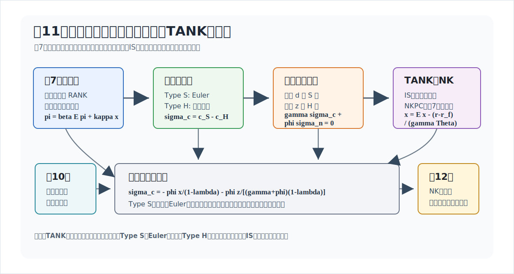
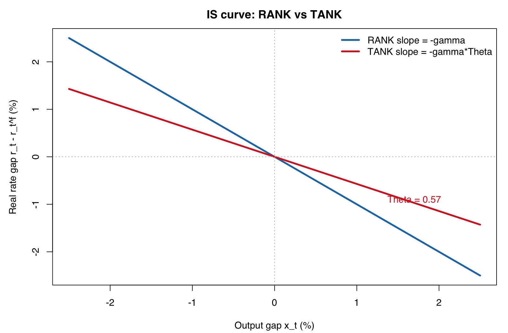
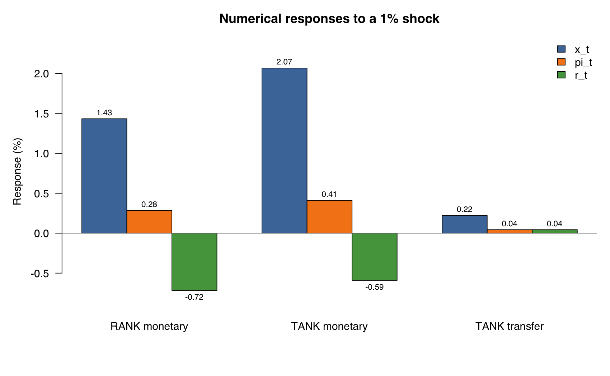

# 講義の目的

第11回では、第7回の価格硬直性モデルを **TANK (Two-Agent New Keynesian) モデル** に拡張します。第7回と同じく
$$
\alpha=0
$$
と置き、政府支出は導入しません。新しく加えるのは、代表的家計ではなく、2種類の家計が存在するという点です。

TANKモデルでは、家計は次の2タイプに分かれます。

| タイプ | 呼び方 | 役割 |
|---|---|---|
| Type H | 流動性制約家計（hand-to-mouth） | 資産を取引せず、現在所得を消費する |
| Type S | 貯蓄家計（saver） | 名目債券を取引し、企業配当を受け取る |

第7回の RANKモデルでは、1つの代表的家計の Euler 方程式がそのまま集計需要を決めました。第11回では、Euler 方程式を満たすのは Type S 家計だけです。Type H 家計は現在所得で消費します。したがって、集計需要を理解するには、消費格差と労働格差を追跡する必要があります。

この回で最初に押さえるべき式は、消費格差と労働格差を使った次の3本の TANK版 NK方程式です。消費格差を
$$
\sigma_t^c\equiv c_t^S-c_t^H
$$
労働格差を
$$
\sigma_t^n\equiv n_t^S-n_t^H
$$
と定義します。このとき、価格硬直性をもつ TANKモデルは、第7回の3本の NK方程式を次のように拡張した形で読めます。
$$
\begin{aligned}
x_t
&=
\mathbb{E}_t x_{t+1}
-\frac{1}{\gamma}(r_t-r_t^f)
+
\lambda\mathbb{E}_t\Delta\sigma_{t+1}^c,
\\
\pi_t
&=
\beta\mathbb{E}_t\pi_{t+1}
+
\kappa x_t,
\\
r_t
&=
\phi\pi_t-\mathbb{E}_t\pi_{t+1}-m_t.
\end{aligned}
$$
ここで $\Delta\sigma_{t+1}^c=\sigma_{t+1}^c-\sigma_t^c$、$\kappa_P=\psi_p/\eta_p$、$\kappa=\kappa_P(\gamma+\varphi)$ です。

第1式は TANK の IS 曲線です。実質利子率が動かすのは集計消費ではなく Type S 家計の消費なので、消費格差の期待変化が入ります。第2式は NKフィリップス曲線です。価格硬直性だけで賃金が共通なら、実質限界費用は第7回と同じく需給ギャップだけで表せます。労働格差 $\sigma_t^n$ は3本の NK方程式には直接入らず、共通賃金条件を通じて消費格差と結びつきます。第3式は、第7回と同じテイラー・ルールです。

分配ブロックまで解くと、消費格差は需給ギャップと移転で表せます。その結果、再分配ショックがなければ、TANK は第7回の IS 曲線と同じ形を保ちますが、実質利子率への感応度が大きくなります。この閉じた形は、後の分配ブロックで導出します。

@fig-lecture11-overview は、この回の流れをまとめています。第11回の中心は、価格設定ブロックではなく、Type S 家計の Euler 方程式と Type H 家計の現在所得制約を、分配ブロックを通じて IS 曲線へ戻すことです。

{#fig-lecture11-overview width=95%}

# 表記

大文字は水準、小文字は定常状態からの対数乖離を表します。ただし、企業配当 $d_t$ と移転 $z_t$ は例外です。定常状態の配当や移転がゼロの場合、対数乖離は定義できません。この講義では、$d_t$ と $z_t$ を、定常消費（同じ正規化のもとでは定常産出）で割った実質配当・実質移転の一次近似として扱います。

第11回では、第7回の売上補助金の記号 $\sigma$ と混同しないように、補助金の記号は使いません。定常状態のマークアップ歪みは補助金で取り除かれていると考えます。

主な変数は次の通りです。

| 記号 | 意味 |
|---|---|
| $C_t^H,C_t^S$ | Type H、Type S の消費 |
| $N_t^H,N_t^S$ | Type H、Type S の労働 |
| $W_t$ | 共通の実質賃金 |
| $C_t,N_t$ | 集計消費、集計労働 |
| $Y_t$ | 産出 |
| $A_t=\exp(a_t)$ | 技術水準 |
| $D_t$ | 企業配当 |
| $Z_t$ | Type H 家計への移転 |
| $R_t^N$ | 粗名目利子率 |
| $\Pi_t$ | 価格の粗インフレ率 |

対数乖離変数と一次近似変数は次の通りです。

| 記号 | 意味 |
|---|---|
| $c_t^H,c_t^S,c_t$ | タイプ別消費と集計消費 |
| $n_t^H,n_t^S,n_t$ | タイプ別労働と集計労働 |
| $w_t$ | 共通の実質賃金 |
| $\pi_t$ | 価格インフレ率 |
| $r_t^N$ | 名目利子率 |
| $r_t=r_t^N-\mathbb{E}_t\pi_{t+1}$ | 事前実質利子率 |
| $mc_t$ | 実質限界費用 |
| $y_t^f$ | 柔軟価格の自然産出量 |
| $r_t^f$ | 自然実質利子率 |
| $x_t=y_t-y_t^f$ | 第7回ベンチマークに対する需給ギャップ |
| $m_t$ | 金融政策ショック。$m_t>0$ は金融緩和ショック |
| $d_t$ | 企業配当を定常消費で割った一次近似 |
| $z_t$ | Type H 家計一人当たり移転を定常消費で割った一次近似 |
| $\sigma_t^c=c_t^S-c_t^H$ | 消費格差 |
| $\sigma_t^n=n_t^S-n_t^H$ | 労働格差 |

パラメータは第7回の記号を維持します。新しいパラメータは、Type H 家計の人口比率 $\lambda\in[0,1)$ です。$\lambda=0$ とすれば、Type H 家計が存在しないため RANKモデルに戻ります。

| 記号 | 意味 |
|---|---|
| $\beta$ | 割引因子 |
| $\gamma$ | 異時点間代替の逆弾力性 |
| $\varphi$ | 労働供給弾力性の逆数 |
| $\lambda$ | Type H 家計の人口比率 |
| $\psi_p$ | 財の代替弾力性 |
| $\eta_p$ | 価格調整費用パラメータ |
| $\kappa_P=\psi_p/\eta_p$ | 実質限界費用に対する価格インフレ率の傾き |
| $\kappa=\kappa_P(\gamma+\varphi)$ | 需給ギャップに対する NKフィリップス曲線の傾き |
| $\phi$ | テイラー・ルールのインフレ反応係数 |
| $\rho_m,\rho_z$ | 金融政策ショックと再分配ショックの持続性 |
| $\Theta_T=1-\lambda\varphi/(1-\lambda)$ | 閉じた IS 曲線の利子率感応度を決める係数 |
| $\tau_D$ | 第12回で使う配当再分配ルールのパラメータ |
| $\Theta_D$ | 配当再分配ルールを入れたときの $\Theta_T$ に対応する係数 |
| $\chi$ | Bilbiie 型表記で所得フィードバックを表す合成パラメータ |

`rank_tank_rigidity_models_memo.qmd` の一般形では、二重硬直性へ拡張しやすいように労働パッカーと労働タイプ間の代替弾力性 $\psi_w$ を残しています。この第11回では価格硬直性だけを扱うため、
$$
\psi_w\to\infty
$$
の極限をとり、労働タイプを完全代替として扱います。この極限ではタイプ別賃金を分ける必要がなくなり、共通賃金 $w_t$ を使えます。

# 第7回から何を変えるか

第7回では、代表的家計の Euler 方程式、柔軟賃金条件、生産関数から
$$
mc_t=(\gamma+\varphi)y_t-(1+\varphi)a_t
$$
を得ました。これを自然産出量で引き直すと
$$
mc_t=(\gamma+\varphi)x_t
$$
となり、3本の NK方程式が得られました。

第11回で変わるのは、家計ブロックです。代表的家計の消費 $c_t$ がそのまま Euler 方程式に入るのではなく、Type S の消費 $c_t^S$ が入ります。また、Type H と Type S は同じ賃金に直面しますが、消費が異なるため、労働供給はタイプ間で異なりえます。この差を労働格差 $\sigma_t^n$ として追跡します。

一方で、企業の価格設定ブロックは第7回と同じです。価格硬直性から
$$
\pi_t
=
\beta\mathbb{E}_t\pi_{t+1}
+
\kappa_P mc_t
$$
が得られます。したがって、第11回の仕事は、TANK の家計ブロックから IS 曲線がどう変わるか、そして価格硬直性だけなら $mc_t$ がなぜ第7回と同じ形に戻るかを確認することにあります。

# 対数線形化と方程式リスト

第11回の対数線形化された体系は、次の方程式リストにまとめられます。第7回と同じ価格設定ブロックに、Type別の家計ブロックと分配ブロックを加えたものです。

| No. | 名称 | 式 |
|---:|---|---|
| 1 | フィッシャー方程式 | $r_t=r_t^N-\mathbb{E}_t\pi_{t+1}$ |
| 2 | Type S Euler 方程式 | $r_t=\gamma\mathbb{E}_t\Delta c^S_{t+1}$ |
| 3 | 消費の集計と格差 | $c_t=\lambda c_t^H+(1-\lambda)c_t^S,\quad \sigma_t^c=c_t^S-c_t^H$ |
| 4 | 労働の集計と格差 | $n_t=\lambda n_t^H+(1-\lambda)n_t^S,\quad \sigma_t^n=n_t^S-n_t^H$ |
| 5 | Type H 現在所得制約 | $c_t^H=w_t+n_t^H+z_t$ |
| 6 | Type S 予算制約 | $c_t^S=w_t+n_t^S+\dfrac{1}{1-\lambda}d_t-\dfrac{\lambda}{1-\lambda}z_t$ |
| 7 | 共通の柔軟賃金条件 | $w_t=\gamma c_t^H+\varphi n_t^H=\gamma c_t^S+\varphi n_t^S$ |
| 8 | 生産関数 | $y_t=a_t+n_t$ |
| 9 | 資源制約 | $y_t=c_t$ |
| 10 | 実質限界費用 | $mc_t=w_t-a_t$ |
| 11 | 配当の一次近似 | $d_t=y_t-(w_t+n_t)$ |
| 12 | NKフィリップス曲線 | $\pi_t=\beta\mathbb{E}_t\pi_{t+1}+\kappa_P mc_t$ |
| 13 | テイラー・ルール | $r_t^N=\phi\pi_t-m_t$ |
| 14 | 技術ショック | $a_t=\rho_a a_{t-1}+e_t^a$ |
| 15 | 金融政策ショック | $m_t=\rho_m m_{t-1}+e_t^m$ |
| 16 | 再分配ショック | $z_t=\rho_z z_{t-1}+e_t^z$ |

: {tbl-colwidths="[6,28,66]"}

第7回に戻すには、Type H と Type S の区別を取り除き、$c_t^S=c_t^H=c_t$、$n_t^S=n_t^H=n_t$、$\sigma_t^c=\sigma_t^n=0$ と置きます。すると、2番は代表的家計の Euler 方程式に戻り、7番は第7回の労働供給式
$$
w_t=\gamma c_t+\varphi n_t
$$
になります。また、5番、6番、11番、16番は分配を追跡するための追加ブロックなので、第7回の体系では不要です。残る価格設定ブロックは第7回と同じで、10番と12番から
$$
\pi_t=\beta\mathbb{E}_t\pi_{t+1}+\kappa_P mc_t
$$
を使います。

# 家計ブロック

## 集計と格差

Type H 家計の人口比率を $\lambda$、Type S 家計の人口比率を $1-\lambda$ とします。集計消費と集計労働は
$$
c_t=\lambda c_t^H+(1-\lambda)c_t^S,
\qquad
n_t=\lambda n_t^H+(1-\lambda)n_t^S
$$
です。

消費格差と労働格差を
$$
\sigma_t^c\equiv c_t^S-c_t^H,
\qquad
\sigma_t^n\equiv n_t^S-n_t^H
$$
と定義します。この定義から
$$
\begin{aligned}
c_t^S&=c_t+\lambda\sigma_t^c,
&
c_t^H&=c_t-(1-\lambda)\sigma_t^c,
\\
n_t^S&=n_t+\lambda\sigma_t^n,
&
n_t^H&=n_t-(1-\lambda)\sigma_t^n.
\end{aligned}
$$
Type S の消費が Type H より大きいとき、$\sigma_t^c>0$ です。Type S の労働が Type H より大きいとき、$\sigma_t^n>0$ です。

## Type S の Euler 方程式

Type S 家計は名目債券を取引します。したがって、Type S の Euler 方程式は
$$
r_t
=
\gamma\mathbb{E}_t\Delta c_{t+1}^S
$$
です。第7回と違い、右辺は集計消費 $c_t$ ではなく、Type S の消費 $c_t^S$ です。

財市場の一次近似では、価格調整費用は二次の項なので落ちます。政府支出もないため
$$
y_t=c_t
$$
です。したがって
$$
c_t^S=y_t+\lambda\sigma_t^c
$$
です。これを Euler 方程式に代入すると
$$
r_t
=
\gamma
\mathbb{E}_t
\left[
(y_{t+1}-y_t)
+
\lambda(\sigma_{t+1}^c-\sigma_t^c)
\right].
$$

ここで、第7回と同じ自然産出量 $y_t^f$ を使います。後で見るように、
$$
y_t^f=
\frac{1+\varphi}{\gamma+\varphi}a_t.
$$
自然利子率も第7回と同じく
$$
r_t^f
=
\gamma\mathbb{E}_t(y_{t+1}^f-y_t^f)
$$
と定義します。需給ギャップ $x_t=y_t-y_t^f$ を使うと、TANK の IS 曲線は
$$
x_t
=
\mathbb{E}_t x_{t+1}
-\frac{1}{\gamma}(r_t-r_t^f)
+
\lambda\mathbb{E}_t\Delta\sigma_{t+1}^c
$$
です。

この式が第11回の第1の中心式です。RANK では $c_t^S=c_t$ なので最後の項はありません。TANK では、Type S の消費が集計消費からずれるため、消費格差の期待変化が IS 曲線に入ります。

## Type H の現在所得制約

第10回では、同じ需給ギャップとインフレ率のもとでも、賃金所得と配当所得の分解が価格硬直性だけの場合と異なることを確認しました。TANK では、その所得分解が家計タイプ間の消費格差を直接決めます。

Type H 家計は資産を取引しないため、消費は現在所得に結びつきます。政府支出なし、価格調整費用の一次項なしで書けば、Type H の予算制約は
$$
c_t^H=w_t+n_t^H+z_t
$$
です。ここで $z_t$ は、Type H 家計一人当たり移転を定常消費で割った一次近似です。

Type S 家計は、労働所得に加えて企業配当を受け取り、Type H 家計への移転を負担します。
$$
c_t^S
=
w_t+n_t^S
+
\frac{1}{1-\lambda}d_t
-
\frac{\lambda}{1-\lambda}z_t.
$$
この2本は、消費格差 $\sigma_t^c$ が現在所得、配当、移転で動くことを表します。本編の3本の NK方程式では、$\sigma_t^c$ と $\sigma_t^n$ を分配変数として扱い、詳細な分配ブロックは後で確認します。

# 労働市場と実質限界費用

## 共通賃金と柔軟賃金条件

第11回では、賃金硬直性は入れません。したがって、第10回の労働パッカーや賃金フィリップス曲線は使いません。`rank_tank_rigidity_models_memo.qmd` の一般形から見れば、この講義は $\psi_w\to\infty$ の極限です。Type H と Type S の労働は完全代替になり、両タイプは同じ労働市場で共通の実質賃金 $w_t$ に直面します。

各タイプの柔軟賃金条件は
$$
w_t=\gamma c_t^H+\varphi n_t^H,
\qquad
w_t=\gamma c_t^S+\varphi n_t^S
$$
です。同じ賃金 $w_t$ が両方の式の左辺にあることが重要です。この2本を引くと
$$
\gamma\sigma_t^c+\varphi\sigma_t^n=0
$$
を得ます。消費が高いタイプは、同じ賃金のもとで労働の限界不効用も高いため、労働供給が相対的に低くなります。

さらに、2本の柔軟賃金条件を人口比率で集計すると
$$
w_t=\gamma c_t+\varphi n_t
$$
です。財市場均衡 $c_t=y_t$ と、生産関数
$$
y_t=a_t+n_t
$$
を使うと
$$
w_t
=
\gamma y_t+\varphi(y_t-a_t)
=
(\gamma+\varphi)y_t-\varphi a_t
$$
です。

企業の実質限界費用は、$\alpha=0$ では
$$
mc_t=w_t-a_t
$$
です。したがって
$$
mc_t
=
(\gamma+\varphi)y_t
-
(1+\varphi)a_t
$$
を得ます。これは第7回と同じ式です。

この点が、価格硬直性だけの TANK を簡単にしている理由です。消費格差と労働格差は家計間の分配を動かしますが、共通賃金と柔軟賃金条件を課すと、それらは集計実質賃金の式では相殺されます。したがって、実質限界費用は第7回と同じく、産出と技術だけで表せます。

# 自然産出量と NKフィリップス曲線

第7回との接続を保つため、自然産出量は、第7回と同じく柔軟価格で $mc_t=0$ を満たす産出として定義します。すなわち
$$
0=(\gamma+\varphi)y_t^f-(1+\varphi)a_t
$$
より
$$
y_t^f
=
\frac{1+\varphi}{\gamma+\varphi}a_t.
$$

需給ギャップを
$$
x_t=y_t-y_t^f
$$
と定義します。すると実質限界費用は
$$
mc_t
=
(\gamma+\varphi)x_t.
$$

価格設定ブロックは第7回と同じです。
$$
\pi_t
=
\beta\mathbb{E}_t\pi_{t+1}
+
\kappa_P mc_t.
$$
したがって、TANK の NKフィリップス曲線は
$$
\pi_t
=
\beta\mathbb{E}_t\pi_{t+1}
+
\kappa x_t
$$
です。ただし
$$
\kappa=\kappa_P(\gamma+\varphi)
$$
です。

この式は、第7回の NKフィリップス曲線と同じ形です。価格硬直性だけなら、賃金は共通かつ柔軟なので、消費格差と労働格差は実質限界費用には直接残りません。TANK らしさは、NKフィリップス曲線ではなく、IS 曲線と分配ブロックに現れます。

# 3本の TANK版 NK方程式

以上をまとめると、$\alpha=0$、政府支出なし、価格硬直性をもつ TANKモデルは、次の3本に整理できます。
$$
\begin{aligned}
x_t
&=
\mathbb{E}_t x_{t+1}
-\frac{1}{\gamma}(r_t-r_t^f)
+
\lambda\mathbb{E}_t\Delta\sigma_{t+1}^c,
\\
\pi_t
&=
\beta\mathbb{E}_t\pi_{t+1}
+
\kappa x_t,
\\
r_t
&=
\phi\pi_t-\mathbb{E}_t\pi_{t+1}-m_t.
\end{aligned}
$$

第7回の3本と比べると、変更点は2つです。

1. **IS 曲線**：Euler 方程式を満たすのは Type S なので、消費格差の期待変化 $\mathbb{E}_t\Delta\sigma_{t+1}^c$ が入ります。
2. **NKフィリップス曲線**：価格硬直性だけなら、共通で柔軟な賃金により第7回と同じ形に戻ります。

テイラー・ルールは第7回と同じです。金融政策ショック $m_t>0$ は、同じインフレ率のもとで実質利子率を下げる金融緩和ショックとして読めます。

# 分配ブロックの読み方

3本の TANK版 NK方程式だけでは、$\sigma_t^c$ と $\sigma_t^n$ の動きはまだ決まりません。これらは、Type H 家計と Type S 家計の予算制約、柔軟賃金条件、移転ルール、配当の帰属によって決まります。

政府支出なし、価格調整費用の一次項なしでは、定常消費で割った実質配当の一次近似は
$$
d_t=y_t-(w_t+n_t)
$$
です。ここでも $d_t$ は配当のログ乖離ではありません。Type H 家計と Type S 家計の予算制約を引くと、共通賃金 $w_t$ は消えるため、消費格差は
$$
\sigma_t^c
=
\sigma_t^n
+
\frac{1}{1-\lambda}d_t
-
\frac{1}{1-\lambda}z_t
$$
と書けます。

この式は、一般形の労働パッカーを使った場合の
$$
\sigma_t^c
=
\left(1-\frac{1}{\psi_w}\right)\sigma_t^n
+
\frac{1}{1-\lambda}(d_t-z_t)
$$
で $\psi_w\to\infty$ としたものです。完全代替の極限では、賃金差による項が消え、労働格差の係数は1になります。

この式は、TANK の分配チャネルをよく表しています。配当 $d_t$ は Type S 家計に入り、移転 $z_t$ は Type H 家計に入ります。したがって、配当と移転は消費格差を反対方向に動かします。

## 分配ブロックを解く

柔軟賃金条件からは
$$
\gamma\sigma_t^c
+
\varphi\sigma_t^n
=0
$$
も得られます。ここから実際に $\sigma_t^c,\sigma_t^n$ を解きます。

まず、柔軟賃金条件を
$$
\sigma_t^n=-\frac{\gamma}{\varphi}\sigma_t^c
$$
と書き直します。これを消費格差の式に代入すると
$$
\sigma_t^c
=
-
\frac{\gamma}{\varphi}\sigma_t^c
+
\frac{1}{1-\lambda}(d_t-z_t)
$$
です。したがって
$$
\left(1+\frac{\gamma}{\varphi}\right)\sigma_t^c
=
\frac{1}{1-\lambda}(d_t-z_t)
$$
となり、
$$
\sigma_t^c
=
\frac{\varphi}{\gamma+\varphi}
\frac{d_t-z_t}{1-\lambda}
$$
を得ます。労働格差は
$$
\sigma_t^n
=
-
\frac{\gamma}{\gamma+\varphi}
\frac{d_t-z_t}{1-\lambda}
$$
です。

さらに、$\alpha=0$ では
$$
d_t=y_t-(w_t+n_t)=-mc_t=-(\gamma+\varphi)x_t
$$
です。したがって、格差を需給ギャップと移転だけで書けば
$$
\sigma_t^c
=
-
\frac{\varphi}{1-\lambda}x_t
-
\frac{\varphi}{(\gamma+\varphi)(1-\lambda)}z_t,
$$
$$
\sigma_t^n
=
\frac{\gamma}{1-\lambda}x_t
+
\frac{\gamma}{(\gamma+\varphi)(1-\lambda)}z_t.
$$

最後に、この $\sigma_t^c$ を TANK の IS 曲線に代入します。$\Theta_T\equiv 1-\lambda\varphi/(1-\lambda)$ と置くと、
$$
\Theta_T x_t
=
\Theta_T\mathbb{E}_t x_{t+1}
-
\frac{1}{\gamma}(r_t-r_t^f)
-
\frac{\lambda\varphi}{(\gamma+\varphi)(1-\lambda)}
\mathbb{E}_t\Delta z_{t+1}.
$$
したがって、$\Theta_T\neq0$ なら
$$
x_t
=
\mathbb{E}_t x_{t+1}
-
\frac{1}{\gamma\Theta_T}(r_t-r_t^f)
-
\frac{\lambda\varphi}{(\gamma+\varphi)(1-\lambda)\Theta_T}
\mathbb{E}_t\Delta z_{t+1}.
$$
これが、分配ブロックを解いたあとの閉じた IS 曲線です。第11回の本筋は、RANK の IS 曲線が、Type S の Euler 方程式と分配ブロックを通じてどう変わるかを理解することです。

# RANK との比較とショック

分配ブロックを解いた後の3本は
$$
\begin{aligned}
x_t
&=
\mathbb{E}_t x_{t+1}
-
\frac{1}{\gamma\Theta_T}(r_t-r_t^f)
-
\frac{\lambda\varphi}{(\gamma+\varphi)(1-\lambda)\Theta_T}
\mathbb{E}_t\Delta z_{t+1},
\\
\pi_t
&=
\beta\mathbb{E}_t\pi_{t+1}
+
\kappa x_t,
\\
r_t
&=
\phi\pi_t-\mathbb{E}_t\pi_{t+1}-m_t,
\end{aligned}
$$
です。ここで
$$
\Theta_T=1-\frac{\lambda\varphi}{1-\lambda}.
$$
これは
$$
\Theta_T
=
\frac{1-\lambda(1+\varphi)}{1-\lambda}
$$
とも書けます。
以下では、まず通常の領域
$$
0<\Theta_T<1
$$
を考えます。Type H 家計が存在する $\lambda>0$ の TANK では、これは $0<\lambda<1/(1+\varphi)$ に対応します。この条件のもとでは、TANK の IS 曲線は RANK よりも実質利子率に敏感です。
逆に $\Theta_T\leq0$ の領域では、IS 曲線の符号が反転するため、通常の需要曲線としては読みにくくなります。この回では、まず $0<\Theta_T<1$ の通常領域に集中します。

## IS 曲線の傾き

RANK の IS 曲線は
$$
x_t=\mathbb{E}_t x_{t+1}-\frac{1}{\gamma}(r_t-r_t^f)
$$
でした。TANK では、再分配ショックを固定すれば
$$
x_t=\mathbb{E}_t x_{t+1}-\frac{1}{\gamma\Theta_T}(r_t-r_t^f)
$$
です。したがって、同じ $r_t$ の上昇は、RANK よりも大きく $x_t$ を下げます。係数を比べると
$$
\frac{1}{\gamma\Theta_T}>\frac{1}{\gamma}
$$
です。

縦軸に実質利子率 $r_t$、横軸に需給ギャップ $x_t$ を置くと、この違いは IS 曲線の傾きとして読めます。再分配ショックを固定して式を $r_t$ について解くと
$$
r_t
=
r_t^f
+
\gamma\Theta_T(\mathbb{E}_t x_{t+1}-x_t).
$$
したがって、IS 曲線の傾きは
$$
\frac{\partial r_t}{\partial x_t}
=
-\gamma\Theta_T
$$
です。RANK では傾きが $-\gamma$ なので、$0<\Theta_T<1$ の TANK では IS 曲線がよりフラットになります。同じ実質利子率の低下が、より大きな需要拡大を生む、ということです。

{#fig-lecture11-is width=85%}

## 金融政策ショック

この性質を使うと、第8回と同じ手順で貨幣ショック、つまり金融政策ショックの効果を明示できます。手順は、AR(1) のショック過程を置き、解がショックに比例すると予想し、NKフィリップス曲線で $\pi_t$ を $x_t$ に戻し、IS 曲線とテイラー・ルールを等置する、というものです。

金融緩和ショック $m_t>0$ だけを考え、$a_t=z_t=0$、$r_t^f=0$ とします。ショックは
$$
m_{t+1}=\rho_m m_t+e_{t+1}^m
$$
に従うとし、$0\leq\rho_m<1$ とします。また、比較のため通常の能動的政策領域として $\phi>\rho_m$ を考えます。解が $m_t$ に比例すると予想すると、NKフィリップス曲線から
$$
\pi_t=\kappa_m x_t,
\qquad
\kappa_m\equiv\frac{\kappa}{1-\beta\rho_m}
$$
です。テイラー・ルールから
$$
r_t=(\phi-\rho_m)\pi_t-m_t
$$
です。一方、TANK の IS 曲線から
$$
r_t=-\gamma\Theta_T(1-\rho_m)x_t
$$
です。これらを組み合わせると
$$
x_t=\Omega_T m_t,
\qquad
\Omega_T
\equiv
\frac{1}
{\kappa_m(\phi-\rho_m)+\gamma\Theta_T(1-\rho_m)}.
$$
したがって
$$
\pi_t=\kappa_m\Omega_T m_t,
\qquad
r_t=-\gamma\Theta_T(1-\rho_m)\Omega_T m_t.
$$

第8回の RANK では、同じ係数は
$$
\Omega_R
\equiv
\frac{1}
{\kappa_m(\phi-\rho_m)+\gamma(1-\rho_m)}
$$
でした。上の条件のもとで $0<\Theta_T<1$ なら
$$
\Omega_T>\Omega_R
$$
です。したがって、同じ金融緩和ショック $m_t>0$ は、TANK では RANK よりも大きく需給ギャップとインフレ率を押し上げます。理由は、IS 曲線がフラットになり、同じ実質利子率の変化に対して需要がより大きく動くからです。

この比較が、金融政策ショックを見る主な理由です。TANK の新しさは、金融ショックの符号を変えることではありません。RANK と同じ方向のショックが、Type H 家計の現在所得反応を通じて、集計需要をより大きく動かす点にあります。

## 再分配ショック

再分配ショック $z_t$ も、第8回の政府支出ショックと似た構造で解けます。ただし、$z_t$ は政府購入ではなく Type S 家計から Type H 家計への移転なので、資源制約を直接動かしません。閉じた IS 曲線の $\mathbb{E}_t\Delta z_{t+1}$ 項を通じて需要を動かします。

この節では、第12回で使う内生的な配当分配ルールではなく、外生的な移転ショックとして $z_t$ を扱います。ここでは $a_t=m_t=0$、$r_t^f=0$ とし、
$$
z_{t+1}=\rho_z z_t+e_{t+1}^z
$$
とします。ただし $0\leq\rho_z\leq1$ です。閉じた IS 曲線に入る外生項は
$$
-
\frac{\lambda\varphi}{(\gamma+\varphi)(1-\lambda)\Theta_T}
\mathbb{E}_t\Delta z_{t+1}
=
\frac{\lambda\varphi}{(\gamma+\varphi)(1-\lambda)\Theta_T}
(1-\rho_z)z_t
$$
です。したがって、$0\leq\rho_z<1$ なら、Type H 家計への一時的な移転増加は総需要を押し上げます。

解が $z_t$ に比例すると予想します。NKフィリップス曲線から
$$
\pi_t=\kappa_z x_t,
\qquad
\kappa_z\equiv\frac{\kappa}{1-\beta\rho_z}
$$
です。テイラー・ルールから
$$
r_t=(\phi-\rho_z)\pi_t
$$
です。IS 曲線に代入すると、
$$
x_t
=
\Omega_z^T z_t
$$
を得ます。ただし
$$
\Omega_z^T
\equiv
\frac{
\dfrac{\gamma\lambda\varphi}{(\gamma+\varphi)(1-\lambda)}(1-\rho_z)
}
{\kappa_z(\phi-\rho_z)+\gamma\Theta_T(1-\rho_z)}
$$
です。したがって
$$
\pi_t=\kappa_z\Omega_z^T z_t,
\qquad
r_t=(\phi-\rho_z)\kappa_z\Omega_z^T z_t.
$$

この結果は、第8回の政府支出ショックの式と同じ読み方ができます。ショックが一時的であれば、現在の需要が将来需要より相対的に高くなり、需給ギャップとインフレ率が上がります。一方、$\rho_z=1$ の恒久的な再分配なら、上の単純な設定では $\mathbb{E}_t\Delta z_{t+1}=0$ なので、IS 曲線を直接動かしません。ただし、恒久的な移転は $\sigma_t^c$ と $\sigma_t^n$ の水準を変えるため、総需要には出なくても分配には残ります。

## 数値例：ショックの大きさ

金融政策ショックについては、RANK との比較が中心です。次の単純な較正を使うと、どの程度大きさが変わるかが見えます。

| パラメータ | 値 |
|---|---:|
| $\beta$ | 0.99 |
| $\gamma$ | 1.00 |
| $\varphi$ | 1.00 |
| $\lambda$ | 0.30 |
| $\kappa$ | 0.10 |
| $\phi$ | 1.50 |
| $\rho_m=\rho_z$ | 0.50 |
| ショックの大きさ | $m_t=z_t=0.01$ |

このとき
$$
\Theta_T
=
1-\frac{0.30}{0.70}
\simeq
0.571,
\qquad
\kappa_m=\kappa_z\simeq0.198
$$
です。金融緩和ショックに対する係数は
$$
\Omega_R\simeq1.43,
\qquad
\Omega_T\simeq2.07
$$
なので、同じ $m_t=0.01$ は、RANK では $x_t$ を約 $1.43\%$、TANK では約 $2.07\%$ 押し上げます。TANK の効果は、この較正では RANK の約 $1.44$ 倍です。

| ショック | モデル | $x_t$ | $\pi_t$ | $r_t$ |
|---|---|---:|---:|---:|
| 金融緩和 $m_t=0.01$ | RANK | 1.43% | 0.28% | -0.72% |
| 金融緩和 $m_t=0.01$ | TANK | 2.07% | 0.41% | -0.59% |
| 再分配 $z_t=0.01$ | TANK | 0.22% | 0.04% | 0.04% |

金融緩和ショックでは、テイラー・ルール自体が下方にシフトするため、実質利子率 $r_t$ は下がります。TANK では需要とインフレ率がより大きく上がるので、内生的な政策反応も強まり、実質利子率の低下幅だけを見ると RANK より小さくなることがあります。重要なのは、同じショックに対する $x_t$ と $\pi_t$ の反応が RANK より大きい点です。

{#fig-lecture11-shock-numerical width=90%}

最後に、RANK への縮約も確認しておきます。Type H 家計が存在しなければ
$$
\lambda=0
$$
なので $\Theta_T=1$ です。このとき、閉じた IS 曲線も金融政策ショックの係数も第8回の RANK に戻ります。この意味で、TANK は RANK を置き換えるモデルではなく、RANK に分配チャネルを追加したモデルです。

# まとめと第12回への接続

この回では、第7回の価格硬直性モデルに、家計の異質性だけを加えました。賃金は共通で柔軟、価格は硬直的です。したがって、NKフィリップス曲線は第7回と同じ
$$
\pi_t=\beta\mathbb{E}_t\pi_{t+1}+\kappa x_t
$$
に戻ります。TANK らしさは、価格設定ブロックではなく、Type S の Euler 方程式と Type H の現在所得制約から来る IS 曲線に現れます。

分配ブロックを解くと、再分配ショックを含む閉じた IS 曲線は
$$
x_t
=
\mathbb{E}_t x_{t+1}
-
\frac{1}{\gamma\Theta_T}(r_t-r_t^f)
-
\frac{\lambda\varphi}{(\gamma+\varphi)(1-\lambda)\Theta_T}
\mathbb{E}_t\Delta z_{t+1}
$$
でした。ここで
$$
\Theta_T=1-\frac{\lambda\varphi}{1-\lambda}.
$$
$0<\Theta_T<1$ なら、IS 曲線は RANK よりフラットになります。したがって、同じ実質利子率の変化や同じ金融政策ショックは、RANK よりも大きく需給ギャップを動かします。

この回では、ここまでを正の分析として扱いました。TANK では消費格差と労働格差も厚生に関わるため、最適金融政策を考えると論点は増えます。ただし、厚生目的関数やターゲット条件まで同じ回に入れると焦点が分散するので、ここでは TANK が IS 曲線とショック反応をどう変えるかに集中します。

| 論点 | 第7回 | 第10回 | 第11回 |
|---|---|---|---|
| 家計 | 代表的家計 | 代表的家計 | Type H と Type S |
| 賃金 | 柔軟 | 硬直的 | 柔軟 |
| 価格 | 硬直的 | 硬直的 | 硬直的 |
| 追加される変数 | なし | $\mu_t^w,\pi_t^w$ | $\sigma_t^c,\sigma_t^n$ |
| IS 曲線 | 集計消費の Euler 方程式 | 集計消費の Euler 方程式 | Type S 消費の Euler 方程式 |
| NKPC | $\kappa x_t$ | 価格・賃金マークアップ | $\kappa x_t$ |

第12回では、同じ TANK 構造を **NKクロス** として読み直します。政府支出は入れず、財市場は引き続き $y_t=c_t$ です。ただし、第11回のようにテイラー・ルールと NKフィリップス曲線を前面に出すのではなく、実質利子率を所与として、消費関数と所得フィードバックを見ることに集中します。

Bilbiie 型の表記では、配当の一部を Type H 家計に移すルール
$$
z_t=\frac{\tau_D}{\lambda}d_t
$$
を置くことが多いです。第11回では $z_t$ を外生的な移転ショックとして扱いましたが、第12回では配当と連動する内生的な分配ルールとして扱います。このルールを使うと
$$
d_t-z_t
=
\left(1-\frac{\tau_D}{\lambda}\right)d_t
$$
となるため、閉じた IS 曲線の利子率感応度も変わります。具体的には
$$
\Theta_D
=
1-\frac{\lambda\varphi}{1-\lambda}
\left(1-\frac{\tau_D}{\lambda}\right)
$$
を使う形になります。Bilbiie の記号に寄せれば、
$$
\chi
=
1+\varphi\left(1-\frac{\tau_D}{\lambda}\right),
\qquad
\Theta_D
=
\frac{1-\lambda\chi}{1-\lambda}
$$
です。第12回では、この仕組みを Type H 家計の所得弾力性や NKクロスの傾きとして読み替えます。

したがって、第11回から第12回への橋渡しは次の通りです。第11回では「TANK は IS 曲線をどう変えるか」を3本の NK方程式の中で見ました。第12回では、その IS 曲線の背後にある消費関数を取り出し、RANK が「ほとんど直接効果だけ」のモデルであるのに対し、TANK では現在所得への反応と一般均衡フィードバックが金融政策の効果を増幅しうることを確認します。

# 演習問題

## 基本問題

**問1：集計と格差**

消費格差を $\sigma_t^c=c_t^S-c_t^H$ と定義する。集計消費
$$
c_t=\lambda c_t^H+(1-\lambda)c_t^S
$$
を使って、
$$
c_t^S=c_t+\lambda\sigma_t^c,
\qquad
c_t^H=c_t-(1-\lambda)\sigma_t^c
$$
を示しなさい。

**問2：TANK の IS 曲線**

Type S の Euler 方程式
$$
r_t=\gamma\mathbb{E}_t\Delta c_{t+1}^S
$$
と $c_t^S=y_t+\lambda\sigma_t^c$ を使い、
$$
x_t
=
\mathbb{E}_t x_{t+1}
-\frac{1}{\gamma}(r_t-r_t^f)
+
\lambda\mathbb{E}_t\Delta\sigma_{t+1}^c
$$
を導出しなさい。

**問3：実質限界費用**

共通賃金の柔軟賃金条件と生産関数を使い、
$$
mc_t
=
(\gamma+\varphi)x_t
$$
を導出しなさい。消費格差と労働格差が、この式に直接残らない理由も説明しなさい。

**問4：RANK への縮約**

$\lambda=0$ のとき、第11回の3本の TANK版 NK方程式が第7回の3本の NK方程式に戻ることを確認しなさい。

**問5：柔軟賃金の整合性条件**

Type H と Type S の柔軟賃金条件を引き、
$$
\gamma\sigma_t^c
+
\varphi\sigma_t^n
=0
$$
を導出しなさい。さらに、消費格差の式
$$
\sigma_t^c
=
\sigma_t^n
+
\frac{1}{1-\lambda}(d_t-z_t)
$$
と組み合わせて、
$$
\sigma_t^c
=
\frac{\varphi}{\gamma+\varphi}
\frac{d_t-z_t}{1-\lambda},
\qquad
\sigma_t^n
=
-
\frac{\gamma}{\gamma+\varphi}
\frac{d_t-z_t}{1-\lambda}
$$
を導出しなさい。

**問6：閉じた IS 曲線**

$d_t=-(\gamma+\varphi)x_t$ を使って $\sigma_t^c$ を $x_t,z_t$ で表し、それを TANK の IS 曲線に代入しなさい。$\Theta_T=1-\lambda\varphi/(1-\lambda)$ と置いたとき、
$$
x_t
=
\mathbb{E}_t x_{t+1}
-
\frac{1}{\gamma\Theta_T}(r_t-r_t^f)
-
\frac{\lambda\varphi}{(\gamma+\varphi)(1-\lambda)\Theta_T}
\mathbb{E}_t\Delta z_{t+1}
$$
が得られることを確認しなさい。

## 発展問題

**問7：金融緩和ショック**

再分配ショックと技術ショックをゼロにし、$m_{t+1}=\rho_m m_t+e_{t+1}^m$ とする。第8回と同じ手順で
$$
x_t=\Omega_T m_t,
\qquad
\Omega_T=
\frac{1}
{\kappa_m(\phi-\rho_m)+\gamma\Theta_T(1-\rho_m)}
$$
を導出しなさい。$0<\Theta_T<1$ のとき、なぜ $\Omega_T$ が RANK の係数より大きくなるのか説明しなさい。

**問8：再分配ショック**

金融政策ショックと技術ショックをゼロにし、$z_{t+1}=\rho_z z_t+e_{t+1}^z$ とする。閉じた IS 曲線を使って
$$
x_t=\Omega_z^T z_t,
\qquad
\Omega_z^T
=
\frac{
\dfrac{\gamma\lambda\varphi}{(\gamma+\varphi)(1-\lambda)}(1-\rho_z)
}
{\kappa_z(\phi-\rho_z)+\gamma\Theta_T(1-\rho_z)}
$$
を導出しなさい。ただし $\kappa_z=\kappa/(1-\beta\rho_z)$ である。$\rho_z=1$ のときに効果が消える理由も説明しなさい。
